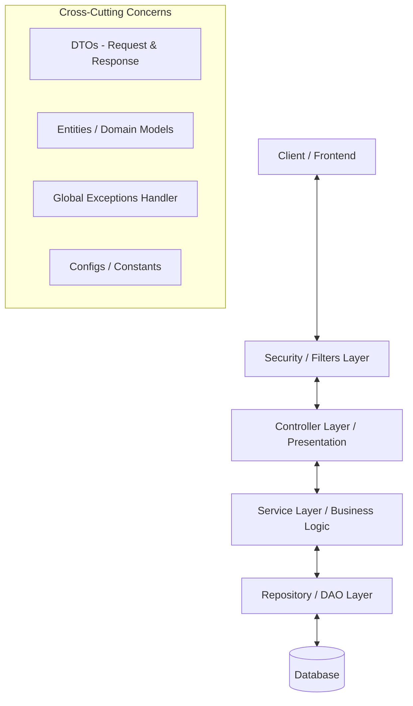
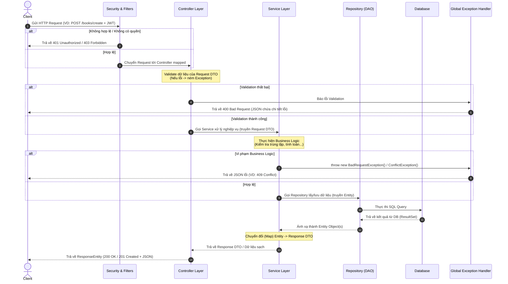

# Hướng Dẫn Cấu Trúc Thư Mục & Luồng Hoạt Động Spring Boot Backend

Tài liệu này định nghĩa cấu trúc thư mục tiêu chuẩn, luồng hoạt động (request lifecycle) và các ví dụ thực tế cho dự án Spring Boot Backend. Tài liệu được thiết kế như một khuôn mẫu (template) chuẩn để áp dụng cho các dự án phát triển backend khác.

---

## 1. Kiến Trúc Tổng Quan (Layered Architecture)

Hệ thống sử dụng mô hình **Layered Architecture (Kiến trúc phân tầng)** với nguyên tắc **Separation of Concerns (Phân tách mối quan tâm)**. Mỗi tầng thực hiện một nhiệm vụ chuyên biệt:



---

## 2. Chi Tiết Cấu Trúc Thư Mục

Dưới đây là cấu trúc gói (package) chuẩn trong thư mục `src/main/java/com/example/backend/`:

```text
backend/
│
├── config/             # Chứa cấu hình ứng dụng (Security, CORS, Cloudinary, Swagger...)
├── controller/         # Tiếp nhận HTTP Request, validate dữ liệu đầu vào, trả về HTTP Response
├── dao/                # (Data Access Object / Repository) Tương tác với DB qua Spring Data JPA
├── dto/                # Data Transfer Object (Dữ liệu truyền tải giữa Client và Server)
│   ├── request/        # Các DTO nhận từ client gửi lên (validate qua JSR-380)
│   └── response/       # Các DTO trả về cho client (lọc dữ liệu thừa, ẩn thông tin nhạy cảm)
├── entity/             # Đại diện cho các bảng trong Database (JPA Entities)
├── exception/          # Các custom exception và Global Exception Handler toàn hệ thống
├── mapper/             # Chứa các interface/class dùng để map Entity <-> DTO (MapStruct)
├── security/           # Cấu hình bảo mật, JWT Filter, User Details Service
└── service/            # Chứa Logic nghiệp vụ (Business Logic) của dự án
```

### Bảng Mô Tả Chức Năng

| Tên Thư Mục | Chức Năng | Quy Tắc Cần Nhớ |
| :--- | :--- | :--- |
| **`entity`** | Định nghĩa các lớp ánh xạ trực tiếp xuống Database. | Không dùng Entity để trả trực tiếp cho Client. Chỉ chứa các annotations JPA (`@Entity`, `@Table`, `@Column`, `@Id`...). |
| **`dto`** | Chứa các Class vận chuyển dữ liệu. Chia làm `request` (nhận) và `response` (trả đi). | Chứa `@NotBlank`, `@Min`, `@Max` để validate dữ liệu từ Client ngay tại cổng. |
| **`controller`** | Điều hướng API (End-points). Nhận request, gọi Service xử lý và trả về `ResponseEntity`. | **Tuyệt đối không viết logic nghiệp vụ tại đây**. Chỉ kiểm tra tính hợp lệ sơ bộ bằng `@Valid` và định dạng phản hồi. |
| **`service`** | Chứa toàn bộ nghiệp vụ của ứng dụng (kiểm tra tính hợp lý của dữ liệu, gọi DB, xử lý thuật toán...). | Nên chia làm 1 **Interface** định nghĩa phương thức và 1 lớp **Implementation (Imp)** để thực thi phương thức đó. |
| **`dao` (Repository)** | Kết nối trực tiếp với DB. Kế thừa `JpaRepository` để có sẵn các CRUD method cơ bản. | Viết các Custom Query (`@Query`) hoặc Specification tại đây. Tên file thường kết thúc bằng `Repository`. |
| **`mapper`** | Chuyển đổi qua lại giữa Entity và DTO (sử dụng MapStruct). | Giúp tách biệt logic mapping ra khỏi Service để Service tập trung vào Business Logic. |
| **`exception`** | Xử lý lỗi tập trung. Chứa các lỗi tự định nghĩa và `GlobalExceptionHandler` để format response lỗi trả về. | Mọi Controller/Service khi xảy ra lỗi logic sẽ chủ động ném (`throw`) ra các Custom Exception của thư mục này. |
| **`config`** | Nơi khởi tạo các `@Bean` của bên thứ 3 (Spring Security, Cors, Mailer, Cloudinary...). | Các class cấu hình phải đánh dấu `@Configuration`. |
| **`security`** | Quản lý phân quyền, xử lý Token JWT, phân tách quyền truy cập API của admin/user. | Chứa các bộ lọc request (Filter) để chặn/cho phép request trước khi vào Controller. |

### 2.1. Phân Chia Thư Mục Con Theo Module / Feature (Quy Tắc Đóng Gói)

Trong các thư mục tầng chính (`controller`, `service`, `dao`, `entity`, `dto`, `mapper`), các lớp được phân chia nhỏ thành các thư mục con theo từng Module / Tính năng / Đối tượng (ví dụ: `book`, `user`, `cart`, `order`, `coupon`...).

#### Lý do phân chia thư mục con theo Module:
1. **Dễ quản lý (Scalability):** Khi dự án mở rộng, số lượng file sẽ tăng lên rất nhiều. Việc chia nhóm giúp giữ cho cấu trúc dự án ngăn nắp và tránh việc thư mục chứa quá nhiều file độc lập.
2. **Dễ bảo trì (Maintainability):** Khi cần sửa lỗi hoặc nâng cấp tính năng của một Module (ví dụ: `order`), lập trình viên có thể tập trung thao tác trong thư mục của Module đó ở mỗi tầng.
3. **Tránh xung đột đặt tên:** Các module khác nhau có thể có các class có chức năng tương tự nhưng thuộc ngữ cảnh khác nhau.

#### Minh họa cấu trúc gói thực tế (Hybrid Package-by-Layer-with-Feature):
```text
backend/src/main/java/com/example/backend/
├── controller/
│   ├── book/           # BookController.java
│   ├── cart/           # CartController.java
│   └── order/          # OrderController.java
├── service/
│   ├── book/           # BookService.java, BookServiceImp.java
│   ├── cart/           # CartService.java, CartServiceImp.java
│   └── order/          # OrderService.java, OrderServiceImp.java
├── dao/ (Repository)
│   ├── book/           # BookRepository.java
│   ├── cart/           # CartItemRepository.java
│   └── order/          # OrderRepository.java
├── mapper/
│   ├── book/           # BookMapper.java (Interface của MapStruct)
│   ├── cart/           # CartMapper.java
│   └── order/          # OrderMapper.java
└── entity/
    ├── book/           # Book.java, Genre.java
    ├── cart/           # CartItem.java
    └── order/          # Order.java, OrderDetail.java
```

> [!TIP]
> **Quy tắc đặt tên gói (package):** Luôn viết thường hoàn toàn tên package (VD: `book`, `cart`, `notification`). Tránh dùng ký tự in hoa hoặc dấu gạch dưới trong tên package.

---

## 3. Luồng Hoạt Động (Request & Response Flow)

Khi một Client gửi yêu cầu (Request) tới Backend, hệ thống sẽ thực hiện theo tuần tự sau:



---

## 4. Ví Dụ Minh Họa Thực Tế Cho Từng Thư Mục

Dưới đây là mã nguồn minh họa chi tiết cho chức năng **"Thêm mới một cuốn sách"** thông qua đầy đủ các tầng thư mục.

### 4.1. Thư mục `entity`
Định nghĩa cấu trúc dữ liệu lưu trong database.
*   **Đường dẫn:** `src/main/java/com/example/backend/entity/book/Book.java`

```java
package com.example.backend.entity.book;

import jakarta.persistence.*;
import lombok.*;

@Data
@Entity
@Builder
@NoArgsConstructor
@AllArgsConstructor
@Table(name = "book")
public class Book {
    @Id
    @GeneratedValue(strategy = GenerationType.IDENTITY)
    @Column(name = "id_book")
    private int idBook;

    @Column(name = "name_book", columnDefinition = "NVARCHAR(255)", nullable = false)
    private String nameBook;

    @Column(name = "author", columnDefinition = "NVARCHAR(255)")
    private String author;

    @Column(name = "list_price")
    private double listPrice;

    @Column(name = "quantity")
    private int quantity;
}
```

### 4.2. Thư mục `dto/request`
Nhận và kiểm tra tính hợp lệ dữ liệu từ Client gửi lên.
*   **Đường dẫn:** `src/main/java/com/example/backend/dto/request/book/BookCreateRequest.java`

```java
package com.example.backend.dto.request.book;

import jakarta.validation.constraints.*;
import lombok.Data;

@Data
public class BookCreateRequest {
    @NotBlank(message = "Tên sách không được để trống")
    private String nameBook;

    @NotBlank(message = "Tác giả không được để trống")
    private String author;

    @Positive(message = "Giá niêm yết phải lớn hơn 0")
    private double listPrice;

    @Min(value = 0, message = "Số lượng phải lớn hơn hoặc bằng 0")
    private int quantity;
}
```

### 4.3. Thư mục `dto/response`
Định dạng dữ liệu trả ra cho client (ẩn các trường không cần thiết như mật khẩu, log hệ thống, id nội bộ phức tạp).
*   **Đường dẫn:** `src/main/java/com/example/backend/dto/response/book/BookResponse.java`

```java
package com.example.backend.dto.response.book;

import lombok.Builder;
import lombok.Data;

@Data
@Builder
public class BookResponse {
    private int idBook;
    private String nameBook;
    private String author;
    private double listPrice;
    private String formattedPrice; // Dữ liệu đã định dạng đẹp (VD: "150,000 VND")
}
```

### 4.4. Thư mục `dao` (Repository)
Giao tiếp với database.
*   **Đường dẫn:** `src/main/java/com/example/backend/dao/book/BookRepository.java`

```java
package com.example.backend.dao.book;

import com.example.backend.entity.book.Book;
import org.springframework.data.jpa.repository.JpaRepository;
import org.springframework.stereotype.Repository;
import java.util.Optional;

@Repository
public interface BookRepository extends JpaRepository<Book, Integer> {
    // Phương thức custom kiểm tra sự tồn tại của sách trùng tên
    boolean existsByNameBook(String nameBook);
    
    Optional<Book> findByNameBook(String nameBook);
}
```

### 4.5. Thư mục `mapper`
Chuyển đổi dữ liệu qua lại giữa Entity và DTO bằng MapStruct.
*   **Đường dẫn:** `src/main/java/com/example/backend/mapper/book/BookMapper.java`

```java
package com.example.backend.mapper.book;

import com.example.backend.dto.request.book.BookCreateRequest;
import com.example.backend.dto.response.book.BookResponse;
import com.example.backend.entity.book.Book;
import org.mapstruct.Mapper;
import org.mapstruct.Mapping;

@Mapper(componentModel = "spring")
public interface BookMapper {
    // Ánh xạ từ Entity sang Response DTO (định dạng thêm trường formattedPrice)
    @Mapping(target = "formattedPrice", expression = "java(String.format(\"%,.0f VND\", book.getListPrice()))")
    BookResponse toResponse(Book book);

    // Ánh xạ từ Request DTO sang Entity
    Book toEntity(BookCreateRequest request);
}
```

> [!NOTE]
> **Giải thích cơ chế mapping:**
> *   Các thuộc tính có cùng tên và kiểu dữ liệu (như `nameBook`, `author`, `listPrice`) giữa Entity và DTO sẽ được MapStruct tự động ghép cặp và chuyển đổi.
> *   Đối với thuộc tính `formattedPrice` chỉ có ở DTO mà Entity không có, ta sử dụng `@Mapping(target = "...", expression = "java(...)")` để chỉ định công thức định dạng giá trị bằng mã Java động.

### 4.6. Thư mục `exception`
Xử lý lỗi tùy biến toàn cục.

*   **Custom Exception Class:** `src/main/java/com/example/backend/exception/ConflictException.java`
```java
package com.example.backend.exception;

import org.springframework.http.HttpStatus;
import org.springframework.web.bind.annotation.ResponseStatus;

@ResponseStatus(HttpStatus.CONFLICT)
public class ConflictException extends RuntimeException {
    public ConflictException(String message) {
        super(message);
    }
}
```

*   **Global Exception Handler:** `src/main/java/com/example/backend/exception/GlobalExceptionHandler.java`
```java
package com.example.backend.exception;

import org.springframework.http.HttpStatus;
import org.springframework.http.ResponseEntity;
import org.springframework.validation.FieldError;
import org.springframework.web.bind.MethodArgumentNotValidException;
import org.springframework.web.bind.annotation.*;
import java.util.HashMap;
import java.util.Map;

@RestControllerAdvice
public class GlobalExceptionHandler {

    // 1. Bắt lỗi Custom ConflictException
    @ExceptionHandler(ConflictException.class)
    public ResponseEntity<Map<String, Object>> handleConflictException(ConflictException ex) {
        Map<String, Object> error = new HashMap<>();
        error.put("status", HttpStatus.CONFLICT.value());
        error.put("error", "Conflict");
        error.put("message", ex.getMessage());
        return new ResponseEntity<>(error, HttpStatus.CONFLICT);
    }

    // 2. Bắt lỗi Validation (Khi DTO gửi lên thiếu trường hoặc sai định dạng)
    @ExceptionHandler(MethodArgumentNotValidException.class)
    public ResponseEntity<Map<String, Object>> handleValidationExceptions(MethodArgumentNotValidException ex) {
        Map<String, String> errors = new HashMap<>();
        ex.getBindingResult().getAllErrors().forEach((error) -> {
            String fieldName = ((FieldError) error).getField();
            String errorMessage = error.getDefaultMessage();
            errors.put(fieldName, errorMessage);
        });

        Map<String, Object> response = new HashMap<>();
        response.put("status", HttpStatus.BAD_REQUEST.value());
        response.put("error", "Bad Request / Validation Failed");
        response.put("details", errors);
        return new ResponseEntity<>(response, HttpStatus.BAD_REQUEST);
    }
}
```

### 4.7. Thư mục `service`
Thực thi toàn bộ logic nghiệp vụ (kiểm tra điều kiện, gọi Mapper chuyển đổi dữ liệu).

*   **Service Interface:** `src/main/java/com/example/backend/service/book/BookService.java`
```java
package com.example.backend.service.book;

import com.example.backend.dto.request.book.BookCreateRequest;
import com.example.backend.dto.response.book.BookResponse;

public interface BookService {
    // Tầng Service chỉ trả về dữ liệu thô (DTO), không trả về ResponseEntity để tránh phụ thuộc HTTP
    BookResponse createBook(BookCreateRequest request);
}
```

*   **Service Implementation:** `src/main/java/com/example/backend/service/book/BookServiceImp.java`
```java
package com.example.backend.service.book;

import com.example.backend.dao.book.BookRepository;
import com.example.backend.dto.request.book.BookCreateRequest;
import com.example.backend.dto.response.book.BookResponse;
import com.example.backend.entity.book.Book;
import com.example.backend.exception.ConflictException;
import com.example.backend.mapper.book.BookMapper;
import org.springframework.beans.factory.annotation.Autowired;
import org.springframework.stereotype.Service;
import org.springframework.transaction.annotation.Transactional;

@Service
public class BookServiceImp implements BookService {

    @Autowired
    private BookRepository bookRepository;

    @Autowired
    private BookMapper bookMapper; // Inject mapper dùng chung

    @Override
    @Transactional
    public BookResponse createBook(BookCreateRequest request) {
        // 1. Kiểm tra nghiệp vụ (VD: Trùng tên sách)
        if (bookRepository.existsByNameBook(request.getNameBook())) {
            throw new ConflictException("Tên sách này đã tồn tại trong hệ thống!");
        }

        // 2. Sử dụng Mapper chuyển đổi Request DTO sang Entity
        Book book = bookMapper.toEntity(request);

        // 3. Lưu vào Database
        Book savedBook = bookRepository.save(book);

        // 4. Sử dụng Mapper chuyển đổi Entity sang Response DTO và trả về
        return bookMapper.toResponse(savedBook);
    }
}
```

### 4.8. Thư mục `controller`
Mở cổng HTTP API và điều hướng request.
*   **Đường dẫn:** `src/main/java/com/example/backend/controller/book/BookController.java`

```java
package com.example.backend.controller.book;

import com.example.backend.dto.request.book.BookCreateRequest;
import com.example.backend.dto.response.book.BookResponse;
import com.example.backend.dto.response.api.ApiResponse;
import com.example.backend.service.book.BookService;
import jakarta.validation.Valid;
import org.springframework.beans.factory.annotation.Autowired;
import org.springframework.http.HttpStatus;
import org.springframework.http.ResponseEntity;
import org.springframework.web.bind.annotation.*;

@RestController
@RequestMapping("/books")
public class BookController {

    @Autowired
    private BookService bookService;

    // POST: /books/create
    @PostMapping("/create")
    public ResponseEntity<ApiResponse<BookResponse>> createBook(@Valid @RequestBody BookCreateRequest request) {
        // 1. Gọi Service để lấy dữ liệu DTO thô
        BookResponse response = bookService.createBook(request);
        
        // 2. Đóng gói DTO thô và HTTP Status code tại tầng Controller
        return new ResponseEntity<>(
            ApiResponse.success("Tạo sách thành công", response), 
            HttpStatus.CREATED
        );
    }
}
```

### 4.9. Thư mục `config`
Cấu hình hệ thống (VD: Cấu hình CORS để Frontend kết nối được API).
*   **Đường dẫn:** `src/main/java/com/example/backend/config/CorsConfig.java`

```java
package com.example.backend.config;

import org.springframework.context.annotation.Bean;
import org.springframework.context.annotation.Configuration;
import org.springframework.web.servlet.config.annotation.*;

@Configuration
public class CorsConfig {

    @Bean
    public WebMvcConfigurer corsConfigurer() {
        return new WebMvcConfigurer() {
            @Override
            public void addCorsMappings(CorsRegistry registry) {
                registry.addMapping("/**") // Cho phép mọi path
                        .allowedOrigins("http://localhost:3000") // URL của React/Vue/Angular
                        .allowedMethods("GET", "POST", "PUT", "DELETE", "OPTIONS")
                        .allowedHeaders("*")
                        .allowCredentials(true);
            }
        };
    }
}
```

### 4.10. Thư mục `resources` (Cấu hình ứng dụng)
Tệp cấu hình môi trường chạy ứng dụng, kết nối database và các dịch vụ bên thứ ba.
*   **Đường dẫn:** `src/main/resources/application.properties`

```properties
# 1. Cấu hình ứng dụng chung
spring.application.name=backend
server.port=8080

# 2. Cấu hình kết nối cơ sở dữ liệu (Hỗ trợ nạp biến môi trường từ Docker)
spring.datasource.url=${DB_URL:jdbc:sqlserver://localhost:1433;databaseName=your_db_name;encrypt=false;trustServerCertificate=true;loginTimeout=30;}
spring.datasource.username=${DB_USERNAME:sa}
spring.datasource.password=${DB_PASSWORD:your_password}

# 3. Cấu hình JPA / Hibernate
spring.jpa.hibernate.ddl-auto=update
spring.jpa.database-platform=org.hibernate.dialect.SQLServerDialect
spring.jpa.show-sql=true
spring.jpa.properties.hibernate.format_sql=true

# 4. Cấu hình dung lượng file upload (Multipart)
spring.servlet.multipart.max-file-size=10MB
spring.servlet.multipart.max-request-size=10MB

# 5. Cấu hình dịch vụ Email (SMTP Gmail)
spring.mail.host=smtp.gmail.com
spring.mail.port=587
spring.mail.username=your_email@gmail.com
spring.mail.password=your_app_password
spring.mail.properties.mail.smtp.auth=true
spring.mail.properties.mail.smtp.starttls.enable=true
```

---


## 5. Quy Tắc Vàng Khi Thiết Kế Backend (Best Practices)

Các nguyên tắc giữ mã nguồn sạch, dễ bảo trì và mở rộng khi phát triển hệ thống lớn:

1.  **Dùng DTO cho mọi Endpoint:**
    *   *Không bao giờ* truyền trực tiếp Entity từ database ra ngoài Client (vì dễ làm lộ trường nhạy cảm như `password`, hoặc tạo mối liên kết vòng tròn Hibernate dẫn đến tràn bộ nhớ StackOverflow).
    *   Luôn dùng `@Valid` ở Controller để bắt lỗi sai dữ liệu sớm nhất có thể.

2.  **Logic Nghiệp Vụ Chỉ Nằm Ở Service:**
    *   Controller chỉ nhận yêu cầu và điều hướng.
    *   Repository chỉ truy vấn dữ liệu.
    *   Mọi tính toán, so sánh, kiểm tra dữ liệu phải nằm ở `ServiceImp`.

3.  **Xử Lý Lỗi Bằng Exception Thay Vì Trả Về String:**
    *   Khi có lỗi (VD: không tìm thấy sách, sai mật khẩu), hãy `throw new ResourceNotFoundException("...")` hoặc `throw new BadRequestException("...")`.
    *   `GlobalExceptionHandler` sẽ tự động bắt lấy và format JSON lỗi trả về client đẹp đẽ.

4.  **Tận Dụng `@Transactional`:**
    *   Tất cả các method có tác vụ ghi (Insert, Update, Delete) nhiều bảng trong `Service` cần được gắn `@Transactional` để đảm bảo tính toàn vẹn dữ liệu (khi 1 bảng ghi lỗi, toàn bộ các bảng trước đó sẽ rollback lại trạng thái cũ).

---

## 6. Đề Xuất Nâng Cấp Hệ Thống Đạt Chuẩn Production (Production-Ready Architecture)

Để nâng cấp hệ thống đạt mức độ chuyên nghiệp chuẩn doanh nghiệp, dưới đây là các cải tiến kiến trúc khuyến nghị:

### A. Tách biệt hoàn toàn `ResponseEntity` khỏi tầng Service
Để tránh làm tầng Service bị ràng buộc chặt chẽ (tightly coupled) với giao thức HTTP/Web:
*   **Nguyên tắc:** Tầng Service chỉ nên xử lý và trả về dữ liệu thô hoặc các DTO (ví dụ: `BookResponse` hoặc `BookPageResponse`). Việc đóng gói dữ liệu đó vào `ResponseEntity` cùng với HTTP status code phải được thực hiện hoàn toàn ở tầng **Controller**.
*   **Lợi ích:** Có thể tái sử dụng tầng Service này cho các giao thức khác (ví dụ: gRPC, RabbitMQ Listener, CLI, hoặc Scheduled Tasks chạy nền) mà không bị phụ thuộc vào môi trường web servlet.

### B. Cấu Hình MapStruct Trong Maven (pom.xml)
Để sử dụng được `@Mapper` của MapStruct kết hợp với Lombok (như ví dụ tại Mục 4.5), cần khai báo thêm thư viện và cấu hình `maven-compiler-plugin` trong tệp `pom.xml` như sau:

*   **Thêm Dependency vào thẻ `<dependencies>`:**
    ```xml
    <dependency>
        <groupId>org.mapstruct</groupId>
        <artifactId>mapstruct</artifactId>
        <version>1.5.5.Final</version>
    </dependency>
    ```

*   **Cấu hình `<plugins>` để Lombok và MapStruct hoạt động cùng nhau:**
    ```xml
    <plugin>
        <groupId>org.apache.maven.plugins</groupId>
        <artifactId>maven-compiler-plugin</artifactId>
        <configuration>
            <annotationProcessorPaths>
                <!-- 1. Phải đặt lombok trước để sinh code getter/setter -->
                <path>
                    <groupId>org.projectlombok</groupId>
                    <artifactId>lombok</artifactId>
                    <version>${lombok.version}</version>
                </path>
                <!-- 2. Thêm binding để Lombok và MapStruct hoạt động cùng nhau -->
                <path>
                    <groupId>org.projectlombok</groupId>
                    <artifactId>lombok-mapstruct-binding</artifactId>
                    <version>0.2.0</version>
                </path>
                <!-- 3. Thêm processor của MapStruct để sinh mã mapping -->
                <path>
                    <groupId>org.mapstruct</groupId>
                    <artifactId>mapstruct-processor</artifactId>
                    <version>1.5.5.Final</version>
                </path>
            </annotationProcessorPaths>
        </configuration>
    </plugin>
    ```


### C. Sử Dụng Enums Cho Trạng Thái (Status) Và Quyền Hạn (Roles)
Tránh dùng các chuỗi String cứng ("PENDING", "COMPLETED", "ADMIN", "USER") trực tiếp trong code vì dễ gõ sai chính tả và cực kỳ khó bảo trì.
*   **Giải pháp:** Tạo thư mục `constant` hoặc `enums` để định nghĩa các tập giá trị cố định:
    ```java
    public enum OrderStatus {
        PENDING, PROCESSING, SHIPPED, DELIVERED, CANCELLED
    }
    ```

### D. Kiểm Soát Phiên Bản Database (Database Migration)
Cơ chế tự sinh schema của Hibernate (`spring.jpa.hibernate.ddl-auto=update`) có rủi ro làm mất mát dữ liệu hoặc không đồng bộ giữa các môi trường (Dev, Test, Production).
*   **Giải pháp:** Tích hợp **Flyway** hoặc **Liquibase**. Tất cả thay đổi về cấu trúc cơ sở dữ liệu được quản lý và lưu vết thông qua các tệp script SQL đánh số phiên bản (ví dụ: `V1__init_db.sql`, `V2__add_column_discount.sql`).


## 7. Cấu Hình Docker Cho Dự Án (Dockerizing the Application)

Khi triển khai dự án lên môi trường Docker, cần bổ sung 2 tệp cấu hình cốt lõi dưới đây ở thư mục gốc của Backend:

### A. Tệp Dockerfile (Đóng gói ứng dụng)
Tệp này dùng để biên dịch mã nguồn Java thành file JAR và đóng gói chạy trên một container nhẹ.
*   **Đường dẫn:** `Dockerfile` (đặt tại thư mục gốc backend)

```dockerfile
# Bước 1: Build mã nguồn bằng Maven
FROM maven:3.9.6-eclipse-temurin-21 AS build
WORKDIR /app
COPY pom.xml .
COPY src ./src
RUN mvn clean package -DskipTests

# Bước 2: Chạy ứng dụng bằng JRE nhẹ
FROM eclipse-temurin:21-jre-jammy
WORKDIR /app
COPY --from=build /app/target/*.jar app.jar
EXPOSE 8080
ENTRYPOINT ["java", "-jar", "app.jar"]
```

### B. Tệp docker-compose.yml (Khởi chạy Backend và Database)
Tệp này giúp định nghĩa và chạy đồng thời cả hai Container: Database (SQL Server) và ứng dụng Spring Boot Backend, kết nối chúng trong cùng một mạng ảo.
*   **Đường dẫn:** `docker-compose.yml` (đặt tại thư mục gốc backend)

```yaml
version: '3.8'

services:
  # 1. Container Cơ sở dữ liệu (SQL Server)
  db:
    image: mcr.microsoft.com/mssql/server:2022-latest
    container_name: sqlserver_db
    ports:
      - "1433:1433"
    environment:
      - ACCEPT_EULA=Y
      - MSSQL_SA_PASSWORD=${DB_PASSWORD} # Lấy giá trị động từ file .env
    volumes:
      - mssql_data:/var/opt/mssql

  # 2. Container Spring Boot Backend
  backend:
    build: .
    container_name: springboot_backend
    ports:
      - "8080:8080"
    environment:
      # Nạp các biến môi trường thay thế cấu hình trong application.properties
      - DB_URL=jdbc:sqlserver://db:1433;databaseName=${DB_NAME};encrypt=false;trustServerCertificate=true;
      - DB_USERNAME=${DB_USERNAME}
      - DB_PASSWORD=${DB_PASSWORD}
    depends_on:
      - db # Chờ container DB khởi động trước

volumes:
  mssql_data: # Lưu trữ dữ liệu DB bền vững
```

### C. Tệp .env và .env.example (Quản lý bảo mật biến môi trường)

**Rất nên sử dụng!** Việc tạo file `.env` giúp tách biệt các thông tin nhạy cảm (mật khẩu DB, khóa bí mật, API key...) ra khỏi tệp `docker-compose.yml`.

*   **Nguyên tắc hoạt động:** Docker Compose sẽ tự động quét tệp có tên `.env` ở cùng thư mục và nạp các giá trị vào `docker-compose.yml` qua cú pháp `${TÊN_BIẾN}`.

1.  **Tệp `.env` (Lưu dưới máy cá nhân/server chạy thật - KHÔNG push lên Git):**
    *   *Đường dẫn:* `.env` (đặt tại thư mục gốc backend và thêm tên file này vào `.gitignore`)
    ```env
    DB_NAME=mocsach
    DB_USERNAME=sa
    DB_PASSWORD=YourSecurePassword123!
    ```

2.  **Tệp `.env.example` (File mẫu cấu trúc - ĐƯỢC phép push lên Git):**
    *   *Đường dẫn:* `.env.example` (đặt tại thư mục gốc backend để lập trình viên khác biết cần khai báo những biến nào)
    ```env
    DB_NAME=your_db_name
    DB_USERNAME=your_username
    DB_PASSWORD=your_password
    ```

> [!IMPORTANT]
> **Quy tắc bảo mật:** Luôn đưa tệp `.env` vào danh sách chặn của file `.gitignore` để tránh rò rỉ mật khẩu lên Github/Gitlab.


