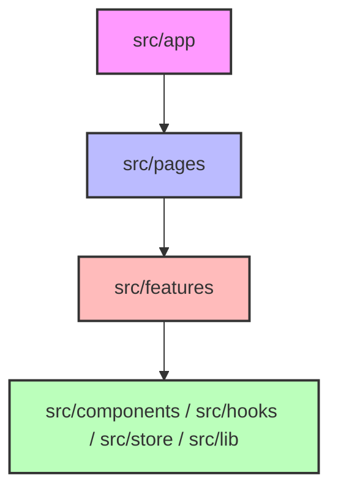
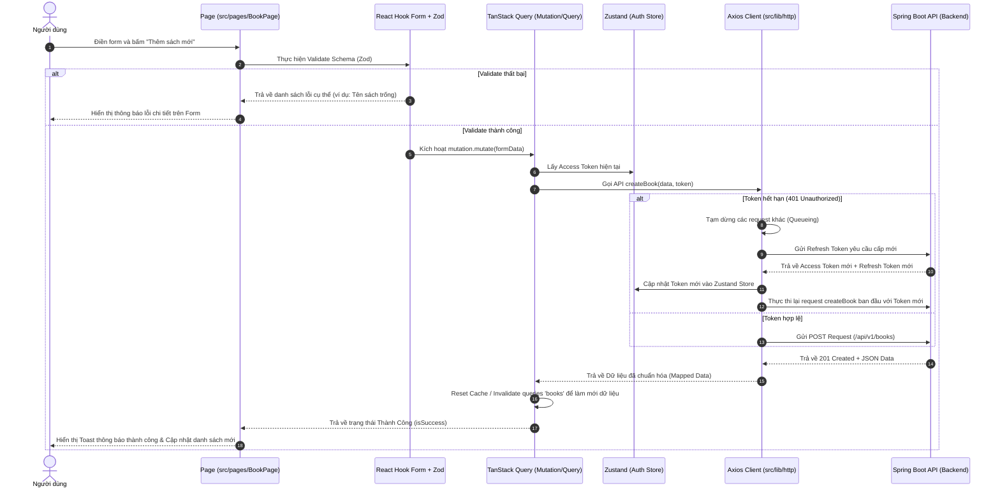

# Hướng Dẫn Cấu Trúc Thư Mục & Quy Chuẩn Phát Triển Enterprise React Frontend (Vite + TypeScript)

Tài liệu này định nghĩa cấu trúc thư mục tiêu chuẩn doanh nghiệp theo mô hình **Enterprise Feature-Based Architecture (Kiến trúc Hướng tính năng Doanh nghiệp)**, tích hợp các công nghệ mới nhất hiện nay như **Zustand**, **TanStack Query v5**, **React Hook Form + Zod**, **Tailwind CSS v4**, **React Router v6 (Data APIs)**, và hệ thống Git Hooks chất lượng cao.

Tài liệu dùng làm mẫu chuẩn áp dụng trực tiếp cho các dự án phát triển React Frontend quy mô từ vừa đến lớn.

---

## 1. Kiến Trúc Tổng Quan (Enterprise Feature-Based Architecture)

Mô hình **Enterprise Feature-Based Architecture** tổ chức mã nguồn bằng cách chia ứng dụng thành các Module/Tính năng độc lập (Self-contained) kết hợp với các tầng dùng chung được phân tách rõ ràng nhằm giảm thiểu sự phụ thuộc lẫn nhau (Low Coupling) và tăng tính đóng gói (High Cohesion).

### Sơ đồ cấu trúc thư mục tổng quát
```text
root/
├── src/
│   ├── app/                # Cấu hình gốc (App entry, Router, Global Providers, Global Styles)
│   ├── assets/             # Tài nguyên tĩnh toàn cục (Fonts, Logos, Icons)
│   ├── components/         # Shared UI Components (Không mang nghiệp vụ: Button, Input, Modal, Table...)
│   ├── features/           # Các Module nghiệp vụ độc lập (Auth, Book, Cart, Order...)
│   │   └── [feature-name]/ # Từng tính năng cụ thể chứa giao diện và logic của nó
│   ├── hooks/              # Shared Custom Hooks toàn cục (useDebounce, useMediaQuery, useAuth...)
│   ├── lib/                # Khởi tạo/Cấu hình thư viện bên thứ 3 (Axios Client, React Query Client)
│   ├── pages/              # Các trang đại diện cho từng Route (Lắp ghép từ các component trong features)
│   ├── store/              # Shared Global Client State (Zustand stores dùng chung toàn app)
│   ├── types/              # Định nghĩa Types/Interfaces TypeScript dùng chung toàn hệ thống
│   ├── utils/              # Các hàm bổ trợ dùng chung (Date formatter, currency formatter, validators...)
│   ├── main.tsx            # Điểm khởi chạy ứng dụng (Root mount)
│   └── vite-env.d.ts       # Định nghĩa kiểu dữ liệu cho biến môi trường
├── .env.example            # Tệp biến môi trường mẫu
├── .env.local              # Tệp biến môi trường thực tế (Bị Git bỏ qua)
├── eslint.config.js        # Cấu hình ESLint Flat Config mới nhất
├── vite.config.ts          # Cấu hình Vite (Aliases, split chunks, proxy)
├── tsconfig.json           # Cấu hình TypeScript compiler
└── tailwind.config.js      # Cấu hình Tailwind CSS (với Tailwind v4, cấu hình trực tiếp trong CSS)
```

---

## 2. Quy Tắc Ranh Giới Module & Phân Tách Giao Diện (Module Boundary Rules)

Để tránh việc dự án phình to dẫn đến tình trạng mã nguồn đan xen phức tạp (Spaghetti Code), dự án bắt buộc phải tuân thủ nghiêm ngặt các quy tắc ranh giới sau:



### 2.1. Quy tắc nhập khẩu (Import Rules)
*   **Chiều phụ thuộc một chiều (One-Way Dependency Flow)**:
    *   `src/app` có thể import mọi thứ.
    *   `src/pages` chỉ được import từ `src/features`, `src/components`, `src/hooks`, `src/store`, `src/lib`.
    *   `src/features` chỉ được import từ chính nó hoặc từ tầng dùng chung (`src/components`, `src/hooks`, `src/store`, `src/lib`). **Tuyệt đối không import chéo giữa các features**.
    *   `src/components`, `src/hooks`, `src/lib` **không được phép** import từ `features` hoặc `pages` để tránh lỗi vòng lặp phụ thuộc (Circular Dependency).
*   **Quy tắc Barrel File (`index.ts`)**:
    *   Mỗi thư mục con trong `features/[name]/` phải có một tệp `index.ts` đóng vai trò là "cổng xuất khẩu công khai" (Public API).
    *   Các thư mục bên ngoài chỉ được phép import tài nguyên của feature thông qua tệp `index.ts` này.
    *   *Không được phép import sâu*: Cấm viết `import { BookCard } from '@/features/book/components/BookCard'`. Thay vào đó, viết `import { BookCard } from '@/features/book'`.

> [!IMPORTANT]
> **Quy định Phân Tách UI Components:**
> *   **Feature-Specific Components**: Các component chỉ phục vụ cho một nghiệp vụ cụ thể (nhũ `BookCard`, `CheckoutForm`) phải nằm ở `features/[feature-name]/components/`.
> *   **Shared UI Components**: Các component mang tính chất nền tảng (nút bấm `Button`, ô nhập liệu `Input`, bảng biểu `DataTable`, hộp thoại `Modal`) nằm ở `src/components/`. Các component này phải là **stateless** (không chứa logic API) và nhận dữ liệu qua `props`.

---

## 3. Quy Chuẩn Công Nghệ & Quản Lý Trạng Thái (Modern IT Tech Stack)

Dự án áp dụng bộ công nghệ tiêu chuẩn tối ưu hiệu năng và trải nghiệm lập trình viên:

| Công Nghệ | Vai Trò | Lợi Ích & Quy Chuẩn Áp Dụng |
| :--- | :--- | :--- |
| **Zustand** | Quản lý Client State (Trạng thái client toàn cục) | Thay thế hoàn toàn Redux nhờ cơ chế cực kỳ gọn nhẹ, không boilerplate, hiệu năng cao, hỗ trợ Middleware persist (tự động lưu vào LocalStorage). |
| **TanStack Query v5** | Quản lý Server State (Trạng thái dữ liệu từ API) | Tự động hóa việc cache, làm tươi dữ liệu (stale-while-revalidate), phân trang, quản lý trạng thái tải (Loading/Error) và tối ưu hóa số lượng API request gửi đi. |
| **React Hook Form** | Quản lý Form & Biểu mẫu | Không gây re-render toàn bộ component khi người dùng gõ phím nhờ cơ chế uncontrolled component. |
| **Zod** | Validate dữ liệu (Schema Validation) | Khai báo schema validate phía client, tự động suy luận ra kiểu dữ liệu TypeScript (Type Inference), đồng bộ hóa kiểm tra lỗi ở Form và API. |
| **Tailwind CSS v4** | Thiết kế giao diện (Styling) | Sử dụng CSS-first configuration, biên dịch siêu tốc, tối ưu hóa kích thước file CSS bundle cuối cùng. |
| **React Router v6** | Định tuyến (Routing) | Sử dụng **Data APIs** (`createBrowserRouter`) để tận dụng tính năng `loader`, `action` tối ưu hóa trải nghiệm tải trang song song. |

---

## 4. Luồng Hoạt Động Của Dữ Liệu (Data & Request Flow)

Sơ đồ trình bày chi tiết luồng xử lý từ khi người dùng tương tác, thông qua hệ thống validation, trạng thái cache, xử lý token và phản hồi từ Server:



---

## 5. Mã Nguồn Mẫu Đạt Chuẩn Doanh Nghiệp (Enterprise Code Examples)

### 5.1. Axios Client tích hợp cơ chế Auto-Refresh Token và Hàng đợi Request
*   **Đường dẫn:** `src/lib/http.ts`

```typescript
import axios, { AxiosInstance, AxiosError, InternalAxiosRequestConfig } from 'axios';
import { useAuthStore } from '@/store/authStore';

// Cấu hình Axios Instance
const http: AxiosInstance = axios.create({
  baseURL: import.meta.env.VITE_API_BASE_URL || 'http://localhost:8080/api/v1',
  timeout: 15000,
  headers: {
    'Content-Type': 'application/json',
  },
});

// Biến hỗ trợ cơ chế Refresh Token
let isRefreshing = false;
let failedQueue: any[] = [];

const processQueue = (error: any, token: string | null = null) => {
  failedQueue.forEach((prom) => {
    if (error) {
      prom.reject(error);
    } else {
      prom.resolve(token);
    }
  });
  failedQueue = [];
};

// 1. Interceptor đính kèm Token cho request đi
http.interceptors.request.use(
  (config: InternalAxiosRequestConfig) => {
    const token = useAuthStore.getState().accessToken;
    if (token && config.headers) {
      config.headers.Authorization = `Bearer ${token}`;
    }
    return config;
  },
  (error) => Promise.reject(error)
);

// 2. Interceptor xử lý Response và lỗi 401
http.interceptors.response.use(
  (response) => response.data, // Trả về data sạch trực tiếp
  async (error: AxiosError) => {
    const originalRequest = error.config as InternalAxiosRequestConfig & { _retry?: boolean };

    if (!error.response) {
      return Promise.reject(new Error('Mất kết nối mạng. Vui lòng thử lại.'));
    }

    const status = error.response.status;

    // Xử lý lỗi 401 Unauthorized và tránh lặp vô hạn
    if (status === 401 && !originalRequest._retry) {
      if (isRefreshing) {
        // Nếu đang refresh, đẩy request này vào hàng đợi chờ token mới
        return new Promise((resolve, reject) => {
          failedQueue.push({ resolve, reject });
        })
          .then((token) => {
            if (originalRequest.headers) {
              originalRequest.headers.Authorization = `Bearer ${token}`;
            }
            return http(originalRequest);
          })
          .catch((err) => Promise.reject(err));
      }

      originalRequest._retry = true;
      isRefreshing = true;

      try {
        const refreshToken = useAuthStore.getState().refreshToken;
        if (!refreshToken) throw new Error('Không tìm thấy Refresh Token');

        // Gọi API Refresh Token (Sử dụng một instance axios thô để tránh lặp interceptor)
        const response = await axios.post(`${import.meta.env.VITE_API_BASE_URL}/auth/refresh`, {
          refreshToken,
        });

        const { accessToken: newAccessToken, refreshToken: newRefreshToken } = response.data.data;

        // Lưu token mới vào global store
        useAuthStore.getState().setTokens(newAccessToken, newRefreshToken);

        // Chạy lại toàn bộ request trong hàng đợi
        processQueue(null, newAccessToken);
        
        // Thực thi lại request hiện tại
        if (originalRequest.headers) {
          originalRequest.headers.Authorization = `Bearer ${newAccessToken}`;
        }
        return http(originalRequest);
      } catch (refreshError) {
        processQueue(refreshError, null);
        // Xóa thông tin đăng nhập và chuyển hướng về trang login nếu refresh thất bại
        useAuthStore.getState().logout();
        window.location.href = '/login';
        return Promise.reject(refreshError);
      } finally {
        isRefreshing = false;
      }
    }

    // Xử lý các lỗi HTTP khác
    const errorMsg = (error.response.data as any)?.message || 'Đã có lỗi hệ thống xảy ra';
    return Promise.reject(new Error(errorMsg));
  }
);

export default http;
```

### 5.2. Zustand Store quản lý Trạng Thái Đăng Nhập (Auth Store)
*   **Đường dẫn:** `src/store/authStore.ts`

```typescript
import { create } from 'zustand';
import { persist, createJSONStorage } from 'zustand/middleware';

interface AuthState {
  user: { id: string; email: string; name: string } | null;
  accessToken: string | null;
  refreshToken: string | null;
  isAuthenticated: boolean;
  setTokens: (accessToken: string, refreshToken: string) => void;
  setUser: (user: AuthState['user']) => void;
  logout: () => void;
}

export const useAuthStore = create<AuthState>()(
  persist(
    (set) => ({
      user: null,
      accessToken: null,
      refreshToken: null,
      isAuthenticated: false,
      setTokens: (accessToken, refreshToken) =>
        set({ accessToken, refreshToken, isAuthenticated: true }),
      setUser: (user) => set({ user }),
      logout: () => set({ user: null, accessToken: null, refreshToken: null, isAuthenticated: false }),
    }),
    {
      name: 'auth-storage', // Key lưu dưới LocalStorage
      storage: createJSONStorage(() => localStorage),
    }
  )
);
```

### 5.3. Zod Schema & React Hook Form
Đảm bảo biểu mẫu nhập liệu được validate chặt chẽ từ phía client.
*   **Đường dẫn:** `src/features/book/model/BookSchema.ts`

```typescript
import { z } from 'zod';

// Định nghĩa Schema validate bằng Zod
export const BookSchema = z.object({
  nameBook: z.string().min(2, 'Tên sách phải chứa ít nhất 2 ký tự').max(100, 'Tên sách quá dài'),
  author: z.string().min(2, 'Tên tác giả phải chứa ít nhất 2 ký tự'),
  listPrice: z.coerce.number().positive('Giá gốc phải là số lớn hơn 0'),
  quantity: z.coerce.number().int('Số lượng phải là số nguyên').nonnegative('Số lượng không được âm'),
  discountPercent: z.coerce.number().min(0, 'Giảm giá tối thiểu là 0%').max(90, 'Không giảm giá quá 90%'),
  genreIds: z.array(z.number()).min(1, 'Vui lòng chọn ít nhất 1 thể loại'),
});

// Xuất type tự động từ Schema
export type BookFormData = z.infer<typeof BookSchema>;
```

### 5.4. API Call, Mapper & TanStack Query Hooks cho Feature
*   **Đường dẫn:** `src/features/book/api/bookApi.ts`

```typescript
import http from '@/lib/http';
import { Book, BookPageResponse } from '../model/BookModel';
import { BookFormData } from '../model/BookSchema';

export const getBooks = async (page: number, size: number): Promise<BookPageResponse> => {
  const data = await http.get('/books', { params: { page, size } });
  return data as unknown as BookPageResponse;
};

export const createBook = async (payload: BookFormData): Promise<Book> => {
  const data = await http.post('/books', payload);
  return data as unknown as Book;
};
```

*   **Đường dẫn:** `src/features/book/hooks/useBookMutation.ts`

```typescript
import { useMutation, useQueryClient } from '@tanstack/react-query';
import { createBook } from '../api/bookApi';
import { BookFormData } from '../model/BookSchema';

export const useCreateBook = () => {
  const queryClient = useQueryClient();

  return useMutation({
    mutationFn: (data: BookFormData) => createBook(data),
    onSuccess: () => {
      // Làm mới danh sách sách ngay sau khi thêm thành công
      queryClient.invalidateQueries({ queryKey: ['books'] });
    },
  });
};
```

### 5.5. TSX Component sử dụng React Hook Form & Zod Schema
*   **Đường dẫn:** `src/features/book/components/CreateBookForm.tsx`

```tsx
import React from 'react';
import { useForm } from 'react-hook-form';
import { zodResolver } from '@hookform/resolvers/zod';
import { BookSchema, BookFormData } from '../model/BookSchema';
import { useCreateBook } from '../hooks/useBookMutation';

export const CreateBookForm: React.FC = () => {
  const { mutate, isPending } = useCreateBook();
  
  const {
    register,
    handleSubmit,
    reset,
    formState: { errors },
  } = useForm<BookFormData>({
    resolver: zodResolver(BookSchema),
    defaultValues: {
      nameBook: '',
      author: '',
      listPrice: 0,
      quantity: 1,
      discountPercent: 0,
      genreIds: [],
    },
  });

  const onSubmit = (data: BookFormData) => {
    mutate(data, {
      onSuccess: () => {
        reset(); // Reset form khi thêm thành công
        alert('Thêm sách thành công!');
      },
      onError: (err) => {
        alert(`Thêm sách thất bại: ${err.message}`);
      }
    });
  };

  return (
    <form onSubmit={handleSubmit(onSubmit)} className="space-y-4 p-4 border rounded bg-white max-w-md">
      <div>
        <label className="block text-sm font-medium">Tên sách</label>
        <input {...register('nameBook')} className="w-full border p-2 rounded" />
        {errors.nameBook && <p className="text-red-500 text-xs">{errors.nameBook.message}</p>}
      </div>

      <div>
        <label className="block text-sm font-medium">Tác giả</label>
        <input {...register('author')} className="w-full border p-2 rounded" />
        {errors.author && <p className="text-red-500 text-xs">{errors.author.message}</p>}
      </div>

      <div className="grid grid-cols-3 gap-2">
        <div>
          <label className="block text-sm font-medium">Giá</label>
          <input type="number" {...register('listPrice')} className="w-full border p-2 rounded" />
          {errors.listPrice && <p className="text-red-500 text-xs">{errors.listPrice.message}</p>}
        </div>

        <div>
          <label className="block text-sm font-medium">Số lượng</label>
          <input type="number" {...register('quantity')} className="w-full border p-2 rounded" />
          {errors.quantity && <p className="text-red-500 text-xs">{errors.quantity.message}</p>}
        </div>

        <div>
          <label className="block text-sm font-medium">Giảm giá (%)</label>
          <input type="number" {...register('discountPercent')} className="w-full border p-2 rounded" />
          {errors.discountPercent && <p className="text-red-500 text-xs">{errors.discountPercent.message}</p>}
        </div>
      </div>

      <div>
        <label className="block text-sm font-medium">Thể loại (ID ví dụ: 1, 2)</label>
        <select multiple {...register('genreIds', { valueAsNumber: true })} className="w-full border p-2 rounded">
          <option value={1}>Văn học</option>
          <option value={2}>Khoa học</option>
          <option value={3}>Kinh tế</option>
        </select>
        {errors.genreIds && <p className="text-red-500 text-xs">{errors.genreIds.message}</p>}
      </div>

      <button type="submit" disabled={isPending} className="bg-blue-600 text-white px-4 py-2 rounded disabled:bg-gray-400">
        {isPending ? 'Đang lưu...' : 'Lưu Sách'}
      </button>
    </form>
  );
};
```

---

## 6. Chất Lượng Mã Nguồn & Git Workflow Tiêu Chuẩn

Để duy trì tính nhất quán khi làm việc nhóm, dự án tích hợp hệ thống Git Hooks tự động hóa:

### 6.1. Husky & lint-staged
*   **Husky**: Đảm bảo mọi dòng code commit lên Git đều phải vượt qua bài kiểm tra định dạng và kiểm tra tĩnh.
*   **lint-staged**: Tiết kiệm thời gian bằng cách chỉ chạy linting và format đối với các file có sự thay đổi (staged files).
*   **Cấu hình trong `package.json`**:
```json
{
  "lint-staged": {
    "src/**/*.{ts,tsx}": [
      "eslint --fix",
      "prettier --write"
    ],
    "src/**/*.css": [
      "prettier --write"
    ]
  }
}
```

### 6.2. Kiểm thử (Unit Testing) với Vitest & MSW
Sử dụng Vitest thay thế Jest để tối ưu hóa tốc độ chạy test trên môi trường Vite.
*   **Đường dẫn mẫu:** `src/features/book/components/BookCard.test.tsx`
```typescript
import { render, screen } from '@testing-library/react';
import { describe, it, expect } from 'vitest';
import { BookCard } from './BookCard';
import { Book } from '../model/BookModel';

const mockBook: Book = {
  idBook: 1,
  nameBook: 'Đắc Nhân Tâm',
  author: 'Dale Carnegie',
  listPrice: 100000,
  sellPrice: 80000,
  quantity: 50,
  discountPercent: 20,
  avgRating: 4.8,
  soldQuantity: 1200,
  formattedPrice: '80.000 VND',
};

describe('BookCard Component', () => {
  it('Hiển thị chính xác tên sách và giá tiền đã định dạng', () => {
    render(<BookCard book={mockBook} />);
    
    expect(screen.getByText('Đắc Nhân Tâm')).toBeInTheDocument();
    expect(screen.getByText('Tác giả: Dale Carnegie')).toBeInTheDocument();
    expect(screen.getByText('Giá: 80.000 VND')).toBeInTheDocument();
  });
});
```

---

## 7. Quy Chuẩn Cấu Hình Dự Án Hệ Thống

### 7.1. Cấu hình ESLint Flat Config (`eslint.config.js`)
Flat Config là định dạng cấu hình ESLint mới nhất từ phiên bản v9.0, sử dụng cú pháp module JavaScript chuẩn.

```javascript
import js from '@eslint/js';
import globals from 'globals';
import reactHooks from 'eslint-plugin-react-hooks';
import reactRefresh from 'eslint-plugin-react-refresh';
import tseslint from 'typescript-eslint';

export default tseslint.config(
  { ignores: ['dist'] },
  {
    extends: [js.configs.recommended, ...tseslint.configs.recommended],
    files: ['**/*.{ts,tsx}'],
    languageOptions: {
      ecmaVersion: 2020,
      globals: globals.browser,
    },
    plugins: {
      'react-hooks': reactHooks,
      'react-refresh': reactRefresh,
    },
    rules: {
      ...reactHooks.configs.recommended.rules,
      'react-refresh/only-export-components': [
        'warn',
        { allowConstantExport: true },
      ],
      '@typescript-eslint/no-explicit-any': 'warn', // Cảnh cáo khi lạm dụng kiểu 'any'
      'no-console': ['warn', { allow: ['warn', 'error'] }], // Cấm dùng console.log ngoại trừ warn/error khi production
    },
  }
);
```

### 7.2. Cấu hình Path Aliases trong Vite (`vite.config.ts`)
```typescript
import { defineConfig } from 'vite';
import react from '@vitejs/plugin-react';
import path from 'path';

export default defineConfig({
  plugins: [react()],
  resolve: {
    alias: {
      '@': path.resolve(__dirname, './src'), // Ánh xạ @/ vào src/
    },
  },
  build: {
    sourcemap: false, // Tắt sourcemap khi build production để bảo mật và giảm dung lượng
    chunkSizeWarningLimit: 1000,
    rollupOptions: {
      output: {
        // Tách nhỏ các vendor chunk (React, Axios, TanStack Query...)
        manualChunks(id) {
          if (id.includes('node_modules')) {
            if (id.includes('react')) return 'vendor-react';
            if (id.includes('@tanstack')) return 'vendor-query';
            return 'vendor-libs';
          }
        },
      },
    },
  },
});
```

### 7.3. Cấu hình Tailwind CSS v4 (`src/app/index.css` hoặc `global.css`)
Trong Tailwind CSS v4, cấu hình được viết trực tiếp bên trong CSS bằng cách sử dụng `@theme` directive, thay vì cấu hình thông qua file JavaScript:

```css
@import "tailwindcss";

@theme {
  --color-primary-50: #eff6ff;
  --color-primary-500: #3b82f6;
  --color-primary-900: #1e3a8a;
  
  --font-sans: 'Inter', sans-serif;
}

/* Custom CSS Utility rules */
@utility text-balance {
  text-wrap: balance;
}
```

---

> [!TIP]
> **Hướng dẫn triển khai nhanh dự án:**
> 1. Sử dụng lệnh khởi tạo Vite mới nhất: `npm create vite@latest my-app -- --template react-ts`
> 2. Cài đặt các thư viện lõi: `npm install axios zustand @tanstack/react-query react-hook-form zod @hookform/resolvers/zod`
> 3. Cài đặt các thư viện dev: `npm install -D tailwindcss vitest @testing-library/react @testing-library/jest-dom msw husky lint-staged`
> 4. Thực hiện ánh xạ thư mục trong `tsconfig.json` và `vite.config.ts` giống như hướng dẫn ở trên.
