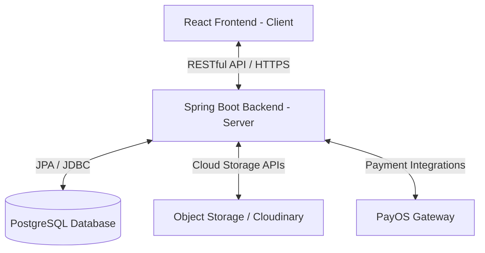
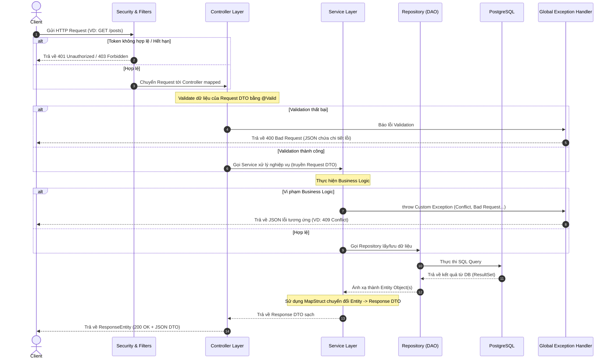

# KIẾN TRÚC HỆ THỐNG (SYSTEM ARCHITECTURE)

Tài liệu này mô tả chi tiết kiến trúc tổng quan, các thành phần chính và luồng xử lý dữ liệu của dự án **AlumNect**.

---

## 1. KIẾN TRÚC TỔNG QUAN

Hệ thống AlumNect được phát triển theo mô hình **Client-Server** tách biệt hoàn toàn giữa Frontend và Backend, sử dụng các công nghệ hiện đại nhằm đảm bảo khả năng mở rộng, bảo mật và hiệu năng.

---

## 2. KIẾN TRÚC BACKEND (SPRING BOOT)

Backend sử dụng kiến trúc phân tầng (**Layered Architecture**) giúp phân tách rõ ràng trách nhiệm của từng thành phần (Separation of Concerns).

### Các Tầng Chính:
1.  **Security & Filters Layer**: Tiếp nhận request đầu tiên, xác thực JWT (JSON Web Token), kiểm tra phân quyền (RBAC) và lọc các request không hợp lệ trước khi chuyển tiếp.
2.  **Controller Layer (Presentation Layer)**: Tiếp nhận HTTP requests từ client, ánh xạ endpoints, kiểm tra tính hợp lệ dữ liệu đầu vào (DTO Validation) thông qua JSR-380 và trả về phản hồi chuẩn (`ResponseEntity`).
3.  **Service Layer (Business Logic Layer)**: Thực hiện xử lý nghiệp vụ, kiểm tra các ràng buộc logic hệ thống (Business Rules), tính toán và điều phối dữ liệu.
4.  **Repository/DAO Layer (Data Access Layer)**: Giao tiếp trực tiếp với PostgreSQL database thông qua Spring Data JPA và Hibernate.
5.  **Entities / Domain Models**: Đại diện cho các bảng trong cơ sở dữ liệu.

### Sơ Đồ Luồng Request & Response Backend:

---

## 3. KIẾN TRÚC FRONTEND (REACT - VITE)

Frontend được phát triển theo mô hình **Enterprise Feature-Based Architecture (Kiến trúc Hướng tính năng Doanh nghiệp)**. Thay vì gom nhóm theo loại file (tất cả components vào một chỗ, tất cả hooks vào một chỗ), dự án tổ chức mã nguồn theo từng tính năng nghiệp vụ độc lập (Feature Modules).

### Các Feature Modules Chính:
*   `auth`: Quản lý đăng ký, đăng nhập, quên mật khẩu, phân quyền.
*   `marketing`: Các thành phần của trang Landing Page bên ngoài.
*   `profile`: Quản lý thông tin cá nhân, dòng thời gian sự nghiệp, kỹ năng.
*   `post` / `feed`: Bản tin cộng đồng, tương tác bài viết (like, comment, share).
*   `job`: Bảng tin tuyển dụng, mua gói đăng tin, thanh toán.
*   `event`: Quản lý sự kiện, RSVP tham gia, nhắc nhở.
*   `forum` / `qa`: Diễn đàn hỏi đáp, bình chọn câu trả lời.
*   `salary`: Bảng khảo sát lương ẩn danh và thống kê biểu đồ.
*   `map`: Bản đồ cựu sinh viên trực quan.
*   `messages`: Nhắn tin trực tiếp giữa các thành viên.

### Quản Lý Trạng Thái (State Management):
*   **Server State (Dữ liệu từ API)**: Quản lý bởi **TanStack Query (React Query) v5**. Hỗ trợ cơ chế cache, tự động làm tươi dữ liệu (stale-while-revalidate) và tối ưu hóa request.
*   **Client State (Trạng thái giao diện/Session)**: Quản lý bởi **Zustand**. Nhẹ nhàng, không boilerplate, dùng để quản lý access token, thông tin user đã đăng nhập, và các cài đặt giao diện (theme, sidebar collapse...).

---

## 4. CÔNG NGHỆ CHÍNH (TECH STACK)

| Thành phần | Công nghệ sử dụng | Chi tiết & Vai trò |
| :--- | :--- | :--- |
| **Backend Core** | Java 21 / Spring Boot 3.x | Framework xây dựng RESTful API chính |
| **Database** | PostgreSQL | Hệ quản trị cơ sở dữ liệu quan hệ |
| **ORM / JPA** | Hibernate / Spring Data JPA | Ánh xạ đối tượng xuống Database |
| **Mapping** | MapStruct | Tự động chuyển đổi giữa Entity <-> DTO |
| **Security** | Spring Security & JWT | Xác thực, phân quyền RBAC |
| **Frontend Core** | React 19 + TypeScript | Thư viện xây dựng UI giao diện người dùng |
| **Build Tool** | Vite | Biên dịch và chạy môi trường dev cực nhanh |
| **Styling** | Tailwind CSS v4 | Thiết kế giao diện (CSS-first `@theme`) |
| **Client State** | Zustand | Quản lý state đăng nhập và cấu hình UI |
| **Server State** | TanStack Query v5 | Quản lý cache và gọi REST APIs |
| **Form Handling**| React Hook Form + Zod | Xây dựng form và validate dữ liệu ở client |
| **Routing** | React Router v6 (Data APIs)| Bộ định tuyến trang và quản lý chuyển hướng |
| **Motion/Anim** | Framer Motion | Thư viện tạo hiệu ứng micro-animations mượt mà |
| **Payment Gateway**| PayOS SDK | Tích hợp cổng thanh toán trực tuyến qua ngân hàng |
