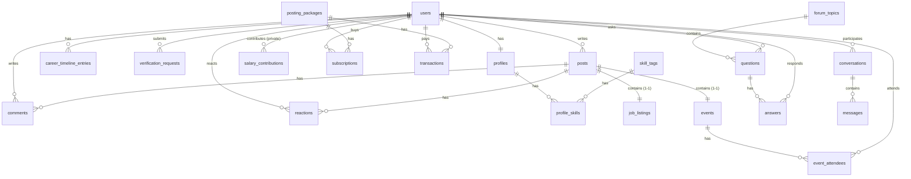

# THIẾT KẾ CƠ SỞ DỮ LIỆU (DATABASE & ERD DESIGN)

Tài liệu này mô tả thiết kế cơ sở dữ liệu quan hệ PostgreSQL của dự án **AlumNect**, bao gồm các bảng, khóa chính, khóa ngoại, kiểu dữ liệu, các ràng buộc nghiệp vụ và chỉ mục.

---

## 1. NGUYÊN TẮC THIẾT KẾ DATABASE

*   **Hệ Quản Trị Cơ Sở Dữ Liệu**: PostgreSQL.
*   **Quy Ước Đặt Tên Bảng & Cột**:
    *   **Tên bảng**: Viết thường hoàn toàn, dạng số ít hoặc số nhiều có quy tắc (ưu tiên số nhiều hoặc snake_case).
    *   **Tên cột**: Sử dụng `snake_case` (ví dụ: `user_id`, `created_at`, `is_verified`).
*   **Khóa chính (Primary Key - PK)**: Luôn sử dụng kiểu dữ liệu số nguyên tự tăng hoặc UUID (tùy theo bảng), đặt tên cột là `id` hoặc `[table_name]_id`.
*   **Khóa ngoại (Foreign Key - FK)**: Đặt tên dạng `[target_table_id]` để dễ dàng đối chiếu.
*   **Quản Lý Migration**: Sử dụng script SQL được lưu trong thư mục `database/` hoặc tích hợp các công nghệ kiểm soát phiên bản database như Flyway/Liquibase trong ứng dụng Spring Boot.

---

## 2. DANH SÁCH CÁC BẢNG CHÍNH (PRINCIPAL TABLES)

Dưới đây là đặc tả chi tiết của 26 thực thể chính trong cơ sở dữ liệu AlumNect:

### 2.1. Module 1: Authentication & Account (Xác thực & Tài khoản)
*   **`users`**: Lưu thông tin đăng nhập chính của người dùng.
    *   `user_id` (PK, Serial)
    *   `email` (VARCHAR, Unique, NOT NULL)
    *   `password_hash` (VARCHAR, NOT NULL)
    *   `google_oauth_id` (VARCHAR, Nullable)
    *   `role` (VARCHAR: STUDENT/ALUMNI/ADMIN)
    *   `status` (VARCHAR: PENDING_VERIFICATION/ACTIVE/LOCKED)
    *   `is_verified` (BOOLEAN, Default FALSE)
    *   `created_at`, `updated_at` (TIMESTAMP)
*   **`profiles`**: Phần mở rộng thông tin cá nhân (Quan hệ 1-1 với `users`).
    *   `profile_id` (PK, Serial)
    *   `user_id` (FK -> `users`, Unique)
    *   `full_name` (VARCHAR, NOT NULL)
    *   `avatar_url` (VARCHAR, Nullable)
    *   `bio` (TEXT, Nullable)
    *   `cohort` (INT, ví dụ: khóa K15, K16...)
    *   `major` (VARCHAR)
    *   `campus` (VARCHAR)
    *   `phone_number` (VARCHAR)
*   **`career_timeline_entries`**: Lưu mốc sự nghiệp của cựu sinh viên (Quan hệ 1-N với `users`).
    *   `entry_id` (PK, Serial)
    *   `user_id` (FK -> `users`)
    *   `organization_name` (VARCHAR)
    *   `job_title` (VARCHAR)
    *   `start_date` (DATE)
    *   `end_date` (DATE, Nullable nếu hiện tại vẫn làm)
    *   `description` (TEXT)
*   **`skill_tags`**: Danh mục kỹ năng toàn hệ thống.
    *   `skill_id` (PK, Serial)
    *   `skill_name` (VARCHAR, Unique)
*   **`profile_skills`**: Bảng trung gian ánh xạ quan hệ N-N giữa `profiles` và `skill_tags`.
    *   `profile_id` (FK -> `profiles`)
    *   `skill_id` (FK -> `skill_tags`)
*   **`verification_requests`**: Hồ sơ yêu cầu xác minh cựu sinh viên gửi lên Admin.
    *   `request_id` (PK, Serial)
    *   `requester_id` (FK -> `users`)
    *   `reviewed_by` (FK -> `users` của Admin, Nullable)
    *   `student_id` (VARCHAR)
    *   `graduation_year` (INT)
    *   `evidence_image_url` (VARCHAR)
    *   `status` (VARCHAR: PENDING/APPROVED/REJECTED)
    *   `rejection_reason` (TEXT, Nullable)
    *   `submitted_at`, `reviewed_at` (TIMESTAMP)

### 2.2. Module 2: Social Feed, Posts & Interaction (Bản tin & Tương tác)
*   **`posts`**: Lưu bài viết trên feed (loại bài: achievement, normal, recruitment, event).
    *   `post_id` (PK, Serial)
    *   `author_id` (FK -> `users`)
    *   `post_type` (VARCHAR: achievement, normal, recruitment, event)
    *   `content` (TEXT)
    *   `media_urls` (JSONB / TEXT ARRAY)
    *   `status` (VARCHAR: ACTIVE/HIDDEN)
    *   `created_at`, `updated_at` (TIMESTAMP)
*   **`comments`**: Bình luận dưới bài đăng.
    *   `comment_id` (PK, Serial)
    *   `post_id` (FK -> `posts`)
    *   `author_id` (FK -> `users`)
    *   `content` (TEXT)
    *   `created_at` (TIMESTAMP)
*   **`reactions`**: Thích bài đăng (Một user chỉ like tối đa một lần một post).
    *   `reaction_id` (PK, Serial)
    *   `post_id` (FK -> `posts`)
    *   `user_id` (FK -> `users`)
    *   `created_at` (TIMESTAMP)
*   **`saved_posts`**: Bài viết đã lưu.
    *   `user_id` (FK -> `users`)
    *   `post_id` (FK -> `posts`)

### 2.3. Module 3: Jobs, Events & Payment (Tuyển dụng, Sự kiện & Thanh toán)
*   **`job_listings`**: Chi tiết tin tuyển dụng (Quan hệ 1-1 với `posts` có `post_type = recruitment`).
    *   `job_id` (PK, Serial)
    *   `post_id` (FK -> `posts`, Unique)
    *   `title` (VARCHAR)
    *   `description` (TEXT)
    *   `field` (VARCHAR)
    *   `location` (VARCHAR)
    *   `job_type` (VARCHAR: FULL_TIME/PART_TIME/INTERNSHIP)
    *   `status` (VARCHAR: ACTIVE/EXPIRED/HIDDEN)
*   **`events`**: Chi tiết sự kiện (Quan hệ 1-1 với `posts` có `post_type = event`).
    *   `event_id` (PK, Serial)
    *   `post_id` (FK -> `posts`, Unique)
    *   `title` (VARCHAR)
    *   `description` (TEXT)
    *   `start_time` (TIMESTAMP)
    *   `end_time` (TIMESTAMP)
    *   `location` (VARCHAR)
    *   `status` (VARCHAR: UPCOMING/CANCELLED/PAST)
*   **`event_attendees`**: Danh sách đăng ký tham gia sự kiện.
    *   `event_id` (FK -> `events`)
    *   `user_id` (FK -> `users`)
    *   `status` (VARCHAR: ATTENDING/CANCELLED)
*   **`posting_packages`**: Các gói dịch vụ đăng tuyển dụng.
    *   `package_id` (PK, Serial)
    *   `name` (VARCHAR)
    *   `price` (DECIMAL)
    *   `duration_days` (INT)
    *   `active_listing_quota` (INT)
*   **`subscriptions`**: Đăng ký gói dịch vụ của cựu sinh viên tuyển dụng.
    *   `subscription_id` (PK, Serial)
    *   `user_id` (FK -> `users`)
    *   `package_id` (FK -> `posting_packages`)
    *   `start_at`, `expiry_at` (TIMESTAMP)
    *   `remaining_quota` (INT)
    *   `status` (VARCHAR: ACTIVE/EXPIRED)
*   **`transactions`**: Hóa đơn thanh toán gói dịch vụ qua PayOS.
    *   `transaction_id` (PK, Serial)
    *   `buyer_id` (FK -> `users`)
    *   `package_id` (FK -> `posting_packages`)
    *   `amount` (DECIMAL)
    *   `payos_order_id` (VARCHAR)
    *   `status` (VARCHAR: PENDING/PAID/FAILED)
    *   `created_at` (TIMESTAMP)

### 2.4. Module 4: Q&A Forum & Salary Board (Diễn đàn & Lương)
*   **`forum_topics`**: Danh mục chủ đề diễn đàn hỏi đáp.
    *   `topic_id` (PK, Serial)
    *   `topic_name` (VARCHAR, Unique)
    *   `description` (TEXT)
*   **`questions`**: Câu hỏi trên diễn đàn.
    *   `question_id` (PK, Serial)
    *   `author_id` (FK -> `users`)
    *   `topic_id` (FK -> `forum_topics`)
    *   `content` (TEXT)
    *   `vote_tally` (INT, Default 0)
    *   `status` (VARCHAR: ACTIVE/HIDDEN)
    *   `created_at` (TIMESTAMP)
*   **`answers`**: Câu trả lời của câu hỏi.
    *   `answer_id` (PK, Serial)
    *   `question_id` (FK -> `questions`)
    *   `author_id` (FK -> `users`)
    *   `content` (TEXT)
    *   `vote_tally` (INT, Default 0)
    *   `status` (VARCHAR: ACTIVE/HIDDEN)
    *   `created_at` (TIMESTAMP)
*   **`votes`**: Lượt vote câu hỏi/câu trả lời.
    *   `vote_id` (PK, Serial)
    *   `voter_id` (FK -> `users`)
    *   `target_type` (VARCHAR: QUESTION/ANSWER)
    *   `target_id` (INT)
    *   `vote_value` (INT: +1 hoặc -1)
*   **`salary_contributions`**: Bản ghi lương ẩn danh của cựu sinh viên.
    *   `contribution_id` (PK, Serial)
    *   `owner_id` (FK -> `users`, PRIVATE - Chỉ dùng để kiểm tra quyền sửa/xóa, không bao giờ hiển thị ra ngoài)
    *   `industry` (VARCHAR)
    *   `position` (VARCHAR)
    *   `region` (VARCHAR)
    *   `years_of_experience` (INT)
    *   `amount` (DECIMAL)
    *   `created_at` (TIMESTAMP)

### 2.5. Module 5: Direct Messages & System (Tin nhắn & Hệ thống)
*   **`conversations`**: Cuộc trò chuyện giữa 2 người.
    *   `conversation_id` (PK, Serial)
    *   `user_a_id` (FK -> `users`)
    *   `user_b_id` (FK -> `users`)
    *   `created_at` (TIMESTAMP)
*   **`messages`**: Tin nhắn trực tiếp.
    *   `message_id` (PK, Serial)
    *   `conversation_id` (FK -> `conversations`)
    *   `sender_id` (FK -> `users`)
    *   `message_body` (TEXT)
    *   `is_read` (BOOLEAN, Default FALSE)
    *   `sent_at` (TIMESTAMP)
*   **`follows`**: Theo dõi người dùng khác.
    *   `follower_id` (FK -> `users`)
    *   `followee_id` (FK -> `users`)
    *   `created_at` (TIMESTAMP)
*   **`reports`**: Báo cáo bài viết/tin tuyển dụng/câu hỏi/câu trả lời vi phạm.
    *   `report_id` (PK, Serial)
    *   `reporter_id` (FK -> `users`)
    *   `target_type` (VARCHAR: POST/JOB/QUESTION/ANSWER)
    *   `target_id` (INT)
    *   `reason` (TEXT)
    *   `status` (VARCHAR: PENDING/RESOLVED/DISMISSED)
    *   `created_at` (TIMESTAMP)
*   **`notifications`**: Thông báo hệ thống gửi đến người dùng.
    *   `notification_id` (PK, Serial)
    *   `recipient_id` (FK -> `users`)
    *   `type` (VARCHAR: FOLLOW/LIKE/COMMENT/ANSWER/SYSTEM)
    *   `payload` (JSONB / TEXT)
    *   `is_read` (BOOLEAN, Default FALSE)
    *   `created_at` (TIMESTAMP)

---

## 3. SƠ ĐỒ QUAN HỆ THỰC THỂ (ERD METADATA)

