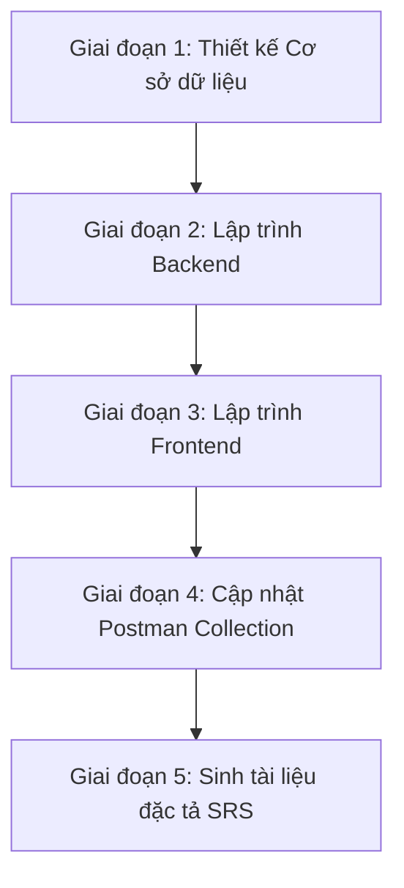
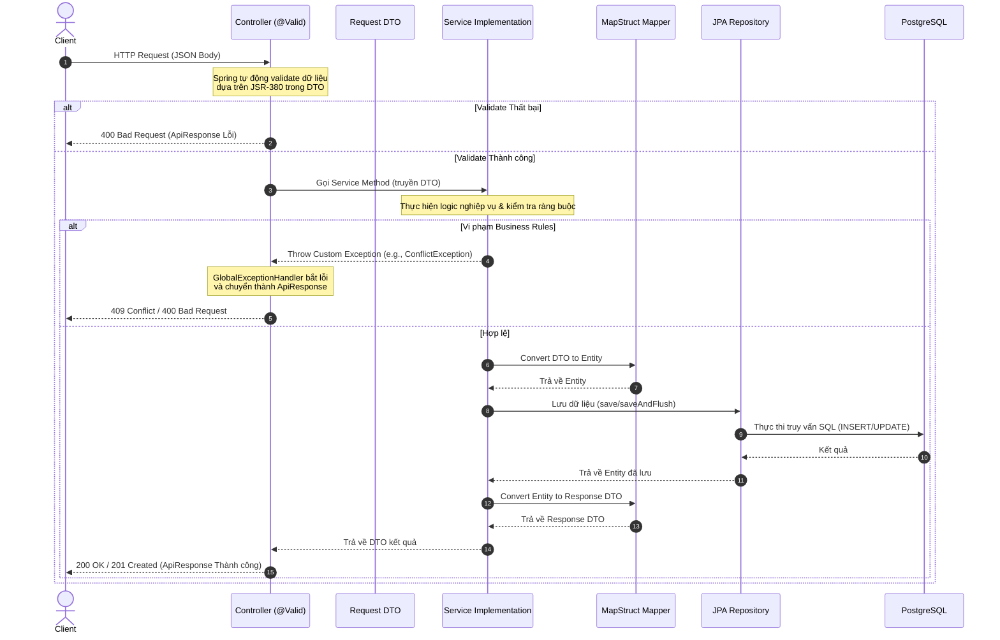
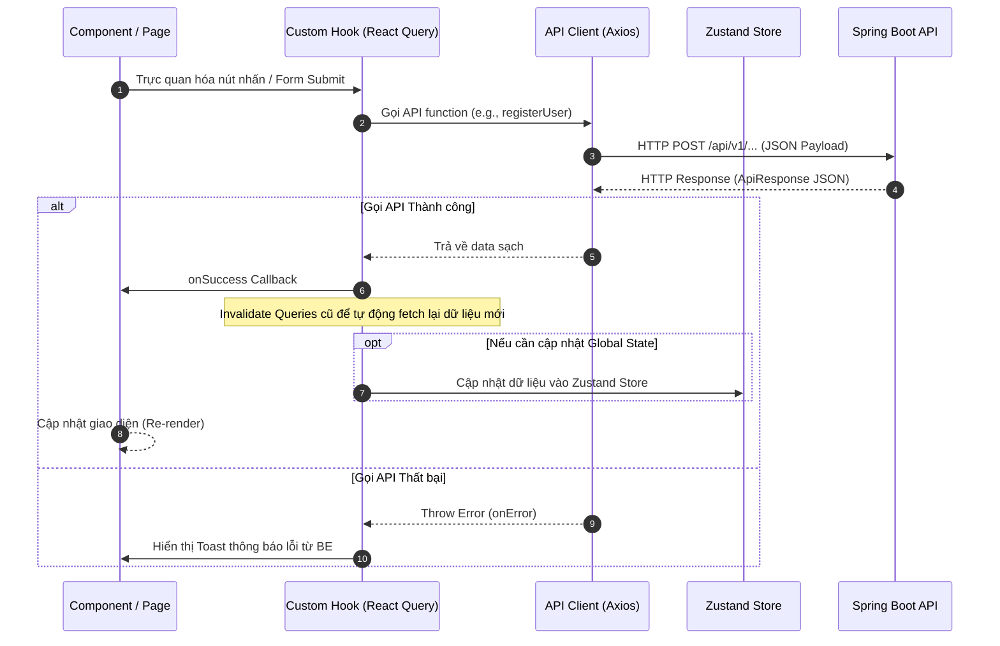

# QUY TRÌNH PHÁT TRIỂN TÍNH NĂNG TOÀN DIỆN (DEVELOPMENT WORKFLOW)

Tài liệu này hướng dẫn chi tiết quy trình từng bước (Step-by-step Workflow) để triển khai một tính năng hoặc Use Case (UC) mới trong dự án **AlumNect**, bao gồm cả **Backend (Spring Boot)** và **Frontend (React + Vite + TS)**. 

Mọi lập trình viên và AI Assistant phải tuân thủ nghiêm ngặt quy trình này nhằm đảm bảo tính đồng bộ, nhất quán của mã nguồn và tài liệu hệ thống.

---

## TỔNG QUAN VÒNG ĐỜI PHÁT TRIỂN (DEVELOPMENT LIFECYCLE)

Một tính năng hoàn chỉnh sẽ đi qua các giai đoạn sau:



---

## CHI TIẾT CÁC BƯỚC THỰC HIỆN

### GIAI ĐOẠN 1: THIẾT KẾ CƠ SỞ DỮ LIỆU (DATABASE MIGRATION)

Khi tính năng yêu cầu thay đổi cấu trúc database (thêm bảng, thêm cột, chỉnh sửa constraint):

> [!IMPORTANT]
> **Quy tắc Flyway bất biến**: Tuyệt đối không chỉnh sửa trực tiếp các file SQL cũ đã chạy (như `V1__init_auth_tables.sql`). Mọi thay đổi cấu trúc DB đều phải tạo file migration mới để đảm bảo tính toàn vẹn và tránh lỗi checksum của Flyway.

1. **Kiểm tra phiên bản hiện tại**: Tìm phiên bản có số version lớn nhất trong thư mục `alumnect-backend/src/main/resources/db/migration/` để đặt số version tiếp theo tuần tự (`V2`, `V3`,...).
2. **Tạo file migration mới**:
   * Đường dẫn: `alumnect-backend/src/main/resources/db/migration/V<Version_Tiếp_Theo>__<mô_tả_ngắn_gọn>.sql`
   * Ví dụ: `V2__add_events_table.sql`.
3. **Quy tắc viết câu lệnh SQL**:
   * Tất cả từ khóa SQL phải viết **IN HOA** (ví dụ: `CREATE TABLE`, `BIGINT`, `NOT NULL`, `REFERENCES`, `CONSTRAINT`).
   * Tên bảng và tên cột viết bằng chữ **thường**, dạng `snake_case`.
   * Khóa chính tự động tăng: `BIGINT GENERATED ALWAYS AS IDENTITY PRIMARY KEY`.
   * Cột thời gian: `TIMESTAMPTZ NOT NULL DEFAULT now()`.
   * Định nghĩa khóa ngoại bằng câu lệnh `ALTER TABLE ADD CONSTRAINT` riêng biệt ở cuối file.
   * Tạo `INDEX` cho các cột khóa ngoại hoặc các cột thường xuyên được truy vấn lọc (ví dụ: `CREATE INDEX idx_posts_user_id ON posts (user_id);`).
4. **Ví dụ minh họa viết file migration mới (`V2__xxx.sql`):**
   * *Trường hợp A: Thêm bảng mới:*
     ```sql
     CREATE TABLE posts (
         id          BIGINT        GENERATED ALWAYS AS IDENTITY PRIMARY KEY,
         user_id     BIGINT        NOT NULL,
         title       VARCHAR(250)  NOT NULL,
         content     TEXT          NOT NULL,
         created_at  TIMESTAMPTZ   NOT NULL DEFAULT now(),
         updated_at  TIMESTAMPTZ   NOT NULL DEFAULT now()
     );

     -- Đặt FOREIGN KEY ở cuối file
     ALTER TABLE posts ADD CONSTRAINT fk_posts_user_id FOREIGN KEY (user_id) REFERENCES users(id) ON DELETE CASCADE;
     -- Tạo INDEX ở cuối file
     CREATE INDEX idx_posts_user_id ON posts (user_id);
     ```
   * *Trường hợp B: Thêm cột hoặc ràng buộc mới vào bảng đã có:*
     ```sql
     ALTER TABLE user_profiles ADD COLUMN cover_photo_url VARCHAR(500);
     ```

---

### GIAI ĐOẠN 2: LẬP TRÌNH BACKEND (SPRING BOOT + JAVA)

Backend của dự án được tổ chức theo kiến trúc **Layered + Feature**.

> [!IMPORTANT]
> **Quy tắc Phản hồi & Validation**:
> * Toàn bộ Controller API bắt buộc phải trả về đối tượng chuẩn `ResponseEntity<ApiResponse<T>>`.
> * Mọi thông báo lỗi kiểm tra dữ liệu (`message` trong DTO Request) bắt buộc phải viết bằng **Tiếng Việt**.

#### Sơ đồ tuần tự xử lý Backend (Backend Sequence Diagram)



#### Quy trình lập trình các Layer:

##### 1. Entity & Repository
* **Entity**: Tạo class ánh xạ DB dưới package `com.alumnect.alumnect_backend.entity.[feature_name]/`. Sử dụng JPA annotations đầy đủ, viết comment Tiếng Việt cho từng field.
* **Repository**: Tạo interface repository kế thừa `JpaRepository` (và `JpaSpecificationExecutor` nếu cần lọc động) tại package `com.alumnect.alumnect_backend.dao.[feature_name]/`.

#### 2. DTOs (Data Transfer Objects)
* Định nghĩa các lớp Request và Response DTO dưới package `com.alumnect.alumnect_backend.dto/`:
  * `request/[feature_name]/`: Nhận payload từ Client. Sử dụng annotations từ `jakarta.validation.constraints` (`@NotBlank`, `@NotNull`, `@Size`, `@Email`, `@Pattern`) để kiểm tra dữ liệu đầu vào. **Tất cả thông báo lỗi (`message`) phải viết bằng Tiếng Việt**.
  * `response/[feature_name]/`: Định nghĩa cấu trúc dữ liệu trả về cho Client.
* Comment giải thích đầy đủ ý nghĩa nghiệp vụ của từng trường.

#### 3. Mappers (MapStruct)
* Tạo các interface Mapper tại package `com.alumnect.alumnect_backend.mapper/` để chuyển đổi tự động giữa Entity và DTO.
* Định nghĩa: `@Mapper(componentModel = "spring")`.

#### 4. Service Layer
* Định nghĩa Interface tại `com.alumnect.alumnect_backend.service.[feature_name]/[Feature]Service.java`. Viết Javadoc Tiếng Việt đầy đủ mô tả chức năng, tham số (`@param`) và kết quả (`@return`).
* Triển khai lớp Implementation tại `com.alumnect.alumnect_backend.service.[feature_name]/[Feature]ServiceImp.java`.
  * Đánh dấu `@Service` và `@RequiredArgsConstructor`.
  * Sử dụng `@Transactional` cho các phương thức có ghi/sửa database.
  * Nếu phát sinh lỗi nghiệp vụ, hãy ném các Custom Runtime Exceptions tương ứng (ví dụ: `ResourceNotFoundException`, `ConflictException`, `BadRequestException`).

#### 5. Controller Layer
* Tạo Controller tại package `com.alumnect.alumnect_backend.controller.[feature_name]/`.
  * Sử dụng `@RestController` và cấu hình request mapping (ví dụ: `@RequestMapping("/posts")`). Tiền tố `/api/v1` sẽ tự động được thêm bởi hệ thống.
  * Sử dụng `@Valid @RequestBody` để tự động kiểm tra tính hợp lệ của DTO request đầu vào.
  * **Định dạng phản hồi bắt buộc**: Tất cả endpoint phải trả về đối tượng `ResponseEntity<ApiResponse<T>>`:
    * Thành công: `ApiResponse.success("Thông báo tiếng Việt", data)` (HTTP 200 OK / 201 Created).
    * Thất bại: Được bắt tập trung và chuyển đổi tại `GlobalExceptionHandler.java` (lỗi validate từ `MethodArgumentNotValidException` sẽ được trích xuất thành danh sách map lỗi gửi về Client).

---

### GIAI ĐOẠN 3: LẬP TRÌNH FRONTEND (REACT + VITE + TS)

Frontend của dự án tuân thủ mô hình **Enterprise Feature-Based Architecture** và phong cách thiết kế **Premium Pastel Design System**.

> [!TIP]
> **Quy tắc Thiết kế & Trải nghiệm (UI/UX)**:
> * Luôn bọc thẻ hình ảnh `` trong component `<SmartImage />` để xử lý shimmer loading và ảnh lỗi.
> * Sử dụng hiệu ứng xương màu kem ấm (`shimmer skeleton`) thay thế hoàn toàn loading spinner.
> * Tuân thủ bảng màu Pastel Premium và các class hiệu ứng đã cấu hình trong `DesignSystem.md`.

#### Sơ đồ hoạt động của Frontend (Frontend Workflow Diagram)



#### Quy trình triển khai Features:

##### 1. Tạo thư mục Feature mới
Nếu đây là module nghiệp vụ mới, tạo thư mục tương ứng tại `src/features/[feature_name]/`:
```text
src/features/[feature_name]/
├── components/     # Các component UI riêng biệt phục vụ cho feature này
├── hooks/          # Custom hooks gọi API thông qua React Query (Queries & Mutations)
├── api/            # Định nghĩa các hàm call API axios client
├── model/          # Định nghĩa TypeScript interfaces hoặc Zod schema validate
└── index.ts        # Barrel file xuất khẩu các thành phần dùng chung ra ngoài
```

#### 2. Định nghĩa API & Types
* **API (`api/[feature]Api.ts`)**: Sử dụng đối tượng `axiosClient` dùng chung (`src/lib/axios.ts`) để thực hiện các cuộc gọi REST API.
* **Model/Types (`model/[feature]Types.ts`)**: Khai báo các TypeScript Interface khớp hoàn toàn với cấu trúc Response DTO từ Backend trả về. Sử dụng Zod để validate schema nếu form phức tạp.

#### 3. React Query Hooks (`hooks/use[Feature].ts`)
* Đóng gói logic gọi API vào React Query hooks:
  * Sử dụng `useQuery` cho luồng lấy dữ liệu (GET) để tận dụng cơ chế caching và sync tự động.
  * Sử dụng `useMutation` cho các luồng thay đổi dữ liệu (POST, PUT, DELETE).
  * Xử lý callback `onSuccess` để invalidate queries cũ, đảm bảo UI cập nhật dữ liệu tức thì.

#### 4. UI Components & Pages
* **Thiết kế UI**: Áp dụng nghiêm ngặt các quy định tại tài liệu [DesignSystem.md](DesignSystem.md).
  * **Layout**: Sử dụng thẻ trắng mềm (`pillowy white cards` thông qua class `.card-surface`), các góc bo tròn lớn (`rounded-3xl`), và chữ màu mực mận chín ấm (`--color-plum-600` / `--color-plum-900`) trên nền kem ấm (`--color-ink-900`).
  * **Trạng thái Empty & Loading**: Dùng component `EmptyState` chuẩn thay vì màn hình trống. Khi tải dữ liệu, bắt buộc sử dụng hiệu ứng xương màu kem ấm (`shimmer skeleton`), không dùng spinner quay tròn thô ráp.
  * **Hình ảnh & Avatar**: Tất cả hình ảnh tải lên hoặc avatar người dùng phải được bọc trong component `SmartImage` để xử lý hiệu ứng tải shimmer và tự động hiển thị ảnh/chữ cái fallback khi link ảnh bị lỗi.
  * **Hoạt ảnh (Micro-animations)**: Sử dụng Framer Motion hoặc các class hiệu ứng đã định nghĩa trong `src/index.css` (ví dụ: `float`, `breathe`, `pop` khi hiển thị modal, `sheen` khi di chuột qua nút).
* **Quản lý Client State**: Sử dụng **Zustand** (`src/store/`) nếu cần quản lý trạng thái chia sẻ toàn cục không thuộc về server state.

#### 5. Barrel Export & Routing
* **`index.ts` (Barrel File)**: Export tất cả các component, custom hooks, và store cần thiết ra ngoài để các thư mục khác (như `pages/`) sử dụng. Tránh việc các component bên ngoài import quá sâu vào các thư mục con của feature.
* **Đăng ký Page**: Tạo/Cập nhật file Page trong `src/pages/` (lắp ghép giao diện từ features) và đăng ký Route mới trong tệp cấu hình router `src/app/routes/`.

---

### GIAI ĐOẠN 4: CẬP NHẬT POSTMAN COLLECTION

Sau khi triển khai xong API, lập trình viên/AI Assistant bắt buộc phải cập nhật tệp `postman_collection.json` ở thư mục gốc của dự án:
1. Xác định thư mục nghiệp vụ tương ứng trong mảng `"item"` (ví dụ: `"01. Authentication & Registration"`, `"02. User Profiles"`...).
2. Bổ sung các testcase API (Success, Validation Fail, Conflict, Not Found...) với các trường thông tin:
   * **`name`**: Tên mô tả rõ ràng kịch bản kiểm thử (VD: `Đăng ký tài khoản - Lỗi trùng Email`).
   * **`request.url`**: Sử dụng biến môi trường `{{baseUrl}}` (VD: `{{baseUrl}}/api/v1/users/register`).
   * **`request.body`**: JSON raw body mẫu chuẩn xác.
   * **`request.description`**: Tài liệu Markdown mô tả phân quyền truy cập, các tham số, và các mẫu phản hồi thành công/thất bại tương ứng.

---

### GIAI ĐOẠN 5: SINH TÀI LIỆU ĐẶC TẢ SRS CHI TIẾT

Bước cuối cùng của quy trình là tự động sinh tệp đặc tả SRS cho Use Case này tại thư mục `docs/update_SRS/` dưới tên tệp: `SRS_UC_[Mã_UC]_[Tên_Tính_Năng].md`.

Tài liệu này bao gồm 2 phần chính:
1. **Phần 1: Đặc tả Nghiệp vụ (Report 3)**:
   * Sơ đồ nghiệp vụ Mermaid (State/Activity Diagram) mô tả toàn bộ luồng xử lý.
   * Thông tin chi tiết chức năng: Mục tiêu, tác nhân, mô tả ngắn gọn (không vẽ giao diện màn hình).
   * **Business Rules**: Các điều kiện kiểm tra, ràng buộc logic.
   * **Application Messages List**: Bảng chi tiết toàn bộ thông điệp phản hồi từ hệ thống (Mã lỗi, trường dữ liệu, thông điệp tiếng Việt, HTTP Status) khớp 100% với cấu hình trong mã nguồn Backend.
2. **Phần 2: Thiết kế Chi tiết (Report 4)**:
   * **Class Diagram**: Sơ đồ lớp Mermaid thể hiện mối quan hệ giữa các component Backend & Frontend thực tế.
   * **Sequence Diagrams**: Các sơ đồ tương tác Mermaid cho luồng thành công và toàn bộ luồng lỗi/ngoại lệ.

---

## LIÊN KẾT TÀI LIỆU LIÊN QUAN

* [Quy tắc mã nguồn chính](../rule.md) - Ràng buộc chuẩn comment và cấu trúc API.
* [Cấu trúc thư mục dự án](FolderStructure.md) - Hướng dẫn chi tiết nơi đặt từng loại file.
* [Hệ thống thiết kế giao diện](DesignSystem.md) - Bảng màu chuẩn Pastel Premium và hiệu ứng UX/UI.
