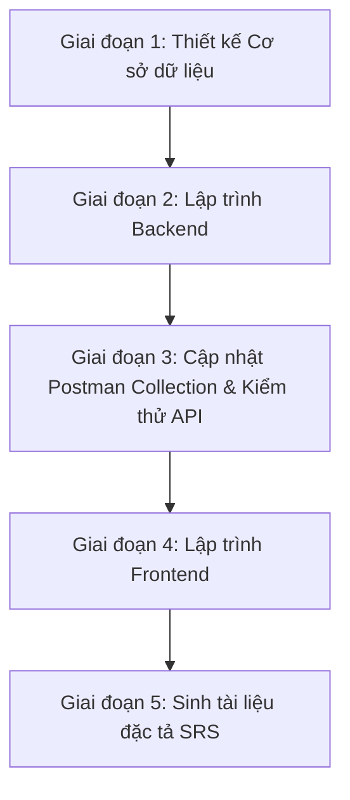
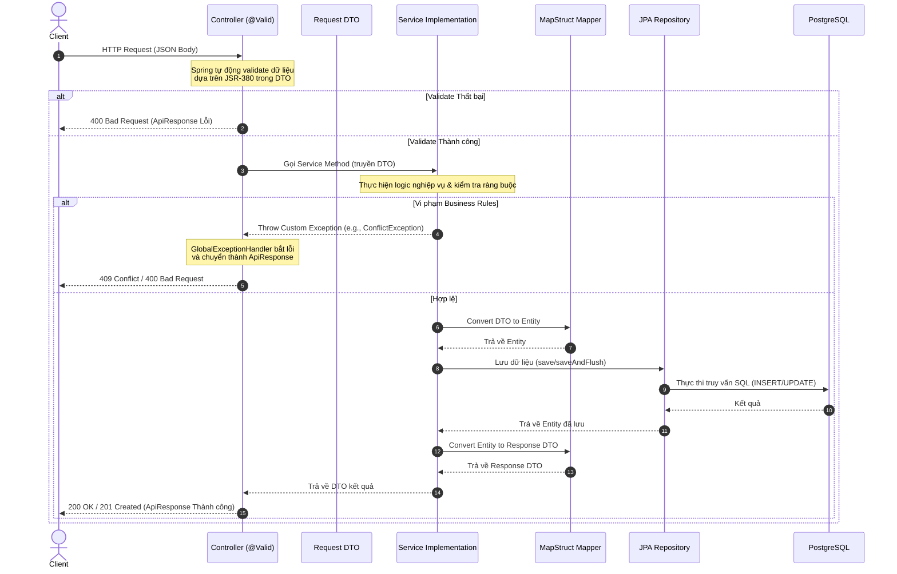
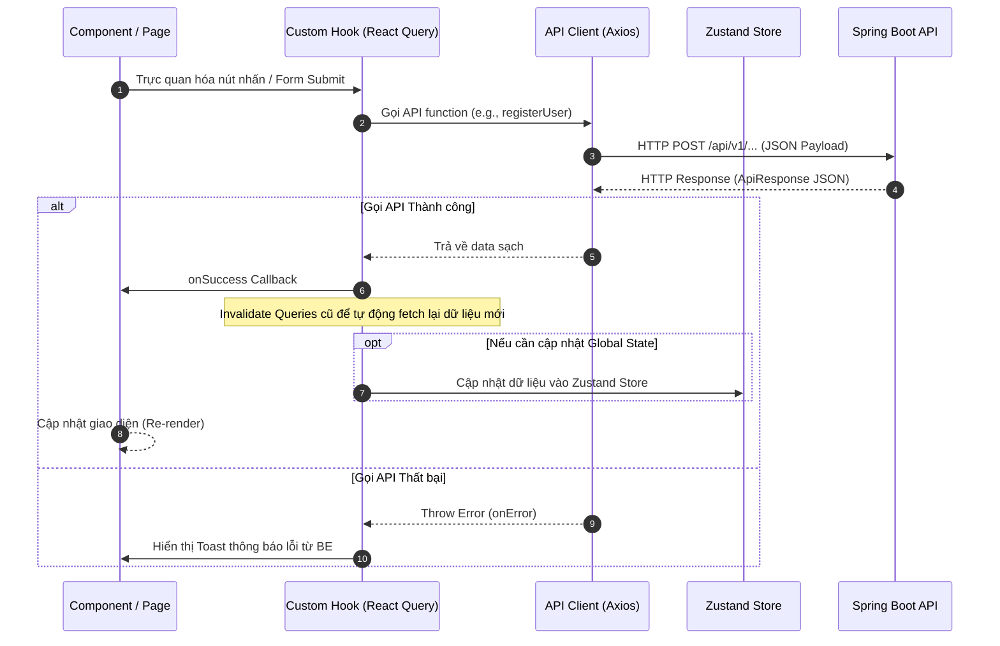

# QUY TRÌNH PHÁT TRIỂN TÍNH NĂNG TOÀN DIỆN (DEVELOPMENT WORKFLOW)

Tài liệu này hướng dẫn chi tiết quy trình từng bước (Step-by-step Workflow) và các quy tắc lập trình cốt lõi để triển khai một tính năng hoặc Use Case (UC) mới trong dự án **AlumNect**, bao gồm cả **Backend (Spring Boot)** và **Frontend (React + Vite + TS)**. 

Mọi lập trình viên và AI Assistant phải tuân thủ nghiêm ngặt quy trình này nhằm đảm bảo tính đồng bộ, nhất quán của mã nguồn và tài liệu hệ thống.

---

## 1. NGUYÊN TẮC CỐT LÕI & CHỈ THỊ CHO AI (CORE PRINCIPLES)

1. **Documentation Driven Development (DDD)**: Tài liệu là nguồn gốc duy nhất của sự thật. Không viết mã nếu không có tài liệu mô tả yêu cầu hoặc đặc tả hệ thống tương ứng.
2. **Specification Driven Development (SDD)**: Mọi chức năng phải có Đặc tả yêu cầu phần mềm (SRS), Use Case (UC) chi tiết trước khi tiến hành triển khai.
3. **Design Driven Development**: Sử dụng hệ thống Design Tokens và các kiểu dáng Pastel Premium được tích hợp trực tiếp tại Giai đoạn 4 của tài liệu này.
4. **Strict Directory Structure Adherence**: Việc tạo mới hoặc sửa đổi mã nguồn Backend/Frontend bắt buộc phải tuân thủ chính xác 100% cấu trúc thư mục tiêu chuẩn của Spring Boot (Kiến trúc Layered + Feature) và React (Kiến trúc Feature-Based) được định nghĩa chi tiết dưới đây.
5. **Chỉ thị chất lượng cho AI Assistant**:
   * *Không sử dụng placeholder*: Mọi đoạn code được viết phải hoàn chỉnh, có xử lý lỗi, logic nghiệp vụ thực tế, và comment đầy đủ. Không viết các đoạn code kiểu `// TODO: implement this`.
   * *Đồng bộ tuyệt đối*: Khi code xong, lập tức cập nhật tài liệu SRS tương ứng ở `docs/update_SRS/`, cập nhật `postman_collection.json` và DB migrations để luôn duy trì sự nhất quán.
   * *Độ ổn định cao*: Đảm bảo code chạy được ngay, vượt qua kiểm tra compile (`./mvnw clean compile` hoặc `npm run build`) và lint lỗi của dự án.
   * *Quy chuẩn ngôn ngữ*: Tên class, method, variable, package... viết bằng **Tiếng Anh**. Tuy nhiên, toàn bộ Javadoc, comment giải thích trong code bắt buộc phải viết bằng **Tiếng Việt**.

---

## TỔNG QUAN VÒNG ĐỜI PHÁT TRIỂN (DEVELOPMENT LIFECYCLE)

Một tính năng hoàn chỉnh sẽ đi qua các giai đoạn sau:



---

## CHI TIẾT CÁC BƯỚC THỰC HIỆN

### GIAI ĐOẠN 1: THIẾT KẾ CƠ SỞ DỮ LIỆU (DATABASE MIGRATION)

Khi tính năng yêu cầu thay đổi cấu trúc database (thêm bảng, thêm cột, chỉnh sửa constraint):

> [!IMPORTANT]
> **Yêu cầu cung cấp cấu trúc Database**: Trước khi bắt đầu thực hiện quy trình phát triển (Workflow), người làm (lập trình viên/khách hàng) bắt buộc phải gửi/cung cấp đầy đủ cấu trúc các bảng database liên quan cho AI Assistant để có cơ sở đối chiếu và triển khai.

> [!IMPORTANT]
> **Quy tắc Flyway bất biến**: Tuyệt đối không chỉnh sửa trực tiếp các file SQL cũ đã chạy (như `V1__init_auth_tables.sql`). Mọi thay đổi cấu trúc DB đều phải tạo file migration mới để đảm bảo tính toàn vẹn và tránh lỗi checksum của Flyway.

1. **Kiểm tra phiên bản hiện tại**: Tìm phiên bản có số version lớn nhất trong thư mục `alumnect-backend/src/main/resources/db/migration/` để đặt số version tiếp theo tuần tự (`V2`, `V3`,...).
2. **Tạo file migration mới**:
   * Đường dẫn: `alumnect-backend/src/main/resources/db/migration/V<Version_Tiếp_Theo>__<mô_tả_ngắn_gọn>.sql`
   * Ví dụ: `V2__add_events_table.sql`.
3. **Quy tắc viết câu lệnh SQL**:
   * Tất cả từ khóa SQL phải viết **IN HOA** (ví dụ: `CREATE TABLE`, `BIGINT`, `NOT NULL`, `REFERENCES`, `CONSTRAINT`).
   * Tên bảng và tên cột viết bằng chữ **thường**, dạng `snake_case`.
   * Khóa chính: Sử dụng tự động tăng `BIGINT GENERATED ALWAYS AS IDENTITY PRIMARY KEY` cho các bảng thông thường. Đối với các bảng có quan hệ 1-1 (như profile, settings), sử dụng khóa chính là khóa ngoại trỏ tới bảng gốc (ví dụ: `user_id BIGINT PRIMARY KEY`).
   * Cột thời gian: `TIMESTAMPTZ NOT NULL DEFAULT now()`.
   * Cột trạng thái/loại enum: Sử dụng kiểu `VARCHAR(20)` hoặc `VARCHAR(50)` kết hợp với ràng buộc `CONSTRAINT ck_... CHECK (... IN (...))` để quản lý các giá trị giới hạn của enum dưới dạng chuỗi (ví dụ: `CONSTRAINT ck_users_role CHECK (role IN ('STUDENT', 'ALUMNI', 'ADMIN'))`).
   * Định nghĩa khóa ngoại bằng câu lệnh `ALTER TABLE ADD CONSTRAINT` riêng biệt ở cuối file.
   * Tạo `INDEX` cho các cột khóa ngoại hoặc các cột thường xuyên được truy vấn lọc (ví dụ: `CREATE INDEX idx_posts_user_id ON posts (user_id);`).
4. **Ví dụ minh họa viết file migration mới (`V2__xxx.sql`):**
   * *Trường hợp A: Thêm bảng mới:*
     ```sql
     CREATE TABLE posts (
         id          BIGINT        GENERATED ALWAYS AS IDENTITY PRIMARY KEY,
         user_id     BIGINT        NOT NULL,
         title       VARCHAR(250)  NOT NULL,
         content     TEXT          NOT NULL,
         created_at  TIMESTAMPTZ   NOT NULL DEFAULT now(),
         updated_at  TIMESTAMPTZ   NOT NULL DEFAULT now()
     );

     -- Đặt FOREIGN KEY ở cuối file
     ALTER TABLE posts ADD CONSTRAINT fk_posts_user_id FOREIGN KEY (user_id) REFERENCES users(id) ON DELETE CASCADE;
     -- Tạo INDEX ở cuối file
     CREATE INDEX idx_posts_user_id ON posts (user_id);
     ```
   * *Trường hợp B: Thêm cột hoặc ràng buộc mới vào bảng đã có:*
     ```sql
     ALTER TABLE user_profiles ADD COLUMN cover_photo_url VARCHAR(500);
     ```

---

### GIAI ĐOẠN 2: LẬP TRÌNH BACKEND (SPRING BOOT + JAVA)

Backend của dự án được tổ chức theo kiến trúc **Layered + Feature**.

> [!IMPORTANT]
> **Quy tắc Kỹ thuật Backend quan trọng**:
> * **Chuẩn phản hồi**: Toàn bộ Controller API bắt buộc phải trả về đối tượng chuẩn `ResponseEntity<ApiResponse<T>>`.
> * **Validation tiếng Việt**: Mọi thông báo lỗi kiểm tra dữ liệu (`message` trong DTO Request) bắt buộc phải viết bằng **Tiếng Việt**.
> * **Tiền tố API toàn cục**: Tiền tố `/api/v1` được cấu hình tự động bởi hệ thống (`WebMvcConfig`), vì vậy các Controller chỉ mapping relative path (ví dụ: `@RequestMapping("/auth")` thay vì `@RequestMapping("/api/v1/auth")`).
> * **Cấu hình DB Hibernate**: `spring.jpa.hibernate.ddl-auto=validate` được bật, do đó Hibernate không tự động sinh bảng. Mọi thay đổi cấu trúc database bắt buộc phải được định nghĩa qua file Flyway migration mới.
> * **Quy chuẩn ngôn ngữ**: Tên class, method, variable... viết bằng **Tiếng Anh**. Tuy nhiên, toàn bộ Javadoc, comment giải thích trong code bắt buộc phải viết bằng **Tiếng Việt**.
> * **Chuyển đổi dữ liệu & Transaction**: Ưu tiên sử dụng MapStruct cho việc map giữa Entity và DTO. Các phương thức nghiệp vụ ghi/sửa dữ liệu ở Service Layer phải có annotation `@Transactional`.
> * **Ghi nhận nhật ký (Logging)**: Sử dụng SLF4J (khuyên dùng `@Slf4j` của Lombok hoặc khai báo `LoggerFactory.getLogger()`) để ghi lại các log quan trọng (info, error) hỗ trợ việc theo dõi và debug hệ thống.

#### Sơ đồ tuần tự xử lý Backend (Backend Sequence Diagram)



#### Mô tả chi tiết luồng xử lý Backend (Backend Execution Flow):

1. **Client gửi HTTP Request**: Client gửi yêu cầu kèm theo dữ liệu (thường dưới dạng JSON Body) tới Controller.
2. **Spring Boot tự động validate dữ liệu**:
   * Trước khi mã nguồn của Controller được thực thi, Spring MVC sử dụng JSR-380 validation để kiểm tra tính hợp lệ của Request DTO dựa trên các annotation ràng buộc (ví dụ: `@NotBlank`, `@Size`, `@Pattern`...).
   * **Nếu kiểm tra thất bại**: Spring ném ra ngoại lệ `MethodArgumentNotValidException`. `GlobalExceptionHandler` sẽ lập tức bắt ngoại lệ này, chuyển đổi thành định dạng `ApiResponse` lỗi kèm theo chi tiết các trường bị lỗi, và trả về cho Client mã trạng thái `400 Bad Request`.
3. **Gọi Service xử lý**: Nếu dữ liệu hợp lệ, Controller chuyển tiếp dữ liệu và gọi phương thức xử lý nghiệp vụ ở Service Layer.
4. **Kiểm tra quy tắc nghiệp vụ (Business Rules)**:
   * Service Layer tiến hành kiểm tra các điều kiện logic nghiệp vụ (ví dụ: kiểm tra trùng lặp email, kiểm tra tính hợp lệ của khóa ngoại...).
   * **Nếu vi phạm nghiệp vụ**: Service ném ra các ngoại lệ runtime tùy chỉnh như `ConflictException`, `BadRequestException`, hay `ResourceNotFoundException`. Các ngoại lệ này tiếp tục được `GlobalExceptionHandler` bắt tập trung để chuyển đổi thành `ApiResponse` lỗi tương ứng với mã HTTP phù hợp (409 Conflict, 400 Bad Request, 404 Not Found) và trả về cho Client.
5. **Chuyển đổi dữ liệu và thao tác DB**:
   * Nếu các kiểm tra hợp lệ, Service sử dụng MapStruct Mapper để chuyển đổi từ Request DTO sang đối tượng Entity.
   * Service gọi phương thức của JPA Repository. Repository (thông qua Spring Data JPA & Hibernate) thực hiện các truy vấn SQL xuống PostgreSQL database để lưu trữ hoặc cập nhật dữ liệu.
6. **Trả về kết quả phản hồi thành công**:
   * Database thực thi thành công và trả lại kết quả cho Repository, Repository trả về đối tượng Entity đã lưu cho Service.
   * Service sử dụng MapStruct Mapper để chuyển đổi Entity sang Response DTO (để lọc bỏ các thông tin nhạy cảm trước khi gửi đi).
   * Service trả Response DTO về cho Controller.
   * Controller đóng gói Response DTO vào đối tượng chuẩn `ResponseEntity<ApiResponse<T>>` và phản hồi về cho Client với mã trạng thái thành công (`200 OK` hoặc `201 Created`).

#### Quy trình lập trình các Layer:

> [!IMPORTANT]
> **Quy chuẩn Chú thích Mã nguồn (Javadoc & Comments)**:
> Mọi class, interface, method, và field trong Backend bắt buộc phải có comment giải thích rõ ràng bằng Tiếng Việt.
> *   **Javadoc cho Lớp/Giao diện (Class/Interface)**: Giải thích ngắn gọn vai trò của lớp.
> *   **Javadoc cho Phương thức (Method)**: Mô tả chi tiết nhiệm vụ, tham số đầu vào (`@param`), và kết quả trả về (`@return`):
>     ```java
>     /**
>      * [Tên chức năng và mô tả ngắn gọn bằng Tiếng Việt]
>      * Mô tả chi tiết: [Mô tả chi tiết luồng xử lý hoặc nhiệm vụ của phương thức]
>      *
>      * @param [tên_tham_số] [Mô tả tham số đầu vào và các ràng buộc]
>      * @return [Mô tả kết quả trả về của hàm]
>      */
>     ```
> *   **Comment cho các trường dữ liệu (Entity/DTO Fields)**: Viết comment dạng block/line ngay trên thuộc tính để giải thích ý nghĩa nghiệp vụ:
>     ```java
>     /** Họ và tên của người dùng đăng ký */
>     private String fullName;
>     ```

##### 1. Entity & Repository
* **Entity**:
  * Thư mục: `com.alumnect.alumnect_backend.entity.[feature_name]/`
  * Tên file: `[Feature].java` (ví dụ: `Post.java`)
  * Yêu cầu: Sử dụng đầy đủ JPA annotations, viết Javadoc cho class và viết comment Tiếng Việt giải thích ý nghĩa nghiệp vụ ngay trên từng field.
* **Repository**:
  * Thư mục: `com.alumnect.alumnect_backend.dao.[feature_name]/`
  * Tên file: `[Feature]Repository.java` (ví dụ: `UserRepository.java`)
  * Yêu cầu: Kế thừa `JpaRepository` (và `JpaSpecificationExecutor` nếu cần lọc/tìm kiếm động). Viết Javadoc cho interface.

##### 2. DTOs (Data Transfer Objects)
* Định nghĩa các lớp Request và Response DTO dưới package `com.alumnect.alumnect_backend.dto/`:
  * `request/[feature_name]/`: Nhận dữ liệu đầu vào. Sử dụng validation của `jakarta.validation.constraints` (như `@NotBlank`, `@NotNull`, `@Size`, `@Email`, `@Pattern`). **Tất cả thông báo lỗi (`message`) bắt buộc phải viết bằng Tiếng Việt**.
  * `response/[feature_name]/`: Định nghĩa cấu trúc dữ liệu trả về cho Client.
* Yêu cầu: Viết Javadoc cho lớp và comment Tiếng Việt chi tiết ngay trên từng thuộc tính để giải thích ý nghĩa nghiệp vụ.

##### 3. Mappers (MapStruct)
* Thư mục: `com.alumnect.alumnect_backend.mapper.[feature_name]/`
* Tên file: `[Feature]Mapper.java` (ví dụ: `AuthMapper.java`)
* Yêu cầu: Định nghĩa `@Mapper(componentModel = "spring")` để chuyển đổi tự động giữa Entity và DTO. Viết Javadoc cho interface.

##### 4. Service Layer
* **Interface**:
  * Thư mục: `com.alumnect.alumnect_backend.service.[feature_name]/`
  * Tên file: `[Feature]Service.java` (ví dụ: `AuthService.java`)
  * Yêu cầu: Viết Javadoc Tiếng Việt đầy đủ mô tả chức năng của interface và từng phương thức nghiệp vụ, bao gồm mô tả tham số (`@param`) và kết quả trả về (`@return`).
* **Implementation Class**:
  * Thư mục: `com.alumnect.alumnect_backend.service.[feature_name]/`
  * Tên file: `[Feature]ServiceImpl.java` (ví dụ: `AuthServiceImpl.java` - lưu ý đuôi **ServiceImpl** thay vì ServiceImp)
  * Yêu cầu: Đánh dấu `@Service` và `@RequiredArgsConstructor`. Thêm `@Transactional` cho các phương thức có thực hiện ghi/sửa database. Nếu phát sinh lỗi nghiệp vụ, hãy ném các Custom Runtime Exceptions tương ứng (`ResourceNotFoundException`, `ConflictException`, `BadRequestException`).

##### 5. Controller Layer
* Thư mục: `com.alumnect.alumnect_backend.controller.[feature_name]/`
* Tên file: `[Feature]Controller.java` (ví dụ: `AuthController.java`)
* Yêu cầu:
  * Sử dụng `@RestController` và cấu hình mapping tương đối qua `@RequestMapping` (ví dụ: `@RequestMapping("/posts")`). Tiền tố global `/api/v1` sẽ tự động được thêm bởi `WebMvcConfig`.
  * Sử dụng `@Valid @RequestBody` để tự động kiểm tra tính hợp lệ của DTO request.
  * Viết Javadoc Tiếng Việt đầy đủ cho từng endpoint API để làm rõ vai trò, các tham số request, và phản hồi.
  * **Định dạng phản hồi bắt buộc**: Tất cả endpoint phải trả về đối tượng `ResponseEntity<ApiResponse<T>>`:
    * Thành công: Trả về `ResponseEntity.ok(ApiResponse.success("Thông báo tiếng Việt", data))` (HTTP 200 OK) hoặc `ResponseEntity.status(HttpStatus.CREATED).body(ApiResponse.success("Thông báo tiếng Việt", data))` (HTTP 201 Created).
    * Thất bại: Được bắt tập trung và chuyển đổi tại [GlobalExceptionHandler.java](file:///d:/Alumnect/alumnect-backend/src/main/java/com/alumnect/alumnect_backend/exception/GlobalExceptionHandler.java). Lỗi validation từ `MethodArgumentNotValidException` sẽ được trích xuất thành danh sách map lỗi chi tiết các trường gửi về Client.
    * **Phân trang đối với danh sách**: Đối với các API trả về danh sách dữ liệu (GET list), bắt buộc phải sử dụng phân trang và trả về đối tượng bọc [PageResponse.java](file:///d:/Alumnect/alumnect-backend/src/main/java/com/alumnect/alumnect_backend/common/api/PageResponse.java) (ví dụ: `ResponseEntity<ApiResponse<PageResponse<T>>>`) để tối ưu hóa hiệu năng truy vấn database và mạng.

##### 6. Cấu hình phân quyền truy cập (Spring Security Endpoints)
* Thư mục/File: `com.alumnect.alumnect_backend.security.Endpoints.java`
* Yêu cầu:
  * Khi tạo mới các API endpoint, bắt buộc phải khai báo chúng vào các mảng tương ứng trong tệp tin [Endpoints.java](file:///d:/Alumnect/alumnect-backend/src/main/java/com/alumnect/alumnect_backend/security/Endpoints.java) để Spring Security quản lý quyền truy cập:
    * **Các API công khai (không cần đăng nhập)**: Khai báo đường dẫn đầy đủ (bao gồm cả tiền tố `/api/v1`) vào mảng `PUBLIC_GET` (cho method GET) hoặc `PUBLIC_POST` (cho method POST/PUT/DELETE nếu có).
    * **Các API chỉ dành cho Quản trị viên**: Khai báo đường dẫn đầy đủ vào mảng `ADMIN_ENDPOINT`.
    * **Các API thông thường cần đăng nhập (khách hàng/cựu sinh viên/sinh viên)**: Mặc định không cần khai báo tại đây (Spring Security sẽ tự động yêu cầu xác thực JWT cho tất cả các endpoint còn lại).

##### 7. Biên dịch & Kiểm tra cục bộ (Local Build & Verify)
* Yêu cầu:
  * Sau khi hoàn thành toàn bộ code Backend (bao gồm cả việc đăng ký Endpoints), bắt buộc phải thực hiện biên dịch dự án tại thư mục `alumnect-backend` để kiểm tra lỗi cú pháp và kích hoạt MapStruct sinh code tự động:
    ```bash
    ./mvnw clean compile
    ```
  * Chạy thử ứng dụng Spring Boot (qua IDE hoặc lệnh `./mvnw spring-boot:run`) nhằm xác nhận:
    * File SQL Flyway migration mới chạy thành công không lỗi cú pháp.
    * JPA Hibernate hoàn thành quá trình `validate` cấu trúc DB mà không gặp lỗi lệch khớp thực thể (Entity mapping mismatch).
  * *Lưu ý*: Nếu định nghĩa thêm các ngoại lệ Custom Runtime Exception mới, người làm cần đăng ký thêm phương thức bắt ngoại lệ tương ứng tại [GlobalExceptionHandler.java](file:///d:/Alumnect/alumnect-backend/src/main/java/com/alumnect/alumnect_backend/exception/GlobalExceptionHandler.java) để trả về đúng HTTP Status Code và định dạng `ApiResponse`.

---

### GIAI ĐOẠN 3: CẬP NHẬT POSTMAN COLLECTION & KIỂM THỬ API

Sau khi triển khai xong API ở Backend, lập trình viên/AI Assistant bắt buộc phải cập nhật tệp [postman_collection.json](file:///d:/Alumnect/postman_collection.json) ở thư mục gốc của dự án theo đúng chuẩn phân chia thư mục nghiệp vụ và kịch bản dưới đây:

1. **Chuẩn Phân Chia Cấu Trúc Thư Mục (Folder Hierarchy)**:
   * **Thư mục cấp 1 (Root Folders - Nhóm Module Lớn)**: Đặt tên theo các module chức năng chính/Use Case lớn của dự án, đánh số thứ tự dạng hai chữ số (ví dụ: `01. Authentication & Registration`, `02. User Profiles`, `03. Admin Operations`).
   * **Thư mục cấp 2 (Sub-folders - Nhóm Nghiệp Vụ Nhỏ)**: Phân chia nhỏ hơn theo từng nhóm endpoint nghiệp vụ cụ thể. Cách đánh số theo dạng `XX.Y.` (ví dụ: `01.1. Chuyên ngành (Majors)`, `01.2. Đăng ký tài khoản (Register)`, `01.6. Lưu trữ tệp tin (File Storage)`).
   * **Sắp xếp logic**: Các thư mục có mối liên kết luồng nghiệp vụ cần được sắp xếp theo thứ tự thực thi hợp lý (ví dụ: sinh link/upload file minh chứng luôn chạy trước đăng ký sử dụng link đó).

2. **Chuẩn Đặt Tên Request và Kịch Bản Kiểm Thử (Naming Conventions)**:
   * Tất cả các request trong collection phải được đặt tên rõ ràng theo cấu trúc: `[Tên API/Hành động] - [Kết quả mong đợi]`.
     * **Kịch bản thành công (Success Cases)**: Đặt hậu tố `- Thành công` (ví dụ: `Đăng ký vai trò Sinh viên (STUDENT) - Thành công`).
     * **Kịch bản lỗi nghiệp vụ (Business Logic Failures)**: Chỉ rõ lỗi mong đợi (ví dụ: `Đăng ký thất bại - Trùng email đang hoạt động (ACTIVE)`).
     * **Kịch bản lỗi ràng buộc dữ liệu (Validation Failures)**: Chỉ rõ trường dữ liệu bị thiếu/sai (ví dụ: `Đăng ký ALUMNI thất bại - Thiếu ảnh minh chứng (proofUrl)`).

3. **Yêu Cầu Nội Dung Request & Dọn Dẹp Sạch Sẽ (Request Quality & Cleanup)**:
   * **`request.url`**: Bắt buộc sử dụng biến môi trường/collection làm tiền tố: `{{baseUrl}}/api/v1/...`
   * **`request.body`**: JSON raw body mẫu chuẩn xác, sử dụng dữ liệu test thực tế có nghĩa bằng Tiếng Việt (ví dụ: `"fullName": "Trần Văn Cựu Sinh Viên"`).
   * **Không chứa dữ liệu cục bộ**: Tuyệt đối không để lại các đường dẫn tuyệt đối riêng tư từ máy cá nhân lập trình viên (ví dụ: `d:\\MyFolder\\avatar.png`) trong trường `"src"` của request upload file. Bắt buộc thay bằng giá trị rỗng hoặc tên file tương đối tiêu chuẩn (ví dụ: `bang_tot_nghiep.png`).
   * **Sử dụng Placeholder**: Các link ảnh minh chứng mặc định nên dùng link giả lập ví dụ mẫu (ví dụ: `https://example.com/minh-chung-bang-tot-nghiep.jpg`) để người khác dễ dàng chạy thử.
   * **`request.description`**: Viết tài liệu Markdown ngắn mô tả phân quyền (Public, Token, Admin...), mục đích API và mã phản hồi mong đợi.

4. **Quy Tắc Tự Động Hóa trên Postman**:
   * **Tự động trích xuất JWT Token**: Đối với API đăng nhập (Login), bắt buộc phải thêm đoạn mã script sau vào tab **Tests** của request đó để tự động gán token nhận được vào biến collection `jwtToken` (tránh việc người làm phải copy-paste thủ công):
     ```javascript
     var jsonData = pm.response.json();
     if (jsonData.data && jsonData.data.token) {
         pm.collectionVariables.set("jwtToken", jsonData.data.token);
     }
     ```
   * **Sử dụng biến Authorization**: Đối với toàn bộ các API yêu cầu đăng nhập, chọn tab **Authorization**, đặt Type là **Bearer Token** và điền giá trị là `{{jwtToken}}` để tự động thừa hưởng token từ quá trình đăng nhập.

5. **Kiểm thử và Thử nghiệm API (API Testing & Verification)**:
   * Sau khi hoàn thành và khởi chạy Spring Boot Backend locally, người làm hoặc AI Assistant có thể kiểm thử trực tiếp bằng ba cách:
     * **Cách 1: Kiểm thử tự động toàn bộ Collection bằng Newman** (Khuyên dùng để kiểm tra tự động hàng loạt):
       ```bash
       npx newman run postman_collection.json --env-var "baseUrl=http://localhost:8080"
       ```
     * **Cách 2: Sử dụng các câu lệnh Terminal đơn lẻ (như `curl` hoặc PowerShell `Invoke-RestMethod`)** để kiểm tra nhanh từng endpoint cụ thể:
       * *Ví dụ (GET)*: `curl -X GET http://localhost:8080/api/v1/majors`
       * *Ví dụ (POST)*: `curl -X POST http://localhost:8080/api/v1/auth/register -H "Content-Type: application/json" -d "{\"fullName\":\"Test\",\"email\":\"test@gmail.com\",\"password\":\"Pass123!\",\"role\":\"STUDENT\",\"majorId\":1,\"cohort\":18}"`
     * **Cách 3: Thử nghiệm trực quan qua Swagger UI**:
       * Truy cập địa chỉ: `http://localhost:8080/swagger-ui.html` trên trình duyệt để kiểm tra danh sách đặc tả API chi tiết và chạy thử trực quan thông qua tính năng "Try it out" của Swagger.
   * **Yêu cầu đối với AI Assistant**: Trước khi hoàn thành Giai đoạn 3, AI Assistant bắt buộc phải sử dụng các phương pháp kiểm thử này (ưu tiên chạy toàn bộ test suite bằng Newman) để tự động kiểm thử và kiểm tra các mã HTTP phản hồi từ Server đảm bảo đúng đặc tả nghiệp vụ.

5. **Tạo tệp tin Review Backend (Backend Review Document)**:
   * Sau khi kiểm thử thành công, AI Assistant bắt buộc phải tạo một tệp tin Review Backend bằng định dạng Markdown để báo cáo và giúp khách hàng/lập trình viên dễ dàng đánh giá lại toàn bộ phần việc đã làm.
   * Đường dẫn lưu tệp tin: Tạo trực tiếp ở thư mục gốc của dự án với định dạng tên `Review_Backend_[Mã_UC]_[Tên_Tính_Năng].md` (ví dụ: `Review_Backend_UC01_Register.md`).
   * *Lưu ý*: Tệp tin này đã được cấu hình trong [.gitignore](file:///d:/Alumnect/.gitignore) với mẫu `/Review_Backend*.md` để không bị push lên repository Git chung.
   * Cấu trúc tệp tin Review bắt buộc bao gồm:
     * **Thông tin chung**: Tên tính năng, mã Use Case (SRS ID).
     * **Danh sách các file thay đổi**: Liệt kê các tệp tin SQL Migration và các lớp Java đã tạo/chỉnh sửa trong Backend.
     * **Danh sách chi tiết API**: Các endpoint đã triển khai (Method, Path, Request Body, Response).
     * **Bằng chứng kiểm thử thực tế (Newman/curl Logs)**: Sao chép toàn bộ nhật ký (log) kết quả chạy thành công của lệnh Newman hoặc lệnh curl ở terminal để làm bằng chứng chứng minh API hoạt động tốt 100%.

---

### GIAI ĐOẠN 4: LẬP TRÌNH FRONTEND (REACT + VITE + TS)

Frontend của dự án tuân thủ mô hình **Enterprise Feature-Based Architecture** và phong cách thiết kế **Premium Pastel Design System**.

> [!IMPORTANT]
> **Quy tắc Thiết kế & Hệ thống Nhận diện Giao diện (Premium Pastel Design System)**:
> Mọi giao diện Frontend được xây dựng phải tuân thủ chính xác hệ thống thiết kế Premium Pastel Design System quy định dưới đây:
> 
> * **Phong cách chủ đạo (Design Direction)**:
>   * Giao diện mang đậm tính **nhân văn, ấm áp, gần gũi** và **cao cấp (premium)**. Tránh thiết kế bảng điều khiển kỹ thuật khô khan (cold tech/dark dashboard).
>   * Sử dụng nền kem ấm kết hợp các hiệu ứng chuyển màu pastel mềm mại, các góc bo tròn lớn (`rounded-3xl`), thẻ trắng mềm (`pillowy white cards`), và chữ màu mực mận chín (`plum`).
> 
> * **Bảng màu chuẩn (Color Palette - Cấu hình trong Tailwind v4 `@theme`)**:
>   * *Nền Canvas*: Cream ấm (`--color-ink-900` / `cream-100` — `#faf4ec`).
>   * *Bề mặt thẻ*: Trắng mềm (`--color-ink-850` / `cream-50` — `#ffffff`).
>   * *Chữ tiêu đề (`h1`, `h2`, `h3`)*: Mực mận chín đậm (`--color-plum-900` — `#322c3f`).
>   * *Chữ nội dung*: Mực mận chín nhạt (`--color-plum-600` — `#6a6178`) - đạt chuẩn tương phản WCAG-AA.
>   * *Màu thương hiệu*: Tím oải hương (`--color-brand-500` — `#7f86ee`).
>   * *Màu nhấn bổ trợ*: Tím đậm (`--color-violet-500` — `#ad85e6`), Cam san hô (`--color-coral-500` — `#fb8366`), Bạc hà (`--color-mint-500` — `#5ecb9b`), Da trời (`--color-sky-500` — `#5fb2ef`), Thủy lam (`--color-aqua-500` — `#29adbe`), Hoàng kim (`--color-gold-500` — `#efaf3e`).
> 
> * **Hệ thống kiểu chữ (Typography)**:
>   * *Font Tiêu Đề*: `Sora`, `Plus Jakarta Sans`, sans-serif (tạo cảm giác bo tròn, hiện đại và thân thiện).
>   * *Font Nội Dung & Giao Diện*: `Plus Jakarta Sans`, `Inter`, sans-serif (tối ưu cho hiển thị kích thước nhỏ và các nút bấm).
> 
> * **Hiệu ứng đặc biệt (Effects & Classes)**:
>   * *Chữ chuyển màu (`.text-gradient`)*: Gradient từ tím thương hiệu sang cam san hô: `linear-gradient(110deg, #6c72e4 0%, #ad85e6 45%, #fb8366 100%)`.
>   * *Kính mờ (`.glass` / `.glass-strong`)*: Nền mờ sang trọng cho Navbar và Modals.
>   * *Thẻ Pillowy (`.card-surface`)*: Bo góc `rounded-3xl` và bóng đổ sâu: `box-shadow: 0 1px 0 0 rgb(255 255 255 / 0.7) inset, 0 18px 44px -22px rgb(120 100 140 / 0.3)`.
>   * *Spotlight Hover (`.spotlight`)* và *Viền chuyển màu (`.ring-gradient`)*.
> 
> * **Hệ thống hoạt ảnh (Micro-animations)**:
>   * Tích hợp các hiệu ứng hoạt ảnh đã cấu hình trong `src/index.css`: `float` / `bob` (trôi nổi), `breathe` (vòng sáng nhịp thở), `marquee` (slider chạy ngang), `sheen` / `hover-sheen` (quét sáng nút bấm), `pop` (hiện modal đàn hồi).
> 
> * **4 Nguyên tắc UX/UI bắt buộc**:
>   1. **Điều hướng nhất quán**: Dùng cấu trúc AppShell, AdminShell thích hợp. Các tab phải có tooltip và thanh gạch dưới chuyển động mượt mà khi được kích hoạt.
>   2. **Trạng thái Trống & Loading**: Dùng component `EmptyState` chuẩn kèm hình pastel minh họa mềm mại và nút kêu gọi hành động (CTA). Khi tải dữ liệu từ API, bắt buộc dùng hiệu ứng xương màu kem ấm (`shimmer skeleton`), tuyệt đối không dùng spinner xoay tròn thô ráp.
>   3. **SmartImage (Xử lý ảnh lỗi)**: Tuyệt đối không dùng thẻ `` trần. Phải bọc trong `<SmartImage />` để xử lý shimmer khi load và tự động hiển thị ảnh/chữ cái fallback (initials) trên nền pastel ngẫu nhiên khi bị lỗi link.
>   4. **Khả năng tiếp cận (Accessibility)**: Đảm bảo độ tương phản màu của chữ (body text sử dụng `--color-plum-600` trên nền canvas kem ấm đạt chuẩn WCAG-AA), và tôn trọng thiết lập giảm chuyển động (`prefers-reduced-motion`) của người dùng.
>   5. **Quy chuẩn Chú thích (Frontend Comments)**:
>       * *React Components & Custom Hooks*: Bắt buộc viết comment Tiếng Việt giải thích ngắn gọn chức năng, các state quan trọng, các props đầu vào, và logic xử lý của hooks ngay trên định nghĩa hàm.
>       * *API & Services*: Giải thích endpoint được gọi, mục đích và dữ liệu trả về mong muốn.

#### Sơ đồ hoạt động của Frontend (Frontend Workflow Diagram)



#### Mô tả chi tiết luồng xử lý Frontend (Frontend Execution Flow):

1. **Tương tác từ UI (Component/Page)**: Người dùng thực hiện tương tác trên giao diện (như nhấn nút, gửi Form). UI gọi hàm kích hoạt từ Custom Hook (ví dụ: `mutate` của `useMutation` để tạo/sửa/xóa, hoặc gọi tự động qua `useQuery` để lấy dữ liệu).
2. **Kích hoạt Custom Hook (React Query)**: Custom Hook tiếp nhận yêu cầu từ UI và gọi hàm gọi API tương ứng được khai báo trong Feature API.
3. **Gọi API Client (Axios)**: Hàm gọi API sử dụng `axiosClient` để gửi HTTP Request kèm payload (JSON) đến Spring Boot Backend (BE).
4. **Backend trả về HTTP Response**: Backend xử lý yêu cầu và trả về đối tượng JSON `ApiResponse`.
5. **Xử lý kết quả (Success/Error)**:
   * **Nếu Gọi API Thành công (Success Flow)**:
     * API Client trả dữ liệu sạch về cho Custom Hook.
     * Custom Hook kích hoạt hàm callback `onSuccess` để:
       * Kích hoạt làm mới cache (Invalidate Queries) thông qua `queryClient.invalidateQueries` để React Query tự động tải lại dữ liệu mới nhất từ Server.
       * Cập nhật trạng thái chia sẻ nếu cần vào **Zustand Store**.
     * Giao diện UI nhận được dữ liệu cập nhật và tự động Re-render để hiển thị cho người dùng.
   * **Nếu Gọi API Thất bại (Error Flow)**:
     * API Client bắt lỗi và ném ra ngoại lệ (Throw Error) kích hoạt callback `onError`.
     * Custom Hook (hoặc UI) hiển thị thông báo Toast cảnh báo lỗi chi tiết lấy từ phản hồi của Backend để thông báo cho người dùng.

#### Quy trình triển khai Features:

##### 1. Tạo thư mục Feature mới
Nếu đây là module nghiệp vụ mới, tạo thư mục tương ứng tại `src/features/[feature_name]/`:
```text
src/features/[feature_name]/
├── components/     # Các component UI riêng biệt phục vụ cho feature này
├── hooks/          # Custom hooks gọi API thông qua React Query (Queries & Mutations)
├── api/            # Định nghĩa các hàm call API axios client
├── model/          # Định nghĩa TypeScript interfaces hoặc Zod schema validate
└── index.ts        # Barrel file xuất khẩu các thành phần dùng chung ra ngoài
```

#### 2. Định nghĩa API & Types
* **API (`api/[feature]Api.ts`)**: Sử dụng đối tượng `axiosClient` dùng chung (`src/lib/axios.ts`) để thực hiện các cuộc gọi REST API.
* **Model/Types (`model/[feature]Types.ts`)**: Khai báo các TypeScript Interface khớp hoàn toàn với cấu trúc Response DTO từ Backend trả về. Sử dụng Zod để validate schema nếu form phức tạp.

#### 3. React Query Hooks (`hooks/use[Feature].ts`)
* Đóng gói logic gọi API vào React Query hooks:
  * Sử dụng `useQuery` cho luồng lấy dữ liệu (GET) để tận dụng cơ chế caching và sync tự động.
  * Sử dụng `useMutation` cho các luồng thay đổi dữ liệu (POST, PUT, DELETE).
  * Xử lý callback `onSuccess` để invalidate queries cũ, đảm bảo UI cập nhật dữ liệu tức thì.

#### 4. UI Components & Pages
* **Thiết kế UI & Tái sử dụng Component**: Áp dụng nghiêm ngặt các quy định về Hệ thống Nhận diện Giao diện (Premium Pastel Design System) nêu phía trên. Ưu tiên sử dụng các UI components dùng chung đã định nghĩa sẵn tại [primitives.tsx](file:///d:/Alumnect/alumnect-frontend/src/components/ui/primitives.tsx):
  * **Layout**: Dùng component `<Container>` để bọc nội dung có chiều rộng tối đa (max-w-7xl). Các thẻ trắng mềm (`pillowy white cards`) phải sử dụng component `<Card>` (tự động có các class `.card-surface` hoặc `.glass` và các góc bo tròn lớn `rounded-3xl`).
  * **Trạng thái Empty**: Sử dụng component `<EmptyState>` chuẩn cho các danh sách trống kèm hình minh họa pastel và nút bấm kêu gọi hành động (CTA).
  * **Trạng thái Tải dữ liệu (Loading)**: Khi đang fetch API, sử dụng component `<Skeleton>` cho hiệu ứng xương kem ấm (`shimmer skeleton`), tuyệt đối không dùng spinner quay tròn thô ráp.
  * **Hình ảnh & Avatar**:
    * Tất cả hình ảnh tải lên hoặc hình ảnh bài viết phải bọc trong component [SmartImage.tsx](file:///d:/Alumnect/alumnect-frontend/src/components/ui/SmartImage.tsx) để tự động xử lý shimmer loading và ảnh fallback khi bị lỗi đường dẫn.
    * Ảnh đại diện người dùng phải sử dụng component `<Avatar>` (tự động xử lý trạng thái ảnh bị lỗi và chuyển đổi sang chữ cái initials trên nền pastel).
* **Quản lý Form & Validation**: Đối với các Form nhập liệu (như Đăng nhập, Đăng ký, Update profile...), bắt buộc sử dụng thư viện `react-hook-form` kết hợp với `zod` schema để kiểm tra tính hợp lệ của dữ liệu đầu vào phía Client trước khi gửi request lên Server, hiển thị thông báo lỗi chi tiết ngay dưới ô nhập liệu tương ứng.
* **Quản lý Client State**: Sử dụng **Zustand** (`src/store/`) nếu cần quản lý trạng thái chia sẻ toàn cục không thuộc về server state.

#### 5. Barrel Export & Routing
* **`index.ts` (Barrel File)**: Export tất cả các component, custom hooks, và store cần thiết ra ngoài để các thư mục khác (như `pages/`) sử dụng. Tránh việc các component bên ngoài import quá sâu vào các thư mục con của feature.
* **Đăng ký Page**: Tạo/Cập nhật file Page trong `src/pages/` (lắp ghép giao diện từ features) và đăng ký Route mới trong tệp cấu hình router [App.tsx](file:///d:/Alumnect/alumnect-frontend/src/App.tsx).

##### 6. Kiểm tra lỗi biên dịch & Lỗi Lint (Frontend Build & Verification)
* Yêu cầu:
  * Sau khi hoàn thành code Frontend, người thực hiện hoặc AI Assistant bắt buộc phải chạy lệnh kiểm tra lỗi cú pháp TypeScript và biên dịch thử dự án tại thư mục `alumnect-frontend` để đảm bảo code sạch và chạy ổn định:
    ```bash
    npm run build
    ```
    hoặc chạy kiểm tra TypeScript cục bộ:
    ```bash
    npx tsc --noEmit
    ```
  * Đảm bảo không có bất kỳ lỗi biên dịch TypeScript hay lỗi Lint nghiêm trọng nào làm gián đoạn tiến trình xuất bản sản phẩm.

---

### GIAI ĐOẠN 5: SINH TÀI LIỆU ĐẶC TẢ SRS CHI TIẾT

Bước cuối cùng của quy trình là tự động sinh tệp đặc tả SRS cho Use Case này tại thư mục `docs/update_SRS/` dưới tên tệp: `SRS_UC_[Mã_UC]_[Tên_Tính_Năng].md`.

Tài liệu này bao gồm 2 phần chính:
1. **Phần 1: Đặc tả Nghiệp vụ (Report 3)**:
   * **Business Workflow**: Sơ đồ nghiệp vụ Mermaid (State/Activity Diagram) kết hợp với **danh sách mô tả chi tiết các bước xử lý bằng chữ**.
   * **Thông tin chi tiết chức năng**: Bao gồm chi tiết về Trigger (Navigation path, Frequency), Description (Actors, Purpose, Interface/States), Data processing, Screen layout, và Details (Data, Validation, Business rules, Error Handling, Normal case, Abnormal case).
   * **Business Rules**: Các điều kiện kiểm tra, ràng buộc logic chung.
   * **Application Messages List**: Bảng chi tiết toàn bộ thông điệp phản hồi từ hệ thống (Mã lỗi, trường dữ liệu, thông điệp tiếng Việt, HTTP Status) khớp 100% với cấu hình trong mã nguồn Backend.
2. **Phần 2: Thiết kế Chi tiết (Report 4)**:
   * **Class Diagram**: Sơ đồ lớp Mermaid thể hiện mối quan hệ giữa các component thực tế kết hợp với **phần chữ giải thích vai trò của từng lớp** (Controller, DTO, Service, Mapper, Repository, Entity).
   * **Sequence Diagram**: Sơ đồ tương tác Mermaid tích hợp đầy đủ cả luồng thành công (Success Flow) và các luồng ngoại lệ/lỗi (Alternative/Exception Flows) trong một sơ đồ duy nhất (sử dụng các khối `alt/else`), kết hợp với **phần chữ mô tả chi tiết từng luồng xử lý tương ứng**.

---
