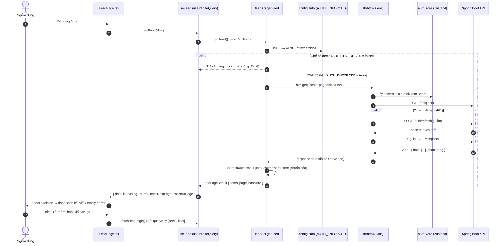

# Flow — Luồng Chạy Mã Nguồn: UC15 Xem Bảng Tin Cộng Đồng

> Tài liệu mô tả luồng chạy code (Frontend) của tính năng UC15 phục vụ review.
> Phạm vi đợt này là **Frontend**; phần Backend mô tả theo hợp đồng API dự kiến.

---

## 1. Sơ đồ luồng (Sequence Diagram)

---

## 2. Các lớp / hàm tham gia (Frontend)

| Tầng | Tệp | Vai trò |
| :--- | :--- | :--- |
| **Page** | `src/pages/app/FeedPage.tsx` | Trang bảng tin: RBAC theo vai trò, tabs lọc, render 5 trạng thái (loading/empty/error/permission/success), nút tải thêm. |
| **Hook** | `src/features/feed/hooks/useFeed.ts` | `useInfiniteQuery` — cache theo bộ lọc, quản lý loading/error, phân trang vô hạn. |
| **API** | `src/features/feed/api/feedApi.ts` | `getFeed()` gọi `GET /api/posts`; chuẩn hóa envelope; fallback mock ở chế độ demo. |
| **Model** | `src/features/feed/model/post.ts` | Kiểu `Post`, `FeedFilter`, `FeedPageResult` + schema Zod `postSchema`. |
| **Barrel** | `src/features/feed/index.ts` | Public API của feature (chỉ import feed qua đây). |
| **HTTP** | `src/lib/http.ts` | Axios instance: đính token, bóc `response.data`, auto-refresh 401. |
| **Store** | `src/store/authStore.ts` | Trạng thái phiên đăng nhập (user, token) — dùng cho RBAC + Bearer. |
| **Config** | `src/config/auth.ts` | Cờ `AUTH_ENFORCED` và `DEMO_USER` (demo-friendly). |
| **Provider** | `src/main.tsx` | `QueryClientProvider` cung cấp TanStack Query cho toàn app. |

## 3. Backend dự kiến (UC-245 — ngoài phạm vi đợt này)

| Lớp | Trách nhiệm dự kiến |
| :--- | :--- |
| `PostController` | Nhận `GET /api/posts?page&size&sort&type`, trả danh sách phân trang. |
| `PostService` | Lọc theo `visibility` (Guest chỉ PUBLIC), loại bài ẩn/gỡ (BR-08/BR-11), gắn cờ `liked` theo viewer. |
| `PostRepository` | Truy vấn `posts` join `post_images`, đếm `post_likes` / `post_comments`. |
| `PostResponseDto` | Định dạng dữ liệu trả về khớp `postSchema` phía FE. |

---

## 4. Luồng xử lý dữ liệu chi tiết

1. **Khởi tạo**: `FeedPage` đọc `authStore` → suy ra `viewer` (phiên thật hoặc `DEMO_USER`),
   tính `canPost` (Student/Alumni) và `isGuest`.
2. **Truy vấn**: `useFeed(filter)` gọi `feedApi.getFeed({ page, filter })`.
   - Demo: trả trang mock (14 bài, `PAGE_SIZE = 5`).
   - Thật: `http.get('/posts?...')` → `extractRawItems()` bóc mảng từ nhiều biến thể
     envelope (`data.items` / `data.content` / mảng) → `postSchema.safeParse()` chuẩn hóa,
     bỏ phần tử hỏng → `inferHasMore()` suy ra còn trang không.
3. **Hiển thị**: FeedPage gộp `data.pages.flatMap(p => p.items)` và render theo trạng thái:
   `isLoading` → skeleton; `isError` → thẻ lỗi + Thử lại; rỗng → empty; ngược lại → danh sách.
4. **Phân trang**: `getNextPageParam` trả `page + 1` khi `hasMore`, nếu không trả `undefined`
   (ẩn nút tải thêm, hiển thị "đã xem hết").
5. **RBAC**: Guest thấy `GuestPrompt` (ẩn ô soạn bài) và các nút tương tác bị `disabled`
   (BR-12); Student/Alumni thấy `Composer` và tương tác đầy đủ.
6. **Lọc**: đổi tab cập nhật `filter` → `queryKey` đổi → TanStack Query tự tải & cache riêng.

---

## 5. Ghi chú cấu hình

- Bật API thật: đặt `VITE_REQUIRE_AUTH=true` và `VITE_API_BASE_URL` trong `.env.local`.
- Endpoint tuân theo `docs/Api.md`: `GET /api/posts` (Guest/Student/Alumni).
