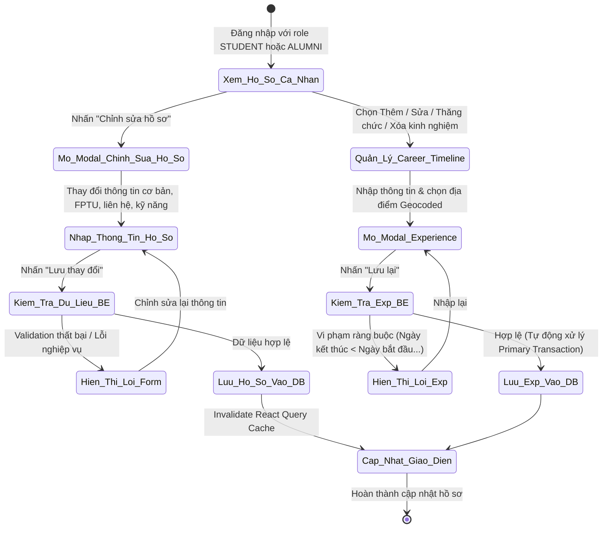
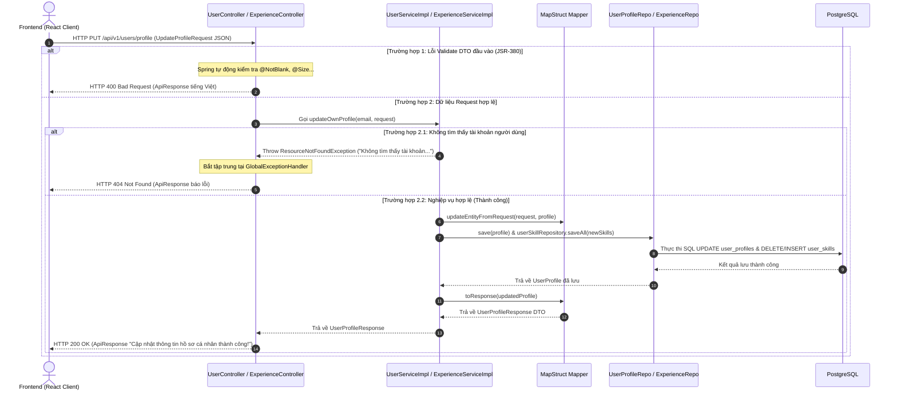

# ĐẶC TẢ YÊU CẦU & THIẾT KẾ CHI TIẾT: UC07 - CHỈNH SỬA HỒ SƠ CÁ NHÂN

## PHẦN 1: ĐẶC TẢ NGHIỆP VỤ (REPORT 3)

### 2.2.3 Business Workflow (Luồng nghiệp vụ)

#### Mô tả chi tiết luồng xử lý bằng chữ (Business Step Description):
* **Bước 1 - Khởi đầu**: Người dùng đã đăng nhập với vai trò `STUDENT` hoặc `ALUMNI` truy cập trang hồ sơ cá nhân (`/app/profile`). Hệ thống hiển thị nút "Chỉnh sửa hồ sơ" và các công cụ quản lý Career Timeline cho chính chủ tài khoản.
* **Bước 2 - Chỉnh sửa thông tin cá nhân**: Người dùng mở modal chỉnh sửa hồ sơ, cập nhật các trường thông tin: Ảnh đại diện, ảnh bìa, họ tên, headline, tiểu sử, campus FPT, chuyên ngành, niên khóa, năm tốt nghiệp/dự kiến tốt nghiệp, số điện thoại, thành phố, liên kết mạng xã hội và danh sách kỹ năng.
* **Bước 3 - Quản lý Career Timeline**: Người dùng có thể thêm kinh nghiệm làm việc mới, chỉnh sửa kinh nghiệm đã có, thăng chức (kết thúc vai trò cũ và tạo vai trò mới tại cùng công ty), gán kinh nghiệm chính (Primary Experience) hoặc xóa kinh nghiệm (có modal xác nhận). Vị trí làm việc được gợi ý qua VietMap Autocomplete để lưu tọa độ geocoded.
* **Bước 4 - Kiểm tra & Lưu trữ**: Backend kiểm tra dữ liệu đầu vào (JSR-380 validation & business rules). Nếu hợp lệ, hệ thống cập nhật vào PostgreSQL trong cùng một Transaction và trả về `UserProfileResponse` hoặc `ExperienceResponse`.
* **Bước 5 - Kết thúc & Đồng bộ**: Frontend nhận phản hồi thành công, làm mới cache React Query (`user-profile`, `experiences`), tự động đóng modal và cập nhật giao diện hiển thị tức thì.

---

### 3.2 Quản Lý Hồ Sơ Cá Nhân

Module Quản lý Hồ sơ Cá nhân cho phép người dùng duy trì thông tin cá nhân, quá trình học tập tại Đại học FPT, kỹ năng chuyên môn và hành trình sự nghiệp (Career Timeline) một cách chính xác và minh bạch.

#### 3.2.1 Chỉnh sửa hồ sơ cá nhân và Quản lý Career Timeline (UC07)

**Function trigger**:
* **Navigation path**: Sidebar / AppShell Header -> Profile Avatar -> `/app/profile` -> Nút "Chỉnh sửa hồ sơ" hoặc Nút "Thêm/Sửa/Xóa kinh nghiệm".
* **Timing Frequency**: On demand (khi người dùng có nhu cầu cập nhật hồ sơ).

**Function description**:
* **Actors/Roles**: Sinh viên (`STUDENT`), Cựu sinh viên (`ALUMNI`).
* **Purpose**: Cập nhật thông tin hồ sơ cá nhân và quản lý danh sách kinh nghiệm làm việc làm cơ sở dữ liệu hiển thị hồ sơ, cựu sinh viên trên Alumni Map và lộ trình Career Path.
* **Interface**:
  - Modal "Chỉnh sửa hồ sơ cá nhân" gồm 4 tab (Cơ bản, Học tập FPTU, Liên hệ & Mạng xã hội, Kỹ năng).
  - Modal "Thêm/Sửa/Thăng chức kinh nghiệm" tích hợp ô tìm kiếm địa điểm VietMap Autocomplete.
  - Modal xác nhận xóa kinh nghiệm.
  - Các trạng thái giao diện: Loading Skeleton kem ấm, Empty State, Toast & Alert Banner hiển thị thông báo lỗi từ Backend.

**Data processing**:
1. Trích xuất danh tính người dùng qua JWT Token ở Security Context.
2. Khi cập nhật hồ sơ: Cập nhật thông tin `user_profiles`, xóa danh sách kỹ năng cũ trong `user_skills` và chèn danh sách mới.
3. Khi chọn kinh nghiệm mới làm Primary: Tự động gỡ bỏ trạng thái Primary của kinh nghiệm cũ trong cùng transaction.
4. Trường thông tin chỉ đọc (Read-only): Email, Role tài khoản, Trạng thái xác minh, Huy hiệu Verified Alumni.

**Screen layout**:
- Figure 07.1: Profile Header Layout with Edit Profile Button
- Figure 07.2: Edit Profile Modal (4 Tabs Layout)
- Figure 07.3: Experience Form Modal with VietMap Autocomplete

**Function details**:
* **Data**: `fullName`, `avatarUrl`, `coverUrl`, `phone`, `headline`, `biography`, `campus`, `cohort`, `majorId`, `graduationYear`, `city`, `socialLinks`, `skills`, `experiences` (`title`, `company`, `location`, `latitude`, `longitude`, `startDate`, `endDate`, `isCurrent`, `isPrimary`, `description`).
* **Validation**:
  - `fullName`: Không được rỗng, tối đa 150 ký tự.
  - `title`, `company`, `startDate`: Không được rỗng.
  - `endDate`: Không được trước `startDate`. Khi `isCurrent = true`, `endDate` tự động gán `NULL`.
  - `latitude` & `longitude`: Phải cùng có giá trị hoặc cùng `NULL`. Latitude nằm trong `[-90, 90]`, Longitude nằm trong `[-180, 180]`.
* **Business rules**:
  - Mỗi người dùng chỉ được có tối đa 1 Primary Experience.
  - Không cho phép người dùng sửa hoặc xóa experience của tài khoản khác.
  - Role, Email, Trạng thái xác minh không được phép thay đổi qua API chỉnh sửa hồ sơ.
* **Normal case**: Trả về `ResponseEntity.ok(ApiResponse.success("...", data))`.
* **Abnormal case**:
  - Thiếu dữ liệu bắt buộc -> HTTP 400 Bad Request kèm chi tiết các trường bị lỗi.
  - Vi phạm quy tắc ngày tháng hoặc tọa độ -> HTTP 400 Bad Request kèm thông điệp tiếng Việt.
  - Truy cập kinh nghiệm không thuộc về mình -> HTTP 404 Not Found.

---

### 5. Requirement Appendix (Phụ lục Yêu cầu)

#### 5.1 Business Rules (Quy tắc Nghiệp vụ)

| ID | Định nghĩa Quy tắc (Rule Definition) |
| :--- | :--- |
| BR-UC07-01 | Student và Alumni dùng chung bảng `experiences` và biểu mẫu quản lý kinh nghiệm. |
| BR-UC07-02 | Danh tính người dùng bắt buộc được xác thực qua JWT Token ở Security Context; không chấp nhận `userId` ở Request Body. |
| BR-UC07-03 | Mỗi người dùng chỉ có tối đa một Primary Experience tại một thời điểm. Việc gán Primary mới phải thực hiện gỡ Primary cũ trong cùng một Transaction. |
| BR-UC07-04 | Ngày kết thúc kinh nghiệm (`endDate`) không được trước ngày bắt đầu (`startDate`). Nếu `isCurrent = true`, `endDate` tự động được gán `NULL`. |
| BR-UC07-05 | Tọa độ địa lý (`latitude`, `longitude`) phải cùng có giá trị hoặc cùng bằng `NULL`. |
| BR-UC07-06 | Thông tin Role, Email, và Trạng thái xác thực không được phép thay đổi thông qua API chỉnh sửa hồ sơ cá nhân. |

#### 5.2 Common Requirements (Yêu cầu Chung)
* Giao diện sử dụng hệ thống màu Pastel Premium (nền kem ấm `#faf4ec`, surface trắng `#ffffff`, chữ mực mận `#322c3f`).
* Sử dụng React Query quản lý state và tự động làm mới cache sau mỗi thao tác ghi dữ liệu.
* Hiển thị thông điệp lỗi nghiệp vụ tiếng Việt trả về từ Backend trực tiếp lên giao diện người dùng.

#### 5.3 Application Messages List (Danh sách Thông điệp Ứng dụng)

| # | Mã thông điệp (Message code) | Loại thông điệp | Ngữ cảnh | Nội dung hiển thị (Content) |
| :--- | :--- | :--- | :--- | :--- |
| 1 | MSG_PROFILE_01 | Toast message | Cập nhật hồ sơ cá nhân thành công | Cập nhật thông tin hồ sơ cá nhân thành công! |
| 2 | MSG_PROFILE_02 | In red, under field | Họ và tên bị rỗng | Họ và tên không được để trống |
| 3 | MSG_PROFILE_03 | In red, under field | Họ và tên quá dài | Họ và tên không được vượt quá 150 ký tự |
| 4 | MSG_PROFILE_04 | In red, under field | Số điện thoại sai định dạng | Số điện thoại không đúng định dạng Việt Nam |
| 5 | MSG_EXP_01 | Toast message | Tạo kinh nghiệm thành công | Tạo kinh nghiệm làm việc thành công |
| 6 | MSG_EXP_02 | Toast message | Cập nhật kinh nghiệm thành công | Cập nhật kinh nghiệm làm việc thành công |
| 7 | MSG_EXP_03 | Toast message | Xóa kinh nghiệm thành công | Xóa kinh nghiệm làm việc thành công |
| 8 | MSG_EXP_04 | In red, under field | Thiếu ngày bắt đầu | Ngày bắt đầu không được để trống |
| 9 | MSG_EXP_05 | Inline / Alert | Ngày kết thúc nhỏ hơn ngày bắt đầu | Ngày kết thúc không được trước ngày bắt đầu |
| 10 | MSG_EXP_06 | Inline / Alert | Sai quy tắc tọa độ | Vĩ độ và kinh độ phải cùng tồn tại hoặc cùng trống |
| 11 | MSG_EXP_07 | Inline / Alert | Không tìm thấy kinh nghiệm | Không tìm thấy kinh nghiệm làm việc với ID: {id} |
| 12 | MSG_EXP_08 | Toast message | Thăng chức thành công | Cập nhật vai trò mới thành công |

---

## PHẦN 2: THIẾT KẾ CHI TIẾT (REPORT 4)

### 3. Detail Design (Thiết kế chi tiết)

#### 3.1 Chỉnh sửa hồ sơ cá nhân & Quản lý Career Timeline

##### 3.1.1 Class Diagram (Sơ đồ Lớp)

```mermaid
classDiagram
    class UserController {
        -UserService userService
        +getOwnProfile() ResponseEntity~ApiResponse~UserProfileResponse~~
        +updateOwnProfile(request) ResponseEntity~ApiResponse~UserProfileResponse~~
    }

    class ExperienceController {
        -ExperienceService experienceService
        +getOwnExperiences() ResponseEntity~ApiResponse~List~ExperienceResponse~~~
        +createExperience(request) ResponseEntity~ApiResponse~ExperienceResponse~~
        +updateExperience(id, request) ResponseEntity~ApiResponse~ExperienceResponse~~
        +deleteExperience(id) ResponseEntity~ApiResponse~Void~~
        +promoteExperience(id, request) ResponseEntity~ApiResponse~ExperienceResponse~~
    }

    class UpdateProfileRequest {
        -String fullName
        -String avatarUrl
        -String coverUrl
        -String phone
        -String headline
        -String biography
        -String campus
        -Integer cohort
        -Long majorId
        -Integer graduationYear
        -String city
        -List~String~ socialLinks
        -List~UserSkillRequest~ skills
    }

    class ExperienceRequest {
        -String title
        -String company
        -String location
        -LocalDate startDate
        -LocalDate endDate
        -boolean isCurrent
        -boolean isPrimary
        -BigDecimal latitude
        -BigDecimal longitude
        -String description
    }

    class UserProfileResponse {
        -Long userId
        -String email
        -String role
        -String fullName
        -String campus
        -Integer graduationYear
        -PrimaryExperienceResponse primaryExperience
        -List~ExperienceResponse~ experiences
        -List~UserSkillResponse~ skills
    }

    class UserService {
        <<interface>>
        +updateOwnProfile(email, request) UserProfileResponse
    }

    class UserServiceImpl {
        -UserRepository userRepository
        -UserProfileRepository userProfileRepository
        -UserSkillRepository userSkillRepository
        -UserProfileMapper userProfileMapper
        +updateOwnProfile(email, request) UserProfileResponse
    }

    class ExperienceService {
        <<interface>>
        +createExperience(email, request) ExperienceResponse
        +updateExperience(email, id, request) ExperienceResponse
        +deleteExperience(email, id) void
    }

    class ExperienceServiceImpl {
        -ExperienceRepository experienceRepository
        -ExperienceMapper experienceMapper
        +createExperience(email, request) ExperienceResponse
        +updateExperience(email, id, request) ExperienceResponse
        +deleteExperience(email, id) void
    }

    class UserProfile {
        -Long userId
        -String fullName
        -String campus
        -Integer graduationYear
        -User user
        -Major major
        -List~Experience~ experiences
        -List~UserSkill~ skills
    }

    class Experience {
        -Long id
        -User user
        -String title
        -String company
        -boolean isCurrent
        -boolean isPrimary
    }

    UserController ..> UpdateProfileRequest : validates & uses
    UserController ..> UserService : calls
    UserServiceImpl ..|> UserService : implements
    UserServiceImpl --> UserProfileRepository : uses
    UserServiceImpl --> UserSkillRepository : uses
    UserServiceImpl --> UserProfile : manipulates

    ExperienceController ..> ExperienceRequest : validates & uses
    ExperienceController ..> ExperienceService : calls
    ExperienceServiceImpl ..|> ExperienceService : implements
    ExperienceServiceImpl --> ExperienceRepository : uses
    ExperienceServiceImpl --> Experience : manipulates
```

###### Mô tả chi tiết cấu trúc các lớp (Class Design Description):
* **Lớp Controller (`UserController`, `ExperienceController`)**: Tiếp nhận yêu cầu HTTP từ Client, tự động validate DTO bằng `@Valid` và trích xuất email đăng nhập từ Security Context.
* **Lớp DTO (`UpdateProfileRequest`, `ExperienceRequest`, `UserProfileResponse`)**: Chứa dữ liệu đầu vào có ràng buộc validation tiếng Việt và dữ liệu trả về cho Frontend.
* **Lớp Service (`UserService`, `ExperienceService`)**: Thực thi logic nghiệp vụ (cập nhật hồ sơ, quản lý danh sách kỹ năng, gỡ/gán Primary Experience trong transaction).
* **Lớp Repository & Entity (`UserProfileRepository`, `ExperienceRepository`, `UserSkillRepository`, `UserProfile`, `Experience`, `UserSkill`)**: Tương tác trực tiếp với cơ sở dữ liệu PostgreSQL.

##### 3.1.2 Sequence Diagram (Sơ đồ Tuần tự hợp nhất)

###### Mô tả chi tiết luồng xử lý bằng chữ (Sequence Flow Description):
1. **Luồng 1 - Thành công (Normal Case)**: Client gửi HTTP PUT kèm DTO hợp lệ. Controller gọi Service, Service cập nhật thực thể `UserProfile` và thay mới kỹ năng trong `user_skills` dưới 1 Transaction, sau đó trả về `UserProfileResponse` với HTTP 200 OK.
2. **Luồng 2 - Ngoại lệ Validation**: Nếu thông tin đầu vào vi phạm ràng buộc `@NotBlank` hay `@Size`, Spring MVC ném `MethodArgumentNotValidException`. `GlobalExceptionHandler` trả về HTTP 400 Bad Request cùng danh sách lỗi bằng tiếng Việt.
3. **Luồng 3 - Ngoại lệ Tài khoản không tồn tại**: Nếu email từ token không có trong DB, Service ném `ResourceNotFoundException`, trả về HTTP 404 Not Found.
