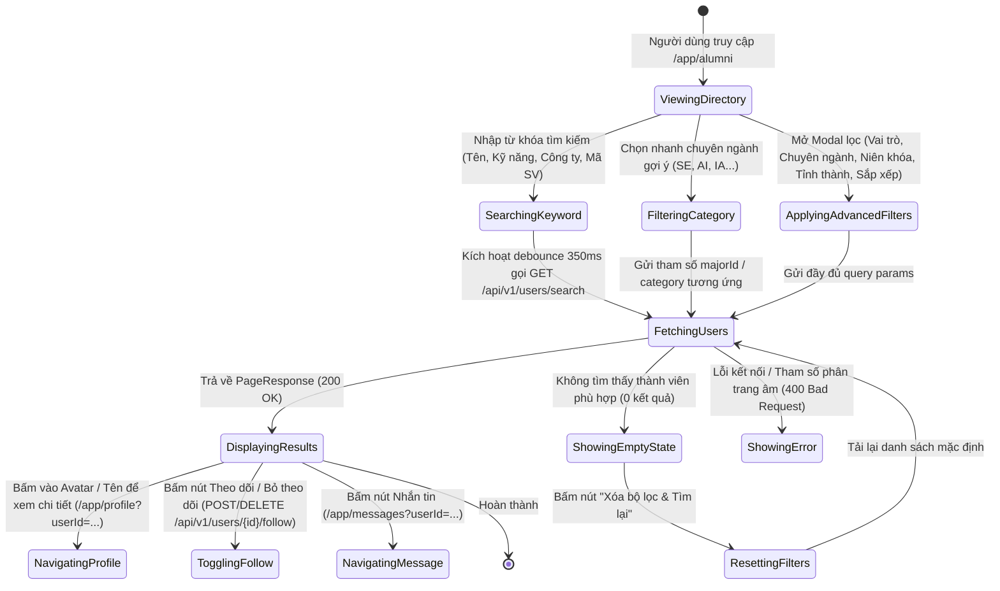
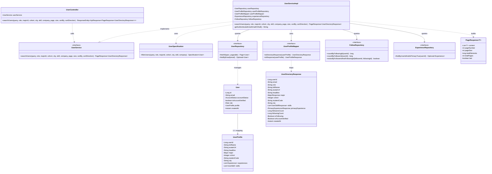
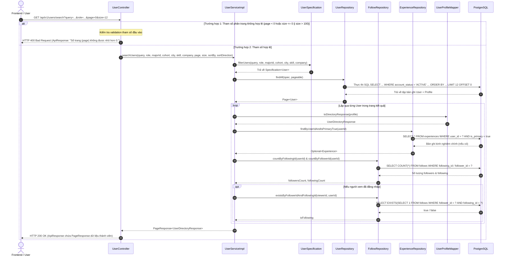

# ĐẶC TẢ YÊU CẦU & THIẾT KẾ CHI TIẾT: UC09 - TÌM KIẾM NGƯỜI DÙNG & DANH BẠ CỰU SINH VIÊN (SEARCH USERS & ALUMNI DIRECTORY)

## PHẦN 1: ĐẶC TẢ NGHIỆP VỤ (REPORT 3)

### 2.2.3 Business Workflow (Luồng nghiệp vụ)

#### Mô tả chi tiết luồng xử lý bằng chữ (Business Step Description):
* **Bước 1 - Khởi đầu**: Người dùng (khách vãng lai, sinh viên hoặc cựu sinh viên) điều hướng tới trang "Danh bạ cựu sinh viên" tại đường dẫn `/app/alumni`.
* **Bước 2 - Các bước chuyển tiếp**:
  * Trình duyệt tự động kích hoạt API `GET /api/v1/users/search?page=0&size=12&sortBy=createdAt&sortDirection=DESC` để tải danh sách thành viên mới nhất.
  * Người dùng có thể:
    * Nhập từ khóa đa trường vào ô tìm kiếm (hệ thống tự động debounce 350ms trước khi gửi API).
    * Bấm chọn nhanh các chuyên ngành gợi ý trên thanh phân loại (SE, AI, IA, GD, IB, MKT).
    * Mở Modal "Bộ lọc chi tiết" để kết hợp lọc theo vai trò (Cựu sinh viên / Sinh viên), chuyên ngành FPTU, niên khóa (K12 - K19), tỉnh/thành phố và tiêu chí sắp xếp.
  * Backend tiếp nhận yêu cầu, dùng `UserSpecification` truy vấn động các tài khoản đang hoạt động (`account_status = 'ACTIVE'`), loại bỏ quản trị viên (`role != 'ADMIN'`), nạp kinh nghiệm làm việc chính, kỹ năng, số lượng follower/following và cờ `isFollowing` đối với người dùng đang đăng nhập.
* **Bước 3 - Kết thúc**: Giao diện hiển thị danh sách thẻ thành viên dạng lưới Pastel Premium. Người dùng có thể phân trang, bấm Theo dõi/Hủy theo dõi, nhắn tin hoặc bấm vào thẻ để chuyển tiếp sang xem chi tiết trang cá nhân.

---

### 3.2 Module Quản Lý Tài Khoản & Mạng Lưới Thành Viên

#### 3.2.1 Tìm kiếm người dùng & Danh bạ cựu sinh viên (UC09)

* **Function trigger**:
  * **Navigation path**: Menu Header / Sidebar -> "Cựu sinh viên" (`/app/alumni`).
  * **Timing Frequency**: On screen mount và mỗi khi người dùng thay đổi từ khóa, bộ lọc hoặc số trang.

* **Function description**:
  * **Actors/Roles**: Khách vãng lai (Guest), Sinh viên (Student), Cựu sinh viên (Alumni), Quản trị viên (Admin).
  * **Purpose**: Cho phép tra cứu, tìm kiếm và khám phá các thành viên trong mạng lưới cộng đồng FPT University theo nhiều tiêu chí đa dạng, thúc đẩy kết nối nghề nghiệp và mở rộng quan hệ.
  * **Interface**:
    * Thanh tìm kiếm đa năng tích hợp nút xóa nhanh (Clear Button).
    * Dải nút chọn nhanh chuyên ngành (Quick Category Chips).
    * Nút mở Modal bộ lọc nâng cao (kèm huy hiệu đếm số lượng tiêu chí đang lọc).
    * Lưới danh sách thẻ thành viên hiển thị Avatar verified, họ tên, vai trò, chức danh, chuyên ngành & niên khóa, công ty hiện tại, địa điểm, thẻ kỹ năng, số follower, nút tương tác Theo dõi và Nhắn tin.
    * Trạng thái tải dữ liệu (`Skeleton`), trạng thái không có kết quả (`EmptyState`) và thanh điều hướng phân trang.

* **Data processing**:
  1. Frontend gửi HTTP `GET /api/v1/users/search` kèm query params: `query`, `role`, `majorId`, `cohort`, `city`, `skill`, `company`, `page`, `size`, `sortBy`, `sortDirection`.
  2. Backend kiểm tra tính hợp lệ của tham số phân trang (`page >= 0`, `1 <= size <= 100`).
  3. `UserSpecification` sinh câu lệnh SQL động với điều kiện `account_status = 'ACTIVE'` và `role != 'ADMIN'`.
  4. Thực hiện phân trang và nạp dữ liệu liên kết (`PrimaryExperience`, `Skills`, `FollowersCount`, `isFollowing`).
  5. Đóng gói kết quả vào `ApiResponse<PageResponse<UserDirectoryResponse>>` trả về cho Client.

* **Screen layout**:
  * Figure 09.1: Alumni Directory Screen layout with search bar, filter modal, and responsive member cards.

* **Function details**:
  * **Data**: `query` (chuỗi), `role` (STUDENT/ALUMNI), `majorId` (Long), `cohort` (Integer), `city` (chuỗi), `page` (int), `size` (int), `sortBy` (chuỗi), `sortDirection` (chuỗi).
  * **Validation**:
    * `page` không được nhỏ hơn 0.
    * `size` phải nằm trong khoảng từ 1 đến 100.
    * Từ khóa `query` không vượt quá 255 ký tự.
  * **Business rules**:
    * **BR-01**: Chỉ hiển thị các tài khoản ở trạng thái hoạt động (`accountStatus = ACTIVE`).
    * **BR-02**: Loại trừ tài khoản quản trị viên (`ADMIN`) khỏi danh bạ thành viên công khai.
    * **BR-03**: Khách vãng lai chưa đăng nhập vẫn có quyền tìm kiếm và xem danh bạ; khi bấm "Theo dõi" hoặc "Nhắn tin" hệ thống sẽ mở Modal yêu cầu đăng nhập.
    * **BR-04**: Với thành viên đã đăng nhập, hệ thống tự động xác định trạng thái `isFollowing` và ẩn nút Theo dõi đối với hồ sơ của chính mình (hiển thị "Hồ sơ của bạn").
    * **BR-05**: Tìm kiếm từ khóa không phân biệt hoa thường và so khớp mờ trên nhiều trường dữ liệu (họ tên, chức danh, mã SV, kỹ năng, công ty, chuyên ngành).
  * **Error Handling**:
    * Trả về HTTP 400 Bad Request kèm thông điệp tiếng Việt nếu `page < 0` hoặc `size` vượt quá giới hạn.
    * Trả về HTTP 500 Internal Server Error nếu xảy ra lỗi kết nối cơ sở dữ liệu.
  * **Normal case**: Trả về HTTP 200 OK cùng dữ liệu phân trang danh bạ người dùng.
  * **Abnormal case**: Máy chủ mất kết nối CSDL, trả về thông báo lỗi thân thiện trên giao diện.

---

### 5. Requirement Appendix (Phụ lục Yêu cầu)

#### 5.1 Business Rules (Quy tắc Nghiệp vụ)

| ID | Định nghĩa Quy tắc (Rule Definition) |
| :--- | :--- |
| BR-01 | Chỉ các tài khoản có trạng thái `account_status = 'ACTIVE'` mới được xuất hiện trên kết quả tìm kiếm danh bạ. |
| BR-02 | Tài khoản mang vai trò `ADMIN` bị loại trừ khỏi kết quả tìm kiếm danh bạ cộng đồng. |
| BR-03 | API tìm kiếm `/api/v1/users/search` là công khai (Public GET); không bắt buộc Token xác thực. |
| BR-04 | Khi người dùng đã đăng nhập, hệ thống tự động ánh xạ quan hệ `follows` để trả về cờ `isFollowing = true/false`. |
| BR-05 | Giá trị phân trang mặc định là `page = 0`, `size = 12`; `size` tối đa không vượt quá 100 bản ghi mỗi trang. |

#### 5.2 Common Requirements (Yêu cầu Chung)
* Giao diện tuân thủ tiêu chuẩn Pastel Premium: Canvas `#faf4ec`, Card bề mặt trắng bo góc lớn `rounded-3xl`, viền `border-plum-900/10`, hiệu ứng kính mờ `glassmorphism`, bóng đổ mềm và chuyển động mượt mà bằng Framer Motion.
* Hỗ trợ tìm kiếm từ khóa tức thì với cơ chế debounce 350ms để tối ưu tải máy chủ.
* Dữ liệu phân trang đầy đủ, có nút điều hướng Trang trước / Trang sau và hiển thị tổng số kết quả.

#### 5.3 Application Messages List (Danh sách Thông điệp Ứng dụng)

| # | Mã thông điệp | Loại | Ngữ cảnh | Nội dung hiển thị |
|---|---|---|---|---|
| 1 | MSG_SEARCH_SUCCESS | In line | Tìm kiếm danh bạ thành công | Tìm kiếm danh sách người dùng thành công! |
| 2 | MSG_PAGE_INVALID | Toast / Alert | Tham số `page < 0` | Số trang (page) không được nhỏ hơn 0. |
| 3 | MSG_SIZE_INVALID | Toast / Alert | Tham số `size <= 0` hoặc `size > 100` | Kích thước trang (size) phải từ 1 đến 100. |
| 4 | MSG_EMPTY_RESULT | In line | Không có kết quả tìm kiếm nào khớp | Không tìm thấy thành viên phù hợp |
| 5 | MSG_FOLLOW_PROMPT | Modal | Khách chưa đăng nhập bấm nút Theo dõi | Vui lòng đăng nhập để theo dõi và kết nối với thành viên này. |
| 6 | MSG_MESSAGE_PROMPT | Modal | Khách chưa đăng nhập bấm nút Nhắn tin | Vui lòng đăng nhập để gửi tin nhắn cho thành viên này. |
| 7 | MSG_FOLLOW_SUCCESS | Toast | Theo dõi thành viên thành công | Đã theo dõi người dùng thành công! |
| 8 | MSG_UNFOLLOW_SUCCESS | Toast | Bỏ theo dõi thành viên thành công | Đã hủy theo dõi người dùng thành công! |

---

## PHẦN 2: THIẾT KẾ CHI TIẾT (REPORT 4)

### 3.1 Tìm kiếm người dùng & Danh bạ cựu sinh viên (UC09)

##### 3.1.1 Class Diagram (Sơ đồ Lớp)

###### Mô tả chi tiết cấu trúc các lớp (Class Design Description):
* **Lớp `UserController`**: Tiếp nhận yêu cầu HTTP `GET /api/v1/users/search`, kiểm tra hợp lệ các tham số phân trang (`page`, `size`) và trả về `ResponseEntity<ApiResponse<PageResponse<UserDirectoryResponse>>>`.
* **Lớp `UserService` & `UserServiceImpl`**: Chứa logic tìm kiếm, cấu hình `Pageable`, xây dựng điều kiện `Specification`, truy vấn DB, nạp thêm dữ liệu kinh nghiệm chính, thống kê theo dõi và trạng thái `isFollowing`.
* **Lớp `UserSpecification`**: Xây dựng biểu thức JPA Criteria truy vấn linh hoạt, lọc theo tài khoản `ACTIVE`, loại trừ `ADMIN`, tìm kiếm mờ theo từ khóa và lọc theo từng tiêu chí chuyên sâu.
* **Lớp `UserProfileMapper`**: Giao diện MapStruct tự động chuyển đổi từ thực thể `UserProfile` sang DTO `UserDirectoryResponse`.
* **Các Lớp Repository (`UserRepository`, `FollowRepository`, `ExperienceRepository`)**: Tương tác trực tiếp với cơ sở dữ liệu PostgreSQL.

---

##### 3.1.2 Sequence Diagram (Sơ đồ Tuần tự)

###### Mô tả chi tiết luồng xử lý bằng chữ (Sequence Flow Description):
1. **Luồng 1 - Thành công (Normal Case)**:
   * Client gửi yêu cầu `GET /api/v1/users/search` kèm các tham số tìm kiếm và phân trang hợp lệ.
   * `UserController` tiếp nhận và chuyển tiếp tham số cho `UserServiceImpl`.
   * `UserServiceImpl` sinh `Specification<User>`, yêu cầu `UserRepository` thực thi truy vấn phân trang trên PostgreSQL.
   * Hệ thống lặp qua danh sách kết quả, map sang DTO `UserDirectoryResponse`, bổ sung thông tin kinh nghiệm chính từ `ExperienceRepository`, đếm số lượng người theo dõi từ `FollowRepository` và xác định cờ `isFollowing` nếu người xem đã xác thực.
   * Kết quả được đóng gói thành `PageResponse<UserDirectoryResponse>` và phản hồi cho Client với mã HTTP 200 OK.
2. **Luồng 2 - Ngoại lệ Validation tham số (Validation Error Case)**:
   * Client gửi tham số phân trang âm hoặc không hợp lệ (ví dụ `page = -1`). `UserController` phát hiện và ném `BadRequestException`. `GlobalExceptionHandler` bắt và trả về HTTP 400 Bad Request kèm thông báo lỗi tiếng Việt.
