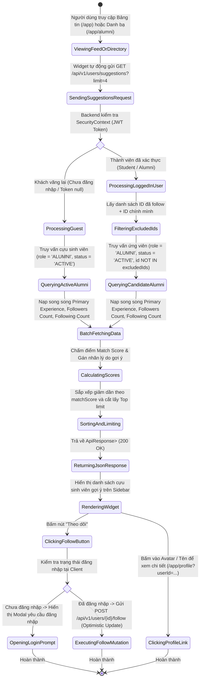
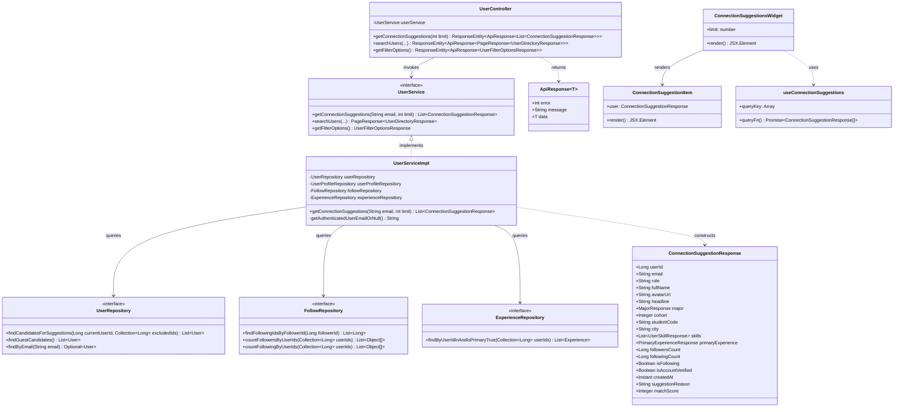
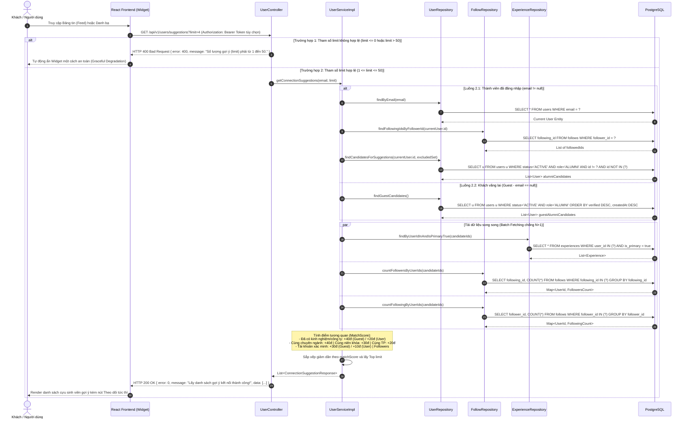

# ĐẶC TẢ YÊU CẦU & THIẾT KẾ CHI TIẾT: UC10 - GỢI Ý KẾT NỐI THÀNH VIÊN (VIEW CONNECTION SUGGESTIONS)

## PHẦN 1: ĐẶC TẢ NGHIỆP VỤ (REPORT 3)

### 2.2.3 Business Workflow (Luồng nghiệp vụ)



#### Mô tả chi tiết luồng xử lý bằng chữ (Business Step Description):
* **Bước 1 - Khởi đầu**: Người dùng (khách vãng lai, sinh viên hoặc cựu sinh viên) truy cập vào màn hình Bảng tin cộng đồng (`/app`) hoặc màn hình Danh bạ cựu sinh viên (`/app/alumni`).
* **Bước 2 - Các bước chuyển tiếp**:
  * Component `ConnectionSuggestionsWidget` trên Sidebar bên phải tự động kích hoạt API `GET /api/v1/users/suggestions?limit=4`.
  * **Backend tiếp nhận yêu cầu & phân nhánh**:
    * *Trường hợp 1 (Thành viên đã đăng nhập)*: Trích xuất thông tin người dùng hiện tại (chuyên ngành `majorId`, niên khóa `cohort`, thành phố `city`). Đồng thời, truy vấn danh sách `followingIds` mà người này đã theo dõi để tạo tập loại trừ `excludedIds` (ID chính mình + danh sách đã follow). Chỉ lấy ứng viên là Cựu sinh viên (`role = 'ALUMNI'`) có trạng thái `ACTIVE`.
    * *Trường hợp 2 (Khách vãng lai)*: Hệ thống chỉ truy vấn các cựu sinh viên (`role = 'ALUMNI'`) có trạng thái `ACTIVE`.
  * **Tải hàng loạt (Batch Fetching) chống N+1 Query**: Thực hiện 3 câu truy vấn SQL gom nhóm song song để nạp kinh nghiệm làm việc chính (`isPrimary = true`), số lượng follower và số lượng following cho toàn bộ ứng viên.
  * **Thuật toán tính điểm tương quan (`matchScore`)**:
    * *Thành viên đã đăng nhập*: Cùng ngành (+40đ), Cùng khóa (+30đ / lệch 1 khóa +15đ), Cùng thành phố (+20đ), Đã có kinh nghiệm làm việc / chức danh công ty (+20đ), Tài khoản đã xác minh (+10đ), Điểm uy tín theo số follower (`+1..10đ` = `min(followers, 10)`).
    * *Khách vãng lai (Guest)*: Đã có kinh nghiệm làm việc / chức danh công ty (+40đ), Tài khoản đã xác minh (+30đ), Điểm uy tín theo số follower (`+1..20đ` = `min(followers, 20)`).
  * Sắp xếp danh sách ứng viên theo `matchScore` giảm dần và lấy Top `limit` bản ghi.
* **Bước 3 - Kết thúc**: Frontend render danh sách các anh/chị cựu sinh viên tiêu biểu với avatar sạch sẽ, họ tên, khóa học & ngành học (ví dụ: *"Khóa K13 • BE"*), kèm nút tương tác nhanh "Theo dõi" / "Đang theo dõi" và link "Xem tất cả" điều hướng sang Danh bạ cựu sinh viên.

---

### 3.2 Module Quản Lý Tài Khoản & Mạng Lưới Thành Viên

#### 3.2.1 Gợi ý kết nối thành viên (UC10)

* **Function trigger**:
  * **Navigation path**: Sidebar bên phải của Bảng tin (`/app`), Trang Danh bạ cựu sinh viên (`/app/alumni`).
  * **Timing Frequency**: Tự động gọi khi mount trang (On screen mount) và khi người dùng thực hiện đăng nhập / đăng xuất hoặc thay đổi mối quan hệ theo dõi.

* **Function description**:
  * **Actors/Roles**: Khách vãng lai (Guest), Sinh viên (Student), Cựu sinh viên (Alumni).
  * **Target Audience**: Chỉ gợi ý các Cựu sinh viên (`role = 'ALUMNI'`) uy tín và tiêu biểu.
  * **Purpose**: Tự động gợi ý các anh/chị cựu sinh viên phù hợp nhất dựa trên kinh nghiệm làm việc thực tế, sự tương quan chuyên ngành và niên khóa, thúc đẩy tinh thần kết nối tiền bối - hậu bối trong cộng đồng FPT University.
  * **Interface**:
    * Tiêu đề widget: *"Gợi ý kết nối"* cùng nút bấm chuyển hướng *"Xem tất cả"* sang trang Danh bạ cựu sinh viên.
    * Danh sách thẻ thành viên tinh gọn:
      * Ảnh đại diện (Avatar tròn sạch sẽ, bo góc mềm).
      * Họ và tên cựu sinh viên (in đậm màu mực mận `text-plum-900`, gạch chân khi hover, bấm vào để mở trang cá nhân).
      * Dòng phụ thông tin học vấn: Khóa học & chuyên ngành (ví dụ: *"Khóa K13 • BE"* hoặc *"Khóa K14 • SE"*).
      * Nút hành động nhanh: Nút "Theo dõi" / "Đang theo dõi" kiểu Secondary viền mỏng (`border border-plum-900/10 text-plum-700 hover:bg-plum-900/[0.05]`).
    * Trạng thái tải dữ liệu (`Skeleton Loading`), trạng thái không có kết quả (tự động ẩn widget mà không làm vỡ layout).

* **Data processing**:
  1. Frontend gọi `GET /api/v1/users/suggestions?limit={n}` (mặc định `limit = 4`).
  2. Backend kiểm tra tham số `limit` ($1 \le \text{limit} \le 50$). Nếu sai, ném `BadRequestException("Số lượng gợi ý (limit) phải từ 1 đến 50.")`.
  3. Trích xuất email từ JWT trong `SecurityContextHolder` (nếu có).
  4. Thực hiện lọc ứng viên `ALUMNI` có `account_status = 'ACTIVE'`, loại trừ ID chính mình và danh sách đã theo dõi.
  5. Nạp song song thông tin kinh nghiệm chính và số lượng follower/following theo lô (Batch Fetching).
  6. Chấm điểm `matchScore` theo thuật toán nghiệp vụ và sắp xếp giảm dần.
  7. Trả về `ApiResponse<List<ConnectionSuggestionResponse>>` với mã HTTP `200 OK`.

* **Screen layout**:
  * Figure 10.1: Connection Suggestions Widget on the right sidebar of Community Feed (`/app`).

* **Function details**:
  * **Data**: `userId`, `email`, `role`, `fullName`, `avatarUrl`, `headline`, `major`, `cohort`, `studentCode`, `city`, `skills`, `primaryExperience`, `followersCount`, `followingCount`, `isFollowing`, `isAccountVerified`, `createdAt`, `suggestionReason`, `matchScore`.
  * **Validation**:
    * Tham số `limit` bắt buộc phải là số nguyên từ 1 đến 50.
  * **Business rules**:
    * **BR-SUGG-01**: Không gợi ý chính người dùng đang đăng nhập (`u.id != currentUserId`).
    * **BR-SUGG-02**: Không gợi ý những người mà người dùng đã bấm "Theo dõi" trước đó (`u.id NOT IN (followedIds)`).
    * **BR-SUGG-03**: Chỉ gợi ý các cựu sinh viên mang vai trò `ALUMNI` có trạng thái tài khoản `ACTIVE` (loại trừ `STUDENT` và `ADMIN`).
    * **BR-SUGG-04**: Ưu tiên cao nhất cho cựu sinh viên đã có kinh nghiệm làm việc / chức danh công ty (`+40đ` cho Guest, `+20đ` cho thành viên đăng nhập), kết hợp cùng ngành học (`+40đ`), cùng niên khóa (`+30đ`), cùng thành phố (`+20đ`), tài khoản đã xác minh và số lượng người theo dõi.
    * **BR-SUGG-05**: Khi khách chưa đăng nhập bấm "Theo dõi", hệ thống hiển thị thông báo yêu cầu đăng nhập thân thiện (`LoginPromptModal`) và điều hướng tới trang xác thực.
  * **Error Handling**:
    * Trả về HTTP 400 Bad Request kèm thông điệp tiếng Việt nếu `limit <= 0` hoặc `limit > 50`.
    * Trả về HTTP 500 Internal Server Error nếu xảy ra lỗi truy vấn cơ sở dữ liệu.
  * **Normal case**: Trả về HTTP 200 OK cùng danh sách mảng JSON các cựu sinh viên phù hợp nhất.
  * **Abnormal case**: Khi có lỗi mạng hoặc API gặp sự cố, widget tự động ẩn một cách êm dịu (Graceful Degradation) mà không làm gián đoạn trải nghiệm đọc bảng tin.

---

### 5. Requirement Appendix (Phụ lục Yêu cầu)

#### 5.1 Business Rules (Quy tắc Nghiệp vụ)

| ID | Định nghĩa Quy tắc (Rule Definition) |
| :--- | :--- |
| **BR-SUGG-01** | Tuyệt đối không bao giờ gợi ý tài khoản của chính người dùng đang đăng nhập trong danh sách kết nối. |
| **BR-SUGG-02** | Các tài khoản đã được người xem bấm "Theo dõi" trước đó sẽ tự động bị loại khỏi danh sách gợi ý. |
| **BR-SUGG-03** | Đối tượng gợi ý bắt buộc phải là Cựu sinh viên (`role = 'ALUMNI'`) và có trạng thái hoạt động (`account_status = 'ACTIVE'`). |
| **BR-SUGG-04** | Trọng số tính điểm gợi ý: Kinh nghiệm công ty (`+40đ` Guest / `+20đ` User), Cùng ngành (`+40đ`), Cùng khóa (`+30đ`), Cùng thành phố (`+20đ`), Đã xác minh (`+30đ` Guest / `+10đ` User), Điểm uy tín theo số followers (`+1..20đ` Guest / `+1..10đ` User). |
| **BR-SUGG-05** | API `/api/v1/users/suggestions` là Public GET; tự động nhận diện JWT Token nếu có để cá nhân hóa kết quả. |
| **BR-SUGG-06** | Giới hạn số lượng gợi ý (`limit`) mặc định là 5, giá trị hợp lệ từ 1 đến 50 bản ghi. |

#### 5.2 Common Requirements (Yêu cầu Chung)
* Giao diện tuân thủ tiêu chuẩn Pastel Premium: Nền Card trắng `#ffffff`, viền nhẹ `border-plum-900/10`, hiệu ứng hover nhẹ nhàng, typography Inter/Outfit chuẩn chỉ, tuyệt đối không có hiệu ứng đổi màu cam chói mắt khi di chuột.
* Ảnh đại diện Avatar hiển thị tròn trịa sạch sẽ, không hiển thị icon tích cam đè lên ảnh.
* Nạp dữ liệu tối ưu qua Batch Fetching chống 100% lỗi N+1 Query.
* Tích hợp cơ chế Optimistic Update khi bấm nút Theo dõi để phản hồi tức thì cho người dùng.

#### 5.3 Application Messages List (Danh sách Thông điệp Ứng dụng)

| # | Mã thông điệp | Loại | Ngữ cảnh | Nội dung hiển thị |
|---|---|---|---|---|
| 1 | `MSG_SUGG_SUCCESS` | In line / JSON | Lấy danh sách gợi ý thành công | `Lấy danh sách gợi ý kết nối thành công!` |
| 2 | `MSG_SUGG_LIMIT_INVALID` | In red / Alert | Tham số `limit <= 0` hoặc `limit > 50` | `Số lượng gợi ý (limit) phải từ 1 đến 50.` |
| 3 | `MSG_SUGG_LOGIN_PROMPT` | Modal | Khách chưa đăng nhập bấm nút Theo dõi | `Vui lòng đăng nhập để theo dõi và kết nối với thành viên này.` |
| 4 | `MSG_FOLLOW_SUCCESS` | Toast | Bấm theo dõi thành công | `Đã theo dõi người dùng thành công!` |
| 5 | `MSG_UNFOLLOW_SUCCESS` | Toast | Bấm hủy theo dõi thành công | `Đã hủy theo dõi người dùng thành công!` |

#### 5.4 Other Requirements (Yêu cầu Khác)
* Tốc độ phản hồi API trung bình dưới 200ms nhờ cơ chế Indexing trên các cột `(major_id, cohort)`, `follower_id`, `following_id`.

---

## PHẦN 2: THIẾT KẾ CHI TIẾT (REPORT 4)

### 3.1 Gợi ý kết nối thành viên (UC10)

##### 3.1.1 Class Diagram (Sơ đồ Lớp)



###### Mô tả chi tiết cấu trúc các lớp (Class Design Description):
* **Lớp Controller (`UserController.java`)**: Tiếp nhận yêu cầu HTTP `GET /api/v1/users/suggestions`, kiểm tra tham số `limit`, trích xuất email người dùng từ SecurityContext và chuyển giao xử lý cho `UserService`.
* **Lớp Service (`UserService.java` & `UserServiceImpl.java`)**: Định nghĩa và triển khai logic nghiệp vụ: trích xuất profile cá nhân, loại trừ ID đã theo dõi, thực hiện Batch Fetching kinh nghiệm/follower và áp dụng thuật toán tính điểm `matchScore`.
* **Lớp Repository (`UserRepository.java`, `FollowRepository.java`, `ExperienceRepository.java`)**: Cung cấp các câu truy vấn tối ưu, gom nhóm SQL để nạp thông tin hàng loạt chống lỗi N+1 Query.
* **Lớp DTO (`ConnectionSuggestionResponse.java`)**: Đối tượng truyền dữ liệu chứa toàn bộ thông tin cựu sinh viên, điểm tương quan và lý do trực quan trả về cho Client.
* **Lớp Frontend (`ConnectionSuggestionsWidget.tsx`)**: Component giao diện Sidebar tích hợp hook React Query `useConnectionSuggestions`, xử lý các trạng thái Skeleton, Render danh sách và xử lý nút Theo dõi tức thì.

---

##### 3.1.2 Sequence Diagram (Sơ đồ Tuần tự)



###### Mô tả chi tiết luồng xử lý bằng chữ (Sequence Flow Description):
1. **Luồng 1 - Lỗi tham số đầu vào (`limit <= 0` hoặc `limit > 50`)**:
   - Controller kiểm tra tham số `limit`, ném ngoại lệ `BadRequestException`. `GlobalExceptionHandler` bắt và trả về HTTP `400 Bad Request` cùng thông điệp lỗi tiếng Việt. Frontend xử lý bắt lỗi và ẩn widget an toàn.
2. **Luồng 2 - Thành công (Cá nhân hóa theo người dùng đăng nhập)**:
   - Controller trích xuất email người dùng, gọi Service lấy danh sách các cựu sinh viên `ALUMNI` (loại trừ ID chính mình và những người đã theo dõi).
   - Nạp song song dữ liệu kinh nghiệm chính và số followers/following qua 3 câu truy vấn SQL gom nhóm.
   - Chấm điểm tương quan theo ngành học, niên khóa, tỉnh thành, kinh nghiệm công ty, trạng thái xác thực và số follower.
   - Sắp xếp giảm dần theo điểm số, cắt lấy Top `limit` bản ghi và trả về HTTP `200 OK` cho Client render widget.
3. **Luồng 3 - Thành công (Khách vãng lai - Guest)**:
   - Không có thông tin email, Service truy vấn danh sách các cựu sinh viên `ALUMNI` đang hoạt động trong hệ thống.
   - Ưu tiên cựu sinh viên đã có kinh nghiệm làm việc / công ty (+40đ), có tích xanh xác thực (+30đ) và nhiều người theo dõi nhất (+1..20đ).
   - Đóng gói danh sách cựu sinh viên tiêu biểu trả về cho Client. Khi khách bấm nút "Theo dõi", giao diện hiển thị popup thông báo đăng nhập.

---

##### 3.1.3 API Specification (Đặc tả Chi tiết API)

* **Method**: `GET`
* **URL**: `/api/v1/users/suggestions`
* **Access Control**: Public GET (Tự động nhận diện Bearer Token nếu có).
* **Query Parameters**:
  * `limit` (integer, optional, default: 5): Số lượng người dùng cần gợi ý (hợp lệ từ 1 đến 50).

###### Cấu trúc phản hồi thành công (`HTTP 200 OK`):
```json
{
  "error": 0,
  "message": "Lấy danh sách gợi ý kết nối thành công!",
  "data": [
    {
      "userId": 2,
      "email": "minhvbde180352@fpt.edu.vn",
      "role": "ALUMNI",
      "fullName": "Nguyen Thanh An",
      "avatarUrl": "https://pub-77de501eb1a440df9c8ca37a5886ddf8.r2.dev/avatars/an.png",
      "headline": "Senior Software Engineer @ Axon Active Vietnam",
      "major": {
        "id": 12,
        "code": "BE",
        "name": "Tiếng Anh thương mại"
      },
      "cohort": 13,
      "studentCode": "HE123455",
      "city": "Đà Nẵng",
      "skills": [
        { "id": 3, "skillName": "React", "sortOrder": 0 },
        { "id": 4, "skillName": "Spring Boot", "sortOrder": 0 }
      ],
      "primaryExperience": {
        "id": 12,
        "title": "Senior Software Engineer",
        "company": "Axon Active Vietnam",
        "location": "Đà Nẵng, Việt Nam"
      },
      "followersCount": 3,
      "followingCount": 1,
      "isFollowing": false,
      "isAccountVerified": true,
      "createdAt": "2026-08-22T05:02:35.962Z",
      "suggestionReason": "Cựu sinh viên tiêu biểu đã xác minh",
      "matchScore": 73
    }
  ]
}
```

###### Cấu trúc phản hồi lỗi khi limit không hợp lệ (`HTTP 400 Bad Request`):
```json
{
  "error": 400,
  "message": "Số lượng gợi ý (limit) phải từ 1 đến 50.",
  "data": null
}
```
