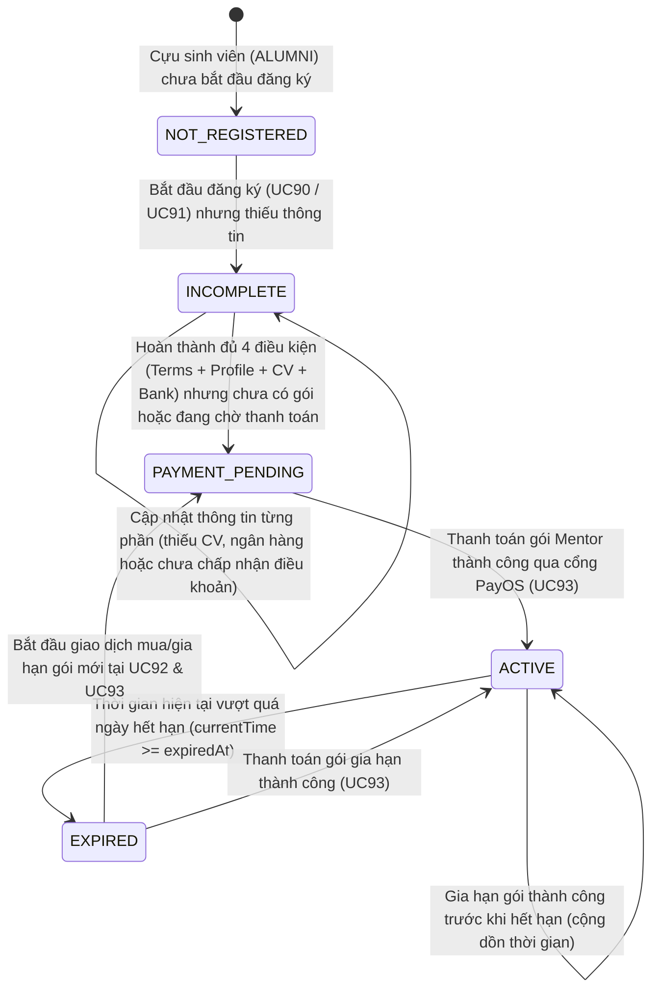
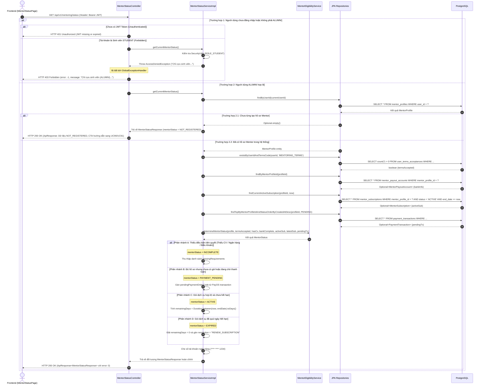

# ĐẶC TẢ YÊU CẦU & THIẾT KẾ CHI TIẾT: UC94 - XEM TRẠNG THÁI MENTOR & SUBSCRIPTION

---

## PHẦN 1: ĐẶC TẢ NGHIỆP VỤ (REPORT 3)

### 2.2.3 Business Workflow (Luồng nghiệp vụ)

Chức năng **UC94 — Xem trạng thái Mentor & Subscription** là chức năng truy vấn trạng thái trung tâm của module Mentorship. Trạng thái hoạt động của Mentor được hệ thống tính toán tự động dựa trên **Quy tắc hệ thống (System Rule)**, hoàn toàn độc lập và **không thông qua quy trình phê duyệt thủ công của Admin (No Admin Approval/Rejection)**.

#### Mô tả chi tiết luồng xử lý bằng chữ (Business Step Description):
* **Bước 1 - Khởi đầu (Trigger)**: Người dùng cựu sinh viên (ALUMNI) truy cập vào trang Trạng thái Mentor (`/app/mentoring/status`) thông qua menu điều hướng hoặc nút "Xem trạng thái Mentor" tại trang chủ Cố vấn.
* **Bước 2 - Xác thực & Phân quyền**: Hệ thống kiểm tra JWT Bearer token và vai trò người dùng trong Spring Security. Nếu chưa đăng nhập, trả về HTTP 401 Unauthorized. Nếu người dùng là Sinh viên (STUDENT), hệ thống từ chối với HTTP 403 Forbidden ("Chỉ cựu sinh viên (ALUMNI) mới có quyền truy cập trạng thái Mentor và gói dịch vụ.").
* **Bước 3 - Kiểm tra Hồ sơ Mentor & Điều kiện tiên quyết**:
  - Hệ thống truy vấn `mentor_profiles` theo `userId`.
  - Nếu chưa có hồ sơ: Trả về trạng thái `NOT_REGISTERED` cùng hướng dẫn chuyển sang UC90/UC91.
  - Nếu đã có hồ sơ: Hệ thống kiểm tra 4 điều kiện nghiệp vụ cốt lõi:
    1. Đã chấp nhận phiên bản Điều khoản Mentoring mới nhất (`termsAccepted`).
    2. Đã điền đủ thông tin hồ sơ chuyên môn bắt buộc: Lĩnh vực hỗ trợ, Bio giới thiệu, Số năm kinh nghiệm (`profileComplete`).
    3. Đã tải lên tệp CV năng lực hợp lệ (`hasCv` & `cvFileKey` tồn tại).
    4. Đã khai báo tài khoản ngân hàng nhận chi trả payout (`bankInformationComplete`).
* **Bước 4 - Kiểm tra Gói dịch vụ & Giao dịch thanh toán**:
  - Hệ thống truy vấn gói subscription trong `mentor_subscriptions` có trạng thái `ACTIVE` và `end_date >= CURRENT_TIMESTAMP`.
  - Nếu tìm thấy gói subscription đang hiệu lực: Lấy thông tin gói, `startDate`, `endDate`, tính số ngày còn lại (`remainingDays`).
  - Nếu không có subscription hiệu lực: Kiểm tra các giao dịch thanh toán trong bảng `payment_transactions` liên quan đến `MENTOR_SUBSCRIPTION`. Nếu có giao dịch đang ở trạng thái `PENDING`, xác định `subscriptionStatus = PAYMENT_PENDING` và lấy mã đơn `pendingPaymentOrderCode`.
  - Nếu subscription trước đây đã hết hạn (`end_date < CURRENT_TIMESTAMP`): Xác định `subscriptionStatus = EXPIRED`.
* **Bước 5 - Tính toán Trạng thái Mentor tổng hợp (Mentor Status Calculation)**:
  - Nếu thiếu bất kỳ điều kiện nào trong 4 điều kiện tiên quyết: `mentorStatus = INCOMPLETE`.
  - Nếu đủ 4 điều kiện tiên quyết nhưng subscription đang chờ thanh toán hoặc chưa có gói: `mentorStatus = PAYMENT_PENDING`.
  - Nếu đủ 4 điều kiện tiên quyết VÀ subscription hợp lệ (`ACTIVE`, chưa hết hạn): `mentorStatus = ACTIVE`.
  - Nếu đã từng có subscription nhưng hiện tại đã hết hạn: `mentorStatus = EXPIRED`.
* **Bước 6 - Phản hồi & Kết xuất giao diện (Response & UI Rendering)**:
  - Backend trả về DTO `MentorStatusResponse` (che số tài khoản ngân hàng dạng `**** **** 1234` để bảo mật PII).
  - Frontend render Dashboard với:
    - **Hero Card**: Tên, avatar, chức vụ và Badge trạng thái nổi bật (Pastel Premium).
    - **Checklist Card**: Trạng thái 4 điều kiện cùng nút CTA điều hướng trực tiếp đến bước cần bổ sung.
    - **Subscription Summary Card**: Chi tiết gói, ngày bắt đầu, ngày hết hạn, đếm ngược số ngày và thanh tiến độ thời gian.
    - **Primary CTA**: Nút hành động chính tự động thích ứng với trạng thái (Gia hạn gói khi EXPIRED, Thanh toán tiếp khi PAYMENT_PENDING, Hoàn thiện hồ sơ khi INCOMPLETE).

---

### 3.2 Mentorship Module (Cố vấn nghề nghiệp)
Module Mentorship trong hệ sinh thái AlumNect là cầu nối giúp cựu sinh viên (ALUMNI) chia sẻ kinh nghiệm, định hướng nghề nghiệp và hỗ trợ sinh viên thông qua các buổi tư vấn 1-1, đồng thời mang lại cơ chế chi trả (Payout) minh bạch và bền vững cho Mentor.

#### 3.2.1 Xem trạng thái Mentor & Subscription (UC94)

**Function trigger**:
* **Navigation path**:
  - Thanh menu chính / Trang chủ Cố vấn -> Nút "Xem trạng thái Mentor" -> `/app/mentoring/status`
  - Bí danh điều hướng (Route alias): `/app/mentoring/my-status`
* **Timing Frequency**: On demand (người dùng chủ động mở trang) và On screen mount.

**Function description**:
* **Actors/Roles**:
  - **Alumni / Mentor**: Người dùng cựu sinh viên đã đăng ký hoặc đang trong quá trình đăng ký Mentor.
  - **Student**: Bị chặn truy cập (HTTP 403 Forbidden).
* **Purpose**: Cung cấp bức tranh toàn cảnh, minh bạch về tình trạng hồ sơ cố vấn, điều kiện hoạt động và thời hạn gói dịch vụ của chính mình; cung cấp các chỉ dẫn và lối tắt hành động tiếp theo giúp Mentor hoàn thiện hồ sơ hoặc gia hạn gói kịp thời.
* **Interface**:
  - **Header / Breadcrumb**: Tiêu đề trang "Trạng thái Mentor & Subscription" với nút icon trợ giúp (PageHeader).
  - **MentorStatusHero**: Ảnh đại diện, họ tên, email, công ty hiện tại, huy hiệu trạng thái (`ACTIVE`, `PAYMENT_PENDING`, `EXPIRED`, `INCOMPLETE`).
  - **MentorRequirementChecklist**: Danh sách 4 điều kiện với icon Đạt (Xanh lá) / Chưa đạt (Xám/Đỏ) kèm nút "Cập nhật" chuyển hướng thông minh.
  - **MentorSubscriptionSummaryCard**: Thẻ thông tin gói mua, chu kỳ, giá tiền, ngày kích hoạt, ngày hết hạn, đếm ngược số ngày còn lại và thanh tiến độ.
  - **States**:
    - *Loading State*: Skeleton component mô phỏng khung xương giao diện đa tầng.
    - *Error State*: Alert thông báo lỗi chi tiết lấy từ `error.message` của Backend.
    - *Empty State*: Giao diện thông báo chưa đăng ký kèm nút CTA "Đăng ký trở thành Mentor ngay".

**Data processing**:
1. Xác định `userId` của người dùng hiện tại thông qua `SecurityUtils.getCurrentUserId()`.
2. Kiểm tra quyền hạn: nếu người dùng có vai trò `ROLE_STUDENT` và không có quyền `ROLE_ALUMNI`, ném ngoại lệ `AccessDeniedException`.
3. Gọi `MentorProfileRepository.findByUserId(userId)` lấy thông tin hồ sơ.
4. Gọi `UserTermsAcceptanceRepository.existsByUserIdAndTermsCode(userId, 'MENTORING_TERMS')` kiểm tra điều khoản.
5. Gọi `MentorPayoutAccountRepository.findByMentorProfileId(mentorProfileId)` kiểm tra tài khoản nhận thanh toán.
6. Gọi `MentorSubscriptionRepository.findCurrentActiveSubscription(mentorProfileId, now)` và `paymentTransactionRepository` để xác định trạng thái gói dịch vụ.
7. Gọi `MentorEligibilityService.determineMentorStatus(...)` để tính toán trạng thái Mentor chuẩn xác.
8. Che số tài khoản ngân hàng (chỉ để lại 4 chữ số cuối) trước khi trả về DTO.

**Screen layout**:
* Màn hình Web Responsive: Bố cục lưới 2 cột trên Desktop (lg) gồm Cột chính (Hero + Checklist + Chính sách bảo vệ) và Cột phụ (Thẻ Subscription + Hướng dẫn nhanh); 1 cột duy nhất trên Mobile.

**Function details**:
* **Data**:
  - `mentorStatus`: Trạng thái Mentor tổng hợp (`INCOMPLETE`, `PAYMENT_PENDING`, `ACTIVE`, `EXPIRED`, `NOT_REGISTERED`).
  - `profileComplete`: Đã điền đủ thông tin hồ sơ chưa (`boolean`).
  - `hasCv`: Đã tải lên CV chưa (`boolean`).
  - `cvOriginalFilename`: Tên tệp CV gốc (nếu có).
  - `bankInformationComplete`: Đã điền đủ thông tin ngân hàng nhận chi trả chưa (`boolean`).
  - `bankName`: Tên ngân hàng (ví dụ: Vietcombank, TPBank).
  - `maskedAccountNumber`: Số tài khoản đã che bảo mật (`**** **** 1234`).
  - `termsAccepted`: Đã chấp nhận điều khoản cố vấn chưa (`boolean`).
  - `hasSubscription`: Đã có gói đăng ký hay chưa (`boolean`).
  - `subscriptionStatus`: Trạng thái gói (`ACTIVE`, `PAYMENT_PENDING`, `EXPIRED`, `NONE`).
  - `packageName`: Tên gói dịch vụ (ví dụ: Gói Mentor Chuyên Nghiệp 3 Tháng).
  - `packageCode`: Mã gói (ví dụ: `MENTOR_3M`).
  - `priceAtPurchase`: Giá tại thời điểm thanh toán (VND).
  - `durationMonths`: Thời lượng gói (tháng).
  - `startDate`: Ngày bắt đầu hiệu lực (ISO-8601).
  - `endDate`: Ngày hết hạn (ISO-8601).
  - `remainingDays`: Số ngày hiệu lực còn lại.
  - `pendingPaymentOrderCode`: Mã đơn thanh toán PayOS đang chờ (nếu có).
  - `missingRequirements`: Mảng các chuỗi mô tả điều kiện còn thiếu cần bổ sung.
* **Validation**:
  - Xác thực người dùng phải hợp lệ (JWT không hết hạn, người dùng đang ở trạng thái hoạt động).
  - Chỉ người dùng có vai trò `ALUMNI` mới được truy cập dữ liệu của chính mình.
* **Business rules**:
  - Áp dụng các quy tắc BR-MTR-01 đến BR-MTR-15 (xem mục 5.1).
* **Error Handling**:
  - Người dùng chưa đăng nhập: HTTP 401 Unauthorized.
  - Người dùng là Sinh viên: HTTP 403 Forbidden (`MSG-MTR-02`).
  - Lỗi máy chủ CSDL: HTTP 500 Internal Server Error (`MSG-MTR-03`).
* **Normal case**: Người dùng nhận HTTP 200 OK kèm payload `ApiResponse<MentorStatusResponse>` với `error: 0`, giao diện hiển thị trạng thái và dữ liệu đầy đủ.
* **Abnormal case**: Tài khoản sinh viên cố tình truy cập qua đường link trực tiếp nhận thông báo lỗi từ chối quyền truy cập rõ ràng.

---

### 5. Requirement Appendix (Phụ lục Yêu cầu)

#### 5.1 Business Rules (Quy tắc Nghiệp vụ)

| ID | Định nghĩa Quy tắc (Rule Definition) |
| :--- | :--- |
| **BR-MTR-01** | **Chỉ Alumni mới được trở thành Mentor**: Mentor không phải là một base role mới trong bảng `roles`, mà là năng lực mở rộng gắn liền với tài khoản `ALUMNI`. Sinh viên (`STUDENT`) không được phép truy cập UC94 hoặc đăng ký làm Mentor. |
| **BR-MTR-02** | **Không có Admin phê duyệt Mentor**: Trạng thái Mentor được suy luận tự động bởi hệ thống (`MentorEligibilityService`) dựa trên các dữ liệu thực tế, tuyệt đối không tạo quy trình chờ duyệt hay nút bấm Approve/Reject của Admin cho việc đăng ký Mentor. |
| **BR-MTR-03** | **Không có Admin phê duyệt CV**: Tệp CV do Alumni tải lên là tài liệu năng lực phục vụ hồ sơ công khai và kiểm tra sự hiện diện, không có trạng thái `CV_APPROVED` hay `CV_REJECTED`. |
| **BR-MTR-04** | **Điều kiện để đạt trạng thái ACTIVE**: Mentor chỉ đạt trạng thái `ACTIVE` khi đồng thời thỏa mãn tất cả 5 điều kiện: (1) Hồ sơ chuyên môn bắt buộc đã hoàn tất; (2) Tệp CV năng lực đã được tải lên; (3) Thông tin ngân hàng nhận payout đã đầy đủ; (4) Điều khoản Mentoring hiện hành đã được chấp nhận; (5) Gói Mentor Subscription đang hợp lệ và chưa hết hạn (`currentTime < expiredAt`). |
| **BR-MTR-05** | **Trạng thái INCOMPLETE**: Nếu thiếu bất kỳ điều kiện nào trong 4 điều kiện tiên quyết (Điều khoản, Hồ sơ, CV, Tài khoản ngân hàng), hệ thống bắt buộc gán trạng thái `INCOMPLETE` và liệt kê rõ ràng các phần còn thiếu trong `missingRequirements`. |
| **BR-MTR-06** | **Trạng thái PAYMENT_PENDING**: Nếu hồ sơ đã thỏa mãn đủ 4 điều kiện tiên quyết nhưng chưa có gói đăng ký đang hoạt động và đang có giao dịch thanh toán ở trạng thái `PENDING`, trạng thái là `PAYMENT_PENDING`. Mentor chưa được kích hoạt cho đến khi UC93 xác nhận thanh toán thành công. |
| **BR-MTR-07** | **Trạng thái EXPIRED**: Khi gói dịch vụ hết hạn (`currentTime >= expiredAt`), trạng thái Mentor chuyển thành `EXPIRED`. Mentor bị tạm ngừng hiển thị nhận yêu cầu tư vấn mới từ sinh viên nhưng vẫn bảo lưu toàn bộ dữ liệu lịch sử. |
| **BR-MTR-08** | **Không tự tạo giao dịch tài chính**: Chức năng UC94 là chức năng đọc/truy vấn thuần túy (Read-only query), tuyệt đối không tự động tạo đơn thanh toán hay tự kích hoạt/gia hạn subscription khi người dùng chỉ xem trạng thái. |
| **BR-MTR-09** | **Bảo vệ dữ liệu tài chính (Masked PII)**: Không trả về số tài khoản ngân hàng đầy đủ trong API response; bắt buộc che giấu thông tin chỉ để lại 4 chữ số cuối (dạng `**** **** 1234`). |
| **BR-MTR-10** | **Đồng bộ thời hạn chính thức**: Dữ liệu ngày hết hạn `expiredAt` phải lấy từ nguồn gốc duy nhất do UC93 đã tính toán và lưu trong bảng `mentor_subscriptions`, không tự tính toán lại bằng công thức khác trên Frontend làm sai lệch thời gian thực. |
| **BR-MTR-11** | **Xử lý gia hạn cộng dồn thời gian**: Nếu Mentor đã có gói còn hạn và gia hạn thêm gói mới ở UC93, `expiredAt` được cộng dồn thời gian. UC94 hiển thị đúng mốc `expiredAt` cuối cùng này. |
| **BR-MTR-12** | **Tự động làm mới dữ liệu sau thanh toán (Cache Invalidation)**: Sau khi hoàn tất thanh toán ở UC93 hoặc cập nhật hồ sơ ở UC91, React Query cache của UC94 (`['mentorship', 'status']`) bắt buộc phải được kích hoạt làm mới tự động. |
| **BR-MTR-13** | **Truy cập riêng tư chính chủ**: Mỗi người dùng chỉ được xem trạng thái Mentor và thông tin tài khoản ngân hàng của chính bản thân mình; không cho phép truyền `userId` tùy ý trong request param. |
| **BR-MTR-14** | **Không làm mất lịch sử Mentor**: Khi gói hết hạn hoặc hồ sơ bị tạm ngừng, hồ sơ Mentor và lịch sử gói không bị xóa khỏi cơ sở dữ liệu. |
| **BR-MTR-15** | **Thời gian thực thi chuẩn hóa múi giờ**: Toàn bộ mốc thời gian `startDate`, `endDate`, `currentTime` được xử lý và so sánh theo chuẩn `Instant` (UTC) ở Backend và hiển thị theo múi giờ `Asia/Ho_Chi_Minh` (GMT+7) trên giao diện người dùng. |

#### 5.2 Common Requirements (Yêu cầu Chung)
* **Bảo mật kênh truyền**: Mọi yêu cầu HTTP giữa Frontend và Backend phải thông qua giao thức HTTPS có mã hóa TLS.
* **Xác thực JWT**: Yêu cầu Header `Authorization: Bearer <jwtToken>` cho toàn bộ các endpoint bảo vệ.
* **Khả năng đáp ứng thời gian thực**: Thời gian phản hồi của API truy vấn trạng thái phải dưới 300ms trong điều kiện vận hành thông thường.
* **Thiết kế giao diện chuẩn mực**: Giao diện tuân thủ bảng màu Pastel Premium, tương thích với cả chế độ sáng (Light) và tối (Dark).

#### 5.3 Application Messages List (Danh sách Thông điệp Ứng dụng)

| # | Mã thông điệp (Message code) | Loại thông điệp | Ngữ cảnh | Nội dung hiển thị (Content) |
| :--- | :--- | :--- | :--- | :--- |
| 1 | `MSG-MTR-01` | In-line / Screen | Lấy trạng thái Mentor thành công (HTTP 200) | Lấy thông tin trạng thái Mentor và subscription thành công |
| 2 | `MSG-MTR-02` | Toast / Banner | Sinh viên truy cập vào API trạng thái Mentor (HTTP 403) | Chỉ cựu sinh viên (ALUMNI) mới có quyền truy cập trạng thái Mentor và gói dịch vụ. |
| 3 | `MSG-MTR-03` | In-line Alert | Lỗi hệ thống Backend không mong muốn (HTTP 500) | Có lỗi xảy ra trong quá trình kiểm tra trạng thái Mentor. Vui lòng thử lại sau. |
| 4 | `MSG-MTR-04` | Badge / Text | Trạng thái Mentor đang hoạt động đầy đủ | Đang hoạt động (ACTIVE) |
| 5 | `MSG-MTR-05` | Badge / Text | Trạng thái hồ sơ chưa hoàn tất | Chưa hoàn tất (INCOMPLETE) |
| 6 | `MSG-MTR-06` | Badge / Text | Trạng thái đang chờ xác nhận thanh toán gói | Chờ thanh toán (PAYMENT_PENDING) |
| 7 | `MSG-MTR-07` | Badge / Text | Trạng thái gói dịch vụ đã hết hạn | Đã hết hạn (EXPIRED) |
| 8 | `MSG-MTR-08` | Empty State | Cựu sinh viên chưa bắt đầu đăng ký Mentor | Bạn chưa đăng ký làm Mentor trên AlumNect |

#### 5.4 Other Requirements (Yêu cầu Khác)
* **Không làm gián đoạn CSDL**: Không tạo thêm bảng hay thêm migration không cần thiết vì dữ liệu của UC94 tận dụng hoàn toàn cấu trúc hiện hữu của UC90, UC91, UC92 và UC93.

---

## PHẦN 2: THIẾT KẾ CHI TIẾT (REPORT 4)

### 3. Detail Design (Thiết kế chi tiết)

#### 3.1 Xem trạng thái Mentor & Subscription (UC94)

##### 3.1.1 Class Diagram (Sơ đồ Lớp)

```mermaid
classDiagram
    %% Lớp Controller tiếp nhận Request từ Client
    class MentorStatusController {
        -MentorStatusService mentorStatusService
        +getMentorStatus() ResponseEntity~ApiResponse~MentorStatusResponse~~
        +getMyStatusAlias() ResponseEntity~ApiResponse~MentorStatusResponse~~
    }

    %% Lớp Service Interface & Implementation
    class MentorStatusService {
        <<interface>>
        +getCurrentMentorStatus() MentorStatusResponse
    }

    class MentorStatusServiceImpl {
        -MentorProfileRepository mentorProfileRepository
        -MentorSubscriptionRepository mentorSubscriptionRepository
        -MentorPayoutAccountRepository mentorPayoutAccountRepository
        -UserTermsAcceptanceRepository termsAcceptanceRepository
        -PaymentTransactionRepository paymentTransactionRepository
        -MentorEligibilityService mentorEligibilityService
        -SecurityUtils securityUtils
        +getCurrentMentorStatus() MentorStatusResponse
        -maskAccountNumber(String accountNumber) String
    }

    class MentorEligibilityService {
        +determineMentorStatus(MentorProfile profile, boolean termsAccepted, boolean hasCv, boolean bankComplete, MentorSubscription activeSub, MentorSubscription latestSub, PaymentTransaction pendingTx) MentorStatus
    }

    %% Các Lớp Enums
    class MentorStatus {
        <<enumeration>>
        NOT_REGISTERED
        INCOMPLETE
        PAYMENT_PENDING
        ACTIVE
        EXPIRED
    }

    class MentorSubscriptionStatus {
        <<enumeration>>
        NONE
        PENDING
        ACTIVE
        EXPIRED
        CANCELLED
    }

    class PaymentTransactionStatus {
        <<enumeration>>
        PENDING
        SUCCESS
        FAILED
        CANCELLED
        EXPIRED
    }

    %% Lớp Response DTO
    class MentorStatusResponse {
        -MentorStatus mentorStatus
        -boolean profileComplete
        -boolean hasCv
        -String cvOriginalFilename
        -boolean bankInformationComplete
        -String bankName
        -String maskedAccountNumber
        -boolean termsAccepted
        -String termsVersion
        -boolean hasSubscription
        -MentorSubscriptionStatus subscriptionStatus
        -String packageName
        -String packageCode
        -BigDecimal priceAtPurchase
        -Integer durationMonths
        -Instant startDate
        -Instant endDate
        -Long remainingDays
        -Long pendingPaymentOrderCode
        -List~String~ missingRequirements
        -String nextAction
    }

    class ApiResponse~T~ {
        -int error
        -String message
        -T data
        +success(T data, String message) ApiResponse~T~
        +error(int error, String message) ApiResponse~T~
    }

    %% Lớp Repository JPA
    class MentorProfileRepository {
        <<interface>>
        +findByUserId(Long userId) Optional~MentorProfile~
    }

    class MentorSubscriptionRepository {
        <<interface>>
        +findCurrentActiveSubscription(Long mentorProfileId, Instant now) Optional~MentorSubscription~
        +findTopByMentorProfileIdOrderByCreatedAtDesc(Long mentorProfileId) Optional~MentorSubscription~
    }

    class MentorPayoutAccountRepository {
        <<interface>>
        +findByMentorProfileId(Long mentorProfileId) Optional~MentorPayoutAccount~
    }

    class UserTermsAcceptanceRepository {
        <<interface>>
        +existsByUserIdAndTermsCode(Long userId, String termsCode) boolean
    }

    class PaymentTransactionRepository {
        <<interface>>
        +findTopByMentorProfileIdAndStatusOrderByCreatedAtDesc(Long mentorProfileId, PaymentTransactionStatus status) Optional~PaymentTransaction~
    }

    %% Các Lớp Entity CSDL
    class MentorProfile {
        -Long id
        -Long userId
        -String bio
        -Integer yearsOfExperience
        -String cvFileKey
        -String cvOriginalFilename
        -MentorStatus mentorStatus
        -Instant createdAt
        -Instant updatedAt
    }

    class MentorSubscription {
        -Long id
        -Long mentorProfileId
        -Long packageId
        -MentorSubscriptionStatus status
        -Instant startDate
        -Instant endDate
        -BigDecimal priceAtPurchase
    }

    class MentorPayoutAccount {
        -Long id
        -Long mentorProfileId
        -String bankCode
        -String bankName
        -String accountNumber
        -String accountHolder
    }

    class UserTermsAcceptance {
        -Long id
        -Long userId
        -String termsCode
        -String termsVersion
        -Instant acceptedAt
    }

    %% Quan hệ giữa các lớp
    MentorStatusController --> MentorStatusService : uses
    MentorStatusServiceImpl ..|> MentorStatusService : implements
    MentorStatusServiceImpl --> MentorEligibilityService : uses
    MentorStatusServiceImpl --> MentorProfileRepository : uses
    MentorStatusServiceImpl --> MentorSubscriptionRepository : uses
    MentorStatusServiceImpl --> MentorPayoutAccountRepository : uses
    MentorStatusServiceImpl --> UserTermsAcceptanceRepository : uses
    MentorStatusServiceImpl --> PaymentTransactionRepository : uses
    MentorStatusServiceImpl ..> MentorStatusResponse : creates
    MentorStatusController ..> ApiResponse : wraps
    MentorStatusResponse --> MentorStatus : contains
    MentorStatusResponse --> MentorSubscriptionStatus : contains
    MentorProfileRepository ..> MentorProfile : manages
    MentorSubscriptionRepository ..> MentorSubscription : manages
    MentorPayoutAccountRepository ..> MentorPayoutAccount : manages
    UserTermsAcceptanceRepository ..> UserTermsAcceptance : manages
```

###### Mô tả chi tiết cấu trúc các lớp (Class Design Description):
* **Lớp Controller (`MentorStatusController.java`)**: Đóng vai trò Endpoint REST API tiếp nhận yêu cầu `GET /api/v1/mentoring/status` (và alias `/my-status`) từ Client, kiểm tra xác thực người dùng thông qua Spring Security Context và gọi phương thức của Service.
* **Lớp Service Interface & Impl (`MentorStatusService.java` & `MentorStatusServiceImpl.java`)**: 
  - Interface khai báo hợp đồng nghiệp vụ `getCurrentMentorStatus()`.
  - Implementation chịu trách nhiệm điều phối truy vấn: kiểm tra quyền ALUMNI, truy xuất `MentorProfile`, kiểm tra sự hiện diện của CV và hồ sơ, kiểm tra điều khoản `MENTORING_TERMS`, truy xuất tài khoản ngân hàng và gói subscription. Sử dụng thuật toán che giấu số tài khoản (`maskAccountNumber`) để bảo vệ dữ liệu nhạy cảm PII.
* **Lớp Service Tính toán Độc lập (`MentorEligibilityService.java`)**: Là Single Source of Truth tập trung toàn bộ luật chuyển đổi trạng thái Mentor (`determineMentorStatus`) dùng chung giữa UC91, UC93 và UC94.
* **Lớp DTO (`MentorStatusResponse.java` & `ApiResponse.java`)**:
  - `MentorStatusResponse`: Chứa thông tin tổng hợp đầy đủ của hồ sơ, checklist điều kiện, thông tin gói và hành động tiếp theo.
  - `ApiResponse<T>`: Cấu trúc phản hồi tiêu chuẩn của dự án (`error: 0` khi thành công, chuỗi thông báo và payload dữ liệu).
* **Các Lớp Repository (`MentorProfileRepository`, `MentorSubscriptionRepository`, v.v.)**: Giao diện Spring Data JPA thực thi các câu truy vấn tối ưu có đánh Index trên các cột `user_id`, `mentor_profile_id`, `status` và `end_date`.
* **Các Lớp Entity (`MentorProfile`, `MentorSubscription`, `MentorPayoutAccount`, `UserTermsAcceptance`)**: Ánh xạ quan hệ thực thể với các bảng trong cơ sở dữ liệu PostgreSQL.

---

##### 3.1.2 Sequence Diagram (Sơ đồ Tuần tự)

###### Mô tả chi tiết luồng xử lý bằng chữ (Sequence Flow Description):
1. **Khởi tạo yêu cầu**: Trình duyệt của người dùng (Client) thực hiện cuộc gọi API `GET /api/v1/mentoring/status` kèm Bearer Token lên `MentorStatusController`.
2. **Kiểm tra quyền hạn & Ngoại lệ**:
   - Nếu Client không gửi Token hoặc Token đã hết hạn, hệ thống trả về HTTP 401 Unauthorized ngay tại tầng Spring Security Filter Chain.
   - Nếu người dùng đăng nhập là Sinh viên (`STUDENT`), Service phát hiện vi phạm phân quyền và ném `AccessDeniedException`. `GlobalExceptionHandler` đón bắt và trả về HTTP 403 Forbidden kèm thông điệp tiếng Việt tường minh.
3. **Truy vấn dữ liệu thực tế tại PostgreSQL**:
   - Service lấy `currentUserId` từ Security Context và truy vấn bảng `mentor_profiles`.
   - Nếu chưa có hồ sơ, Service lập tức đóng gói DTO với trạng thái `NOT_REGISTERED` để Frontend hướng người dùng sang quy trình bắt đầu tại UC90.
   - Nếu đã có hồ sơ, Service lần lượt truy vấn các bảng liên quan: `user_terms_acceptances` (kiểm tra chấp nhận điều khoản), `mentor_payout_accounts` (kiểm tra tài khoản ngân hàng), `mentor_subscriptions` (kiểm tra gói dịch vụ hợp lệ), và `payment_transactions` (kiểm tra đơn thanh toán chờ xử lý).
4. **Quyết định trạng thái nghiệp vụ (State Resolution)**:
   - `MentorEligibilityService` nhận toàn bộ các cờ điều kiện và xác định trạng thái chuẩn:
     - `INCOMPLETE`: Nếu thiếu bất kỳ điều kiện hồ sơ/pháp lý nào.
     - `PAYMENT_PENDING`: Đủ hồ sơ nhưng đang chờ giao dịch thanh toán PayOS hoàn tất.
     - `ACTIVE`: Đủ hồ sơ và gói subscription đang có hiệu lực.
     - `EXPIRED`: Gói subscription đã quá hạn thời gian.
5. **Đóng gói DTO an toàn & Phản hồi**:
   - Service thực hiện mặt nạ che số tài khoản ngân hàng (`**** **** 1234`) nhằm bảo mật thông tin tài chính cá nhân.
   - Đóng gói DTO `MentorStatusResponse` vào `ApiResponse.success(...)` với mã `error = 0` và trả về Client với mã trạng thái HTTP 200 OK. Frontend nhận dữ liệu và kết xuất giao diện trực quan theo phong cách Pastel Premium.
