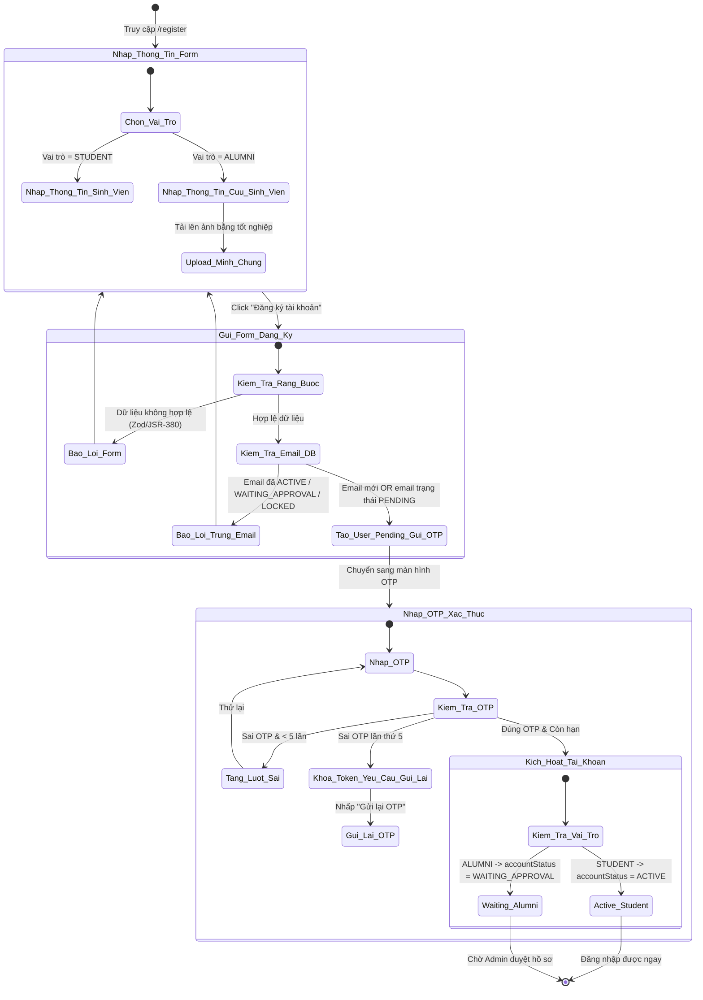

# ĐẶC TẢ YÊU CẦU & THIẾT KẾ CHI TIẾT: UC01 - ĐĂNG KÝ TÀI KHOẢN (REGISTER)

## PHẦN 1: ĐẶC TẢ NGHIỆP VỤ (REPORT 3)

### 2.2.3 Business Workflow (Luồng nghiệp vụ)

#### Mô tả chi tiết luồng xử lý bằng chữ (Business Step Description):
* **Bước 1 - Khởi đầu**: Khách truy cập vào đường dẫn `/register`. Tác nhân chọn vai trò đăng ký (`STUDENT` hoặc `ALUMNI`). Hệ thống hiển thị các trường nhập liệu tương ứng.
* **Bước 2 - Upload tài liệu (Chỉ áp dụng với ALUMNI)**: Người dùng chọn tệp tin ảnh bằng tốt nghiệp/bảng điểm. Hệ thống tự động sinh Presigned URL từ Cloudflare R2, thực hiện upload ảnh trực tiếp lên R2 từ client và ghi nhận đường dẫn URL của ảnh vào biểu mẫu.
* **Bước 3 - Gửi thông tin**: Người dùng bấm nút "Đăng ký tài khoản". Hệ thống kiểm tra ràng buộc định dạng thông tin (Validation). Nếu dữ liệu lỗi, báo lỗi trực tiếp trên giao diện. Nếu dữ liệu hợp lệ, hệ thống thực hiện kiểm tra trạng thái email trong cơ sở dữ liệu:
  * Nếu trùng email có trạng thái `ACTIVE`, `WAITING_APPROVAL`, hoặc `LOCKED` -> Báo lỗi trùng lặp.
  * Nếu là email mới hoặc trùng email trạng thái `PENDING` -> Cho phép ghi đè thông tin đăng ký cũ, tạo mã OTP 6 chữ số (hiệu lực 5 phút), lưu tài khoản tạm thời với trạng thái `PENDING`, gửi email chứa mã OTP và chuyển người dùng sang bước xác thực.
* **Bước 4 - Xác thực OTP**: Người dùng điền mã OTP nhận được từ email.
  * Nếu nhập sai, hệ thống cảnh báo số lần thử còn lại (tối đa 5 lần). Nếu sai quá 5 lần, khóa token hiện tại và yêu cầu người dùng gửi lại mã OTP mới.
  * Nếu nhập đúng OTP còn thời hạn:
    * Đối với `STUDENT`: Tài khoản chuyển sang trạng thái hoạt động `ACTIVE` và được xác minh `emailVerified = true`, `accountVerified = true`.
    * Đối với `ALUMNI`: Tài khoản chuyển sang trạng thái chờ duyệt `WAITING_APPROVAL` (`emailVerified = true`, `accountVerified = false`), yêu cầu phê duyệt minh chứng tốt nghiệp được chuyển đến hàng đợi của Admin.

---

### 3.2 Quản Lý Tài Khoản

#### 3.2.1 Đăng ký tài khoản (Register)

**Function trigger**:
*   **Navigation path**: `/register` hoặc click "Đăng ký" tại trang đăng nhập `/login`.
*   **Timing Frequency**: On demand (bất cứ khi nào người dùng chưa có tài khoản muốn đăng ký).

**Function description**:
*   **Actors/Roles**: Khách viếng thăm (Guest).
*   **Purpose**: Cho phép người dùng đăng ký tài khoản mới với tư cách là Sinh viên (STUDENT) hoặc Cựu sinh viên (ALUMNI) của Đại học FPT.
*   **Interface**:
    *   **Màn hình form nhập liệu:** Chứa thanh chọn vai trò (STUDENT/ALUMNI). Các trường nhập liệu: Họ tên, Email FPT, Mật khẩu (có icon ẩn/hiện), Dropdown chọn Chuyên ngành (danh sách lấy từ API `/majors`), Mã số sinh viên (bắt buộc với mọi vai trò), Khóa học (số nguyên).
    *   **Vùng thông tin thêm cho ALUMNI:** Năm tốt nghiệp, Nút tải ảnh minh chứng (hiển thị trạng thái Loading khi đang tải lên R2, ảnh Thumbnail preview khi tải lên thành công), Ô nhập ghi chú gửi Admin.
    *   **Màn hình xác thực OTP:** Ô nhập mã OTP 6 chữ số (mặt nạ monospace), Nút "Xác thực tài khoản", dòng text đếm ngược thời gian chờ gửi lại OTP (cooldown 5 phút), nút "Gửi lại mã OTP mới" kích hoạt khi hết cooldown.

**Data processing**:
1.  **Lấy chuyên ngành:** Gọi `GET /api/v1/majors` để lấy dữ liệu đổ vào thẻ chọn chuyên ngành.
2.  **Đăng ký tài khoản:** Client gọi `POST /api/v1/auth/register` gửi dữ liệu dạng JSON. Backend thực thi mã hóa mật khẩu bằng BCrypt, lưu tài khoản tạm thời vào DB ở trạng thái `PENDING`.
3.  **Upload file minh chứng (ALUMNI):** Client gửi request lên `GET /api/v1/files/presigned-url` để nhận link upload PUT tạm thời từ Cloudflare R2, sau đó client tự thực hiện PUT tệp lên R2 và lưu link public trả về.
4.  **Xác thực Email:** Gọi `GET /api/v1/auth/verify-email?email=...&token=...`. Hệ thống cập nhật trạng thái trong database và chuyển tiếp người dùng sang trang `/login`.
5.  **Gửi lại OTP:** Gọi `POST /api/v1/auth/resend-otp?email=...`. Hệ thống kiểm tra nếu tài khoản đã xác thực email thành công thì báo lỗi 400 Bad Request. Nếu chưa xác thực, hệ thống vô hiệu hóa các OTP cũ, sinh mã mới và gửi email (tuân thủ quy tắc cooldown 5 phút trừ khi token cũ đã bị khóa).

**Screen layout**:
*   *Figure 1: Màn hình Đăng ký tài khoản (STUDENT)*
*   *Figure 2: Màn hình Đăng ký tài khoản (ALUMNI - Nhập minh chứng tốt nghiệp)*
*   *Figure 3: Màn hình Xác thực mã OTP qua Email*

**Function details**:
*   **Data**: 
    *   `fullName` (String, 1-150 ký tự)
    *   `email` (String, định dạng email, tối đa 255 ký tự)
    *   `password` (String, 8-100 ký tự, chứa ít nhất 1 chữ cái và 1 chữ số)
    *   `role` (String, giá trị: STUDENT hoặc ALUMNI)
    *   `majorId` (Long, ID chuyên ngành)
    *   `cohort` (Integer, Khóa học)
    *   `studentCode` (String, tối đa 20 ký tự, bắt buộc nhập với mọi vai trò, không trùng lặp)
    *   `graduationYear` (Integer, bắt buộc với ALUMNI, không lớn hơn năm hiện tại)
    *   `proofUrl` (String, tối đa 500 ký tự, chứa URL ảnh minh chứng tốt nghiệp, bắt buộc với ALUMNI)
    *   `note` (String, tối đa 500 ký tự, tùy chọn cho ALUMNI)
*   **Validation**: 
    *   Phía Client: Zod schema kiểm tra bắt buộc các trường, định dạng email hợp lệ, độ phức tạp mật khẩu, các trường ALUMNI khi vai trò là ALUMNI được chọn. Đồng thời kiểm tra dung lượng tệp tin minh chứng tối đa 100MB trước khi upload lên Cloudflare R2 (phục vụ BR-REG-06).
    *   Phía Server: Sử dụng JSR-380 (`@NotBlank`, `@Email`, `@Size`, `@Pattern`) trên `RegisterRequest` DTO.
*   **Business rules**:
    *   **Quy tắc trùng lặp:** Không cho phép trùng email với các tài khoản đang hoạt động (`ACTIVE`), đang chờ duyệt (`WAITING_APPROVAL`), hoặc bị khóa (`LOCKED`). Cho phép ghi đè và gửi lại OTP nếu email trùng ở trạng thái `PENDING`.
    *   **Quy tắc OTP Cooldown:** Thời gian chờ giữa 2 lần gửi mã OTP mới là 5 phút. Cooldown này bị vô hiệu hóa nếu mã OTP cũ đã bị khóa do nhập sai quá 5 lần.
    *   **Quy tắc Phân quyền kích hoạt:** Sinh viên tự kích hoạt thành công tài khoản. Cựu sinh viên xác thực email xong phải nằm ở trạng thái chờ Admin duyệt ảnh tốt nghiệp để kích hoạt tài khoản.
*   **Error Handling**:
    *   Mã lỗi validation (400 Bad Request) kèm theo thông báo chi tiết lỗi từng trường.
    *   Mã lỗi conflict (409 Conflict) khi trùng lặp email.
    *   Mã lỗi nghiệp vụ (400 Bad Request) khi nhập sai mã OTP, OTP hết hạn, token bị khóa.
*   **Normal case**: Người dùng điền thông tin hợp lệ, nhận mã OTP qua email, nhập chính xác OTP, tài khoản được kích hoạt (STUDENT) hoặc chờ duyệt (ALUMNI), điều hướng về trang đăng nhập.
*   **Abnormal case**:
    *   Nhập sai OTP quá 5 lần -> Khóa token hiện tại, hiển thị thông báo yêu cầu người dùng gửi lại mã mới.
    *   Gửi lại OTP liên tục trong vòng 5 phút khi mã cũ vẫn hợp lệ -> Báo lỗi cooldown kèm thời gian đếm ngược còn lại.

---

### 5. Phụ lục Yêu cầu (Requirement Appendix)

#### 5.1 Quy tắc Nghiệp vụ (Business Rules)

| ID | Định nghĩa Quy tắc (Rule Definition) |
| :--- | :--- |
| BR-REG-01 | Tài khoản STUDENT được kích hoạt ở trạng thái `ACTIVE` ngay sau khi xác thực email thành công. |
| BR-REG-02 | Tài khoản ALUMNI được chuyển sang trạng thái `WAITING_APPROVAL` sau khi xác thực email thành công và cần Admin phê duyệt mới được chuyển sang `ACTIVE`. |
| BR-REG-03 | Thời hạn hiệu lực của mã OTP xác thực email là 5 phút (300 giây). |
| BR-REG-04 | Giới hạn số lần nhập sai OTP tối đa cho một token là 5 lần. Vượt quá giới hạn, token sẽ bị vô hiệu hóa lập tức. |
| BR-REG-05 | Giới hạn thời gian tối thiểu giữa 2 lần yêu cầu gửi lại OTP là 5 phút. Bỏ qua giới hạn này nếu token trước đó đã bị khóa do nhập sai quá 5 lần. |
| BR-REG-06 | Cho phép tải lên các tệp tin minh chứng ở nhiều định dạng khác nhau (ảnh, tài liệu PDF, tài liệu Word doc/docx, text, markdown, video...) với dung lượng tối đa 100MB. |
| BR-REG-07 | Mã số sinh viên (studentCode) là trường bắt buộc đối với tất cả người dùng (Sinh viên và Cựu sinh viên) và phải là duy nhất trên toàn hệ thống (không trùng lặp). |
| BR-REG-08 | Năm tốt nghiệp (graduationYear) của Cựu sinh viên không được lớn hơn năm hiện tại. |
| BR-REG-09 | Khi tài khoản PENDING đổi vai trò từ ALUMNI sang STUDENT khi đăng ký lại, phiếu yêu cầu xác minh (`VerificationRequest`) cũ (nếu có) sẽ tự động bị xóa. |

#### 5.2 Yêu cầu Chung (Common Requirements)
*   Mọi thông điệp báo lỗi dữ liệu đầu vào hoặc lỗi nghiệp vụ hiển thị cho người dùng phải bằng **Tiếng Việt**.
*   Mật khẩu lưu trữ trong database phải được mã hóa bằng giải thuật mã hóa một chiều an toàn (BCrypt).
*   Giao diện đăng ký phải tương thích hoàn toàn (responsive) trên thiết bị di động và máy tính.
*   Trạng thái tải lên tệp tin của người dùng phải hiển thị tiến trình (shimmer/loading) rõ ràng, ngăn chặn nhấn nút đăng ký khi tệp tin chưa được tải lên R2 thành công.

#### 5.3 Danh sách Thông điệp Ứng dụng (Application Messages List)

| # | Mã thông điệp | Loại thông điệp | Ngữ cảnh | Nội dung hiển thị |
| :--- | :--- | :--- | :--- | :--- |
| 1 | MSG-REG-01 | Inline error | Trường thông tin bắt buộc bị để trống | {Trường} không được để trống |
| 2 | MSG-REG-02 | Inline error | Mật khẩu yếu | Mật khẩu phải có độ dài từ 8 đến 100 ký tự và chứa ít nhất 1 chữ cái, 1 chữ số |
| 3 | MSG-REG-03 | Toast/Alert error | Trùng email ACTIVE | Email này đã được đăng ký và kích hoạt thành công. Vui lòng đăng nhập. |
| 4 | MSG-REG-04 | Toast/Alert error | Trùng email WAITING_APPROVAL | Tài khoản của bạn đã xác thực email thành công và đang chờ quản trị viên phê duyệt. Vui lòng đợi admin duyệt. |
| 5 | MSG-REG-05 | Toast/Alert error | Trùng email LOCKED | Tài khoản liên kết với email này đã bị khóa. Vui lòng liên hệ quản trị viên. |
| 6 | MSG-REG-06 | Toast/Alert error | Nhập sai OTP lần 1-4 | Mã xác thực không chính xác. Bạn còn {X} lần thử. |
| 7 | MSG-REG-07 | Toast/Alert error | Nhập sai OTP lần thứ 5 | Mã xác thực đã bị khóa do nhập sai quá 5 lần. Vui lòng yêu cầu gửi lại mã mới. |
| 8 | MSG-REG-08 | Toast/Alert error | OTP hết hiệu lực 5 phút | Mã xác thực đã hết hạn |
| 9 | MSG-REG-09 | Toast/Alert error | Gửi lại OTP trước 5 phút | Vui lòng đợi {X} phút {Y} giây trước khi yêu cầu gửi lại mã OTP mới. |
| 10 | MSG-REG-10 | Toast/Alert error | Token đã được sử dụng trước đó | Mã xác thực này đã được sử dụng trước đó |
| 11 | MSG-REG-11 | Toast/Alert error | Trùng mã số sinh viên | Mã số sinh viên này đã được đăng ký trong hệ thống. |
| 12 | MSG-REG-12 | Inline error | Năm tốt nghiệp tương lai | Năm tốt nghiệp không được lớn hơn năm hiện tại |

---

## PHẦN 2: THIẾT KẾ CHI TIẾT (REPORT 4)

### 3. Thiết kế chi tiết

#### 3.1 Chức năng Đăng ký tài khoản (Register)

##### 3.1.1 Class Diagram (Sơ đồ Lớp)

```mermaid
classDiagram
    %% --- TẦNG CONTROLLER ---
    class AuthController {
        -AuthService authService
        +register(RegisterRequest) ResponseEntity
        +verifyEmail(String, String) ResponseEntity
        +resendOtp(String) ResponseEntity
    }
    
    class MajorController {
        -MajorRepository majorRepository
        -MajorMapper majorMapper
        +getAllMajors() ResponseEntity
    }

    class FileController {
        -StorageService storageService
        +getPresignedUrl(String, String, String) ResponseEntity
    }

    %% --- TẦNG DTO ---
    class RegisterRequest {
        +String fullName
        +String email
        +String password
        +String role
        +Long majorId
        +Integer cohort
        +String studentCode
        +Integer graduationYear
        +String proofUrl
        +String note
    }

    class MajorResponse {
        +Long id
        +String code
        +String name
    }

    class PresignedUrlResponse {
        +String uploadUrl
        +String publicUrl
    }

    %% --- TẦNG SERVICE ---
    class AuthService {
        <<interface>>
        +register(RegisterRequest) void
        +verifyEmail(String, String) String
        +resendOtp(String) void
    }

    class AuthServiceImpl {
        -UserRepository userRepository
        -RoleRepository roleRepository
        -MajorRepository majorRepository
        -UserProfileRepository userProfileRepository
        -VerificationTokenRepository tokenRepository
        -VerificationRequestRepository verificationRequestRepository
        -UserSettingsRepository userSettingsRepository
        -BCryptPasswordEncoder passwordEncoder
        -MailService mailService
        -AuthMapper authMapper
        +register(RegisterRequest) void
        +verifyEmail(String, String) String
        +resendOtp(String) void
    }

    class StorageService {
        <<interface>>
        +generatePresignedUploadUrl(String, String, String) PresignedUrlResponse
    }

    class S3StorageServiceImpl {
        -String endpoint
        -String accessKey
        -String secretKey
        -String bucketName
        -String publicUrl
        -S3Presigner s3Presigner
        +generatePresignedUploadUrl(String, String, String) PresignedUrlResponse
    }

    %% --- TẦNG MAPPER ---
    class AuthMapper {
        <<interface>>
        +toUserProfile(RegisterRequest) UserProfile
        +toVerificationRequest(RegisterRequest) VerificationRequest
    }

    %% --- TẦNG REPOSITORY ---
    class UserRepository {
        <<interface>>
        +findByEmail(String) Optional
        +existsByEmail(String) boolean
    }

    class UserProfileRepository {
        <<interface>>
        +existsByStudentCodeIgnoreCase(String) boolean
        +existsByStudentCodeIgnoreCaseAndUserIdNot(String, Long) boolean
    }

    class VerificationTokenRepository {
        <<interface>>
        +findByToken(String) Optional
        +findFirstByUserAndTypeOrderByCreatedAtDesc(User, VerificationType) Optional
        +invalidateOldTokens(User, VerificationType) void
    }

    class VerificationRequestRepository {
        <<interface>>
        +findByUser(User) Optional
    }

    class UserSettingsRepository {
        <<interface>>
    }

    %% --- TẦNG ENTITY ---
    class User {
        +Long id
        +String email
        +String passwordHash
        +Role role
        +AccountStatus accountStatus
        +boolean isAccountVerified
        +boolean emailVerified
    }

    class UserProfile {
        +Long userId
        +String fullName
        +Major major
        +Integer cohort
        +String studentCode
    }

    class VerificationToken {
        +Long id
        +User user
        +String token
        +VerificationType type
        +Instant expiresAt
        +boolean used
        +int failedAttempts
    }

    class VerificationRequest {
        +Long id
        +User user
        +Integer graduationYear
        +Major major
        +String proofUrl
        +String note
        +VerificationStatus status
    }

    class UserSettings {
        +Long userId
        +User user
        +String theme
        +String language
        +Instant updatedAt
    }

    %% --- MỐI QUAN HỆ ---
    AuthController --> AuthService : Gọi nghiệp vụ
    MajorController --> MajorRepository : Lấy danh mục
    FileController --> StorageService : Sinh link R2
    
    AuthServiceImpl ..|> AuthService : Triển khai
    S3StorageServiceImpl ..|> StorageService : Triển khai
    
    AuthServiceImpl --> UserRepository : Truy vấn User
    AuthServiceImpl --> UserProfileRepository : Truy vấn Profile
    AuthServiceImpl --> VerificationTokenRepository : Quản lý OTP
    AuthServiceImpl --> VerificationRequestRepository : Lưu yêu cầu ALUMNI
    AuthServiceImpl --> UserSettingsRepository : Lưu cài đặt
    AuthServiceImpl --> AuthMapper : Sử dụng mapper
    
    AuthMapper ..> UserProfile : Map thành
    AuthMapper ..> VerificationRequest : Map thành
    UserSettings "1" -- "1" User : Sở hữu
```

###### Mô tả chi tiết cấu trúc các lớp (Class Design Description):
* **Lớp Controller (`AuthController`, `MajorController`, `FileController`)**:
  * `AuthController` tiếp nhận các HTTP requests liên quan đến đăng ký tài khoản mới (`/api/v1/auth/register`), xác minh mã OTP gửi từ email (`/api/v1/auth/verify-email`), và gửi lại mã OTP mới (`/api/v1/auth/resend-otp`).
  * `MajorController` tiếp nhận yêu cầu lấy danh sách chuyên ngành học (`/api/v1/majors`) để hiển thị ra dropdown của Frontend.
  * `FileController` tiếp nhận yêu cầu sinh link ký sẵn (`/api/v1/files/presigned-url`) hỗ trợ cựu sinh viên upload ảnh tốt nghiệp trực tiếp lên Cloudflare R2.
* **Lớp DTO (`RegisterRequest`, `MajorResponse`, `PresignedUrlResponse`)**:
  * `RegisterRequest` đóng gói toàn bộ dữ liệu người dùng điền trên form đăng ký. Đồng thời áp dụng kiểm tra dữ liệu đầu vào (JSR-380 validation) với các thông báo lỗi bằng Tiếng Việt.
  * `MajorResponse` trả thông tin chuyên ngành đã chọn lọc về Client.
  * `PresignedUrlResponse` chứa link upload và link public của tệp tin.
* **Lớp Service (`AuthService`, `StorageService` và các lớp triển khai `AuthServiceImpl`, `S3StorageServiceImpl`)**:
  * `AuthServiceImpl` thực thi logic đăng ký cốt lõi: kiểm tra trùng lặp email, phân chia luồng ghi dữ liệu STUDENT/ALUMNI, mã hóa mật khẩu bằng BCrypt, sinh mã OTP ngẫu nhiên 6 số và lưu vào DB, gọi dịch vụ gửi mail. Đồng thời kiểm tra trạng thái Token khi verify email, tăng số lần thử sai, khóa token nếu nhập sai 5 lần.
  * `S3StorageServiceImpl` kết nối tới Cloudflare R2 bằng SDK S3 của AWS. Kiểm tra kiểu file tệp tin hợp lệ (chỉ cho phép ảnh, pdf) và sinh link ký sẵn PUT tạm thời.
* **Lớp Mapper (`AuthMapper`, `MajorMapper`)**: Chuyển đổi dữ liệu tự động giữa DTO và Entity sử dụng MapStruct.
* **Lớp Repository & Entity**:
  * `UserRepository` thao tác trực tiếp trên bảng `users`.
  * `VerificationTokenRepository` quản lý mã OTP trong bảng `verification_tokens`. Chứa các hàm custom: `invalidateOldTokens` vô hiệu hóa token cũ, `findFirstByUserAndTypeOrderByCreatedAtDesc` lấy token mới nhất.
  * `VerificationRequestRepository` quản lý phiếu yêu cầu xác minh của ALUMNI trong bảng `verification_requests`.
  * Các Entity (`User`, `UserProfile`, `VerificationToken`, `VerificationRequest`, `Major`) biểu diễn trực quan hóa cấu trúc bảng CSDL của Postgres.

##### 3.1.2 Sequence Diagram (Sơ đồ Tuần tự)

```mermaid
sequenceDiagram
    autonumber
    actor Client as Client (React Frontend)
    participant Ctrl as AuthController
    participant Service as AuthServiceImpl
    participant Mapper as AuthMapper
    participant ProfileRepo as UserProfileRepository
    participant TokenRepo as VerificationTokenRepository
    participant UserRepo as UserRepository
    participant VerRepo as VerificationRequestRepository
    participant Mail as MailServiceImpl
    participant DB as PostgreSQL

    %% --- ĐĂNG KÝ TÀI KHOẢN ---
    Note over Client, Ctrl: TIẾN TRÌNH 1: ĐĂNG KÝ MỚI (POST /auth/register)
    Client->>Ctrl: HTTP POST /api/v1/auth/register (RegisterRequest DTO)
    
    alt Luồng lỗi 1: Dữ liệu đầu vào sai định dạng (JSR-380)
        Note over Ctrl: Spring tự động validate qua các annotation trong DTO
        Ctrl-->>Client: HTTP 400 Bad Request (ApiResponse danh sách các trường bị lỗi)
    
    else Dữ liệu đầu vào hợp lệ
        Ctrl->>Service: Gọi register(RegisterRequest)
        Service->>UserRepo: findByEmail(email)
        UserRepo->>DB: SELECT * FROM users WHERE email = ?
        DB-->>UserRepo: Trả về kết quả
        UserRepo-->>Service: Trả về Optional<User>
        
        alt Luồng lỗi 2: Email trùng trạng thái ACTIVE / WAITING_APPROVAL / LOCKED
            Note over Service: Trạng thái User là ACTIVE hoặc WAITING_APPROVAL hoặc LOCKED
            Service-->>Ctrl: Throw ConflictException("Email này đã được đăng ký...")
            Note over Ctrl: Bắt lỗi bởi GlobalExceptionHandler
            Ctrl-->>Client: HTTP 409 Conflict (ApiResponse báo lỗi trùng email)
            
        else Email mới hoặc trùng email trạng thái PENDING (Cho phép ghi đè)
            Service->>ProfileRepo: existsByStudentCodeIgnoreCase(studentCode) (nếu isNewUser)
            Note over Service, ProfileRepo: Hoặc existsByStudentCodeIgnoreCaseAndUserIdNot(studentCode, userId) nếu ghi đè PENDING
            ProfileRepo->>DB: SELECT EXISTS(SELECT 1 FROM user_profiles WHERE student_code = ?)
            DB-->>ProfileRepo: Trả về boolean
            ProfileRepo-->>Service: Trả về boolean
            
            alt Luồng lỗi 2b: Trùng mã số sinh viên
                Service-->>Ctrl: Throw ConflictException("Mã số sinh viên này đã được đăng ký...")
                Ctrl-->>Client: HTTP 409 Conflict (ApiResponse báo lỗi trùng mã sinh viên)
            else Mã số sinh viên hợp lệ
                opt Nếu vai trò chọn đăng ký là ALUMNI
                    Note over Service: Kiểm tra graduationYear và proofUrl trước khi ghi DB
                    alt Luồng lỗi 2c: Năm tốt nghiệp thuộc tương lai hoặc thiếu proofUrl
                        Service-->>Ctrl: Throw BadRequestException("Năm tốt nghiệp / proofUrl không hợp lệ")
                        Ctrl-->>Client: HTTP 400 Bad Request (ApiResponse báo lỗi ALUMNI)
                    end
                end

                Note over Service: Tạo User mới (hoặc cập nhật User cũ) và mã hóa password
                Service->>UserRepo: save(user)
                UserRepo->>DB: INSERT / UPDATE users
                DB-->>UserRepo: Kết quả thành công
                UserRepo-->>Service: Trả về User
                
                Service->>Mapper: toUserProfile(request)
                Mapper-->>Service: Trả về UserProfile
                Service->>DB: Lưu UserProfile (userProfileRepository.save)

                opt Nếu user mới (isNewUser = true)
                    Service->>DB: INSERT user_settings (theme=SYSTEM, language=vi)
                end

                opt Nếu vai trò chọn đăng ký là ALUMNI
                    Service->>Mapper: toVerificationRequest(request)
                    Mapper-->>Service: Trả về VerificationRequest
                    Service->>VerRepo: save(verRequest)
                    VerRepo->>DB: INSERT verification_requests (Trạng thái PENDING)
                    DB-->>VerRepo: Thành công
                end
                
                Service->>TokenRepo: invalidateOldTokens(user, EMAIL_VERIFICATION)
                TokenRepo->>DB: UPDATE verification_tokens SET used = true WHERE user = ?
                
                Note over Service: Sinh ngẫu nhiên mã OTP 6 chữ số có hạn 5 phút
                Service->>TokenRepo: save(verificationToken)
                TokenRepo->>DB: INSERT verification_tokens
                
                Service->>Mail: sendVerificationEmail(email, token, name)
                Note over Mail: Gửi email OTP dạng HTML trong nền
                
                Service-->>Ctrl: Trả về thành công
                Ctrl-->>Client: HTTP 200 OK (ApiResponse báo vui lòng check email)
            end
        end
    end

    %% --- XÁC THỰC EMAIL ---
    Note over Client, Ctrl: TIẾN TRÌNH 2: XÁC THỰC EMAIL (GET /auth/verify-email)
    Client->>Ctrl: HTTP GET /api/v1/auth/verify-email?email=...&token=...
    Ctrl->>Service: Gọi verifyEmail(email, token)
    Service->>UserRepo: findByEmail(email)
    UserRepo-->>Service: Trả về User
    Service->>TokenRepo: findFirstByUserAndTypeOrderByCreatedAtDesc(user, EMAIL_VERIFICATION)
    TokenRepo-->>Service: Trả về VerificationToken mới nhất
    
    alt Luồng lỗi 3: Token đã được sử dụng
        Service-->>Ctrl: Throw BadRequestException("Mã xác thực này đã được sử dụng trước đó")
        Ctrl-->>Client: HTTP 400 Bad Request
        
    else Luồng lỗi 3a: Token đã hết hạn
        Service-->>Ctrl: Throw BadRequestException("Mã xác thực đã hết hạn")
        Ctrl-->>Client: HTTP 400 Bad Request
        
    else Luồng lỗi 3b: Token đã bị khóa (failedAttempts >= 5)
        Service-->>Ctrl: Throw BadRequestException("Mã xác thực đã bị khóa do nhập sai quá 5 lần...")
        Ctrl-->>Client: HTTP 400 Bad Request
        
    else Luồng lỗi 4: Mã OTP nhập không trùng khớp
        Note over Service: So sánh tokenString và token trong DB bị lệch
        Service->>TokenRepo: Cập nhật failedAttempts = failedAttempts + 1
        TokenRepo->>DB: UPDATE verification_tokens
        
        alt Nhập sai < 5 lần
            Service-->>Ctrl: Throw BadRequestException("Mã xác thực không chính xác. Bạn còn X lần thử.")
            Ctrl-->>Client: HTTP 400 Bad Request (Báo số lần còn lại)
        else Nhập sai >= 5 lần
            Service-->>Ctrl: Throw BadRequestException("Mã xác thực đã bị khóa do nhập sai quá 5 lần...")
            Ctrl-->>Client: HTTP 400 Bad Request (Khóa token)
        end
        
    else Luồng thành công (Xác minh đúng OTP)
        Service->>TokenRepo: Cập nhật used = true
        TokenRepo->>DB: UPDATE verification_tokens
        Service->>UserRepo: Cập nhật emailVerified = true
        
        alt Nếu vai trò của tài khoản là STUDENT
            Note over Service: Kích hoạt hoạt động trực tiếp
            Service->>UserRepo: Cập nhật accountStatus = ACTIVE, accountVerified = true
        else Nếu vai trò của tài khoản là ALUMNI
            Note over Service: Chờ Quản trị viên duyệt hồ sơ
            Service->>UserRepo: Cập nhật accountStatus = WAITING_APPROVAL, accountVerified = false
        end
        
        Service->>UserRepo: save(user)
        UserRepo->>DB: UPDATE users
        DB-->>UserRepo: Thành công
        Service-->>Ctrl: Trả về tên vai trò (STUDENT/ALUMNI)
        Ctrl-->>Client: HTTP 200 OK (ApiResponse báo xác thực thành công theo vai trò)
    end
```

###### Mô tả chi tiết luồng xử lý bằng chữ (Sequence Flow Description):

1.  **TIÊN TRÌNH 1: ĐĂNG KÝ TÀI KHOẢN MỚI (Normal Case)**
    *   **Gửi Request:** Khách truy cập React Frontend điền thông tin và nhấn đăng ký. Axios gửi HTTP POST đến `/api/v1/auth/register` (bao gồm data DTO).
    *   **Kiểm tra ràng buộc:** Spring Boot tự động thực hiện validate DTO (nếu sai trả ngay lỗi 400 Bad Request).
    *   **Kiểm tra trùng Email:** `AuthServiceImpl` tìm kiếm trong bảng `users`. Nếu phát hiện email đã tồn tại với các trạng thái hoạt động -> ném lỗi `ConflictException` (GlobalExceptionHandler dịch thành 409 Conflict).
    *   **Kiểm tra trùng Mã sinh viên:** `AuthServiceImpl` gọi `UserProfileRepository` để kiểm tra sự tồn tại của `studentCode`. Nếu bị trùng ở tài khoản khác -> ném lỗi `ConflictException` (trả về 409 Conflict).
    *   **Kiểm tra đặc thù ALUMNI (trước khi lưu):** Nếu vai trò là `ALUMNI`, kiểm tra toàn bộ các trường bắt buộc *trước khi ghi bất kỳ dữ liệu nào vào CSDL*: năm tốt nghiệp không được lớn hơn năm hiện tại, `proofUrl` không được để trống. Nếu vi phạm -> ném lỗi `BadRequestException` (trả về 400 Bad Request).
    *   **Ghi đè hoặc Lưu mới:** Sau khi tất cả kiểm tra hợp lệ, mã hóa password bằng BCrypt, lưu/cập nhật bản ghi `User`, `UserProfile` vào CSDL. Nếu user mới, tạo thêm bản ghi `UserSettings` mặc định (theme: SYSTEM, language: vi). Nếu vai trò là `ALUMNI`, tạo/cập nhật bản ghi yêu cầu xác minh `VerificationRequest` ở trạng thái `PENDING`. Nếu user PENDING cũ đổi từ ALUMNI sang STUDENT, xóa `VerificationRequest` cũ nếu có.
    *   **Sinh & Gửi OTP:** Vô hiệu hóa các OTP cũ của user đó bằng cách set `used = true`. Sinh OTP 6 chữ số mới có hạn 5 phút lưu vào bảng `verification_tokens`, sau đó gọi dịch vụ gửi email để bắn email OTP đến hòm thư người dùng. Trả về HTTP 200 OK.

2.  **TIẾN TRÌNH 2: XÁC THỰC EMAIL BẰNG OTP**
    *   **Gửi Request:** Người dùng nhập mã OTP 6 số trên màn hình. Client gửi HTTP GET tới `/api/v1/auth/verify-email` kèm tham số email và token.
    *   **Tìm kiếm Token:** Backend lấy token mới nhất của loại EMAIL_VERIFICATION của người dùng.
    *   **Kiểm tra hạn & trạng thái:**
        *   Nếu token đã được sử dụng trước đó -> ném lỗi `BadRequestException` ("Mã xác thực này đã được sử dụng trước đó").
        *   Nếu token đã quá 5 phút chưa dùng -> ném lỗi `BadRequestException` ("Mã xác thực đã hết hạn").
        *   Nếu token đã bị khóa do nhập sai trước đó (failedAttempts >= 5) -> ném lỗi `BadRequestException` ("Mã xác thực đã bị khóa do nhập sai quá 5 lần. Vui lòng yêu cầu gửi lại mã mới.").
    *   **Xử lý sai số lần thử (Retry limit):** Nếu OTP nhập vào không khớp và token chưa bị khóa:
        *   Tăng trường `failedAttempts` trong DB thêm 1.
        *   Nếu tổng số lần sai < 5: trả về thông điệp báo sai kèm số lượt thử còn lại (5 - failedAttempts).
        *   Nếu đạt 5 lần: thông báo token đã bị khóa do nhập sai quá giới hạn, yêu cầu gửi lại OTP mới.
    *   **Kích hoạt tài khoản:** Nếu OTP trùng khớp và còn hạn:
        *   Cập nhật token `used = true`, cập nhật `emailVerified = true`.
        *   Nếu vai trò là `STUDENT`: chuyển trạng thái `accountStatus = ACTIVE`, `accountVerified = true` (kích hoạt hoạt động trực tiếp).
        *   Nếu vai trò là `ALUMNI`: chuyển trạng thái `accountStatus = WAITING_APPROVAL`, `accountVerified = false` (chờ Admin duyệt).
        *   Lưu thông tin cập nhật vào DB, trả về thông điệp kích hoạt thành công tương ứng về cho Client với mã HTTP 200 OK.

3.  **TIẾN TRÌNH 3: GỬI LẠI MÃ OTP (POST /auth/resend-otp)**
    *   **Gửi Request:** Người dùng nhấp nút "Gửi lại OTP" khi hết cooldown hoặc OTP bị khóa. Client gửi HTTP POST tới `/api/v1/auth/resend-otp?email=...`.
    *   **Kiểm tra trạng thái xác thực:** Nếu tài khoản đã được xác thực email trước đó -> ném lỗi `BadRequestException` ("Tài khoản này đã được xác thực email trước đó").
    *   **Kiểm tra Cooldown:** Kiểm tra thời gian chờ 5 phút giữa 2 lần gửi mã OTP mới. Nếu chưa đủ 5 phút và token gần nhất chưa bị khóa -> ném lỗi `BadRequestException` ("Vui lòng đợi X phút Y giây...").
    *   **Tạo và gửi mã mới:** Vô hiệu hóa OTP cũ, sinh mã mới và gửi lại qua email. Trả về HTTP 200 OK.
