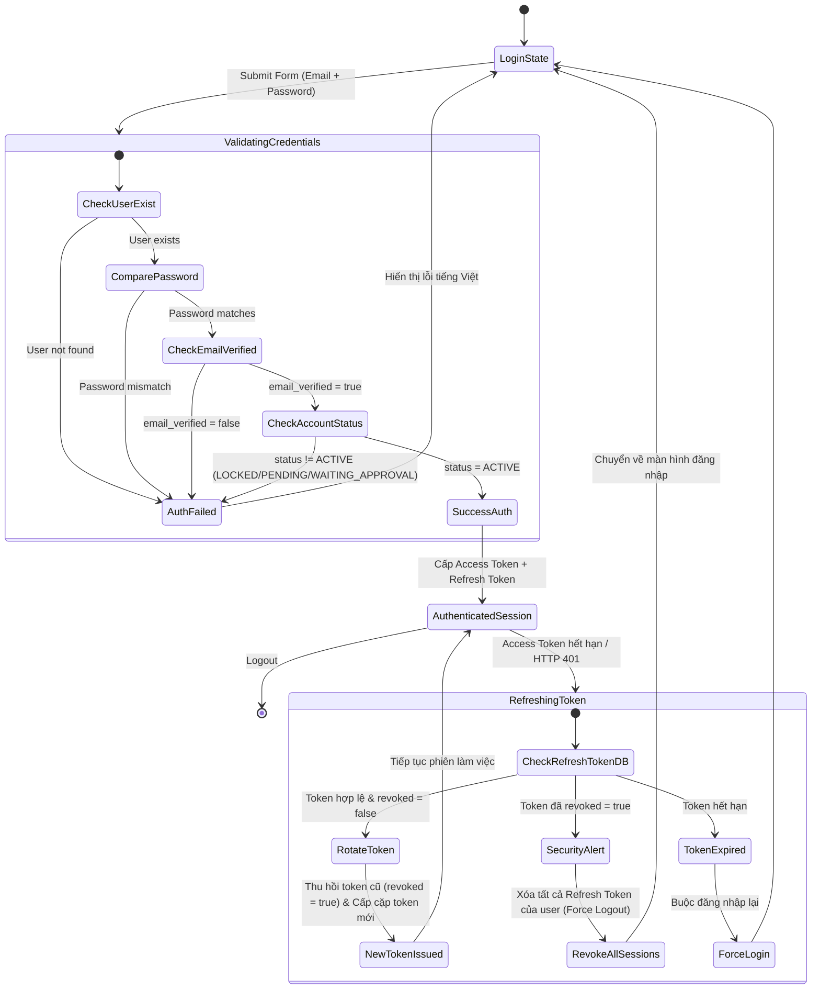
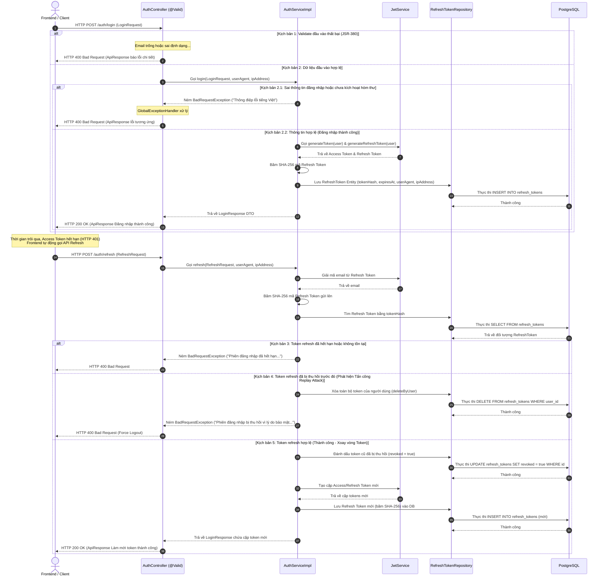

# ĐẶC TẢ YÊU CẦU & THIẾT KẾ CHI TIẾT: UC_02 - ĐĂNG NHẬP LOCAL (LOCAL LOGIN)

## PHẦN 1: ĐẶC TẢ NGHIỆP VỤ (REPORT 3)

### 2.2.3 Business Workflow (Luồng nghiệp vụ)

Sơ đồ trạng thái mô tả vòng đời của một phiên đăng nhập (Session) và xoay vòng Refresh Token (Token Rotation):

#### Mô tả chi tiết luồng xử lý bằng chữ (Business Step Description):
* **Bước 1 - Yêu cầu Đăng nhập**: Tác nhân (Người dùng) nhập Email và Mật khẩu tại màn hình `/login` và bấm nút "Sign in".
* **Bước 2 - Kiểm tra tài khoản & Mật khẩu**:
  - Hệ thống kiểm tra Email trong cơ sở dữ liệu. Nếu không thấy, báo lỗi: `"Tài khoản hoặc mật khẩu không chính xác"`.
  - Hệ thống so khớp mật khẩu đã băm bằng `BCryptPasswordEncoder`. Nếu không trùng, báo lỗi: `"Tài khoản hoặc mật khẩu không chính xác"`.
* **Bước 3 - Kiểm tra các ràng buộc tài khoản**:
  - Hệ thống kiểm tra `email_verified`. Nếu chưa xác thực, báo lỗi: `"Email của bạn chưa được xác thực..."`.
  - Hệ thống kiểm tra `account_status`:
    - `LOCKED`: báo lỗi `"Tài khoản của bạn đã bị khóa. Vui lòng liên hệ quản trị viên."`.
    - `WAITING_APPROVAL`: báo lỗi `"Tài khoản của bạn đang chờ quản trị viên phê duyệt. Vui lòng đợi."`.
    - `PENDING`: báo lỗi `"Email của bạn chưa được xác thực..."`.
* **Bước 4 - Cấp phiên hoạt động (Đăng nhập thành công)**:
  - Hệ thống cập nhật thời gian đăng nhập gần nhất `last_login_at`.
  - Hệ thống sinh Access Token (hạn dùng 24h) và Refresh Token (hạn dùng 7 ngày) dạng JWT.
  - Mã băm SHA-256 của Refresh Token được lưu xuống bảng `refresh_tokens` kèm IP và User-Agent thiết bị.
  - Client nhận thông tin lưu vào Zustand Store (`localStorage`) để tự động đính kèm Bearer Token cho các API sau.
* **Bước 5 - Tự động làm mới phiên (Refresh Token)**:
  - Khi Access Token hết hạn (hoặc trả về HTTP 401), bộ interceptor Axios của Frontend tự động gọi `/auth/refresh` truyền kèm `refreshToken`.
  - Hệ thống kiểm tra mã băm của token trong CSDL. Nếu token cũ đã bị thu hồi (`revoked = true`), hệ thống nhận diện đây là nguy cơ xâm nhập, lập tức thu hồi/xóa toàn bộ các token hiện hành của người dùng (Force Logout) và trả về lỗi.
  - Nếu token cũ hợp lệ, hệ thống đánh dấu token cũ là `revoked = true` (xoay vòng) và tạo một cặp token mới lưu vào DB, trả về cho Client để cập nhật phiên.

---

### 3.2 Authentication Module (Quản lý Xác thực)
Module phụ trách toàn bộ các chức năng bảo mật, đăng ký tài khoản, đăng nhập local/Google, xác minh hòm thư và làm mới token bảo mật.

#### 3.2.1 Đăng nhập Local và Làm mới Token (Local Login & Token Refresh)

**Function trigger**:
- **Navigation path**:
  - Đăng nhập: `/login` trên ứng dụng React.
  - Làm mới token: Chạy ngầm tự động trong file interceptor [http.ts](file:///d:/Alumnect/alumnect-frontend/src/lib/http.ts) khi phát hiện lỗi HTTP 401.
- **Timing Frequency**: On demand (Khi người dùng thực hiện đăng nhập hoặc khi phiên truy cập hết hạn).

**Function description**:
- **Actors/Roles**: Tất cả người dùng (STUDENT, ALUMNI, ADMIN).
- **Purpose**: Xác thực danh tính người dùng bằng phương thức email/mật khẩu truyền thống và thiết lập phiên bảo mật JWT an toàn.
- **Interface**:
  - Form Đăng nhập: Gồm ô nhập email (`email`), mật khẩu (`password`), hộp chọn ghi nhớ đăng nhập (`remember`), nút đăng nhập (`Sign in`) và nút liên kết qua đăng nhập Google (`GoogleButton`).
  - Trạng thái loading: Nút đăng nhập chuyển sang chữ `"Signing in…"` và bị vô hiệu hóa (disabled).
  - Trạng thái lỗi: Hiển thị một Alert Banner chứa thông điệp lỗi tiếng Việt lấy từ Backend.

**Data processing**:
1. Client kiểm tra định dạng email và mật khẩu qua thư viện `Zod` (validate trống, độ dài, định dạng email).
2. Client gửi HTTP POST request tới `/api/v1/auth/login`.
3. Server tiếp nhận, thực hiện quy trình kiểm tra dữ liệu qua `AuthService.login`, băm và ghi nhận refresh token xuống bảng `refresh_tokens`.
4. Trả về `LoginResponse` thành công.
5. Client lưu thông tin token vào Zustand store để bắt đầu phiên truy cập.

**Screen layout**:
- Figure 01: Login Form layout (trên nền canvas pastel kem ấm `#faf4ec` và card-surface trắng mềm `#ffffff`).

**Function details**:
- **Data**:
  - Request: `email` (String), `password` (String).
  - Response: `accessToken` (String), `refreshToken` (String), `id` (Long), `email` (String), `role` (String), `fullName` (String), `avatarUrl` (String), `accountStatus` (String).
- **Validation**:
  - `email`: Bắt buộc, đúng định dạng hòm thư điện tử, tối đa 255 ký tự.
  - `password`: Bắt buộc, không trống.
- **Business rules**:
  - BR-Login-01: Chỉ tài khoản có trạng thái kích hoạt `ACTIVE` và đã xác thực email (`email_verified = true`) mới được đăng nhập thành công.
  - BR-Login-02: Cơ chế Token Rotation (xoay vòng token) bắt buộc được áp dụng: Mỗi lần refresh thành công, token cũ sẽ bị hủy (`revoked = true`) và cấp một token mới.
  - BR-Login-03: Khi phát hiện tái sử dụng Refresh Token cũ đã bị thu hồi, hệ thống coi đó là hành vi Replay Attack, tiến hành vô hiệu hóa/xóa bỏ toàn bộ các phiên hoạt động hiện hành của tài khoản đó (Force Logout).
- **Error Handling**:
  - MSG_LOGIN_01: `"Tài khoản hoặc mật khẩu không chính xác"` (khi sai email hoặc mật khẩu) - Trả về mã HTTP 400.
  - MSG_LOGIN_02: `"Email của bạn chưa được xác thực. Vui lòng kiểm tra hòm thư để xác thực trước."` (khi email chưa kích hoạt) - Trả về mã HTTP 400.
  - MSG_LOGIN_03: `"Tài khoản của bạn đã bị khóa. Vui lòng liên hệ quản trị viên."` (khi trạng thái là LOCKED) - Trả về mã HTTP 400.
  - MSG_LOGIN_04: `"Tài khoản của bạn đang chờ quản trị viên phê duyệt. Vui lòng đợi."` (khi trạng thái là WAITING_APPROVAL) - Trả về mã HTTP 400.
  - MSG_LOGIN_05: `"Phiên đăng nhập đã hết hạn hoặc bị thu hồi vì lý do bảo mật. Vui lòng đăng nhập lại."` (khi tái sử dụng refresh token đã bị thu hồi hoặc token hết hạn) - Trả về mã HTTP 400.
- **Normal case**:
  - Đăng nhập thành công trả về HTTP 200 OK kèm payload thông tin cá nhân cơ bản và cặp JWT tokens.
- **Abnormal case**:
  - Sai mật khẩu / Email chưa kích hoạt / Tài khoản bị khóa trả về HTTP 400 Bad Request kèm thông báo lỗi rõ ràng bằng tiếng Việt.

---

### 5. Requirement Appendix (Phụ lục Yêu cầu)

#### 5.1 Business Rules (Quy tắc Nghiệp vụ)

| ID | Định nghĩa Quy tắc (Rule Definition) |
| :--- | :--- |
| BR-01 | Chỉ các tài khoản có `email_verified = true` và `account_status = 'ACTIVE'` mới được phép đăng nhập vào hệ thống. |
| BR-02 | Thời hạn hiệu lực của Access Token là 24 giờ kể từ thời điểm phát hành. |
| BR-03 | Thời hạn hiệu lực của Refresh Token là 7 ngày kể từ thời điểm phát hành. |
| BR-04 | Refresh Token thực tế gửi về client là mã JWT. Khi lưu vào CSDL, bắt buộc phải lưu dưới dạng mã băm một chiều SHA-256 để bảo mật. |
| BR-05 | Áp dụng quy tắc xoay vòng Refresh Token (Refresh Token Rotation). Mỗi token chỉ được sử dụng một lần duy nhất để làm mới. |
| BR-06 | Khi phát hiện hành vi tái sử dụng Refresh Token đã bị thu hồi (nguy cơ tấn công Replay Attack), hệ thống phải hủy bỏ tất cả phiên hiện tại của người dùng. |

#### 5.3 Application Messages List (Danh sách Thông điệp Ứng dụng)

| # | Mã thông điệp | Loại thông điệp | Ngữ cảnh | Nội dung hiển thị (Tiếng Việt) |
| :--- | :--- | :--- | :--- | :--- |
| 1 | MSG_L01 | In red, under box | Email trống | Email không được để trống |
| 2 | MSG_L02 | In red, under box | Mật khẩu trống | Mật khẩu không được để trống |
| 3 | MSG_L03 | Alert Banner | Đăng nhập thất bại | Tài khoản hoặc mật khẩu không chính xác |
| 4 | MSG_L04 | Alert Banner | Email chưa xác nhận | Email của bạn chưa được xác thực. Vui lòng kiểm tra hòm thư để xác thực trước. |
| 5 | MSG_L05 | Alert Banner | Tài khoản bị khóa | Tài khoản của bạn đã bị khóa. Vui lòng liên hệ quản trị viên. |
| 6 | MSG_L06 | Alert Banner | Đang chờ Admin duyệt | Tài khoản của bạn đang chờ quản trị viên phê duyệt. Vui lòng đợi. |
| 7 | MSG_L07 | Alert Banner / Toast | Token bị tái sử dụng | Phiên đăng nhập đã hết hạn hoặc bị thu hồi vì lý do bảo mật. Vui lòng đăng nhập lại. |
| 8 | MSG_L08 | Toast message | Làm mới token thành công | Làm mới token thành công! |
| 9 | MSG_L09 | Toast message | Đăng nhập thành công | Đăng nhập thành công! |

---

## PHẦN 2: THIẾT KẾ CHI TIẾT (REPORT 4)

### 3. Detail Design (Thiết kế chi tiết)

#### 3.1 Chức năng Đăng nhập Local & Xoay vòng Token (Local Login & Token Refresh)

##### 3.1.1 Class Diagram (Sơ đồ Lớp)

Cấu trúc sơ đồ lớp thực tế triển khai nghiệp vụ đăng nhập và làm mới token:

```mermaid
classDiagram
    class AuthController {
        -AuthService authService
        +login(LoginRequest, HttpServletRequest) ResponseEntity
        +refresh(RefreshRequest, HttpServletRequest) ResponseEntity
    }
    
    class LoginRequest {
        -String email
        -String password
    }
    class RefreshRequest {
        -String refreshToken
    }
    class LoginResponse {
        -String accessToken
        -String refreshToken
        -Long id
        -String email
        -String role
        -String fullName
        -String avatarUrl
        -String accountStatus
    }
    
    class AuthService {
        <<interface>>
        +login(LoginRequest, String, String) LoginResponse
        +refresh(RefreshRequest, String, String) LoginResponse
    }
    
    class AuthServiceImpl {
        -UserRepository userRepository
        -RefreshTokenRepository refreshTokenRepository
        -UserProfileRepository userProfileRepository
        -BCryptPasswordEncoder passwordEncoder
        -JwtService jwtService
        +login(LoginRequest, String, String) LoginResponse
        +refresh(RefreshRequest, String, String) LoginResponse
        -hashToken(String) String
    }
    
    class JwtService {
        -String keySecret
        -long jwtExpiration
        +generateToken(User) String
        +generateRefreshToken(User) String
        +extractUsername(String) String
        +validateToken(String, UserDetails) Boolean
    }
    
    class RefreshTokenRepository {
        <<interface>>
        +findByTokenHash(String) Optional
        +deleteByUser(User) void
    }
    
    class UserRepository {
        <<interface>>
        +findByEmail(String) Optional
    }
    
    class User {
        -Long id
        -String email
        -String passwordHash
        -AccountStatus accountStatus
        -boolean isAccountVerified
        -boolean emailVerified
        -AuthProvider authProvider
        -Instant lastLoginAt
    }
    
    class RefreshToken {
        -Long id
        -User user
        -String tokenHash
        -Instant expiresAt
        -boolean revoked
        -String userAgent
        -String ipAddress
        -Instant createdAt
    }

    AuthController --> AuthService : calls
    AuthServiceImpl ..|> AuthService : implements
    AuthServiceImpl --> UserRepository : uses
    AuthServiceImpl --> RefreshTokenRepository : uses
    AuthServiceImpl --> JwtService : uses
    AuthServiceImpl --> User : manipulates
    AuthServiceImpl --> RefreshToken : manipulates
    AuthController ..> LoginRequest : validates
    AuthController ..> RefreshRequest : validates
    AuthController ..> LoginResponse : returns
    AuthServiceImpl ..> LoginResponse : builds
```

###### Mô tả chi tiết cấu trúc các lớp (Class Design Description):
- **AuthController**: Tiếp nhận các request HTTP POST gửi tới `/auth/login` và `/auth/refresh`, trích xuất `User-Agent` và `IP Address` từ đối tượng `HttpServletRequest` của Tomcat để truyền xuống Service Layer.
- **LoginRequest & RefreshRequest**: Các lớp DTO chứa các ràng buộc JSR-380 validation dữ liệu đầu vào.
- **LoginResponse**: DTO chứa dữ liệu trả về sau khi xác thực thành công, gồm cặp tokens và thông tin profile.
- **AuthService & AuthServiceImpl**: Xử lý toàn bộ logic nghiệp vụ (so khớp mật khẩu, kiểm tra trạng thái hoạt động của tài khoản, sinh JWT, băm SHA-256 lưu trữ refresh token, thực hiện xoay vòng token và xử lý cảnh báo Replay Attack).
- **JwtService**: Tiện ích tạo lập cấu trúc và ký số các token JWT (Access Token hạn 24h, Refresh Token hạn 7 ngày).
- **RefreshTokenRepository & UserRepository**: Các interface Spring Data JPA tương tác trực tiếp với bảng `refresh_tokens` và `users` trong PostgreSQL.
- **User & RefreshToken**: Các thực thể JPA Entity ánh xạ trực tiếp cấu trúc bảng dữ liệu vật lý.

---

##### 3.1.2 Sequence Diagram (Sơ đồ Tuần tự)

Sơ đồ tuần tự hợp nhất tất cả các kịch bản thành công và lỗi rẽ nhánh của luồng đăng nhập và làm mới token:

###### Mô tả chi tiết luồng xử lý bằng chữ (Sequence Flow Description):
1. **Luồng Đăng nhập (Yêu cầu & Lưu trữ)**:
   - Client gửi dữ liệu đăng nhập. Nếu thông tin sai lệch hoặc tài khoản chưa kích hoạt, Service ném `BadRequestException`, Controller phản hồi HTTP 400 Bad Request (Luồng 2.1).
   - Nếu đăng nhập đúng, Service tạo token, băm SHA-256 mã Refresh Token, lưu xuống PostgreSQL và trả về HTTP 200 OK (Luồng 2.2).
2. **Luồng Làm mới Token (Xoay vòng)**:
   - Khi Access Token hết hạn, Client gửi Refresh Token cũ lên `/auth/refresh`.
   - Nếu token không hợp lệ hoặc đã hết hạn, hệ thống trả về mã lỗi HTTP 400 (Luồng 3).
   - Nếu phát hiện token cũ đã từng bị thu hồi (`revoked = true`), hệ thống nhận diện đột nhập trái phép, gọi lệnh xóa sạch các phiên hiện tại trong DB và trả về lỗi buộc đăng xuất (Luồng 4).
   - Nếu token hợp lệ, hệ thống cập nhật token cũ thành `revoked = true`, tạo cặp token mới lưu vào DB và trả về HTTP 200 OK kèm cặp token mới (Luồng 5).
