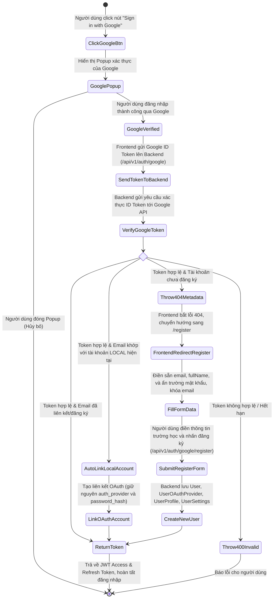
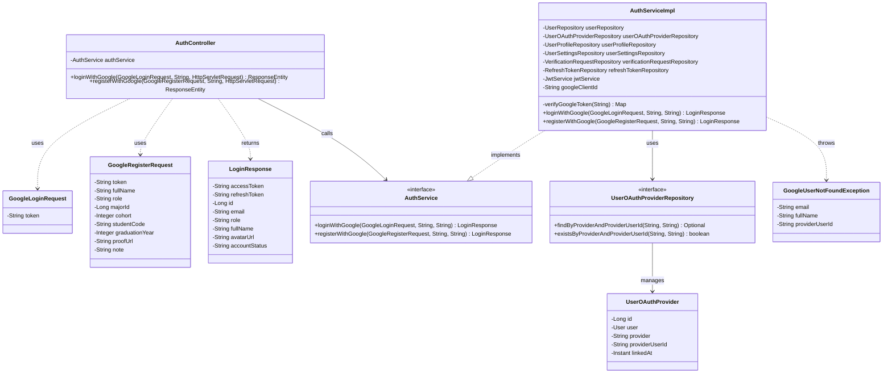
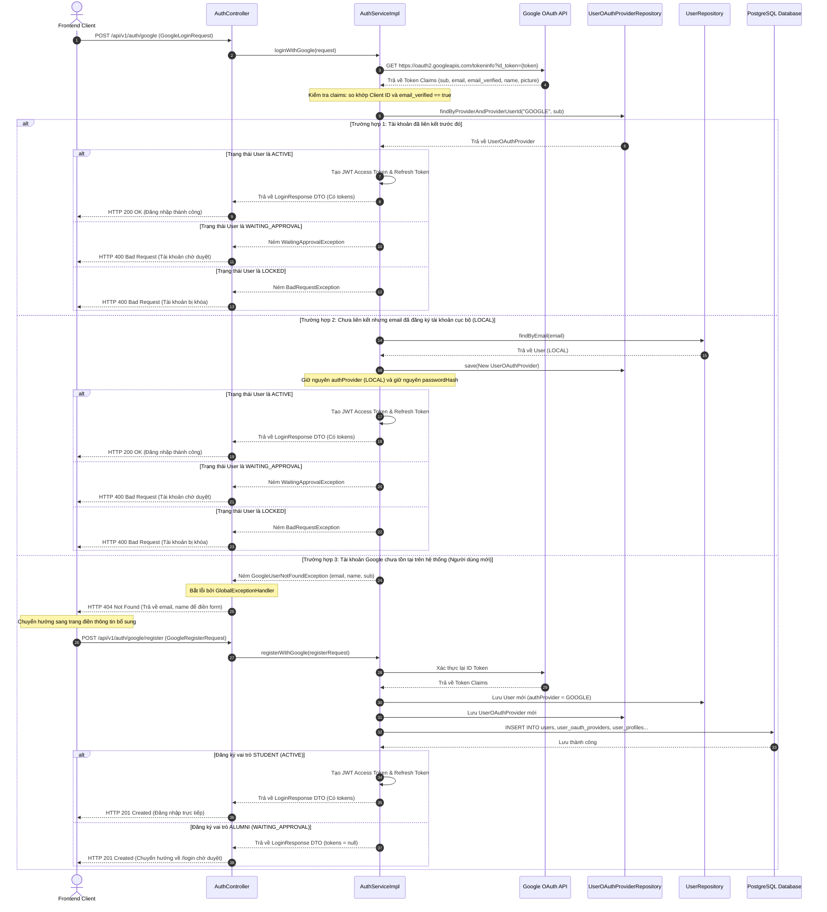

# ĐẶC TẢ YÊU CẦU & THIẾT KẾ CHI TIẾT: UC03 - ĐĂNG NHẬP BẰNG GOOGLE (OAUTH2)

## PHẦN 1: ĐẶC TẢ NGHIỆP VỤ (REPORT 3)

### 2.2.3 Business Workflow (Luồng nghiệp vụ)

#### Mô tả chi tiết luồng xử lý bằng chữ (Business Step Description):
*   **Bước 1 - Khởi đầu (Tác nhân kích hoạt)**: Khách truy cập hoặc người dùng chưa đăng nhập click vào nút "Đăng nhập bằng Google" (Google Sign-In) trên màn hình đăng nhập hoặc đăng ký của hệ thống.
*   **Bước 2 - Các bước chuyển tiếp**:
    *   **Xác thực Google**: Google Identity Services hiển thị cửa sổ popup yêu cầu người dùng chọn tài khoản Google và xác nhận quyền truy cập. Sau khi hoàn tất, Google trả về một chuỗi `credential` (ID Token).
    *   **Xác thực Backend**: Frontend gửi ID Token lên Backend endpoint `/api/v1/auth/google`. Backend sử dụng `RestTemplate` gọi API Google `tokeninfo` để kiểm tra độ tin cậy của Token, so khớp Client ID (`aud`) và trạng thái xác thực Email (`email_verified`).
    *   **Xử lý Liên kết/Phân luồng**:
        *   **Liên kết tự động**: Nếu email tài khoản Google trùng khớp với một tài khoản cục bộ (`LOCAL`) có sẵn trong hệ thống, hệ thống tự động lưu bản ghi liên kết mới vào bảng `user_oauth_providers`, giữ nguyên mật khẩu cục bộ (`password_hash`) và phương thức xác thực (`auth_provider` vẫn giữ là `LOCAL`), sau đó kích hoạt/đăng nhập bằng Google hoặc bằng Email/Mật khẩu cục bộ (Hybrid Login).
        *   **Người dùng mới (Redirection)**: Nếu email chưa tồn tại, Backend ném lỗi `GoogleUserNotFoundException` (HTTP 404) cùng dữ liệu `email`, `fullName` và `providerUserId` (sub ID) của Google. Frontend nhận dữ liệu này, tự động chuyển hướng sang trang đăng ký với các trường email (được khóa, không cho sửa) và tên được điền sẵn, đồng thời ẩn trường mật khẩu.
        *   **Hoàn tất hồ sơ mới**: Người dùng hoàn thành các thông tin trường học bắt buộc (Mã số sinh viên, Chuyên ngành, Khóa học) rồi nhấn đăng ký. Backend lưu thông tin người dùng với trạng thái `ACTIVE` (đối với sinh viên) hoặc `WAITING_APPROVAL` (đối với cựu sinh viên).
*   **Bước 3 - Kết thúc**: Hệ thống trả về cặp JWT tokens (Access Token và Refresh Token) cùng thông tin cơ bản của người dùng, đưa người dùng vào trang Dashboard hệ thống.

---

### 3.2 Quản Lý Tài Khoản
Module Quản lý tài khoản chịu trách nhiệm về toàn bộ các quy trình đăng ký, xác thực, đăng nhập, phân quyền và lưu trữ thiết lập người dùng.

#### 3.2.1 Đăng nhập và đăng ký bằng Google

**Function trigger**:
*   **Navigation path**: Khách truy cập nhấn nút Google Sign-In tại trang `/login` hoặc `/register`.
*   **Timing Frequency**: Bất cứ khi nào người dùng muốn thực hiện đăng nhập hoặc đăng ký mà không sử dụng tài khoản cục bộ.

**Function description**:
*   **Actors/Roles**: Khách truy cập (chưa đăng nhập), Sinh viên (STUDENT), Cựu sinh viên (ALUMNI).
*   **Purpose**: Đơn giản hóa quá trình đăng nhập và đăng ký tài khoản của sinh viên/cựu sinh viên FPTU thông qua tài khoản Google của họ.
*   **Interface**:
    *   Nút Google Sign-In chính thức được nhúng qua script của Google.
    *   Trang đăng ký đặc thù khi điền thông tin bổ sung: Khóa input Email, ẩn trường mật khẩu, và hiển thị các trường thông tin bắt buộc (Vai trò, Chuyên ngành, Khóa, MSSV, Minh chứng đối với Cựu sinh viên).

**Data processing**:
1.  **Google Token Verification**: Gửi HTTP GET request đến Google API để lấy thông tin tài khoản.
2.  **Lookup OAuth Map**: Tra cứu bảng `user_oauth_providers` theo `provider` (GOOGLE) và `provider_user_id` (sub ID từ Google).
3.  **Local Account Mapping**: Kiểm tra email Google trong bảng `users` để liên kết tự động nếu khớp email.
4.  **Register Processing**: Đối với người dùng Google mới, lưu thông tin tài khoản mà không có mật khẩu cục bộ, thiết lập `auth_provider = 'GOOGLE'`.

**Screen layout**:
*   Layout trang đăng nhập: `/login` chứa nút "Sign in with Google" phía dưới form đăng nhập thông thường.
*   Layout trang đăng ký thông tin bổ sung: `/register` với các trường Email bị khóa và không có trường Mật khẩu.

**Function details**:
*   **Data**: Google ID Token, Vai trò, Chuyên ngành ID, Khóa học, Mã số sinh viên, Năm tốt nghiệp (nếu là Alumni), Link ảnh minh chứng (nếu là Alumni), Ghi chú (nếu có).
*   **Validation**:
    *   Mã số sinh viên không được trùng lặp.
    *   Ảnh minh chứng và năm tốt nghiệp là bắt buộc với vai trò Cựu sinh viên (ALUMNI).
*   **Business rules**:
    *   Tài khoản đăng nhập qua Google có thể đăng nhập thông thường bằng mật khẩu cục bộ nếu tài khoản đã được thiết lập mật khẩu cục bộ (Hybrid Login).
    *   Hệ thống chỉ chấp nhận email Google có trạng thái `email_verified` bằng `true`.
*   **Error Handling**:
    *   **404 Not Found**: Tài khoản Google chưa được đăng ký trong hệ thống (kèm dữ liệu để tự điền form).
    *   **400 Bad Request**: Token Google giả mạo, hết hạn, hoặc Client ID không đúng.
    *   **409 Conflict**: Trùng mã số sinh viên khi đăng ký tài khoản mới.
*   **Normal case**: Người dùng được đăng nhập trực tiếp (nếu tài khoản đã hoạt động). Đối với đăng ký mới: vai trò STUDENT được cấp token và chuyển vào ứng dụng chính `/app` trực tiếp; vai trò ALUMNI đăng ký thành công sẽ không kèm tokens, được chuyển hướng về trang đăng nhập `/login` kèm thông điệp chờ phê duyệt.
*   **Abnormal case**: Lỗi kết nối API Google hoặc từ chối cấp quyền từ phía người dùng, hiển thị thông báo lỗi tương ứng.

---

### 5. Requirement Appendix (Phụ lục Yêu cầu)

#### 5.1 Business Rules (Quy tắc Nghiệp vụ)

| ID | Định nghĩa Quy tắc (Rule Definition) |
| :--- | :--- |
| BR-05 | Người dùng liên kết bằng Google sẽ giữ nguyên mật khẩu cục bộ (nếu có) và đăng nhập bằng cả 2 cách (Hybrid Login). |
| BR-06 | Chỉ chấp nhận tài khoản Google có email đã được xác minh (`email_verified` = true). |
| BR-07 | Khi đăng ký bằng Google với vai trò Cựu sinh viên (ALUMNI), tài khoản sẽ ở trạng thái `WAITING_APPROVAL` và phải gửi kèm minh chứng tốt nghiệp. |
| BR-08 | Khi đăng ký bằng Google với vai trò Sinh viên (STUDENT), tài khoản sẽ được kích hoạt ở trạng thái `ACTIVE` ngay lập tức mà không cần xác minh OTP qua email. |

#### 5.2 Common Requirements (Yêu cầu Chung)
*   Sử dụng cơ chế HTTPS/TLS mã hóa để truyền ID Token của Google và JWT tokens của hệ thống.
*   Trình bày giao diện nút Google đẹp mắt, tích hợp mượt mà và không gây giật lag giao diện (Skeleton loading hoặc Spinner).

#### 5.3 Application Messages List (Danh sách Thông điệp Ứng dụng)

| # | Mã thông điệp (Message code) | Loại thông điệp (Message Type) | Ngữ cảnh (Context) | Nội dung hiển thị (Content) |
| :--- | :--- | :--- | :--- | :--- |
| 1 | MSG10 | inline/toast | Đăng nhập Google thành công | Đăng nhập bằng Google thành công! |
| 2 | MSG11 | inline/toast | Đăng ký tài khoản mới qua Google thành công | Đăng ký tài khoản qua Google thành công! |
| 3 | MSG12 | inline error | Token Google không hợp lệ hoặc hết hạn | Token xác thực Google không hợp lệ hoặc đã hết hạn |
| 4 | MSG13 | inline error | Tài khoản Google chưa được xác thực email | Tài khoản Google này chưa được xác thực email |
| 5 | MSG14 | inline error | Mã số sinh viên trùng lặp khi đăng ký Google | Mã số sinh viên này đã được đăng ký trong hệ thống. |

---

## PHẦN 2: THIẾT KẾ CHI TIẾT (REPORT 4)

### 3. Detail Design (Thiết kế chi tiết)

#### 3.1 Đăng nhập và đăng ký bằng Google (Google OAuth2)

##### 3.1.1 Class Diagram (Sơ đồ Lớp)

###### Mô tả chi tiết cấu trúc các lớp (Class Design Description):
*   **AuthController**: Lớp controller cung cấp 2 endpoints mới: `/api/v1/auth/google` tiếp nhận yêu cầu đăng nhập và `/api/v1/auth/google/register` để đăng ký tài khoản với Google ID Token.
*   **GoogleLoginRequest**: DTO tiếp nhận ID Token duy nhất gửi từ Client lên.
*   **GoogleRegisterRequest**: DTO tiếp nhận ID Token của Google kết hợp với thông tin cá nhân/trường học bắt buộc để khởi tạo người dùng mới.
*   **GoogleUserNotFoundException**: Lớp ngoại lệ tùy chỉnh ném ra khi tài khoản Google xác thực hợp lệ nhưng chưa tồn tại trên hệ thống, mang theo thông tin hồ sơ của Google để chuyển sang luồng đăng ký.
*   **UserOAuthProvider**: Thực thể đại diện cho ánh xạ 1-N từ tài khoản người dùng (`User`) sang các nhà cung cấp bên ngoài (trong trường hợp này là `GOOGLE` và sub ID nhận từ Google).
*   **UserOAuthProviderRepository**: Interface JPA Repository cung cấp các phương thức tìm kiếm và kiểm tra sự tồn tại của ánh xạ OAuth2 trong DB.

##### 3.1.2 Sequence Diagram (Sơ đồ Tuần tự)

###### Mô tả chi tiết luồng xử lý bằng chữ (Sequence Flow Description):
1.  **Luồng Đăng nhập thành công / Tự động liên kết**:
    *   Client gửi ID Token qua request POST.
    *   Backend gọi API Google xác thực token. Sau đó truy vấn bảng `user_oauth_providers`.
    *   Nếu tìm thấy, lấy thông tin người dùng trực tiếp.
    *   Nếu chưa liên kết OAuth nhưng tìm thấy email trong bảng `users`, hệ thống tự động lưu bản ghi liên kết mới và giữ nguyên cấu hình bảo mật (giữ nguyên password hash và authProvider cũ) để hỗ trợ Hybrid Login.
    *   Trả về cặp JWT tokens cùng trạng thái HTTP 200 OK.
2.  **Luồng Đăng ký tài khoản Google mới (404 Redirect)**:
    *   Nếu email Google chưa tồn tại trong hệ thống, Backend ném ngoại lệ `GoogleUserNotFoundException`.
    *   `GlobalExceptionHandler` bắt ngoại lệ này và trả về JSON có mã lỗi `404` cùng dữ liệu hồ sơ Google (Email, Tên).
    *   Frontend nhận mã 404 này trong catch block của mutation, lấy thông tin chuyển tiếp người dùng sang trang `/register`, tự động điền Email và Họ tên, khóa trường Email và ẩn trường nhập Mật khẩu.
    *   Khi người dùng submit form đăng ký, Frontend gửi thông tin lên endpoint `/google/register`. Backend thực hiện lưu người dùng, liên kết OAuth, tạo Profile và cài đặt mặc định. Nếu là STUDENT, Backend cấp phát tokens đăng nhập luôn. Nếu là ALUMNI, Backend trả về response không kèm tokens (tokens = null) để Frontend chuyển hướng về trang đăng nhập `/login` và hiển thị thông báo chờ phê duyệt từ Admin.
