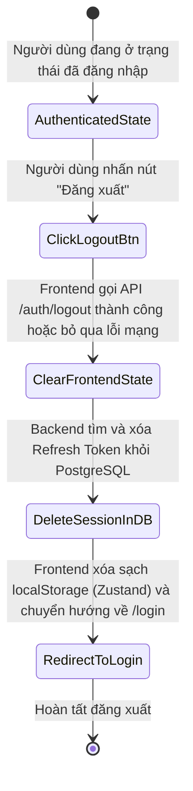
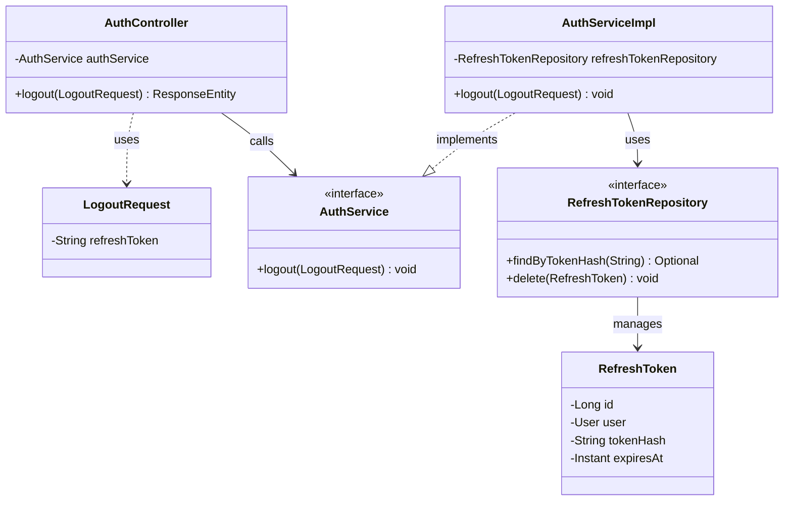
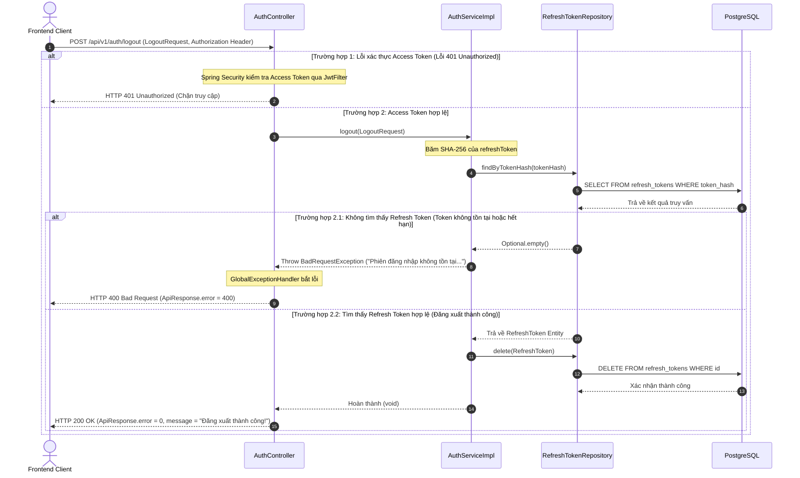

# ĐẶC TẢ YÊU CẦU & THIẾT KẾ CHI TIẾT: UC04 - ĐĂNG XUẤT (LOGOUT)

## PHẦN 1: ĐẶC TẢ NGHIỆP VỤ (REPORT 3)

### 2.2.3 Business Workflow (Luồng nghiệp vụ)

#### Mô tả chi tiết luồng xử lý bằng chữ (Business Step Description):
* **Bước 1 - Khởi đầu (Tác nhân kích hoạt)**: Người dùng đã đăng nhập hệ thống nhấn vào nút "Đăng xuất" (Logout) trên thanh điều hướng hoặc menu cá nhân.
* **Bước 2 - Các bước chuyển tiếp**:
    * **Yêu cầu gọi API**: Frontend lấy mã `refreshToken` hiện có trong Zustand Store và gửi yêu cầu POST đến `/api/v1/auth/logout` kèm theo `AccessToken` ở Authorization Header để xác thực.
    * **Xác thực và Xóa phiên ở Server**: 
        - Backend tiếp nhận mã `refreshToken` trong request body, băm mã hóa SHA-256 rồi thực hiện truy vấn bảng `refresh_tokens`.
        - Nếu tìm thấy phiên đăng nhập hợp lệ, hệ thống xóa bản ghi này khỏi cơ sở dữ liệu (`DELETE FROM refresh_tokens`), thu hồi vĩnh viễn phiên làm việc này.
        - Nếu không tìm thấy (token đã bị hủy hoặc hết hạn trước đó), Backend ném lỗi `BadRequestException` (HTTP 400).
    * **Dọn dẹp bộ nhớ máy khách (Client Cleanup)**: 
        - Khi API trả về kết quả thành công (hoặc khi gặp lỗi mạng nhưng Frontend vẫn chủ động xử lý), Frontend kích hoạt hàm dọn dẹp state của Zustand.
        - Dữ liệu `user`, `accessToken`, và `refreshToken` trong `localStorage` bị ghi đè thành `null`, chuyển trạng thái `isAuthenticated` thành `false`.
* **Bước 3 - Kết thúc**: Frontend tự động chuyển hướng người dùng quay trở lại trang đăng nhập (`/login`) với trạng thái bộ nhớ đệm sạch hoàn toàn.

---

### 3.2 Quản Lý Tài Khoản
Module Quản lý tài khoản chịu trách nhiệm về toàn bộ các quy trình đăng ký, xác thực, đăng nhập, phân quyền, đăng xuất và lưu trữ thiết lập người dùng.

#### 3.2.2 Đăng xuất hệ thống (Logout)

**Function trigger**:
*   **Navigation path**: Người dùng nhấn nút "Đăng xuất" tại thanh điều hướng bên (Sidebar) hoặc Profile Menu.
*   **Timing Frequency**: Bất cứ khi nào người dùng muốn đăng xuất khỏi tài khoản trên thiết bị hiện tại.

**Function description**:
*   **Actors/Roles**: Người dùng đã xác thực (STUDENT, ALUMNI, ADMIN).
*   **Purpose**: Thu hồi phiên làm việc hiện tại của người dùng, xóa các token lưu trữ ở client và server nhằm ngăn chặn truy cập trái phép.
*   **Interface**:
    - Nút bấm Đăng xuất (Logout Button) có biểu tượng trực quan.
    - Lớp phủ mờ (Loading spinner overlay) hiển thị ngắn trong lúc xử lý gửi API lên server.

**Data processing**:
1.  **Extract Tokens**: Đọc `refreshToken` từ Zustand store.
2.  **Request API**: Gửi yêu cầu POST lên `/api/v1/auth/logout` kèm Bearer Access Token và Refresh Token body.
3.  **DB Revocation**: Truy vấn bảng `refresh_tokens` bằng mã băm SHA-256 của token và xóa bản ghi khỏi DB.
4.  **Local Memory Clear**: Xóa sạch cookie và dữ liệu trong `localStorage` tại trình duyệt máy khách.

**Screen layout**:
*   Chức năng chạy trực tiếp từ nút bấm trên thanh Sidebar hoặc Header của AppShell, không có màn hình layout riêng mà chuyển hướng thẳng về `/login`.

**Function details**:
*   **Data**: Access Token (Header), Refresh Token (Request Body).
*   **Validation**:
    - `refreshToken` trong request body không được để trống.
*   **Business rules**:
    - Khi đăng xuất thành công trên thiết bị này, các thiết bị khác đang hoạt động của cùng một tài khoản vẫn giữ nguyên trạng thái hoạt động (Single Session Revocation).
    - Ngăn chặn triệt để tấn công Replay Attack bằng việc xóa hoàn toàn bản ghi Refresh Token cũ khỏi cơ sở dữ liệu.
*   **Error Handling**:
    - **401 Unauthorized**: Access Token hết hạn hoặc không hợp lệ (Frontend sẽ tự động làm mới qua interceptor trước khi tiếp tục).
    - **400 Bad Request**: Refresh Token gửi lên không tồn tại hoặc đã bị đăng xuất trước đó.
*   **Normal case**: Người dùng được chuyển về màn hình đăng nhập `/login` kèm thông báo đăng xuất thành công dạng toast.
*   **Abnormal case**: Lỗi mất kết nối mạng, Frontend vẫn tự động dọn sạch bộ nhớ cục bộ và đá người dùng ra trang đăng nhập để đảm bảo an toàn thông tin tại thiết bị.

---

### 5. Requirement Appendix (Phụ lục Yêu cầu)

#### 5.1 Business Rules (Quy tắc Nghiệp vụ)

| ID | Định nghĩa Quy tắc (Rule Definition) |
| :--- | :--- |
| BR-09 | Mỗi yêu cầu đăng xuất thành công chỉ thu hồi duy nhất phiên làm việc hiện tại, giữ nguyên các phiên hoạt động khác của người dùng. |
| BR-10 | Refresh Token sau khi đăng xuất phải bị xóa hoàn toàn khỏi cơ sở dữ liệu để ngăn ngừa tái sử dụng bất hợp pháp. |

#### 5.2 Common Requirements (Yêu cầu Chung)
*   Sử dụng giao thức HTTPS để truyền các tham số token bảo mật.
*   Quá trình dọn dẹp Client State phải diễn ra tức thì, không gây gián đoạn hoặc treo ứng dụng.

#### 5.3 Application Messages List (Danh sách Thông điệp Ứng dụng)

| # | Mã thông điệp (Message code) | Loại thông điệp (Message Type) | Ngữ cảnh (Context) | Nội dung hiển thị (Content) |
| :--- | :--- | :--- | :--- | :--- |
| 1 | MSG15 | toast | Đăng xuất thành công | Đăng xuất thành công! |
| 2 | MSG16 | inline error | Refresh token đăng xuất không tồn tại hoặc hết hạn | Phiên đăng nhập không tồn tại hoặc đã hết hạn. |

---

## PHẦN 2: THIẾT KẾ CHI TIẾT (REPORT 4)

### 3. Detail Design (Thiết kế chi tiết)

#### 3.2 Đăng xuất khỏi hệ thống (Logout)

##### 3.2.1 Class Diagram (Sơ đồ Lớp)

###### Mô tả chi tiết cấu trúc các lớp (Class Design Description):
* **AuthController**: Controller tiếp nhận yêu cầu đăng xuất tại POST endpoint `/api/v1/auth/logout`.
* **LogoutRequest**: DTO đại diện cho request body chứa Refresh Token cần thu hồi.
* **AuthService & AuthServiceImpl**: Lớp dịch vụ chứa nghiệp vụ băm mã hóa token, tìm kiếm và xóa phiên tương ứng.
* **RefreshToken & RefreshTokenRepository**: Thực thể ánh xạ bảng `refresh_tokens` trong database và lớp truy vấn JPA Repository để xóa dữ liệu.

##### 3.2.2 Sequence Diagram (Sơ đồ Tuần tự)

###### Mô tả chi tiết luồng xử lý bằng chữ (Sequence Flow Description):
1. **Luồng xác thực**: Mọi request đăng xuất đều đi qua `JwtFilter`. Nếu Access Token trong Header không hợp lệ hoặc rỗng, Spring Security từ chối ngay lập tức và trả về mã lỗi HTTP 401 Unauthorized.
2. **Luồng xử lý nghiệp vụ thất bại (400 Bad Request)**: Nếu Access Token hợp lệ, Controller gọi `AuthServiceImpl.logout()`. Service băm token và tìm kiếm trong CSDL. Nếu token không tồn tại (đã hết hạn hoặc bị xóa trước đó), hệ thống ném ngoại lệ `BadRequestException`, GlobalExceptionHandler bắt lỗi và trả về JSON lỗi 400 cho Client.
3. **Luồng xử lý nghiệp vụ thành công (200 OK)**: Nếu tìm thấy phiên, Service thực hiện xóa bản ghi khỏi DB thông qua `RefreshTokenRepository.delete()`. Sau khi DB xác nhận xóa thành công, Service phản hồi về Controller và trả về HTTP 200 OK thông báo đăng xuất thành công cho Client.
