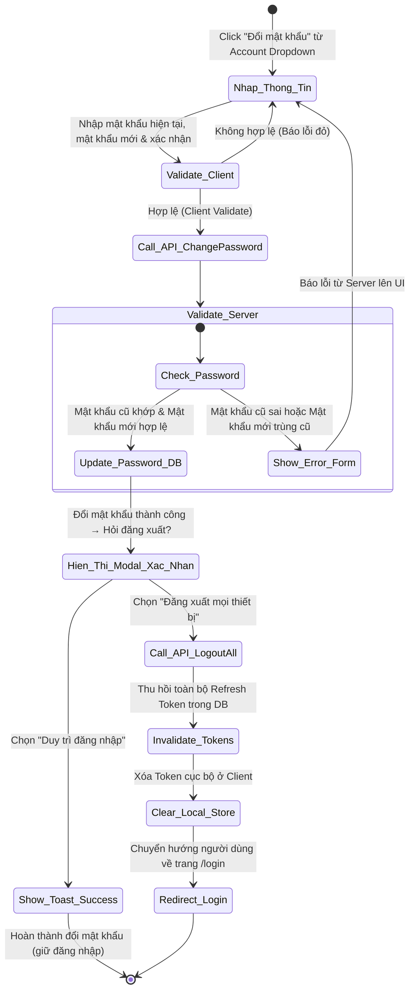
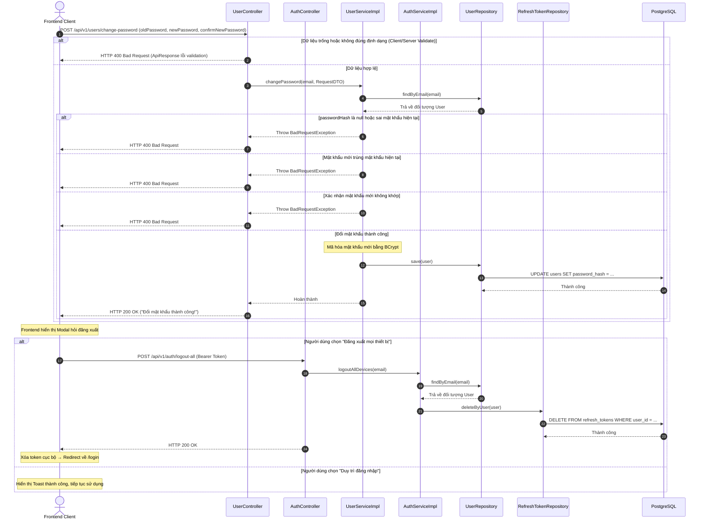

# ĐẶC TẢ YÊU CẦU & THIẾT KẾ CHI TIẾT: UC_ChangePassword - ĐỔI MẬT KHẨU

## PHẦN 1: ĐẶC TẢ NGHIỆP VỤ (REPORT 3)

### 2.2.3 Business Workflow (Luồng nghiệp vụ)

#### Mô tả chi tiết luồng xử lý bằng chữ (Business Step Description):
* **Bước 1 - Khởi đầu**: Người dùng đang đăng nhập truy cập vào tùy chọn "Change Password" trong menu dropdown tài khoản. Hệ thống hiển thị Form Đổi mật khẩu.
* **Bước 2 - Nhập liệu & Kiểm tra hợp lệ Client**: Người dùng nhập mật khẩu hiện tại, mật khẩu mới và xác nhận mật khẩu mới. Client kiểm tra định dạng và so khớp mật khẩu mới/mật khẩu xác nhận. Nếu lỗi, hiển thị cảnh báo tương ứng.
* **Bước 3 - Gọi API đổi mật khẩu**: Client gửi `POST /api/v1/users/change-password` với 3 trường mật khẩu. Server kiểm tra và cập nhật mật khẩu mới vào DB.
  * Nếu Server trả về lỗi (sai mật khẩu, trùng mật khẩu,...): Form báo lỗi tương ứng.
  * Nếu thành công (200 OK): Chuyển sang Bước 4.
* **Bước 4 - Xác nhận lựa chọn đăng xuất**: Sau khi đổi mật khẩu thành công, một Modal xác nhận hiển thị để hỏi người dùng có muốn đăng xuất khỏi tất cả các thiết bị không.
  * Nếu chọn **"Đăng xuất mọi thiết bị"**: Gọi API `POST /api/v1/auth/logout-all` để thu hồi toàn bộ Refresh Token trong DB. Sau đó xóa token cục bộ và chuyển hướng về `/login`.
  * Nếu chọn **"Duy trì đăng nhập"**: Hiển thị thông báo thành công tại chỗ, người dùng tiếp tục sử dụng bình thường.

### 3.2 Quản Lý Tài Khoản
Chịu trách nhiệm quản lý thông tin hồ sơ và bảo mật của người dùng đăng nhập trong Alumnect.

#### 3.2.1 Thay đổi mật khẩu tài khoản
*   **Function trigger**:
    *   **Navigation path**: Header -> Account Dropdown -> Click "Change Password" (/app/change-password).
    *   **Timing Frequency**: On demand (bất cứ khi nào người dùng muốn thay đổi mật khẩu).
*   **Function description**:
    *   **Actors/Roles**: Tất cả người dùng đã đăng nhập (STUDENT, ALUMNI, ADMIN).
    *   **Purpose**: Cho phép người dùng cập nhật mật khẩu của tài khoản để tăng tính bảo mật. Sau khi đổi thành công, hệ thống hỏi người dùng có muốn đăng xuất khỏi tất cả các thiết bị không.
    *   **Interface**:
        *   Các trường nhập liệu: Mật khẩu hiện tại, Mật khẩu mới, Xác nhận mật khẩu mới.
        *   Nút bật/tắt hiển thị mật khẩu (Biểu tượng Eye/EyeOff).
        *   Nút cập nhật mật khẩu.
        *   Modal xác nhận lựa chọn đăng xuất (hiện sau khi đổi mật khẩu thành công).
*   **Data processing**:
    *   Validate dữ liệu đầu vào phía Client (Zod) và Server (JSR-380).
    *   Kiểm tra mật khẩu hiện tại trong DB bằng `BCryptPasswordEncoder.matches()`.
    *   Mã hóa mật khẩu mới trước khi lưu bằng `BCryptPasswordEncoder.encode()`.
    *   Nếu chọn đăng xuất toàn bộ: Gọi API riêng `/auth/logout-all` → `RefreshTokenRepository.deleteByUser(User user)` để hủy toàn bộ Refresh Tokens.
*   **Screen layout**:
    *   Figure: Change Password Screen layout (Form nằm giữa trang, chứa 3 trường nhập mật khẩu dạng Premium Pastel).
*   **Function details**:
    *   **API 1 - Đổi mật khẩu**:
        *   Endpoint: `POST /api/v1/users/change-password`
        *   Data:
            *   `oldPassword` (chuỗi ký tự, bắt buộc)
            *   `newPassword` (chuỗi ký tự, bắt buộc)
            *   `confirmNewPassword` (chuỗi ký tự, bắt buộc)
    *   **API 2 - Đăng xuất tất cả thiết bị** (gọi sau khi API 1 thành công, nếu người dùng đồng ý):
        *   Endpoint: `POST /api/v1/auth/logout-all`
        *   Data: Không có body (lấy email từ JWT Token)
    *   **Validation**:
        *   Mật khẩu hiện tại, mật khẩu mới, xác nhận không được để trống.
        *   Mật khẩu mới phải có độ dài từ 8 đến 100 ký tự.
        *   Mật khẩu mới phải chứa ít nhất 1 chữ cái và 1 chữ số (Regex: `^(?=.*[A-Za-z])(?=.*\d).+$`).
        *   Mật khẩu mới không được trùng với mật khẩu hiện tại.
        *   Xác nhận mật khẩu mới phải khớp với mật khẩu mới.
    *   **Business rules**:
        *   Cho phép người dùng đã liên kết Google đổi mật khẩu nếu họ đã từng tạo mật khẩu cục bộ (`password_hash != null`).
        *   Trường hợp chưa tạo mật khẩu cục bộ (`password_hash == null`), bất kỳ mật khẩu hiện tại nào nhập vào cũng đều được tính là không chính xác và trả về thông điệp lỗi: *"Mật khẩu hiện tại không chính xác."*.
        *   API `/auth/logout-all` chỉ được gọi sau khi API `/users/change-password` đã thành công và người dùng xác nhận muốn đăng xuất khỏi mọi thiết bị.
    *   **Error Handling**:
        *   Sai mật khẩu hiện tại: Trả về lỗi 400 Bad Request kèm thông báo: *"Mật khẩu hiện tại không chính xác."*.
        *   Mật khẩu trùng nhau: Trả về lỗi 400 Bad Request kèm thông báo: *"Mật khẩu mới không được trùng với mật khẩu hiện tại."*.
        *   Không trùng khớp xác nhận: Trả về lỗi 400 Bad Request kèm thông báo: *"Xác nhận mật khẩu mới không trùng khớp."*.
        *   Sai định dạng mật khẩu mới: Trả về lỗi 400 Bad Request kèm chi tiết lỗi định dạng.
    *   **Normal case**: Đổi mật khẩu thành công, cập nhật `password_hash` mới vào DB, trả về 200 OK. Frontend hiển thị Modal hỏi đăng xuất.
    *   **Abnormal case**: Lỗi kết nối DB hoặc lỗi xác thực JWT hết hạn.

---

### 5. Requirement Appendix (Phụ lục Yêu cầu)

#### 5.1 Business Rules (Quy tắc Nghiệp vụ)

| ID | Định nghĩa Quy tắc (Rule Definition) |
| :--- | :--- |
| BR-03 | Token của phiên đăng nhập (Refresh Token) có thời hạn hiệu lực tối đa là 7 ngày (604800000 ms). |
| BR-05 | Đổi mật khẩu bắt buộc phải xác thực bằng mật khẩu hiện tại thông qua mã hóa BCrypt. |
| BR-06 | Nếu người dùng đăng nhập bằng tài khoản Google nhưng chưa có mật khẩu cục bộ, hệ thống trả về lỗi sai mật khẩu hiện tại để bảo vệ luồng an toàn. |
| BR-07 | Việc đăng xuất tất cả thiết bị sau khi đổi mật khẩu là tùy chọn của người dùng và được xử lý qua API riêng biệt `/auth/logout-all`, tách biệt hoàn toàn khỏi nghiệp vụ đổi mật khẩu. |

#### 5.3 Application Messages List (Danh sách Thông điệp Ứng dụng)

| # | Mã thông điệp (Message code) | Loại thông điệp (Message Type) | Ngữ cảnh (Context) | Nội dung hiển thị (Content) |
| :--- | :--- | :--- | :--- | :--- |
| 1 | MSG_PW_01 | In red, under the text box | Trường nhập mật khẩu trống | {field_name} không được để trống |
| 2 | MSG_PW_02 | In red, under the text box | Mật khẩu mới quá ngắn/quá dài | Mật khẩu mới phải có độ dài từ 8 đến 100 ký tự |
| 3 | MSG_PW_03 | In red, under the text box | Mật khẩu mới thiếu chữ hoặc số | Mật khẩu mới phải chứa ít nhất 1 chữ cái và 1 chữ số |
| 4 | MSG_PW_04 | In red, under the text box | Xác nhận mật khẩu không khớp | Xác nhận mật khẩu mới không trùng khớp. |
| 5 | MSG_PW_05 | In red, under the text box | Mật khẩu mới trùng mật khẩu cũ | Mật khẩu mới không được trùng với mật khẩu hiện tại. |
| 6 | MSG_PW_06 | Banner / Alert error | Lỗi mật khẩu hiện tại sai hoặc null từ Server | Mật khẩu hiện tại không chính xác. |
| 7 | MSG_PW_07 | Banner / Alert / Toast | Cập nhật mật khẩu thành công | Đổi mật khẩu thành công! |

---

## PHẦN 2: THIẾT KẾ CHI TIẾT (REPORT 4)

### 3. Detail Design (Thiết kế chi tiết)

#### 3.1 Đổi mật khẩu tài khoản (UC_ChangePassword)

##### 3.1.1 Class Diagram (Sơ đồ Lớp)

```mermaid
classDiagram
    class UserController {
        -UserService userService
        +changePassword(ChangePasswordRequest) ResponseEntity
    }

    class AuthController {
        -AuthService authService
        +logoutAll() ResponseEntity
        +logout(LogoutRequest) ResponseEntity
    }

    class ChangePasswordRequest {
        -String oldPassword
        -String newPassword
        -String confirmNewPassword
    }

    class UserService {
        <<interface>>
        +changePassword(String, ChangePasswordRequest) void
    }

    class UserServiceImpl {
        -UserRepository userRepository
        -BCryptPasswordEncoder passwordEncoder
        +changePassword(String, ChangePasswordRequest) void
    }

    class AuthService {
        <<interface>>
        +logout(LogoutRequest) void
        +logoutAllDevices(String) void
    }

    class AuthServiceImpl {
        -UserRepository userRepository
        -RefreshTokenRepository refreshTokenRepository
        +logout(LogoutRequest) void
        +logoutAllDevices(String) void
    }

    class UserRepository {
        <<interface>>
        +findByEmail(String) Optional~User~
        +save(User) User
    }

    class RefreshTokenRepository {
        <<interface>>
        +deleteByUser(User) void
        +delete(RefreshToken) void
    }

    class User {
        -Long id
        -String email
        -String passwordHash
    }

    UserController ..> ChangePasswordRequest : validates & uses
    UserController --> UserService : calls
    UserServiceImpl ..|> UserService : implements
    UserServiceImpl --> UserRepository : uses
    UserServiceImpl ..> User : manipulates

    AuthController --> AuthService : calls
    AuthServiceImpl ..|> AuthService : implements
    AuthServiceImpl --> UserRepository : uses
    AuthServiceImpl --> RefreshTokenRepository : uses
```

###### Mô tả chi tiết cấu trúc các lớp (Class Design Description):
* **Lớp Controller**: 
  * `UserController.java` tiếp nhận yêu cầu đổi mật khẩu qua endpoint `POST /users/change-password`.
  * `AuthController.java` tiếp nhận yêu cầu đăng xuất qua endpoint `POST /auth/logout` và đăng xuất tất cả các thiết bị qua endpoint `POST /auth/logout-all`.
* **Lớp DTO**: `ChangePasswordRequest.java` định nghĩa cấu trúc JSON đầu vào với 3 trường: `oldPassword`, `newPassword`, `confirmNewPassword`.
* **Lớp Service**: 
  * `UserService.java` / `UserServiceImpl.java` chịu trách nhiệm thay đổi mật khẩu tài khoản (xác thực qua BCrypt, mã hóa mật khẩu mới và lưu vào DB).
  * `AuthService.java` / `AuthServiceImpl.java` chịu trách nhiệm quản lý phiên đăng nhập và đăng xuất (xóa Refresh Token hiện tại hoặc tất cả Refresh Tokens của User).
* **Lớp Repository**: `UserRepository.java` và `RefreshTokenRepository.java` thực hiện các truy vấn cơ sở dữ liệu tương ứng.

##### 3.1.2 Sequence Diagram (Sơ đồ Tuần tự)

###### Mô tả chi tiết luồng xử lý bằng chữ (Sequence Flow Description):
1. **Luồng đổi mật khẩu**: Frontend gửi `POST /users/change-password` với 3 trường mật khẩu. `UserController` nhận request, gọi `UserService` thực hiện xác thực mật khẩu cũ bằng BCrypt, kiểm tra các ràng buộc và cập nhật mật khẩu mới. Trả về 200 OK.
2. **Luồng đăng xuất tất cả thiết bị** (tùy chọn): Sau khi đổi mật khẩu thành công, nếu người dùng đồng ý, Frontend gọi `POST /auth/logout-all` với Bearer Token. `AuthController` tiếp nhận và gọi `AuthService` thu hồi toàn bộ Refresh Tokens trong DB của người dùng đó. Frontend xóa token cục bộ và chuyển hướng về `/login`.
3. **Luồng lỗi**: Nếu mật khẩu cũ không đúng, hoặc mới trùng cũ, hoặc xác nhận không khớp, Service ném `BadRequestException` → trả về HTTP 400 kèm thông điệp lỗi.
