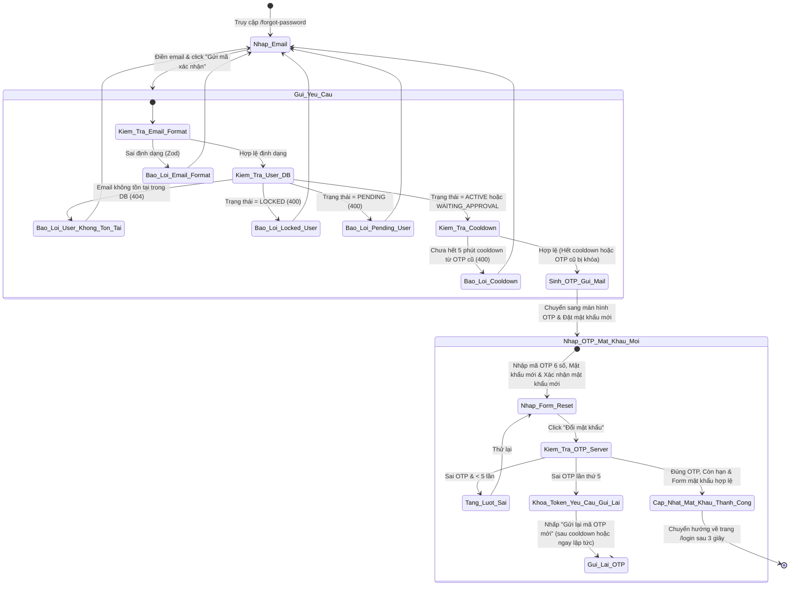

# ĐẶC TẢ YÊU CẦU & THIẾT KẾ CHI TIẾT: UC06 - QUÊN MẬT KHẨU (FORGOT PASSWORD)

## PHẦN 1: ĐẶC TẢ NGHIỆP VỤ (REPORT 3)

### 2.2.3 Business Workflow (Luồng nghiệp vụ)

#### Luồng nghiệp vụ 3 bước chi tiết (3-Step Business Flow):
* **Bước 1 - Nhập Email**: Người dùng chưa đăng nhập nhập địa chỉ email đã đăng ký tại `/forgot-password`.
* **Bước 2 - Gửi yêu cầu & Xác nhận mã OTP**: Người dùng click "Gửi mã xác nhận". Hệ thống kiểm duyệt tài khoản (nếu LOCKED/PENDING thì chặn, kiểm tra 5 phút cooldown). Nếu hợp lệ, vô hiệu hóa token cũ, sinh OTP 6 chữ số ngẫu nhiên, gửi email HTML và chuyển người dùng sang form nhập OTP. Người dùng nhập OTP 6 chữ số và click **"Xác nhận mã OTP"** để xác thực. Backend xác minh OTP (nếu sai thì tăng failedAttempts và báo số lượt thử còn lại, tối đa 5 lần). Nếu mã OTP đúng và còn hiệu lực, Client mới cho phép chuyển tiếp sang Bước 3.
* **Bước 3 - Thiết lập mật khẩu mới**: Giao diện hiển thị các trường nhập **Mật khẩu mới** và **Xác nhận mật khẩu mới**. Người dùng nhập mật khẩu mới và click "Đổi mật khẩu". Backend kiểm duyệt định dạng mật khẩu, mã hóa BCrypt, lưu đè mật khẩu của người dùng, đánh dấu token OTP đã sử dụng (`used = true`), và phản hồi thành công.
* **Bước 4 - Hoàn thành**: Giao diện hiển thị thông báo thành công màu xanh lá pastel bắt mắt và tự động điều hướng người dùng quay trở lại trang `/login` sau 3 giây.

---

### 3.2 Quản Lý Tài Khoản

#### 3.2.2 Khôi phục mật khẩu tài khoản (Forgot Password)

**Function trigger**:
*   **Navigation path**: Nhấp nút "Forgot password?" tại trang `/login` dẫn tới `/forgot-password`.
*   **Timing Frequency**: On demand (bất cứ khi nào người dùng quên mật khẩu và có nhu cầu thiết lập lại mật khẩu).

**Function description**:
*   **Actors/Roles**: Tất cả người dùng chưa đăng nhập (Khách viếng thăm).
*   **Purpose**: Cho phép người dùng khôi phục và thiết lập mật khẩu mới của tài khoản qua xác thực mã OTP gửi về hòm thư điện tử.
*   **Interface**:
    *   **Màn hình Bước 1 (Nhập Email):** Chứa trường nhập Email, Nút "Gửi mã xác nhận" và nút quay về đăng nhập.
    *   **Màn hình Bước 2 (Xác thực OTP):** Chứa ô nhập mã OTP 6 số (monospace), nút **"Xác nhận mã OTP"**, nút quay lại và đếm ngược cooldown 5 phút.
    *   **Màn hình Bước 3 (Mật khẩu mới):** Chứa ô nhập Mật khẩu mới (có mắt ẩn/hiện), ô nhập Xác nhận mật khẩu mới (có mắt ẩn/hiện) và nút "Đổi mật khẩu".

**Data processing**:
1.  **Gửi yêu cầu:** Gọi `POST /api/v1/auth/forgot-password` gửi JSON chứa `{ "email": "..." }`. Hệ thống kiểm tra điều kiện bảo mật, sinh OTP lưu vào DB và gửi email HTML.
2.  **Xác minh OTP:** Gọi `POST /api/v1/auth/verify-reset-otp` gửi JSON chứa `{ "email": "...", "token": "..." }`. Hệ thống kiểm duyệt OTP, nếu sai tăng failedAttempts, nếu đúng và hợp lệ thì phản hồi 200 OK.
3.  **Đặt lại mật khẩu:** Gọi `POST /api/v1/auth/reset-password` gửi JSON chứa `{ "email": "...", "token": "...", "newPassword": "..." }`. Hệ thống kiểm duyệt OTP, cập nhật cột `password_hash` và phản hồi 200 OK.

**Screen layout**:
*   *Figure 1: Màn hình nhập Email khôi phục mật khẩu*
*   *Figure 2: Màn hình nhập mã OTP và thiết lập mật khẩu mới*

**Function details**:
*   **Data**:
    *   `email` (String, định dạng email, tối đa 255 ký tự)
    *   `token` (String, 6 chữ số, duy nhất)
    *   `newPassword` (String, 8-100 ký tự, chứa cả chữ cái và chữ số)
*   **Validation**:
    *   Phía Client: Zod schema kiểm tra bắt buộc các trường, định dạng email hợp lệ, độ phức tạp mật khẩu mới, mật khẩu xác nhận khớp mật khẩu mới.
    *   Phía Server: JSR-380 validation (`@NotBlank`, `@Email`, `@Size`, `@Pattern`) trên `ForgotPasswordRequest` and `ResetPasswordRequest` DTOs.
*   **Business rules**:
    *   **Quy tắc theo trạng thái tài khoản:**
        *   Tài khoản ở trạng thái `ACTIVE` và `WAITING_APPROVAL` được phép đổi mật khẩu.
        *   Tài khoản ở trạng thái `PENDING` bị chặn khôi phục mật khẩu (báo lỗi: *"Tài khoản của bạn chưa được xác thực email. Vui lòng kiểm tra hòm thư để xác thực tài khoản hoặc thực hiện đăng ký lại."*).
        *   Tài khoản ở trạng thái `LOCKED` bị chặn khôi phục mật khẩu (báo lỗi: *"Tài khoản của bạn đã bị khóa. Vui lòng liên hệ quản trị viên."*).
    *   **Quy tắc tài khoản Google OAuth:** Tài khoản đăng ký bằng Google (chưa có mật khẩu cục bộ) vẫn được phép đặt mật khẩu mới thông qua luồng này, cho phép họ đăng nhập bằng cả 2 hình thức sau đó.
    *   **Quy tắc OTP Cooldown:** Khoảng cách thời gian tối thiểu giữa 2 lần yêu cầu gửi OTP là 5 phút. Quy tắc này bị bỏ qua nếu mã OTP cũ đã bị khóa do nhập sai quá 5 lần.
    *   **Giới hạn nhập sai (Retry limit):** Tối đa 5 lần thử sai cho một token OTP. Vượt quá 5 lần, token bị vô hiệu hóa lập tức và buộc người dùng phải gửi lại mã mới.
*   **Error Handling**:
    *   Trả về 404 Not Found khi email không tồn tại trên hệ thống.
    *   Trả về 400 Bad Request kèm chi tiết lỗi định dạng validation DTO.
    *   Trả về 400 Bad Request khi tài khoản bị khóa, chưa xác thực, OTP sai, OTP hết hạn hoặc bị khóa.
*   **Normal case**: Người dùng nhập email hợp lệ -> nhận mã OTP -> nhập đúng OTP và mật khẩu mới hợp lệ -> Đổi mật khẩu thành công và điều hướng về trang đăng nhập.
*   **Abnormal case**: Lỗi kết nối DB hoặc lỗi dịch vụ gửi mail SMTP thất bại (hệ thống tự động in mã OTP ra Terminal backend).

---

### 5. Phụ lục Yêu cầu (Requirement Appendix)

#### 5.1 Quy tắc Nghiệp vụ (Business Rules)

| ID | Định nghĩa Quy tắc (Rule Definition) |
| :--- | :--- |
| BR-FORGOT-01 | Thời hạn hiệu lực của mã OTP đặt lại mật khẩu (`PASSWORD_RESET`) là 5 phút (300 giây). |
| BR-FORGOT-02 | Giới hạn nhập sai OTP khôi phục mật khẩu tối đa là 5 lần. Vượt quá giới hạn, token sẽ bị vô hiệu hóa lập tức. |
| BR-FORGOT-03 | Thời gian cooldown tối thiểu giữa 2 lần gửi OTP đặt lại mật khẩu là 5 phút. Bypass qua cooldown nếu mã cũ bị khóa do nhập sai quá 5 lần. |
| BR-FORGOT-04 | Tài khoản liên kết mạng xã hội (Google) được thiết lập mật khẩu cục bộ thông qua forgot password. |
| BR-FORGOT-05 | Chặn yêu cầu khôi phục mật khẩu của tài khoản `PENDING` và `LOCKED` để bảo vệ an ninh thông tin. |

#### 5.3 Danh sách Thông điệp Ứng dụng (Application Messages List)

| # | Mã thông điệp | Loại thông điệp | Ngữ cảnh | Nội dung hiển thị |
| :--- | :--- | :--- | :--- | :--- |
| 1 | MSG-FORGOT-01 | Inline error | Trường thông tin bắt buộc bị để trống | {Trường} không được để trống |
| 2 | MSG-FORGOT-02 | Inline error | Mật khẩu mới quá yếu | Mật khẩu phải có độ dài từ 8 đến 100 ký tự và chứa ít nhất 1 chữ cái, 1 chữ số |
| 3 | MSG-FORGOT-03 | Inline error | Xác nhận mật khẩu không khớp | Mật khẩu xác nhận không trùng khớp |
| 4 | MSG-FORGOT-04 | Toast/Alert error | Email không tồn tại | Không tìm thấy tài khoản người dùng với email: {email_address} |
| 5 | MSG-FORGOT-05 | Toast/Alert error | Tài khoản bị LOCKED | Tài khoản của bạn đã bị khóa. Vui lòng liên hệ quản trị viên. |
| 6 | MSG-FORGOT-06 | Toast/Alert error | Tài khoản ở PENDING | Tài khoản của bạn chưa được xác thực email. Vui lòng kiểm tra hòm thư để xác thực tài khoản hoặc thực hiện đăng ký lại. |
| 7 | MSG-FORGOT-07 | Toast/Alert error | Gửi OTP chưa qua 5 phút cooldown | Vui lòng đợi {X} phút {Y} giây trước khi yêu cầu gửi lại mã OTP mới. |
| 8 | MSG-FORGOT-08 | Toast/Alert error | Nhập sai OTP lần 1-4 | Mã xác thực không chính xác. Bạn còn {X} lần thử. |
| 9 | MSG-FORGOT-09 | Toast/Alert error | Nhập sai OTP lần thứ 5 | Mã xác thực đã bị khóa do nhập sai quá 5 lần. Vui lòng yêu cầu gửi lại mã mới. |
| 10| MSG-FORGOT-10 | Toast/Alert error | OTP đã được sử dụng trước đó | Mã xác thực này đã được sử dụng trước đó |
| 11| MSG-FORGOT-11 | Toast/Alert error | OTP đã hết hiệu lực | Mã xác thực đã hết hạn |
| 12| MSG-FORGOT-12 | Toast/Alert success| Khôi phục mật khẩu thành công | Đặt lại mật khẩu thành công! Vui lòng đăng nhập bằng mật khẩu mới. |

---

## PHẦN 2: THIẾT KẾ CHI TIẾT (REPORT 4)

### 3. Thiết kế chi tiết

#### 3.1 Chức năng Khôi phục mật khẩu (ForgotPassword)

##### 3.1.1 Class Diagram (Sơ đồ Lớp)

```mermaid
classDiagram
    %% --- TẦNG CONTROLLER ---
    class AuthController {
        -AuthService authService
        +forgotPassword(ForgotPasswordRequest) ResponseEntity
        +verifyResetOtp(VerifyResetOtpRequest) ResponseEntity
        +resetPassword(ResetPasswordRequest) ResponseEntity
    }

    %% --- TẦNG DTO ---
    class ForgotPasswordRequest {
        +String email
    }

    class VerifyResetOtpRequest {
        +String email
        +String token
    }

    class ResetPasswordRequest {
        +String email
        +String token
        +String newPassword
    }

    %% --- TẦNG SERVICE ---
    class AuthService {
        <<interface>>
        +forgotPassword(ForgotPasswordRequest) void
        +verifyResetOtp(VerifyResetOtpRequest) void
        +resetPassword(ResetPasswordRequest) void
    }

    class AuthServiceImpl {
        -UserRepository userRepository
        -UserProfileRepository userProfileRepository
        -VerificationTokenRepository tokenRepository
        -BCryptPasswordEncoder passwordEncoder
        -MailService mailService
        +forgotPassword(ForgotPasswordRequest) void
        +verifyResetOtp(VerifyResetOtpRequest) void
        +resetPassword(ResetPasswordRequest) void
    }

    class MailService {
        <<interface>>
        +sendPasswordResetEmail(String, String, String) void
    }

    class MailServiceImpl {
        -JavaMailSender mailSender
        +sendPasswordResetEmail(String, String, String) void
    }

    %% --- TẦNG REPOSITORY ---
    class UserRepository {
        <<interface>>
        +findByEmail(String) Optional
    }

    class VerificationTokenRepository {
        <<interface>>
        +findByToken(String) Optional
        +findFirstByUserAndTypeOrderByCreatedAtDesc(User, VerificationType) Optional
        +invalidateOldTokens(User, VerificationType) void
    }

    %% --- TẦNG ENTITY ---
    class User {
        +Long id
        +String email
        +String passwordHash
        +AccountStatus accountStatus
    }

    class VerificationToken {
        +Long id
        +User user
        +String token
        +VerificationType type
        +Instant expiresAt
        +boolean used
        +int failedAttempts
    }

    %% --- MỐI QUAN HỆ ---
    AuthController --> AuthService : Gọi nghiệp vụ
    AuthServiceImpl ..|> AuthService : Triển khai
    MailServiceImpl ..|> MailService : Triển khai

    AuthServiceImpl --> UserRepository : Truy vấn User
    AuthServiceImpl --> VerificationTokenRepository : Quản lý OTP
    AuthServiceImpl --> MailService : Gửi thư khôi phục
    
    VerificationToken "*" -- "1" User : Sở hữu
```

###### Mô tả chi tiết cấu trúc các lớp (Class Design Description):
* **Lớp Controller (`AuthController`)**: Tiếp nhận các yêu cầu POST khôi phục mật khẩu `/api/v1/auth/forgot-password` (gửi OTP), xác minh OTP `/api/v1/auth/verify-reset-otp`, và đặt lại mật khẩu `/api/v1/auth/reset-password`.
* **Lớp DTO (`ForgotPasswordRequest`, `VerifyResetOtpRequest`, `ResetPasswordRequest`)**: Đóng gói thông tin yêu cầu và thực hiện validate JSR-380 đầu vào trước khi chuyển tiếp vào tầng nghiệp vụ.
* **Lớp Service (`AuthServiceImpl`, `MailServiceImpl`)**:
  * `AuthServiceImpl` thực thi logic nghiệp vụ: kiểm duyệt trạng thái tài khoản, kiểm tra cooldown gửi OTP, sinh OTP, xác minh OTP, băm mật khẩu mới và lưu vào DB.
  * `MailServiceImpl` tạo template HTML và gửi email chứa OTP bằng Gmail SMTP hoặc in ra console.
* **Lớp Repository & Entity (`UserRepository`, `VerificationTokenRepository`, `User`, `VerificationToken`)**: Thực hiện lưu trữ, truy xuất và cập nhật trạng thái của các thực thể liên quan tới người dùng và mã OTP.

##### 3.1.2 Sequence Diagram (Sơ đồ Tuần tự)

```mermaid
sequenceDiagram
    autonumber
    actor Client as Client (React Frontend)
    participant Ctrl as AuthController
    participant Service as AuthServiceImpl
    participant UserRepo as UserRepository
    participant TokenRepo as VerificationTokenRepository
    participant Mail as MailServiceImpl
    participant DB as PostgreSQL

    %% --- GỬI YÊU CẦU GỬI OTP ---
    Note over Client, Ctrl: TIẾN TRÌNH 1: GỬI YÊU CẦU QUÊN MẬT KHẨU (POST /auth/forgot-password)
    Client->>Ctrl: HTTP POST /api/v1/auth/forgot-password (ForgotPasswordRequest DTO)
    
    alt Luồng lỗi 1: Định dạng email không hợp lệ (Validation)
        Ctrl-->>Client: HTTP 400 Bad Request (ApiResponse lỗi validation)
    else Dữ liệu hợp lệ
        Ctrl->>Service: Gọi forgotPassword(ForgotPasswordRequest)
        Service->>UserRepo: findByEmail(email)
        UserRepo->>DB: SELECT * FROM users WHERE email = ?
        DB-->>UserRepo: Trả về kết quả
        UserRepo-->>Service: Trả về Optional<User>
        
        alt Luồng lỗi 2: Email không tồn tại trong hệ thống
            Service-->>Ctrl: Throw ResourceNotFoundException("Không tìm thấy tài khoản...")
            Ctrl-->>Client: HTTP 404 Not Found
        else Email tồn tại
            alt Luồng lỗi 3: Tài khoản ở trạng thái LOCKED
                Service-->>Ctrl: Throw BadRequestException("Tài khoản của bạn đã bị khóa...")
                Ctrl-->>Client: HTTP 400 Bad Request
            else Luồng lỗi 4: Tài khoản ở trạng thái PENDING
                Service-->>Ctrl: Throw BadRequestException("Tài khoản của bạn chưa được xác thực...")
                Ctrl-->>Client: HTTP 400 Bad Request
            else Tài khoản hợp lệ (ACTIVE hoặc WAITING_APPROVAL)
                Service->>TokenRepo: findFirstByUserAndTypeOrderByCreatedAtDesc(user, PASSWORD_RESET)
                TokenRepo-->>Service: Trả về VerificationToken gần nhất (nếu có)
                
                alt Luồng lỗi 5: Chưa hết 5 phút cooldown của mã OTP trước
                    Note over Service: Thời gian tạo < 5 phút và chưa bị khóa
                    Service-->>Ctrl: Throw BadRequestException("Vui lòng đợi X phút Y giây...")
                    Ctrl-->>Client: HTTP 400 Bad Request
                else Hợp lệ
                    Service->>TokenRepo: invalidateOldTokens(user, PASSWORD_RESET)
                    TokenRepo->>DB: UPDATE verification_tokens SET used = true WHERE user = ?
                    
                    Note over Service: Sinh ngẫu nhiên mã OTP 6 số mới
                    Service->>TokenRepo: save(verificationToken)
                    TokenRepo->>DB: INSERT INTO verification_tokens
                    
                    Service->>Mail: sendPasswordResetEmail(email, token, name)
                    Note over Mail: Gửi thư HTML đặt lại mật khẩu trong nền
                    
                    Service-->>Ctrl: Thành công
                    Ctrl-->>Client: HTTP 200 OK (ApiResponse hướng dẫn kiểm tra email)
                end
            end
        end
    end

    %% --- XÁC MINH MÃ OTP ---
    Note over Client, Ctrl: TIẾN TRÌNH 2: XÁC MINH MÃ OTP (POST /auth/verify-reset-otp)
    Client->>Ctrl: HTTP POST /api/v1/auth/verify-reset-otp (VerifyResetOtpRequest DTO)
    
    alt Luồng lỗi 6: Sai định dạng OTP (Validation)
        Ctrl-->>Client: HTTP 400 Bad Request
    else Dữ liệu hợp lệ
        Ctrl->>Service: Gọi verifyResetOtp(VerifyResetOtpRequest)
        Service->>UserRepo: findByEmail(email)
        UserRepo-->>Service: Trả về User
        Service->>TokenRepo: findFirstByUserAndTypeOrderByCreatedAtDesc(user, PASSWORD_RESET)
        TokenRepo-->>Service: Trả về VerificationToken
        
        alt Luồng lỗi 7: OTP đã được sử dụng trước đó
            Service-->>Ctrl: Throw BadRequestException("Mã xác thực này đã được sử dụng...")
            Ctrl-->>Client: HTTP 400 Bad Request
        else Luồng lỗi 8: OTP đã hết hạn
            Service-->>Ctrl: Throw BadRequestException("Mã xác thực đã hết hạn")
            Ctrl-->>Client: HTTP 400 Bad Request
        else Luồng lỗi 9: OTP bị khóa do nhập sai quá 5 lần
            Service-->>Ctrl: Throw BadRequestException("Mã xác thực đã bị khóa do nhập sai...")
            Ctrl-->>Client: HTTP 400 Bad Request
        else So sánh OTP
            alt Luồng lỗi 10: Mã OTP nhập vào không khớp
                Service->>TokenRepo: Cập nhật failedAttempts = failedAttempts + 1
                TokenRepo->>DB: UPDATE verification_tokens
                
                alt Nhập sai < 5 lần
                    Service-->>Ctrl: Throw BadRequestException("Mã xác thực không chính xác. Bạn còn X lần thử.")
                    Ctrl-->>Client: HTTP 400 Bad Request
                else Nhập sai lần thứ 5
                    Service-->>Ctrl: Throw BadRequestException("Mã xác thực đã bị khóa do nhập sai...")
                    Ctrl-->>Client: HTTP 400 Bad Request
                end
            else OTP trùng khớp
                Service-->>Ctrl: Thành công
                Ctrl-->>Client: HTTP 200 OK ("Mã OTP hợp lệ! Vui lòng thiết lập mật khẩu mới.")
            end
        end
    end

    %% --- ĐẶT LẠI MẬT KHẨU MỚI ---
    Note over Client, Ctrl: TIẾN TRÌNH 3: ĐẶT LẠI MẬT KHẨU MỚI (POST /auth/reset-password)
    Client->>Ctrl: HTTP POST /api/v1/auth/reset-password (ResetPasswordRequest DTO)
    
    alt Luồng lỗi 11: Mật khẩu mới yếu hoặc dữ liệu thiếu (Validation)
        Ctrl-->>Client: HTTP 400 Bad Request (ApiResponse lỗi validation)
    else Dữ liệu hợp lệ
        Ctrl->>Service: Gọi resetPassword(ResetPasswordRequest)
        Service->>UserRepo: findByEmail(email)
        UserRepo-->>Service: Trả về User
        Service->>TokenRepo: findFirstByUserAndTypeOrderByCreatedAtDesc(user, PASSWORD_RESET)
        TokenRepo-->>Service: Trả về VerificationToken
        
        alt Luồng lỗi 12: Kiểm tra OTP (nếu đã bị quá hạn hoặc bị thay đổi giữa chừng)
            Service-->>Ctrl: Throw BadRequestException(...)
            Ctrl-->>Client: HTTP 400 Bad Request
        else OTP hợp lệ
            Service->>TokenRepo: Cập nhật used = true
            TokenRepo->>DB: UPDATE verification_tokens SET used = true
            
            Note over Service: Mã hóa mật khẩu mới bằng BCrypt
            Service->>UserRepo: save(user)
            UserRepo->>DB: UPDATE users SET password_hash = ?
            DB-->>UserRepo: Thành công
            
            Service-->>Ctrl: Đặt lại mật khẩu thành công
            Ctrl-->>Client: HTTP 200 OK (ApiResponse báo đặt lại thành công)
        end
    end
```

###### Mô tả chi tiết luồng xử lý bằng chữ (Sequence Flow Description):

1.  **TIẾN TRÌNH 1: GỬI YÊU CẦU QUÊN MẬT KHẨU (Gửi OTP)**
    *   **Gửi DDTO:** Client gửi POST đến `/api/v1/auth/forgot-password` với body chứa email.
    *   **Kiểm tra tính tồn tại:** Backend kiểm tra email trong DB. Nếu không tìm thấy, trả về 404 Not Found.
    *   **Kiểm tra tính an toàn:** Nếu tài khoản là `LOCKED` hoặc `PENDING`, trả về 400 Bad Request kèm thông báo lỗi cụ thể để ngăn chặn truy cập.
    *   **Kiểm tra cooldown:** Nếu OTP khôi phục mật khẩu trước đó được tạo chưa quá 5 phút và chưa bị khóa, ném lỗi 400 Bad Request báo người dùng phải chờ.
    *   **Vô hiệu hóa & Sinh OTP mới:** Hệ thống vô hiệu hóa các mã OTP quên mật khẩu cũ (`used = true`), tạo OTP 6 số mới và gửi email khôi phục mật khẩu. Trả về 200 OK.

2.  **TIẾN TRÌNH 2: XÁC MINH MÃ OTP**
    *   **Gửi DTO:** Client gửi POST đến `/api/v1/auth/verify-reset-otp` chứa email và OTP.
    *   **Kiểm duyệt OTP:** Backend lấy OTP khôi phục mật khẩu mới nhất, kiểm duyệt hiệu lực (hết hạn/đã dùng/bị khóa). Nếu sai, tăng failedAttempts thêm 1. Nếu đạt 5 lần, khóa token vĩnh viễn. Nếu đúng, trả về 200 OK để Client chuyển sang form nhập mật khẩu mới.

3.  **TIẾN TRÌNH 3: ĐẶT LẠI MẬT KHẨU MỚI**
    *   **Gửi DTO:** Client gửi POST đến `/api/v1/auth/reset-password` chứa email, OTP và mật khẩu mới.
    *   **Cập nhật mật khẩu:** Backend xác thực OTP một lần nữa, đánh dấu token `used = true`, băm mật khẩu mới bằng BCrypt, cập nhật vào DB và trả về 200 OK.
