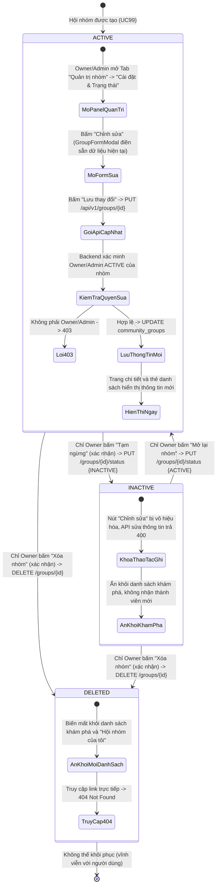
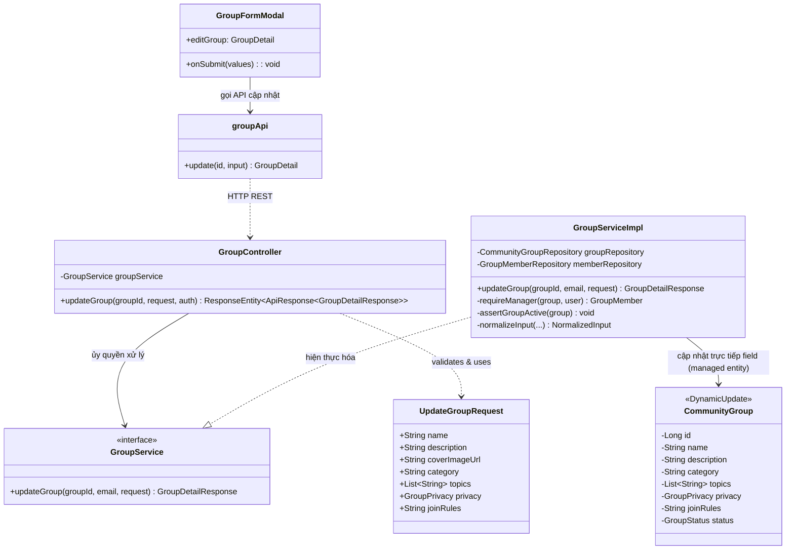
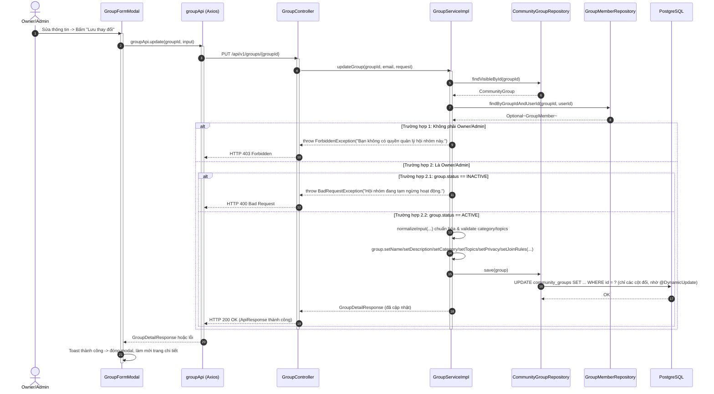
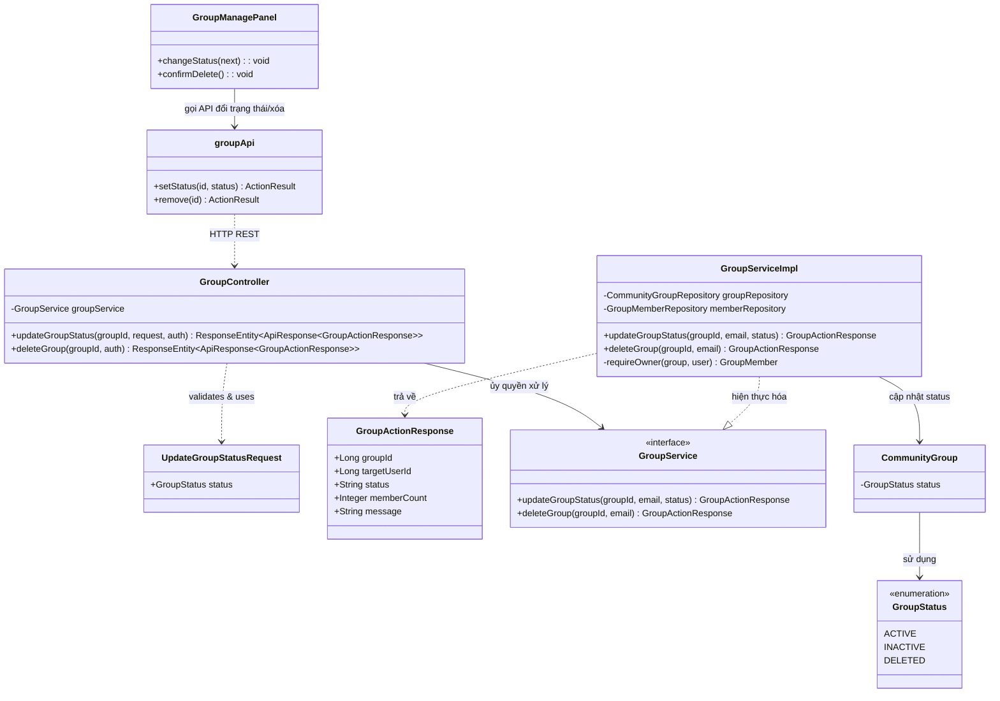
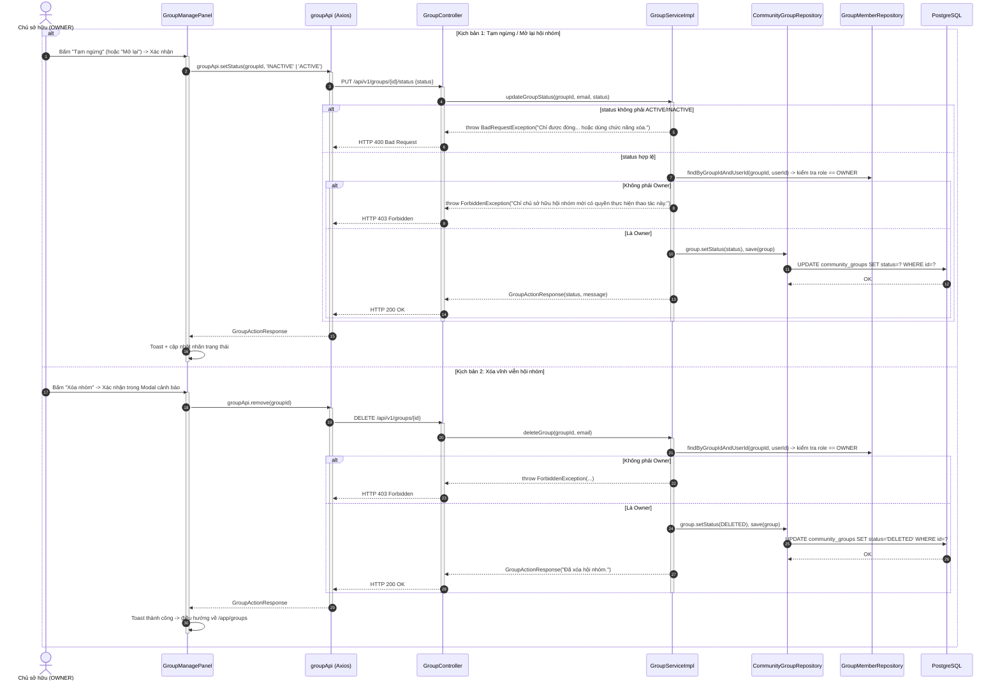

# ĐẶC TẢ YÊU CẦU & THIẾT KẾ CHI TIẾT: UC100 - QUẢN LÝ HỘI NHÓM: CẬP NHẬT THÔNG TIN & TRẠNG THÁI (MANAGE COMMUNITY GROUP)

> **Phạm vi UC (gộp)**: UC này gộp *Cập nhật thông tin hội nhóm* và *Quản lý trạng thái hội nhóm: Đóng / Mở lại / Xóa*. Cả hai đều là thao tác quản trị trên **chính bản ghi hội nhóm** (`community_groups`), cùng xuất phát từ một màn hình (Tab "Quản trị nhóm" → "Cài đặt & Trạng thái" của `GroupManagePanel`) và liên hệ chặt chẽ qua trạng thái nhóm: chỉ sửa được thông tin khi nhóm đang `ACTIVE`. Mã UC của tài liệu này là **UC100**.

## PHẦN 1: ĐẶC TẢ NGHIỆP VỤ (REPORT 3)

### 2.2.3 Business Workflow (Luồng nghiệp vụ)



#### Mô tả chi tiết luồng xử lý bằng chữ (Business Step Description):
* **Bước 1 - Khởi đầu**: Owner hoặc Admin mở Tab "Quản trị nhóm" ở trang chi tiết hội nhóm và chọn sub-tab "Cài đặt & Trạng thái" (sub-tab còn lại là "Yêu cầu tham gia" — thuộc UC102). Tại đây có ba khối thao tác: **"Chỉnh sửa thông tin hội nhóm"** (Owner và Admin), **"Tạm ngừng / Mở lại hội nhóm"** và **"Xóa vĩnh viễn hội nhóm"** (chỉ Owner thấy; Admin không thấy và không gọi được các API này).
* **Bước 2 - Các bước chuyển tiếp**:
  * **Cập nhật thông tin** (mục 3.2.1): form `GroupFormModal` ở chế độ sửa điền sẵn mọi trường; người dùng đổi tên, mô tả, danh mục, loại nhóm (Công khai/Riêng tư), chủ đề, quy định tham gia, ảnh nhóm; Backend xác minh Owner/Admin, yêu cầu nhóm đang `ACTIVE`, chuẩn hóa bằng đúng `normalizeInput` của UC99 và **thay thế toàn bộ** các trường.
  * **Đóng tạm** (ACTIVE → INACTIVE): sau hộp thoại xác nhận, Owner gọi `PUT /api/v1/groups/{id}/status` với `INACTIVE`. Dữ liệu được giữ nguyên; nhóm bị ẩn khỏi danh sách khám phá, không nhận thành viên/yêu cầu mới và khóa mọi thao tác ghi (đăng bài, thích, bình luận, ghim, sửa thông tin).
  * **Mở lại** (INACTIVE → ACTIVE): Owner bấm "Mở lại nhóm" (không cần xác nhận vì không phá hủy dữ liệu); nhóm hoạt động trở lại ngay.
  * **Xóa** (ACTIVE hoặc INACTIVE → DELETED): sau hộp thoại xác nhận nêu rõ không thể hoàn tác, Owner gọi `DELETE /api/v1/groups/{id}`. Đây là xóa mềm (`status = DELETED`); nhóm biến mất khỏi mọi danh sách và không truy cập lại được (UC98 trả 404).
* **Bước 3 - Kết thúc**: Thông tin mới/nhãn trạng thái mới phản ánh ngay trên trang chi tiết và thẻ ở danh sách (UC97). Sau khi xóa, giao diện điều hướng về trang danh sách Hội nhóm.

---

### 3.2 Module Hội nhóm Cộng đồng (Community Groups)

#### 3.2.1 Cập nhật Thông tin Hội nhóm (UC100 - Update Community Group Profile)

**Function trigger**:
* **Navigation path**: `/app/groups/{id}` → Tab "Quản trị nhóm" → "Cài đặt & Trạng thái" → nút "Chỉnh sửa".
* **Timing Frequency**: On demand, khi Owner/Admin cần cập nhật thông tin giới thiệu hoặc đổi loại hội nhóm.

**Function description**:
* **Actors/Roles**: Owner và Admin của chính hội nhóm đó. Member thường và người ngoài nhóm không có quyền.
* **Purpose**: Giữ thông tin hội nhóm luôn chính xác, phản ánh đúng định hướng hoạt động hiện tại của cộng đồng.
* **Interface**: Tái sử dụng `GroupFormModal` giống UC99, khác ở chỗ các trường được điền sẵn và nút hành động ghi "Lưu thay đổi" thay vì "Tạo hội nhóm"; nút "Chỉnh sửa" bị vô hiệu hóa khi hội nhóm đang `INACTIVE`.

**Data processing**:
* `GroupServiceImpl.updateGroup`: xác thực `requireManager` (Owner hoặc Admin), `assertGroupActive`, chuẩn hóa dữ liệu, gọi loạt setter trên entity đang managed rồi `save` — Hibernate phát sinh đúng 1 câu `UPDATE` nhờ `@DynamicUpdate` trên `CommunityGroup`.

**Screen layout**:
* Giống hệt bố cục form tạo mới (`GroupFormModal.tsx`), chỉ khác tiêu đề modal và dữ liệu khởi tạo (`defaultValues` lấy từ `editGroup`).

**Function details**:
* **Data**: Giống hệt `CreateGroupRequest` (xem UC99) nhưng không có trường nào được giữ nguyên ngầm định — Client luôn phải gửi đủ toàn bộ các trường hiện hành.
* **Validation**: Áp dụng lại đúng các ràng buộc của UC99 (độ dài, số lượng chủ đề, danh mục hợp lệ).
* **Business rules**: Xem mục 5.1 (BR-100-01 → BR-100-03).
* **Error Handling**:
  * `403 Forbidden`: Member thường hoặc người ngoài nhóm cố sửa → *"Bạn không có quyền quản lý hội nhóm này."*
  * `400 Bad Request`: Hội nhóm đang `INACTIVE` → *"Hội nhóm đang tạm ngừng hoạt động."*
* **Normal case**: Lưu thành công, trả về `GroupDetailResponse` mới nhất, modal đóng lại và trang chi tiết tự làm mới.
* **Abnormal case**: Admin (không phải Owner) sửa thông tin cơ bản vẫn được phép (không giới hạn thêm riêng cho Admin ở chức năng này — khác với đóng/mở/xóa nhóm (mục 3.2.2) và phân quyền Admin (UC102) vốn chỉ dành cho Owner).

---

#### 3.2.2 Quản lý Trạng thái Hội nhóm: Đóng / Mở lại / Xóa (UC100 - Manage Group Status)

**Function trigger**:
* **Navigation path**: `/app/groups/{id}` → Tab "Quản trị nhóm" → "Cài đặt & Trạng thái".
* **Timing Frequency**: On demand, khi Owner cần tạm dừng hoạt động cộng đồng hoặc giải thể vĩnh viễn.

**Function description**:
* **Actors/Roles**: Chỉ **Owner** của hội nhóm. Admin và Member không có quyền (kể cả Admin cũng không thấy nút này trên giao diện).
* **Purpose**: Cho phép Owner kiểm soát vòng đời hội nhóm — tạm ngừng khi cần nghỉ hoạt động mà không mất dữ liệu, hoặc giải thể hoàn toàn khi không còn nhu cầu duy trì.
* **Interface**:
  * Khối "Tạm ngừng hội nhóm" / "Mở lại hội nhóm" (đổi nhãn và icon theo trạng thái hiện tại) với mô tả ngắn hậu quả của thao tác.
  * Khối "Xóa vĩnh viễn hội nhóm" tô màu cảnh báo (đỏ) riêng biệt; các nút có cùng độ rộng cố định để bố cục ổn định khi đổi nhãn.
  * 2 hộp thoại xác nhận riêng: xác nhận tạm ngừng, xác nhận xóa (nêu rõ "không thể hoàn tác").
  * Nhãn "Tạm ngừng" xuất hiện trên thẻ hội nhóm, cạnh tên hội nhóm và banner cảnh báo toàn trang ("Hội nhóm đang tạm ngừng hoạt động và không nhận thêm thành viên mới.") khi `status = INACTIVE` (dùng chung với UC98).

**Data processing**:
* `GroupServiceImpl.updateGroupStatus`: chỉ chấp nhận giá trị đích `ACTIVE` hoặc `INACTIVE` (không cho phép set `DELETED` qua endpoint này — xóa phải qua endpoint `DELETE` riêng); xác thực `requireOwner`; nếu trạng thái mới khác trạng thái hiện tại mới ghi `UPDATE`.
* `GroupServiceImpl.deleteGroup`: xác thực `requireOwner`; set `status = DELETED` — không xóa vật lý bản ghi (soft delete), nhờ đó `member_count`, lịch sử bài viết vẫn được giữ nguyên trong CSDL cho mục đích đối soát/khôi phục thủ công nếu cần ở tầng vận hành.

**Screen layout**:
* Nằm trong `GroupManagePanel.tsx`, Tab con "Cài đặt & Trạng thái", mỗi thao tác là một `SettingRow` riêng biệt.

**Function details**:
* **Data**: `status` (Enum, bắt buộc, chỉ nhận `ACTIVE`/`INACTIVE` cho API đổi trạng thái); endpoint xóa không cần body.
* **Validation**: Giá trị `status` gửi lên ngoài `ACTIVE`/`INACTIVE` (vd gửi thẳng `DELETED`) bị từ chối ở tầng Service.
* **Business rules**: Xem mục 5.1 (BR-100-04 → BR-100-07).
* **Error Handling**:
  * `403 Forbidden`: Admin hoặc Member gọi API → *"Chỉ chủ sở hữu hội nhóm mới có quyền thực hiện thao tác này."*
  * `400 Bad Request`: Gửi `status` khác `ACTIVE`/`INACTIVE` → *"Chỉ được đóng (INACTIVE) hoặc mở lại (ACTIVE) hội nhóm. Để xóa hãy dùng chức năng xóa hội nhóm."*
* **Normal case**: Đổi trạng thái hoặc xóa thành công trả về `GroupActionResponse` kèm thông điệp phù hợp từng thao tác.
* **Abnormal case**: Owner bấm "Tạm ngừng" khi nhóm đã `INACTIVE` (do mở 2 tab) — Service kiểm tra `status` hiện tại khác giá trị đích mới ghi DB, tránh ghi `UPDATE` thừa nhưng vẫn trả kết quả thành công nhất quán (idempotent).

---

### 5. Requirement Appendix (Phụ lục Yêu cầu)

#### 5.1 Business Rules (Quy tắc Nghiệp vụ)

| ID | Định nghĩa Quy tắc (Rule Definition) |
| :--- | :--- |
| **BR-100-01** | Cả Owner và Admin của hội nhóm đều có quyền chỉnh sửa thông tin cơ bản (tên, mô tả, danh mục, chủ đề, loại nhóm, quy định, ảnh nhóm). |
| **BR-100-02** | Chỉ chỉnh sửa được thông tin khi hội nhóm đang ở trạng thái `ACTIVE`; hội nhóm `INACTIVE` phải được mở lại trước. |
| **BR-100-03** | Mỗi lần cập nhật thay thế toàn bộ các trường thông tin cơ bản bằng giá trị mới, áp dụng lại đầy đủ các ràng buộc như khi tạo mới hội nhóm (UC99). |
| **BR-100-04** | Chỉ Chủ sở hữu (`OWNER`) mới có quyền đóng, mở lại hoặc xóa hội nhóm; Quản trị viên (`ADMIN`) không có quyền này dù có thể quản lý nhiều nội dung khác trong nhóm. |
| **BR-100-05** | Hội nhóm `INACTIVE` (tạm ngừng) bị ẩn khỏi danh sách khám phá công khai, không nhận thành viên/yêu cầu tham gia mới, nhưng vẫn giữ nguyên toàn bộ dữ liệu và vẫn hiển thị trong tab "Hội nhóm của tôi" của các thành viên hiện có. |
| **BR-100-06** | Xóa hội nhóm là thao tác xóa mềm (chuyển `status = DELETED`), không xóa vật lý dữ liệu; hội nhóm đã xóa không thể truy cập lại qua bất kỳ đường dẫn nào và không có chức năng khôi phục cho người dùng. |
| **BR-100-07** | API đổi trạng thái (`PUT .../status`) chỉ chấp nhận hai giá trị đích `ACTIVE` và `INACTIVE`; muốn chuyển sang `DELETED` bắt buộc gọi đúng endpoint xóa riêng. |

#### 5.2 Common Requirements (Yêu cầu Chung)
* Form chỉnh sửa điền sẵn đúng dữ liệu hiện tại; cập nhật thành công được thông báo bằng toast và phản ánh ngay trên giao diện, không cần tải lại trang.
* Thao tác tạm ngừng và xóa đều có hộp thoại xác nhận; riêng xóa phải nêu rõ không thể hoàn tác.
* Trạng thái đặc biệt của hội nhóm (tạm ngừng) hiển thị nhất quán ở mọi nơi: thẻ danh sách, trang chi tiết, banner cảnh báo.

#### 5.3 Application Messages List (Danh sách Thông điệp Ứng dụng)

| # | Mã thông điệp | Loại thông điệp | Ngữ cảnh | Nội dung hiển thị |
| :--- | :--- | :--- | :--- | :--- |
| 1 | `MSG-GRP-17` | Toast message | Cập nhật hội nhóm thành công | Đã cập nhật hội nhóm thành công! |
| 2 | `MSG-GRP-18` | Toast message (error) | Không có quyền chỉnh sửa | Bạn không có quyền quản lý hội nhóm này. |
| 3 | `MSG-GRP-19` | Toast message (error) | Hội nhóm đang tạm ngừng | Hội nhóm đang tạm ngừng hoạt động. |
| 4 | `MSG-GRP-20` | Toast message | Tạm ngừng hội nhóm thành công | Đã đóng hội nhóm. |
| 5 | `MSG-GRP-21` | Toast message | Mở lại hội nhóm thành công | Đã mở lại hội nhóm. |
| 6 | `MSG-GRP-22` | Toast message | Xóa hội nhóm thành công | Đã xóa hội nhóm. |
| 7 | `MSG-GRP-23` | Modal confirm | Xác nhận tạm ngừng | Tạm ẩn nhóm và ngừng nhận thành viên mới. Bạn có thể mở lại bất kỳ lúc nào. |
| 8 | `MSG-GRP-24` | Modal confirm | Xác nhận xóa vĩnh viễn | Bạn có chắc chắn muốn xóa nhóm {Tên}? Thao tác này không thể hoàn tác. |
| 9 | `MSG-GRP-25` | Toast message (error) | Không phải Owner | Chỉ chủ sở hữu hội nhóm mới có quyền thực hiện thao tác này. |

---

## PHẦN 2: THIẾT KẾ CHI TIẾT (REPORT 4)

### 3. Detail Design (Thiết kế chi tiết)

#### 3.1 Cập nhật Thông tin Hội nhóm (UC100 - Update Community Group Profile)

##### 3.1.1 Class Diagram (Sơ đồ Lớp)



###### Mô tả chi tiết cấu trúc các lớp (Class Design Description):
* **Lớp Controller**: `GroupController.updateGroup` nhận `groupId` trên đường dẫn, `UpdateGroupRequest` đã `@Valid`, yêu cầu JWT.
* **Lớp DTO**: `UpdateGroupRequest.java` có cấu trúc và ràng buộc giống hệt `CreateGroupRequest` (trừ việc không cần vì không tạo Owner mới).
* **Lớp Service**: `GroupServiceImpl.updateGroup` tái sử dụng `requireManager` (chấp nhận cả Owner lẫn Admin, khác với `requireOwner` chỉ dành cho Owner dùng ở mục 3.2.2 của UC này và ở UC102) và hàm `normalizeInput` dùng chung với UC99.
* **Lớp Entity**: `CommunityGroup` được đánh dấu `@DynamicUpdate` — khi Service gọi các setter rồi `save()`, Hibernate chỉ phát sinh câu `UPDATE` đúng các cột đã đổi, tránh ghi đè nhầm cột `member_count` đang được cập nhật đồng thời bởi các giao dịch tham gia/rời nhóm khác.
* **Lớp Frontend**: `GroupFormModal.tsx` nhận prop `editGroup` để chuyển sang chế độ sửa, tái sử dụng toàn bộ logic validate của form tạo mới.

##### 3.1.2 Sequence Diagram (Sơ đồ Tuần tự)



###### Mô tả chi tiết luồng xử lý bằng chữ (Sequence Flow Description):
1. **Luồng 1 - Thành công (Normal Case)**: Sau khi xác minh quyền và trạng thái `ACTIVE`, Service gán lại toàn bộ các trường thông tin cơ bản trên entity đang managed rồi gọi `save()`; nhờ `@DynamicUpdate`, Hibernate chỉ `UPDATE` đúng những cột thực sự đổi, không đụng vào `member_count` hay các cột khác đang được các giao dịch song song khác cập nhật.
2. **Luồng 2 - Lỗi phân quyền**: Người gửi không phải Owner/Admin của đúng hội nhóm → `requireManager` ném `ForbiddenException`, trả `403 Forbidden`.
3. **Luồng 3 - Lỗi trạng thái hội nhóm**: Hội nhóm đang `INACTIVE` → `assertGroupActive` ném `BadRequestException`, trả `400 Bad Request`, yêu cầu mở lại nhóm trước (mục 3.2) rồi mới sửa được.

##### 3.1.3 Thiết kế Cơ sở Dữ liệu & Ràng buộc (Database Schema Design)

* **`@DynamicUpdate` trên `CommunityGroup`**: Tránh hiện tượng "lost update" khi một giao dịch sửa thông tin (`UpdateGroup`) và một giao dịch khác đang tăng/giảm `member_count` (qua `@Modifying` query riêng ở `CommunityGroupRepository`) chạy gần như đồng thời — vì Hibernate chỉ ghi đè đúng các cột đã gọi setter, không ghi đè nguyên dòng.
* Không có migration riêng cho UC100 — tái sử dụng hoàn toàn schema đã tạo ở UC99 (`V5__create_community_groups_schema.sql`).

##### 3.1.4 Đặc tả API Endpoint (API Specification)

###### 1. Cập nhật thông tin hội nhóm:
* **URL**: `PUT /api/v1/groups/{groupId}`
* **Tiêu đề Request**: `Authorization: Bearer <jwt_access_token>`
* **Body Request**:
  ```json
  {
    "name": "AI Guild FPTU",
    "description": "Mô tả mới, cập nhật định hướng hoạt động của nhóm.",
    "coverImageUrl": "https://pub-xxx.r2.dev/groups/ai-guild-cover.jpg",
    "category": "technology",
    "topics": ["AI", "LLM"],
    "privacy": "PUBLIC",
    "joinRules": "Không spam, không quảng cáo trái phép."
  }
  ```
* **Phản hồi thành công (HTTP 200 OK)**:
  ```json
  {
    "error": 0,
    "message": "Cập nhật hội nhóm thành công!",
    "data": {
      "id": 4,
      "name": "AI Guild FPTU",
      "category": "technology",
      "topics": ["AI", "LLM"],
      "privacy": "PUBLIC",
      "status": "ACTIVE"
    }
  }
  ```
* **Phản hồi lỗi không có quyền (HTTP 403 Forbidden)**:
  ```json
  {
    "error": -1,
    "message": "Bạn không có quyền quản lý hội nhóm này.",
    "data": null
  }
  ```
* **Phản hồi lỗi hội nhóm tạm ngừng (HTTP 400 Bad Request)**:
  ```json
  {
    "error": -1,
    "message": "Hội nhóm đang tạm ngừng hoạt động.",
    "data": null
  }
  ```


---

#### 3.2 Quản lý Trạng thái Hội nhóm: Đóng / Mở lại / Xóa (UC100 - Manage Group Status)

##### 3.2.1 Class Diagram (Sơ đồ Lớp)



###### Mô tả chi tiết cấu trúc các lớp (Class Design Description):
* **Lớp Controller**: `GroupController` có 2 endpoint riêng biệt: `PUT .../status` (đóng/mở lại) và `DELETE /groups/{id}` (xóa mềm) — tách bạch rõ 2 thao tác có mức độ rủi ro khác nhau.
* **Lớp DTO**: `UpdateGroupStatusRequest.java` chỉ chứa 1 trường `status` kiểu Enum `GroupStatus`; `GroupActionResponse.java` dùng chung cho nhiều thao tác quản trị (status, kết quả xóa, duyệt yêu cầu, đổi vai trò...).
* **Lớp Service**: `GroupServiceImpl.updateGroupStatus` tự chặn giá trị `DELETED` ngay đầu hàm trước khi gọi `requireOwner`; `deleteGroup` không nhận tham số ngoài `groupId`/`email`.
* **Lớp Entity**: `CommunityGroup.status` là `@Enumerated(EnumType.STRING)`, được bảo vệ ở DB bằng `CHECK (status IN ('ACTIVE','INACTIVE','DELETED'))`.
* **Lớp Frontend**: `GroupManagePanel.tsx` gọi `useSetGroupStatus`/`useDeleteGroup` (TanStack Query mutation), có 2 `ConfirmDialog` riêng cho 2 thao tác.

##### 3.2.2 Sequence Diagram (Sơ đồ Tuần tự Gộp)



###### Mô tả chi tiết luồng xử lý bằng chữ (Sequence Flow Description):
1. **Luồng 1 - Đóng/Mở lại thành công**: Service chặn giá trị `status` không hợp lệ trước, sau đó xác thực quyền Owner qua `requireOwner`; chỉ ghi `UPDATE` khi trạng thái mới khác trạng thái hiện tại.
2. **Luồng 2 - Xóa thành công**: Tương tự xác thực quyền Owner, sau đó set `status = DELETED` — không có bước xác nhận nghiệp vụ nào khác (không kiểm tra số thành viên còn lại, vì xóa là hành động chủ động và không thể hoàn tác của Owner).
3. **Luồng 3 - Lỗi phân quyền (dùng chung cho cả 2 kịch bản)**: Admin hoặc Member gọi 1 trong 2 API đều bị `requireOwner` chặn (hàm này gọi `requireManager` trước rồi kiểm tra thêm `role == OWNER`), trả `403 Forbidden`.
4. **Luồng 4 - Lỗi giá trị trạng thái không hợp lệ**: Client cố gửi `status = DELETED` vào endpoint đổi trạng thái (thay vì gọi đúng endpoint xóa) → `400 Bad Request` ngay từ bước kiểm tra đầu tiên, trước cả khi kiểm tra quyền.

##### 3.2.3 Thiết kế Cơ sở Dữ liệu & Ràng buộc (Database Schema Design)

* **`CHECK (status IN ('ACTIVE', 'INACTIVE', 'DELETED'))`** trên bảng `community_groups` — ràng buộc toàn vẹn ở tầng CSDL, độc lập với kiểm tra tầng ứng dụng.
* **Không cascade xóa thành viên/bài viết khi xóa mềm**: Vì chỉ đổi cột `status`, các bảng `group_members`, `group_posts`... vẫn giữ nguyên bản ghi — khác với trường hợp xóa vật lý (`ON DELETE CASCADE`) vốn chỉ kích hoạt khi xóa thẳng dòng `community_groups` (hiện không có đường dẫn nghiệp vụ nào gọi tới).
* **`idx_groups_status`**: chỉ mục trên cột `status` giúp câu truy vấn khám phá (UC97, lọc `status = ACTIVE`) và truy vấn "Hội nhóm của tôi" (loại trừ `DELETED`) hiệu quả.

##### 3.2.4 Đặc tả API Endpoint (API Specification)

###### 1. Đóng hoặc mở lại hội nhóm:
* **URL**: `PUT /api/v1/groups/{groupId}/status`
* **Tiêu đề Request**: `Authorization: Bearer <jwt_access_token>`
* **Body Request**:
  ```json
  { "status": "INACTIVE" }
  ```
* **Phản hồi thành công (HTTP 200 OK)**:
  ```json
  {
    "error": 0,
    "message": "Đã đóng hội nhóm.",
    "data": {
      "groupId": 4,
      "targetUserId": null,
      "status": "INACTIVE",
      "memberCount": 12,
      "message": "Đã đóng hội nhóm."
    }
  }
  ```
* **Phản hồi lỗi giá trị không hợp lệ (HTTP 400 Bad Request)**:
  ```json
  {
    "error": -1,
    "message": "Chỉ được đóng (INACTIVE) hoặc mở lại (ACTIVE) hội nhóm. Để xóa hãy dùng chức năng xóa hội nhóm.",
    "data": null
  }
  ```

###### 2. Xóa (mềm) hội nhóm:
* **URL**: `DELETE /api/v1/groups/{groupId}`
* **Tiêu đề Request**: `Authorization: Bearer <jwt_access_token>`
* **Phản hồi thành công (HTTP 200 OK)**:
  ```json
  {
    "error": 0,
    "message": "Đã xóa hội nhóm.",
    "data": {
      "groupId": 4,
      "targetUserId": null,
      "status": "DELETED",
      "memberCount": 12,
      "message": "Đã xóa hội nhóm."
    }
  }
  ```
* **Phản hồi lỗi không phải Owner (HTTP 403 Forbidden)**:
  ```json
  {
    "error": -1,
    "message": "Chỉ chủ sở hữu hội nhóm mới có quyền thực hiện thao tác này.",
    "data": null
  }
  ```

