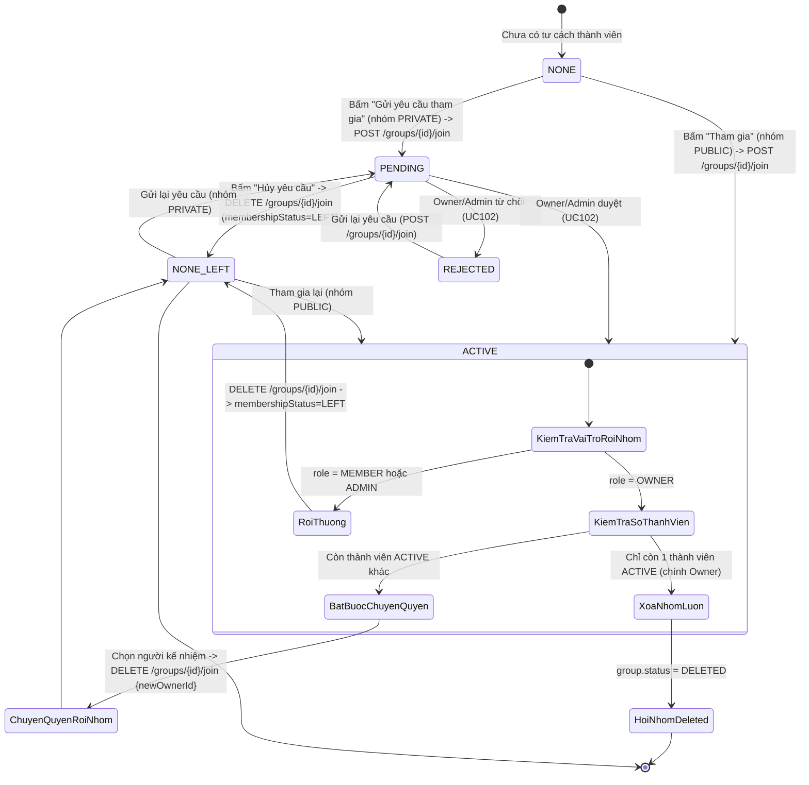
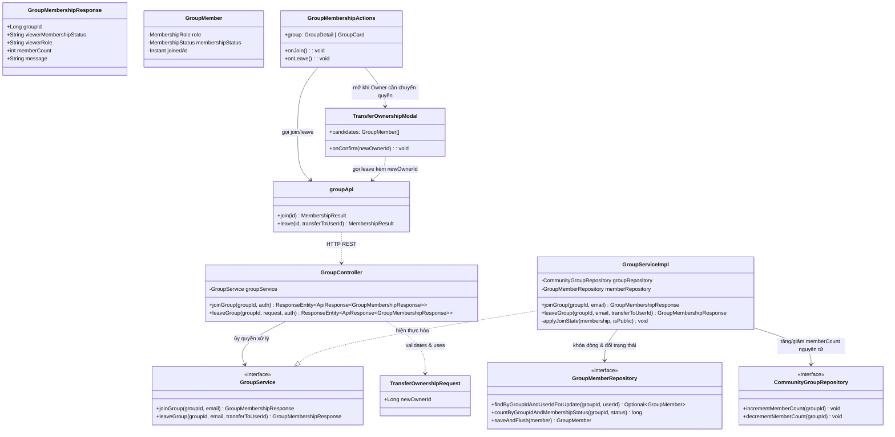
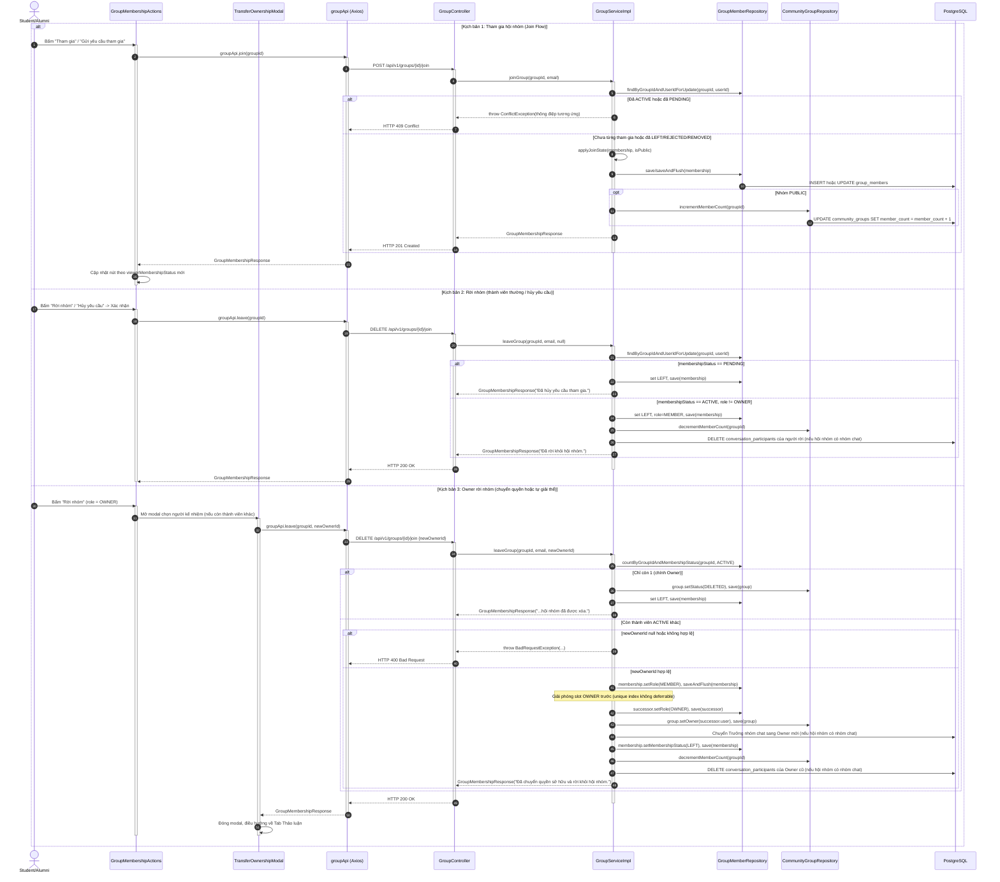

# ĐẶC TẢ YÊU CẦU & THIẾT KẾ CHI TIẾT: UC101 - THAM GIA & RỜI HỘI NHÓM (JOIN & LEAVE GROUP)

## PHẦN 1: ĐẶC TẢ NGHIỆP VỤ (REPORT 3)

### 2.2.3 Business Workflow (Luồng nghiệp vụ)



#### Mô tả chi tiết luồng xử lý bằng chữ (Business Step Description):
* **Bước 1 - Khởi đầu**: Cựu sinh viên (`ALUMNI`) đã đăng nhập xem trang chi tiết một hội nhóm đang `ACTIVE` mà mình chưa phải thành viên.
* **Bước 2 - Các bước chuyển tiếp**:
  * **Tham gia nhóm công khai**: Bấm "Tham gia" → `POST /api/v1/groups/{id}/join` → Backend đặt ngay `membershipStatus = ACTIVE`, tăng `memberCount`, trả về thành công tức thì.
  * **Gửi yêu cầu nhóm riêng tư**: Bấm "Gửi yêu cầu tham gia" → cùng endpoint, nhưng Backend đặt `membershipStatus = PENDING`, **chưa** tăng `memberCount` cho tới khi được duyệt (UC102).
  * **Tái sử dụng dòng cũ**: Nếu người dùng từng có mặt trong nhóm (đã `LEFT`/`REMOVED`/`REJECTED`), hệ thống **không tạo dòng `group_members` mới** mà cập nhật lại đúng dòng cũ (do ràng buộc `UNIQUE (group_id, user_id)`), đưa `role` về `MEMBER` và áp lại trạng thái tham gia theo loại nhóm.
  * **Hủy yêu cầu đang chờ**: Khi đang `PENDING`, bấm "Hủy yêu cầu" → `DELETE /api/v1/groups/{id}/join` (không cần body) → chuyển `membershipStatus = LEFT`, không đổi `memberCount` (vì chưa từng được cộng).
  * **Rời nhóm (Member/Admin thường)**: Bấm "Rời nhóm" → xác nhận → `DELETE /api/v1/groups/{id}/join` → chuyển `membershipStatus = LEFT`, giảm `memberCount` và **gỡ người rời khỏi nhóm trò chuyện của hội nhóm** (nếu hội nhóm đã có nhóm chat).
  * **Owner rời nhóm — còn thành viên khác**: Hệ thống **bắt buộc** Owner chọn một thành viên `ACTIVE` khác làm chủ sở hữu kế nhiệm trước khi được rời (modal "Chuyển quyền sở hữu"); gọi `DELETE /api/v1/groups/{id}/join` kèm `newOwnerId` trong body — Backend chuyển quyền `OWNER` cho người được chọn rồi mới cho Owner cũ rời; nếu hội nhóm đã có nhóm trò chuyện, quyền **Trưởng nhóm chat** (`conversations.created_by`, vai trò `ADMIN` trong cuộc trò chuyện) cũng được chuyển cho Owner mới.
  * **Owner rời nhóm — là thành viên cuối cùng**: Hệ thống tự động chuyển `group.status = DELETED` (giải thể nhóm) thay vì yêu cầu chuyển quyền, vì không còn ai để chuyển.
* **Bước 3 - Kết thúc**: Giao diện cập nhật ngay nút hành động theo `viewerMembershipStatus` mới, số lượng thành viên hiển thị chính xác tuyệt đối trên mọi màn hình.

---

### 3.2 Module Hội nhóm Cộng đồng (Community Groups)

#### 3.2.1 Tham gia & Rời Hội nhóm (UC101 - Join & Leave Group)

**Function trigger**:
* **Navigation path**: `/app/groups/{id}` → cụm nút hành động theo trạng thái tham gia (ở đầu trang chi tiết hoặc trên từng thẻ hội nhóm ở danh sách).
* **Timing Frequency**: On demand, mỗi khi người dùng chủ động muốn gia nhập hoặc rời khỏi một cộng đồng.

**Function description**:
* **Actors/Roles**: Cựu sinh viên (`ALUMNI`) đã đăng nhập; `ADMIN` hệ thống không được tham gia hội nhóm. Hội nhóm là tính năng **dành riêng cho cựu sinh viên (`ALUMNI`)** (BR-97-04): mọi màn hình Hội nhóm được bọc `RoleRoute role="ALUMNI"`, tài khoản vai trò khác bị đưa về `/app`, người chưa đăng nhập bị đưa về `/login`.
* **Purpose**: Là cơ chế nền tảng cho toàn bộ vòng đời thành viên — quyết định ai đang thực sự sinh hoạt trong một cộng đồng và kiểm soát chặt chẽ việc hội nhóm luôn có chủ sở hữu hợp lệ.
* **Interface**: `GroupMembershipActions.tsx` hiển thị đúng 1 trong các trạng thái nút: *Tham gia*/*Gửi yêu cầu tham gia* (NONE/REJECTED/LEFT/REMOVED) · *Đang chờ duyệt* + *Hủy yêu cầu* (PENDING) · *Đã tham gia* + *Rời nhóm* (ACTIVE, role MEMBER) · *Quản lý hội nhóm* + *Rời nhóm* (ACTIVE, role OWNER/ADMIN). `TransferOwnershipModal.tsx` xử lý riêng kịch bản Owner chuyển quyền trước khi rời.

**Data processing**:
* `GroupServiceImpl.joinGroup`: khóa dòng `group_members` hiện có bằng `findByGroupIdAndUserIdForUpdate` (pessimistic write lock) để tránh race-condition khi 2 request tham gia gửi gần như đồng thời; nếu chưa có dòng nào, `saveAndFlush` trong khối `try/catch DataIntegrityViolationException` để bắt đúng trường hợp 2 request đồng thời cùng tạo dòng mới (ràng buộc `UNIQUE` ở CSDL chặn request đến sau, Service chuyển thành lỗi nghiệp vụ dễ hiểu thay vì lỗi 500).
* `GroupServiceImpl.leaveGroup`: xử lý riêng từng nhánh theo `membershipStatus` hiện tại (`PENDING` → hủy yêu cầu; `ACTIVE` → rời thật) và theo `role` (Owner cần xử lý đặc biệt). Khi chuyển quyền sở hữu, Service **giải phóng vai trò `OWNER` của người cũ trước** (`saveAndFlush` set về `MEMBER`) rồi mới gán `OWNER` cho người kế nhiệm — vì ràng buộc `uq_gm_one_active_owner` ở CSDL không cho phép 2 dòng `OWNER` tồn tại cùng lúc dù chỉ trong tích tắc của 1 transaction chưa flush.
* Đồng bộ nhóm trò chuyện: sau khi rời nhóm thành công, `leaveGroup` tìm cuộc trò chuyện có `community_group_id = groupId` và xóa bản ghi `conversation_participants` của người rời; khi Owner chuyển quyền, đặt `createdBy` của cuộc trò chuyện cho Owner mới và nâng vai trò người này thành `ADMIN` trong `conversation_participants`.
* `memberCount` luôn được cập nhật qua `@Modifying` query nguyên tử (`incrementMemberCount`/`decrementMemberCount`), không bao giờ gọi `setMemberCount` trực tiếp trên entity.

**Screen layout**:
* Cụm nút nằm trong `GroupDetailHeader.tsx` (trang chi tiết) và `GroupCard.tsx` (thẻ danh sách), dùng chung component `GroupMembershipActions.tsx`.

**Function details**:
* **Data**: `groupId` (bắt buộc, trên đường dẫn); `newOwnerId` (Long, tùy chọn, chỉ dùng khi Owner rời nhóm còn thành viên khác).
* **Validation**: `newOwnerId` phải là một thành viên `ACTIVE` khác (không phải chính người gửi) của đúng hội nhóm đó.
* **Business rules**: Xem mục 5.1 (BR-101-01 → BR-101-08).
* **Error Handling**:
  * `409 Conflict`: Đã là thành viên `ACTIVE`, hoặc đã có yêu cầu `PENDING` → thông điệp tương ứng; 2 request tham gia đồng thời đụng ràng buộc `UNIQUE` → *"Yêu cầu tham gia đang được xử lý, vui lòng không gửi trùng lặp."*
  * `400 Bad Request`: Hội nhóm đang `INACTIVE`; chưa từng tham gia mà gọi rời nhóm; Owner rời nhóm còn người khác nhưng không truyền `newOwnerId`, hoặc `newOwnerId` không hợp lệ.
  * `403 Forbidden`: Tài khoản `ADMIN` hệ thống cố tham gia nhóm.
* **Normal case**: Tham gia nhóm công khai có hiệu lực tức thì; gửi yêu cầu nhóm riêng tư chuyển sang trạng thái chờ rõ ràng.
* **Abnormal case**: Owner duy nhất rời nhóm — hệ thống tự xóa mềm hội nhóm thay vì để lại một nhóm "mồ côi" không có chủ sở hữu (đảm bảo bất biến BR-02 của đặc tả gốc: "Mỗi hội nhóm phải có một Owner hợp lệ").

---

### 5. Requirement Appendix (Phụ lục Yêu cầu)

#### 5.1 Business Rules (Quy tắc Nghiệp vụ)

| ID | Định nghĩa Quy tắc (Rule Definition) |
| :--- | :--- |
| **BR-101-01** | Mỗi người dùng chỉ có đúng một bản ghi tư cách thành viên trên mỗi hội nhóm (ràng buộc `UNIQUE (group_id, user_id)`); mọi lần tham gia lại sau khi đã rời/bị từ chối/bị xóa đều tái sử dụng đúng bản ghi cũ, không tạo bản ghi mới. |
| **BR-101-02** | Tham gia hội nhóm công khai (`PUBLIC`) có hiệu lực ngay lập tức (`ACTIVE`); tham gia hội nhóm riêng tư (`PRIVATE`) chuyển vào trạng thái chờ duyệt (`PENDING`) và chưa được tính vào `memberCount`. |
| **BR-101-03** | Người dùng chỉ được hủy yêu cầu khi yêu cầu đang ở trạng thái `PENDING`; không thể "hủy" một tư cách thành viên đã `ACTIVE` (phải dùng chức năng Rời nhóm). |
| **BR-101-04** | Chủ sở hữu (`OWNER`) không được rời nhóm nếu hội nhóm còn thành viên `ACTIVE` khác mà chưa chỉ định người kế nhiệm (`newOwnerId`) hợp lệ. |
| **BR-101-05** | Nếu Chủ sở hữu là thành viên `ACTIVE` cuối cùng của hội nhóm, hành động rời nhóm sẽ tự động giải thể hội nhóm (chuyển `status = DELETED`) thay vì yêu cầu chuyển quyền. |
| **BR-101-06** | Số lượng thành viên (`memberCount`) chỉ được cập nhật thông qua các câu lệnh nguyên tử ở tầng CSDL, luôn phản ánh đúng số bản ghi `membershipStatus = ACTIVE`, không bị âm và không bị lệch khi có yêu cầu trùng lặp đồng thời. |
| **BR-101-07** | Hội nhóm đang `INACTIVE` không tiếp nhận yêu cầu tham gia/gia nhập mới; thao tác rời nhóm của thành viên hiện có vẫn luôn được phép bất kể trạng thái hội nhóm. |
| **BR-101-08** | Khi thành viên rời hội nhóm, họ đồng thời bị gỡ khỏi nhóm trò chuyện của hội nhóm (nếu có); khi Owner chuyển quyền, quyền Trưởng nhóm chat chuyển theo cho Owner mới. |

#### 5.2 Common Requirements (Yêu cầu Chung)
* Mọi thao tác Rời nhóm đều có hộp thoại xác nhận; riêng trường hợp Owner là thành viên cuối cùng, hộp thoại nêu rõ hậu quả giải thể hội nhóm.
* Trạng thái nút hành động luôn đồng bộ ngay lập tức với kết quả API (không cần tải lại trang).

#### 5.3 Application Messages List (Danh sách Thông điệp Ứng dụng)

| # | Mã thông điệp | Loại thông điệp | Ngữ cảnh | Nội dung hiển thị |
| :--- | :--- | :--- | :--- | :--- |
| 1 | `MSG-GRP-26` | Toast message | Tham gia nhóm công khai thành công | Tham gia hội nhóm thành công! |
| 2 | `MSG-GRP-27` | Toast message | Gửi yêu cầu nhóm riêng tư thành công | Đã gửi yêu cầu tham gia, vui lòng chờ duyệt. |
| 3 | `MSG-GRP-28` | Toast message | Hủy yêu cầu thành công | Đã hủy yêu cầu tham gia. |
| 4 | `MSG-GRP-29` | Toast message | Rời nhóm thành công (thường) | Đã rời khỏi hội nhóm. |
| 5 | `MSG-GRP-30` | Toast message | Owner chuyển quyền & rời nhóm thành công | Đã chuyển quyền sở hữu và rời khỏi hội nhóm. |
| 6 | `MSG-GRP-31` | Toast message | Owner cuối cùng rời nhóm (tự giải thể) | Bạn là thành viên cuối cùng nên hội nhóm đã được xóa. |
| 7 | `MSG-GRP-32` | Toast message (error) | Đã là thành viên | Bạn đã là thành viên của hội nhóm này. |
| 8 | `MSG-GRP-33` | Toast message (error) | Đã có yêu cầu đang chờ | Bạn đã gửi yêu cầu tham gia, vui lòng chờ Owner/Admin duyệt. |
| 9 | `MSG-GRP-34` | Modal prompt | Owner rời nhóm còn người khác | Bạn là chủ sở hữu. Hãy chọn một thành viên để chuyển quyền sở hữu trước khi rời hội nhóm. |
| 10 | `MSG-GRP-35` | Modal confirm | Xác nhận rời nhóm (thành viên cuối) | Bạn là thành viên cuối cùng của {Tên nhóm}. Nếu rời nhóm, hội nhóm sẽ bị xóa vĩnh viễn. Bạn có chắc chắn muốn tiếp tục? |

---

## PHẦN 2: THIẾT KẾ CHI TIẾT (REPORT 4)

### 3. Detail Design (Thiết kế chi tiết)

#### 3.1 Tham gia & Rời Hội nhóm (UC101 - Join & Leave Group)

##### 3.1.1 Class Diagram (Sơ đồ Lớp)



###### Mô tả chi tiết cấu trúc các lớp (Class Design Description):
* **Lớp Controller**: `GroupController.joinGroup` trả `HTTP 201 Created`; `leaveGroup` nhận `TransferOwnershipRequest` **tùy chọn** (`required = false`) vì phần lớn trường hợp rời nhóm không cần body.
* **Lớp DTO**: `GroupMembershipResponse.java` dùng chung cho cả 2 API (tham gia và rời), luôn trả `viewerMembershipStatus` mới nhất để Frontend đồng bộ nút hành động ngay lập tức.
* **Lớp Service**: `GroupServiceImpl.joinGroup`/`leaveGroup` là 2 hàm phức tạp nhất của module, xử lý đầy đủ các nhánh nghiệp vụ nêu ở mục Business Workflow.
* **Lớp Repository**: `findByGroupIdAndUserIdForUpdate` dùng `@Lock(PESSIMISTIC_WRITE)` — khóa đúng dòng `group_members` liên quan trong suốt transaction, ngăn 2 thao tác tham gia/rời/duyệt cùng lúc trên cùng 1 người ghi đè lẫn nhau.
* **Lớp Frontend**: `GroupMembershipActions.tsx` là "bộ não" quyết định hiển thị nút nào dựa trên `viewerMembershipStatus`/`viewerRole`/`status` của nhóm; `TransferOwnershipModal.tsx` tự tải danh sách thành viên để Owner chọn người kế nhiệm.

##### 3.1.2 Sequence Diagram (Sơ đồ Tuần tự Gộp)



###### Mô tả chi tiết luồng xử lý bằng chữ (Sequence Flow Description):
1. **Luồng 1 - Tham gia thành công**: Service khóa dòng `group_members` hiện có (nếu có) để tránh đua tranh, áp đúng trạng thái theo loại nhóm (`ACTIVE` cho `PUBLIC`, `PENDING` cho `PRIVATE`), chỉ tăng `memberCount` khi vào thẳng `ACTIVE`.
2. **Luồng 2 - Xung đột tham gia trùng lặp**: Nếu đã `ACTIVE` hoặc `PENDING`, Service ném `ConflictException` ngay (409); trường hợp hai request đồng thời cùng tạo dòng mới (người chưa từng tham gia), ràng buộc `UNIQUE (group_id, user_id)` ở CSDL chặn request đến sau, Service bắt `DataIntegrityViolationException` và chuyển thành `ConflictException` dễ hiểu thay vì lỗi hệ thống 500.
3. **Luồng 3 - Rời nhóm thông thường/hủy yêu cầu**: Tùy theo `membershipStatus` hiện tại mà Service rẽ nhánh khác nhau; chỉ giảm `memberCount` khi người rời thực sự đang `ACTIVE`.
4. **Luồng 4 - Owner chuyển quyền rồi rời**: Đây là giao dịch nhạy cảm nhất — phải giải phóng vai trò `OWNER` cũ (`saveAndFlush`) **trước khi** gán `OWNER` cho người mới, do ràng buộc duy nhất `uq_gm_one_active_owner` ở CSDL không cho phép tồn tại 2 dòng `OWNER` ngay cả tạm thời trong cùng transaction chưa flush.
5. **Luồng 5 - Owner cuối cùng rời nhóm**: Không yêu cầu `newOwnerId`, hệ thống tự chuyển `group.status = DELETED`, đảm bảo không bao giờ tồn tại hội nhóm không có chủ sở hữu.

##### 3.1.3 Thiết kế Cơ sở Dữ liệu & Ràng buộc (Database Schema Design)

* **`UNIQUE (group_id, user_id)` trên `group_members`**: Nền tảng của toàn bộ thiết kế "1 người — 1 dòng trên mỗi nhóm", được CSDL bảo đảm tuyệt đối kể cả khi tầng ứng dụng có lỗi logic.
* **`uq_gm_one_active_owner`** (Partial Unique Index, bổ sung ở `V8`): `CREATE UNIQUE INDEX ... ON group_members (group_id) WHERE role = 'OWNER' AND membership_status = 'ACTIVE'` — đảm bảo tại một thời điểm, mỗi hội nhóm chỉ có đúng 1 dòng Owner đang hoạt động; đây chính là lý do Service phải giải phóng (`saveAndFlush`) vai trò Owner cũ trước khi gán cho người kế nhiệm.
* **`CommunityGroupRepository.incrementMemberCount/decrementMemberCount`**: Câu lệnh `@Modifying` thuần SQL (`UPDATE ... SET member_count = member_count + 1`), thực thi trực tiếp trên CSDL, không đi qua vòng đời entity Hibernate — tránh tuyệt đối tình trạng "lost update" khi nhiều giao dịch tham gia/rời cùng lúc.

##### 3.1.4 Đặc tả API Endpoint (API Specification)

###### 1. Tham gia hội nhóm / gửi yêu cầu tham gia:
* **URL**: `POST /api/v1/groups/{groupId}/join`
* **Tiêu đề Request**: `Authorization: Bearer <jwt_access_token>`
* **Phản hồi thành công - nhóm công khai (HTTP 201 Created)**:
  ```json
  {
    "error": 0,
    "message": "Tham gia hội nhóm thành công!",
    "data": {
      "groupId": 4,
      "viewerMembershipStatus": "ACTIVE",
      "viewerRole": null,
      "memberCount": 13,
      "message": "Tham gia hội nhóm thành công!"
    }
  }
  ```
* **Phản hồi thành công - nhóm riêng tư (HTTP 201 Created)**:
  ```json
  {
    "error": 0,
    "message": "Đã gửi yêu cầu tham gia, vui lòng chờ duyệt.",
    "data": {
      "groupId": 2,
      "viewerMembershipStatus": "PENDING",
      "viewerRole": null,
      "memberCount": 3,
      "message": "Đã gửi yêu cầu tham gia, vui lòng chờ duyệt."
    }
  }
  ```
* **Phản hồi lỗi đã là thành viên (HTTP 409 Conflict)**:
  ```json
  { "error": -1, "message": "Bạn đã là thành viên của hội nhóm này.", "data": null }
  ```

###### 2. Rời hội nhóm / hủy yêu cầu tham gia:
* **URL**: `DELETE /api/v1/groups/{groupId}/join`
* **Body Request** (tùy chọn, chỉ cần khi Owner còn thành viên khác):
  ```json
  { "newOwnerId": 5 }
  ```
* **Phản hồi thành công - thành viên thường (HTTP 200 OK)**:
  ```json
  {
    "error": 0,
    "message": "Đã rời khỏi hội nhóm.",
    "data": { "groupId": 4, "viewerMembershipStatus": "LEFT", "memberCount": 12, "message": "Đã rời khỏi hội nhóm." }
  }
  ```
* **Phản hồi lỗi Owner chưa chuyển quyền (HTTP 400 Bad Request)**:
  ```json
  {
    "error": -1,
    "message": "Bạn là chủ sở hữu, hãy chuyển quyền sở hữu cho một thành viên khác trước khi rời nhóm.",
    "data": null
  }
  ```
