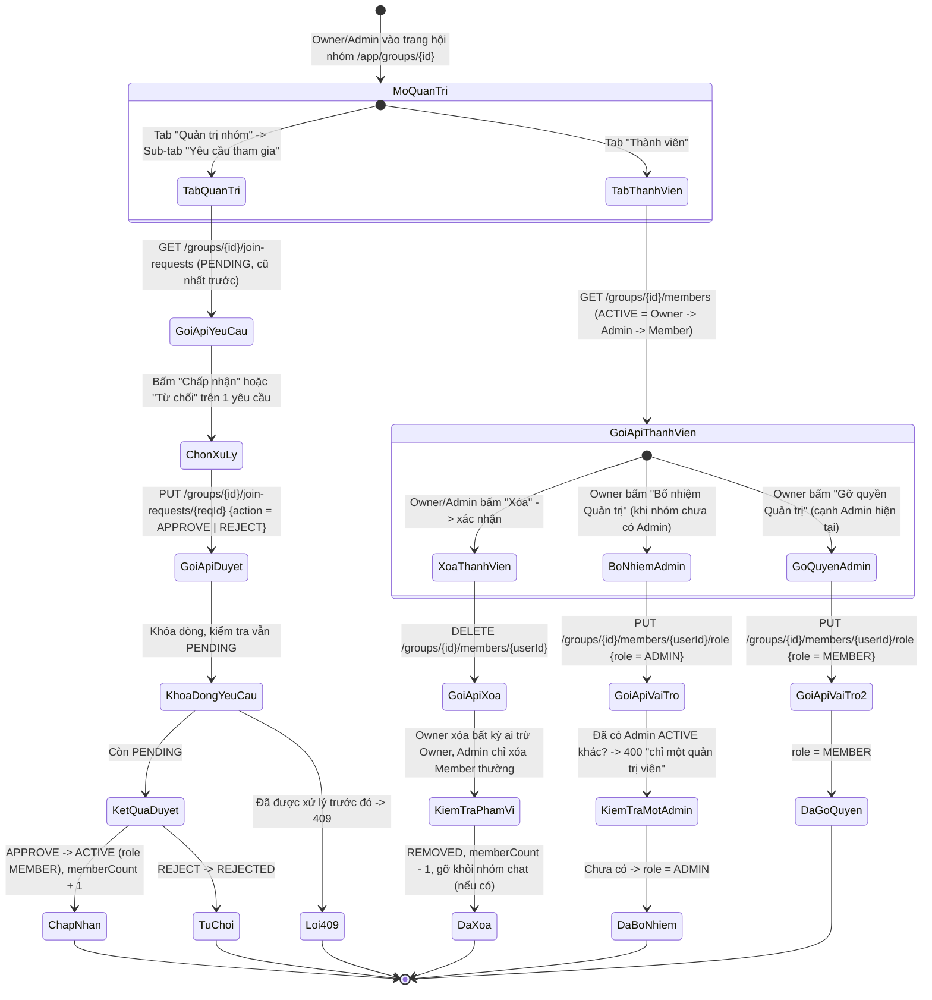
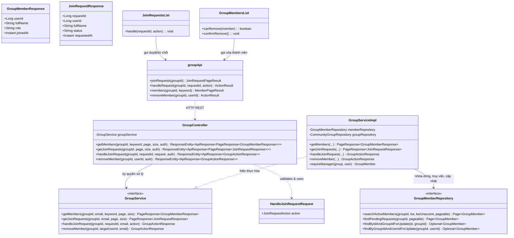
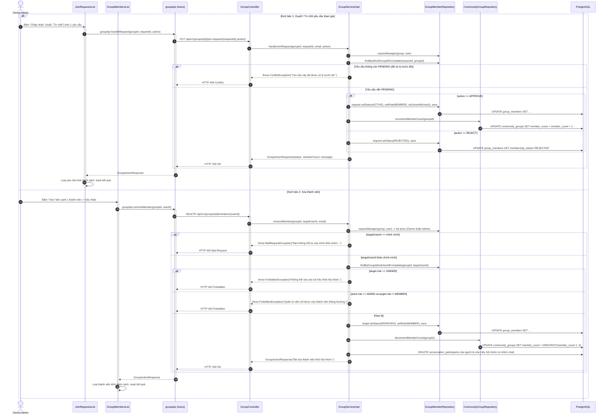
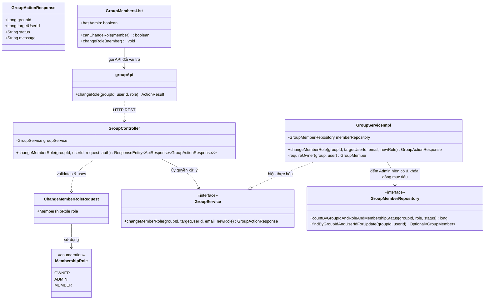
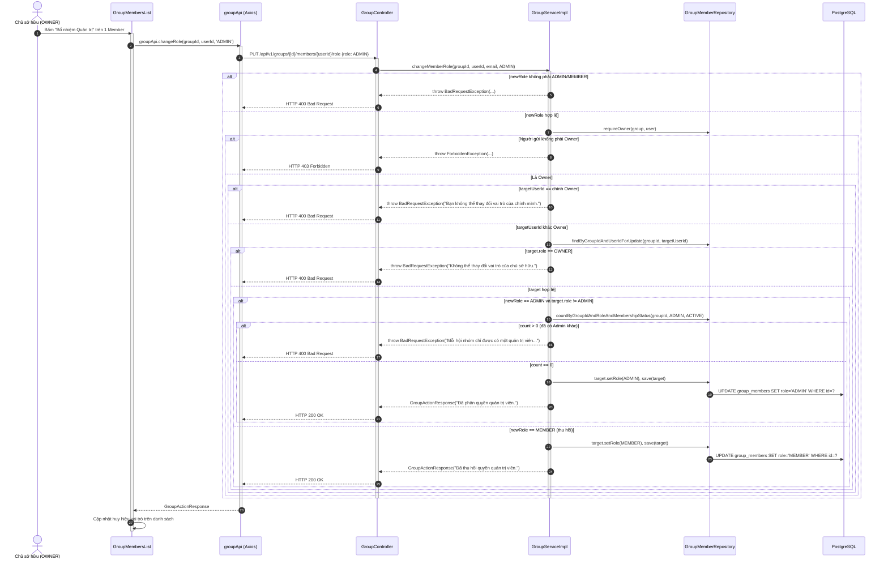

# ĐẶC TẢ YÊU CẦU & THIẾT KẾ CHI TIẾT: UC102 - QUẢN LÝ THÀNH VIÊN HỘI NHÓM: DUYỆT YÊU CẦU, XÓA THÀNH VIÊN & PHÂN QUYỀN ADMIN (MANAGE GROUP MEMBERS)

> **Phạm vi UC (gộp)**: UC này gộp *Quản lý thành viên & yêu cầu tham gia* và *Phân quyền quản trị viên hội nhóm*. Cả hai đều là thao tác của người quản trị trên **tập thành viên của hội nhóm** (`group_members`): duyệt/từ chối yêu cầu, xóa thành viên và gán/thu hồi vai trò đều làm thay đổi trạng thái (`membershipStatus`) hoặc vai trò (`role`) của cùng một bản ghi, dùng chung màn hình danh sách thành viên và cùng bộ quy tắc phân cấp Owner > Admin > Member. Mã UC của tài liệu này là **UC102**.

## PHẦN 1: ĐẶC TẢ NGHIỆP VỤ (REPORT 3)

### 2.2.3 Business Workflow (Luồng nghiệp vụ)



#### Mô tả chi tiết luồng xử lý bằng chữ (Business Step Description):
* **Bước 1 - Khởi đầu**: Owner hoặc Admin mở Tab "Quản trị nhóm" (nhãn hiển thị số yêu cầu đang chờ) hoặc Tab "Thành viên" ở trang chi tiết hội nhóm. Quyền *phân quyền Admin* chỉ dành riêng cho Owner.
* **Bước 2 - Các bước chuyển tiếp**:
  * **Xem & tìm thành viên**: Tab "Thành viên" liệt kê thành viên `ACTIVE` (Owner → Admin → Member, theo ngày tham gia), tìm theo tên có/không dấu, phân trang "Tải thêm thành viên".
  * **Duyệt yêu cầu tham gia** (mục 3.2.1): Owner/Admin xem yêu cầu `PENDING` rồi "Chấp nhận" (→ `ACTIVE`, `role = MEMBER`, tăng `memberCount`) hoặc "Từ chối" (→ `REJECTED`, người đó vẫn có thể gửi lại). Backend khóa dòng và kiểm tra lại `PENDING` để một yêu cầu chỉ xử lý đúng một lần.
  * **Xóa thành viên** (mục 3.2.1): Owner xóa được bất kỳ ai trừ Owner; Admin chỉ xóa `MEMBER` thường; không ai tự xóa mình (phải dùng "Rời nhóm" ở UC101). Người bị xóa chuyển `REMOVED`, `role` về `MEMBER`, `memberCount` giảm và **được gỡ khỏi nhóm trò chuyện của hội nhóm** (nếu có).
  * **Bổ nhiệm / Gỡ quyền Quản trị** (mục 3.2.2): chỉ Owner. Mỗi hội nhóm chỉ có **tối đa 1 Admin** đang hoạt động (ràng buộc `uq_gm_one_active_admin`): khi đã có Admin, nút "Bổ nhiệm Quản trị" không hiện ở Member khác — Owner phải gỡ quyền Admin hiện tại trước. Không ai đổi được vai trò của chính mình; vai trò `OWNER` chỉ chuyển qua luồng Rời nhóm (UC101).
* **Bước 3 - Kết thúc**: Danh sách yêu cầu/thành viên làm mới ngay sau mỗi thao tác; `memberCount` luôn khớp số dòng `ACTIVE`; huy hiệu vai trò cập nhật tức thì và người mới được bổ nhiệm thấy thêm Tab "Quản trị nhóm" ở lần tải trang tiếp theo (UC100, mục 3.2.1 của UC này, UC103).

---

### 3.2 Module Hội nhóm Cộng đồng (Community Groups)

#### 3.2.1 Quản lý Thành viên & Yêu cầu Tham gia Hội nhóm (UC102 - Manage Group Members & Join Requests)

**Function trigger**:
* **Navigation path**: `/app/groups/{id}` → Tab "Thành viên" (xem/xóa thành viên) hoặc Tab "Quản trị nhóm" → Sub-tab "Yêu cầu tham gia" (duyệt/từ chối).
* **Timing Frequency**: On demand, Owner/Admin xử lý bất cứ khi nào có yêu cầu mới hoặc cần điều chỉnh danh sách thành viên.

**Function description**:
* **Actors/Roles**: Owner và Admin của hội nhóm xử lý yêu cầu và xóa thành viên theo đúng phạm vi quyền; mọi thành viên `ACTIVE` (kể cả Member thường) đều xem được danh sách thành viên nếu hội nhóm cho phép (`canViewMembers`).
* **Purpose**: Kiểm soát chất lượng và quy mô cộng đồng — đảm bảo chỉ những người phù hợp mới ở lại trong hội nhóm riêng tư, đồng thời cho phép loại bỏ thành viên vi phạm quy định.
* **Interface**:
  * `JoinRequestsList.tsx`: mỗi dòng gồm avatar, tên, chuyên ngành/chức danh, thời điểm gửi yêu cầu, 2 nút "Chấp nhận"/"Từ chối"; trạng thái rỗng khi không có yêu cầu nào.
  * `GroupMembersList.tsx`: ô tìm kiếm theo tên, mỗi dòng thành viên gồm avatar, tên, huy hiệu vai trò (Chủ sở hữu/Quản trị viên), nút "Xóa" (biểu tượng xóa người dùng) chỉ hiện với người có quyền và đúng đối tượng được phép xóa; nút "Tải thêm yêu cầu"/"Tải thêm thành viên" khi còn trang kế tiếp.

**Data processing**:
* `GroupServiceImpl.getJoinRequests`/`getMembers`: xác thực `requireManager` (yêu cầu) hoặc kiểm tra quyền xem (thành viên); truy vấn phân trang, nạp kèm `UserProfile` theo lô (tránh N+1).
* `GroupServiceImpl.handleJoinRequest`: khóa dòng yêu cầu bằng `findByIdAndGroupIdForUpdate`, kiểm tra lại đúng còn `PENDING` (chặn xử lý trùng khi có 2 yêu cầu xử lý đồng thời), áp dụng kết quả, cộng `memberCount` nguyên tử nếu `APPROVE`.
* `GroupServiceImpl.removeMember`: xác thực `requireManager`, kiểm tra không tự xóa chính mình, không xóa Owner, và nếu người thực hiện là Admin thì mục tiêu bắt buộc phải là `MEMBER` thường; sau khi chuyển `REMOVED` và giảm `memberCount`, nếu hội nhóm đã có nhóm trò chuyện (`conversations.community_group_id`) thì đồng thời gỡ người đó khỏi `conversation_participants` của nhóm chat.

**Screen layout**:
* 2 khu vực riêng: `JoinRequestsList` nằm trong Sub-tab của `GroupManagePanel.tsx`; `GroupMembersList` nằm trực tiếp ở Tab "Thành viên" của `GroupDetailPage.tsx`.

**Function details**:
* **Data**:
  * `requestId` (Long, trên đường dẫn, bắt buộc với API duyệt) — chính là `id` của dòng `group_members` đang `PENDING`.
  * `action` (Enum `APPROVE`/`REJECT`, bắt buộc).
  * `userId` (Long, trên đường dẫn, bắt buộc với API xóa thành viên).
  * `keyword` (String, tùy chọn): tìm thành viên theo tên.
* **Validation**: `action` chỉ nhận đúng 2 giá trị; không thể tự xóa chính mình qua API này.
* **Business rules**: Xem mục 5.1 (BR-102-01 → BR-102-11).
* **Error Handling**:
  * `403 Forbidden`: Member thường cố duyệt yêu cầu hoặc xóa thành viên → *"Bạn không có quyền quản lý hội nhóm này."*; Admin cố xóa Owner/Admin khác → *"Quản trị viên chỉ được xóa thành viên thông thường."*
  * `409 Conflict`: Yêu cầu đã được xử lý trước đó → *"Yêu cầu này đã được xử lý trước đó."*
  * `400 Bad Request`: Tự xóa chính mình qua API xóa thành viên → *"Bạn không thể tự xóa mình khỏi nhóm. Hãy dùng chức năng rời nhóm."*
  * `404 Not Found`: Yêu cầu hoặc thành viên không còn tồn tại trong nhóm.
* **Normal case**: Duyệt/từ chối/xóa phản ánh ngay trên danh sách và trên số đếm thành viên, không cần tải lại trang.
* **Abnormal case**: Hai quản trị viên cùng bấm "Chấp nhận" một yêu cầu gần như đồng thời — nhờ khóa dòng + kiểm tra lại trạng thái, chỉ request đến trước thành công; request đến sau nhận `409 Conflict` thay vì cộng `memberCount` hai lần.


---

#### 3.2.2 Phân quyền Quản trị viên Hội nhóm (UC102 - Manage Group Admin Role)

**Function trigger**:
* **Navigation path**: `/app/groups/{id}` → Tab "Thành viên" → nút "Bổ nhiệm Quản trị" / "Gỡ quyền Quản trị" cạnh từng thành viên.
* **Timing Frequency**: On demand, Owner thực hiện khi cần ủy quyền quản lý hội nhóm cho một thành viên tin cậy, hoặc thu hồi khi không còn cần thiết.

**Function description**:
* **Actors/Roles**: Chỉ **Owner** của hội nhóm có quyền thực hiện. Admin hiện tại và Member thường không có quyền tự thăng/giáng cấp (đúng BR-09 của đặc tả gốc: "Người dùng không được tự thay đổi vai trò của mình thông qua request từ Frontend").
* **Purpose**: Cho phép Owner ủy quyền một phần công việc quản lý hội nhóm (duyệt yêu cầu, xóa thành viên vi phạm, ghim bài viết, quản lý thảo luận...) cho một thành viên tin cậy mà không cần chuyển hẳn quyền sở hữu.
* **Interface**: Nút `Button` dạng outline cạnh mỗi dòng thành viên trong `GroupMembersList.tsx`, đổi nhãn/icon theo trạng thái hiện tại ("Bổ nhiệm Quản trị" kèm biểu tượng khiên, hoặc "Gỡ quyền Quản trị" kèm biểu tượng khiên gạch chéo); huy hiệu "Quản trị viên" màu thương hiệu hiển thị cạnh tên Admin.

**Data processing**:
* `GroupServiceImpl.changeMemberRole`: chỉ chấp nhận `newRole ∈ {ADMIN, MEMBER}` (không cho gán `OWNER` qua đường này); xác thực `requireOwner`; chặn tự đổi vai trò chính mình; nếu gán `ADMIN`, kiểm tra `countByGroupIdAndRoleAndMembershipStatus(groupId, ADMIN, ACTIVE) > 0` — nếu đã có Admin khác đang hoạt động thì từ chối ngay ở tầng ứng dụng (trước khi chạm ràng buộc CSDL).

**Screen layout**:
* Nằm trong `GroupMembersList.tsx`, cùng khu vực với nút "Xóa" (UC102), phân biệt bằng icon và màu sắc.

**Function details**:
* **Data**: `userId` (Long, trên đường dẫn, bắt buộc); `role` (Enum, bắt buộc, chỉ nhận `ADMIN`/`MEMBER`).
* **Validation**: Không được đổi vai trò của chính người gửi yêu cầu; không được đổi vai trò của Owner; không được gán `ADMIN` thứ hai khi đã có Admin đang hoạt động.
* **Business rules**: Xem mục 5.1 (BR-102-07 → BR-102-10).
* **Error Handling**:
  * `403 Forbidden`: Người gửi không phải Owner → *"Chỉ chủ sở hữu hội nhóm mới có quyền thực hiện thao tác này."*
  * `400 Bad Request`: Tự đổi vai trò chính mình → *"Bạn không thể thay đổi vai trò của chính mình."*; cố đổi vai trò Owner → *"Không thể thay đổi vai trò của chủ sở hữu."*; đã có Admin khác → *"Mỗi hội nhóm chỉ được có một quản trị viên. Hãy gỡ Admin hiện tại trước."*
  * `404 Not Found`: Thành viên mục tiêu không tồn tại hoặc không còn `ACTIVE` trong nhóm.
* **Normal case**: Phân quyền/thu hồi thành công cập nhật huy hiệu ngay lập tức trên giao diện.
* **Abnormal case**: Owner bấm "Bổ nhiệm Quản trị" ở hai tab trình duyệt cho hai Member khác nhau gần như đồng thời — request đến sau bị chặn bởi kiểm tra đếm số Admin hiện có trong cùng transaction `@Transactional`, tránh tạo ra 2 Admin cùng lúc.


---

### 5. Requirement Appendix (Phụ lục Yêu cầu)

#### 5.1 Business Rules (Quy tắc Nghiệp vụ)

| ID | Định nghĩa Quy tắc (Rule Definition) |
| :--- | :--- |
| **BR-102-01** | Chỉ Owner hoặc Admin của hội nhóm mới có quyền xem danh sách yêu cầu tham gia, duyệt/từ chối yêu cầu, và xóa thành viên khác. |
| **BR-102-02** | Chủ sở hữu (`OWNER`) không thể bị xóa khỏi hội nhóm bởi bất kỳ ai, kể cả Admin. |
| **BR-102-03** | Quản trị viên (`ADMIN`) chỉ được xóa thành viên vai trò `MEMBER` thông thường; không được xóa Owner hoặc Admin khác. |
| **BR-102-04** | Không ai được phép tự xóa chính mình khỏi nhóm thông qua chức năng xóa thành viên — thao tác đó phải thực hiện qua chức năng Rời nhóm (UC101). |
| **BR-102-05** | Một yêu cầu tham gia chỉ được xử lý (chấp nhận/từ chối) đúng một lần; hệ thống phải ngăn xử lý trùng lặp dù có nhiều request gửi lên gần như đồng thời. |
| **BR-102-06** | Khi yêu cầu được chấp nhận, `memberCount` tăng đúng 1; khi xóa thành viên giảm đúng 1; khi từ chối không đổi — số liệu không bao giờ lệch khỏi số dòng `ACTIVE` thực tế. |
| **BR-102-07** | Chỉ Chủ sở hữu (`OWNER`) mới có quyền phân quyền hoặc thu hồi quyền Quản trị viên (`ADMIN`). |
| **BR-102-08** | Mỗi hội nhóm tại một thời điểm chỉ có đúng một thành viên giữ vai trò `ADMIN` đang hoạt động (`uq_gm_one_active_admin`); muốn phân quyền cho người khác phải thu hồi quyền Admin hiện tại trước. |
| **BR-102-09** | Không ai được tự thay đổi vai trò của chính mình, kể cả Owner; vai trò luôn do bên có thẩm quyền (Owner) gán. |
| **BR-102-10** | Vai trò `OWNER` không thể bị thay đổi qua chức năng phân quyền Admin; chuyển quyền sở hữu chỉ thực hiện được qua luồng Rời nhóm của Owner (UC101). |
| **BR-102-11** | Thành viên bị xóa khỏi hội nhóm cũng bị gỡ khỏi nhóm trò chuyện của hội nhóm (nếu hội nhóm đã khởi tạo nhóm chat). |

#### 5.2 Common Requirements (Yêu cầu Chung)
* Danh sách yêu cầu và danh sách thành viên đều phân trang "Tải thêm"; thao tác xóa thành viên luôn có hộp thoại xác nhận nêu rõ tên người bị xóa.
* Các nút thao tác (Chấp nhận/Từ chối/Xóa/Bổ nhiệm/Gỡ quyền) chỉ hiển thị đúng với người có đủ quyền trên đúng đối tượng hợp lệ, hạn chế bấm xong mới báo lỗi.
* Huy hiệu vai trò (Chủ sở hữu/Quản trị viên) hiển thị nhất quán trên danh sách thành viên, tác giả bài viết và tác giả bình luận (UC103).

#### 5.3 Application Messages List (Danh sách Thông điệp Ứng dụng)

| # | Mã thông điệp | Loại thông điệp | Ngữ cảnh | Nội dung hiển thị |
| :--- | :--- | :--- | :--- | :--- |
| 1 | `MSG-GRP-36` | Toast message | Chấp nhận yêu cầu thành công | Đã chấp nhận yêu cầu tham gia. |
| 2 | `MSG-GRP-37` | Toast message | Từ chối yêu cầu thành công | Đã từ chối yêu cầu tham gia. |
| 3 | `MSG-GRP-38` | Toast message | Xóa thành viên thành công | Đã xóa thành viên khỏi hội nhóm. |
| 4 | `MSG-GRP-39` | Modal confirm | Xác nhận xóa thành viên | Bạn có chắc muốn xóa {Tên} khỏi hội nhóm? Người này sẽ mất quyền truy cập nội dung dành cho thành viên. |
| 5 | `MSG-GRP-40` | Toast message (error) | Yêu cầu đã được xử lý | Yêu cầu này đã được xử lý trước đó. |
| 6 | `MSG-GRP-41` | Toast message (error) | Admin xóa sai phạm vi | Quản trị viên chỉ được xóa thành viên thông thường. |
| 7 | `MSG-GRP-42` | Toast message (error) | Cố xóa Owner | Không thể xóa chủ sở hữu khỏi hội nhóm. |
| 8 | `MSG-GRP-43` | Empty state | Không có yêu cầu đang chờ | Không có yêu cầu nào đang chờ duyệt. |
| 9 | `MSG-GRP-44` | Toast message | Phân quyền Admin thành công | Đã phân quyền quản trị viên. |
| 10 | `MSG-GRP-45` | Toast message | Thu hồi quyền Admin thành công | Đã thu hồi quyền quản trị viên. |
| 11 | `MSG-GRP-46` | Toast message (error) | Đã có Admin khác | Mỗi hội nhóm chỉ được có một quản trị viên. Hãy gỡ Admin hiện tại trước. |
| 12 | `MSG-GRP-47` | Toast message (error) | Tự đổi vai trò chính mình | Bạn không thể thay đổi vai trò của chính mình. |
| 13 | `MSG-GRP-48` | Toast message (error) | Cố đổi vai trò Owner | Không thể thay đổi vai trò của chủ sở hữu. |

---

## PHẦN 2: THIẾT KẾ CHI TIẾT (REPORT 4)

### 3. Detail Design (Thiết kế chi tiết)

#### 3.1 Quản lý Thành viên & Yêu cầu Tham gia Hội nhóm (UC102 - Manage Group Members & Join Requests)

##### 3.1.1 Class Diagram (Sơ đồ Lớp)



###### Mô tả chi tiết cấu trúc các lớp (Class Design Description):
* **Lớp Controller**: `GroupController` có 4 endpoint cho UC này: 2 endpoint GET (xem thành viên, xem yêu cầu) và 2 endpoint thay đổi trạng thái (duyệt/từ chối, xóa thành viên).
* **Lớp DTO**: `HandleJoinRequestRequest.java` chỉ chứa `action` kiểu Enum `JoinRequestAction` (`APPROVE`/`REJECT`); `GroupMemberResponse`/`JoinRequestResponse` là 2 DTO tách biệt dù cùng nguồn gốc entity `GroupMember`, vì ngữ nghĩa hiển thị khác nhau (thành viên chính thức vs yêu cầu đang chờ).
* **Lớp Service**: `GroupServiceImpl` tái sử dụng `requireManager` cho cả 4 thao tác; riêng `handleJoinRequest` và `removeMember` còn có thêm lớp kiểm tra nghiệp vụ đặc thù (chống xử lý trùng, giới hạn phạm vi quyền Admin).
* **Lớp Repository**: `findByIdAndGroupIdForUpdate` và `findByGroupIdAndUserIdForUpdate` đều dùng `@Lock(PESSIMISTIC_WRITE)` — chìa khóa để đảm bảo BR-102-05 (chống xử lý trùng yêu cầu).
* **Lớp Frontend**: `JoinRequestsList.tsx` và `GroupMembersList.tsx` tự quyết định hiển thị nút hành động nào dựa trên `viewerRole` được truyền xuống từ `GroupDetailPage`.

##### 3.1.2 Sequence Diagram (Sơ đồ Tuần tự Gộp)



###### Mô tả chi tiết luồng xử lý bằng chữ (Sequence Flow Description):
1. **Luồng 1 - Duyệt yêu cầu thành công**: Service khóa đúng dòng yêu cầu, xác nhận còn `PENDING`, chuyển `ACTIVE` + gán `joinedAt`, tăng `memberCount` nguyên tử trong cùng transaction.
2. **Luồng 2 - Từ chối yêu cầu thành công**: Tương tự nhưng chuyển `REJECTED`, không đổi `memberCount`.
3. **Luồng 3 - Xử lý trùng yêu cầu (Race Condition)**: Request thứ hai đến khi dòng đã được request thứ nhất xử lý xong (không còn `PENDING`) → `409 Conflict`, bảo vệ tính đúng đắn của `memberCount`.
4. **Luồng 4 - Xóa thành viên thành công**: Service xác thực đúng phạm vi quyền theo vai trò của actor (Owner toàn quyền trừ Owner khác; Admin chỉ với Member) trước khi chuyển `REMOVED` và giảm `memberCount`; cuối cùng gỡ người đó khỏi `conversation_participants` của nhóm trò chuyện hội nhóm (nếu có) để họ không còn đọc/gửi tin trong nhóm chat.
5. **Luồng 5 - Lỗi phạm vi quyền khi xóa**: Admin cố xóa Owner hoặc Admin khác, hoặc bất kỳ ai cố tự xóa chính mình qua API này, đều bị chặn với thông điệp lỗi riêng biệt, rõ ràng.

##### 3.1.3 Thiết kế Cơ sở Dữ liệu & Ràng buộc (Database Schema Design)

* **`findByIdAndGroupIdForUpdate`**: `SELECT m FROM GroupMember m JOIN FETCH m.user WHERE m.id = :id AND m.group.id = :groupId` kèm `@Lock(PESSIMISTIC_WRITE)` — vừa đảm bảo yêu cầu thuộc đúng hội nhóm đang thao tác, vừa khóa dòng chống xử lý trùng.
* **`idx_gm_group_status (group_id, membership_status)`**: chỉ mục tổng hợp phục vụ cả truy vấn danh sách thành viên `ACTIVE` lẫn danh sách yêu cầu `PENDING` hiệu quả trên cùng một bảng `group_members`.
* **Không có bảng `join_requests` riêng**: Theo đúng quyết định thiết kế đã thống nhất, yêu cầu tham gia chỉ là một giá trị `membershipStatus = PENDING` trên cùng bảng `group_members`, không tách bảng riêng (xem thêm phần so sánh phương án ở tài liệu kiến trúc tổng thể của module).

##### 3.1.4 Đặc tả API Endpoint (API Specification)

###### 1. Danh sách yêu cầu tham gia đang chờ duyệt:
* **URL**: `GET /api/v1/groups/{groupId}/join-requests?page=0&size=20`
* **Phản hồi thành công (HTTP 200 OK)**:
  ```json
  {
    "error": 0,
    "message": "Lấy danh sách yêu cầu tham gia thành công",
    "data": {
      "content": [
        { "requestId": 10, "userId": 3, "fullName": "Carol Lê", "avatarUrl": "", "headline": "Sinh viên K17", "status": "PENDING", "requestedAt": "2026-09-28T14:58:17Z" }
      ],
      "pageNumber": 0, "pageSize": 20, "totalElements": 1, "totalPages": 1, "last": true
    }
  }
  ```

###### 2. Duyệt hoặc từ chối một yêu cầu:
* **URL**: `PUT /api/v1/groups/{groupId}/join-requests/{requestId}`
* **Body Request**:
  ```json
  { "action": "APPROVE" }
  ```
* **Phản hồi thành công (HTTP 200 OK)**:
  ```json
  {
    "error": 0,
    "message": "Đã chấp nhận yêu cầu tham gia.",
    "data": { "groupId": 2, "targetUserId": 3, "status": "ACTIVE", "memberCount": 3, "message": "Đã chấp nhận yêu cầu tham gia." }
  }
  ```
* **Phản hồi lỗi xử lý trùng (HTTP 409 Conflict)**:
  ```json
  { "error": -1, "message": "Yêu cầu này đã được xử lý trước đó.", "data": null }
  ```

###### 3. Xóa thành viên khỏi hội nhóm:
* **URL**: `DELETE /api/v1/groups/{groupId}/members/{userId}`
* **Phản hồi thành công (HTTP 200 OK)**:
  ```json
  {
    "error": 0,
    "message": "Đã xóa thành viên khỏi hội nhóm.",
    "data": { "groupId": 4, "targetUserId": 7, "status": "REMOVED", "memberCount": 11, "message": "Đã xóa thành viên khỏi hội nhóm." }
  }
  ```
* **Phản hồi lỗi Admin vượt phạm vi quyền (HTTP 403 Forbidden)**:
  ```json
  { "error": -1, "message": "Quản trị viên chỉ được xóa thành viên thông thường.", "data": null }
  ```


---

#### 3.2 Phân quyền Quản trị viên Hội nhóm (UC102 - Manage Group Admin Role)

##### 3.2.1 Class Diagram (Sơ đồ Lớp)



###### Mô tả chi tiết cấu trúc các lớp (Class Design Description):
* **Lớp Controller**: `GroupController.changeMemberRole` nhận `groupId`, `userId` trên đường dẫn và `ChangeMemberRoleRequest` đã `@Valid`.
* **Lớp DTO**: `ChangeMemberRoleRequest.java` chỉ có 1 trường `role` kiểu `MembershipRole`; Service tự chặn giá trị `OWNER` ngay đầu hàm (không dựa vào validate DTO vì cả 3 giá trị Enum đều hợp lệ về mặt kiểu dữ liệu).
* **Lớp Service**: `GroupServiceImpl.changeMemberRole` là nơi tập trung toàn bộ logic ràng buộc "chỉ 1 Admin" — gọi `countByGroupIdAndRoleAndMembershipStatus` trước khi cho phép gán `ADMIN`.
* **Lớp Repository**: `countByGroupIdAndRoleAndMembershipStatus` là Derived Query Method của Spring Data JPA, không cần viết JPQL thủ công.
* **Lớp Frontend**: `GroupMembersList.tsx` tự tính biến `hasAdmin` từ một lệnh gọi `useGroupMembers` phụ (không lọc từ khóa) để quyết định có hiển thị nút "Bổ nhiệm Quản trị" cho từng Member hay không, tránh gọi API thừa mỗi khi render từng dòng.

##### 3.2.2 Sequence Diagram (Sơ đồ Tuần tự)



###### Mô tả chi tiết luồng xử lý bằng chữ (Sequence Flow Description):
1. **Luồng 1 - Phân quyền Admin thành công**: Sau khi qua hết các lớp kiểm tra (quyền Owner, không tự đổi chính mình, không đổi Owner, chưa có Admin khác), Service gán `role = ADMIN` cho thành viên mục tiêu.
2. **Luồng 2 - Thu hồi quyền Admin thành công**: Không cần kiểm tra ràng buộc số lượng (vì luôn hợp lệ để giảm số Admin về 0), chỉ cần qua các lớp kiểm tra quyền cơ bản.
3. **Luồng 3 - Lỗi đã có Admin khác**: Đây là nhánh lỗi đặc trưng nhất của UC này — nếu `count > 0`, Service từ chối ngay ở tầng ứng dụng với thông điệp hướng dẫn rõ ràng, trước khi kịp chạm tới ràng buộc `uq_gm_one_active_admin` ở CSDL (ràng buộc CSDL là tuyến phòng thủ cuối cùng, không phải là nơi người dùng nhận thông báo lỗi).
4. **Luồng 4 - Lỗi tự đổi vai trò / đổi vai trò Owner**: Cả hai đều bị chặn bằng so sánh ID trực tiếp trong Service, không cần truy vấn thêm.

##### 3.2.3 Thiết kế Cơ sở Dữ liệu & Ràng buộc (Database Schema Design)

* **`uq_gm_one_active_admin`** (`V8__group_video_replies_single_admin.sql`): `CREATE UNIQUE INDEX uq_gm_one_active_admin ON group_members (group_id) WHERE role = 'ADMIN' AND membership_status = 'ACTIVE'` — Partial Unique Index đảm bảo tuyệt đối không thể tồn tại 2 dòng Admin đang hoạt động trong cùng một hội nhóm ở tầng CSDL, kể cả khi logic tầng Service có sai sót.
* **Migration này cũng đồng bộ lại dữ liệu cũ**: Trước khi tạo index, migration chạy 2 câu `UPDATE` để đảm bảo vai trò `OWNER` trong `group_members` khớp đúng với cột `owner_id` của `community_groups` (dữ liệu tạo ra trước khi ràng buộc này tồn tại có thể có sai lệch do nhiều lần chuyển quyền sở hữu).

##### 3.2.4 Đặc tả API Endpoint (API Specification)

###### 1. Phân quyền hoặc thu hồi quyền Quản trị viên:
* **URL**: `PUT /api/v1/groups/{groupId}/members/{userId}/role`
* **Tiêu đề Request**: `Authorization: Bearer <jwt_access_token>` (chỉ Owner)
* **Body Request**:
  ```json
  { "role": "ADMIN" }
  ```
* **Phản hồi thành công (HTTP 200 OK)**:
  ```json
  {
    "error": 0,
    "message": "Đã phân quyền quản trị viên.",
    "data": { "groupId": 4, "targetUserId": 8, "status": "ADMIN", "memberCount": 12, "message": "Đã phân quyền quản trị viên." }
  }
  ```
* **Phản hồi lỗi đã có Admin khác (HTTP 400 Bad Request)**:
  ```json
  {
    "error": -1,
    "message": "Mỗi hội nhóm chỉ được có một quản trị viên. Hãy gỡ Admin hiện tại trước.",
    "data": null
  }
  ```
* **Phản hồi lỗi không phải Owner (HTTP 403 Forbidden)**:
  ```json
  { "error": -1, "message": "Chỉ chủ sở hữu hội nhóm mới có quyền thực hiện thao tác này.", "data": null }
  ```

