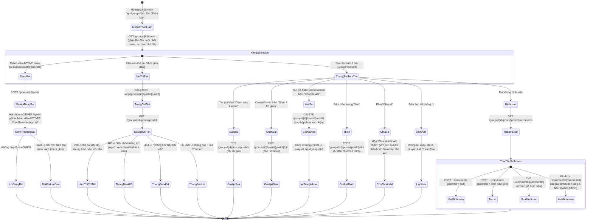
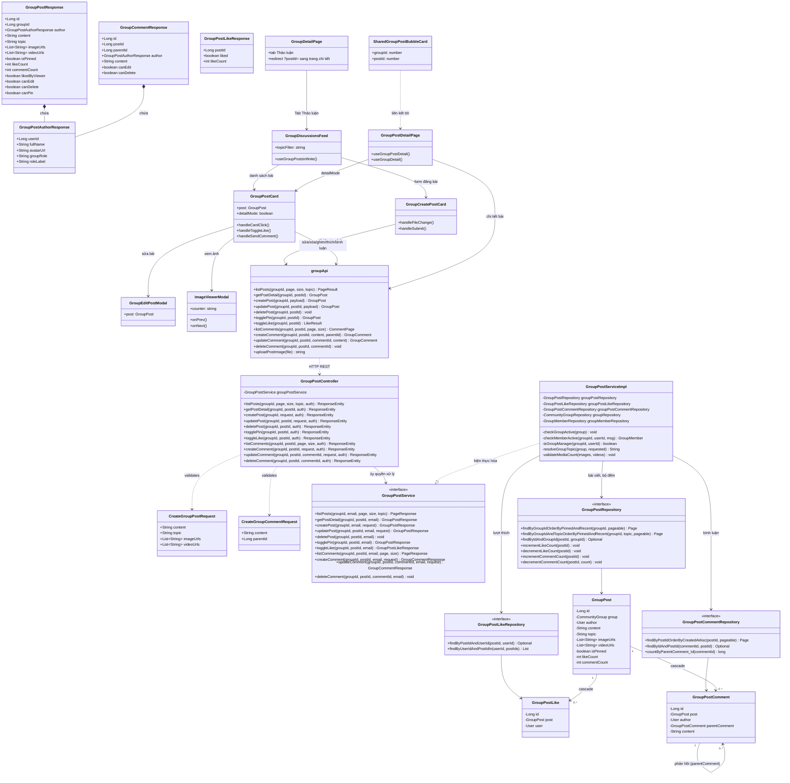

# ĐẶC TẢ YÊU CẦU & THIẾT KẾ CHI TIẾT: UC103 - THẢO LUẬN TRONG HỘI NHÓM (GROUP DISCUSSION)

> **Phạm vi UC (gộp)**: UC này gộp 3 nhóm chức năng trước đây tách rời — *Đăng & quản lý bài viết*, *Thích & bình luận bài viết* và *Trang chi tiết bài viết hội nhóm* — vì cả ba cùng thao tác trên một đối tượng (bài thảo luận `group_posts`), cùng một màn hình (`GroupPostCard`), cùng một controller/service (`GroupPostController` / `GroupPostServiceImpl`) và cùng bộ quy tắc phân quyền (thành viên `ACTIVE` / tác giả / Owner-Admin). Mã UC của tài liệu này là **UC103**.

## PHẦN 1: ĐẶC TẢ NGHIỆP VỤ (REPORT 3)

### 2.2.3 Business Workflow (Luồng nghiệp vụ)



#### Mô tả chi tiết luồng xử lý bằng chữ (Business Step Description):
* **Bước 1 - Khởi đầu**: Người dùng mở Tab "Thảo luận" của trang chi tiết hội nhóm (tab mặc định). Danh sách bài viết được nạp bằng `GET /api/v1/groups/{id}/posts` theo kiểu "xem thêm" (15 bài/lần), **bài ghim luôn nằm đầu**, sau đó là bài mới nhất. Nhóm `PUBLIC` cho phép xem công khai; nhóm `PRIVATE` chỉ thành viên `ACTIVE` mới xem được (chặn cả ở Frontend lẫn Backend).
* **Bước 2 - Các bước chuyển tiếp**:
  * **Lọc theo chủ đề**: Dãy chip `#chủ-đề` (lấy từ `topics` của hội nhóm) lọc danh sách theo đúng 1 chủ đề; chip "Tất cả" bỏ lọc. Chủ đề gửi lên không thuộc nhóm bị Backend từ chối.
  * **Đăng bài**: Thành viên `ACTIVE` (và nhóm đang `ACTIVE`) soạn nội dung (bắt buộc, ≤ 5000 ký tự), có thể chọn 1 chủ đề thuộc danh sách của nhóm, đính kèm tối đa **10 tệp ảnh/video cộng lại** (video tối đa 60 giây/tệp; tệp được tải lên storage qua presigned URL ở thư mục `group-posts` trước khi gửi bài). Gọi `POST /api/v1/groups/{id}/posts`. Bài mới xuất hiện ở đầu danh sách (chưa ghim).
  * **Mở trang chi tiết bài viết**: Bấm vào vùng trống của thẻ bài (ngoài nút/liên kết/ảnh/video/khung bình luận) hoặc bấm vào thời gian đăng → chuyển tới `/app/groups/{groupId}/posts/{postId}`. Trang chi tiết gọi `GET /api/v1/groups/{id}/posts/{postId}` và dùng lại đúng `GroupPostCard` ở chế độ chi tiết (khung bình luận mở sẵn, ảnh hiển thị lớn hơn). Các trạng thái: đang tải (skeleton), **403** (nhóm riêng tư, người xem chưa là thành viên → thẻ "Hội nhóm riêng tư" + nút "Xem hội nhóm"), **404** (bài không tồn tại/đã xóa/nhóm không còn khả dụng → "Không tìm thấy bài viết"), lỗi khác (kèm nút "Thử lại"), đường dẫn sai định dạng (id không phải số). Có liên kết "Quay lại {tên nhóm}". Liên kết cũ dạng `/app/groups/{id}?postId={n}` được tự chuyển (`replace`) sang trang chi tiết.
  * **Chỉnh sửa bài viết**: Chỉ **chính tác giả** thấy và dùng được "Chỉnh sửa bài viết" (đổi nội dung, chủ đề, ảnh/video). Owner/Admin **không** được sửa nội dung bài của người khác. Sau khi sửa, bài hiện nhãn "• Đã chỉnh sửa" nếu `updatedAt` lớn hơn `createdAt` quá 10 giây (ngưỡng tránh nhãn sai do độ lệch lúc tạo).
  * **Ghim/Bỏ ghim**: Chỉ Owner/Admin. Thao tác đảo `isPinned`; bài ghim hiện nhãn "Đã ghim" và luôn nằm trước các bài khác.
  * **Xóa bài viết**: Tác giả **hoặc** Owner/Admin, sau hộp thoại xác nhận. Xóa vật lý, cascade xóa toàn bộ bình luận và lượt thích. Nếu đang ở trang chi tiết, hệ thống quay về trang hội nhóm.
  * **Thích / Bỏ thích**: Bấm biểu tượng trái tim → `POST .../like` (một endpoint dùng chung, tự đảo trạng thái). Giao diện cập nhật lạc quan (đổi màu tim + số thích ngay lập tức) và hoàn tác nếu API lỗi. Chỉ thành viên `ACTIVE` mới thích được, và chỉ khi nhóm đang `ACTIVE`.
  * **Bình luận**: Khung bình luận mở/đóng tại chỗ (ở trang chi tiết mở sẵn); bình luận chỉ được tải khi mở khung. Hiển thị bình luận gốc (cũ nhất trước) kèm các phản hồi thụt vào dưới đúng bình luận gốc (gắn nhãn `@tên người được trả lời`), phân trang "Xem thêm bình luận" (50 bình luận/lần).
    * *Gửi bình luận / Trả lời*: nội dung bắt buộc, ≤ 1000 ký tự; trả lời gửi kèm `parentId`. Hệ thống chỉ cho lồng **tối đa 1 cấp**: trả lời một phản hồi sẽ được gắn vào bình luận gốc của chuỗi đó.
    * *Sửa bình luận*: chỉ tác giả bình luận; nhãn "• Đã chỉnh sửa" theo cùng ngưỡng 10 giây.
    * *Xóa bình luận*: tác giả bình luận, **hoặc** tác giả của bài viết, **hoặc** Owner/Admin. Xóa bình luận gốc sẽ xóa kèm các phản hồi của nó; số bình luận của bài giảm đúng bằng tổng số đã xóa.
  * **Chia sẻ**: Nút "Chia sẻ" mở hộp "Chia sẻ bài viết nhóm" với 2 lựa chọn: *Gửi qua tin nhắn* (gửi liên kết bài, kèm ghi chú tùy chọn, tới một người hoặc một nhóm trò chuyện) hoặc *Sao chép liên kết*. Liên kết chia sẻ có dạng `/app/groups/{id}?postId={postId}`; khi hiển thị trong khung chat, liên kết này được nhận diện thành **thẻ bài viết nhóm** (`SharedGroupPostBubbleCard`) có xem trước nội dung và bấm vào sẽ mở trang chi tiết. Người xem chưa đủ quyền (nhóm riêng tư) thấy thẻ "Bài viết trong nhóm riêng tư"; bài đã xóa thấy thẻ báo không còn khả dụng.
  * **Xem ảnh**: Bài nhiều ảnh dùng băng chuyền (nút Trước/Sau, chấm chỉ vị trí, kéo/vuốt). Bấm ảnh mở trình xem toàn màn hình có phóng to/thu nhỏ, xoay, tải về, **nút chuyển ảnh Trước/Sau (hoặc phím ← →, quay vòng) và bộ đếm "n / N"** khi bài có nhiều ảnh.
* **Bước 3 - Kết thúc**: Danh sách và trang chi tiết cập nhật ngay sau mỗi thao tác mà không cần tải lại trang; số lượt thích/bình luận luôn khớp số bản ghi thực tế; trạng thái "đã thích" của riêng người xem được trả kèm (`likedByViewer`).

---

### 3.2 Module Hội nhóm Cộng đồng (Community Groups)

#### 3.2.1 Thảo luận trong Hội nhóm (UC103 - Group Discussion)

**Function trigger**:
* **Navigation path**:
  * `/app/groups/{id}` → Tab "Thảo luận" (mặc định): đăng bài, xem danh sách, thao tác trực tiếp trên từng bài.
  * `/app/groups/{groupId}/posts/{postId}`: trang chi tiết một bài viết.
  * Liên kết chia sẻ `/app/groups/{id}?postId={postId}` (từ chat/sao chép) → tự chuyển tới trang chi tiết.
* **Timing Frequency**: On demand — thành viên đăng bài, thích, bình luận bất cứ lúc nào; Owner/Admin ghim/xóa khi cần kiểm duyệt.

**Function description**:
* **Actors/Roles**:
  * Thành viên `ACTIVE`: đăng bài, sửa/xóa bài của mình, thích, bình luận, trả lời, sửa/xóa bình luận của mình, chia sẻ.
  * Owner/Admin của hội nhóm: ghim/bỏ ghim, xóa bài của bất kỳ ai, xóa bình luận của bất kỳ ai (không sửa được nội dung của người khác).
  * Tác giả bài viết: được xóa bình luận của người khác trên bài của mình.
  * Cựu sinh viên chưa là thành viên: chỉ **xem** bài viết và bình luận của nhóm `PUBLIC`; không thể đăng/thích/bình luận.
  * Tất cả các tác nhân trên đều là cựu sinh viên (`ALUMNI`): Hội nhóm là tính năng **dành riêng cho cựu sinh viên (`ALUMNI`)** (BR-97-04): mọi màn hình Hội nhóm được bọc `RoleRoute role="ALUMNI"`, tài khoản vai trò khác bị đưa về `/app`, người chưa đăng nhập bị đưa về `/login`.
* **Purpose**: Là không gian thảo luận trung tâm của hội nhóm: thành viên chia sẻ nội dung, tương tác hai chiều (thích, bình luận, trả lời) và Owner/Admin nổi bật hóa/kiểm duyệt nội dung; mỗi bài có trang chi tiết riêng để đọc, thảo luận và chia sẻ liên kết.
* **Interface**:
  * `GroupDiscussionsFeed.tsx`: danh sách bài (nút "Xem thêm thảo luận cũ hơn"), chip lọc chủ đề, trạng thái rỗng, lời mời tham gia dành cho người chưa là thành viên.
  * `GroupCreatePostCard.tsx`: ô soạn bài, chọn chủ đề (menu giới hạn theo `topics` của nhóm), đính kèm ảnh/video, xem trước và gỡ tệp đã chọn.
  * `GroupPostCard.tsx`: tác giả + huy hiệu vai trò (Sáng lập/Quản trị viên), thời gian (liên kết tới chi tiết), nhãn "Đã chỉnh sửa"/"Đã ghim", chủ đề, nội dung, băng chuyền ảnh, video, thanh Thích/Bình luận/Chia sẻ, khung bình luận, menu hành động (Chỉnh sửa/Ghim/Xóa) chỉ hiện mục người xem có quyền (`canEdit`/`canPin`/`canDelete` do Backend tính sẵn).
  * `GroupEditPostModal.tsx`: sửa nội dung (đếm ký tự x/5000), chủ đề, ảnh/video (x/10).
  * `GroupPostDetailPage.tsx`: trang chi tiết với đủ trạng thái loading/403/404/lỗi.
  * `ImageCarousel` + `ImageViewerModal` (dùng chung toàn hệ thống): băng chuyền ảnh và trình xem ảnh toàn màn hình.
  * `ShareModal` (dùng chung) + `SharedGroupPostBubbleCard` (thẻ bài viết nhóm trong chat).

**Data processing**:
* `GroupPostServiceImpl.listPosts`: kiểm tra quyền xem nhóm riêng tư; nếu có `topic` thì đối chiếu không phân biệt hoa/thường với `topics` của nhóm (sai → 400); truy vấn `ORDER BY isPinned DESC, createdAt DESC` có phân trang (`size` tối đa 50); tải trước hồ sơ tác giả, vai trò trong nhóm và các bài người xem đã thích (không N+1).
* `getPostDetail`: kiểm tra quyền xem nhóm riêng tư (403), tìm bài theo `(postId, groupId)` (404 nếu không thuộc nhóm), trả `GroupPostResponse` đầy đủ cờ quyền. Cho phép xem cả khi nhóm `INACTIVE`.
* `createPost` / `updatePost`: yêu cầu nhóm `ACTIVE`; đăng bài yêu cầu thành viên `ACTIVE` (`checkMemberActive`); sửa bài yêu cầu đúng tác giả; chuẩn hóa `imageUrls`/`videoUrls` (bỏ phần tử rỗng, tối đa 10/loại), `validateMediaCount` (tổng ≤ 10), `resolveGroupTopic` (khớp `topics` của nhóm).
* `togglePin`: chỉ Owner/Admin (`isGroupManager`); đảo `isPinned`.
* `deletePost`: tác giả hoặc Owner/Admin; `delete(post)` — CSDL cascade xóa `group_post_likes`, `group_post_comments`.
* `toggleLike`: kiểm tra nhóm `ACTIVE` + thành viên `ACTIVE`; nếu đã có bản ghi `(postId, userId)` thì xóa + `decrementLikeCount`, ngược lại thêm + `incrementLikeCount` (câu lệnh `@Modifying` nguyên tử, kẹp sàn 0).
* `listComments`: kiểm tra quyền xem nhóm riêng tư; sắp xếp `createdAt ASC`; trả kèm `canEdit` (tác giả bình luận) và `canDelete` (tác giả bình luận, tác giả bài hoặc Owner/Admin).
* `createComment`: kiểm tra nhóm `ACTIVE`, thành viên `ACTIVE`, bài thuộc nhóm; nếu có `parentId` thì tìm bình luận cha trong đúng bài (404 nếu không còn) và nếu cha vốn là phản hồi thì quy về bình luận gốc; `incrementCommentCount`.
* `updateComment`: nhóm `ACTIVE`, bình luận thuộc đúng bài/nhóm, đúng tác giả; chỉ đổi `content` (`updatedAt` tự cập nhật nhờ `@PreUpdate`).
* `deleteComment`: tính `deletedCount = 1 + số phản hồi trực tiếp` (nếu là bình luận gốc), `delete(comment)` (cascade xóa phản hồi), `decrementCommentCount(postId, deletedCount)`.
* Frontend (TanStack Query): like cập nhật lạc quan cả danh sách lẫn chi tiết và rollback khi lỗi; sau đăng/sửa/xóa/ghim/bình luận thì làm mới các truy vấn danh sách + chi tiết liên quan.

**Screen layout**:
* Trang hội nhóm, Tab "Thảo luận": cột nội dung chính và cột thông tin bên phải (chỉ hiện trên màn hình lớn).
* Trang chi tiết bài viết: một cột, rộng tối đa `max-w-3xl`, liên kết "Quay lại {tên nhóm}" phía trên và thẻ bài viết đầy đủ bên dưới.

**Function details**:
* **Data**:
  * Bài viết: `content` (String, bắt buộc, ≤ 5000 ký tự), `topic` (String, tùy chọn, ≤ 50 ký tự, phải thuộc `topics` của nhóm), `imageUrls` (List\<String\>, ≤ 10), `videoUrls` (List\<String\>, ≤ 10); tổng ảnh + video ≤ 10.
  * Bình luận: `content` (String, bắt buộc, ≤ 1000 ký tự), `parentId` (Long, tùy chọn).
  * Thích: không có body.
* **Validation**:
  * Nội dung bài/bình luận không được rỗng (sau khi `trim`), không vượt giới hạn ký tự.
  * Mỗi tệp đính kèm phải là ảnh hoặc video; video dài tối đa 60 giây (kiểm tra ở Frontend trước khi tải lên); tổng tệp ≤ 10 (cả Frontend lẫn Backend).
  * `topic` phải khớp một chủ đề của nhóm; `parentId` phải trỏ tới bình luận còn tồn tại trong đúng bài.
  * `groupId`/`postId` trên đường dẫn trang chi tiết phải là số hợp lệ.
* **Business rules**: Xem mục 5.1 (BR-103-01 → BR-103-10).
* **Error Handling**:
  * `400 Bad Request`: hội nhóm `INACTIVE` khi đăng/sửa/xóa/ghim/thích/bình luận → *"Hội nhóm đang tạm ngừng hoạt động."*; chủ đề không thuộc nhóm → *"Chủ đề đã chọn không thuộc hội nhóm này."*; vượt giới hạn media → *"Mỗi bài viết chỉ được đính kèm tối đa 10 ảnh hoặc video."*; nội dung rỗng/quá dài (Bean Validation).
  * `403 Forbidden`: không phải thành viên `ACTIVE` đăng bài/thích/bình luận → *"Chỉ thành viên của hội nhóm mới có quyền đăng bài thảo luận."* / *"Vui lòng tham gia hội nhóm để thích bài viết."* / *"Vui lòng tham gia hội nhóm để bình luận."*; không phải tác giả khi sửa → *"Bạn chỉ có thể chỉnh sửa bài viết do chính mình đăng."* / *"Bạn chỉ có thể chỉnh sửa bình luận do chính mình đăng."*; không đủ quyền xóa/ghim; xem nhóm riêng tư khi chưa là thành viên → *"Chỉ thành viên mới có quyền xem bài viết …của hội nhóm riêng tư."*
  * `404 Not Found`: bài viết không thuộc nhóm/không tồn tại → *"Bài viết không tồn tại trong hội nhóm này."*; bình luận không tồn tại → *"Bình luận không tồn tại trong bài viết này."*; bình luận cha không còn → *"Bình luận cần trả lời không còn khả dụng."*
* **Normal case**: Mọi thao tác phản ánh ngay trên danh sách và trang chi tiết, không cần tải lại; thích phản hồi tức thì nhờ cập nhật lạc quan.
* **Abnormal case**:
  * Thành viên bị xóa khỏi nhóm (UC102) ngay sau khi soạn xong bài: request bị từ chối `403` vì Backend kiểm tra `membershipStatus` tại thời điểm gọi, không dựa vào trạng thái cũ ở Frontend.
  * Người dùng trả lời một bình luận vừa bị xóa: Backend trả `404` thay vì tạo bình luận "mồ côi".
  * Mở liên kết bài đã bị xóa: trang chi tiết hiện "Không tìm thấy bài viết"; thẻ trong chat hiện trạng thái không còn khả dụng.
  * Tải lên thất bại một phần: toast lỗi, không gửi bài; các tệp đã chọn trước đó được giữ nguyên.

---

### 5. Requirement Appendix (Phụ lục Yêu cầu)

#### 5.1 Business Rules (Quy tắc Nghiệp vụ)

| ID | Định nghĩa Quy tắc (Rule Definition) |
| :--- | :--- |
| **BR-103-01** | Chỉ thành viên đang hoạt động (`membershipStatus = ACTIVE`) mới được đăng bài, thích và bình luận; hội nhóm phải đang `ACTIVE`. Hội nhóm `INACTIVE` vẫn cho **đọc** bài viết/bình luận nhưng khóa mọi thao tác ghi. |
| **BR-103-02** | Nhóm `PUBLIC` cho phép xem bài viết và bình luận công khai; nhóm `PRIVATE` chỉ thành viên `ACTIVE` mới xem được (kể cả trang chi tiết và thẻ chia sẻ trong chat). |
| **BR-103-03** | Chỉ chính tác giả mới được chỉnh sửa bài viết hoặc bình luận của mình; Owner/Admin không có quyền sửa nội dung của người khác. |
| **BR-103-04** | Bài viết được xóa bởi tác giả hoặc Owner/Admin; xóa là xóa vật lý, kéo theo xóa bình luận và lượt thích, không thể khôi phục. |
| **BR-103-05** | Chỉ Owner/Admin mới được ghim/bỏ ghim; bài ghim luôn hiển thị trước các bài khác bất kể thời gian đăng. |
| **BR-103-06** | Chủ đề gắn vào bài (nếu có) phải thuộc danh sách chủ đề của hội nhóm; mỗi bài tối đa 10 tệp đính kèm (ảnh + video cộng lại), video tối đa 60 giây mỗi tệp. |
| **BR-103-07** | Mỗi người dùng chỉ thích một bài đúng một lần tại một thời điểm (`UNIQUE (post_id, user_id)`); bấm lại là bỏ thích. |
| **BR-103-08** | Bình luận chỉ lồng tối đa 1 cấp; trả lời một phản hồi sẽ được gắn vào bình luận gốc của chuỗi. |
| **BR-103-09** | Bình luận được xóa bởi tác giả bình luận, tác giả bài viết hoặc Owner/Admin; xóa bình luận gốc xóa kèm các phản hồi và số bình luận của bài giảm đúng bằng tổng số đã xóa. |
| **BR-103-10** | Mỗi bài viết có đường dẫn chi tiết riêng `/app/groups/{groupId}/posts/{postId}`; liên kết chia sẻ dạng `?postId=` phải luôn chuyển được tới đúng trang chi tiết đó. |

#### 5.2 Common Requirements (Yêu cầu Chung)
* Vai trò tác giả (Sáng lập/Quản trị viên/Thành viên) hiển thị rõ cạnh tên trên mỗi bài viết và bình luận.
* Danh sách bài viết phân trang kiểu "xem thêm"; bình luận phân trang "Xem thêm bình luận"; bài ghim cố định ở đầu.
* Mọi thao tác xóa (bài viết, bình luận) đều có hộp thoại xác nhận.
* Trạng thái "đã thích" của người xem luôn được đánh dấu rõ, tách biệt với tổng số lượt thích.
* Giao diện responsive (desktop/tablet/mobile) và hỗ trợ chế độ tối.

#### 5.3 Application Messages List (Danh sách Thông điệp Ứng dụng)

| # | Mã thông điệp | Loại thông điệp | Ngữ cảnh | Nội dung hiển thị |
| :--- | :--- | :--- | :--- | :--- |
| 1 | `MSG-GDS-01` | Toast message | Đăng bài thành công | Đăng bài thảo luận thành công! |
| 2 | `MSG-GDS-02` | Toast message | Cập nhật bài viết thành công | Đã cập nhật bài viết. |
| 3 | `MSG-GDS-03` | Toast message | Xóa bài viết thành công | Đã xóa bài viết. |
| 4 | `MSG-GDS-04` | Toast message | Ghim bài viết | Đã ghim bài viết lên đầu nhóm |
| 5 | `MSG-GDS-05` | Toast message | Bỏ ghim bài viết | Đã bỏ ghim bài viết |
| 6 | `MSG-GDS-06` | Toast message (error) | Bấm Thích khi chưa là thành viên | Vui lòng tham gia hội nhóm để thích bài viết! |
| 7 | `MSG-GDS-07` | Toast message | Gửi bình luận/trả lời thành công | Đã gửi bình luận! |
| 8 | `MSG-GDS-08` | Toast message | Sửa bình luận thành công | Đã cập nhật bình luận. |
| 9 | `MSG-GDS-09` | Toast message | Xóa bình luận thành công | Đã xóa bình luận. |
| 10 | `MSG-GDS-10` | Toast message | Tải tệp đính kèm thành công | Đã tải lên {n} tệp |
| 11 | `MSG-GDS-11` | Toast message (error) | Nội dung bài viết trống | Vui lòng nhập nội dung bài viết |
| 12 | `MSG-GDS-12` | Toast message (error) | Vượt giới hạn tệp đính kèm | Mỗi bài viết chỉ được đính kèm tối đa 10 ảnh hoặc video. |
| 13 | `MSG-GDS-13` | Toast message (error) | Tệp không phải ảnh/video | Chỉ hỗ trợ tệp ảnh hoặc video. |
| 14 | `MSG-GDS-14` | Toast message (error) | Video dài quá 1 phút | Video không được vượt quá 1 phút. |
| 15 | `MSG-GDS-15` | Toast message (error) | Không phải thành viên khi đăng bài (API 403) | Chỉ thành viên của hội nhóm mới có quyền đăng bài thảo luận. |
| 16 | `MSG-GDS-16` | Toast message (error) | Không phải tác giả khi sửa bài (API 403) | Bạn chỉ có thể chỉnh sửa bài viết do chính mình đăng. |
| 17 | `MSG-GDS-17` | Toast message (error) | Không phải tác giả khi sửa bình luận (API 403) | Bạn chỉ có thể chỉnh sửa bình luận do chính mình đăng. |
| 18 | `MSG-GDS-18` | Toast message (error) | Không đủ quyền xóa bài/bình luận (API 403) | Bạn không có quyền xóa bài viết này. / Bạn không có quyền xóa bình luận này. |
| 19 | `MSG-GDS-19` | Toast message (error) | Chủ đề không thuộc nhóm (API 400) | Chủ đề đã chọn không thuộc hội nhóm này. |
| 20 | `MSG-GDS-20` | Toast message (error) | Hội nhóm tạm ngừng (API 400) | Hội nhóm đang tạm ngừng hoạt động. |
| 21 | `MSG-GDS-21` | Toast message (error) | Bình luận cha không còn (API 404) | Bình luận cần trả lời không còn khả dụng. |
| 22 | `MSG-GDS-22` | In line (empty state) | Chưa có bài thảo luận | Chưa có bài thảo luận nào (hoặc: Chưa có bài thảo luận về {chủ đề}) |
| 23 | `MSG-GDS-23` | In line | Chưa có bình luận | Chưa có bình luận nào. Hãy là người đầu tiên chia sẻ cảm nghĩ! |
| 24 | `MSG-GDS-24` | In line | Người chưa là thành viên xem khung bình luận | Vui lòng tham gia hội nhóm để tham gia bình luận. |
| 25 | `MSG-GDS-25` | In line | Hội nhóm tạm ngừng | Hội nhóm đang tạm ngừng tương tác. |
| 26 | `MSG-GDS-26` | Confirm dialog | Xóa bài viết | Bạn có chắc chắn muốn xóa bài viết này không? Toàn bộ hình ảnh và bình luận liên quan cũng sẽ bị xóa vĩnh viễn. |
| 27 | `MSG-GDS-27` | Confirm dialog | Xóa bình luận | Bạn có chắc chắn muốn xóa bình luận này không? |
| 28 | `MSG-GDS-28` | Inline state (trang chi tiết) | 403 khi xem bài nhóm riêng tư | Hội nhóm riêng tư — Chỉ thành viên của hội nhóm mới xem được bài viết này. |
| 29 | `MSG-GDS-29` | Inline state (trang chi tiết) | 404 | Không tìm thấy bài viết — Bài viết này không tồn tại, đã bị xóa hoặc hội nhóm không còn khả dụng. |
| 30 | `MSG-GDS-30` | Inline state (trang chi tiết) | Lỗi hệ thống | Không tải được bài viết (kèm nút "Thử lại") |

---

## PHẦN 2: THIẾT KẾ CHI TIẾT (REPORT 4)

### 3. Detail Design (Thiết kế chi tiết)

#### 3.1 Thảo luận trong Hội nhóm (UC103 - Group Discussion)

##### 3.1.1 Class Diagram (Sơ đồ Lớp)



###### Mô tả chi tiết cấu trúc các lớp (Class Design Description):
* **Lớp Controller**: `GroupPostController` (tiền tố `/groups/{groupId}/posts`) gom toàn bộ API của bài viết, lượt thích và bình luận. Các API đọc (danh sách, chi tiết, bình luận) cho phép khách vãng lai; các API ghi bắt buộc đăng nhập.
* **Lớp DTO**: `CreateGroupPostRequest`/`UpdateGroupPostRequest` có cấu trúc giống nhau (kiểm tra `@NotBlank`, `@Size`); `CreateGroupCommentRequest`/`UpdateGroupCommentRequest` giới hạn 1000 ký tự. `GroupPostResponse`/`GroupCommentResponse` luôn kèm sẵn cờ quyền theo người xem (`canEdit`/`canDelete`/`canPin`) và `GroupPostAuthorResponse` (vai trò của tác giả trong nhóm) nên Frontend không tự suy luận lại.
* **Lớp Service**: `GroupPostServiceImpl` dùng chung các hàm nội bộ `checkGroupActive`, `checkMemberActive`, `isGroupManager`, `resolveGroupTopic`, `validateMediaCount`; bộ đếm `likeCount`/`commentCount` cập nhật bằng câu lệnh `@Modifying` nguyên tử (kẹp sàn 0).
* **Lớp Entity**: `GroupPost` (`@DynamicUpdate`, hai cột mảng PostgreSQL `imageUrls`/`videoUrls`), `GroupPostLike` (ràng buộc duy nhất `(post, user)`), `GroupPostComment` (tự tham chiếu `parentComment` để lồng 1 cấp).
* **Lớp Repository**: truy vấn danh sách đã `ORDER BY isPinned DESC, createdAt DESC` ngay trong JPQL nên bài ghim luôn đứng đầu; `findByIdAndGroupId` đảm bảo bài viết thuộc đúng hội nhóm (chống truy cập chéo nhóm).
* **Lớp Frontend**: `GroupDiscussionsFeed` chứa `GroupCreatePostCard` và danh sách `GroupPostCard`; `GroupPostDetailPage` tái sử dụng chính `GroupPostCard` ở `detailMode` thay vì viết lại giao diện; `GroupDetailPage` chuyển liên kết cũ `?postId=` sang trang chi tiết; `ImageViewerModal` nhận thêm `onPrev`/`onNext`/`counter` (tùy chọn) để chuyển ảnh trong cùng bài; hook trong `useGroupPosts.ts` quản lý cache và cập nhật lạc quan.

##### 3.1.2 Sequence Diagram (Sơ đồ Tuần tự Gộp)

```mermaid
sequenceDiagram
    autonumber
    actor Member as Thành viên ACTIVE
    actor Manager as Owner/Admin
    participant Card as GroupPostCard / GroupCreatePostCard
    participant Page as GroupPostDetailPage
    participant Api as groupApi (Axios)
    participant Controller as GroupPostController
    participant Service as GroupPostServiceImpl
    participant RepoP as GroupPostRepository
    participant RepoL as GroupPostLikeRepository
    participant RepoC as GroupPostCommentRepository
    participant RepoM as GroupMemberRepository
    participant DB as PostgreSQL

    alt Kịch bản 1: Đăng bài thảo luận mới
        Member->>Card: Soạn nội dung + chọn chủ đề + đính kèm media -> Bấm "Đăng"
        activate Card
        Card->>Api: uploadPostImage(file) (presigned URL, folder group-posts) cho từng tệp
        Card->>Api: createPost(groupId, {content, topic, imageUrls, videoUrls})
        activate Api
        Api->>Controller: POST /api/v1/groups/{id}/posts
        activate Controller
        Controller->>Service: createPost(groupId, email, request)
        activate Service
        Service->>Service: checkGroupActive(group)
        Service->>RepoM: checkMemberActive(groupId, userId)
        alt Nhóm INACTIVE
            Service-->>Controller: BadRequestException("Hội nhóm đang tạm ngừng hoạt động.")
            Controller-->>Api: HTTP 400
        else Không phải thành viên ACTIVE
            Service-->>Controller: ForbiddenException
            Controller-->>Api: HTTP 403
        else Hợp lệ
            Service->>Service: resolveGroupTopic, sanitizeImages/Videos, validateMediaCount
            Service->>RepoP: save(GroupPost: likeCount=0, commentCount=0, isPinned=false)
            RepoP->>DB: INSERT INTO group_posts ...
            Service-->>Controller: GroupPostResponse (canEdit=true, canDelete=true)
            Controller-->>Api: HTTP 201 Created
        end
        deactivate Service
        deactivate Controller
        Api-->>Card: GroupPostResponse hoặc lỗi
        deactivate Api
        Card->>Card: Làm mới danh sách, xóa form
        deactivate Card

    else Kịch bản 2: Xem trang chi tiết bài viết
        Member->>Card: Bấm vào thẻ bài / thời gian đăng
        Card->>Page: Điều hướng /app/groups/{groupId}/posts/{postId}
        activate Page
        Page->>Api: getPostDetail(groupId, postId) + getGroupDetail(groupId)
        activate Api
        Api->>Controller: GET /api/v1/groups/{id}/posts/{postId}
        activate Controller
        Controller->>Service: getPostDetail(groupId, postId, emailOrNull)
        activate Service
        Service->>RepoP: findByIdAndGroupId(postId, groupId)
        alt Nhóm PRIVATE và người xem chưa là thành viên ACTIVE
            Service-->>Controller: ForbiddenException
            Controller-->>Api: HTTP 403
        else Bài không thuộc nhóm / đã xóa
            Service-->>Controller: ResourceNotFoundException
            Controller-->>Api: HTTP 404
        else Hợp lệ
            Service-->>Controller: GroupPostResponse (likedByViewer, canEdit/canDelete/canPin)
            Controller-->>Api: HTTP 200 OK
        end
        deactivate Service
        deactivate Controller
        Api-->>Page: Dữ liệu hoặc lỗi
        deactivate Api
        Page->>Page: Vẽ theo kết quả - 200 hiện GroupPostCard detailMode, 403 hiện thẻ "Hội nhóm riêng tư", 404 hiện "Không tìm thấy bài viết", lỗi khác hiện nút "Thử lại"
        deactivate Page

    else Kịch bản 3: Ghim / Bỏ ghim bài viết
        Manager->>Card: Bấm "Ghim bài viết"
        activate Card
        Card->>Api: togglePin(groupId, postId)
        activate Api
        Api->>Controller: PUT /api/v1/groups/{id}/posts/{postId}/pin
        Controller->>Service: togglePin(groupId, postId, email)
        activate Service
        Service->>RepoM: isGroupManager(groupId, userId)
        alt Không phải Owner/Admin
            Service-->>Controller: ForbiddenException
            Controller-->>Api: HTTP 403
        else Là Owner/Admin
            Service->>RepoP: findByIdAndGroupId, setPinned(!isPinned), save
            RepoP->>DB: UPDATE group_posts SET is_pinned = ? WHERE id = ?
            Service-->>Controller: GroupPostResponse
            Controller-->>Api: HTTP 200 OK
        end
        deactivate Service
        Api-->>Card: GroupPostResponse
        deactivate Api
        Card->>Card: Làm mới danh sách (bài ghim lên đầu)
        deactivate Card

    else Kịch bản 4: Xóa bài viết (tác giả hoặc Owner/Admin)
        Member->>Card: Bấm "Xóa bài viết" -> Xác nhận
        activate Card
        Card->>Api: deletePost(groupId, postId)
        activate Api
        Api->>Controller: DELETE /api/v1/groups/{id}/posts/{postId}
        Controller->>Service: deletePost(groupId, postId, email)
        activate Service
        Service->>RepoP: findByIdAndGroupId(postId, groupId)
        alt Không phải tác giả và không phải Owner/Admin
            Service-->>Controller: ForbiddenException("Bạn không có quyền xóa bài viết này.")
            Controller-->>Api: HTTP 403
        else Hợp lệ
            Service->>RepoP: delete(post)
            RepoP->>DB: DELETE FROM group_posts WHERE id=? (CASCADE likes, comments)
            Service-->>Controller: void
            Controller-->>Api: HTTP 200 OK
        end
        deactivate Service
        Api-->>Card: Thành công hoặc lỗi
        deactivate Api
        Card->>Card: Loại bài khỏi danh sách, nếu ở trang chi tiết -> onDeleted() quay về /app/groups/{id}
        deactivate Card

    else Kịch bản 5: Thích / Bỏ thích bài viết
        Member->>Card: Bấm biểu tượng Thích
        activate Card
        Card->>Card: Cập nhật lạc quan (đổi tim, ±1 số thích)
        Card->>Api: toggleLike(groupId, postId)
        activate Api
        Api->>Controller: POST /api/v1/groups/{id}/posts/{postId}/like
        Controller->>Service: toggleLike(groupId, postId, email)
        activate Service
        Service->>Service: checkGroupActive + checkMemberActive
        Service->>RepoL: findByPostIdAndUserId(postId, userId)
        alt Đã thích trước đó
            Service->>RepoL: delete(like)
            Service->>RepoP: decrementLikeCount(postId)
            Service-->>Controller: GroupPostLikeResponse(liked=false)
        else Chưa thích
            Service->>RepoL: save(new GroupPostLike)
            Service->>RepoP: incrementLikeCount(postId)
            Service-->>Controller: GroupPostLikeResponse(liked=true)
        end
        Controller-->>Api: HTTP 200 OK
        deactivate Service
        Api-->>Card: GroupPostLikeResponse
        deactivate Api
        Card->>Card: Đồng bộ lại theo kết quả máy chủ (lỗi thì hoàn tác)
        deactivate Card

    else Kịch bản 6: Gửi bình luận / Trả lời
        Member->>Card: Nhập nội dung (và bấm "Trả lời" nếu phản hồi) -> Gửi
        activate Card
        Card->>Api: createComment(groupId, postId, content, parentId)
        activate Api
        Api->>Controller: POST /api/v1/groups/{id}/posts/{postId}/comments
        Controller->>Service: createComment(groupId, postId, email, request)
        activate Service
        Service->>Service: checkGroupActive + checkMemberActive
        opt Có parentId
            Service->>RepoC: findByIdAndPostId(parentId, postId)
            alt Bình luận cha không còn
                Service-->>Controller: ResourceNotFoundException
                Controller-->>Api: HTTP 404
            else Cha vốn là phản hồi
                Service->>Service: parent = parent.getParentComment() (quy về gốc)
            end
        end
        Service->>RepoC: save(GroupPostComment)
        RepoC->>DB: INSERT INTO group_post_comments ...
        Service->>RepoP: incrementCommentCount(postId)
        Service-->>Controller: GroupCommentResponse
        Controller-->>Api: HTTP 201 Created
        deactivate Service
        Api-->>Card: GroupCommentResponse
        deactivate Api
        Card->>Card: Chèn bình luận/phản hồi đúng vị trí, tăng số bình luận
        deactivate Card

    else Kịch bản 7: Sửa bình luận
        Member->>Card: Bấm biểu tượng sửa -> chỉnh nội dung -> "Lưu thay đổi"
        activate Card
        Card->>Api: updateComment(groupId, postId, commentId, content)
        activate Api
        Api->>Controller: PUT /api/v1/groups/{id}/posts/{postId}/comments/{commentId}
        Controller->>Service: updateComment(...)
        activate Service
        Service->>RepoC: findByIdAndPostId(commentId, postId)
        alt Không phải tác giả bình luận
            Service-->>Controller: ForbiddenException("Bạn chỉ có thể chỉnh sửa bình luận do chính mình đăng.")
            Controller-->>Api: HTTP 403
        else Hợp lệ
            Service->>RepoC: setContent + save
            RepoC->>DB: UPDATE group_post_comments SET content = ?, updated_at = now()
            Service-->>Controller: GroupCommentResponse
            Controller-->>Api: HTTP 200 OK
        end
        deactivate Service
        Api-->>Card: GroupCommentResponse hoặc lỗi
        deactivate Api
        Card->>Card: Làm mới bình luận, hiện "Đã chỉnh sửa"
        deactivate Card

    else Kịch bản 8: Xóa bình luận (kèm phản hồi nếu là bình luận gốc)
        Member->>Card: Bấm biểu tượng xóa -> Xác nhận
        activate Card
        Card->>Api: deleteComment(groupId, postId, commentId)
        activate Api
        Api->>Controller: DELETE /api/v1/groups/{id}/posts/{postId}/comments/{commentId}
        Controller->>Service: deleteComment(...)
        activate Service
        Service->>RepoC: findByIdAndPostId(commentId, postId)
        alt Không phải tác giả bình luận, tác giả bài viết hay Owner/Admin
            Service-->>Controller: ForbiddenException("Bạn không có quyền xóa bình luận này.")
            Controller-->>Api: HTTP 403
        else Đủ quyền
            Service->>RepoC: countByParentComment_Id(commentId)
            Service->>RepoC: delete(comment)
            RepoC->>DB: DELETE FROM group_post_comments WHERE id=? (CASCADE phản hồi)
            Service->>RepoP: decrementCommentCount(postId, deletedCount)
            Service-->>Controller: void
            Controller-->>Api: HTTP 200 OK
        end
        deactivate Service
        Api-->>Card: Thành công hoặc lỗi
        deactivate Api
        Card->>Card: Làm mới bình luận và số bình luận
        deactivate Card
    end
```



###### Mô tả chi tiết luồng xử lý bằng chữ (Sequence Flow Description):
1. **Luồng 1 - Đăng bài**: Tệp đính kèm được tải lên storage trước (presigned URL), sau đó mới gửi danh sách URL cùng nội dung. Service kiểm tra nhóm `ACTIVE`, người gửi là thành viên `ACTIVE`, chuẩn hóa chủ đề/media rồi lưu bài với `likeCount = commentCount = 0`, `isPinned = false`.
2. **Luồng 2 - Trang chi tiết**: Frontend gọi song song chi tiết bài và chi tiết nhóm (để biết trạng thái thành viên, nhóm `ACTIVE` hay không, danh sách chủ đề). Lỗi `403`/`404` được ánh xạ sang giao diện riêng thay vì thông báo lỗi chung.
3. **Luồng 3 - Ghim**: Chỉ Owner/Admin qua được `isGroupManager`; thao tác đảo một cột boolean.
4. **Luồng 4 - Xóa bài**: Cho phép cả tác giả lẫn Owner/Admin; xóa vật lý kéo theo cascade ở CSDL nên Service không phải xóa từng bảng con.
5. **Luồng 5 - Thích**: Một endpoint tự đảo trạng thái; Frontend cập nhật lạc quan và hoàn tác nếu lỗi, đồng bộ cuối cùng theo kết quả máy chủ.
6. **Luồng 6 - Bình luận/Trả lời**: Service "làm phẳng" độ sâu lồng — trả lời một phản hồi sẽ được gắn vào bình luận gốc; `commentCount` tăng nguyên tử.
7. **Luồng 7 - Sửa bình luận**: Chỉ tác giả; `updated_at` tự cập nhật; nhãn "Đã chỉnh sửa" hiển thị khi chênh lệch với `created_at` quá 10 giây.
8. **Luồng 8 - Xóa bình luận**: Service tính trước số bản ghi sẽ bị xóa (gốc + phản hồi trực tiếp) để giảm `commentCount` chính xác trong một câu lệnh, rồi `delete` (CSDL cascade xóa phản hồi).
9. **Luồng 9 - Lỗi phân quyền chung**: Mọi thao tác ghi thiếu quyền đều trả `403` kèm thông điệp mô tả đúng hành động bị từ chối; hội nhóm `INACTIVE` trả `400`.

##### 3.1.3 Thiết kế Cơ sở Dữ liệu & Ràng buộc (Database Schema Design)

* **Bảng `group_posts`** (`V5`, mở rộng ở `V8`): `group_id`/`author_id` đều `ON DELETE CASCADE` (xóa nhóm/tài khoản tự dọn bài); `topic VARCHAR(50)` và `video_urls VARCHAR(500)[]` thêm ở `V8`; chỉ mục `idx_group_posts_group_created (group_id, created_at DESC)` và `idx_group_posts_group_topic_recent (group_id, topic, is_pinned DESC, created_at DESC)` phục vụ danh sách có lọc chủ đề.
* **`CHECK (like_count >= 0)` và `CHECK (comment_count >= 0)`**: hai cột đếm dồn được bảo vệ không cho âm.
* **Bảng `group_post_likes`**: `UNIQUE (post_id, user_id)` (`uq_group_post_like`) đảm bảo BR-103-07; khóa ngoại `ON DELETE CASCADE` theo bài viết và người dùng.
* **Bảng `group_post_comments`**: `parent_comment_id BIGINT REFERENCES group_post_comments(id) ON DELETE CASCADE` (`V8`) — tự tham chiếu, cơ chế CSDL xóa phản hồi khi xóa bình luận gốc; chỉ mục `idx_gpc_post_created (post_id, created_at ASC)` và `idx_gpc_parent (parent_comment_id)`.
* Không có migration mới cho trang chi tiết bài viết (chỉ là màn hình và API đọc trên dữ liệu có sẵn).

##### 3.1.4 Đặc tả API Endpoint (API Specification)

###### 1. Danh sách bài viết:
* **URL**: `GET /api/v1/groups/{groupId}/posts?page=0&size=15&topic=AI` (`topic` tùy chọn; không cần đăng nhập với nhóm `PUBLIC`).
* **Phản hồi thành công (HTTP 200 OK)**: `data` là `PageResponse<GroupPostResponse>` (`content`, `pageNumber`, `pageSize`, `totalElements`, `totalPages`, `last`), bài ghim đứng đầu.
* **Lỗi**: `403` nhóm riêng tư khi chưa là thành viên; `400` chủ đề không thuộc nhóm; `404` nhóm không tồn tại/đã xóa.

###### 2. Chi tiết một bài viết:
* **URL**: `GET /api/v1/groups/{groupId}/posts/{postId}`
* **Phản hồi thành công (HTTP 200 OK)**:
  ```json
  {
    "error": 0,
    "message": "Lấy chi tiết bài viết thành công",
    "data": {
      "id": 101,
      "groupId": 4,
      "author": { "userId": 1, "fullName": "Nguyễn Văn Ái", "avatarUrl": "", "groupRole": "OWNER", "roleLabel": "Sáng lập" },
      "content": "Chào mừng các thành viên mới tham gia hội nhóm AI Guild!",
      "topic": "AI",
      "imageUrls": ["https://pub-xxx.r2.dev/group-posts/welcome.jpg"],
      "videoUrls": [],
      "isPinned": false,
      "likeCount": 5,
      "commentCount": 2,
      "likedByViewer": true,
      "canPin": true,
      "canEdit": true,
      "canDelete": true,
      "createdAt": "2026-10-01T08:00:00Z",
      "updatedAt": "2026-10-01T08:00:00Z"
    }
  }
  ```
* **Lỗi**: `403` *"Chỉ thành viên mới có quyền xem bài viết của hội nhóm riêng tư."*; `404` *"Bài viết không tồn tại trong hội nhóm này."*

###### 3. Đăng bài viết / thảo luận mới:
* **URL**: `POST /api/v1/groups/{groupId}/posts`
* **Body Request**:
  ```json
  {
    "content": "Chào mừng các thành viên mới tham gia hội nhóm AI Guild!",
    "topic": "AI",
    "imageUrls": ["https://pub-xxx.r2.dev/group-posts/welcome.jpg"],
    "videoUrls": []
  }
  ```
* **Phản hồi thành công (HTTP 201 Created)**: `message` = *"Đăng bài thảo luận thành công"*, `data` là `GroupPostResponse` (`likeCount = 0`, `commentCount = 0`, `isPinned = false`).

###### 4. Chỉnh sửa bài viết:
* **URL**: `PUT /api/v1/groups/{groupId}/posts/{postId}` — body giống API đăng bài; chỉ tác giả. **HTTP 200 OK**, `message` = *"Cập nhật bài viết thành công"*.

###### 5. Xóa bài viết:
* **URL**: `DELETE /api/v1/groups/{groupId}/posts/{postId}`
* **Phản hồi thành công (HTTP 200 OK)**:
  ```json
  { "error": 0, "message": "Xóa bài viết thành công", "data": null }
  ```
* **Phản hồi lỗi không đủ quyền (HTTP 403 Forbidden)**:
  ```json
  { "error": -1, "message": "Bạn không có quyền xóa bài viết này.", "data": null }
  ```

###### 6. Ghim hoặc bỏ ghim bài viết:
* **URL**: `PUT /api/v1/groups/{groupId}/posts/{postId}/pin`
* **Phản hồi thành công (HTTP 200 OK)**:
  ```json
  { "error": 0, "message": "Đã ghim bài viết lên đầu nhóm", "data": { "id": 101, "isPinned": true } }
  ```
* Bỏ ghim: `message` = *"Đã bỏ ghim bài viết"*.

###### 7. Thích hoặc bỏ thích bài viết:
* **URL**: `POST /api/v1/groups/{groupId}/posts/{postId}/like`
* **Phản hồi - Thích (HTTP 200 OK)**:
  ```json
  { "error": 0, "message": "Đã thích bài viết", "data": { "postId": 101, "liked": true, "likeCount": 6 } }
  ```
* **Phản hồi - Bỏ thích (HTTP 200 OK)**:
  ```json
  { "error": 0, "message": "Đã bỏ thích bài viết", "data": { "postId": 101, "liked": false, "likeCount": 5 } }
  ```

###### 8. Danh sách bình luận:
* **URL**: `GET /api/v1/groups/{groupId}/posts/{postId}/comments?page=0&size=50` — sắp xếp cũ nhất trước; `data` là `PageResponse<GroupCommentResponse>`.

###### 9. Gửi bình luận (hoặc trả lời):
* **URL**: `POST /api/v1/groups/{groupId}/posts/{postId}/comments`
* **Body Request (bình luận gốc)**:
  ```json
  { "content": "Chủ đề này rất hữu ích, cảm ơn bạn đã chia sẻ!", "parentId": null }
  ```
* **Body Request (trả lời)**:
  ```json
  { "content": "Mình cũng nghĩ vậy!", "parentId": 55 }
  ```
* **Phản hồi thành công (HTTP 201 Created)**:
  ```json
  {
    "error": 0,
    "message": "Gửi bình luận thành công",
    "data": {
      "id": 56,
      "postId": 101,
      "parentId": 55,
      "author": { "userId": 3, "fullName": "Carol Lê", "groupRole": "MEMBER", "roleLabel": "Thành viên" },
      "content": "Mình cũng nghĩ vậy!",
      "canEdit": true,
      "canDelete": true,
      "createdAt": "2026-10-01T08:05:00Z",
      "updatedAt": "2026-10-01T08:05:00Z"
    }
  }
  ```

###### 10. Chỉnh sửa bình luận:
* **URL**: `PUT /api/v1/groups/{groupId}/posts/{postId}/comments/{commentId}`
* **Body Request**: `{ "content": "Nội dung đã chỉnh sửa" }` (≤ 1000 ký tự)
* **Phản hồi thành công (HTTP 200 OK)**: `message` = *"Chỉnh sửa bình luận thành công"*, `data` là `GroupCommentResponse` với `updatedAt` mới.
* **Lỗi**: `403` *"Bạn chỉ có thể chỉnh sửa bình luận do chính mình đăng."*; `404` *"Bình luận không tồn tại trong bài viết này."*

###### 11. Xóa bình luận:
* **URL**: `DELETE /api/v1/groups/{groupId}/posts/{postId}/comments/{commentId}`
* **Phản hồi thành công (HTTP 200 OK)**:
  ```json
  { "error": 0, "message": "Xóa bình luận thành công", "data": null }
  ```
* **Phản hồi lỗi không đủ quyền (HTTP 403 Forbidden)**:
  ```json
  { "error": -1, "message": "Bạn không có quyền xóa bình luận này.", "data": null }
  ```
