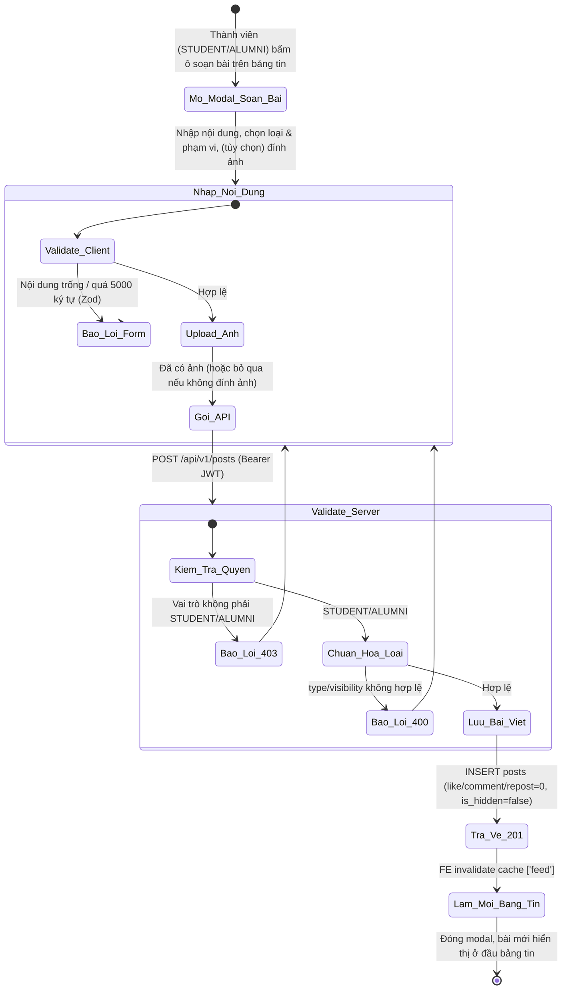
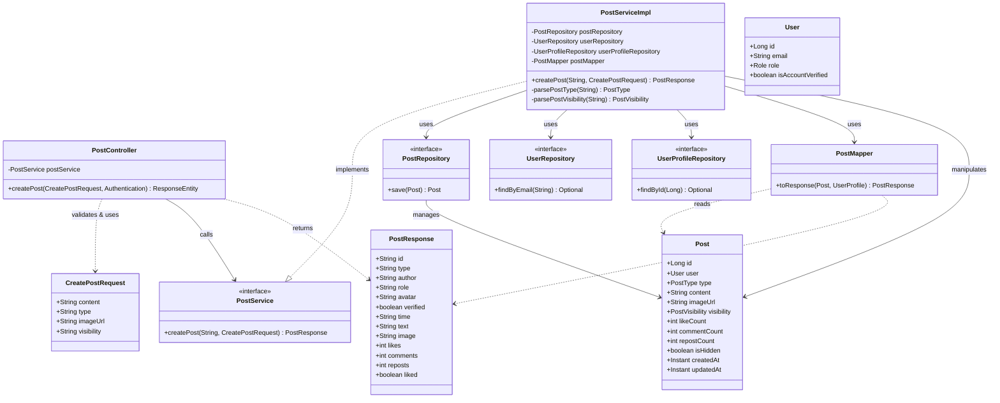
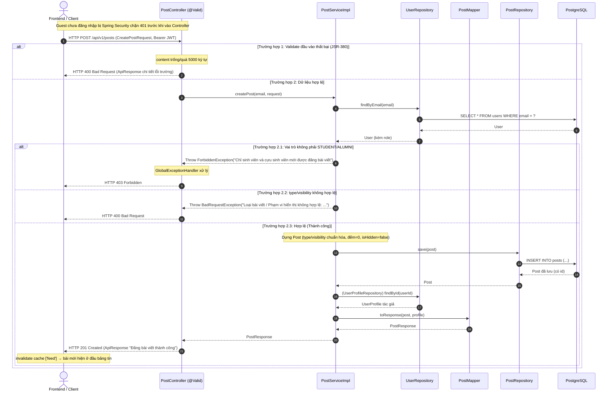

# ĐẶC TẢ YÊU CẦU & THIẾT KẾ CHI TIẾT: UC14 - TẠO BÀI VIẾT TRÊN BẢNG TIN (CREATE A POST ON THE FEED)

## PHẦN 1: ĐẶC TẢ NGHIỆP VỤ (REPORT 3)

### 2.2.3 Business Workflow (Luồng nghiệp vụ)

#### Mô tả chi tiết luồng xử lý bằng chữ (Business Step Description):
* **Bước 1 - Khởi đầu**: Thành viên đã đăng nhập với vai trò Sinh viên (STUDENT) hoặc Cựu sinh viên (ALUMNI) đang ở bảng tin cộng đồng (`/app`). Chỉ họ mới thấy ô soạn bài (Composer). Bấm vào ô soạn bài / nút loại bài (Achievement/Photo/Job/Event) / nút "Post" sẽ mở Modal soạn bài viết.
* **Bước 2 - Nhập liệu & Kiểm tra hợp lệ Client**: Người dùng nhập nội dung, chọn loại bài (mặc định Bài thường), chọn phạm vi hiển thị (mặc định Công khai) và có thể đính kèm một ảnh. Client kiểm tra bằng Zod (nội dung bắt buộc, tối đa 5000 ký tự). Nếu chọn ảnh, ảnh được tải lên Cloudflare R2 qua link ký sẵn (presigned URL) và nhận về URL công khai.
* **Bước 3 - Gửi & Kiểm tra phía Server**: Client gọi `POST /api/v1/posts` kèm Bearer JWT. Server:
  * Kiểm tra quyền: nếu vai trò không phải STUDENT/ALUMNI → ném lỗi 403 (RBAC).
  * Chuẩn hóa `type`/`visibility` (mặc định NORMAL/PUBLIC); giá trị không hợp lệ → lỗi 400.
  * Nếu hợp lệ, lưu bài viết mới vào bảng `posts` (các bộ đếm like/comment/repost = 0, `is_hidden = false`), trả về HTTP 201 kèm bài viết vừa tạo.
* **Bước 4 - Kết thúc**: Frontend nhận 201, làm mới cache bảng tin (`invalidateQueries(['feed'])`), đóng modal; bài viết mới xuất hiện ở đầu bảng tin (sắp xếp mới nhất trước). Guest chưa đăng nhập gọi API bị Spring Security chặn 401.

---

### 3.4 Module Cộng đồng: Bảng tin & Bài viết
Module 3 (Social) phụ trách bảng tin cộng đồng: xem bảng tin (UC15), xem chi tiết bài viết & bình luận (UC16) và **tạo bài viết mới (UC14)**. Bài viết là đơn vị nội dung do thành viên đăng, hiển thị theo dòng thời gian và có thể lọc theo loại.

#### 3.4.1 Tạo bài viết trên bảng tin (Create a post on the Feed)

**Function trigger**:
*   **Navigation path**: `/app` (bảng tin) → bấm ô soạn bài / nút Achievement·Photo·Job·Event / nút "Post" → mở Modal soạn bài viết.
*   **Timing Frequency**: On demand (bất cứ khi nào thành viên muốn chia sẻ nội dung với cộng đồng).

**Function description**:
*   **Actors/Roles**: Sinh viên (STUDENT), Cựu sinh viên (ALUMNI). Guest và Admin không có ô soạn bài (RBAC UI); Guest gọi API bị chặn 401, Admin bị chặn 403.
*   **Purpose**: Cho phép thành viên tạo và đăng một bài viết (văn bản, tùy chọn kèm ảnh) lên bảng tin cộng đồng để chia sẻ thành tựu, thông tin tuyển dụng, sự kiện hoặc nội dung thường.
*   **Interface**:
    *   **Ô soạn bài (Composer)** ở đầu bảng tin: avatar + dòng gợi ý "Share an achievement, ask, or post a job…" + các nút nhanh (Achievement/Photo/Job/Event) + nút "Post". Chỉ hiển thị cho STUDENT/ALUMNI.
    *   **Modal soạn bài**: ô nhập nội dung (textarea, bộ đếm ký tự tối đa 5000); bộ chọn **loại bài** (Bài thường / Thành tựu / Tuyển dụng / Sự kiện); bộ chọn **phạm vi hiển thị** (Công khai / Chỉ thành viên); vùng **đính kèm ảnh** tùy chọn (trạng thái "Đang tải ảnh lên…", ảnh preview + nút xóa); nút "Hủy" và nút "Đăng bài" (trạng thái "Đang đăng…").
    *   **Trạng thái**: Loading (nút "Đăng bài" khóa + spinner khi đang tải ảnh/đang gửi); Error (banner đỏ hiển thị nguyên văn thông điệp lỗi từ Backend); Success (modal đóng, bài mới hiện ở đầu bảng tin).

**Data processing**:
1.  Client kiểm tra dữ liệu qua Zod (`createPostSchema`): nội dung bắt buộc ≤ 5000 ký tự.
2.  (Tùy chọn) Tải ảnh: gọi `GET /api/v1/files/presigned-url`, PUT ảnh trực tiếp lên Cloudflare R2, nhận URL công khai gán vào `imageUrl`.
3.  Client gọi `POST /api/v1/posts` (Bearer JWT tự đính qua interceptor) với `{ content, type, imageUrl?, visibility }`.
4.  Server (`PostServiceImpl.createPost`): nạp User theo email (từ JWT); kiểm tra RBAC (STUDENT/ALUMNI); chuẩn hóa `type`/`visibility`; lưu `Post` vào bảng `posts` (BCrypt không liên quan; các bộ đếm = 0, `is_hidden=false`).
5.  Server nạp hồ sơ tác giả và map sang `PostResponse`, trả HTTP 201.
6.  Client `invalidateQueries(['feed'])` → bảng tin tự tải lại, hiển thị bài mới ở đầu.

**Screen layout**:
*   *Figure 1: Ô soạn bài trên bảng tin (Composer) — chỉ hiển thị cho Student/Alumni*
*   *Figure 2: Modal soạn & đăng bài viết (chọn loại, phạm vi, đính ảnh)*

**Function details**:
*   **Data**:
    *   `content` (String, bắt buộc, tối đa 5000 ký tự) — nội dung bài viết.
    *   `type` (String: "normal" | "achievement" | "recruitment" | "event", mặc định "normal").
    *   `imageUrl` (String, tối đa 500 ký tự, tùy chọn) — URL ảnh đính kèm.
    *   `visibility` (String: "public" | "members", mặc định "public").
    *   *Trả về (PostResponse)*: `id, type, author, role, avatar, verified, time, text, image, likes, comments, reposts, liked`.
*   **Validation**:
    *   Phía Client (Zod): `content` bắt buộc, ≤ 5000 ký tự; `type`/`visibility` theo enum.
    *   Phía Server: `@NotBlank` + `@Size(max=5000)` cho `content`, `@Size(max=500)` cho `imageUrl` (JSR-380 trên `CreatePostRequest`); `type`/`visibility` được chuẩn hóa & kiểm tra hợp lệ ở tầng Service.
*   **Business rules**: BR-CP-01 (RBAC: chỉ STUDENT/ALUMNI), BR-CP-02 (nội dung bắt buộc ≤ 5000), BR-CP-03 (type hợp lệ, mặc định NORMAL), BR-CP-04 (visibility hợp lệ, mặc định PUBLIC), BR-CP-05 (ảnh tùy chọn qua R2), BR-CP-06 (khởi tạo bộ đếm = 0, không ẩn).
*   **Error Handling**:
    *   Nội dung trống → 400 (MSG-CP-01). Nội dung quá dài → 400 (MSG-CP-02).
    *   Loại bài không hợp lệ → 400 (MSG-CP-04). Phạm vi không hợp lệ → 400 (MSG-CP-05).
    *   Không phải STUDENT/ALUMNI → 403 (MSG-CP-06). Guest chưa đăng nhập → 401 (MSG-CP-07).
    *   Tải ảnh thất bại (phía Client) → thông báo inline (MSG-CP-08).
*   **Normal case**: Thành viên nhập nội dung hợp lệ (tùy chọn kèm ảnh), bấm "Đăng bài"; hệ thống lưu bài, trả 201 "Đăng bài viết thành công"; modal đóng và bài viết mới xuất hiện ngay ở đầu bảng tin (không hiển thị toast riêng, phản hồi bằng việc bài xuất hiện).
*   **Abnormal case**: Vi phạm validation (nội dung trống/quá dài) hoặc giá trị type/visibility sai → 400 kèm thông điệp; Admin/vai trò khác → 403; Guest → 401; tải ảnh lên R2 lỗi → báo lỗi inline, không chặn việc đăng bài chỉ-văn-bản.

---

### 5. Requirement Appendix (Phụ lục Yêu cầu)

#### 5.1 Business Rules (Quy tắc Nghiệp vụ)

| ID | Định nghĩa Quy tắc (Rule Definition) |
| :--- | :--- |
| BR-CP-01 | Chỉ tài khoản đã đăng nhập với vai trò STUDENT hoặc ALUMNI mới được tạo bài viết. Guest bị chặn (401), Admin/vai trò khác bị từ chối (403). |
| BR-CP-02 | Nội dung bài viết là bắt buộc và không vượt quá 5000 ký tự. |
| BR-CP-03 | Loại bài viết phải thuộc {normal, achievement, recruitment, event}; bỏ trống mặc định là NORMAL. |
| BR-CP-04 | Phạm vi hiển thị phải thuộc {public, members}; bỏ trống mặc định là PUBLIC. Bài MEMBERS chỉ thành viên đã đăng nhập mới xem được trên bảng tin (liên quan BR-12, UC15). |
| BR-CP-05 | Ảnh đính kèm là tùy chọn (URL ≤ 500 ký tự), được tải trực tiếp lên Cloudflare R2 qua link ký sẵn trước khi tạo bài. |
| BR-CP-06 | Bài viết mới luôn khởi tạo với like_count = comment_count = repost_count = 0 và is_hidden = false. |

#### 5.2 Common Requirements (Yêu cầu Chung)
*   Mọi thông điệp lỗi hiển thị cho người dùng đều bằng **Tiếng Việt**, lấy nguyên văn từ Backend.
*   Ô soạn bài chỉ hiển thị cho vai trò được phép (RBAC UI); Guest tương tác được mời đăng nhập.
*   Giao diện tuân thủ Premium Pastel Design System, responsive trên di động và máy tính.
*   Toàn bộ giao tiếp client–server mã hóa qua HTTPS/TLS; token Bearer tự đính bởi interceptor.

#### 5.3 Application Messages List (Danh sách Thông điệp Ứng dụng)

| # | Mã thông điệp | Loại thông điệp | Ngữ cảnh | Nội dung hiển thị | HTTP |
| :--- | :--- | :--- | :--- | :--- | :--- |
| 1 | MSG-CP-01 | Inline (dưới ô) | Nội dung để trống | Nội dung bài viết không được để trống | 400 |
| 2 | MSG-CP-02 | Inline (dưới ô) | Nội dung vượt quá độ dài | Nội dung bài viết không được vượt quá 5000 ký tự | 400 |
| 3 | MSG-CP-03 | API response (201) | Tạo bài thành công (FE phản hồi bằng đóng modal + bài mới hiện ra) | Đăng bài viết thành công | 201 |
| 4 | MSG-CP-04 | Banner (Alert error) | Loại bài viết không hợp lệ | Loại bài viết không hợp lệ: {type} | 400 |
| 5 | MSG-CP-05 | Banner (Alert error) | Phạm vi hiển thị không hợp lệ | Phạm vi hiển thị không hợp lệ: {visibility} | 400 |
| 6 | MSG-CP-06 | Banner (Alert error) | Vai trò không được phép đăng bài | Chỉ sinh viên và cựu sinh viên mới được đăng bài viết | 403 |
| 7 | MSG-CP-07 | Chặn bởi Spring Security | Guest chưa đăng nhập | Bạn chưa đăng nhập hoặc phiên làm việc đã hết hạn. | 401 |
| 8 | MSG-CP-08 | Inline (phía Client) | Tải ảnh lên R2 thất bại | Tải ảnh lên thất bại. Vui lòng thử lại. | - |

---

## PHẦN 2: THIẾT KẾ CHI TIẾT (REPORT 4)

### 3. Detail Design (Thiết kế chi tiết)

#### 3.1 Chức năng Tạo bài viết trên bảng tin (Create a post on the Feed)

##### 3.1.1 Class Diagram (Sơ đồ Lớp)

###### Mô tả chi tiết cấu trúc các lớp (Class Design Description):
* **PostController**: Tiếp nhận `POST /api/v1/posts` (đã `@Valid`), lấy email tác giả từ `Authentication` (Spring Security nạp từ JWT), gọi `PostService.createPost` và trả về HTTP 201 kèm `PostResponse` bọc trong `ApiResponse`.
* **CreatePostRequest (DTO)**: Chứa 4 trường `content` (@NotBlank, @Size max 5000), `type`, `imageUrl` (@Size max 500), `visibility`; message validation bằng Tiếng Việt.
* **PostResponse (DTO)**: Cấu trúc phẳng khớp schema Zod `postSchema` phía Frontend để chèn ngay vào bảng tin.
* **PostService / PostServiceImpl**: Interface + lớp triển khai. `createPost` (@Transactional) thực hiện: nạp User theo email, kiểm tra RBAC (STUDENT/ALUMNI, ngược lại ném `ForbiddenException`), chuẩn hóa `type`/`visibility` (helper `parsePostType`/`parsePostVisibility`, ném `BadRequestException` nếu sai), lưu Post, map response.
* **PostMapper**: Lớp `@Component` ghép `Post` + `UserProfile` tác giả thành `PostResponse` (tính thời gian tương đối, headline làm role, avatar, huy hiệu verified).
* **PostRepository / UserRepository / UserProfileRepository**: Spring Data JPA — `save(Post)`, `findByEmail`, `findById` tương ứng bảng `posts`, `users`, `user_profiles`.
* **Post / User (Entity)**: Ánh xạ bảng `posts`/`users`. `Post` có `@PrePersist` tự gán `createdAt/updatedAt` và mặc định type=NORMAL, visibility=PUBLIC nếu null.

##### 3.1.2 Sequence Diagram (Sơ đồ Tuần tự)

###### Mô tả chi tiết luồng xử lý bằng chữ (Sequence Flow Description):
1.  **Luồng thành công (Normal Case)**: Client gửi `POST /api/v1/posts` kèm Bearer JWT và DTO hợp lệ. Controller lấy email từ `Authentication`, gọi `PostServiceImpl.createPost`. Service nạp User, xác nhận vai trò STUDENT/ALUMNI, chuẩn hóa type/visibility, dựng và lưu `Post` (đếm = 0, không ẩn), nạp hồ sơ tác giả rồi map sang `PostResponse`. Controller trả HTTP 201 "Đăng bài viết thành công". Frontend làm mới cache bảng tin để bài mới xuất hiện ngay.
2.  **Luồng lỗi Validation (400)**: Nếu `content` trống hoặc vượt 5000 ký tự, JSR-380 phát hiện, ném `MethodArgumentNotValidException`; `GlobalExceptionHandler` trả HTTP 400 kèm chi tiết lỗi trường.
3.  **Luồng lỗi RBAC (403)**: Nếu vai trò không phải STUDENT/ALUMNI, Service ném `ForbiddenException`; GlobalExceptionHandler trả HTTP 403. Guest chưa đăng nhập bị Spring Security chặn 401 ngay trước Controller.
4.  **Luồng lỗi Business (400)**: Nếu `type`/`visibility` không thuộc tập giá trị hợp lệ, Service ném `BadRequestException`; GlobalExceptionHandler trả HTTP 400 với thông điệp tương ứng.
