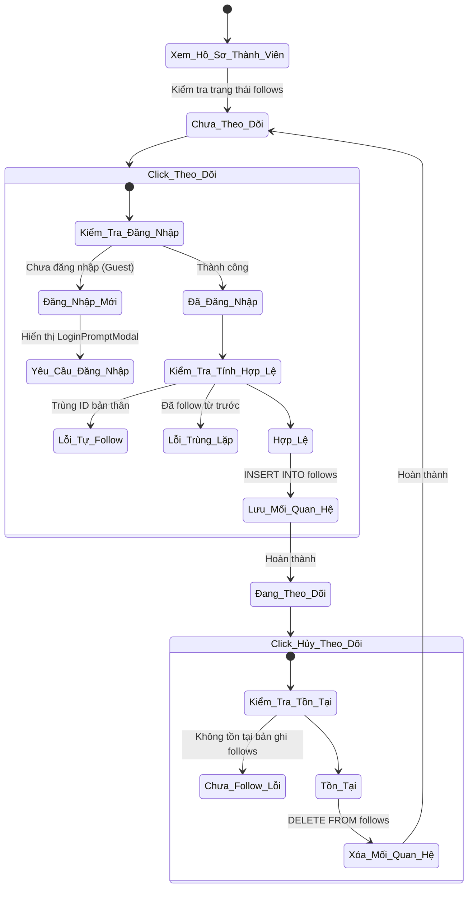
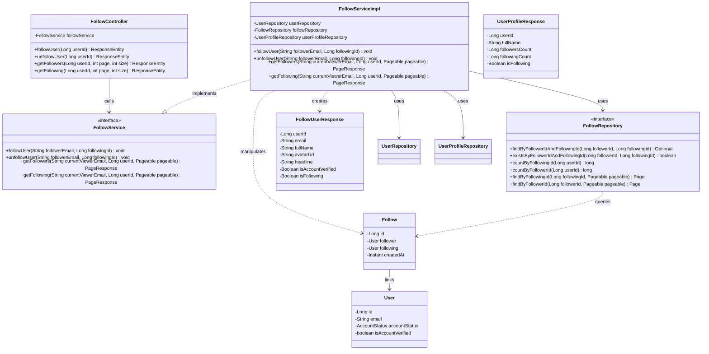
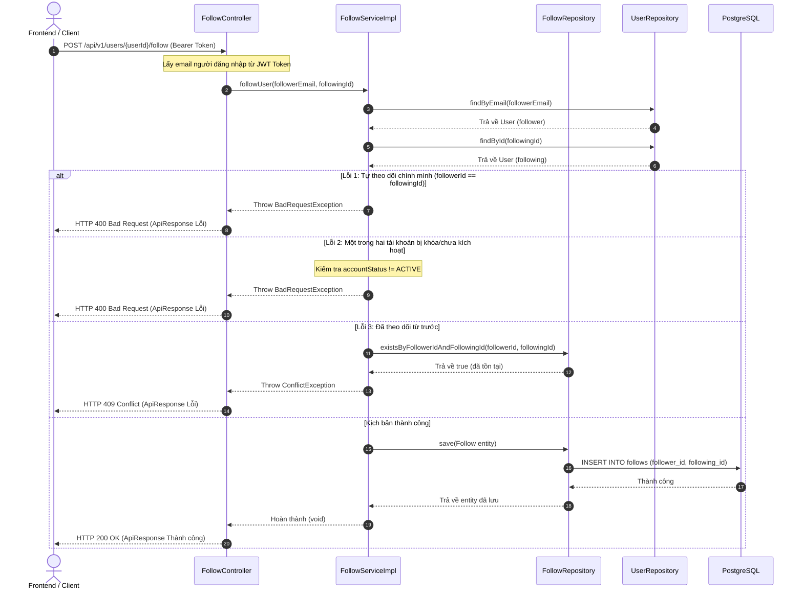

# ĐẶC TẢ YÊU CẦU & THIẾT KẾ CHI TIẾT: UC17 - THEO DÕI / HỦY THEO DÕI NGƯỜI DÙNG KHÁC

Tài liệu này đặc tả yêu cầu nghiệp vụ và mô hình thiết kế chi tiết cho chức năng theo dõi/hủy theo dõi người dùng khác (Follow/Unfollow) trong hệ thống **AlumNect**.

---

## PHẦN 1: ĐẶC TẢ NGHIỆP VỤ (REPORT 3)

### 2.2.3 Business Workflow (Luồng nghiệp vụ)

#### Mô tả chi tiết luồng xử lý bằng chữ (Business Step Description):
* **Bước 1 - Truy cập hồ sơ**: Người dùng (hoặc khách vãng lai) truy cập vào trang hồ sơ của một thành viên khác.
* **Bước 2 - Kiểm tra trạng thái theo dõi**: Hệ thống tự động kiểm tra xem tài khoản đang đăng nhập đã theo dõi thành viên này chưa (nếu chưa đăng nhập, mặc định là chưa theo dõi).
* **Bước 3 - Thực hiện theo dõi (Follow)**:
  - Nếu là Khách vãng lai: Hệ thống ngăn chặn và hiển thị `LoginPromptModal` mời đăng nhập.
  - Nếu đã đăng nhập: Người dùng click nút "Theo dõi". Hệ thống gửi request API POST lên backend.
  - Backend thực hiện kiểm tra tính hợp lệ (tài khoản đối phương có tồn tại và đang hoạt động không, có tự theo dõi chính mình không, đã theo dõi từ trước chưa).
  - Nếu thỏa mãn, backend lưu bản ghi theo dõi mới vào bảng `follows`, tăng số lượng `followersCount` của đối phương và `followingCount` của bản thân lên 1.
* **Bước 4 - Thực hiện hủy theo dõi (Unfollow)**:
  - Người dùng đang theo dõi nhấp chọn nút "Hủy theo dõi". Hệ thống gửi request API **DELETE** hủy theo dõi.
  - Backend kiểm tra xem bản ghi quan hệ theo dõi có tồn tại không. Nếu có, tiến hành xóa bản ghi, giảm số lượng theo dõi tương ứng đi 1.
* **Bước 5 - Kết thúc & Cập nhật UI**: Sau khi backend phản hồi thành công, frontend tự động làm mới bộ nhớ cache của React Query để hiển thị ngay lập tức các con số thống kê và trạng thái nút bấm mới mà không cần load lại trang.

---

### 3.2 Quản Lý Tài Khoản & Mạng Lưới (Account & Networking)
Module chịu trách nhiệm quản lý thông tin tài khoản thành viên, xây dựng hồ sơ cá nhân và mạng lưới kết nối tương tác giữa cựu sinh viên và sinh viên Đại học FPT.

#### 3.2.1 Theo dõi / Hủy theo dõi người dùng khác
* **Function trigger**:
  - **Navigation path**: Trang cá nhân của người dùng khác -> Nút "Theo dõi/Hủy theo dõi" ở Header hoặc danh sách người theo dõi của một ai đó -> Nút "Theo dõi/Hủy theo dõi" tương ứng với mỗi thẻ thành viên.
  - **Timing Frequency**: On demand (Mỗi khi người dùng nhấp chọn nút theo dõi).
* **Function description**:
  - **Actors/Roles**: Tất cả thành viên có tài khoản hoạt động (`ACTIVE`) bao gồm STUDENT, ALUMNI, ADMIN (Khách vãng lai chỉ có quyền xem danh sách chứ không được follow/unfollow).
  - **Purpose**: Cho phép người dùng kết nối mạng lưới, theo dõi các hoạt động, bài viết hoặc cập nhật sự nghiệp của các cựu sinh viên/sinh viên nổi bật khác.
  - **Interface**:
    - Nút "Theo dõi" (Màu tím oải hương pastel, chữ trắng, kèm icon `UserPlus`).
    - Nút "Hủy theo dõi" (Màu xám pastel, chữ mực mận chín, kèm icon `UserMinus`).
    - Modals hiển thị danh sách người theo dõi (Followers) và đang theo dõi (Following) có tích hợp nút follow nhanh kèm icon `UserPlus`/`UserMinus` và tải **cuộn vô hạn (Infinite Scroll)** tự động mượt mà.
* **Data processing**:
  - Nhận yêu cầu từ Client -> Lấy ID của đối tượng cần theo dõi -> Xác định email người dùng đăng nhập trong Security Context -> Kiểm tra DB xem tài khoản có ACTIVE và hợp lệ không -> Thực hiện INSERT/DELETE trên bảng `follows` -> Phản hồi kết quả chuẩn `ApiResponse`.
* **Screen layout**:
  - Tích hợp trực tiếp trên Header của Profile Page và thông qua hộp thoại Modal pop-up danh sách khi click vào bộ đếm.
* **Function details**:
  - **Data**: `follower_id` (ID người theo dõi), `following_id` (ID người được theo dõi), `created_at`.
  - **Validation**:
    - Trùng ID: `follower_id <> following_id`.
    - Trạng thái: `accountStatus == ACTIVE`.
    - Duy nhất: Cặp `(follower_id, following_id)` phải là duy nhất.
  - **Business rules**:
    - Chỉ tài khoản đã kích hoạt và không bị khóa mới được tương tác theo dõi.
    - Không thể tự theo dõi chính mình.
  - **Error Handling**:
    - Trả về mã lỗi 400 Bad Request kèm thông báo tiếng Việt cụ thể nếu vi phạm quy định validation hoặc tự follow.
    - Trả về mã lỗi 409 Conflict nếu đã follow từ trước.
  - **Normal case**: Thực hiện thành công, cập nhật số lượng theo dõi và thay đổi trạng thái nút bấm trên UI ngay lập tức.
  - **Abnormal case**: Lỗi kết nối mạng, token JWT hết hạn (chuyển hướng về trang đăng nhập hoặc mở popup mời đăng nhập).

---

### 5. Requirement Appendix (Phụ lục Yêu cầu)

#### 5.1 Business Rules (Quy tắc Nghiệp vụ)

| ID | Định nghĩa Quy tắc (Rule Definition) |
| :--- | :--- |
| BR-FOLLOW-01 | Người dùng không được phép tự theo dõi chính mình dưới mọi hình thức. |
| BR-FOLLOW-02 | Một người dùng chỉ được theo dõi một người dùng khác tối đa 1 lần (quan hệ 1 chiều duy nhất). |
| BR-FOLLOW-03 | Chỉ những tài khoản có trạng thái hoạt động (`ACTIVE`) mới được tham gia vào quan hệ theo dõi. |
| BR-FOLLOW-04 | Khách vãng lai (Guest) chưa đăng nhập chỉ được xem danh sách và bộ đếm chứ không có quyền gửi request theo dõi. |

#### 5.3 Application Messages List (Danh sách Thông điệp Ứng dụng)

| # | Mã thông điệp (Message code) | Loại thông điệp (Message Type) | Ngữ cảnh (Context) | Nội dung hiển thị (Content) |
| :--- | :--- | :--- | :--- | :--- |
| 1 | MSG_FOLLOW_01 | Toast / Alert | Theo dõi thành công | Theo dõi người dùng thành công! |
| 2 | MSG_FOLLOW_02 | Toast / Alert | Hủy theo dõi thành công | Hủy theo dõi người dùng thành công! |
| 3 | MSG_FOLLOW_03 | Inline Error | Tự theo dõi bản thân | Bạn không thể tự theo dõi chính mình. |
| 4a | MSG_FOLLOW_04A | Inline Error | Tài khoản bản thân bị khóa | Tài khoản của bạn chưa được kích hoạt hoặc đã bị khóa. |
| 4b | MSG_FOLLOW_04B | Inline Error | Tài khoản người được theo dõi bị khóa | Tài khoản người dùng cần theo dõi chưa được kích hoạt hoặc đã bị khóa. |
| 5 | MSG_FOLLOW_05 | Inline Error | Đã theo dõi từ trước | Bạn đã theo dõi người dùng này từ trước. |
| 6 | MSG_FOLLOW_06 | Inline Error | Hủy theo dõi khi chưa theo dõi | Bạn chưa theo dõi người dùng này. |

---

## PHẦN 2: THIẾT KẾ CHI TIẾT (REPORT 4)

### 3. Detail Design (Thiết kế chi tiết)

#### 3.1 Theo dõi và Hủy theo dõi (Follow & Unfollow)

##### 3.1.1 Class Diagram (Sơ đồ Lớp)

###### Mô tả chi tiết cấu trúc các lớp (Class Design Description):
* **Lớp Controller (`FollowController`)**: Tiếp nhận các yêu cầu REST API, thực hiện định tuyến và lấy thông tin người dùng đang đăng nhập từ Security Context để gọi sang lớp Service xử lý.
* **Lớp Service (`FollowService` và `FollowServiceImpl`)**: Chứa logic xử lý nghiệp vụ theo dõi/hủy theo dõi và truy xuất danh sách phân trang kèm theo logic xác định người xem hiện tại đã follow những ai.
* **Lớp DTO (`FollowUserResponse`, `UserProfileResponse`)**: Chứa cấu trúc dữ liệu trả về cho client. `FollowUserResponse` đại diện thông tin hiển thị thu gọn trong danh sách followers/following.
* **Lớp Repository (`FollowRepository`)**: Cung cấp các hàm truy vấn trực tiếp bảng `follows` bằng Spring Data JPA.
* **Lớp Entity (`Follow`)**: Ánh xạ bảng cơ sở dữ liệu `follows` để lưu thông tin mối quan hệ theo dõi.

---

##### 3.1.2 Sequence Diagram (Sơ đồ Tuần tự)

###### Mô tả chi tiết luồng xử lý bằng chữ (Sequence Flow Description):
1. **Luồng thành công**:
   - Client gửi yêu cầu theo dõi (POST) kèm Bearer Token của tài khoản hiện tại.
   - `FollowController` nhận request, bóc tách email từ token và gọi `followUser(...)` của `FollowServiceImpl`.
   - Service kiểm tra: cả người follow và người được follow đều tồn tại và hoạt động (ACTIVE), không tự follow bản thân và chưa từng follow trước đó.
   - Service tạo thực thể `Follow`, gọi Repository lưu xuống bảng `follows` trong `PostgreSQL`.
   - Hệ thống trả về HTTP 200 OK kèm thông báo thành công cho Client.
2. **Các luồng ngoại lệ**:
   - Nếu tự theo dõi chính mình: Ném `BadRequestException`, trả về HTTP 400 Bad Request.
   - Nếu tài khoản chưa được kích hoạt hoặc bị khóa: Ném `BadRequestException`, trả về HTTP 400 Bad Request.
   - Nếu mối quan hệ theo dõi đã tồn tại từ trước: Ném `ConflictException`, trả về HTTP 409 Conflict.
