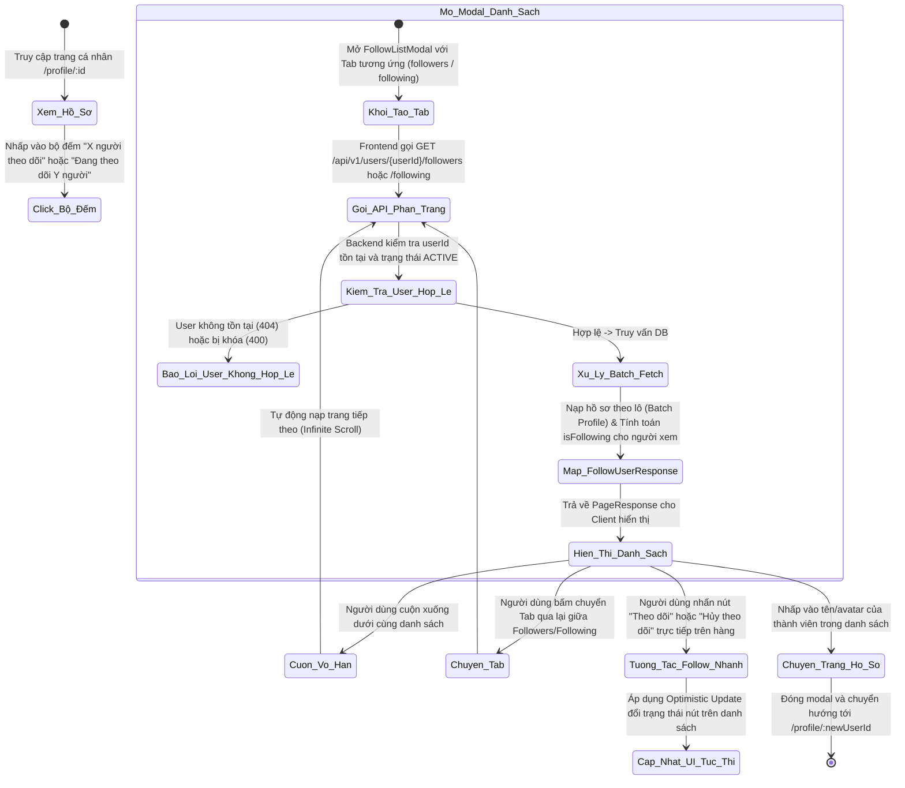
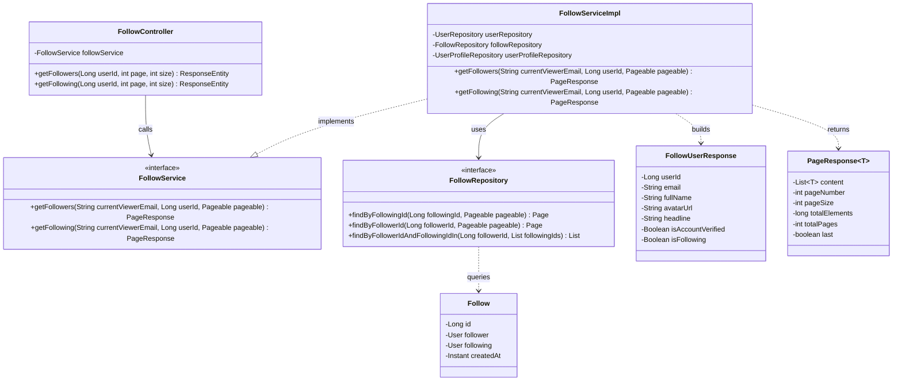
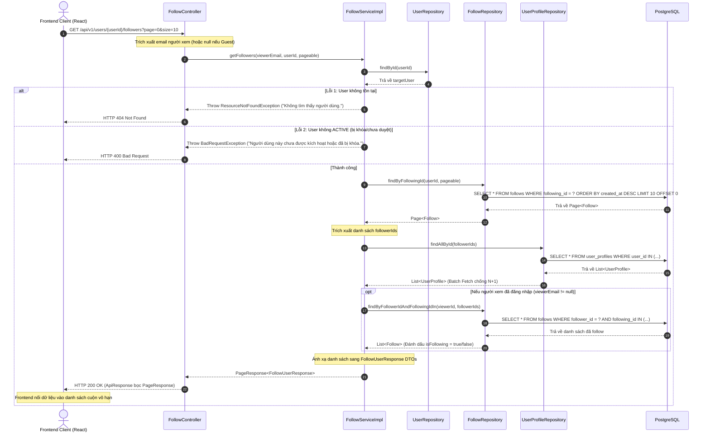

# ĐẶC TẢ YÊU CẦU & THIẾT KẾ CHI TIẾT: UC18 - XEM DANH SÁCH NGƯỜI THEO DÕI VÀ ĐANG THEO DÕI

Tài liệu này đặc tả yêu cầu nghiệp vụ và mô hình thiết kế chi tiết cho chức năng xem danh sách người theo dõi (Followers) và người đang theo dõi (Following) trong hệ thống **AlumNect**.

---

## PHẦN 1: ĐẶC TẢ NGHIỆP VỤ (REPORT 3)

### 2.2.3 Business Workflow (Luồng nghiệp vụ)

#### Mô tả chi tiết luồng xử lý bằng chữ (Business Step Description):
* **Bước 1 - Khởi đầu (Tác nhân kích hoạt)**: Người dùng (bao gồm cả khách vãng lai và thành viên đã đăng nhập) đang xem trang cá nhân của một tài khoản và nhấp vào số lượng "người theo dõi" hoặc "đang theo dõi".
* **Bước 2 - Các bước chuyển tiếp**:
  - Hệ thống mở hộp thoại `FollowListModal` với tab tương ứng được chọn sẵn.
  - Frontend gửi yêu cầu `GET /api/v1/users/{userId}/followers` (hoặc `GET /api/v1/users/{userId}/following`) kèm số trang `page=0` và `size=10`.
  - Backend kiểm tra tài khoản mục tiêu: nếu không tồn tại trả về 404, nếu bị khóa (`LOCKED` hoặc `PENDING`) trả về 400 Bad Request.
  - Backend truy vấn bảng `follows`, nạp thông tin hồ sơ theo lô (`findAllById`) để tránh lỗi N+1 query. Nếu người xem hiện tại đã đăng nhập, Backend tính toán cờ `isFollowing` đối với từng thành viên trong danh sách.
  - Frontend render danh sách thẻ thành viên gồm: Avatar, Họ tên, Huy hiệu xác thực, Tiêu đề nghề nghiệp (Headline), và nút Follow / Unfollow nhanh tương ứng.
  - Khi người dùng cuộn danh sách xuống dưới, `useInfiniteQuery` tự động gọi các trang tiếp theo (`page=1`, `page=2`,...) nối vào danh sách hiện tại.
  - Người dùng có thể nhấn nút "Theo dõi" / "Hủy theo dõi" nhanh trực tiếp trên từng hàng thành viên (áp dụng Optimistic Update tức thì).
* **Bước 3 - Kết thúc**: Người dùng có thể đóng modal hoặc click vào thẻ thành viên để chuyển hướng sang xem trang cá nhân của người đó.

---

### 3.3 Quản Lý Hồ Sơ & Mạng Lưới (Profile & Networking)
Module chịu trách nhiệm quản lý thông tin hồ sơ cá nhân, trình độ học vấn, kỹ năng, kinh nghiệm và mạng lưới kết nối tương tác giữa cựu sinh viên và sinh viên Đại học FPT.

#### 3.3.2 Xem danh sách người theo dõi và đang theo dõi (View Followers / Following List)

**Function trigger**:
* **Navigation path**: Header trang cá nhân `/app/profile` hoặc `/app/profile?userId={id}` $\rightarrow$ Nhấp vào liên kết bộ đếm `"{followersCount} người theo dõi"` hoặc `"Đang theo dõi {followingCount} người"`.
* **Timing Frequency**: On demand (Mỗi khi người dùng nhấp vào bộ đếm).

**Function description**:
* **Actors/Roles**: Tất cả người dùng (Khách vãng lai, STUDENT, ALUMNI, ADMIN).
* **Purpose**: Cho phép cộng đồng khám phá mạng lưới kết nối của một thành viên, tìm kiếm bạn bè cùng khóa/ngành và mở rộng kết nối nghề nghiệp.
* **Interface**:
  - Hộp thoại `FollowListModal` với 2 Tab: "Người theo dõi" và "Đang theo dõi".
  - Thẻ thông tin mỗi thành viên: Ảnh đại diện (Avatar), Họ và tên (Full Name), Huy hiệu tài khoản chính thức (Verified Badge), Dòng giới thiệu chức danh/ngành học (Headline).
  - Nút tương tác nhanh: Nút "Theo dõi" (Màu tím pastel, icon `UserPlus`) hoặc "Hủy theo dõi" (Màu xám pastel, icon `UserMinus`) ở bên phải mỗi hàng (ẩn đối với chính bản thân).
  - Trạng thái rỗng (Empty State): Thông báo "Chưa có người theo dõi nào" hoặc "Chưa theo dõi ai".
  - Trạng thái tải: Skeleton loading và Spinner cuộn trang vô hạn.

**Data processing**:
1. Nhận yêu cầu GET phân trang với `userId`, `page`, `size`.
2. Kiểm tra tồn tại và trạng thái `ACTIVE` của `userId`.
3. Truy vấn danh sách quan hệ từ bảng `follows` theo thứ tự mới nhất trước (`createdAt DESC`).
4. Nạp thông tin hồ sơ theo lô từ bảng `user_profiles`.
5. So khớp quan hệ theo dõi của người xem hiện tại (nếu đã đăng nhập) để trả về cờ `isFollowing: true/false`.
6. Phản hồi cấu trúc `PageResponse<FollowUserResponse>`.

**Screen layout**:
* Figure 1: Followers / Following Modal Layout for Mobile & Website
* Figure 2: Quick Follow Action on List Item Layout

**Function details**:
* **Data**: `userId`, `email`, `fullName`, `avatarUrl`, `headline`, `isAccountVerified`, `isFollowing`, `pageNumber`, `pageSize`, `totalElements`, `totalPages`, `last`.
* **Validation**:
  - `userId` phải là số nguyên dương hợp lệ.
  - `page` $\ge$ 0, `size` từ 1 đến 50 (mặc định: `page=0`, `size=10`).
* **Business rules**:
  - Khách vãng lai (Guest) được phép xem danh sách nhưng khi bấm nút Theo dõi nhanh sẽ được mở `LoginPromptModal` yêu cầu đăng nhập.
  - Danh sách sắp xếp theo thời gian theo dõi gần nhất lên đầu (`createdAt DESC`).
  - Tối ưu hóa truy vấn cơ sở dữ liệu bằng cơ chế Batch Fetching để loại bỏ triệt để vấn đề N+1 query.
* **Error Handling**:
  - **404 Not Found**: Người dùng cần xem không tồn tại.
  - **400 Bad Request**: Tài khoản người dùng cần xem chưa kích hoạt hoặc đã bị khóa.
  - **Network Error**: Hiển thị thông báo lỗi và nút thử lại (Retry).
* **Normal case**: Hiển thị danh sách mượt mà, cuộn vô hạn liên tục khi người dùng lướt xem.
* **Abnormal case**: Lỗi tải mạng, hiển thị thông báo lỗi thân thiện.

---

### 5. Requirement Appendix (Phụ lục Yêu cầu)

#### 5.1 Business Rules (Quy tắc Nghiệp vụ)

| ID | Định nghĩa Quy tắc (Rule Definition) |
| :--- | :--- |
| BR-FOLLOWLIST-01 | Danh sách người theo dõi và đang theo dõi là công khai, cho phép cả khách vãng lai và thành viên đã đăng nhập tra cứu. |
| BR-FOLLOWLIST-02 | Kích thước trang tối đa cho mỗi lần truy vấn là 50 bản ghi để ngăn ngừa tấn công DoS tải dữ liệu. |
| BR-FOLLOWLIST-03 | Nút thao tác nhanh phải tự động ẩn đi đối với bản ghi đại diện cho chính tài khoản đang đăng nhập. |
| BR-FOLLOWLIST-04 | Dữ liệu danh sách phải được sắp xếp theo thời gian tạo giảm dần (`createdAt DESC`). |

#### 5.3 Application Messages List (Danh sách Thông điệp Ứng dụng)

| # | Mã thông điệp | Loại thông điệp | Ngữ cảnh | Nội dung hiển thị |
| :--- | :--- | :--- | :--- | :--- |
| 1 | MSG_FL_01 | Toast / Alert | Lấy danh sách thành công | Lấy danh sách người theo dõi thành công! |
| 2 | MSG_FL_02 | Toast / Alert | Lấy danh sách đang theo dõi thành công | Lấy danh sách đang theo dõi thành công! |
| 3 | MSG_FL_03 | Inline Error | Không tìm thấy người dùng | Không tìm thấy người dùng. |
| 4 | MSG_FL_04 | Inline Error | Tài khoản bị khóa | Người dùng này chưa được kích hoạt hoặc đã bị khóa. |
| 5 | MSG_FL_05 | Empty State | Danh sách người theo dõi trống | Chưa có người theo dõi nào |
| 6 | MSG_FL_06 | Empty State | Danh sách đang theo dõi trống | Chưa theo dõi ai |

---

## PHẦN 2: THIẾT KẾ CHI TIẾT (REPORT 4)

### 3. Detail Design (Thiết kế chi tiết)

#### 3.1 Xem danh sách người theo dõi / đang theo dõi (View Followers & Following)

##### 3.1.1 Class Diagram (Sơ đồ Lớp)

###### Mô tả chi tiết cấu trúc các lớp (Class Design Description):
* **Lớp Controller (`FollowController`)**: Cung cấp 2 endpoints `GET /api/v1/users/{userId}/followers` và `GET /api/v1/users/{userId}/following`, kiểm tra giới hạn `size <= 50`, trích xuất email người xem từ SecurityContext và gọi Service.
* **Lớp Service (`FollowServiceImpl`)**: Triển khai logic nạp danh sách, nạp batch profiles và tính toán cờ `isFollowing`.
* **Lớp DTO (`FollowUserResponse`, `PageResponse`)**: Đóng gói dữ liệu trả về cho Client với đầy đủ thông tin phân trang và trạng thái quan hệ.
* **Lớp Repository (`FollowRepository`)**: Cung cấp các phương thức truy vấn Spring Data JPA phân trang và tìm kiếm theo lô (`findByFollowerIdAndFollowingIdIn`).

##### 3.1.2 Sequence Diagram (Sơ đồ Tuần tự)

###### Mô tả chi tiết luồng xử lý bằng chữ (Sequence Flow Description):
1. **Tiếp nhận & Xác thực yêu cầu**: Client gửi request GET tới `/followers` hoặc `/following`. Controller chuẩn hóa tham số phân trang (`page >= 0`, `size <= 50`), bóc tách email người xem nếu có và chuyển tiếp sang Service.
2. **Kiểm tra trạng thái đối tượng**: Service kiểm tra tài khoản mục tiêu trong `UserRepository`. Nếu không tìm thấy trả về 404; nếu tài khoản không ở trạng thái `ACTIVE` trả về lỗi 400.
3. **Truy vấn phân trang & Tối ưu hóa hiệu năng (Batch Fetching)**:
   - Service gọi `FollowRepository` lấy trang danh sách quan hệ theo thứ tự thời gian mới nhất (`createdAt DESC`).
   - Service trích xuất toàn bộ danh sách ID của các đối tượng liên quan và gọi `userProfileRepository.findAllById(ids)` trong **1 truy vấn duy nhất**, tránh hoàn toàn hiện tượng N+1 query.
   - Nếu người xem đã đăng nhập, Service kiểm tra quan hệ theo dõi của người xem với toàn bộ danh sách bằng hàm `findByFollowerIdAndFollowingIdIn(...)` trong **1 truy vấn duy nhất**.
4. **Phản hồi Client & Cuộn vô hạn**: Hệ thống đóng gói danh sách thành `PageResponse` trả về HTTP 200 OK. Frontend render danh sách người dùng và tự động kích hoạt tải tiếp khi cuộn tới cuối trang.
