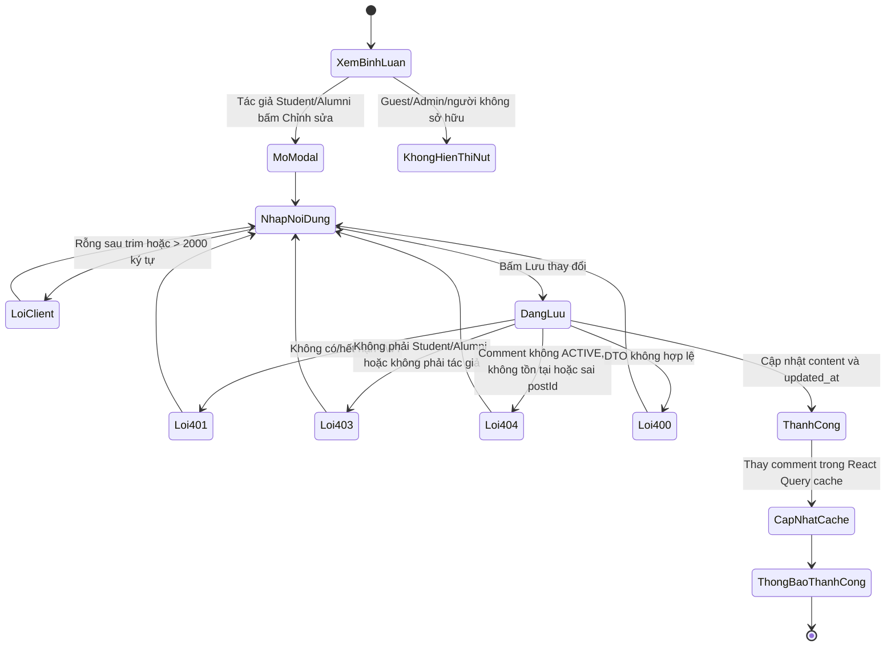
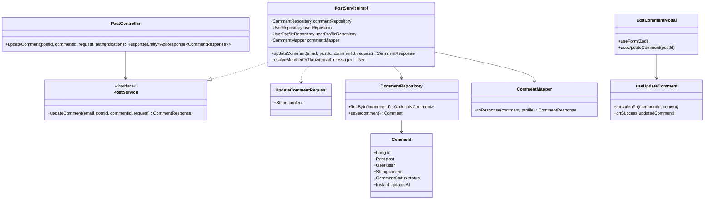
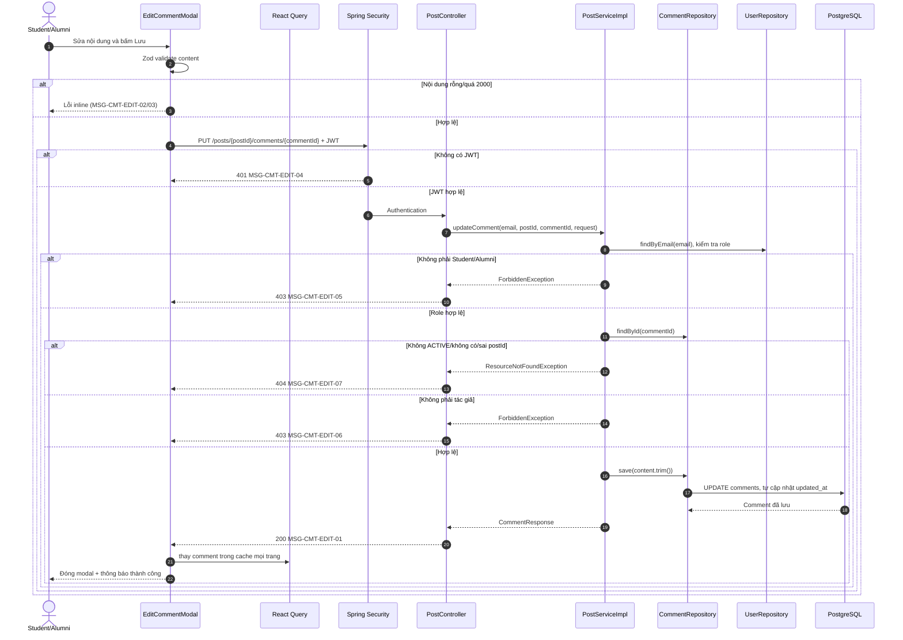

# ĐẶC TẢ YÊU CẦU & THIẾT KẾ CHI TIẾT: UC19 - Chỉnh sửa bình luận

## PHẦN 1: ĐẶC TẢ NGHIỆP VỤ (REPORT 3)

### 2.2.3 Business Workflow (Luồng nghiệp vụ)

#### Mô tả chi tiết luồng xử lý

1. Student hoặc Alumni đã đăng nhập xem comment của chính mình tại `/app/posts/{postId}` và thấy nút **Chỉnh sửa**; Guest, Admin và người không sở hữu không thấy nút này.
2. Người dùng mở modal, nhập nội dung. React Hook Form + Zod trim nội dung, yêu cầu không rỗng và không quá 2.000 ký tự.
3. Frontend gọi `PUT /api/v1/posts/{postId}/comments/{commentId}` với Bearer JWT và body `{ "content": "..." }`.
4. Spring Security từ chối request không có JWT bằng HTTP 401. Service kiểm tra người gọi là `STUDENT`/`ALUMNI`, comment có `status = ACTIVE`, comment thuộc đúng `postId`, rồi kiểm tra `comment.user.id` trùng người gọi.
5. Nếu hợp lệ, Service trim nội dung, lưu `comments.content`; JPA `@PreUpdate` cập nhật `updated_at` trong cùng transaction. `comment_count`, `parent_comment_id` và `created_at` không thay đổi.
6. Backend trả HTTP 200 với `ApiResponse<CommentResponse>`. React Query thay đúng comment trên mọi trang cache `['post-comments', postId]`, đóng modal và hiển thị xác nhận thành công.

### 3.2 Module 3 - Social: Feed, Posts, Events, Packages & Messaging

#### 3.2.1 UC19 - Chỉnh sửa bình luận

**Function trigger**

- Navigation path: `/app/posts/{postId}` → khu vực Bình luận → nút **Chỉnh sửa** của comment thuộc tài khoản hiện tại.
- Timing/Frequency: On demand.

**Function description**

- Actors/Roles: Student, Alumni.
- Purpose: Cho phép tác giả sửa nội dung bình luận đang hiển thị mà không ảnh hưởng reply, thứ tự hoặc bộ đếm comment.
- Interface: Nút text có icon bút chỉ hiện cho tác giả hợp lệ; modal Premium Pastel có textarea, bộ đếm `N/2000`, lỗi inline, trạng thái `Đang lưu…`, Hủy và Lưu thay đổi. Thành công hiển thị thông báo xanh trong khu bình luận.
- Responsive: Modal `max-w-lg`, textarea co giãn, nút thao tác vẫn khả dụng trên màn hình hẹp.

**Data processing**

- Request: `UpdateCommentRequest.content`.
- Response: `CommentResponse` (`id`, `authorId`, `author`, `role`, `avatar`, `verified`, `time`, `text`, `parentId`).
- Persistence: chỉ cập nhật `comments.content` và `comments.updated_at`; không cần migration/schema mới vì hai cột đã tồn tại trong schema chạy hiện tại.

**Validation**

- `content`: bắt buộc sau trim; tối đa 2.000 ký tự.
- Frontend và backend dùng nguyên văn cùng message tiếng Việt.

**Normal case**

- Tác giả Student/Alumni sửa comment ACTIVE của đúng bài viết; nhận 200, comment thay đổi ngay trong UI và có thông báo thành công.

**Abnormal case**

- Guest/hết phiên: 401.
- Admin hoặc thành viên khác: 403.
- Comment đã xóa/không có/sai post trên URL: 404.
- Nội dung trống hoặc quá dài: 400.

### 5. Requirement Appendix

#### 5.1 Business Rules

| ID | Quy tắc |
| :--- | :--- |
| BR-CMT-EDIT-01 | Chỉ `STUDENT` hoặc `ALUMNI` đã xác thực mới được gọi API chỉnh sửa. |
| BR-CMT-EDIT-02 | Chỉ tác giả (`comments.user_id`) được sửa comment của chính mình; Admin không có ngoại lệ ở UC19. |
| BR-CMT-EDIT-03 | Chỉ comment `ACTIVE` có thể sửa; `DELETED`/`HIDDEN` được xem là không còn khả dụng. |
| BR-CMT-EDIT-04 | `postId` trên URL phải trùng bài viết của comment để ngăn sửa chéo tài nguyên. |
| BR-CMT-EDIT-05 | Nội dung được trim, bắt buộc và không vượt quá 2.000 ký tự. |
| BR-CMT-EDIT-06 | Sửa comment không thay đổi `comment_count`, quan hệ comment cha hay thời điểm tạo. |

#### 5.2 Application Messages List

| Mã | Ngữ cảnh | Nội dung | HTTP |
| :--- | :--- | :--- | :--- |
| MSG-CMT-EDIT-01 | Thành công | `Chỉnh sửa bình luận thành công` | 200 |
| MSG-CMT-EDIT-02 | Rỗng | `Nội dung bình luận không được để trống` | 400 |
| MSG-CMT-EDIT-03 | Quá dài | `Nội dung bình luận không được vượt quá 2000 ký tự` | 400 |
| MSG-CMT-EDIT-03A | JSON body sai cú pháp | `Dữ liệu gửi lên không hợp lệ` | 400 |
| MSG-CMT-EDIT-04 | Chưa đăng nhập | `Bạn chưa đăng nhập hoặc phiên làm việc đã hết hạn.` | 401 |
| MSG-CMT-EDIT-05 | Sai role | `Chỉ sinh viên và cựu sinh viên mới được chỉnh sửa bình luận` | 403 |
| MSG-CMT-EDIT-06 | Không phải tác giả | `Bạn chỉ được chỉnh sửa bình luận của chính mình` | 403 |
| MSG-CMT-EDIT-07 | Không khả dụng/sai post | `Bình luận này không còn khả dụng` | 404 |

## PHẦN 2: THIẾT KẾ CHI TIẾT (REPORT 4)

### 3. Detail Design

#### 3.1.1 Class Diagram

#### 3.1.2 Sequence Diagram

