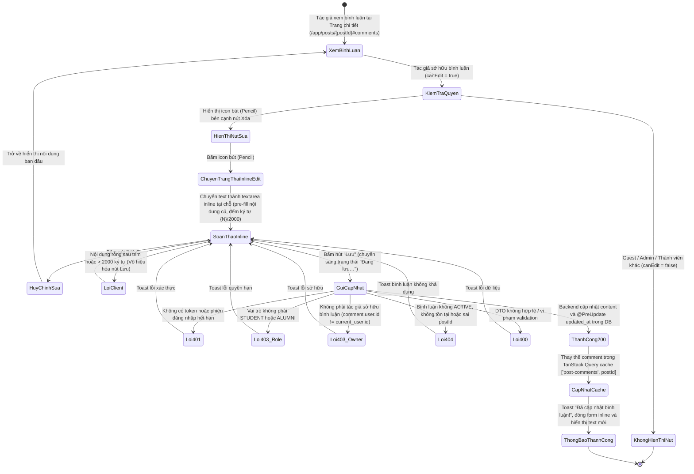
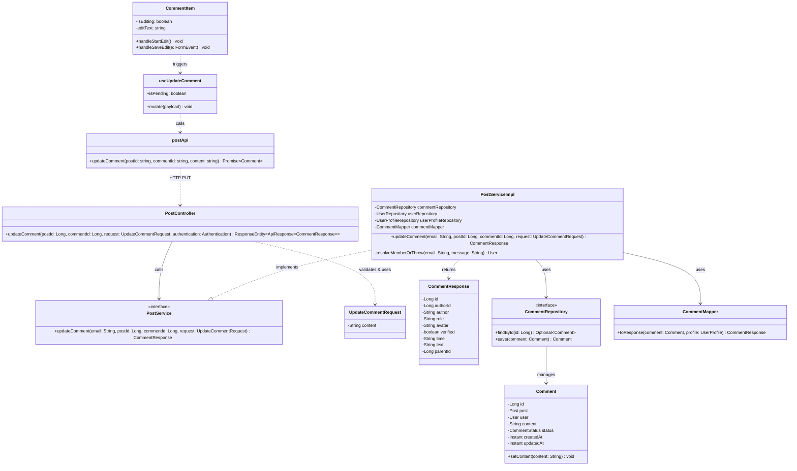
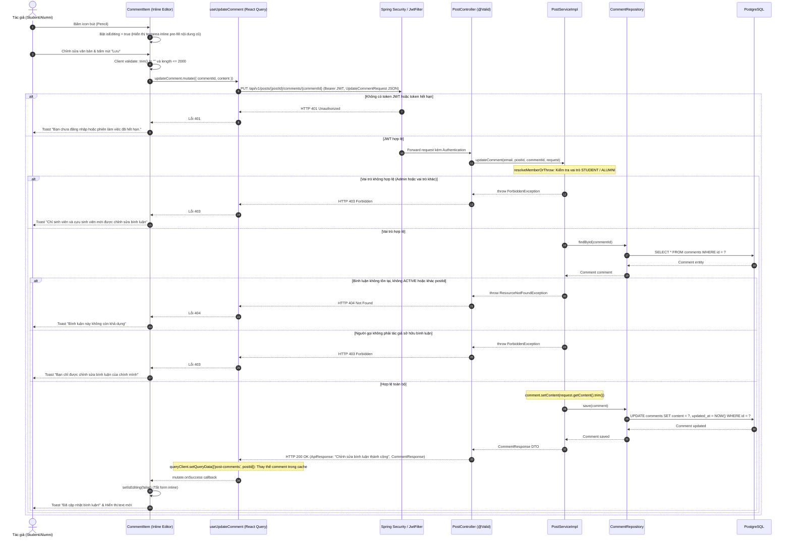

# ĐẶC TẢ YÊU CẦU & THIẾT KẾ CHI TIẾT: UC19 - Chỉnh sửa bình luận (Edit Comment)

## PHẦN 1: ĐẶC TẢ NGHIỆP VỤ (REPORT 3)

### 2.2.3 Business Workflow (Luồng nghiệp vụ)

```mermaid
stateDiagram-v2
    [*] --> XemBinhLuan : Tác giả xem bình luận tại Trang chi tiết (/app/posts/{postId}#comments)
    XemBinhLuan --> KiemTraQuyen : Tác giả sở hữu bình luận (canEdit = true)
    KiemTraQuyen --> HienThiNutSua : Hiển thị icon bút (Pencil) bên cạnh nút Xóa
    KiemTraQuyen --> KhongHienThiNut : Guest / Admin / Thành viên khác (canEdit = false)
    KhongHienThiNut --> [*]
    
    HienThiNutSua --> ChuyenTrangThaiInlineEdit : Bấm icon bút (Pencil)
    ChuyenTrangThaiInlineEdit --> SoanThaoInline : Chuyển text thành textarea inline tại chỗ (pre-fill nội dung cũ, đếm ký tự {N}/2000)
    
    SoanThaoInline --> HuyChinhSua : Bấm nút "Hủy"
    HuyChinhSua --> XemBinhLuan : Trở về hiển thị nội dung ban đầu
    
    SoanThaoInline --> LoiClient : Nội dung rỗng sau trim hoặc > 2000 ký tự (Vô hiệu hóa nút Lưu)
    LoiClient --> SoanThaoInline
    
    SoanThaoInline --> GuiCapNhat : Bấm nút "Lưu" (chuyển sang trạng thái "Đang lưu…")
    
    GuiCapNhat --> Loi401 : Không có token hoặc phiên đăng nhập hết hạn
    GuiCapNhat --> Loi403_Role : Vai trò không phải STUDENT hoặc ALUMNI
    GuiCapNhat --> Loi403_Owner : Không phải tác giả sở hữu bình luận (comment.user.id != current_user.id)
    GuiCapNhat --> Loi404 : Bình luận không ACTIVE, không tồn tại hoặc sai postId
    GuiCapNhat --> Loi400 : DTO không hợp lệ / vi phạm validation
    GuiCapNhat --> ThanhCong200 : Backend cập nhật content và @PreUpdate updated_at trong DB
    
    ThanhCong200 --> CapNhatCache : Thay thế comment trong TanStack Query cache ['post-comments', postId]
    CapNhatCache --> ThongBaoThanhCong : Toast "Đã cập nhật bình luận!", đóng form inline và hiển thị text mới
    ThongBaoThanhCong --> [*]
    
    Loi401 --> SoanThaoInline : Toast lỗi xác thực
    Loi403_Role --> SoanThaoInline : Toast lỗi quyền hạn
    Loi403_Owner --> SoanThaoInline : Toast lỗi sở hữu
    Loi404 --> SoanThaoInline : Toast bình luận không khả dụng
    Loi400 --> SoanThaoInline : Toast lỗi dữ liệu
```

#### Mô tả chi tiết luồng xử lý bằng chữ (Business Step Description):

- **Bước 1 - Khởi đầu & Điều hướng**:
  - Tại **Bảng tin (`FeedPage` tại `/app`)**: Khối bình luận nhanh (`InlineComments`) chỉ hiển thị ô nhập bình luận mới và xem trước tối đa 3 bình luận mới nhất (`displayComments`). Khối này **không có nút chỉnh sửa** để giữ giao diện bảng tin gọn gàng.
  - Để chỉnh sửa bình luận: Tác giả nhấp vào liên kết **"Xem tất cả {totalComments} bình luận"** hoặc nhấp vào thẻ bài viết để chuyển sang **Trang chi tiết bài viết (`PostDetailPage` tại `/app/posts/{postId}#comments`)**, nơi hiển thị luồng bình luận đầy đủ dạng cây phân nhánh.
- **Bước 2 - Kiểm tra quyền hiển thị tác vụ**:
  - Thành viên `STUDENT` hoặc `ALUMNI` đã đăng nhập khi xem bình luận do chính mình đăng tải sẽ thấy biểu tượng chiếc bút (`Pencil` icon) và biểu tượng thùng rác (`Trash2` icon) ở góc phải của khung bình luận `CommentItem`.
  - Guest chưa đăng nhập, Quản trị viên (Admin), hoặc các người dùng khác không phải chủ sở hữu bình luận sẽ không thấy biểu tượng chỉnh sửa này (`canEdit = false`).
- **Bước 3 - Kích hoạt chỉnh sửa trực tiếp (Inline Editing)**:
  - Tác giả nhấp vào biểu tượng chiếc bút (`Pencil`). Giao diện **không mở popup modal** mà chuyển đổi trực tiếp văn bản bình luận thành một khung soạn thảo `textarea` inline ngay tại vị trí bình luận:
    - Ô `textarea` được tự động nạp sẵn nội dung cũ (`comment.text`), tự động kích hoạt con trỏ chuột (`autoFocus`), chiều cao 3 dòng.
    - Hiển thị bộ đếm ký tự góc dưới bên trái: `{editText.length}/2000`.
    - Hiển thị hai nút tác vụ góc dưới bên phải: nút **"Hủy"** (`variant="ghost"`) và nút **"Lưu"** (`Button primary`).
  - Nếu bấm **"Hủy"**: Trạng thái `isEditing` chuyển về `false`, đóng khung textarea và phục hồi lại đoạn văn bản bình luận nguyên bản.
- **Bước 4 - Kiểm tra dữ liệu phía Client**:
  - Khi tác giả chỉnh sửa, nút "Lưu" sẽ bị vô hiệu hóa (`disabled`) nếu nội dung sau trim bị để trống hoặc đang trong quá trình lưu (`isPending`).
  - Giới hạn độ dài tối đa là 2.000 ký tự (ràng buộc `maxLength={2000}`).
- **Bước 5 - Gửi yêu cầu cập nhật**:
  - Tác giả nhấp nút "Lưu" (nút chuyển sang trạng thái `"Đang lưu…"` kèm hiệu ứng disabled).
  - Client gọi hàm `updateComment.mutate({ commentId, content: trimmed })` thông qua `postApi.updateComment(postId, commentId, content)` gửi yêu cầu HTTP `PUT /api/v1/posts/{postId}/comments/{commentId}` với Authorization Bearer token (JWT).
- **Bước 6 - Xác thực & Phân quyền tại Backend**:
  - Spring Security kiểm tra tính hợp lệ của JWT token (không có/hết hạn trả về **401 Unauthorized**).
  - Phương thức `resolveMemberOrThrow`: Kiểm tra người gọi phải có vai trò `STUDENT` hoặc `ALUMNI` (Admin hoặc vai trò khác trả về **403 Forbidden** "Chỉ sinh viên và cựu sinh viên mới được chỉnh sửa bình luận").
  - Kiểm tra tính tồn tại và trạng thái của bình luận: Bình luận phải có trạng thái `ACTIVE` và thuộc đúng bài viết `postId` được cung cấp trên đường dẫn URL (nếu bình luận đã bị xóa, bị ẩn, hoặc thuộc bài viết khác trả về **404 Not Found** "Bình luận này không còn khả dụng").
  - **Ownership Check**: Kiểm tra người gọi có đúng là tác giả tạo bình luận: `comment.getUser().getId().equals(editor.getId())` (nếu không trùng khớp trả về **403 Forbidden** "Bạn chỉ được chỉnh sửa bình luận của chính mình").
- **Bước 7 - Cập nhật dữ liệu CSDL**:
  - Backend cập nhật nội dung mới: `comment.setContent(request.getContent().trim())`.
  - Lưu vào CSDL qua `commentRepository.save(comment)`: JPA Entity tự động cập nhật thời điểm sửa đổi `updated_at` qua `@PreUpdate`.
  - Bộ đếm tổng số bình luận `comment_count`, thời điểm khởi tạo `created_at` và mối quan hệ lồng phân cấp `parent_id` được giữ nguyên vẹn.
  - Map sang `CommentResponse` và trả về qua `ApiResponse.success("Chỉnh sửa bình luận thành công", updated)` (HTTP 200 OK).
- **Bước 8 - Đồng bộ UI & Cache**:
  - Hook `useUpdateComment` bắt sự kiện `onSuccess`:
    - Tự động thay thế chính xác đối tượng bình luận trong cache TanStack Query `['post-comments', postId]` của tất cả các trang mà không cần tải lại toàn bộ danh sách:
      `queryClient.setQueryData<InfiniteData<CommentsPageResult>>(['post-comments', postId], (old) => ...)`
    - Hiển thị toast thông báo thành công: `"Đã cập nhật bình luận!"`.
    - Thoát trạng thái chỉnh sửa (`setIsEditing(false)`), hiển thị lại đoạn text bình luận mới cập nhật.

---

### 3.2 Module 3 - Social: Feed, Posts, Events, Packages & Messaging

#### 3.2.1 UC19 - Chỉnh sửa bình luận (Edit Comment)

**Function trigger**:
- **Navigation path**:
  - Từ Bảng tin (`FeedPage` tại `/app`): Người dùng nhấp vào bài viết hoặc nút "Xem tất cả bình luận" để vào `PostDetailPage` (`/app/posts/{postId}#comments`).
  - Tại Trang chi tiết bài viết (`PostDetailPage`): Nhấp vào biểu tượng chiếc bút (`Pencil` icon) trên bình luận của chính mình.
- **Timing/Frequency**: On demand — bất kỳ khi nào tác giả muốn chỉnh sửa lại ý kiến, sửa lỗi chính tả hoặc cập nhật thông tin trong bình luận đã đăng.

**Function description**:
- **Actors/Roles**: Student, Alumni (chính chủ sở hữu bình luận).
- **Purpose**: Cho phép tác giả cập nhật lại nội dung bình luận đã đăng mà không làm ảnh hưởng đến vị trí hiển thị, các phản hồi con (replies lồng nhau), hoặc bộ đếm số lượng bình luận của bài viết.
- **Interface**:
  - Nút icon chiếc bút (`Pencil` icon, size 13px) xuất hiện ở góc trên bên phải khung bình luận của người dùng, cạnh icon thùng rác `Trash2`.
  - Khung soạn thảo Inline Editor: Thay thế trực tiếp text bình luận, bao gồm:
    - Ô `textarea` 3 dòng bo góc tròn `rounded-xl`, viền highlight màu cam thương hiệu (`brand-500`), autoFocus.
    - Bộ đếm độ dài ký tự góc trái: `{editText.length}/2000`.
    - Nút "Hủy" (`variant="ghost"`, size `sm`, height 28px).
    - Nút "Lưu" (size `sm`, height 28px, hiển thị `"Đang lưu…"` khi đang gửi request).
- **Responsive**: Giao diện inline thích ứng hoàn hảo trên mọi kích thước màn hình từ điện thoại di động (mobile) đến máy tính để bàn (desktop) mà không bị che khuất hay vỡ bố cục.

**Data processing**:
- **Request**: `UpdateCommentRequest` (`content: String`, `@NotBlank`, `@Size(max = 2000)`).
- **Response**: `ApiResponse<CommentResponse>`:
  - `id`: Mã bình luận.
  - `authorId`, `author`, `role`, `avatar`, `verified`: Thông tin tác giả.
  - `time`: Thời gian hiển thị tương đối.
  - `text`: Nội dung bình luận đã cập nhật.
  - `parentId`: Mã bình luận cha (nếu là reply).
- **Persistence**: Cập nhật cột `content` và `updated_at` trong bảng `comments` (PostgreSQL).

**Validation Rules**:
- `content`: Bắt buộc, không được để trống sau khi trim, độ dài từ 1 đến 2.000 ký tự. Vi phạm sẽ bị chặn ở cả Client (vô hiệu hóa nút Lưu) và Backend (trả về **400 Bad Request**).

---

### 5. Requirement Appendix (Phụ lục Yêu cầu)

#### 5.1 Business Rules (Quy tắc Nghiệp vụ)

| ID | Định nghĩa Quy tắc (Rule Definition) |
| :--- | :--- |
| BR-CMT-EDIT-01 | Chỉ tài khoản có vai trò `STUDENT` hoặc `ALUMNI` đã được xác thực (Bearer JWT) mới được phép gọi API chỉnh sửa bình luận. |
| BR-CMT-EDIT-02 | Chỉ tác giả sở hữu bình luận (`comments.user_id = current_user.id`) mới được phép chỉnh sửa bình luận của mình; Admin không có quyền sửa nội dung bình luận của người khác. |
| BR-CMT-EDIT-03 | Chỉ những bình luận có trạng thái `ACTIVE` mới được phép chỉnh sửa; bình luận đã bị xóa (`DELETED`) hoặc bị ẩn (`HIDDEN`) xem như không còn khả dụng (**404 Not Found**). |
| BR-CMT-EDIT-04 | Tham số `postId` trên đường dẫn URL phải trùng khớp tuyệt đối với bài viết chứa bình luận (`comment.post_id = postId`) để ngăn chặn việc chỉnh sửa chéo tài nguyên (**404 Not Found**). |
| BR-CMT-EDIT-05 | Nội dung bình luận phải được trim khoảng trắng, không được để trống và không được vượt quá 2.000 ký tự. |
| BR-CMT-EDIT-06 | Việc chỉnh sửa bình luận không làm thay đổi tổng số lượng bình luận của bài viết (`comments_count`), quan hệ phân cấp phản hồi (`parent_comment_id`), hay mốc thời gian tạo ban đầu (`created_at`). CSDL tự động làm mới mốc thời gian `updated_at`. |
| BR-CMT-EDIT-07 | Tại Bảng tin (`FeedPage`), khung bình luận nhanh chỉ cho phép xem nhanh và đăng bình luận mới; tác vụ chỉnh sửa bình luận chỉ được cung cấp tại Trang chi tiết bài viết (`PostDetailPage`). |

---

#### 5.2 Application Messages List (Danh sách Thông điệp Ứng dụng)

| Mã thông điệp | Loại thông điệp | Ngữ cảnh | Nội dung hiển thị | HTTP Code |
| :--- | :--- | :--- | :--- | :--- |
| MSG-CMT-EDIT-01 | Toast Success | Cập nhật bình luận thành công | `Đã cập nhật bình luận!` | 200 OK |
| MSG-CMT-EDIT-02 | Validation / Client | Nội dung bình luận để trống | `Nội dung bình luận không được để trống` | 400 Bad Request |
| MSG-CMT-EDIT-03 | Validation / Client | Vượt quá 2.000 ký tự | `Nội dung bình luận không được vượt quá 2000 ký tự` | 400 Bad Request |
| MSG-CMT-EDIT-04 | Toast Error | Chưa đăng nhập hoặc token hết hạn | `Bạn chưa đăng nhập hoặc phiên làm việc đã hết hạn.` | 401 Unauthorized |
| MSG-CMT-EDIT-05 | Toast Error | Không đúng vai trò Student/Alumni | `Chỉ sinh viên và cựu sinh viên mới được chỉnh sửa bình luận` | 403 Forbidden |
| MSG-CMT-EDIT-06 | Toast Error | Không phải tác giả sở hữu bình luận | `Bạn chỉ được chỉnh sửa bình luận của chính mình` | 403 Forbidden |
| MSG-CMT-EDIT-07 | Toast Error | Bình luận không tồn tại, đã xóa hoặc sai postId | `Bình luận này không còn khả dụng` | 404 Not Found |

---

## PHẦN 2: THIẾT KẾ CHI TIẾT (REPORT 4)

### 3. Detail Design (Thiết kế chi tiết)

#### 3.1 UC19 Chỉnh sửa bình luận (Edit Comment)

##### 3.1.1 Class Diagram (Sơ đồ Lớp)

```mermaid
classDiagram
    %% Controller Layer
    class PostController {
        +updateComment(postId: Long, commentId: Long, request: UpdateCommentRequest, authentication: Authentication) ResponseEntity~ApiResponse~CommentResponse~~
    }

    %% Service Layer
    class PostService {
        <<interface>>
        +updateComment(email: String, postId: Long, commentId: Long, request: UpdateCommentRequest) CommentResponse
    }

    class PostServiceImpl {
        -CommentRepository commentRepository
        -UserRepository userRepository
        -UserProfileRepository userProfileRepository
        -CommentMapper commentMapper
        +updateComment(email: String, postId: Long, commentId: Long, request: UpdateCommentRequest) CommentResponse
        -resolveMemberOrThrow(email: String, message: String) User
    }

    %% DTO Layer
    class UpdateCommentRequest {
        -String content
    }

    class CommentResponse {
        -Long id
        -Long authorId
        -String author
        -String role
        -String avatar
        -boolean verified
        -String time
        -String text
        -Long parentId
    }

    %% Repository & Entity Layer
    class CommentRepository {
        <<interface>>
        +findById(id: Long) Optional~Comment~
        +save(comment: Comment) Comment
    }

    class Comment {
        -Long id
        -Post post
        -User user
        -String content
        -CommentStatus status
        -Instant createdAt
        -Instant updatedAt
        +setContent(content: String) void
    }

    class CommentMapper {
        +toResponse(comment: Comment, profile: UserProfile) CommentResponse
    }

    %% Frontend Components & Hooks
    class CommentItem {
        -isEditing: boolean
        -editText: string
        +handleStartEdit() void
        +handleSaveEdit(e: FormEvent) void
    }

    class useUpdateComment {
        +mutate(payload) void
        +isPending: boolean
    }

    class postApi {
        +updateComment(postId: string, commentId: string, content: string) Promise~Comment~
    }

    PostController --> PostService : calls
    PostServiceImpl ..|> PostService : implements
    PostController ..> UpdateCommentRequest : validates & uses
    PostServiceImpl --> CommentRepository : uses
    PostServiceImpl --> CommentMapper : uses
    CommentRepository --> Comment : manages
    PostServiceImpl ..> CommentResponse : returns
    CommentItem ..> useUpdateComment : triggers
    useUpdateComment ..> postApi : calls
    postApi ..> PostController : HTTP PUT
```

###### Mô tả chi tiết cấu trúc các lớp (Class Design Description):
* **Lớp Controller (`PostController.java`)**: Cung cấp API `PUT /api/v1/posts/{postId}/comments/{commentId}`, nhận `UpdateCommentRequest` được kiểm tra validation qua `@Valid`, lấy danh tính tác giả từ `Authentication`.
* **Lớp DTO (`UpdateCommentRequest.java`, `CommentResponse.java`)**: Đóng gói nội dung bình luận cập nhật và trả về thông tin bình luận đã chuẩn hóa sau khi lưu.
* **Lớp Service (`PostService.java`, `PostServiceImpl.java`)**: Xác thực vai trò người gọi (`resolveMemberOrThrow`), nạp bình luận đang `ACTIVE`, đối soát `postId` để tránh sửa chéo bài viết, kiểm tra quyền sở hữu tác giả, cập nhật nội dung và lưu CSDL.
* **Lớp Repository & Entity (`CommentRepository.java`, `Comment.java`)**: Tương tác cơ sở dữ liệu PostgreSQL; JPA `@PreUpdate` tự động cập nhật mốc thời gian `updated_at`.
* **Lớp Frontend (`CommentItem` trong `PostDetailPage.tsx`, `useUpdateComment.ts`, `postApi.ts`)**:
  - `CommentItem`: Thành phần hiển thị bình luận, quản lý trạng thái `isEditing` và form inline editor gồm textarea tự co giãn, bộ đếm ký tự và hai nút Hủy/Lưu.
  - `useUpdateComment`: Hook TanStack Query `useMutation` gọi API và cập nhật trực tiếp cache `['post-comments', postId]` của tất cả các trang.

##### 3.1.2 Sequence Diagram (Sơ đồ Tuần tự)

```mermaid
sequenceDiagram
    autonumber
    actor User as Tác giả (Student/Alumni)
    participant Item as CommentItem (Inline Editor)
    participant Hook as useUpdateComment (React Query)
    participant SEC as Spring Security / JwtFilter
    participant Controller as PostController (@Valid)
    participant Service as PostServiceImpl
    participant CommentRepo as CommentRepository
    participant DB as PostgreSQL

    User->>Item: Bấm icon bút (Pencil)
    Item->>Item: Bật isEditing = true (Hiển thị textarea inline pre-fill nội dung cũ)
    User->>Item: Chỉnh sửa văn bản & bấm nút "Lưu"
    Item->>Item: Client validate: trim() != "" và length <= 2000
    Item->>Hook: updateComment.mutate({ commentId, content })
    Hook->>SEC: PUT /api/v1/posts/{postId}/comments/{commentId} (Bearer JWT, UpdateCommentRequest JSON)

    alt Không có token JWT hoặc token hết hạn
        SEC-->>Hook: HTTP 401 Unauthorized
        Hook-->>Item: Lỗi 401
        Item-->>User: Toast "Bạn chưa đăng nhập hoặc phiên làm việc đã hết hạn."
    else JWT hợp lệ
        SEC->>Controller: Forward request kèm Authentication
        Controller->>Service: updateComment(email, postId, commentId, request)
        Note over Service: resolveMemberOrThrow: Kiểm tra vai trò STUDENT / ALUMNI
        alt Vai trò không hợp lệ (Admin hoặc vai trò khác)
            Service-->>Controller: throw ForbiddenException
            Controller-->>Hook: HTTP 403 Forbidden
            Hook-->>Item: Lỗi 403
            Item-->>User: Toast "Chỉ sinh viên và cựu sinh viên mới được chỉnh sửa bình luận"
        else Vai trò hợp lệ
            Service->>CommentRepo: findById(commentId)
            CommentRepo->>DB: SELECT * FROM comments WHERE id = ?
            DB-->>CommentRepo: Comment entity
            CommentRepo-->>Service: Comment comment
            alt Bình luận không tồn tại, không ACTIVE hoặc khác postId
                Service-->>Controller: throw ResourceNotFoundException
                Controller-->>Hook: HTTP 404 Not Found
                Hook-->>Item: Lỗi 404
                Item-->>User: Toast "Bình luận này không còn khả dụng"
            else Người gọi không phải tác giả sở hữu bình luận
                Service-->>Controller: throw ForbiddenException
                Controller-->>Hook: HTTP 403 Forbidden
                Hook-->>Item: Lỗi 403
                Item-->>User: Toast "Bạn chỉ được chỉnh sửa bình luận của chính mình"
            else Hợp lệ toàn bộ
                Note over Service: comment.setContent(request.getContent().trim())
                Service->>CommentRepo: save(comment)
                CommentRepo->>DB: UPDATE comments SET content = ?, updated_at = NOW() WHERE id = ?
                DB-->>CommentRepo: Comment updated
                CommentRepo-->>Service: Comment saved
                Service-->>Controller: CommentResponse DTO
                Controller-->>Hook: HTTP 200 OK (ApiResponse: "Chỉnh sửa bình luận thành công", CommentResponse)
                Note over Hook: queryClient.setQueryData(['post-comments', postId]): Thay thế comment trong cache
                Hook-->>Item: mutate.onSuccess callback
                Item->>Item: setIsEditing(false) (Tắt form inline)
                Item-->>User: Toast "Đã cập nhật bình luận!" & Hiển thị text mới
            end
        end
    end
```

###### Mô tả chi tiết luồng xử lý bằng chữ (Sequence Flow Description):
1. **Luồng thành công**: Tác giả bấm icon bút tại `CommentItem`, nhập nội dung mới trong ô textarea inline và bấm "Lưu". Yêu cầu được gửi lên backend kèm Bearer JWT. Backend xác thực người gọi là tác giả hợp lệ, kiểm tra bình luận đang hoạt động và thuộc đúng bài viết, cập nhật nội dung vào bảng `comments` trong cơ sở dữ liệu và tự động làm mới `updated_at`. Backend trả về `200 OK`. React Query cập nhật trực tiếp cache `['post-comments', postId]`, giao diện tắt ô soạn thảo inline và hiển thị nội dung mới kèm thông báo toast thành công.
2. **Luồng lỗi xác thực & phân quyền (401/403)**: Yêu cầu không có JWT hợp lệ bị chặn bởi Spring Security (**401**). Người gọi không phải Student/Alumni hoặc không phải tác giả của bình luận bị backend từ chối (**403**).
3. **Luồng lỗi không tìm thấy (404)**: Bình luận đã bị xóa mềm, bị ẩn, không tồn tại hoặc có `postId` trên URL không khớp với bài viết chứa bình luận bị từ chối với thông báo "Bình luận này không còn khả dụng" (**404**).
4. **Luồng lỗi dữ liệu (400)**: Nội dung rỗng sau trim hoặc vượt quá 2.000 ký tự sẽ bị chặn ở cả client và backend (**400**).

---

### 1. Data Schema & Constraints
- Bảng `comments`:
  - `id`: BIGINT (Primary Key)
  - `post_id`: BIGINT (FK posts.id, NOT NULL)
  - `user_id`: BIGINT (FK users.id, NOT NULL)
  - `parent_comment_id`: BIGINT (FK comments.id, NULLABLE)
  - `content`: TEXT (NOT NULL, tối đa 2000 ký tự)
  - `status`: VARCHAR(20) (ACTIVE / DELETED / HIDDEN, DEFAULT 'ACTIVE')
  - `created_at`: TIMESTAMPTZ (DEFAULT NOW())
  - `updated_at`: TIMESTAMPTZ (Auto updated via `@PreUpdate`)

---

### 2. API Endpoint Specification
- **Endpoint**: `PUT /api/v1/posts/{postId}/comments/{commentId}`
- **Auth**: Bearer JWT Required (`STUDENT` hoặc `ALUMNI`)
- **Request DTO**: `UpdateCommentRequest` (`content: String`)
- **Response**: `ApiResponse<CommentResponse>` (HTTP 200 OK)

---

### 3. Frontend Architecture
- **API Client**: `postApi.updateComment(postId, commentId, content)` (`PUT /api/v1/posts/${postId}/comments/${commentId}`)
- **Custom Hook**: `useUpdateComment(postId)` (TanStack Query `useMutation`, cập nhật trực tiếp cache `['post-comments', postId]` của mọi trang)
- **Component**: `CommentItem` (nằm trong `PostDetailPage.tsx`, quản lý trạng thái hiển thị inline editor, bộ đếm ký tự và hai nút Hủy/Lưu)
