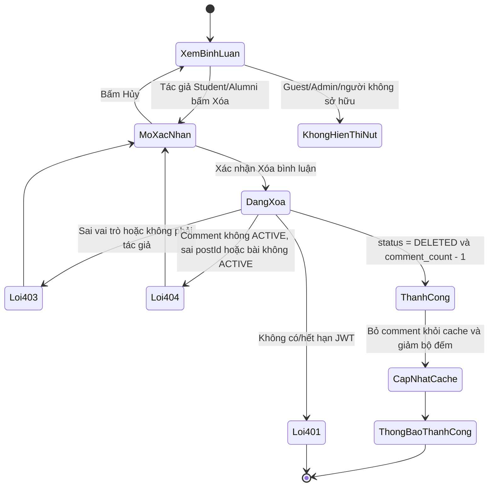
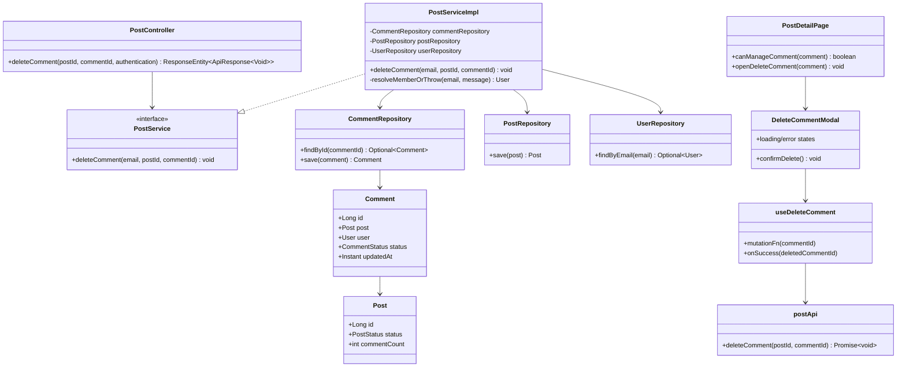
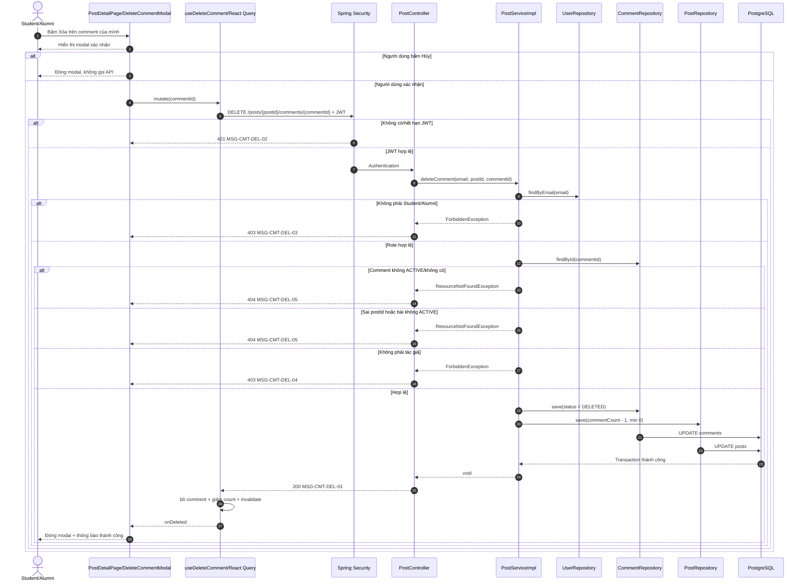

# ĐẶC TẢ YÊU CẦU & THIẾT KẾ CHI TIẾT: UC20 - Xóa bình luận

## PHẦN 1: ĐẶC TẢ NGHIỆP VỤ (REPORT 3)

### 2.2.3 Business Workflow (Luồng nghiệp vụ)

#### Mô tả chi tiết luồng xử lý

1. Student hoặc Alumni đã đăng nhập xem bài viết tại `/app/posts/{postId}`. Nút **Xóa** chỉ xuất hiện trên bình luận do chính tài khoản hiện tại tạo; Guest, Admin và thành viên khác không thấy nút này.
2. Người dùng bấm **Xóa** để mở modal xác nhận. Bấm **Hủy** đóng modal và không thay đổi dữ liệu; bấm **Xóa bình luận** bắt đầu request và khóa các nút trong lúc chờ.
3. Frontend gọi `DELETE /api/v1/posts/{postId}/comments/{commentId}` với Bearer JWT, không có request body.
4. Spring Security chặn request không có JWT bằng HTTP 401. Service tra người dùng theo email và kiểm tra vai trò `STUDENT`/`ALUMNI` trước khi đọc bình luận.
5. Service chỉ chấp nhận bình luận `ACTIVE`, thuộc đúng `postId` trên URL, nằm trong bài viết `ACTIVE` và có `comments.user_id` trùng người gọi. Sai vai trò/quyền sở hữu trả 403; tài nguyên không khả dụng hoặc sai bài trả 404.
6. Trong một transaction, Service chuyển `comments.status` sang `DELETED`, để JPA cập nhật `comments.updated_at`, đồng thời giảm `posts.comment_count` đúng một đơn vị nhưng không thấp hơn 0. Không xóa cứng bản ghi và không xóa các reply của người khác.
7. Backend trả HTTP 200 với `ApiResponse<Void>`. Frontend loại comment khỏi cache đang hiển thị, giảm bộ đếm bài viết, làm mới dữ liệu phân trang/feed, đóng modal và hiển thị thông báo thành công.

### 3.2 Module 3 - Social: Feed, Posts, Events, Packages & Messaging

#### 3.2.1 UC20 - Xóa bình luận

**Function trigger**

- Navigation path: `/app/posts/{postId}` → khu vực **Bình luận** → nút **Xóa** trên bình luận thuộc tài khoản hiện tại.
- Timing/Frequency: On demand.

**Function description**

- Actors/Roles: Student, Alumni.
- Purpose: Cho phép tác giả gỡ bình luận của chính mình khỏi luồng thảo luận mà không tác động đến bình luận của người khác.
- Interface: Nút text **Xóa** có icon thùng rác chỉ hiện cho tác giả hợp lệ. Modal Premium Pastel gồm cảnh báo, nút **Hủy**, nút **Xóa bình luận**, trạng thái `Đang xóa…`, lỗi backend inline và thông báo thành công màu xanh trong khu bình luận.
- Responsive: Modal `max-w-md`; phần nội dung và hai nút thao tác vẫn đọc, bấm được trên màn hình hẹp.

**Data processing**

- Request path: `postId`, `commentId`; không có request body.
- Response: HTTP 200, `ApiResponse<Void>` với `message = "Xóa bình luận thành công"`, `data = null`.
- Persistence: cập nhật `comments.status = DELETED`, `comments.updated_at` và `posts.comment_count = max(0, comment_count - 1)` trong cùng transaction.
- Database migration: không cần migration mới vì `comments.status`, `comments.updated_at` và `posts.comment_count` đã tồn tại trong schema hiện hành.
- Frontend cache: xóa đúng comment khỏi mọi trang `['post-comments', postId]`, giảm `comments` trong `['post', postId]`, sau đó invalidate luồng bình luận và feed để tránh lệch phân trang/bộ đếm.

**Validation**

- `postId` và `commentId` phải ánh xạ được sang số nguyên `Long`; sai kiểu trả HTTP 400 bởi `GlobalExceptionHandler`.
- Bình luận phải tồn tại, có trạng thái `ACTIVE`, thuộc đúng bài viết `ACTIVE` trên URL.
- Người gọi phải là Student/Alumni và là tác giả của bình luận.
- Frontend chỉ hiển thị action theo role và ownership; backend luôn kiểm tra lại toàn bộ điều kiện.

**Normal case**

- Tác giả Student/Alumni xác nhận xóa bình luận ACTIVE của đúng bài viết; nhận 200, bình luận biến mất, bộ đếm giảm một và có thông báo thành công.

**Abnormal case**

- Bấm Hủy: modal đóng, không gọi API và không thay đổi dữ liệu.
- Guest hoặc phiên hết hạn: 401.
- Admin, sai vai trò hoặc thành viên khác: 403.
- Bình luận đã xóa/không tồn tại, sai `postId`, hoặc bài viết không ACTIVE: 404.
- `postId`/`commentId` sai kiểu: 400.
- Mất mạng/lỗi API: modal vẫn mở, dữ liệu và cache cũ được giữ nguyên, lỗi hiển thị inline để người dùng thử lại hoặc hủy.

### 5. Requirement Appendix

#### 5.1 Business Rules

| ID | Quy tắc |
| :--- | :--- |
| BR-CMT-DEL-01 | Chỉ `STUDENT` hoặc `ALUMNI` đã xác thực mới được gọi API UC20. |
| BR-CMT-DEL-02 | Chỉ tác giả (`comments.user_id`) được xóa bình luận của chính mình; Admin không có ngoại lệ trong UC20. |
| BR-CMT-DEL-03 | Chỉ bình luận `ACTIVE` thuộc bài viết `ACTIVE` mới có thể xóa; tài nguyên không khả dụng được trả thống nhất là 404. |
| BR-CMT-DEL-04 | `postId` trên URL phải trùng `comments.post_id` để ngăn tác động chéo tài nguyên. |
| BR-CMT-DEL-05 | Xóa bình luận là xóa mềm bằng `status = DELETED`; bản ghi vẫn được giữ trong cơ sở dữ liệu. |
| BR-CMT-DEL-06 | Một lần xóa hợp lệ giảm `posts.comment_count` đúng một đơn vị và không để giá trị âm. |
| BR-CMT-DEL-07 | Xóa một comment không xóa các reply của người khác; reply còn ACTIVE tiếp tục được hiển thị như bình luận mồ côi khi comment cha không còn trong luồng. |
| BR-CMT-DEL-08 | Request thất bại không được sửa cache frontend hoặc dữ liệu trong database. |

#### 5.2 Application Messages List

| Mã | Ngữ cảnh | Nội dung | HTTP |
| :--- | :--- | :--- | :--- |
| MSG-CMT-DEL-01 | Thành công | `Xóa bình luận thành công` | 200 |
| MSG-CMT-DEL-02 | Chưa đăng nhập/hết phiên | `Bạn chưa đăng nhập hoặc phiên làm việc đã hết hạn.` | 401 |
| MSG-CMT-DEL-03 | Sai vai trò | `Chỉ sinh viên và cựu sinh viên mới được xóa bình luận` | 403 |
| MSG-CMT-DEL-04 | Không phải tác giả | `Bạn chỉ được xóa bình luận của chính mình` | 403 |
| MSG-CMT-DEL-05 | Không khả dụng/sai bài | `Bình luận này không còn khả dụng` | 404 |
| MSG-CMT-DEL-06A | `postId` sai kiểu | `Tham số 'postId' không hợp lệ` | 400 |
| MSG-CMT-DEL-06B | `commentId` sai kiểu | `Tham số 'commentId' không hợp lệ` | 400 |
| MSG-CMT-DEL-07 | Lỗi hệ thống | `Đã có lỗi hệ thống xảy ra. Vui lòng thử lại.` | 500 |

## PHẦN 2: THIẾT KẾ CHI TIẾT (REPORT 4)

### 3. Detail Design

#### 3.1.1 Class Diagram

#### Giải thích vai trò các lớp

- `PostController`: nhận path variables và `Authentication`, gọi service, đóng gói phản hồi chuẩn HTTP 200.
- `PostService`/`PostServiceImpl`: thực thi RBAC, ownership, trạng thái tài nguyên, xóa mềm và cập nhật bộ đếm transactionally.
- `UserRepository`: tìm tài khoản từ email trong JWT để kiểm tra actor.
- `CommentRepository`: đọc comment theo ID và lưu trạng thái `DELETED`.
- `PostRepository`: lưu bộ đếm comment sau khi giảm.
- `Comment`/`Post`: ánh xạ các bản ghi persistence tham gia transaction.
- `postApi`: gọi endpoint DELETE, Bearer token được interceptor tự đính kèm.
- `useDeleteComment`: quản lý mutation và đồng bộ cache React Query sau thành công.
- `DeleteCommentModal`: cung cấp xác nhận, loading, error và callback thành công.
- `PostDetailPage`: kiểm soát visibility theo role/ownership và hiển thị thông báo kết quả.

#### 3.1.2 Sequence Diagram

#### Mô tả các luồng sequence

1. **Luồng thành công:** RBAC, trạng thái, `postId` và ownership đều hợp lệ; comment được xóa mềm, bộ đếm giảm trong cùng transaction, UI cập nhật sau HTTP 200.
2. **Luồng Hủy:** modal đóng mà không tạo network request hay thay đổi cache.
3. **Luồng 401:** Spring Security từ chối trước Controller; interceptor thử refresh token theo cơ chế chung, nếu không thể thì đăng xuất/chuyển tới trang đăng nhập.
4. **Luồng 403:** service từ chối sai vai trò trước khi đọc comment hoặc từ chối thành viên không sở hữu sau khi tìm comment; database không thay đổi.
5. **Luồng 404:** comment không ACTIVE/không tồn tại, sai `postId` hoặc bài không ACTIVE đều dùng cùng thông báo để không tác động nhầm tài nguyên.
6. **Luồng lỗi mạng/hệ thống:** mutation thất bại, modal giữ nguyên và hiện lỗi inline; `onSuccess` không chạy nên cache cũ không bị sửa.
