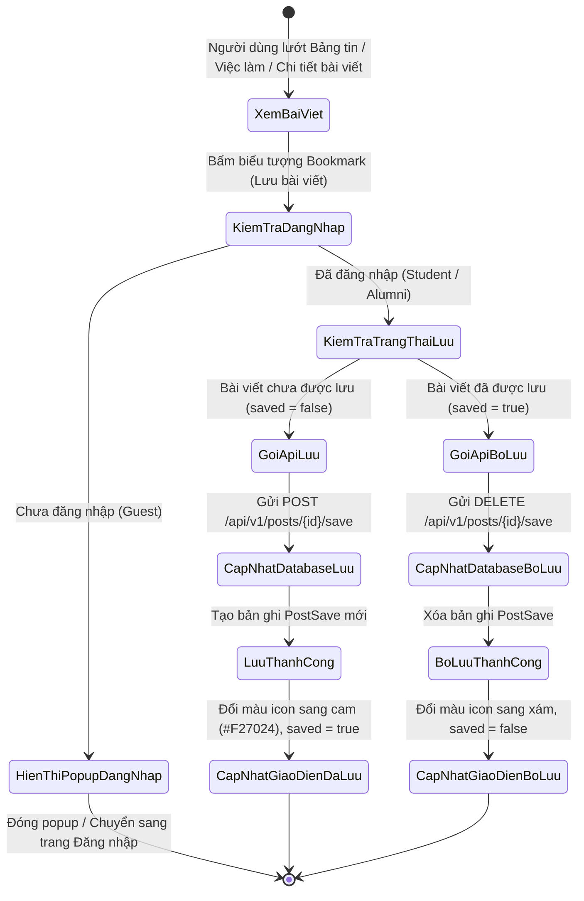
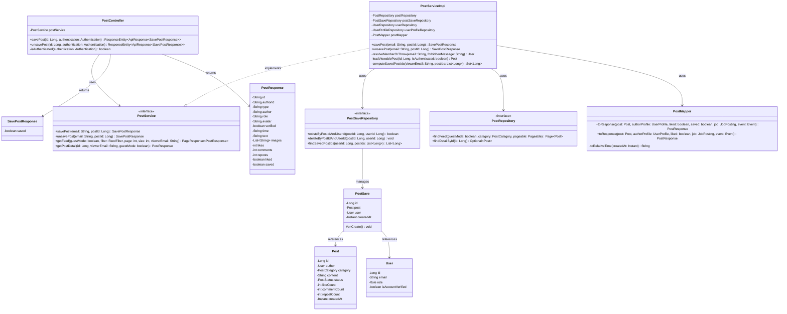
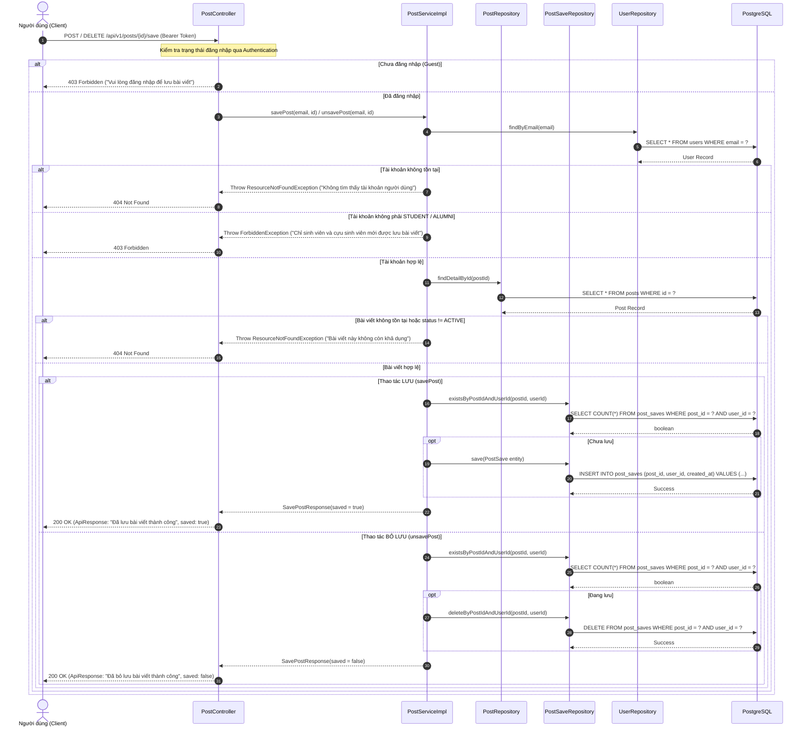

# ĐẶC TẢ YÊU CẦU & THIẾT KẾ CHI TIẾT: UC20 - SAVE POST (LƯU BÀI VIẾT)

## PHẦN 1: ĐẶC TẢ NGHIỆP VỤ (REPORT 3)

### 2.2.3 Business Workflow (Luồng nghiệp vụ)



#### Mô tả chi tiết luồng xử lý bằng chữ (Business Step Description):
* **Bước 1 - Kích hoạt hành động**: Người dùng lướt xem các bài viết trên Bảng tin (`FeedPage`), Trang việc làm (`JobsPage`) hoặc Trang chi tiết bài viết (`PostDetailPage`) và bấm vào nút biểu tượng Bookmark trên thẻ bài viết.
* **Bước 2 - Kiểm tra quyền & xác thực**:
  * Nếu người dùng là **Khách vãng lai (Guest - chưa đăng nhập)**: Hệ thống mở popup modal mời đăng nhập (`LoginPromptModal`) theo quy tắc BR-12, không gửi request lưu bài lên server.
  * Nếu người dùng là **Thành viên hợp lệ (STUDENT / ALUMNI)**: Hệ thống thực hiện cập nhật giao diện lạc quan (Optimistic UI Update) đổi trạng thái icon ngay lập tức, sau đó gửi request tương ứng (`POST` để lưu hoặc `DELETE` để bỏ lưu) tới Backend.
* **Bước 3 - Xử lý nghiệp vụ tại Backend**:
  * Spring Security xác thực JWT Token và trích xuất email người dùng.
  * Backend kiểm tra tài khoản người dùng có tồn tại và thuộc vai trò hợp lệ (`STUDENT` hoặc `ALUMNI`). Nếu là vai trò khác (như `ADMIN`), ném lỗi `403 Forbidden`.
  * Kiểm tra bài viết mục tiêu có tồn tại và đang ở trạng thái hoạt động (`ACTIVE`). Nếu bài viết đã bị xóa hoặc ẩn, ném lỗi `404 Not Found`.
  * Thực hiện thao tác lũy đẳng trong cơ sở dữ liệu: thêm mới bản ghi vào bảng `post_saves` (khi lưu) hoặc xóa bản ghi (khi bỏ lưu).
* **Bước 4 - Phản hồi & Đồng bộ dữ liệu**:
  * Server phản hồi mã `200 OK` kèm kết quả `{ saved: boolean }`.
  * Frontend nhận phản hồi thành công và giữ nguyên trạng thái; nếu xảy ra lỗi mạng hoặc lỗi từ server, Frontend tự động hoàn tác (rollback) trạng thái icon về ban đầu.

---

### 3.2 Quản Lý Tương Tác Bảng Tin & Đánh Dấu (Community Feed & Bookmarks)
Module chịu trách nhiệm quản lý bảng tin cộng đồng, bài viết đa hình (thường, sự kiện, tuyển dụng), tương tác thả tim, bình luận và đánh dấu/lưu bài viết của sinh viên và cựu sinh viên FPTU.

#### 3.2.1 Lưu & Bỏ lưu bài viết (Save & Unsave Post)

**Function trigger**:
*   **Navigation path**: Nút biểu tượng Bookmark trên từng thẻ bài viết tại:
    * `/app` (Bảng tin cộng đồng).
    * `/app/jobs` (Trang tuyển dụng việc làm).
    * `/app/posts/:id` (Trang chi tiết bài viết).
*   **Timing Frequency**: On demand (khi người dùng bấm biểu tượng Bookmark trên bài viết).

**Function description**:
*   **Actors/Roles**: Student (Sinh viên), Alumni (Cựu sinh viên), Guest (Khách vãng lai - được hiển thị modal mời đăng nhập).
*   **Purpose**: Cho phép người dùng đánh dấu và lưu trữ các bài viết, tin tuyển dụng, sự kiện quan trọng để theo dõi.
*   **Interface**: Nút biểu tượng Bookmark trên thẻ bài viết: viền xám khi chưa lưu (`saved = false`), chuyển sang màu cam thương hiệu (`#F27024`) kèm hiệu ứng nảy (spring scale animation) khi đã lưu (`saved = true`).

**Data processing**:
1. Client gửi request `POST /api/v1/posts/{id}/save` (để lưu) hoặc `DELETE /api/v1/posts/{id}/save` (để bỏ lưu) kèm JWT Bearer Token trong header.
2. Spring Security `JwtFilter` xác thực token và trích xuất email người dùng.
3. `PostController` tiếp nhận yêu cầu, kiểm tra xác thực người dùng và gọi `PostService.savePost(email, id)` hoặc `PostService.unsavePost(email, id)`.
4. `PostServiceImpl` kiểm tra vai trò thành viên (`STUDENT`/`ALUMNI`) qua hàm `resolveMemberOrThrow`, ném `ForbiddenException` nếu tài khoản không có quyền.
5. Kiểm tra bài viết mục tiêu tồn tại và `ACTIVE` qua `PostRepository.findDetailById(id)`, ném `ResourceNotFoundException` nếu bài viết không khả dụng.
6. Thao tác bảng `post_saves` qua `PostSaveRepository`:
   - Nếu lưu: Kiểm tra `existsByPostIdAndUserId`, nếu chưa tồn tại thì lưu thực thể `PostSave` mới vào database.
   - Nếu bỏ lưu: Kiểm tra `existsByPostIdAndUserId`, nếu tồn tại thì gọi `deleteByPostIdAndUserId`.
7. Trả về `ResponseEntity<ApiResponse<SavePostResponse>>` với mã trạng thái `200 OK` và dữ liệu `{ saved: boolean }`.
8. Đối với các API tải Bảng tin (`GET /api/v1/posts`) và Chi tiết bài viết (`GET /api/v1/posts/{id}`): Backend tự động truy vấn batch `PostSaveRepository.findSavedPostIds` theo danh sách ID bài viết và người xem hiện tại để gán cờ `saved: boolean` cho từng bài viết.

**Function details**:
*   **Data**: `post_id` (BigInt), `user_id` (BigInt), `created_at` (Timestamp with timezone).
*   **Validation**: `id` bài viết phải là số nguyên dương hợp lệ.
*   **Business rules**:
    * Chỉ người dùng đã đăng nhập với vai trò Sinh viên hoặc Cựu sinh viên mới có quyền lưu bài viết.
    * Một người dùng chỉ có tối đa 1 bản ghi lưu cho 1 bài viết (ràng buộc duy nhất `uq_post_saves_post_user`).
    * Thao tác lưu và bỏ lưu mang tính chất lũy đẳng (Idempotent), không gây lỗi nếu gọi nhiều lần liên tiếp.
    * Khi bài viết gốc bị xóa khỏi cơ sở dữ liệu, khóa ngoại `ON DELETE CASCADE` tự động xóa các bản ghi liên quan trong bảng `post_saves`.
*   **Error Handling**:
    * `401 Unauthorized`: Chưa đăng nhập hoặc token không hợp lệ/hết hạn.
    * `403 Forbidden`: Tài khoản không có quyền lưu bài viết (Admin hoặc vai trò khác).
    * `404 Not Found`: Bài viết không tồn tại hoặc đã bị ẩn/xóa.
*   **Normal case**: Thao tác lưu thành công trả về `{ error: 0, message: "Đã lưu bài viết thành công", data: { saved: true } }`. Thao tác bỏ lưu thành công trả về `{ error: 0, message: "Đã bỏ lưu bài viết thành công", data: { saved: false } }`.
*   **Abnormal case**: Token hết hạn, mất kết nối cơ sở dữ liệu hoặc bài viết đã bị xóa trước đó.

---

### 5. Requirement Appendix (Phụ lục Yêu cầu)

#### 5.1 Business Rules (Quy tắc Nghiệp vụ)

| ID | Định nghĩa Quy tắc (Rule Definition) |
| :--- | :--- |
| BR-01 | Mọi bài viết được lưu phải đang ở trạng thái hoạt động (`ACTIVE`). Không thể lưu bài viết đã bị ẩn (`HIDDEN`) hoặc đã bị xóa (`DELETED`). |
| BR-02 | Thao tác lưu bài viết mang tính chất lũy đẳng (Idempotent): Lưu một bài viết đã được lưu trước đó vẫn trả về thành công với `saved: true`. |
| BR-03 | Thao tác bỏ lưu bài viết mang tính chất lũy đẳng: Bỏ lưu một bài viết chưa lưu vẫn trả về thành công với `saved: false`. |
| BR-04 | Chỉ người dùng có vai trò `STUDENT` hoặc `ALUMNI` mới có quyền thực hiện lưu và bỏ lưu bài viết. |
| BR-05 | Quản trị viên (`ADMIN`) không có quyền lưu bài viết cá nhân; khi gọi API sẽ nhận mã lỗi `403 Forbidden`. |
| BR-06 | Khách vãng lai (`GUEST`) khi nhấn nút Bookmark trên bất kỳ bài viết nào sẽ được hiển thị modal mời đăng nhập theo quy định. |
| BR-07 | Khi người dùng xóa tài khoản, toàn bộ các bản ghi bài viết đã lưu của người dùng đó sẽ tự động bị xóa theo cơ chế Cascade Delete. |
| BR-08 | Khi bài viết gốc bị xóa vĩnh viễn, toàn bộ các bản ghi lưu bài viết đó trong bảng `post_saves` sẽ tự động bị xóa theo cơ chế Cascade Delete. |
| BR-09 | Cờ `saved` (đã lưu hay chưa) phải được tính toán động dựa trên người xem hiện tại cho từng bài viết khi tải Bảng tin và Chi tiết bài viết. |
| BR-10 | Việc tính toán cờ `saved` cho danh sách bài viết trên Bảng tin phải sử dụng cơ chế Batch-Fetch (`findSavedPostIds`) để triệt tiêu lỗi N+1 Query. |
| BR-11 | Giao diện phía Client phải hỗ trợ cập nhật lạc quan (Optimistic UI Update) và tự động hoàn tác khi gặp lỗi mạng. |
| BR-12 | Nút Bookmark phải hỗ trợ hoạt ảnh chuyển đổi trạng thái mượt mà (Spring Bounce Animation) giữa trạng thái đã lưu và chưa lưu. |

#### 5.2 Common Requirements (Yêu cầu Chung)
* Giao diện áp dụng bảng màu Pastel Premium của AlumNect: Điểm nhấn màu cam thương hiệu FPTU `#F27024`.
* Nút Bookmark được tích hợp đồng bộ trên cả 3 trang: Bảng tin, Chi tiết bài viết và Danh sách việc làm.
* Toàn bộ API đều tuân thủ chuẩn phong bì phản hồi `ResponseEntity<ApiResponse<T>>`.

#### 5.3 Application Messages List (Danh sách Thông điệp Ứng dụng & Lỗi Nghiệp vụ)

| # | Mã thông điệp (Code) | Loại (Type) | Ngữ cảnh (Context) | Nội dung hiển thị (Content) |
| :--- | :--- | :--- | :--- | :--- |
| 1 | `MSG_SAVE_01` | Toast / Success | Lưu bài viết thành công | `Đã lưu bài viết thành công` |
| 2 | `MSG_SAVE_02` | Toast / Success | Bỏ lưu bài viết thành công | `Đã bỏ lưu bài viết thành công` |
| 3 | `MSG_SAVE_03` | Modal / Info | Khách chưa đăng nhập bấm nút Lưu trên Bảng tin / Chi tiết | `Đăng nhập để lưu bài viết.` |
| 4 | `MSG_SAVE_04` | Modal / Info | Khách chưa đăng nhập bấm nút Lưu trên Trang việc làm | `Đăng nhập để lưu tin tuyển dụng.` |
| 5 | `MSG_SAVE_05` | Inline / Error | Không có quyền lưu bài viết (Admin/Khác) | `Chỉ sinh viên và cựu sinh viên mới được lưu bài viết` |
| 6 | `MSG_SAVE_06` | Inline / Error | Bài viết mục tiêu không tồn tại hoặc đã bị xóa | `Bài viết này không còn khả dụng` |
| 7 | `MSG_SAVE_07` | Inline / Error | Không tìm thấy tài khoản người dùng tương ứng với token | `Không tìm thấy tài khoản người dùng` |
| 8 | `MSG_SAVE_08` | Inline / Error | Chưa đăng nhập khi gọi API lưu bài viết | `Vui lòng đăng nhập để thực hiện thao tác này` |

---

## PHẦN 2: THIẾT KẾ CHI TIẾT (REPORT 4)

### 3. Detail Design (Thiết kế chi tiết)

#### 3.1 Thiết kế chi tiết cho Use Case UC20 - Save Post

##### 3.1.1 Class Diagram (Sơ đồ Lớp)



###### Mô tả chi tiết sơ đồ lớp (Class Diagram Description):
* **`PostController`**: Tiếp nhận các yêu cầu HTTP từ Client tại các endpoint `/api/v1/posts/{id}/save` (`POST` và `DELETE`). Sử dụng `Authentication` do Spring Security cung cấp để trích xuất email của người dùng.
* **`PostService` & `PostServiceImpl`**: Chứa toàn bộ logic nghiệp vụ kiểm tra quyền hạn thành viên (`resolveMemberOrThrow`), kiểm tra bài viết hợp lệ (`loadViewablePost`), thực hiện lưu/bỏ lưu lũy đẳng và tính toán tập ID bài viết đã lưu qua `computeSavedPostIds`.
* **`PostSaveRepository`**: Giao tiếp trực tiếp với cơ sở dữ liệu PostgreSQL qua Spring Data JPA, hỗ trợ các phương thức kiểm tra tồn tại `existsByPostIdAndUserId`, xóa bản ghi `deleteByPostIdAndUserId` và truy vấn batch-fetch `findSavedPostIds`.
* **`PostSave` Entity**: Ánh xạ bảng `post_saves`, lưu trữ mối quan hệ nhiều-một (`@ManyToOne`) giữa người dùng và bài viết được lưu.
* **`PostMapper`**: Chuyển đổi dữ liệu từ thực thể `Post` sang DTO `PostResponse` có chứa trường boolean `saved`.

---

##### 3.1.2 Sequence Diagram (Sơ đồ Tuần tự Gộp)



###### Mô tả chi tiết sơ đồ tuần tự (Sequence Diagram Description):
1. **Tiếp nhận Request**: Client gửi yêu cầu HTTP kèm token xác thực Bearer Token trong header tới `/api/v1/posts/{id}/save`.
2. **Kiểm tra tầng Controller**: `PostController` kiểm tra `isAuthenticated(authentication)`. Nếu là khách chưa đăng nhập, trả về `403 Forbidden`.
3. **Xác thực vai trò tại Service**: `PostServiceImpl` truy vấn `userRepository` để lấy thông tin người dùng. Nếu vai trò không phải `STUDENT` hoặc `ALUMNI`, ném lỗi `403 Forbidden`.
4. **Kiểm tra trạng thái bài viết**: Service kiểm tra bài viết có tồn tại và ở trạng thái `ACTIVE` qua `postRepository`. Nếu không, trả về `404 Not Found`.
5. **Thực thi lưu / bỏ lưu (Idempotent)**:
   - Với thao tác **Lưu bài viết (`POST`)**: Nếu chưa lưu, thực hiện lệnh `INSERT INTO post_saves`. Nếu đã lưu, bỏ qua việc tạo mới để đảm bảo tính lũy đẳng. Trả về `saved = true`.
   - Với thao tác **Bỏ lưu bài viết (`DELETE`)**: Nếu đang lưu, thực hiện lệnh `DELETE FROM post_saves`. Nếu chưa lưu, bỏ qua thao tác xóa. Trả về `saved = false`.

---

##### 3.1.3 Interface Details (Chi tiết Giao diện & Tham số API)

###### 1. API Lưu bài viết (Save Post)
* **URL**: `POST /api/v1/posts/{id}/save`
* **Headers**: `Authorization: Bearer <accessToken>`
* **Response `200 OK`**:
```json
{
  "error": 0,
  "message": "Đã lưu bài viết thành công",
  "data": {
    "saved": true
  }
}
```

###### 2. API Bỏ lưu bài viết (Unsave Post)
* **URL**: `DELETE /api/v1/posts/{id}/save`
* **Headers**: `Authorization: Bearer <accessToken>`
* **Response `200 OK`**:
```json
{
  "error": 0,
  "message": "Đã bỏ lưu bài viết thành công",
  "data": {
    "saved": false
  }
}
```
