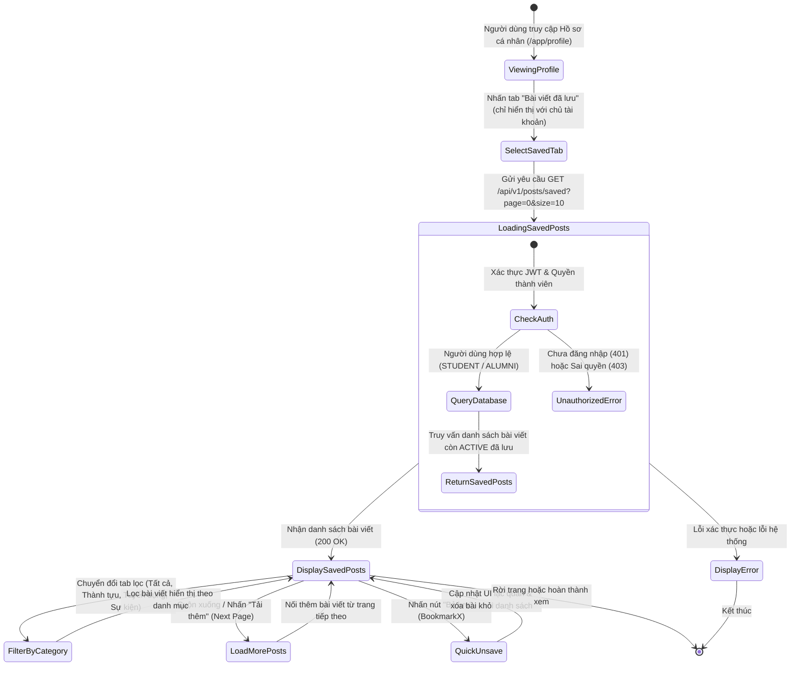
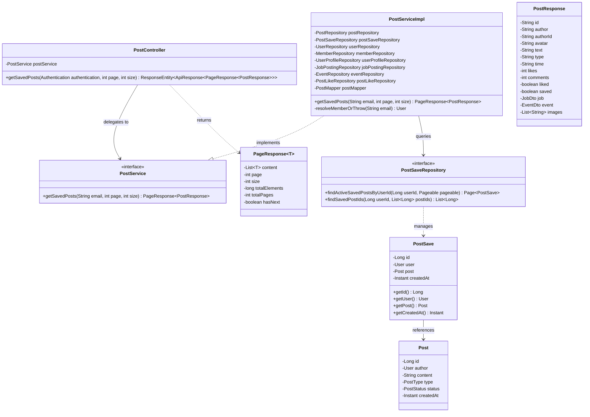
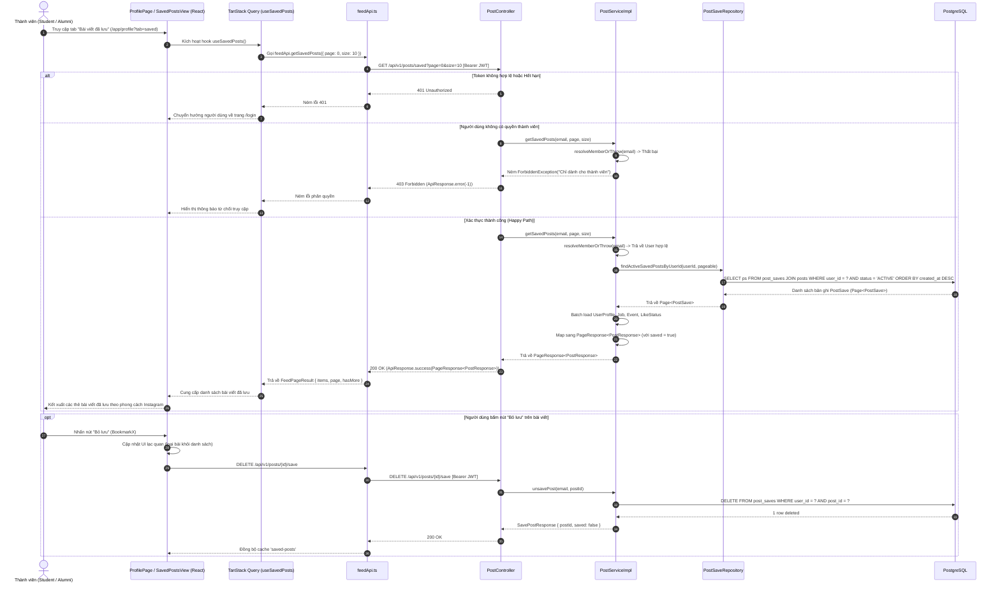

# ĐẶC TẢ YÊU CẦU & THIẾT KẾ CHI TIẾT: UC21 - XEM DANH SÁCH BÀI VIẾT ĐÃ LƯU (VIEW SAVED POSTS)

## PHẦN 1: ĐẶC TẢ NGHIỆP VỤ (REPORT 3)

### 2.2.3 Business Workflow (Luồng nghiệp vụ)



#### Mô tả chi tiết luồng xử lý bằng chữ (Business Step Description):
* **Bước 1 - Khởi đầu**: Người dùng đã đăng nhập (Student hoặc Alumni) truy cập trang hồ sơ cá nhân (`/app/profile`) hoặc chọn mục "Bài viết đã lưu" từ menu tài khoản (Avatar Dropdown) để kích hoạt tab `saved` (`/app/profile?tab=saved`).
* **Bước 2 - Kiểm tra quyền và truy vấn**: Hệ thống Backend xác thực Token JWT và quyền hạn `STUDENT`/`ALUMNI`. `PostService` truy vấn bảng `post_saves` kết hợp với bảng `posts` để lấy danh sách bài viết còn tồn tại (`status = 'ACTIVE'`) mà người dùng đã lưu, sắp xếp giảm dần theo thời gian lưu mới nhất (`created_at DESC`).
* **Bước 3 - Hiển thị giao diện**: Frontend nhận dữ liệu phân trang `PageResponse<PostResponse>` và hiển thị danh sách bài viết dạng Card chuẩn Instagram/Facebook (gồm thông tin tác giả, loại bài viết, nội dung, ảnh đính kèm, việc làm/sự kiện, số lượt thích, số bình luận).
* **Bước 4 - Tương tác**: Người dùng có thể lọc danh sách theo danh mục (`Tất cả`, `Thành tựu`, `Tuyển dụng`, `Sự kiện`), bấm nút "Bỏ lưu" (`BookmarkX`) để hủy lưu bài viết trực tiếp hoặc bấm "Tải thêm" khi có nhiều trang bài viết.

---

### 3.2 Quản Lý Bài Viết & Tương Tác Cộng Đồng (Community Feed & Social)
Module quản lý toàn bộ bài viết trên bảng tin cộng đồng AlumNect, bao gồm các bài viết thông thường, bài viết thành tựu vinh danh, tin tuyển dụng việc làm, thông báo sự kiện, tính năng tương tác thả tim, bình luận và đánh dấu lưu bài viết cá nhân.

#### 3.2.1 Xem danh sách bài viết đã lưu (View Saved Posts - UC21)

**Function trigger**:
*   **Navigation path**: Mở trang hồ sơ cá nhân `/app/profile` -> Bấm chọn tab "Bài viết đã lưu" (`/app/profile?tab=saved`).
*   **Timing Frequency**: On demand (bất cứ khi nào người dùng muốn xem lại bộ sưu tập bài viết đã bookmark).

**Function description**:
*   **Actors/Roles**: `STUDENT` (Sinh viên), `ALUMNI` (Cựu sinh viên). Khách vãng lai (`GUEST`) hoặc người dùng khác xem hồ sơ người này sẽ **không** nhìn thấy tab "Bài viết đã lưu" nhằm bảo đảm quyền riêng tư tuyệt đối.
*   **Purpose**: Cung cấp không gian lưu trữ cá nhân riêng tư giúp thành viên dễ dàng tìm lại các bài chia sẻ kiến thức hữu ích, tin tuyển dụng tiềm năng hoặc sự kiện họp mặt đã đánh dấu trước đó.
*   **Interface**:
    *   **Header Tool Bar**: Các tab lọc danh mục kèm số đếm bài viết (`Tất cả`, `Thành tựu`, `Tuyển dụng`, `Sự kiện`) và nút chuyển đổi chế độ xem Lưới (Grid) / Dòng thời gian (Feed).
    *   **Saved Grid View (Mặc định)**: Lưới thẻ 3 cột gọn gàng theo phong cách Instagram, hiển thị ảnh bìa, badge thể loại tương phản cao (`bg-white/95 text-sky-700 font-extrabold`), tiêu đề tóm tắt, avatar tác giả và nút xóa/bỏ lưu nhanh.
    *   **Saved Feed View**: Dòng thời gian chi tiết hiển thị thẻ bài viết đầy đủ thông tin: Avatar tác giả, Tên tác giả, Badge phân loại, Thời gian đăng, Nội dung text, Khối việc làm/sự kiện đính kèm, Carousel ảnh, Nút Thả tim, Nút Bình luận và Nút "Đã lưu" / "Bỏ lưu".
    *   **States**:
        *   *Loading*: Khung xương bài viết (`SavedPostsSkeleton`).
        *   *Empty*: Hiển thị minh họa Bookmark với nút bấm chuyển hướng "Khám phá Bảng tin".
        *   *Error*: Thông báo lỗi mạng kèm nút "Thử lại".
        *   *Load More*: Nút bấm "Tải thêm bài viết" kèm hiệu ứng spinner quay khi đang tải trang kế tiếp.

**Data processing**:
1. Client gửi yêu cầu HTTP `GET /api/v1/posts/saved?page={page}&size={size}` kèm Bearer Access Token.
2. `JwtFilter` xác thực tính hợp lệ của token và nạp `Authentication` vào `SecurityContextHolder`.
3. `PostController.getSavedPosts()` chuyển tiếp request tới `PostService.getSavedPosts(email, page, size)`.
4. `PostServiceImpl` gọi `resolveMemberOrThrow(email)` để lấy `User` hiện tại và xác thực vai trò thành viên (`STUDENT`/`ALUMNI`).
5. `PostSaveRepository.findActiveSavedPostsByUserId(userId, pageable)` thực hiện câu lệnh SQL:
   ```sql
   SELECT ps FROM PostSave ps
   JOIN ps.post p
   WHERE ps.user.id = :userId AND p.status = 'ACTIVE'
   ORDER BY ps.createdAt DESC
   ```
6. Dịch vụ trích xuất danh sách `Post`, batch load `UserProfile`, `JobPosting`, `Event`, trạng thái `liked` của người dùng và ánh xạ sang `PageResponse<PostResponse>` với trường `saved = true`.
7. Client nhận dữ liệu, cập nhật cache TanStack Query `['saved-posts']` và kết xuất ra giao diện.

**Screen layout**:
*   *Figure 21.1*: Tab "Bài viết đã lưu" trong trang cá nhân người dùng trên giao diện Desktop.
*   *Figure 21.2*: Danh sách bài viết đã lưu kèm bộ lọc danh mục và nút bỏ lưu nhanh.
*   *Figure 21.3*: Giao diện Empty State khi chưa có bài viết nào được lưu.

**Function details**:
*   **Data**:
    *   `page` (int, default: 0): Chỉ số trang cần lấy.
    *   `size` (int, default: 10): Số bài viết mỗi trang.
    *   `accessToken` (string, Bearer Header): Token xác thực người dùng.
*   **Validation**:
    *   `page` >= 0, `size` > 0 và <= 50.
    *   Token JWT phải hợp lệ, chưa hết hạn và thuộc người dùng đang hoạt động (`status = 'ACTIVE'`).
*   **Business rules**:
    *   **BR-01 (Quyền truy cập)**: Chỉ chủ tài khoản sở hữu danh sách mới được phép xem danh sách bài viết đã lưu của mình. Người khác xem trang cá nhân sẽ không thấy tab này.
    *   **BR-02 (Trạng thái bài viết)**: Chỉ các bài viết có trạng thái `status = 'ACTIVE'` mới được hiển thị. Các bài viết đã bị tác giả hoặc Admin ẩn/xóa sẽ tự động bị loại khỏi danh sách truy vấn.
    *   **BR-03 (Bỏ lưu tức thì)**: Khi người dùng nhấn nút "Bỏ lưu", hệ thống gọi API `DELETE /api/v1/posts/{id}/save` và tự động loại bài viết đó khỏi giao diện danh sách.
*   **Error Handling**:
    *   `401 Unauthorized`: Token không hợp lệ hoặc đã hết hạn -> Chuyển hướng người dùng về trang đăng nhập.
    *   `403 Forbidden`: Tài khoản bị khóa hoặc không có quyền thành viên -> Hiển thị thông báo từ chối truy cập.
    *   `500 Internal Server Error`: Lỗi kết nối cơ sở dữ liệu -> Hiển thị nút "Thử lại".
*   **Normal case**: Người dùng xem danh sách các bài viết đã lưu theo thứ tự thời gian giảm dần, lọc theo loại bài viết thành công, tải thêm các trang kế tiếp mượt mà.
*   **Abnormal case**: Mất kết nối Internet -> Hiển thị giao diện thông báo lỗi kết nối kèm nút Retry.

---

### 5. Requirement Appendix (Phụ lục Yêu cầu)

#### 5.1 Business Rules (Quy tắc Nghiệp vụ)

| ID | Định nghĩa Quy tắc (Rule Definition) |
| :--- | :--- |
| BR-01 | Danh sách bài viết đã lưu là dữ liệu riêng tư 100% của từng tài khoản người dùng, không công khai cho bất kỳ ai khác xem. |
| BR-02 | Chỉ các bài viết có trạng thái `ACTIVE` mới được trả về trong danh sách đã lưu. |
| BR-03 | Phân trang danh sách bài viết đã lưu bắt đầu từ `page = 0`, kích thước mặc định `size = 10`. |
| BR-04 | Khi bài viết gốc bị xóa hoàn toàn khỏi hệ thống, bản ghi trong bảng `post_saves` sẽ tự động bị xóa theo nhờ cơ chế `ON DELETE CASCADE`. |

#### 5.2 Common Requirements (Yêu cầu Chung)
*   Giao diện tuân thủ tiêu chuẩn thiết kế Pastel Premium của AlumNect (màu canvas kem `#faf4ec`, chữ mận chín `#322c3f`, điểm nhấn cam FPT `#F27024`).
*   Dữ liệu được tải theo cơ chế phân trang vô hạn (Infinite Scroll) thông qua TanStack Query.
*   Tất cả các định dạng bài viết đa hình (bài thường, thành tựu, việc làm tuyển dụng, sự kiện) được kết xuất đồng bộ và trực quan.

---

## PHẦN 2: THIẾT KẾ KỸ THUẬT CHI TIẾT (REPORT 4)

### 1.1 Class Diagram (Sơ đồ Lớp Chi tiết)



#### Mô tả chi tiết Sơ đồ Lớp (Class Diagram Description):
* **`PostController`**: Lớp Controller REST nhận các yêu cầu HTTP `GET /api/v1/posts/saved`, trích xuất thông tin định danh người dùng từ `Authentication` và ủy quyền xử lý nghiệp vụ cho `PostService`.
* **`PostService` & `PostServiceImpl`**: Tầng xử lý nghiệp vụ chính. Xác thực người dùng, gọi `PostSaveRepository.findActiveSavedPostsByUserId` để lấy danh sách bài viết đã lưu có phân trang, nạp thông tin phụ trợ (hồ sơ, đính kèm, trạng thái tương tác) và đóng gói vào `PageResponse<PostResponse>`.
* **`PostSaveRepository`**: Giao diện Spring Data JPA định nghĩa truy vấn tùy biến `findActiveSavedPostsByUserId` lọc các bài viết `ACTIVE` của người dùng sắp xếp theo ngày lưu giảm dần.
* **`PostSave` & `Post`**: Các thực thể JPA ánh xạ với các bảng tương ứng trong cơ sở dữ liệu PostgreSQL.

---

### 1.2 Sequence Diagram (Sơ đồ Tuần tự Chi tiết)



#### Mô tả chi tiết Sơ đồ Tuần tự (Sequence Diagram Description):
1. **Khởi tạo yêu cầu**: Người dùng chọn tab "Bài viết đã lưu", giao diện `ProfilePage` nạp component `SavedPostsView`, kích hoạt hook `useSavedPosts`.
2. **Xác thực và rẽ nhánh**:
   - Nếu Token JWT bị thiếu, không hợp lệ hoặc hết hạn, hệ thống trả về mã `401 Unauthorized` và điều hướng về trang đăng nhập.
   - Nếu tài khoản không thuộc quyền `STUDENT` hoặc `ALUMNI`, hệ thống trả về mã `403 Forbidden`.
   - Nếu hợp lệ, hệ thống thực hiện truy vấn cơ sở dữ liệu `findActiveSavedPostsByUserId`, nạp đầy đủ thông tin chi tiết và trả về mã `200 OK` kèm `PageResponse<PostResponse>`.
3. **Hiển thị và Bỏ lưu nhanh**: Giao diện hiển thị danh sách bài viết. Khi người dùng bấm nút "Bỏ lưu", giao diện phản hồi lạc quan ngay lập tức, đồng thời gửi request `DELETE /posts/{id}/save` để cập nhật cơ sở dữ liệu.
