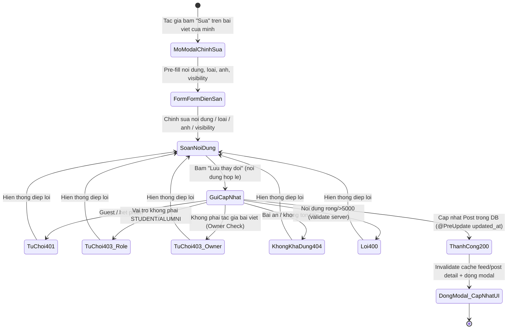

# ĐẶC TẢ YÊU CẦU & THIẾT KẾ CHI TIẾT: UC22 - Chỉnh sửa bài viết (Edit a post)

## PHẦN 1: ĐẶC TẢ NGHIỆP VỤ (REPORT 3)

### 2.2.3 Business Workflow (Luồng nghiệp vụ)

#### Mô tả chi tiết luồng xử lý bằng chữ (Business Step Description):
- **Bước 1 - Khởi đầu**: Tác giả bài viết (thành viên `STUDENT`/`ALUMNI`) thấy nút "Sửa" (`Pencil` icon) trên thẻ bài viết của chính mình ở Bảng tin (`/app`) hoặc Trang chi tiết (`/app/posts/{id}`). Người dùng khác hoặc Guest không thấy nút này.
- **Bước 2 - Pre-fill form**: Bấm nút "Sửa" mở `CreatePostModal` ở chế độ chỉnh sửa: tiêu đề đổi thành "Chỉnh sửa bài viết", form tự động nạp trước nội dung cũ (`text`), loại bài (`type`), ảnh đính kèm (`image`), phạm vi hiển thị (`visibility`).
- **Bước 3 - Kiểm tra phía client**: Nút "Lưu thay đổi" bị vô hiệu hóa khi nội dung rỗng (sau trim) hoặc đang lưu; giới hạn tối đa 5000 ký tự đồng bộ với ràng buộc backend.
- **Bước 4 - Gửi yêu cầu**: Frontend gọi `PUT /api/v1/posts/{id}` với payload `EditPostRequest` (`{ content, type, visibility, imageUrl }`); token Bearer được interceptor `http` tự đính kèm.
- **Bước 5 - Xác thực & phân quyền tại Backend**:
  - Endpoint yêu cầu JWT → Guest bị chặn **401**.
  - Service `resolveMemberOrThrow`: chỉ `STUDENT`/`ALUMNI` mới được sửa bài (vai trò khác/Admin → **403**).
  - Service `loadViewablePost`: bài đã ẩn hoặc không tồn tại → **404**.
  - Service **Ownership Check**: `post.getUser().getId() != author.getId()` → **403** ("Bạn chỉ được chỉnh sửa bài viết của chính mình").
- **Bước 6 - Cập nhật & lưu DB**: Cập nhật các trường `content`, `type`, `visibility`, `image_url`. JPA Entity `@PreUpdate` tự động cập nhật `updated_at`. Trả về `PostResponse` (200 OK).
- **Bước 7 - Hiển thị & đồng bộ UI**: Frontend tự động invalidate cache TanStack Query `['feed']` và `['post', id]`, làm mới dữ liệu bài viết trên UI tức thì và đóng modal.

---

### 3.2 Module 3 - Social: Feed, Posts, Events, Packages & Messaging

#### 3.2.2 Chỉnh sửa bài viết (Edit a post)

**Function trigger**:
- **Navigation path**: Nút "Sửa" (`Pencil` icon) ở header thẻ bài viết trên FeedPage (`/app`) hoặc PostDetailPage (`/app/posts/{id}`).
- **Timing Frequency**: On-demand — khi tác giả muốn chỉnh sửa bài viết đã đăng của mình.

**Function description**:
- **Actors/Roles**: Student, Alumni (chính tác giả bài viết). Các người dùng khác hoặc Admin không có quyền sửa (người khác → 403; Admin → 403; Guest → 401).
- **Purpose**: Cho phép tác giả cập nhật nội dung văn bản, loại bài viết, phạm vi hiển thị hoặc ảnh đính kèm sau khi đăng bài.
- **Interface**:
  - `CreatePostModal` (chế độ Edit): Tiêu đề "Chỉnh sửa bài viết", ô nhập text pre-fill, bộ chọn loại bài pre-fill, công khai/thành viên pre-fill, ảnh preview (có nút xóa ảnh), nút "Hủy" và "Lưu thay đổi".
  - Nút "Sửa" trên thẻ bài viết: chỉ xuất hiện khi `currentUserName === post.author`.

**Data processing**:
1. Frontend gọi `PUT /api/v1/posts/{id}` với body `{ content, type, visibility, imageUrl }`.
2. Spring Security kiểm tra token JWT (Guest → 401).
3. Backend kiểm tra vai trò `STUDENT`/`ALUMNI` (else 403).
4. Backend nạp bài viết (bài ẩn/không tồn tại → 404).
5. Backend kiểm tra quyền sở hữu tác giả: `post.user.id == current_user.id` (else 403).
6. Backend lưu thay đổi vào DB (`posts` table), `@PreUpdate` cập nhật `updated_at`. Map → `PostResponse` (200 OK).
7. Frontend invalidate queries `['feed']` và `['post', id]`, đóng modal.

**Validation Rules**:
- `content`: Bắt buộc, không để trống sau trim, tối đa 5000 ký tự — vi phạm trả về **400**.
- `type`: Enum `NORMAL` | `ACHIEVEMENT` | `RECRUITMENT` | `EVENT` (Frontend gửi chữ thường).
- `visibility`: Enum `PUBLIC` | `MEMBERS`.
- `imageUrl`: Tùy chọn, tối đa 500 ký tự.

---

### 5. Requirement Appendix (Phụ lục Yêu cầu)

#### 5.1 Business Rules (Quy tắc Nghiệp vụ)

| ID | Định nghĩa Quy tắc (Rule Definition) |
| :--- | :--- |
| BR-EDIT-01 | Chỉ tác giả sở hữu bài viết (`STUDENT`/`ALUMNI`) mới được phép chỉnh sửa bài viết của mình. Người dùng khác hoặc Admin cố chỉnh sửa sẽ bị từ chối với lỗi **403 Forbidden**. |
| BR-EDIT-02 | Bài viết đã bị Admin ẩn (`is_hidden = true`) không thể chỉnh sửa — trả về "không còn khả dụng" (**404 Not Found**). |
| BR-EDIT-03 | Khi bài viết được chỉnh sửa thành công, trường `updated_at` trong CSDL được tự động cập nhật qua JPA `@PreUpdate`. |
| BR-EDIT-04 | Guest chưa đăng nhập không có quyền chỉnh sửa bài viết (nút Sửa không hiển thị; Backend trả về **401 Unauthorized**). |

---

## PHẦN 2: THIẾT KẾ KỸ THUẬT (TECHNICAL DESIGN)

### 1. Data Schema & Constraints
- Bảng `posts` (Flyway migration V4) chứa các cột:
  - `id`: BIGINT (Primary Key)
  - `user_id`: BIGINT (FK users.id)
  - `type`: VARCHAR(20) (NORMAL/ACHIEVEMENT/RECRUITMENT/EVENT)
  - `content`: TEXT (NOT NULL)
  - `image_url`: VARCHAR(500)
  - `visibility`: VARCHAR(20) (PUBLIC/MEMBERS)
  - `updated_at`: TIMESTAMPTZ (Auto updated via `@PreUpdate`)

### 2. API Endpoint Specification
- **Endpoint**: `PUT /api/v1/posts/{id}`
- **Auth**: Bearer JWT Required
- **Request DTO**: `EditPostRequest` (`content`, `type`, `imageUrl`, `visibility`)
- **Response**: `ApiResponse<PostResponse>` (HTTP 200 OK)

### 3. Frontend Architecture
- API Client: `feedApi.editPost(postId, input)` (`PUT /posts/${id}`)
- Custom Hook: `useEditPost()` (TanStack Query `useMutation`)
- Modal Component: `CreatePostModal` (hỗ trợ prop `editPost?: Post`)
- UI Placement: Nút "Sửa" trên `PostCard` (FeedPage) và `PostDetailCard` (PostDetailPage) kiểm tra điều kiện tác giả `currentUserName === post.author`.
