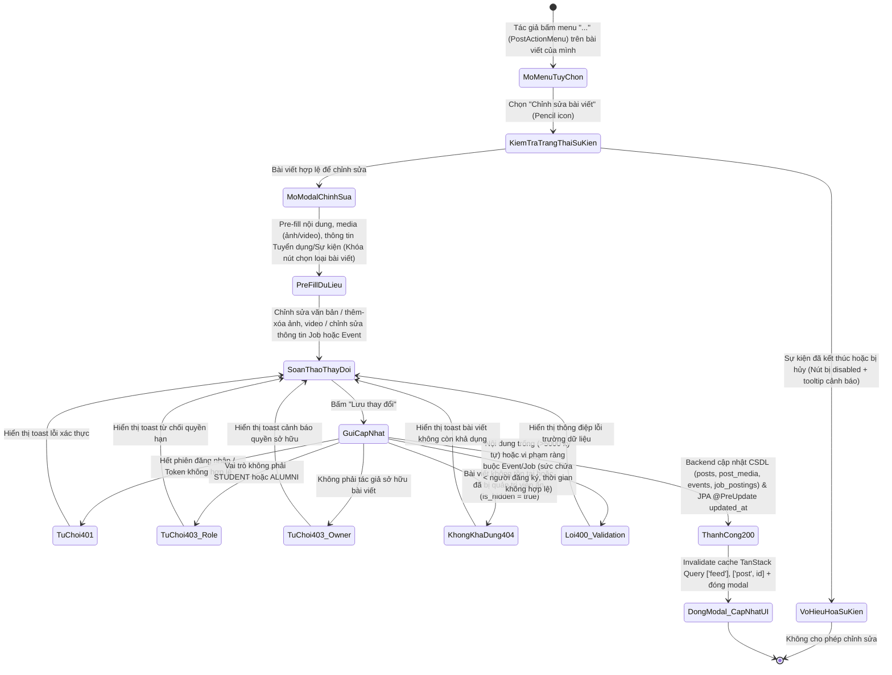
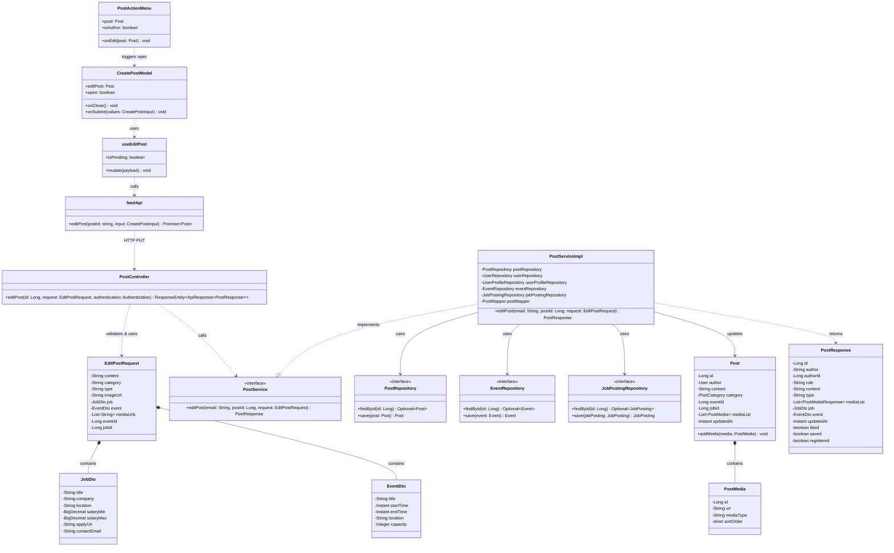

# ĐẶC TẢ YÊU CẦU & THIẾT KẾ CHI TIẾT: UC22 - Chỉnh sửa bài viết (Edit a post)

## PHẦN 1: ĐẶC TẢ NGHIỆP VỤ (REPORT 3)

### 2.2.3 Business Workflow (Luồng nghiệp vụ)

```mermaid
stateDiagram-v2
    [*] --> MoMenuTuyChon : Tác giả bấm menu "..." (PostActionMenu) trên bài viết của mình
    MoMenuTuyChon --> KiemTraTrangThaiSuKien : Chọn "Chỉnh sửa bài viết" (Pencil icon)
    
    KiemTraTrangThaiSuKien --> VoHieuHoaSuKien : Sự kiện đã kết thúc hoặc bị hủy (Nút bị disabled + tooltip cảnh báo)
    VoHieuHoaSuKien --> [*] : Không cho phép chỉnh sửa
    
    KiemTraTrangThaiSuKien --> MoModalChinhSua : Bài viết hợp lệ để chỉnh sửa
    MoModalChinhSua --> PreFillDuLieu : Pre-fill nội dung, media (ảnh/video), thông tin Tuyển dụng/Sự kiện (Khóa nút chọn loại bài viết)
    PreFillDuLieu --> SoanThaoThayDoi : Chỉnh sửa văn bản / thêm-xóa ảnh, video / chỉnh sửa thông tin Job hoặc Event
    SoanThaoThayDoi --> GuiCapNhat : Bấm "Lưu thay đổi"

    GuiCapNhat --> TuChoi401 : Hết phiên đăng nhập / Token không hợp lệ
    GuiCapNhat --> TuChoi403_Role : Vai trò không phải STUDENT hoặc ALUMNI
    GuiCapNhat --> TuChoi403_Owner : Không phải tác giả sở hữu bài viết
    GuiCapNhat --> KhongKhaDung404 : Bài viết không tồn tại hoặc đã bị quản trị viên ẩn (is_hidden = true)
    GuiCapNhat --> Loi400_Validation : Nội dung trống (>5000 ký tự) hoặc vi phạm ràng buộc Event/Job (sức chứa < người đăng ký, thời gian không hợp lệ)
    GuiCapNhat --> ThanhCong200 : Backend cập nhật CSDL (posts, post_media, events, job_postings) & JPA @PreUpdate updated_at

    ThanhCong200 --> DongModal_CapNhatUI : Invalidate cache TanStack Query ['feed'], ['post', id] + đóng modal
    TuChoi401 --> SoanThaoThayDoi : Hiển thị toast lỗi xác thực
    TuChoi403_Role --> SoanThaoThayDoi : Hiển thị toast từ chối quyền hạn
    TuChoi403_Owner --> SoanThaoThayDoi : Hiển thị toast cảnh báo quyền sở hữu
    KhongKhaDung404 --> SoanThaoThayDoi : Hiển thị toast bài viết không còn khả dụng
    Loi400_Validation --> SoanThaoThayDoi : Hiển thị thông điệp lỗi trường dữ liệu
    DongModal_CapNhatUI --> [*]
```

#### Mô tả chi tiết luồng xử lý bằng chữ (Business Step Description):
- **Bước 1 - Khởi đầu**: Tác giả bài viết (thành viên `STUDENT` hoặc `ALUMNI`) thấy nút menu ba chấm (`MoreHorizontal` icon, `PostActionMenu`) ở góc trên thẻ bài viết của chính mình trên Bảng tin (`FeedPage` tại `/app`), Trang chi tiết bài viết (`PostDetailPage` tại `/app/posts/{id}`), hoặc Trang hồ sơ cá nhân (`UserPostsView` tại `/app/profile`). Người dùng khác hoặc Guest không thấy menu tác vụ này (`isAuthor = false`).
- **Bước 2 - Chọn hành động chỉnh sửa**: Tác giả nhấp vào menu ba chấm và chọn mục "Chỉnh sửa bài viết" (`Pencil` icon).
  - *Trường hợp ngoại lệ đối với bài viết Sự kiện*: Nếu bài viết là Sự kiện đã bị hủy (`event.status === 'CANCELLED'`) hoặc thời gian sự kiện đã kết thúc trong quá khứ, mục "Chỉnh sửa bài viết" sẽ bị vô hiệu hóa (`disabled`, `cursor-not-allowed`) kèm tooltip cảnh báo ("Sự kiện đã bị hủy, không thể chỉnh sửa" hoặc "Sự kiện đã kết thúc, không thể chỉnh sửa").
- **Bước 3 - Mở modal và nạp dữ liệu (Pre-fill)**: Modal `CreatePostModal` mở ra ở chế độ chỉnh sửa (`editPost` tồn tại):
  - **Tiêu đề modal**: Hiển thị "Chỉnh sửa bài viết".
  - **Loại bài viết (`type`)**: Hiển thị loại bài viết hiện tại (`normal`, `recruitment`, `event`, `achievement`) nhưng tất cả các nút bấm chọn loại bài viết đều bị **khóa (disabled)**; hệ thống không cho phép thay đổi phân loại bài viết sau khi bài đã được phát hành.
  - **Nội dung văn bản**: Form tự động điền sẵn nội dung bài viết cũ (`editPost.text`). Nếu là bài viết sự kiện thì nội dung hiển thị trong ô mô tả chi tiết sự kiện.
  - **Đa phương tiện đính kèm (Ảnh & Video)**: Nạp sẵn danh sách ảnh/video cũ (`mediaUrls`, tối đa 10 tệp) kèm carousel xem trước và nút xóa (thùng rác) từng tệp; cho phép tải thêm ảnh hoặc video mới (video có thời lượng tối đa 60 giây, kiểm tra bằng HTML5 Video API phía client).
  - **Dữ liệu Tuyển dụng (nếu loại bài là `recruitment`)**: Tự động điền Chức vụ (`job.title`), Công ty (`job.company`), Địa điểm (`job.location` qua `PlaceAutocomplete`), Mức lương tối thiểu/tối đa (`job.salaryMin`, `job.salaryMax`), Email liên hệ (`job.contactEmail`), Link ứng tuyển (`job.applyUrl`).
  - **Dữ liệu Sự kiện (nếu loại bài là `event`)**: Tự động điền Tên sự kiện (`event.title`), Thời gian bắt đầu (`event.startTime`), Thời gian kết thúc (`event.endTime`), Địa điểm (`event.location` qua `PlaceAutocomplete`), Sức chứa tối đa (`event.capacity`, tối thiểu bằng số người đã đăng ký `attendeeCount`), Mô tả sự kiện.
- **Bước 4 - Kiểm tra và chuẩn hóa dữ liệu phía Client**:
  - Nếu nội dung bài viết bị để trống, client tự động bổ sung tiêu đề dự phòng (fallback content) đối với bài Tuyển dụng, Sự kiện hoặc Thành tựu để đáp ứng ràng buộc `@NotBlank` của Backend.
  - Ràng buộc sức chứa sự kiện: `event.capacity` không được nhỏ hơn 1 và không được nhỏ hơn số người đã đăng ký tham gia hiện tại (`attendeeCount`).
  - Ràng buộc thời gian sự kiện: Chuyển đổi định dạng ngày giờ sang ISO string.
- **Bước 5 - Gửi yêu cầu**: Client gọi `feedApi.editPost(postId, payload)` qua HTTP `PUT /api/v1/posts/{postId}` (token Bearer tự động đính kèm qua Axios interceptor).
- **Bước 6 - Xác thực & Phân quyền tại Backend**:
  - JWT Bearer Authentication: Guest hoặc token hết hạn bị chặn **401 Unauthorized**.
  - `resolveMemberOrThrow`: Người dùng phải có vai trò `STUDENT` hoặc `ALUMNI`. Vai trò khác hoặc Admin bị chặn **403 Forbidden**.
  - `loadViewablePost`: Bài viết không tồn tại hoặc đã bị quản trị viên ẩn (`is_hidden = true`) bị chặn **404 Not Found** ("Bài viết không còn khả dụng").
  - **Ownership Check**: Nếu `!post.getAuthor().getId().equals(author.getId())` -> chặn **403 Forbidden** ("Bạn chỉ được chỉnh sửa bài viết của chính mình").
  - Ràng buộc bài sự kiện: Nếu `post.getEventId() != null`, kiểm tra trạng thái sự kiện: nếu `CANCELLED` -> trả **400 Bad Request** ("Sự kiện đã bị hủy, không thể chỉnh sửa thông tin."); nếu thời gian đã kết thúc -> trả **400 Bad Request** ("Sự kiện đã kết thúc, không thể chỉnh sửa thông tin sự kiện.").
- **Bước 7 - Cập nhật dữ liệu CSDL**:
  - Cập nhật văn bản bài viết `content`.
  - Cập nhật thông tin `events` (nếu có): kiểm tra thời gian bắt đầu không ở quá khứ, kết thúc sau bắt đầu, sức chứa `capacity >= attendeeCount`.
  - Cập nhật thông tin `job_postings` (nếu có): chức danh, công ty, địa điểm, mức lương, liên kết ứng tuyển, email.
  - Cập nhật danh sách đa phương tiện `post_media`: xóa danh sách cũ và chèn danh sách mới theo thứ tự `sortOrder`.
  - Lưu Post vào CSDL: JPA `@PreUpdate` tự động cập nhật mốc thời gian `updated_at`.
  - Trả về `PostResponse` với thông tin cập nhật hoàn chỉnh kèm trạng thái tương tác (`liked`, `savedFlag`, `registered`).
- **Bước 8 - Đồng bộ UI**:
  - Frontend nhận phản hồi HTTP 200 OK, kích hoạt hiển thị toast thông báo: "Đã cập nhật bài viết thành công!".
  - Đóng modal chỉnh sửa.
  - Invalidate cache TanStack Query: `['feed']` và `['post', postId]`, giúp giao diện bảng tin và trang chi tiết tự động cập nhật dữ liệu mới nhất tức thì.

---

### 3.2 Module 3 - Social: Feed, Posts, Events, Packages & Messaging

#### 3.2.2 Chỉnh sửa bài viết (Edit a post)

**Function trigger**:
- **Navigation path**: Menu ba chấm (`PostActionMenu`) -> "Chỉnh sửa bài viết" trên thẻ bài viết tại `FeedPage` (`/app`), `PostDetailPage` (`/app/posts/{id}`), hoặc `UserPostsView` (`/app/profile`).
- **Timing Frequency**: On-demand — khi tác giả muốn cập nhật nội dung bài viết, tệp đa phương tiện, thông tin tuyển dụng hoặc sự kiện đã đăng.

**Function description**:
- **Actors/Roles**: Student, Alumni (chính tác giả bài viết sở hữu `isAuthor = true`). Người dùng khác, Admin hoặc Guest không có quyền chỉnh sửa (người khác -> 403; Admin -> 403; Guest -> 401).
- **Purpose**: Cho phép tác giả cập nhật nội dung văn bản, danh sách ảnh/video đính kèm, thông tin việc làm tuyển dụng hoặc thông tin tổ chức sự kiện sau khi đăng bài.
- **Interface**:
  - Menu tác vụ `PostActionMenu`: Nút "..." chỉ hiển thị cho chính tác giả, mở dropdown chứa tùy chọn "Chỉnh sửa bài viết" kèm icon Pencil. Nếu sự kiện đã kết thúc hoặc bị hủy thì tùy chọn này bị disable.
  - Modal chỉnh sửa `CreatePostModal`: Tiêu đề "Chỉnh sửa bài viết", form tự động pre-fill dữ liệu cũ:
    - Loại bài viết (`type`): Hiển thị loại bài hiện tại nhưng các nút chọn loại bài viết bị vô hiệu hóa (`disabled={!!editPost}`), không thể đổi loại bài.
    - Khung nhập văn bản: Giới hạn tối đa 5000 ký tự, hiển thị bộ đếm `{content.length}/5000`.
    - Khu vực Đa phương tiện: Hiển thị carousel ảnh/video đã tải lên, thumbnail từng ảnh kèm nút xóa thùng rác, nút tải thêm ảnh/video (tối đa 10 tệp, video tối đa 60s).
    - Khối Tuyển dụng (bài `recruitment`): Form nhập chức danh, công ty, địa điểm autocomplete, khoảng lương, email, link ứng tuyển.
    - Khối Sự kiện (bài `event`): Form nhập tên sự kiện, thời gian bắt đầu/kết thúc (datepicker), địa điểm autocomplete, sức chứa tối đa, mô tả sự kiện. Cảnh báo banner nếu sự kiện không thể sửa.
    - Nút thao tác chân trang: "Hủy" và "Lưu thay đổi" (kèm spinner khi đang gửi yêu cầu).

**Data processing**:
1. Frontend chuẩn hóa payload và gọi `PUT /api/v1/posts/{postId}` thông qua `feedApi.editPost`.
2. Spring Security trích xuất JWT và xác thực người dùng (Guest -> 401).
3. Backend kiểm tra vai trò `STUDENT`/`ALUMNI` (vai trò khác/Admin -> 403).
4. Backend nạp bài viết và kiểm tra trạng thái (`is_hidden = true` hoặc không tìm thấy -> 404).
5. Backend xác thực quyền sở hữu tác giả: `post.getAuthor().getId().equals(author.getId())` (không khớp -> 403).
6. Backend kiểm tra tính hợp lệ nghiệp vụ đối với Event/Job liên kết (nếu sự kiện đã hủy/kết thúc -> 400; sức chứa mới nhỏ hơn số người tham gia -> 400).
7. Backend cập nhật các bảng `posts`, `post_media`, `events`, `job_postings`, JPA `@PreUpdate` cập nhật `updated_at`.
8. Backend map sang `PostResponse` và trả về `ApiResponse<PostResponse>` (200 OK).
9. Frontend invalidate cache `['feed']` và `['post', postId]`, hiển thị toast thành công và đóng modal.

**Validation Rules**:
- `content`: Tối đa 5000 ký tự; không để trống sau trim — vi phạm trả về **400 Bad Request**.
- `type`: Giữ nguyên phân loại bài viết gốc (`NORMAL`, `RECRUITMENT`, `EVENT`, `ACHIEVEMENT`). Không cho phép đổi loại bài khi chỉnh sửa.
- `mediaUrls`: Danh sách URL ảnh/video đính kèm (tối đa 10 tệp; video tối đa 60 giây).
- `event`:
  - `startTime`: Không được ở quá khứ đối với sự kiện mới/cập nhật.
  - `endTime`: Phải sau thời gian bắt đầu.
  - `capacity`: Phải lớn hơn hoặc bằng 1, và không được nhỏ hơn số người đã đăng ký tham gia (`attendeeCount`).
- `job`:
  - `title`, `company`: Bắt buộc điền nếu là bài tuyển dụng.
  - `salaryMin`, `salaryMax`: Phải là số dương không âm (VNĐ).

---

### 5. Requirement Appendix (Phụ lục Yêu cầu)

#### 5.1 Business Rules (Quy tắc Nghiệp vụ)

| ID | Định nghĩa Quy tắc (Rule Definition) |
| :--- | :--- |
| BR-EDIT-01 | Chỉ tác giả sở hữu bài viết (`STUDENT`/`ALUMNI`) mới được phép chỉnh sửa bài viết của mình. Người dùng khác hoặc Admin cố chỉnh sửa sẽ bị từ chối với lỗi **403 Forbidden**. |
| BR-EDIT-02 | Bài viết đã bị Admin ẩn (`is_hidden = true`) hoặc không tồn tại sẽ không thể chỉnh sửa — trả về "không còn khả dụng" (**404 Not Found**). |
| BR-EDIT-03 | Phân loại bài viết (`type`) là bất biến sau khi phát hành — người dùng không được phép thay đổi loại bài viết khi chỉnh sửa (các nút chọn loại bài bị vô hiệu hóa). |
| BR-EDIT-04 | Bài viết sự kiện đã bị hủy (`CANCELLED`) hoặc đã kết thúc thời gian tổ chức không thể chỉnh sửa thông tin (nút Chỉnh sửa bị vô hiệu hóa; Backend trả về **400 Bad Request**). |
| BR-EDIT-05 | Khi cập nhật bài viết sự kiện, sức chứa tối đa (`capacity`) không được nhỏ hơn số lượng người dùng đã hoàn tất đăng ký tham gia hiện tại (`attendeeCount`). |
| BR-EDIT-06 | Bài viết hỗ trợ tối đa 10 tệp đa phương tiện (ảnh/video). Video đính kèm có thời lượng không quá 60 giây. |
| BR-EDIT-07 | Khi bài viết được chỉnh sửa thành công, trường `updated_at` trong CSDL được tự động cập nhật qua JPA `@PreUpdate`. |
| BR-EDIT-08 | Guest chưa đăng nhập không có quyền chỉnh sửa bài viết (menu "..." không hiển thị; Backend trả về **401 Unauthorized**). |

---

#### 5.3 Application Messages List (Danh sách Thông điệp Ứng dụng)

| # | Mã thông điệp (Message code) | Loại thông điệp (Message Type) | Ngữ cảnh (Context) | Nội dung hiển thị (Content) |
| :--- | :--- | :--- | :--- | :--- |
| 1 | MSG-EDIT-01 | Toast Success | Chỉnh sửa bài viết thành công | Đã cập nhật bài viết thành công! |
| 2 | MSG-EDIT-02 | In red, under field | Nội dung bài viết để trống sau trim | Nội dung bài viết không được để trống |
| 3 | MSG-EDIT-03 | In red, under field | Độ dài văn bản vượt quá 5000 ký tự | Nội dung bài viết không được vượt quá 5000 ký tự |
| 4 | MSG-EDIT-04 | Toast Error | Không phải tác giả sở hữu bài viết | Bạn chỉ được chỉnh sửa bài viết của chính mình |
| 5 | MSG-EDIT-05 | Toast Error / Alert | Bài viết không tồn tại hoặc đã bị ẩn | Bài viết không còn khả dụng hoặc đã bị gỡ. |
| 6 | MSG-EDIT-06 | Banner / Toast Error | Sự kiện đã bị hủy | Sự kiện đã bị hủy, không thể chỉnh sửa thông tin. |
| 7 | MSG-EDIT-07 | Banner / Toast Error | Sự kiện đã kết thúc | Sự kiện đã kết thúc, không thể chỉnh sửa thông tin sự kiện. |
| 8 | MSG-EDIT-08 | Toast Error | Sức chứa nhỏ hơn số người đã đăng ký | Sức chứa tối đa không thể nhỏ hơn số người đã đăng ký tham gia ({attendees} người). |
| 9 | MSG-EDIT-09 | In red, under field | Video đính kèm vượt quá 60 giây | Video không được vượt quá 1 phút. |
| 10 | MSG-EDIT-10 | In red, under field | Số lượng tệp đính kèm vượt quá giới hạn | Tối đa 10 ảnh mỗi bài viết. |

---

## PHẦN 2: THIẾT KẾ CHI TIẾT (REPORT 4)

### 3. Detail Design (Thiết kế chi tiết)

#### 3.1 UC22 Chỉnh sửa bài viết (Edit a post)

##### 3.1.1 Class Diagram (Sơ đồ Lớp)

```mermaid
classDiagram
    %% Controller Layer
    class PostController {
        +editPost(id: Long, request: EditPostRequest, authentication: Authentication) ResponseEntity~ApiResponse~PostResponse~~
    }

    %% DTO Layer
    class EditPostRequest {
        -String content
        -String category
        -String type
        -String imageUrl
        -JobDto job
        -EventDto event
        -List~String~ mediaUrls
        -Long eventId
        -Long jobId
    }

    class JobDto {
        -String title
        -String company
        -String location
        -BigDecimal salaryMin
        -BigDecimal salaryMax
        -String applyUrl
        -String contactEmail
    }

    class EventDto {
        -String title
        -Instant startTime
        -Instant endTime
        -String location
        -Integer capacity
    }

    class PostResponse {
        -Long id
        -String author
        -Long authorId
        -String role
        -String content
        -String type
        -List~PostMediaResponse~ mediaList
        -JobDto job
        -EventDto event
        -Instant updatedAt
        -boolean liked
        -boolean saved
        -boolean registered
    }

    %% Service Layer
    class PostService {
        <<interface>>
        +editPost(email: String, postId: Long, request: EditPostRequest) PostResponse
    }

    class PostServiceImpl {
        -PostRepository postRepository
        -UserRepository userRepository
        -UserProfileRepository userProfileRepository
        -EventRepository eventRepository
        -JobPostingRepository jobPostingRepository
        -PostMapper postMapper
        +editPost(email: String, postId: Long, request: EditPostRequest) PostResponse
    }

    %% Repository & Entity
    class PostRepository {
        <<interface>>
        +findById(id: Long) Optional~Post~
        +save(post: Post) Post
    }

    class EventRepository {
        <<interface>>
        +findById(id: Long) Optional~Event~
        +save(event: Event) Event
    }

    class JobPostingRepository {
        <<interface>>
        +findById(id: Long) Optional~JobPosting~
        +save(jobPosting: JobPosting) JobPosting
    }

    class Post {
        -Long id
        -User author
        -String content
        -PostCategory category
        -Long eventId
        -Long jobId
        -List~PostMedia~ mediaList
        -Instant updatedAt
        +addMedia(media: PostMedia) void
    }

    class PostMedia {
        -Long id
        -String url
        -String mediaType
        -short sortOrder
    }

    %% Frontend Components & Hooks
    class PostActionMenu {
        +post: Post
        +isAuthor: boolean
        +onEdit(post: Post) void
    }

    class CreatePostModal {
        +editPost: Post
        +open: boolean
        +onClose() void
        +onSubmit(values: CreatePostInput) void
    }

    class useEditPost {
        +mutate(payload) void
        +isPending: boolean
    }

    class feedApi {
        +editPost(postId: string, input: CreatePostInput) Promise~Post~
    }

    PostController ..> EditPostRequest : validates & uses
    EditPostRequest *-- JobDto : contains
    EditPostRequest *-- EventDto : contains
    PostController ..> PostService : calls
    PostServiceImpl ..|> PostService : implements
    PostServiceImpl --> PostRepository : uses
    PostServiceImpl --> EventRepository : uses
    PostServiceImpl --> JobPostingRepository : uses
    PostServiceImpl --> Post : updates
    Post *-- PostMedia : contains
    PostServiceImpl ..> PostResponse : returns
    PostActionMenu ..> CreatePostModal : triggers open
    CreatePostModal ..> useEditPost : uses
    useEditPost ..> feedApi : calls
    feedApi ..> PostController : HTTP PUT
```

###### Mô tả chi tiết cấu trúc các lớp (Class Design Description):
* **Lớp Controller (`PostController.java`)**: Cung cấp API `PUT /api/v1/posts/{id}` tiếp nhận yêu cầu cập nhật, kiểm tra tính hợp lệ của DTO qua `@Valid` và trích xuất email tác giả từ SecurityContext.
* **Lớp DTO (`EditPostRequest.java`, `JobDto.java`, `EventDto.java`, `PostResponse.java`)**: Định nghĩa cấu trúc dữ liệu cập nhật đa dạng (nội dung, thông tin việc làm, thông tin sự kiện, danh sách link ảnh/video) và cấu trúc bài viết hoàn chỉnh trả về sau khi cập nhật.
* **Lớp Service (`PostService.java`, `PostServiceImpl.java`)**: Kiểm tra quyền thành viên (`resolveMemberOrThrow`), nạp bài viết (`loadViewablePost`), xác minh quyền sở hữu (`post.getAuthor().getId().equals(author.getId())`), kiểm tra các ràng buộc sự kiện (đã hủy/kết thúc, sức chứa), đồng bộ dữ liệu `Event`, `JobPosting`, `PostMedia` và lưu vào DB.
* **Lớp Repository & Entity (`PostRepository.java`, `Post.java`, `PostMedia.java`, `Event.java`, `JobPosting.java`)**: Tương tác cơ sở dữ liệu PostgreSQL; JPA `@PreUpdate` tự động làm mới thời gian `updated_at`.
* **Lớp Frontend (`PostActionMenu.tsx`, `CreatePostModal.tsx`, `useEditPost.ts`, `feedApi.ts`)**: 
  - `PostActionMenu`: Menu hành động chứa nút "Chỉnh sửa bài viết" (chỉ hiển thị cho tác giả, kiểm tra trạng thái bất biến của sự kiện).
  - `CreatePostModal`: Hỗ trợ prop `editPost?: Post`, pre-fill đầy đủ dữ liệu, khóa nút chọn loại bài viết, quản lý thêm/xóa ảnh/video, validate client và kích hoạt hook.
  - `useEditPost`: Hook bọc TanStack Query `useMutation` gọi API và tự động invalidate cache `['feed']` và `['post', postId]`.

##### 3.1.2 Sequence Diagram (Sơ đồ Tuần tự)

```mermaid
sequenceDiagram
    autonumber
    actor User as Tác giả (Student/Alumni)
    participant Menu as PostActionMenu (FE)
    participant UI as CreatePostModal (FE)
    participant API as feedApi / Axios
    participant Controller as PostController (@Valid)
    participant Service as PostServiceImpl
    participant PostRepo as PostRepository
    participant EventRepo as EventRepository
    participant JobRepo as JobPostingRepository
    participant DB as PostgreSQL

    User->>Menu: Bấm menu "..." & chọn "Chỉnh sửa bài viết"
    Menu->>UI: Mở CreatePostModal (truyền editPost)
    Note over UI: Pre-fill content, mediaUrls, job, event.<br/>Vô hiệu hóa bộ chọn loại bài viết (disabled).
    
    User->>UI: Chỉnh sửa nội dung & bấm "Lưu thay đổi"
    UI->>API: feedApi.editPost(postId, payload)
    API->>Controller: PUT /api/v1/posts/{id} (Bearer JWT, EditPostRequest JSON)
    
    alt Trường hợp 1: Dữ liệu không hợp lệ (content trống hoặc > 5000 ký tự)
        Note over Controller: JSR-380 validation thất bại
        Controller-->>API: HTTP 400 Bad Request
        API-->>UI: Lỗi validation
        UI-->>User: Hiển thị lỗi đỏ dưới khung nhập liệu
        
    else Trường hợp 2: Dữ liệu hợp lệ
        Controller->>Service: editPost(authorEmail, id, request)
        Service->>PostRepo: loadViewablePost(id)
        PostRepo->>DB: SELECT * FROM posts WHERE id = ?
        DB-->>PostRepo: Post entity
        PostRepo-->>Service: Post post
        
        alt Trường hợp 2.1: Bài viết không tồn tại hoặc đã bị ẩn (is_hidden = true)
            Service-->>Controller: throw ResourceNotFoundException("Bài viết không còn khả dụng")
            Controller-->>API: HTTP 404 Not Found
            API-->>UI: Lỗi 404
            UI-->>User: Hiển thị Toast lỗi & đóng modal
            
        else Trường hợp 2.2: Không phải tác giả sở hữu bài viết
            Service-->>Controller: throw ForbiddenException("Bạn chỉ được chỉnh sửa bài viết của chính mình")
            Controller-->>API: HTTP 403 Forbidden
            API-->>UI: Lỗi 403
            UI-->>User: Hiển thị Toast cảnh báo quyền sở hữu
            
        else Trường hợp 2.3: Sự kiện liên kết đã bị hủy hoặc đã kết thúc
            Service-->>Controller: throw BadRequestException("Sự kiện đã bị hủy / đã kết thúc...")
            Controller-->>API: HTTP 400 Bad Request
            API-->>UI: Lỗi nghiệp vụ
            UI-->>User: Hiển thị Banner cảnh báo sự kiện không thể chỉnh sửa
            
        else Trường hợp 2.4: Hợp lệ (Cập nhật thành công)
            Note over Service: Cập nhật content, PostMedia.<br/>Cập nhật Event (nếu có) / JobPosting (nếu có).
            Service->>PostRepo: save(post)
            PostRepo->>DB: UPDATE posts, events, job_postings, post_media; updated_at = NOW()
            DB-->>PostRepo: Cập nhật thành công
            PostRepo-->>Service: Post saved
            Service-->>Controller: PostResponse DTO
            Controller-->>API: HTTP 200 OK (ApiResponse: "Chỉnh sửa bài viết thành công", PostResponse)
            API-->>UI: Promise resolved
            Note over UI: Invalidate cache TanStack Query ['feed'] & ['post', id]
            UI-->>User: Hiển thị Toast "Đã cập nhật bài viết thành công!" & Đóng Modal
        end
    end
```

###### Mô tả chi tiết luồng xử lý bằng chữ (Sequence Flow Description):
1. **Luồng 1 - Thành công (Normal Case)**: Tác giả mở modal chỉnh sửa từ menu "...", sửa đổi văn bản hoặc tệp đính kèm và gửi yêu cầu. Backend xác thực vai trò và quyền sở hữu, kiểm tra trạng thái bài viết và các ràng buộc sự kiện/tuyển dụng, cập nhật cơ sở dữ liệu và kích hoạt JPA `@PreUpdate` cập nhật thời gian sửa đổi. Backend trả về `200 OK` cùng `PostResponse`. Frontend làm mới cache TanStack Query và đóng modal.
2. **Luồng 2 - Ngoại lệ Dữ liệu không hợp lệ (Validation Error Case)**: Nội dung rỗng sau trim hoặc vượt quá 5000 ký tự. Bộ lọc JSR-380 phát hiện lỗi, trả về `HTTP 400 Bad Request`.
3. **Luồng 3 - Ngoại lệ Ràng buộc sự kiện (Event Immutable Case)**: Sự kiện liên kết đã bị hủy hoặc thời gian diễn ra đã qua trong quá khứ. Backend ném `BadRequestException` và trả về `HTTP 400 Bad Request`.
4. **Luồng 4 - Ngoại lệ Quyền sở hữu (Ownership Violation Case)**: Người dùng cố tình gửi request sửa bài của người khác. Backend phát hiện ID tác giả không trùng khớp, ném `ForbiddenException` và trả về `HTTP 403 Forbidden`.
5. **Luồng 5 - Ngoại lệ Không tồn tại (Not Found Case)**: Bài viết đã bị xóa hoặc Admin ẩn vi phạm. Backend ném `ResourceNotFoundException` và trả về `HTTP 404 Not Found`.

---

### 1. Data Schema & Constraints
- Bảng `posts`:
  - `id`: BIGINT (Primary Key)
  - `user_id`: BIGINT (FK users.id, NOT NULL)
  - `category`: VARCHAR(20) (GENERAL / RECRUITMENT / EVENT / ACHIEVEMENT)
  - `content`: TEXT (NOT NULL)
  - `event_id`: BIGINT (FK events.id, NULLABLE)
  - `job_id`: BIGINT (FK job_postings.id, NULLABLE)
  - `is_hidden`: BOOLEAN (DEFAULT false)
  - `created_at`: TIMESTAMPTZ (DEFAULT NOW())
  - `updated_at`: TIMESTAMPTZ (Auto updated via `@PreUpdate`)
- Bảng `post_media`:
  - `id`: BIGINT (Primary Key)
  - `post_id`: BIGINT (FK posts.id, ON DELETE CASCADE)
  - `url`: VARCHAR(1000) (NOT NULL)
  - `media_type`: VARCHAR(20) (DEFAULT 'IMAGE')
  - `sort_order`: SMALLINT (DEFAULT 0)
- Bảng `events`:
  - `id`: BIGINT (Primary Key)
  - `organizer_id`: BIGINT (FK users.id)
  - `title`: VARCHAR(255)
  - `start_time`: TIMESTAMPTZ
  - `end_time`: TIMESTAMPTZ
  - `location`: VARCHAR(255)
  - `capacity`: INTEGER
  - `status`: VARCHAR(20) (ACTIVE / CANCELLED)
- Bảng `job_postings`:
  - `id`: BIGINT (Primary Key)
  - `poster_id`: BIGINT (FK users.id)
  - `title`: VARCHAR(255)
  - `company`: VARCHAR(255)
  - `location`: VARCHAR(255)
  - `salary_min`: NUMERIC(15,2)
  - `salary_max`: NUMERIC(15,2)
  - `contact_email`: VARCHAR(255)
  - `apply_url`: VARCHAR(500)

---

### 2. API Endpoint Specification
- **Endpoint**: `PUT /api/v1/posts/{id}`
- **Auth**: Bearer JWT Required (`STUDENT` hoặc `ALUMNI`)
- **Request DTO**: `EditPostRequest` (`content`, `category`, `type`, `imageUrl`, `job`, `event`, `mediaUrls`, `eventId`, `jobId`)
- **Response**: `ApiResponse<PostResponse>` (HTTP 200 OK)

---

### 3. Frontend Architecture
- **API Client**: `feedApi.editPost(postId, input)` (`PUT /api/v1/posts/{postId}`)
- **Custom Hook**: `useEditPost()` (TanStack Query `useMutation`, tự động invalidate queries `['feed']` và `['post', postId]`)
- **Trigger Menu**: `PostActionMenu` (nút ba chấm trên thẻ bài viết `PostCard`, `PostDetailCard`, `UserPostsView`; kiểm tra `isAuthor` và trạng thái sự kiện)
- **Modal Component**: `CreatePostModal` (hỗ trợ prop `editPost?: Post`, pre-fill form, vô hiệu hóa nút đổi loại bài viết, quản lý thêm/xóa đa phương tiện và cảnh báo sự kiện bất biến)
