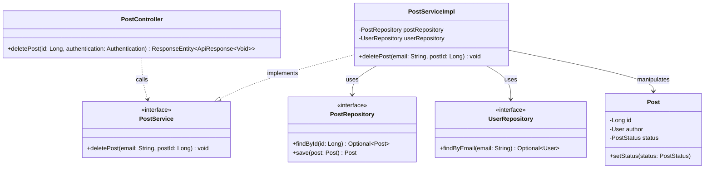
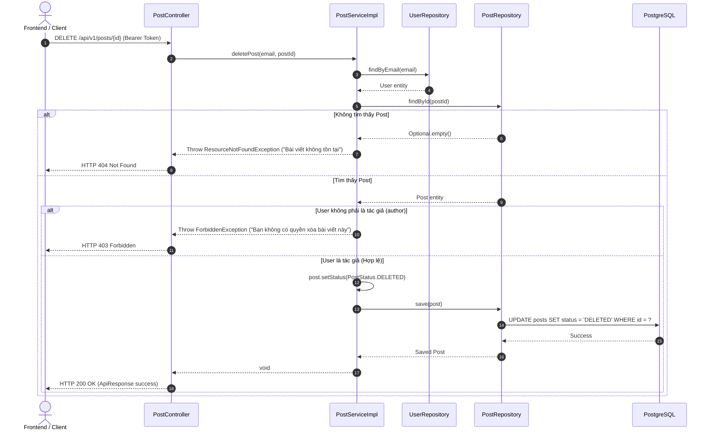

# ĐẶC TẢ YÊU CẦU PHẦN MỀM (SRS) - UC23 XÓA BÀI VIẾT

## PHẦN 1: TÀI LIỆU YÊU CẦU (REPORT 1)

### 1. THÔNG TIN CHUNG (GENERAL INFO)
*   Tên tính năng: Delete a post
*   Mã số Use Case / SRS ID: UC23

### 2. YÊU CẦU CHỨC NĂNG VẮN TẮT (BRIEF REQUIREMENTS)
Authenticated Student and Alumni users can delete posts that they created. The system must only allow the post owner to access the delete action, require confirmation before deletion, and remove the post from the Feed after a successful request. Appropriate loading, success/error toasts must be shown.

### 5. Yêu cầu Giao diện & Hiển thị (UI & Display Requirements)
#### 5.3 Error & Informational Messages (Thông điệp Lỗi & Thông báo)

| # | Mã thông điệp (Message code) | Loại thông điệp (Message Type) | Ngữ cảnh (Context) | Nội dung hiển thị (Content) |
| :--- | :--- | :--- | :--- | :--- |
| 1 | MSG-POST-01 | Toast message | Xóa bài viết thành công | Đã xóa bài viết thành công. |
| 2 | MSG-POST-02 | Toast message | Xóa bài viết thất bại (Lỗi hệ thống) | Không thể xóa bài viết, vui lòng thử lại sau. |
| 3 | MSG-POST-03 | In line | Người dùng cố gắng xóa bài viết không phải của mình | Hành động bị từ chối, bạn không có quyền xóa bài viết này. |
| 4 | MSG-POST-04 | In line | Bài viết không tồn tại | Bài viết không tồn tại hoặc đã bị xóa. |
| 5 | MSG-POST-05 | In line / Popup | Xác nhận xóa bài viết | Bạn có chắc chắn muốn xóa bài viết này không? |

---

## PHẦN 2: THIẾT KẾ CHI TIẾT (REPORT 4)

### 3. Detail Design (Thiết kế chi tiết)

#### 3.1 UC23 Xóa Bài Viết (Delete a post)

##### 3.1.1 Class Diagram (Sơ đồ Lớp)

###### Mô tả chi tiết cấu trúc các lớp (Class Design Description):
* **Lớp Controller**: `PostController.java` cung cấp API `DELETE /api/v1/posts/{id}` để tiếp nhận yêu cầu xóa bài viết. Lấy `email` từ `Authentication` và gọi `PostService`.
* **Lớp Service**: `PostService.java` và `PostServiceImpl.java` chứa logic nghiệp vụ. Lấy thông tin user hiện tại qua `UserRepository`, tìm post qua `PostRepository`, kiểm tra quyền sở hữu (`post.getAuthor().getId().equals(user.getId())`), nếu không khớp ném `ForbiddenException`. Thay đổi trạng thái post thành `PostStatus.DELETED` và lưu lại vào database.
* **Lớp Repository & Entity**: `PostRepository` dùng để lưu trữ cập nhật của bài viết. `Post` thực hiện lưu trữ trạng thái `status`.

##### 3.1.2 Sequence Diagram (Sơ đồ Tuần tự)

###### Mô tả chi tiết luồng xử lý bằng chữ (Sequence Flow Description):
1.  **Luồng 1 - Thành công**:
    *   **Gửi yêu cầu**: Client gửi yêu cầu DELETE kèm ID bài viết và JWT Token.
    *   **Xử lý nghiệp vụ**: Service tìm kiếm người dùng và bài viết. Kiểm tra quyền tác giả hợp lệ. Cập nhật trạng thái bài viết thành `DELETED` và lưu vào cơ sở dữ liệu (Soft delete).
    *   **Phản hồi**: Hệ thống trả về mã 200 OK cùng ApiResponse rỗng. Frontend nhận được thành công, xóa bài viết khỏi UI bảng tin hiện tại, hiển thị thông báo thành công.
2.  **Luồng 2 - Ngoại lệ 404 (Không tìm thấy bài viết)**:
    *   Client gửi ID bài viết không hợp lệ hoặc đã bị xóa thực sự. Service ném `ResourceNotFoundException`.
    *   GlobalExceptionHandler trả về HTTP 404 Not Found.
3.  **Luồng 3 - Ngoại lệ 403 (Không có quyền truy cập)**:
    *   Người dùng đăng nhập không phải là chủ sở hữu của bài viết cố gắng xóa. Service kiểm tra ID tác giả và người dùng không khớp, ném ra `ForbiddenException`.
    *   GlobalExceptionHandler trả về HTTP 403 Forbidden.
