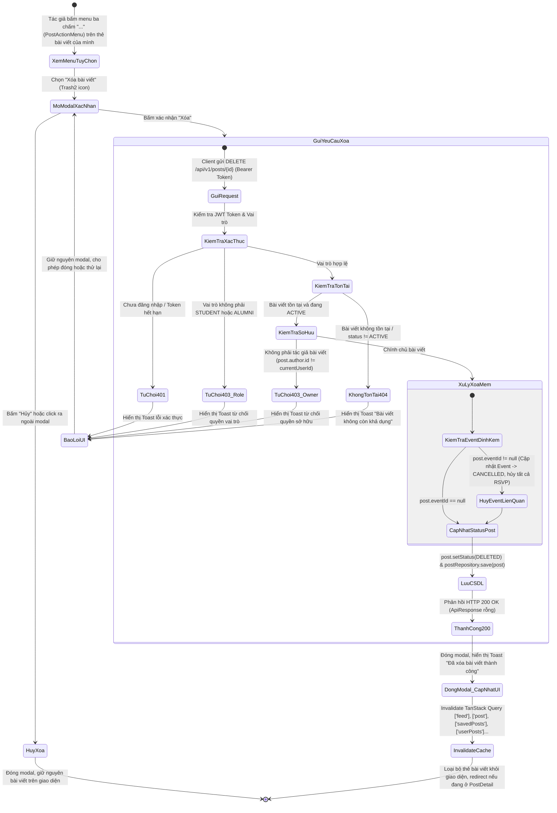
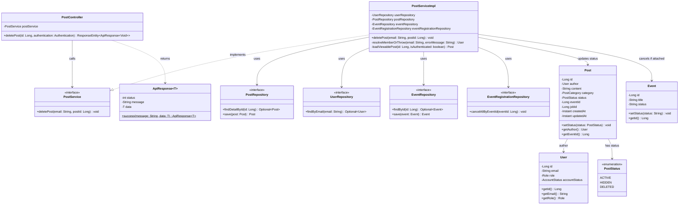
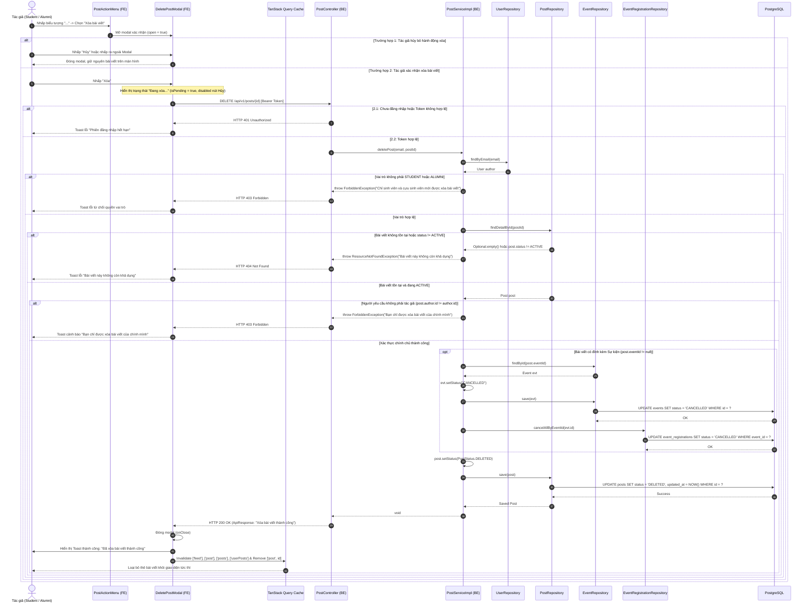

# ĐẶC TẢ YÊU CẦU & THIẾT KẾ CHI TIẾT: UC23 - Xóa bài viết (Delete a post)

## PHẦN 1: ĐẶC TẢ NGHIỆP VỤ (REPORT 3)

### 2.2.3 Business Workflow (Luồng nghiệp vụ)

```mermaid
stateDiagram-v2
    [*] --> XemMenuTuyChon : Tác giả bấm menu ba chấm "..." (PostActionMenu) trên thẻ bài viết của mình
    XemMenuTuyChon --> MoModalXacNhan : Chọn "Xóa bài viết" (Trash2 icon)
    
    MoModalXacNhan --> HuyXoa : Bấm "Hủy" hoặc click ra ngoài modal
    HuyXoa --> [*] : Đóng modal, giữ nguyên bài viết trên giao diện

    MoModalXacNhan --> GuiYeuCauXoa : Bấm xác nhận "Xóa"
    
    state GuiYeuCauXoa {
        [*] --> GuiRequest : Client gửi DELETE /api/v1/posts/{id} (Bearer Token)
        GuiRequest --> KiemTraXacThuc : Kiểm tra JWT Token & Vai trò
        
        KiemTraXacThuc --> TuChoi401 : Chưa đăng nhập / Token hết hạn
        KiemTraXacThuc --> TuChoi403_Role : Vai trò không phải STUDENT hoặc ALUMNI
        KiemTraXacThuc --> KiemTraTonTai : Vai trò hợp lệ
        
        KiemTraTonTai --> KhongTonTai404 : Bài viết không tồn tại / status != ACTIVE
        KiemTraTonTai --> KiemTraSoHuu : Bài viết tồn tại và đang ACTIVE
        
        KiemTraSoHuu --> TuChoi403_Owner : Không phải tác giả bài viết (post.author.id != currentUserId)
        KiemTraSoHuu --> XuLyXoaMem : Chính chủ bài viết
        
        state XuLyXoaMem {
            [*] --> KiemTraEventDinhKem
            KiemTraEventDinhKem --> HuyEventLienQuan : post.eventId != null (Cập nhật Event -> CANCELLED, hủy tất cả RSVP)
            KiemTraEventDinhKem --> CapNhatStatusPost : post.eventId == null
            HuyEventLienQuan --> CapNhatStatusPost
            CapNhatStatusPost --> LuuCSDL : post.setStatus(DELETED) & postRepository.save(post)
        }
        
        LuuCSDL --> ThanhCong200 : Phản hồi HTTP 200 OK (ApiResponse rỗng)
    }

    ThanhCong200 --> DongModal_CapNhatUI : Đóng modal, hiển thị Toast "Đã xóa bài viết thành công"
    DongModal_CapNhatUI --> InvalidateCache : Invalidate TanStack Query ['feed'], ['post'], ['savedPosts'], ['userPosts']...
    InvalidateCache --> [*] : Loại bỏ thẻ bài viết khỏi giao diện, redirect nếu đang ở PostDetail
    
    TuChoi401 --> BaoLoiUI : Hiển thị Toast lỗi xác thực
    TuChoi403_Role --> BaoLoiUI : Hiển thị Toast từ chối quyền vai trò
    TuChoi403_Owner --> BaoLoiUI : Hiển thị Toast từ chối quyền sở hữu
    KhongTonTai404 --> BaoLoiUI : Hiển thị Toast "Bài viết không còn khả dụng"
    BaoLoiUI --> MoModalXacNhan : Giữ nguyên modal, cho phép đóng hoặc thử lại
```

#### Mô tả chi tiết luồng xử lý bằng chữ (Business Step Description):
* **Bước 1 - Khởi đầu**: Tác giả sở hữu bài viết (thành viên `STUDENT` hoặc `ALUMNI`) thấy menu ba chấm (`PostActionMenu`, icon `MoreHorizontal`) ở góc phải trên thẻ bài viết của mình tại Bảng tin (`FeedPage` tại `/app`), Trang chi tiết bài viết (`PostDetailPage` tại `/app/posts/{id}`), hoặc Trang hồ sơ cá nhân (`UserPostsView` tại `/app/profile`). Người dùng khác hoặc Guest không thấy menu tác vụ này (`isAuthor = false`).
* **Bước 2 - Chọn hành động xóa**: Tác giả nhấp vào menu ba chấm và chọn mục "Xóa bài viết" (biểu tượng thùng rác `Trash2`, chữ màu đỏ `text-rose-600`).
* **Bước 3 - Xác nhận hành động (Confirmation Modal)**: Hệ thống mở hộp thoại `DeletePostModal`:
  * Tiêu đề: "Xóa bài viết" kèm icon cảnh báo `AlertTriangle` màu đỏ.
  * Nội dung cảnh báo: *"Bạn có chắc muốn xóa bài viết này không?"*.
  * Hai nút lựa chọn: Nút **"Hủy"** (`Button variant="secondary"`) và nút **"Xóa"** (`Button variant="primary"` nền đỏ `bg-rose-500`).
  * Nếu người dùng bấm "Hủy" hoặc bấm ra ngoài: Modal đóng lại, giữ nguyên bài viết trên màn hình.
* **Bước 4 - Gửi yêu cầu xóa tới máy chủ**: Khi người dùng nhấn nút "Xóa", nút chuyển sang trạng thái pending (`isPending = true`), vô hiệu hóa nút "Hủy", hiển thị biểu tượng xoay `Loader2` cùng văn bản "Đang xóa...". Client gửi yêu cầu HTTP `DELETE /api/v1/posts/{id}` kèm JWT Bearer Token qua Axios interceptor.
* **Bước 5 - Xác thực & Kiểm tra nghiệp vụ tại Backend**:
  * Kiểm tra JWT Token: Nếu chưa đăng nhập hoặc token hết hạn -> trả về **HTTP 401 Unauthorized**.
  * Kiểm tra vai trò: Phương thức `resolveMemberOrThrow` kiểm tra người dùng phải thuộc vai trò `STUDENT` hoặc `ALUMNI`. Nếu là `ADMIN` hoặc vai trò khác -> ném `ForbiddenException` ("Chỉ sinh viên và cựu sinh viên mới được xóa bài viết", **HTTP 403 Forbidden**).
  * Kiểm tra sự tồn tại: `loadViewablePost(postId, true)` truy vấn bài viết từ database. Nếu không tìm thấy hoặc trạng thái hiện tại khác `ACTIVE` -> ném `ResourceNotFoundException` ("Bài viết này không còn khả dụng", **HTTP 404 Not Found**).
  * Kiểm tra quyền sở hữu tác giả: So sánh `!post.getAuthor().getId().equals(author.getId())`. Nếu người yêu cầu không phải chính tác giả bài viết -> ném `ForbiddenException` ("Bạn chỉ được xóa bài viết của chính mình", **HTTP 403 Forbidden**).
* **Bước 6 - Xử lý Cascade & Cập nhật CSDL (Soft Delete)**:
  * Nếu bài viết thuộc loại Sự kiện (`post.getEventId() != null`): Hệ thống tự động tìm sự kiện liên kết, đổi trạng thái sự kiện sang `CANCELLED`, và gọi `eventRegistrationRepository.cancelAllByEventId(evt.getId())` để hủy toàn bộ đăng ký tham gia của các thành viên.
  * Cập nhật trạng thái bài viết: `post.setStatus(PostStatus.DELETED)` (thực hiện xóa mềm, không xóa cứng bản ghi khỏi CSDL nhằm bảo toàn toàn vẹn dữ liệu và lịch sử kiểm duyệt).
  * Lưu vào PostgreSQL: `postRepository.save(post)`.
  * Trả về phản hồi: `ApiResponse.success("Xóa bài viết thành công", null)` với mã **HTTP 200 OK**.
* **Bước 7 - Phản hồi & Đồng bộ giao diện phía Frontend**:
  * Frontend nhận HTTP 200 OK, đóng `DeletePostModal` và hiển thị Toast thông báo: *"Đã xóa bài viết thành công"*.
  * Invalidate toàn bộ cache liên quan trong TanStack Query (`queryClient.invalidateQueries` với `['feed']`, `['post']`, `['posts']`, `['savedPosts']`, `['userPosts']`, `['events']`, `['event-history']`, `['upcoming-events']`) và xóa trực tiếp cache bài viết `['post', deletedPostId]`.
  * Thẻ bài viết ngay lập tức biến mất khỏi Bảng tin và Trang cá nhân.
  * Nếu người dùng đang thực hiện xóa trên Trang chi tiết bài viết (`PostDetailPage`), hàm gọi callback `onDeleted()` điều hướng người dùng quay trở lại Bảng tin (`/app`).

---

### 3.2 Module 3 - Social: Feed, Posts, Events, Packages & Messaging

#### 3.2.3 Xóa bài viết (Delete a post)

**Function trigger**:
* **Navigation path**: Menu ba chấm (`PostActionMenu`) -> "Xóa bài viết" trên thẻ bài viết tại:
  * Bảng tin mạng xã hội: `FeedPage` (`/app`)
  * Trang chi tiết bài viết: `PostDetailPage` (`/app/posts/{id}`)
  * Danh sách bài viết cá nhân: `UserPostsView` (`/app/profile`)
* **Timing Frequency**: On demand — bất cứ khi nào tác giả bài viết có nhu cầu gỡ bỏ bài viết của mình khỏi hệ thống.

**Function description**:
* **Actors/Roles**:
  * `STUDENT`, `ALUMNI`: Chính tác giả khởi tạo và sở hữu bài viết.
  * Người dùng khác / Admin / Guest: Không có quyền truy cập chức năng này (Guest -> 401; Người khác / Admin -> 403 Forbidden).
* **Purpose**: Cho phép tác giả xóa bài viết của mình (bao gồm bài viết thông thường, bài viết tuyển dụng, sự kiện, thành tựu). Bài viết bị xóa mềm (`DELETED`) và không còn hiển thị với bất kỳ người dùng nào trên bảng tin, tìm kiếm hay trang cá nhân.
* **Interface**:
  * Nút menu `PostActionMenu`: Biểu tượng `MoreHorizontal` 3 chấm, chỉ hiển thị với chính tác giả (`isAuthor = true`).
  * Tùy chọn menu: Mục "Xóa bài viết" màu đỏ (`text-rose-600`), icon thùng rác `Trash2`, phân tách với các tùy chọn khác bằng đường kẻ ngang.
  * Hộp thoại xác nhận `DeletePostModal`:
    * Tiêu đề: "Xóa bài viết" kèm icon `AlertTriangle` màu đỏ.
    * Nội dung cảnh báo: "Bạn có chắc muốn xóa bài viết này không?".
    * Nút "Hủy": Biến thể secondary, đóng modal mà không thực hiện hành động.
    * Nút "Xóa": Biến thể primary nguy hiểm (nền đỏ `bg-rose-500 hover:bg-rose-600`), hiển thị trạng thái xoay `Loader2` "Đang xóa..." khi request đang được xử lý.
  * Trạng thái phản hồi: Toast thông báo thành công (nền xanh) hoặc Toast thông báo lỗi (nền đỏ).

**Data processing**:
* **Client-side**:
  * Khi bấm "Xóa" trên modal, kích hoạt mutation `useDeletePost().mutate(postId)`.
  * Header đính kèm `Authorization: Bearer <accessToken>`.
  * Khi mutation hoàn tất thành công: gọi `queryClient.invalidateQueries` cho feed/posts/events và gỡ bỏ cache chi tiết bài viết qua `queryClient.removeQueries`.
* **Server-side**:
  * Định tuyến: Tiếp nhận tại `DELETE /api/v1/posts/{id}`.
  * Lấy định danh email người gửi từ Spring Security `Authentication.getName()`.
  * Kiểm tra vai trò thành viên qua `userRepository.findByEmail(email)`.
  * Truy vấn bài viết qua `postRepository.findDetailById(id)`. Kiểm tra `post.status == PostStatus.ACTIVE`.
  * Kiểm tra quyền sở hữu tác giả: `post.getAuthor().getId().equals(author.getId())`.
  * Xử lý bài viết Sự kiện (nếu có `post.getEventId() != null`): Cập nhật trạng thái sự kiện sang `CANCELLED` và hủy đăng ký của tất cả người tham gia (`cancelAllByEventId`).
  * Cập nhật `post.setStatus(PostStatus.DELETED)` và lưu vào database.
  * Trả về `ApiResponse<Void>` với HTTP status 200 OK.

**Screen layout**:
* Modal xác nhận xóa bài viết hiển thị trung tâm màn hình, có lớp phủ mờ (backdrop overlay), tự động khóa click backdrop khi đang trong trạng thái gửi request (`isPending`).
* Trên thiết bị di động (Mobile responsive): Modal hiển thị gọn gàng, co giãn theo chiều rộng màn hình, nút bấm có kích thước chạm tối thiểu 44px.

**Function details**:
* **Data**:
  * Input parameter: `id` (Long, PathVariable) — Mã định danh duy nhất của bài viết cần xóa.
  * Header: `Authorization` (String, Bearer JWT Token).
  * Output: `ApiResponse<Void>` chứa `status = 200`, `message = "Xóa bài viết thành công"`, `data = null`.
* **Validation**:
  * Path parameter `id` phải là số nguyên dương hợp lệ.
  * Token xác thực JWT phải hợp lệ và chưa hết hạn.
* **Business rules**:
  * Áp dụng quy tắc `BR-DEL-01` đến `BR-DEL-06` (chi tiết tại mục 5.1).
* **Error Handling**:
  * `401 Unauthorized`: Chưa đăng nhập hoặc token hết hạn.
  * `403 Forbidden`: Người dùng không có vai trò Student/Alumni hoặc cố tình xóa bài viết của người khác.
  * `404 Not Found`: Bài viết không tồn tại hoặc đã bị xóa / bị ẩn trước đó.
  * `500 Internal Server Error`: Lỗi kết nối cơ sở dữ liệu hoặc lỗi hệ thống không lường trước.
* **Normal case**:
  * Tác giả bấm xác nhận xóa bài viết của mình -> Hệ thống cập nhật `status = DELETED` -> Trả về 200 OK -> Giao diện ẩn bài viết và hiển thị Toast thành công.
* **Abnormal case**:
  * Bài viết đã bị Admin khóa/ẩn trước đó (`status = HIDDEN`) -> Trả về 404 Not Found "Bài viết này không còn khả dụng".
  * Mất kết nối mạng khi đang gửi yêu cầu -> Frontend bắt lỗi mạng, hiển thị Toast "Không thể xóa bài viết, vui lòng thử lại sau.", bài viết vẫn giữ nguyên trên giao diện.

---

### 5. Requirement Appendix (Phụ lục Yêu cầu)

#### 5.1 Business Rules (Quy tắc Nghiệp vụ)

| ID | Định nghĩa Quy tắc (Rule Definition) |
| :--- | :--- |
| BR-DEL-01 | **Quyền sở hữu tác giả**: Chỉ chính tác giả tạo ra bài viết (`STUDENT` hoặc `ALUMNI`) mới được quyền xóa bài viết của mình thông qua chức năng này. Mọi nỗ lực xóa bài viết của người dùng khác đều bị hệ thống từ chối với mã lỗi 403 Forbidden. |
| BR-DEL-02 | **Giới hạn quyền Admin**: Quản trị viên (Admin) không sử dụng API này để xóa bài viết của thành viên mà phải sử dụng tính năng kiểm duyệt/ẩn bài viết vi phạm (UC68) để đảm bảo tính minh bạch và lưu vết audit log. Nếu Admin gọi API này, hệ thống sẽ từ chối với 403 Forbidden ("Chỉ sinh viên và cựu sinh viên mới được xóa bài viết"). |
| BR-DEL-03 | **Cơ chế Xóa mềm (Soft Delete)**: Hệ thống không xóa cứng (hard delete) bản ghi `Post` khỏi cơ sở dữ liệu mà chỉ chuyển đổi trạng thái sang `PostStatus.DELETED`. Dữ liệu đa phương tiện (`post_media`), bình luận (`comments`), lượt thích (`post_likes`) vẫn được lưu giữ trong CSDL để phục vụ kiểm toán và tính toàn vẹn khóa ngoại. |
| BR-DEL-04 | **Loại trừ hiển thị**: Bài viết có trạng thái `DELETED` hoặc `HIDDEN` ngay lập tức bị loại khỏi kết quả truy vấn của Bảng tin (`Feed`), Tìm kiếm bài viết, Danh sách bài viết đã lưu (`SavedPosts`) và Hồ sơ cá nhân (`Profile`). Bất kỳ truy vấn chi tiết nào tới bài viết này đều trả về 404 Not Found ("Bài viết này không còn khả dụng"). |
| BR-DEL-05 | **Hủy sự kiện liên đới (Cascade Cancel Event)**: Đối với bài viết loại Sự kiện (`post.eventId != null`), khi bài viết bị xóa, sự kiện gắn liền sẽ tự động chuyển trạng thái sang `CANCELLED` và hệ thống tự động hủy toàn bộ đăng ký tham dự (`event_registrations`) của tất cả thành viên. |
| BR-DEL-06 | **Bắt buộc xác nhận trước khi xóa**: Giao diện người dùng bắt buộc phải hiển thị Modal xác nhận hành động nguy hiểm trước khi gửi lệnh xóa bài viết. Không được xóa bài viết chỉ qua một lần nhấp chuột vô tình. |

#### 5.2 Common Requirements (Yêu cầu Chung)
* **Bảo mật & Mã hóa**: Toàn bộ yêu cầu xóa bài viết phải được truyền tải qua giao thức an toàn HTTPS với mã hóa TLS.
* **Thời gian đáp ứng**: Thời gian phản hồi của API xóa bài viết từ máy chủ phải dưới 1.0 giây trong điều kiện mạng bình thường.
* **Tính tức thời của Giao diện (UI Optimistic / Immediate Sync)**: Sau khi API phản hồi thành công, bài viết phải biến mất ngay lập tức khỏi giao diện người dùng mà không yêu cầu người dùng phải tải lại toàn bộ trang web (F5).
* **Xử lý trạng thái Pending**: Nút xóa trong Modal phải hiển thị hiệu ứng xoay (loading spinner) và khóa tương tác trong suốt thời gian chờ phản hồi từ server để tránh tình trạng người dùng bấm gửi yêu cầu lặp lại (double-click).

#### 5.3 Application Messages List (Danh sách Thông điệp Ứng dụng)

| # | Mã thông điệp (Message code) | Loại thông điệp (Message Type) | Ngữ cảnh (Context) | Nội dung hiển thị (Content) |
| :--- | :--- | :--- | :--- | :--- |
| 1 | MSG-DEL-01 | Toast (Success) | Xóa bài viết thành công | Đã xóa bài viết thành công |
| 2 | MSG-DEL-02 | Toast (Error) | Xóa bài viết thất bại do lỗi mạng hoặc server | Không thể xóa bài viết, vui lòng thử lại sau. |
| 3 | MSG-DEL-03 | Toast (Error) / API Error | Người dùng không phải tác giả bài viết | Bạn chỉ được xóa bài viết của chính mình |
| 4 | MSG-DEL-04 | Toast (Error) / API Error | Vai trò không hợp lệ (Admin hoặc tài khoản chưa kích hoạt) | Chỉ sinh viên và cựu sinh viên mới được xóa bài viết |
| 5 | MSG-DEL-05 | Toast (Error) / API Error | Bài viết không tồn tại hoặc đã bị xóa trước đó | Bài viết này không còn khả dụng |
| 6 | MSG-DEL-06 | Modal Body | Hộp thoại xác nhận trước khi xóa | Bạn có chắc muốn xóa bài viết này không? |
| 7 | MSG-DEL-07 | Button State | Khi đang xử lý xóa bài viết | Đang xóa... |

#### 5.4 Other Requirements (Yêu cầu Khác)
* **Tương thích thiết bị**: Modal xác nhận và menu tùy chọn phải hiển thị tối ưu trên cả giao diện máy tính để bàn (Desktop) và điện thoại di động (Mobile).
* **Khả năng tiếp cận (Accessibility)**: Menu thao tác bài viết hỗ trợ đóng bằng phím `Escape` và tự động đóng khi nhấp chuột ra ngoài vùng dropdown menu.

---

## PHẦN 2: THIẾT KẾ CHI TIẾT (REPORT 4)

### 3. Detail Design (Thiết kế chi tiết)

#### 3.1 UC23 - Xóa bài viết (Delete a post)

##### 3.1.1 Class Diagram (Sơ đồ Lớp)

```mermaid
classDiagram
    %% Controller Layer
    class PostController {
        -PostService postService
        +deletePost(id: Long, authentication: Authentication) ResponseEntity~ApiResponse~Void~~
    }

    %% Service Layer
    class PostService {
        <<interface>>
        +deletePost(email: String, postId: Long) void
    }

    class PostServiceImpl {
        -UserRepository userRepository
        -PostRepository postRepository
        -EventRepository eventRepository
        -EventRegistrationRepository eventRegistrationRepository
        +deletePost(email: String, postId: Long) void
        -resolveMemberOrThrow(email: String, errorMessage: String) User
        -loadViewablePost(id: Long, isAuthenticated: boolean) Post
    }

    %% Repository Layer
    class PostRepository {
        <<interface>>
        +findDetailById(id: Long) Optional~Post~
        +save(post: Post) Post
    }

    class UserRepository {
        <<interface>>
        +findByEmail(email: String) Optional~User~
    }

    class EventRepository {
        <<interface>>
        +findById(id: Long) Optional~Event~
        +save(event: Event) Event
    }

    class EventRegistrationRepository {
        <<interface>>
        +cancelAllByEventId(eventId: Long) void
    }

    %% Entity Layer
    class Post {
        -Long id
        -User author
        -String content
        -PostCategory category
        -PostStatus status
        -Long eventId
        -Long jobId
        -Instant createdAt
        -Instant updatedAt
        +setStatus(status: PostStatus) void
        +getAuthor() User
        +getEventId() Long
    }

    class User {
        -Long id
        -String email
        -Role role
        -AccountStatus accountStatus
        +getId() Long
        +getEmail() String
        +getRole() Role
    }

    class Event {
        -Long id
        -String title
        -String status
        +setStatus(status: String) void
        +getId() Long
    }

    %% Enums & Common
    class PostStatus {
        <<enumeration>>
        ACTIVE
        HIDDEN
        DELETED
    }

    class ApiResponse~T~ {
        -int status
        -String message
        -T data
        +success(message: String, data: T)$ ApiResponse~T~
    }

    %% Relationships
    PostController --> PostService : calls
    PostServiceImpl ..|> PostService : implements
    PostServiceImpl --> PostRepository : uses
    PostServiceImpl --> UserRepository : uses
    PostServiceImpl --> EventRepository : uses
    PostServiceImpl --> EventRegistrationRepository : uses
    PostServiceImpl --> Post : updates status
    PostServiceImpl --> Event : cancels if attached
    Post --> User : author
    Post --> PostStatus : has status
    PostController ..> ApiResponse : returns
```

###### Mô tả chi tiết cấu trúc các lớp (Class Design Description):
* **Lớp Controller (`PostController.java`)**: Cung cấp endpoint HTTP `DELETE /api/v1/posts/{id}`. Tiếp nhận yêu cầu từ Frontend, trích xuất thông tin định danh tác giả từ `Authentication.getName()` do Spring Security quản lý và ủy quyền xử lý nghiệp vụ cho `PostService.deletePost()`. Trả về đối tượng `ApiResponse<Void>` với mã HTTP 200 OK khi hoàn tất.
* **Lớp Service (`PostService.java` & `PostServiceImpl.java`)**: 
  * Định nghĩa và hiện thực toàn bộ quy trình kiểm tra nghiệp vụ và xóa bài viết.
  * `resolveMemberOrThrow()`: Xác thực người dùng hiện tại, đảm bảo tài khoản tồn tại và có vai trò hợp lệ (`STUDENT` hoặc `ALUMNI`).
  * `loadViewablePost()`: Kiểm tra bài viết tồn tại và đang ở trạng thái `ACTIVE`.
  * Xử lý kiểm tra quyền sở hữu tác giả: So sánh ID tác giả bài viết với ID người gửi yêu cầu.
  * Quản lý giao dịch (`@Transactional`): Nếu bài viết có gắn kèm sự kiện (`eventId != null`), cập nhật trạng thái sự kiện thành `CANCELLED` và hủy đăng ký toàn bộ người tham gia qua `EventRegistrationRepository`.
  * Chuyển trạng thái bài viết thành `PostStatus.DELETED` và lưu lại vào cơ sở dữ liệu.
* **Lớp Repository (`PostRepository`, `UserRepository`, `EventRepository`, `EventRegistrationRepository`)**:
  * Các Spring Data JPA Repository giao tiếp với cơ sở dữ liệu PostgreSQL.
  * `PostRepository.findDetailById()`: Nạp chi tiết thực thể Post cùng thông tin liên kết.
  * `EventRegistrationRepository.cancelAllByEventId()`: Thực thi câu lệnh UPDATE hàng loạt hủy đăng ký sự kiện.
* **Lớp Entity (`Post`, `User`, `Event`)**: Ánh xạ bảng tương ứng trong CSDL (`posts`, `users`, `events`). Thực thể `Post` chứa trường `status` dạng Enum `PostStatus` để hỗ trợ cơ chế xóa mềm.

---

##### 3.1.2 Sequence Diagram (Sơ đồ Tuần tự)

```mermaid
sequenceDiagram
    autonumber
    actor Author as Tác giả (Student / Alumni)
    participant Menu as PostActionMenu (FE)
    participant Modal as DeletePostModal (FE)
    participant Query as TanStack Query Cache
    participant Controller as PostController (BE)
    participant Service as PostServiceImpl (BE)
    participant UserRepo as UserRepository
    participant PostRepo as PostRepository
    participant EventRepo as EventRepository
    participant RegRepo as EventRegistrationRepository
    participant DB as PostgreSQL

    Author->>Menu: Nhấp biểu tượng "..." -> Chọn "Xóa bài viết"
    Menu->>Modal: Mở modal xác nhận (open = true)
    
    alt Trường hợp 1: Tác giả hủy bỏ hành động xóa
        Author->>Modal: Nhấp "Hủy" hoặc nhấp ra ngoài Modal
        Modal-->>Author: Đóng modal, giữ nguyên bài viết trên màn hình
    else Trường hợp 2: Tác giả xác nhận xóa bài viết
        Author->>Modal: Nhấp "Xóa"
        Note over Modal: Hiển thị trạng thái "Đang xóa..." (isPending = true, disabled nút Hủy)
        Modal->>Controller: DELETE /api/v1/posts/{id} [Bearer Token]
        
        alt 2.1: Chưa đăng nhập hoặc Token không hợp lệ
            Controller-->>Modal: HTTP 401 Unauthorized
            Modal-->>Author: Toast lỗi "Phiên đăng nhập hết hạn"
        else 2.2: Token hợp lệ
            Controller->>Service: deletePost(email, postId)
            
            Service->>UserRepo: findByEmail(email)
            UserRepo-->>Service: User author
            
            alt Vai trò không phải STUDENT hoặc ALUMNI
                Service-->>Controller: throw ForbiddenException("Chỉ sinh viên và cựu sinh viên mới được xóa bài viết")
                Controller-->>Modal: HTTP 403 Forbidden
                Modal-->>Author: Toast lỗi từ chối quyền vai trò
            else Vai trò hợp lệ
                Service->>PostRepo: findDetailById(postId)
                
                alt Bài viết không tồn tại hoặc status != ACTIVE
                    PostRepo-->>Service: Optional.empty() hoặc post.status != ACTIVE
                    Service-->>Controller: throw ResourceNotFoundException("Bài viết này không còn khả dụng")
                    Controller-->>Modal: HTTP 404 Not Found
                    Modal-->>Author: Toast lỗi "Bài viết này không còn khả dụng"
                else Bài viết tồn tại và đang ACTIVE
                    PostRepo-->>Service: Post post
                    
                    alt Người yêu cầu không phải tác giả (post.author.id != author.id)
                        Service-->>Controller: throw ForbiddenException("Bạn chỉ được xóa bài viết của chính mình")
                        Controller-->>Modal: HTTP 403 Forbidden
                        Modal-->>Author: Toast cảnh báo "Bạn chỉ được xóa bài viết của chính mình"
                    else Xác thực chính chủ thành công
                        opt Bài viết có đính kèm Sự kiện (post.eventId != null)
                            Service->>EventRepo: findById(post.eventId)
                            EventRepo-->>Service: Event evt
                            Service->>Service: evt.setStatus("CANCELLED")
                            Service->>EventRepo: save(evt)
                            EventRepo->>DB: UPDATE events SET status = 'CANCELLED' WHERE id = ?
                            DB-->>EventRepo: OK
                            
                            Service->>RegRepo: cancelAllByEventId(evt.id)
                            RegRepo->>DB: UPDATE event_registrations SET status = 'CANCELLED' WHERE event_id = ?
                            DB-->>RegRepo: OK
                        end
                        
                        Service->>Service: post.setStatus(PostStatus.DELETED)
                        Service->>PostRepo: save(post)
                        PostRepo->>DB: UPDATE posts SET status = 'DELETED', updated_at = NOW() WHERE id = ?
                        DB-->>PostRepo: Success
                        PostRepo-->>Service: Saved Post
                        
                        Service-->>Controller: void
                        Controller-->>Modal: HTTP 200 OK (ApiResponse: "Xóa bài viết thành công")
                        
                        Modal->>Modal: Đóng modal (onClose)
                        Modal->>Author: Hiển thị Toast thành công: "Đã xóa bài viết thành công"
                        Modal->>Query: Invalidate ['feed'], ['post'], ['posts'], ['userPosts'] & Remove ['post', id]
                        Query-->>Author: Loại bỏ thẻ bài viết khỏi giao diện tức thì
                    end
                end
            end
        end
    end
```

###### Mô tả chi tiết luồng xử lý bằng chữ (Sequence Flow Description):
1. **Luồng 1 - Thành công (Normal Case)**:
   * **Kích hoạt từ giao diện**: Tác giả mở menu ba chấm trên bài viết của mình, chọn "Xóa bài viết" và nhấn xác nhận "Xóa" trên hộp thoại `DeletePostModal`.
   * **Gửi yêu cầu**: Hook `useDeletePost` gửi yêu cầu HTTP `DELETE /api/v1/posts/{id}` kèm JWT Token.
   * **Xử lý nghiệp vụ tại Backend**:
     * `PostController` chuyển tiếp thông tin tới `PostServiceImpl.deletePost()`.
     * `PostServiceImpl` xác minh thông tin tác giả từ `UserRepository`, đảm bảo vai trò là `STUDENT` hoặc `ALUMNI`.
     * Nạp bài viết qua `PostRepository.findDetailById()`, xác thực bài viết đang ở trạng thái `ACTIVE` và ID tác giả trùng khớp với người đăng nhập.
     * Nếu bài viết có đính kèm sự kiện (`post.eventId != null`), hệ thống cập nhật sự kiện thành `CANCELLED` và tự động hủy mọi đăng ký tham gia liên quan.
     * Đổi trạng thái bài viết thành `PostStatus.DELETED` và lưu xuống CSDL PostgreSQL (Soft Delete).
   * **Phản hồi và Cập nhật Giao diện**: Server phản hồi mã HTTP 200 OK. Frontend đóng modal xác nhận, hiển thị Toast xanh *"Đã xóa bài viết thành công"*, kích hoạt xóa cache TanStack Query để gỡ bỏ thẻ bài viết khỏi màn hình ngay lập tức mà không cần reload trang.
2. **Luồng 2 - Ngoại lệ Hết hạn / Thiếu xác thực (401 Unauthorized)**:
   * Khi JWT Token hết hạn hoặc người dùng là khách vãng lai, Spring Security chặn ngay tại tầng Filter và trả về HTTP 401 Unauthorized. Frontend hiển thị thông báo yêu cầu đăng nhập lại.
3. **Luồng 3 - Ngoại lệ Sai quyền sở hữu hoặc Sai vai trò (403 Forbidden)**:
   * Nếu người gửi không phải là tác giả tạo ra bài viết, Service ném ngoại lệ `ForbiddenException("Bạn chỉ được xóa bài viết của chính mình")`.
   * Nếu người dùng là Quản trị viên (Admin) cố tình gọi API này, Service ném `ForbiddenException("Chỉ sinh viên và cựu sinh viên mới được xóa bài viết")`.
   * `GlobalExceptionHandler` bắt ngoại lệ và trả về HTTP 403 Forbidden. Frontend hiển thị Toast lỗi tương ứng.
4. **Luồng 4 - Ngoại lệ Bài viết không tồn tại (404 Not Found)**:
   * Nếu ID bài viết không tồn tại trong hệ thống, hoặc bài viết đã bị xóa trước đó / đã bị quản trị viên ẩn, `loadViewablePost` ném `ResourceNotFoundException("Bài viết này không còn khả dụng")`.
   * Backend trả về HTTP 404 Not Found, Frontend thông báo bài viết không còn khả dụng và tự động làm mới lại danh sách trên màn hình.
