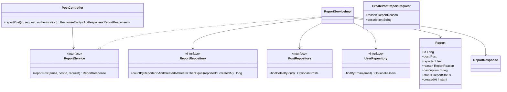
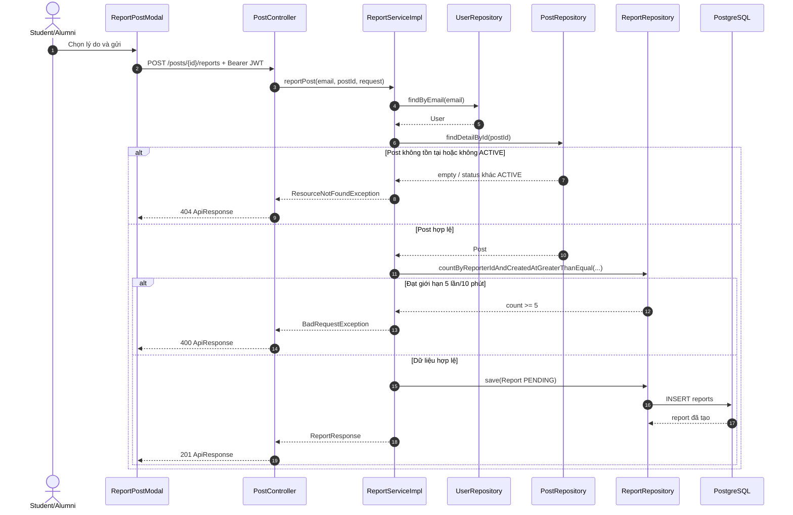

# SRS UC24 — Báo cáo bài viết vi phạm

## Report 3 — Nghiệp vụ

### Thông tin chung

| Thuộc tính | Giá trị |
| --- | --- |
| Mã use case | UC24 |
| Tên | Report a violating post |
| Actor | Student, Alumni |
| Endpoint | `POST /api/v1/posts/{postId}/reports` |
| Kết quả thành công | `201 Created`, `ApiResponse<ReportResponse>` |

### Mục đích và giao diện

Thành viên báo cáo một bài viết đang hiển thị trên Feed hoặc Post Detail. Nút Flag mở modal gồm lý do bắt buộc và mô tả tùy chọn; khi chọn `OTHER`, mô tả là bắt buộc. Guest được mời đăng nhập. Admin không thấy thao tác báo cáo vì không thuộc actor UC24.

### Luồng xử lý

```mermaid
flowchart TD
    A[Student/Alumni nhấn Flag] --> B[Mở ReportPostModal]
    B --> C{Dữ liệu hợp lệ?}
    C -- Không --> D[Hiển thị lỗi tiếng Việt tại trường]
    D --> B
    C -- Có --> E[POST /api/v1/posts/{postId}/reports]
    E --> F{JWT và role hợp lệ?}
    F -- Không --> G[401 hoặc 403]
    F -- Có --> H{Post tồn tại và ACTIVE?}
    H -- Không --> I[404 bài viết không còn khả dụng]
    H -- Có --> J{Đủ 5 report trong 10 phút?}
    J -- Có --> K[400 giới hạn chống lạm dụng]
    J -- Không --> L[Tạo reports với status PENDING]
    L --> M[201 và thông báo thành công]
```

### Business Rules

| Mã | Quy tắc |
| --- | --- |
| BR-24-01 | Chỉ `STUDENT` và `ALUMNI` được báo cáo. Guest bị chặn bởi JWT; vai trò khác nhận 403. |
| BR-24-02 | Bài viết phải tồn tại và có trạng thái `ACTIVE`; UC24 không tự ẩn hoặc xóa bài viết. |
| BR-24-03 | `reason` bắt buộc, thuộc `SPAM`, `INAPPROPRIATE`, `MISINFORMATION`, `SCAM_OR_FRAUD`, `OTHER`. |
| BR-24-04 | `description` tối đa 500 ký tự; bắt buộc khi `reason = OTHER`. |
| BR-24-05 | Mỗi tài khoản gửi tối đa 5 báo cáo trong 10 phút. |
| BR-24-06 | Mỗi báo cáo mới được lưu với `status = PENDING` để UC69–UC71 xử lý sau. |

### Thông điệp và lỗi

| Mã | HTTP | Nội dung |
| --- | --- | --- |
| MSG-UC24-01 | 201 | Đã gửi báo cáo. Chúng tôi sẽ xem xét bài viết này. |
| MSG-UC24-02 | 400 | Vui lòng chọn lý do báo cáo. |
| MSG-UC24-03 | 400 | Mô tả báo cáo không được vượt quá 500 ký tự. |
| MSG-UC24-04 | 400 | Vui lòng mô tả lý do báo cáo khác. |
| MSG-UC24-05 | 400 | Bạn đã gửi quá nhiều báo cáo. Vui lòng thử lại sau 10 phút. |
| MSG-UC24-06 | 401 | Phiên đăng nhập không hợp lệ hoặc đã hết hạn. |
| MSG-UC24-07 | 403 | Chỉ sinh viên và cựu sinh viên mới được báo cáo bài viết. |
| MSG-UC24-08 | 404 | Bài viết này không còn khả dụng. |

## Report 4 — Thiết kế chi tiết

### Database

Migration `V4__add_reports_table.sql` tạo bảng `reports`. Cột `post_id` là khóa ngoại đến `posts(id)` để chỉ cho phép báo cáo bài viết có thật; `reporter_id` tham chiếu `users(id)`. Hai index phục vụ truy vấn theo bài viết và kiểm tra giới hạn báo cáo theo người gửi/thời điểm.

### Class Diagram



### Sequence Diagram



AI moderation, WebSocket, appeal và màn hình quản trị không thuộc UC24 hiện tại; chúng chỉ được bổ sung bằng use case/migration riêng sau khi được chốt.
