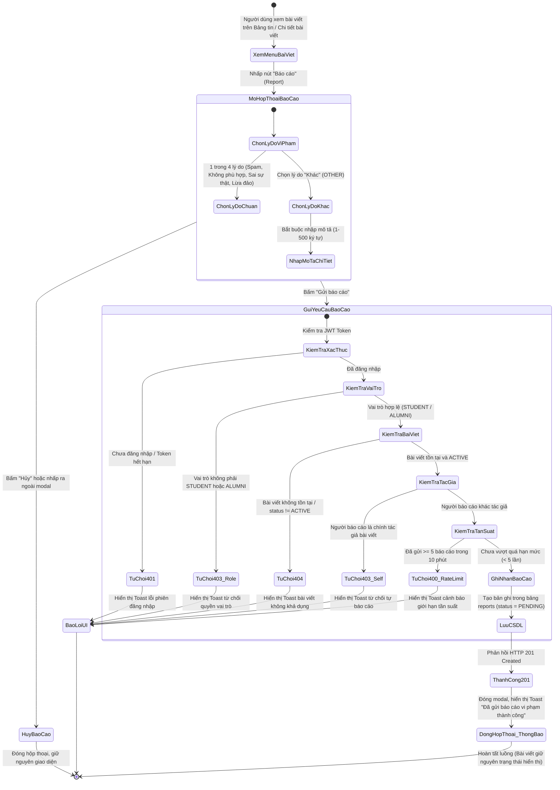
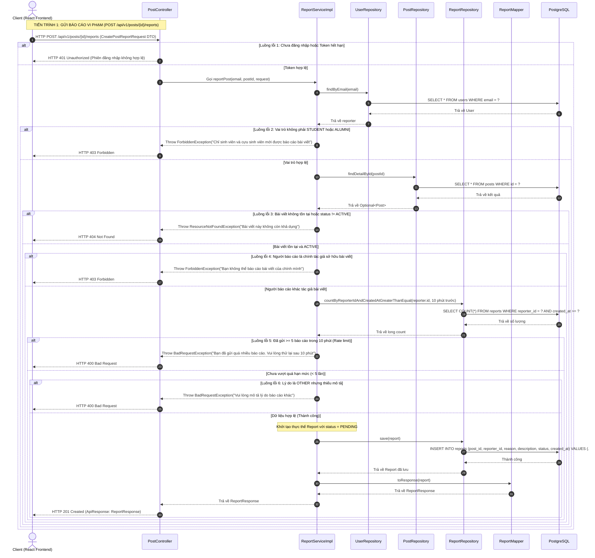

# ĐẶC TẢ YÊU CẦU & THIẾT KẾ CHI TIẾT: UC24 - BÁO CÁO BÀI VIẾT VI PHẠM (REPORT VIOLATING POST)

## PHẦN 1: ĐẶC TẢ NGHIỆP VỤ (REPORT 3)

### 2.2.3 Business Workflow (Luồng nghiệp vụ)

```mermaid
stateDiagram-v2
    [*] --> XemMenuBaiViet : Người dùng xem bài viết trên Bảng tin / Chi tiết bài viết
    XemMenuBaiViet --> MoHopThoaiBaoCao : Nhấp nút "Báo cáo" (Report)
    
    state MoHopThoaiBaoCao {
        [*] --> ChonLyDoViPham
        ChonLyDoViPham --> ChonLyDoChuan : 1 trong 4 lý do (Spam, Không phù hợp, Sai sự thật, Lừa đảo)
        ChonLyDoViPham --> ChonLyDoKhac : Chọn lý do "Khác" (OTHER)
        ChonLyDoKhac --> NhapMoTaChiTiet : Bắt buộc nhập mô tả (1-500 ký tự)
    }

    MoHopThoaiBaoCao --> HuyBaoCao : Bấm "Hủy" hoặc nhấp ra ngoài modal
    HuyBaoCao --> [*] : Đóng hộp thoại, giữ nguyên giao diện

    MoHopThoaiBaoCao --> GuiYeuCauBaoCao : Bấm "Gửi báo cáo"
    
    state GuiYeuCauBaoCao {
        [*] --> KiemTraXacThuc : Kiểm tra JWT Token
        KiemTraXacThuc --> TuChoi401 : Chưa đăng nhập / Token hết hạn
        KiemTraXacThuc --> KiemTraVaiTro : Đã đăng nhập
        
        KiemTraVaiTro --> TuChoi403_Role : Vai trò không phải STUDENT hoặc ALUMNI
        KiemTraVaiTro --> KiemTraBaiViet : Vai trò hợp lệ (STUDENT / ALUMNI)
        
        KiemTraBaiViet --> TuChoi404 : Bài viết không tồn tại / status != ACTIVE
        KiemTraBaiViet --> KiemTraTacGia : Bài viết tồn tại và ACTIVE
        
        KiemTraTacGia --> TuChoi403_Self : Người báo cáo là chính tác giả bài viết
        KiemTraTacGia --> KiemTraTanSuat : Người báo cáo khác tác giả
        
        KiemTraTanSuat --> TuChoi400_RateLimit : Đã gửi >= 5 báo cáo trong 10 phút
        KiemTraTanSuat --> GhiNhanBaoCao : Chưa vượt quá hạn mức (< 5 lần)
        
        GhiNhanBaoCao --> LuuCSDL : Tạo bản ghi trong bảng reports (status = PENDING)
    }

    LuuCSDL --> ThanhCong201 : Phản hồi HTTP 201 Created
    ThanhCong201 --> DongHopThoai_ThongBao : Đóng modal, hiển thị Toast "Đã gửi báo cáo vi phạm thành công"
    DongHopThoai_ThongBao --> [*] : Hoàn tất luồng (Bài viết giữ nguyên trạng thái hiển thị)

    TuChoi401 --> BaoLoiUI : Hiển thị Toast lỗi phiên đăng nhập
    TuChoi403_Role --> BaoLoiUI : Hiển thị Toast từ chối quyền vai trò
    TuChoi403_Self --> BaoLoiUI : Hiển thị Toast từ chối tự báo cáo
    TuChoi404 --> BaoLoiUI : Hiển thị Toast bài viết không khả dụng
    TuChoi400_RateLimit --> BaoLoiUI : Hiển thị Toast cảnh báo giới hạn tần suất
    BaoLoiUI --> [*]
```

#### Mô tả chi tiết luồng xử lý bằng chữ (Business Step Description):
* **Bước 1 - Khởi đầu**: Thành viên (Sinh viên `STUDENT` hoặc Cựu sinh viên `ALUMNI`) khi đang lướt Bảng tin (`/app`) hoặc xem Chi tiết bài viết (`/app/posts/{id}`), phát hiện bài viết có nội dung vi phạm tiêu chuẩn cộng đồng. Người dùng nhấp vào nút "Báo cáo" trên thẻ bài viết.
* **Bước 2 - Mở biểu mẫu báo cáo**: Hệ thống mở hộp thoại `ReportPostModal` hiển thị danh sách 5 lý do vi phạm chuẩn:
  1. Tin rác / Quảng cáo rác (`SPAM`)
  2. Nội dung không phù hợp / Phản cảm (`INAPPROPRIATE`)
  3. Thông tin sai lệch / Gây hiểu lầm (`MISINFORMATION`)
  4. Lừa đảo / Gian lận (`SCAM_OR_FRAUD`)
  5. Lý do khác (`OTHER`)
* **Bước 3 - Nhập thông tin chi tiết (Áp dụng khi chọn lý do "Khác")**: Nếu người dùng chọn lý do "Khác", hệ thống tự động mở rộng vùng nhập văn bản mô tả (`textarea`), yêu cầu người dùng giải thích chi tiết lý do (độ dài bắt buộc từ 1 đến 500 ký tự). Với các lý do chuẩn khác, trường mô tả là tùy chọn.
* **Bước 4 - Gửi yêu cầu báo cáo**: Người dùng nhấn nút "Gửi báo cáo". Nút chuyển sang trạng thái pending ("Đang gửi..."). Client gửi yêu cầu HTTP `POST /api/v1/posts/{postId}/reports` dạng JSON kèm JWT Token.
* **Bước 5 - Kiểm tra nghiệp vụ tại Backend**:
  * Kiểm tra xác thực & vai trò: Chỉ cho phép tài khoản có vai trò `STUDENT` hoặc `ALUMNI`. Nếu là Khách vãng lai (`GUEST`) -> 401 Unauthorized; nếu là `ADMIN` -> 403 Forbidden (Admin thực hiện kiểm duyệt trực tiếp tại cổng quản trị).
  * Kiểm tra trạng thái bài viết: Bài viết bị báo cáo phải tồn tại trong cơ sở dữ liệu và đang ở trạng thái hoạt động `ACTIVE`. Nếu bài viết đã bị xóa hoặc đã bị ẩn trước đó -> ném lỗi 404 Not Found.
  * Kiểm tra cấm tự báo cáo: Người gửi báo cáo không được trùng với tác giả đăng bài viết. Nếu trùng lặp -> ném lỗi 403 Forbidden.
  * Kiểm tra giới hạn tần suất (Rate limiting): Đếm số lượng báo cáo mà người dùng này đã gửi trong vòng 10 phút gần nhất. Nếu đã gửi từ 5 báo cáo trở lên -> ném lỗi 400 Bad Request kèm thông báo giới hạn tần suất.
* **Bước 6 - Ghi nhận báo cáo vào CSDL**:
  * Tạo bản ghi mới trong bảng `reports` với trạng thái chờ duyệt `PENDING`.
  * **Tính độc lập của dữ liệu**: Hành động gửi báo cáo tuyệt đối không tự động ẩn hay xóa bài viết. Bài viết vẫn giữ nguyên trạng thái `ACTIVE` trên Bảng tin để chờ Quản trị viên xem xét và xử lý theo quy trình kiểm duyệt.
  * Trả về phản hồi HTTP 201 Created kèm dữ liệu `ReportResponse`.
* **Bước 7 - Hoàn tất & Phản hồi giao diện**: Phía Client nhận phản hồi thành công, tự động đóng hộp thoại báo cáo, làm sạch form và hiển thị Toast thông báo: *"Đã gửi báo cáo vi phạm thành công"*.

---

### 3.2 Quản Lý Bài Viết & Bảng Tin

#### 3.2.1 Báo cáo bài viết vi phạm (Report Violating Post)

**Function trigger**:
*   **Navigation path**: Nút "Báo cáo" trên thẻ bài viết tại Bảng tin `/app` hoặc Trang chi tiết bài viết `/app/posts/{id}`.
*   **Timing Frequency**: On demand (bất cứ khi nào thành viên phát hiện bài viết vi phạm tiêu chuẩn cộng đồng).

**Function description**:
*   **Actors/Roles**: Sinh viên (STUDENT), Cựu sinh viên (ALUMNI).
*   **Purpose**: Cung cấp công cụ cho thành viên gắn cờ và gửi phản ánh các bài viết có nội dung vi phạm tiêu chuẩn cộng đồng đến ban quản trị để kịp thời xem xét, xử lý và duy trì môi trường trao đổi văn minh.
*   **Interface**:
    *   **Nút Báo cáo trên thanh tác vụ bài viết:** Nút icon cờ báo cáo `Flag` kèm chữ "Báo cáo".
    *   **Hộp thoại Báo cáo (`ReportPostModal`):**
        *   Tiêu đề: *"Báo cáo bài viết"*.
        *   Danh sách lựa chọn lý do vi phạm (Radio options / Button list).
        *   Ô nhập văn bản mô tả chi tiết: Mở rộng khi chọn lý do "Khác", hiển thị bộ đếm ký tự (tối đa 500 ký tự).
        *   Nút bấm: Nút "Hủy" và nút "Gửi báo cáo" (hiển thị trạng thái xoay "Đang gửi..." khi request đang được xử lý).
    *   **Phản hồi Toast:** Hiển thị thông báo thành công hoặc thông báo lỗi trực quan.

**Data processing**:
1.  **Kiểm tra tính hợp lệ Client:** Sử dụng React Hook Form kết hợp Zod schema kiểm tra bắt buộc chọn lý do vi phạm; nếu chọn "Khác" thì bắt buộc nhập mô tả từ 1 đến 500 ký tự.
2.  **Gửi yêu cầu:** Client gửi request HTTP `POST /api/v1/posts/{postId}/reports` dạng JSON kèm Bearer JWT Token.
3.  **Xử lý phía Server:**
    *   Xác thực quyền hạn: Chỉ cho phép tài khoản có vai trò `STUDENT` hoặc `ALUMNI`. Nếu là Admin hoặc Guest thì từ chối.
    *   Kiểm tra bài viết: Bài viết phải tồn tại và có trạng thái hoạt động `ACTIVE`. Nếu không, trả về 404 Not Found.
    *   Kiểm tra cấm tự báo cáo: Người báo cáo không được trùng với tác giả đăng bài viết. Nếu trùng, trả về 403 Forbidden.
    *   Kiểm tra tần suất (Rate limit): Đếm số báo cáo của người dùng trong 10 phút gần nhất. Nếu >= 5, trả về 400 Bad Request.
    *   Tạo bản ghi mới trong bảng `reports` với trạng thái `PENDING`.
    *   Trả về mã HTTP 201 Created kèm dữ liệu `ReportResponse`.

**Screen layout**:
*   *Figure 1: Nút "Báo cáo" trên thanh tác vụ của thẻ bài viết Bảng tin*
*   *Figure 2: Hộp thoại chọn lý do báo cáo vi phạm (`ReportPostModal`)*
*   *Figure 3: Hộp thoại báo cáo khi chọn lý do "Khác" (Mở rộng ô nhập mô tả chi tiết)*

**Function details**:
*   **Data**: 
    *   `postId` (Long, ID bài viết cần báo cáo)
    *   `reason` (String, thuộc 1 trong 5 enum: SPAM, INAPPROPRIATE, MISINFORMATION, SCAM_OR_FRAUD, OTHER)
    *   `description` (String, tối đa 500 ký tự, bắt buộc khi reason = OTHER)
*   **Validation**: 
    *   Phía Client: Zod schema kiểm tra bắt buộc `reason`, kiểm tra độ dài `description` (1-500 ký tự khi chọn OTHER).
    *   Phía Server: Kiểm tra enum `ReportReason`, kiểm tra ràng buộc trường `description` đối với lý do `OTHER`.
*   **Business rules**:
    *   **Quy tắc phân quyền:** Chỉ `STUDENT` và `ALUMNI` mới được quyền báo cáo bài viết.
    *   **Quy tắc cấm tự báo cáo:** Không cho phép tác giả tự báo cáo bài viết của chính mình.
    *   **Quy tắc giới hạn tần suất:** Mỗi tài khoản gửi tối đa 5 báo cáo trong 10 phút liên tục.
    *   **Quy tắc không tự động ẩn:** Hành động gửi báo cáo không làm ẩn hoặc xóa bài viết. Bài viết giữ nguyên trạng thái `ACTIVE` chờ Admin xử lý.
*   **Error Handling**:
    *   Mã lỗi 400 Bad Request khi thiếu lý do, thiếu mô tả lý do Khác, hoặc vượt quá 5 báo cáo / 10 phút.
    *   Mã lỗi 401 Unauthorized khi chưa đăng nhập hoặc token hết hạn.
    *   Mã lỗi 403 Forbidden khi người dùng là Admin hoặc tự báo cáo bài viết của chính mình.
    *   Mã lỗi 404 Not Found khi bài viết không tồn tại hoặc đã bị ẩn/xóa trước đó.
*   **Normal case**: Người dùng chọn lý do vi phạm, nhấn gửi báo cáo, hệ thống lưu báo cáo ở trạng thái PENDING, hiển thị Toast thông báo thành công và đóng hộp thoại.
*   **Abnormal case**:
    *   Gửi quá 5 báo cáo trong vòng 10 phút -> Báo lỗi giới hạn tần suất, yêu cầu thử lại sau 10 phút.
    *   Bài viết đã bị quản trị viên ẩn trước đó -> Báo lỗi bài viết không còn khả dụng.

---

### 5. Phụ lục Yêu cầu (Requirement Appendix)

#### 5.1 Quy tắc Nghiệp vụ (Business Rules)

| ID | Định nghĩa Quy tắc (Rule Definition) |
| :--- | :--- |
| BR-REP-01 | Chức năng báo cáo bài viết chỉ dành riêng cho tài khoản có vai trò `STUDENT` hoặc `ALUMNI`. |
| BR-REP-02 | Bài viết bị báo cáo bắt buộc phải tồn tại trong cơ sở dữ liệu và đang ở trạng thái hoạt động bình thường (`ACTIVE`). |
| BR-REP-03 | Tác giả sở hữu bài viết không được phép tự gửi báo cáo vi phạm đối với bài viết của chính mình. |
| BR-REP-04 | Mỗi tài khoản người dùng chỉ được phép gửi tối đa 05 lượt báo cáo trong khoảng thời gian 10 phút liên tục. |
| BR-REP-05 | Trường lý do báo cáo là bắt buộc và phải thuộc 1 trong 5 danh mục chuẩn. Khi chọn lý do là OTHER, người dùng bắt buộc phải nhập mô tả từ 1 đến 500 ký tự. |
| BR-REP-06 | Hành động gửi báo cáo bài viết không làm tự động thay đổi trạng thái, không làm ẩn hoặc xóa bài viết khỏi bảng tin. Báo cáo được lưu trữ ở trạng thái `PENDING` để Quản trị viên xem xét. |

#### 5.2 Yêu cầu Chung (Common Requirements)
*   Mọi thông điệp báo lỗi dữ liệu hoặc phản hồi giao diện phải bằng **Tiếng Việt**.
*   Toàn bộ kết nối gọi API gửi báo cáo phải được bảo vệ qua giao thức an toàn HTTPS/TLS.
*   Danh tính của người gửi báo cáo phải được bảo mật tuyệt đối, chỉ hiển thị trong trang quản trị nội bộ dành cho Admin, không bao giờ tiết lộ cho tác giả bài viết.
*   Thời gian phản hồi của API tiếp nhận báo cáo phải dưới 1.0 giây.
*   Nút gửi báo cáo trên giao diện phải tự động khóa tương tác ngay khi nhấn click lần đầu tiên để ngăn chặn gửi trùng lặp request.

#### 5.3 Danh sách Thông điệp Ứng dụng (Application Messages List)

| # | Mã thông điệp | Loại thông điệp | Ngữ cảnh | Nội dung hiển thị |
| :--- | :--- | :--- | :--- | :--- |
| 1 | MSG-REP-01 | Toast/Alert success | Gửi báo cáo thành công | Đã gửi báo cáo vi phạm thành công |
| 2 | MSG-REP-02 | Toast/Alert error | Chưa chọn lý do báo cáo | Vui lòng chọn lý do báo cáo |
| 3 | MSG-REP-03 | Toast/Alert error | Thiếu mô tả khi chọn lý do Khác | Vui lòng mô tả lý do báo cáo khác |
| 4 | MSG-REP-04 | Toast/Alert error | Mô tả vượt quá 500 ký tự | Mô tả không được vượt quá 500 ký tự |
| 5 | MSG-REP-05 | Toast/Alert error | Vượt quá 5 báo cáo trong 10 phút | Bạn đã gửi quá nhiều báo cáo. Vui lòng thử lại sau 10 phút |
| 6 | MSG-REP-06 | Toast/Alert error | Tác giả tự báo cáo bài viết của mình | Bạn không thể báo cáo bài viết của chính mình |
| 7 | MSG-REP-07 | Toast/Alert error | Bài viết không tồn tại hoặc đã bị ẩn | Bài viết này không còn khả dụng |
| 8 | MSG-REP-08 | Toast/Alert error | Vai trò không được phép báo cáo | Chỉ sinh viên và cựu sinh viên mới được báo cáo bài viết |
| 9 | MSG-REP-09 | Toast/Alert error | Phiên đăng nhập hết hạn | Phiên đăng nhập không hợp lệ hoặc đã hết hạn. |
| 10 | MSG-REP-10 | Button state | Khi đang gửi yêu cầu lên máy chủ | Đang gửi... |

---

## PHẦN 2: THIẾT KẾ CHI TIẾT (REPORT 4)

### 3. Thiết kế chi tiết

#### 3.1 Chức năng Báo cáo bài viết vi phạm (Report Violating Post)

##### 3.1.1 Class Diagram (Sơ đồ Lớp)

```mermaid
classDiagram
    %% --- TẦNG CONTROLLER ---
    class PostController {
        -ReportService reportService
        +reportPost(Long, CreatePostReportRequest, Authentication) ResponseEntity
    }

    %% --- TẦNG DTO ---
    class CreatePostReportRequest {
        +String reason
        +String description
    }

    class ReportResponse {
        +Long id
        +Long postId
        +ReportReason reason
        +String description
        +ReportStatus status
        +Instant createdAt
    }

    class ApiResponse {
        +int status
        +String message
        +Object data
    }

    %% --- TẦNG SERVICE ---
    class ReportService {
        <<interface>>
        +reportPost(String, Long, CreatePostReportRequest) ReportResponse
    }

    class ReportServiceImpl {
        -ReportRepository reportRepository
        -PostRepository postRepository
        -UserRepository userRepository
        -ReportMapper reportMapper
        +reportPost(String, Long, CreatePostReportRequest) ReportResponse
    }

    %% --- TẦNG MAPPER ---
    class ReportMapper {
        <<interface>>
        +toResponse(Report) ReportResponse
    }

    %% --- TẦNG REPOSITORY ---
    class ReportRepository {
        <<interface>>
        +countByReporterIdAndCreatedAtGreaterThanEqual(Long, Instant) long
        +save(Report) Report
    }

    class PostRepository {
        <<interface>>
        +findDetailById(Long) Optional
    }

    class UserRepository {
        <<interface>>
        +findByEmail(String) Optional
    }

    %% --- TẦNG ENTITY ---
    class Report {
        +Long id
        +User reporter
        +Post post
        +ReportReason reason
        +String description
        +ReportStatus status
        +Instant createdAt
    }

    class Post {
        +Long id
        +User author
        +String content
        +PostStatus status
    }

    class User {
        +Long id
        +String email
        +Role role
    }

    %% --- ENUMS ---
    class ReportReason {
        <<enumeration>>
        SPAM
        INAPPROPRIATE
        MISINFORMATION
        SCAM_OR_FRAUD
        OTHER
    }

    class ReportStatus {
        <<enumeration>>
        PENDING
        RESOLVED
        DISMISSED
    }

    %% --- MỐI QUAN HỆ ---
    PostController --> ReportService : Gọi nghiệp vụ
    PostController ..> CreatePostReportRequest : Sử dụng DTO
    PostController ..> ApiResponse : Phản hồi
    ReportServiceImpl ..|> ReportService : Triển khai
    ReportServiceImpl --> ReportRepository : Truy vấn báo cáo
    ReportServiceImpl --> PostRepository : Truy vấn bài viết
    ReportServiceImpl --> UserRepository : Truy vấn người dùng
    ReportServiceImpl --> ReportMapper : Sử dụng mapper
    ReportServiceImpl --> Report : Lưu thực thể
    ReportMapper ..> ReportResponse : Ánh xạ thành
    Report --> User : Người báo cáo
    Report --> Post : Bài viết bị báo cáo
    Report --> ReportReason : Lý do
    Report --> ReportStatus : Trạng thái
```

###### Mô tả chi tiết cấu trúc các lớp (Class Design Description):
* **Lớp Controller (`PostController`)**: Cung cấp endpoint HTTP `POST /api/v1/posts/{id}/reports`. Tiếp nhận yêu cầu báo cáo kèm ID bài viết, DTO `CreatePostReportRequest` và đối tượng `Authentication` từ Spring Security. Chuyển tiếp tới `ReportService.reportPost()` và trả về `ApiResponse` với mã trạng thái HTTP 201 Created.
* **Lớp DTO (`CreatePostReportRequest`, `ReportResponse`, `ApiResponse`)**: Đóng gói thông tin dữ liệu đầu vào gồm lý do và mô tả, cùng cấu trúc dữ liệu phản hồi sau khi lưu trữ báo cáo thành công.
* **Lớp Service (`ReportService` và lớp triển khai `ReportServiceImpl`)**: 
  * Xác thực người dùng, bắt buộc phải có vai trò `STUDENT` hoặc `ALUMNI`.
  * Kiểm tra bài viết tồn tại và đang ở trạng thái `ACTIVE` qua `PostRepository.findDetailById()`.
  * Kiểm tra cấm tự báo cáo bài viết của chính mình: người báo cáo không trùng tác giả bài viết.
  * Kiểm tra hạn mức chống spam (Rate limit): Gọi `ReportRepository.countByReporterIdAndCreatedAtGreaterThanEqual()` kiểm tra số lượng báo cáo trong 10 phút.
  * Kiểm tra tính hợp lệ của lý do và bắt buộc mô tả đối với lý do `OTHER`.
  * Lưu bản ghi `Report` mới với `ReportStatus.PENDING`.
* **Lớp Mapper (`ReportMapper`)**: Giao diện MapStruct tự động chuyển đổi giữa thực thể `Report` và DTO `ReportResponse`.
* **Lớp Repository & Entity**:
  * `ReportRepository` quản lý dữ liệu trong bảng `reports`, đếm tần suất báo cáo và lưu bản ghi.
  * `PostRepository` truy vấn dữ liệu bài viết từ bảng `posts`.
  * `UserRepository` truy vấn thông tin người dùng từ bảng `users`.
  * Các Entity (`Report`, `Post`, `User`) biểu diễn cấu trúc bảng CSDL của PostgreSQL.

##### 3.1.2 Sequence Diagram (Sơ đồ Tuần tự)

```mermaid
sequenceDiagram
    autonumber
    actor Client as Client (React Frontend)
    participant Ctrl as PostController
    participant Service as ReportServiceImpl
    participant UserRepo as UserRepository
    participant PostRepo as PostRepository
    participant ReportRepo as ReportRepository
    participant Mapper as ReportMapper
    participant DB as PostgreSQL

    %% --- BÁO CÁO BÀI VIẾT VI PHẠM ---
    Note over Client, Ctrl: TIẾN TRÌNH 1: GỬI BÁO CÁO VI PHẠM (POST /api/v1/posts/{id}/reports)
    Client->>Ctrl: HTTP POST /api/v1/posts/{id}/reports (CreatePostReportRequest DTO)
    
    alt Luồng lỗi 1: Chưa đăng nhập hoặc Token hết hạn
        Ctrl-->>Client: HTTP 401 Unauthorized (Phiên đăng nhập không hợp lệ)
        
    else Token hợp lệ
        Ctrl->>Service: Gọi reportPost(email, postId, request)
        
        Service->>UserRepo: findByEmail(email)
        UserRepo->>DB: SELECT * FROM users WHERE email = ?
        DB-->>UserRepo: Trả về User
        UserRepo-->>Service: Trả về reporter
        
        alt Luồng lỗi 2: Vai trò không phải STUDENT hoặc ALUMNI
            Service-->>Ctrl: Throw ForbiddenException("Chỉ sinh viên và cựu sinh viên mới được báo cáo bài viết")
            Ctrl-->>Client: HTTP 403 Forbidden
            
        else Vai trò hợp lệ
            Service->>PostRepo: findDetailById(postId)
            PostRepo->>DB: SELECT * FROM posts WHERE id = ?
            DB-->>PostRepo: Trả về kết quả
            PostRepo-->>Service: Trả về Optional<Post>
            
            alt Luồng lỗi 3: Bài viết không tồn tại hoặc status != ACTIVE
                Service-->>Ctrl: Throw ResourceNotFoundException("Bài viết này không còn khả dụng")
                Ctrl-->>Client: HTTP 404 Not Found
                
            else Bài viết tồn tại và ACTIVE
                alt Luồng lỗi 4: Người báo cáo là chính tác giả sở hữu bài viết
                    Service-->>Ctrl: Throw ForbiddenException("Bạn không thể báo cáo bài viết của chính mình")
                    Ctrl-->>Client: HTTP 403 Forbidden
                    
                else Người báo cáo khác tác giả bài viết
                    Service->>ReportRepo: countByReporterIdAndCreatedAtGreaterThanEqual(reporter.id, 10 phút trước)
                    ReportRepo->>DB: SELECT COUNT(*) FROM reports WHERE reporter_id = ? AND created_at >= ?
                    DB-->>ReportRepo: Trả về số lượng
                    ReportRepo-->>Service: Trả về long count
                    
                    alt Luồng lỗi 5: Đã gửi >= 5 báo cáo trong 10 phút (Rate limit)
                        Service-->>Ctrl: Throw BadRequestException("Bạn đã gửi quá nhiều báo cáo. Vui lòng thử lại sau 10 phút")
                        Ctrl-->>Client: HTTP 400 Bad Request
                        
                    else Chưa vượt quá hạn mức (< 5 lần)
                        alt Luồng lỗi 6: Lý do là OTHER nhưng thiếu mô tả
                            Service-->>Ctrl: Throw BadRequestException("Vui lòng mô tả lý do báo cáo khác")
                            Ctrl-->>Client: HTTP 400 Bad Request
                            
                        else Dữ liệu hợp lệ (Thành công)
                            Note over Service: Khởi tạo thực thể Report với status = PENDING
                            Service->>ReportRepo: save(report)
                            ReportRepo->>DB: INSERT INTO reports (post_id, reporter_id, reason, description, status, created_at) VALUES (...)
                            DB-->>ReportRepo: Thành công
                            ReportRepo-->>Service: Trả về Report đã lưu
                            
                            Service->>Mapper: toResponse(report)
                            Mapper-->>Service: Trả về ReportResponse
                            
                            Service-->>Ctrl: Trả về ReportResponse
                            Ctrl-->>Client: HTTP 201 Created (ApiResponse: ReportResponse)
                        end
                    end
                end
            end
        end
    end
```

###### Mô tả chi tiết luồng xử lý bằng chữ (Sequence Flow Description):

1.  **TIẾN TRÌNH 1: GỬI BÁO CÁO BÀI VIẾT VI PHẠM (Normal Case)**
    *   **Gửi Request:** Thành viên chọn lý do vi phạm và nhấn "Gửi báo cáo" trên hộp thoại `ReportPostModal`. Client gửi yêu cầu HTTP `POST /api/v1/posts/{id}/reports` kèm JWT Token.
    *   **Kiểm tra xác thực & vai trò:** `PostController` tiếp nhận và gọi `ReportServiceImpl.reportPost()`. Service xác minh người dùng có vai trò `STUDENT` hoặc `ALUMNI`.
    *   **Kiểm tra bài viết & quyền tác giả:** Service kiểm tra bài viết tồn tại và đang ở trạng thái `ACTIVE` qua `PostRepository`. Kiểm tra người gửi không phải là chính tác giả sở hữu bài viết.
    *   **Kiểm tra tần suất & tính hợp lệ:** Kiểm tra người gửi chưa vượt quá giới hạn 5 báo cáo / 10 phút qua `ReportRepository`. Kiểm tra trường mô tả chi tiết hợp lệ.
    *   **Lưu CSDL & Phản hồi:** Bản ghi báo cáo mới được lưu vào bảng `reports` với trạng thái `PENDING`. Service chuyển đổi sang `ReportResponse` và trả về `PostController`. Controller phản hồi HTTP 201 Created. Frontend đóng hộp thoại và hiển thị Toast thông báo thành công: *"Đã gửi báo cáo vi phạm thành công"*.

2.  **TIẾN TRÌNH 2: NGOẠI LỆ HẾT HẠN PHIÊN ĐĂNG NHẬP (401 Unauthorized)**
    *   **Gửi Request:** Client gửi request khi chưa đăng nhập hoặc khi JWT Token đã hết hạn.
    *   **Xử lý lỗi:** Spring Security chặn yêu cầu và trả về mã HTTP 401 Unauthorized. Giao diện hiển thị thông báo phiên làm việc đã hết hạn.

3.  **TIẾN TRÌNH 3: NGOẠI LỆ TỰ BÁO CÁO HOẶC SAI VAI TRÒ (403 Forbidden)**
    *   **Gửi Request:** Tác giả cố tình tự báo cáo bài viết của chính mình, hoặc tài khoản Quản trị viên gửi request báo cáo.
    *   **Xử lý lỗi:** Service ném ngoại lệ `ForbiddenException`. `GlobalExceptionHandler` bắt và trả về mã HTTP 403 Forbidden kèm thông điệp báo lỗi tương ứng.

4.  **TIẾN TRÌNH 4: NGOẠI LỆ VƯỢT QUÁ TẦN SUẤT BÁO CÁO (400 Bad Request)**
    *   **Gửi Request:** Người dùng gửi từ 5 báo cáo trở lên trong khoảng thời gian 10 phút.
    *   **Xử lý lỗi:** `ReportRepository` đếm số lượng `>= 5`, Service ném `BadRequestException("Bạn đã gửi quá nhiều báo cáo. Vui lòng thử lại sau 10 phút")`. Backend trả về mã HTTP 400 Bad Request.

5.  **TIẾN TRÌNH 5: NGOẠI LỆ BÀI VIẾT KHÔNG TỒN TẠI HOẶC ĐÃ BỊ ẨN (404 Not Found)**
    *   **Gửi Request:** ID bài viết không tồn tại trong CSDL hoặc bài viết đã bị xóa mềm/bị ẩn trước đó (`status != ACTIVE`).
    *   **Xử lý lỗi:** Service ném `ResourceNotFoundException("Bài viết này không còn khả dụng")`. Backend trả về mã HTTP 404 Not Found.
