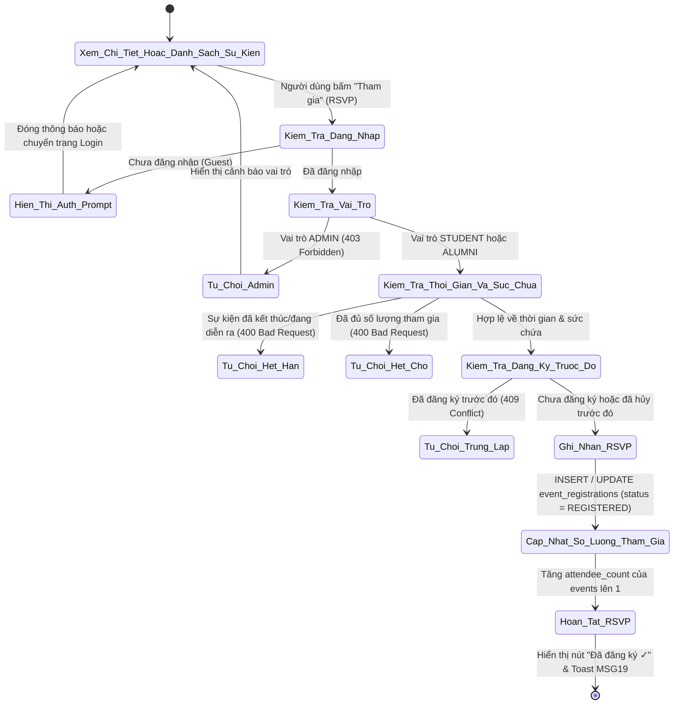
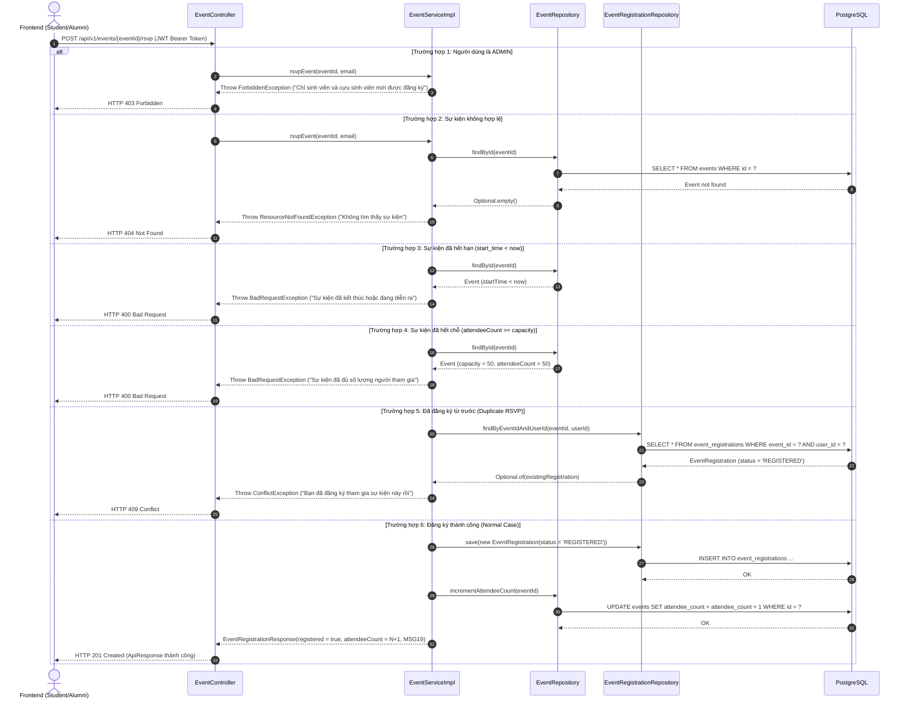

# ĐẶC TẢ YÊU CẦU & THIẾT KẾ CHI TIẾT: UC25 - REGISTER TO ATTEND AN EVENT (RSVP)

## PHẦN 1: ĐẶC TẢ NGHIỆP VỤ (REPORT 3)

### 2.2.3 Business Workflow (Luồng nghiệp vụ)

#### Mô tả chi tiết luồng xử lý bằng chữ (Business Step Description):
* **Bước 1 - Khởi đầu**: Sinh viên hoặc cựu sinh viên xem bài viết sự kiện trên trang Sự kiện (`/app/events`), Bảng tin cộng đồng (`/app/feed`) hoặc Trang chi tiết bài viết (`/app/posts/:id`), thấy nút hành động "Tham gia" (RSVP) kèm sức chứa và số lượng người đã đăng ký.
* **Bước 2 - Kiểm tra quyền và trạng thái**:
  * Nếu người dùng là Khách (Guest chưa đăng nhập), hệ thống mở modal `LoginPromptModal` yêu cầu đăng nhập.
  * Nếu người dùng là Admin, hệ thống chặn với thông báo "Chỉ sinh viên và cựu sinh viên mới được đăng ký tham gia sự kiện".
  * Hệ thống kiểm tra thời gian bắt đầu của sự kiện (`start_time`). Nếu thời gian bắt đầu đã qua, từ chối đăng ký ("Sự kiện đã kết thúc hoặc đang diễn ra").
  * Hệ thống kiểm tra sức chứa tối đa (`capacity`). Nếu số lượng đã đăng ký (`attendee_count`) đạt hoặc vượt mức tối đa, từ chối ("Sự kiện đã đủ số lượng người tham gia").
  * Hệ thống kiểm tra trong bảng `event_registrations`. Nếu người dùng đã có bản ghi trạng thái `REGISTERED`, từ chối báo lỗi 409 Conflict ("Bạn đã đăng ký tham gia sự kiện này rồi").
* **Bước 3 - Ghi nhận và phản hồi**:
  * Tạo mới hoặc cập nhật bản ghi `event_registrations` sang trạng thái `REGISTERED`.
  * Tăng số lượng người tham gia `attendee_count` trong bảng `events` thêm 1.
  * Trả về kết quả thành công kèm thông điệp `MSG19` ("Đăng ký tham gia sự kiện thành công!"). Nút bấm chuyển sang trạng thái "Đã đăng ký ✓" (cho phép bấm để hủy đăng ký nếu sự kiện chưa diễn ra).

---

### 3.2 Module 3 - Social: Feed, Posts, Events, Packages & Messaging
Module 3 phụ trách toàn bộ hệ sinh thái mạng xã hội nội bộ dành cho sinh viên và cựu sinh viên Đại học FPT, bao gồm Bảng tin cộng đồng đa hình thức (Bài viết thường, Thành tựu, Tuyển dụng, Sự kiện), tương tác Like/Save/Bình luận, và Đăng ký tham gia sự kiện (RSVP).

#### 3.2.1 Đăng ký tham gia sự kiện (RSVP) - UC25

**Function trigger**:
*   **Navigation path**: 
    * `/app/events` -> Thẻ sự kiện -> Nút "Tham gia"
    * `/app/posts/:id` -> Khung thông tin sự kiện -> Nút "Tham gia"
*   **Timing Frequency**: On demand (bất kỳ khi nào sinh viên/cựu sinh viên muốn đăng ký tham gia).

**Function description**:
*   **Actors/Roles**: Student, Alumni.
*   **Purpose**: Cho phép sinh viên và cựu sinh viên xác nhận tham gia sự kiện do nhà trường hoặc cựu sinh viên tổ chức, giúp ban tổ chức kiểm soát số lượng người tham dự và quản lý danh sách đón tiếp.
*   **Interface**:
    *   **Thẻ sự kiện (EventsPage & PostDetailPage)**: Hiển thị ngày giờ, địa điểm, sức chứa tối đa (`capacity`), số lượng người đã tham gia (`attendee_count`).
    *   **Nút RSVP đa trạng thái**:
        *   `Tham gia` (Primary): Khi sự kiện còn chỗ và chưa đăng ký.
        *   `Đã đăng ký ✓` (Secondary / Success): Khi người dùng hiện tại đã đăng ký; hover hiển thị `Hủy đăng ký`.
        *   `Hết chỗ` (Disabled): Khi số lượng đăng ký đã đạt `capacity`.
        *   `Đã kết thúc` (Disabled): Khi sự kiện đã bắt đầu hoặc kết thúc.
        *   `Đang xử lý...` (Loading Spinner): Trong khi gửi request tới máy chủ.
    *   **Danh sách Attendees (Modal)**: Bấm vào số người tham gia để mở danh sách họ tên, avatar, chức danh và vai trò của những người đã RSVP.
    *   **Modal nhắc đăng nhập (LoginPromptModal)**: Bật lên khi khách chưa đăng nhập bấm nút RSVP.

**Data processing**:
1. Tiếp nhận HTTP request `POST /api/v1/events/{eventId}/rsvp` kèm JWT token.
2. Trích xuất email người dùng từ Security Context.
3. Truy vấn `users` và kiểm tra vai trò: bắt buộc `STUDENT` hoặc `ALUMNI`. Nếu là `ADMIN`, ném `ForbiddenException (403)`.
4. Truy vấn `events` theo `eventId`. Nếu không tồn tại, ném `ResourceNotFoundException (404)`.
5. So sánh `event.startTime` với `Instant.now()`. Nếu nhỏ hơn, ném `BadRequestException (400)`.
6. Kiểm tra `capacity`: nếu `capacity != null` và `attendeeCount >= capacity`, ném `BadRequestException (400)`.
7. Kiểm tra `event_registrations`:
   * Nếu đã tồn tại bản ghi với `status = 'REGISTERED'`, ném `ConflictException (409)`.
   * Nếu đã tồn tại với `status = 'CANCELLED'`, cập nhật lại `status = 'REGISTERED'`.
   * Nếu chưa tồn tại, chèn bản ghi mới với `event_id`, `user_id`, `status = 'REGISTERED'`.
8. Tăng `attendee_count` trong bảng `events` thêm 1.
9. Trả về `EventRegistrationResponse` chứa `eventId`, `registered: true`, `attendeeCount`, `capacity`, `message`.

**Function details**:
*   **Data**: `eventId`, `userId`, `status` ('REGISTERED', 'CANCELLED'), `created_at`.
*   **Validation**: `eventId` hợp lệ > 0; tài khoản người dùng hoạt động và thuộc vai trò hợp lệ; sự kiện chưa diễn ra; còn sức chứa.
*   **Business rules**:
    *   `BR-12`: Mỗi người dùng chỉ được đăng ký tham gia một sự kiện một lần duy nhất tại một thời điểm.
    *   `BR-13`: Không thể đăng ký tham gia sự kiện nếu số lượng đăng ký đã đạt sức chứa tối đa (`attendee_count >= capacity`).
    *   `BR-17`: Sinh viên có tài khoản hợp lệ được phép đăng ký tham gia sự kiện.
    *   `BR-18`: Cựu sinh viên có tài khoản đã được phê duyệt được phép đăng ký tham gia sự kiện.
    *   `BR-19`: Người tham gia được quyền hủy đăng ký tham gia sự kiện trước thời điểm sự kiện bắt đầu (`start_time > now()`).
*   **Error Handling**:
    *   `401 Unauthorized`: Người dùng chưa đăng nhập.
    *   `403 Forbidden`: Tài khoản Admin hoặc vai trò không hợp lệ cố gắng đăng ký.
    *   `400 Bad Request`: Sự kiện đã kết thúc, hoặc sự kiện đã đủ người tham gia, hoặc hủy đăng ký khi chưa đăng ký.
    *   `404 Not Found`: Không tìm thấy sự kiện theo ID.
    *   `409 Conflict`: Người dùng đã đăng ký sự kiện này từ trước.
*   **Normal case**: Đăng ký thành công, số lượng người tham gia tăng lên 1, hệ thống hiển thị thông báo `MSG19` "Đăng ký tham gia sự kiện thành công!" và trạng thái nút chuyển sang "Đã đăng ký ✓".
*   **Abnormal case**:
    *   Sự kiện đã hết chỗ -> Nút chuyển sang "Hết chỗ", hiển thị thông báo `MSG20` "Sự kiện đã đủ số lượng người tham gia."
    *   Trùng lặp đăng ký -> Hiển thị thông báo `MSG21` "Bạn đã đăng ký tham gia sự kiện này rồi."

---

### 5. Requirement Appendix (Phụ lục Yêu cầu)

#### 5.1 Business Rules (Quy tắc Nghiệp vụ)

| ID | Định nghĩa Quy tắc (Rule Definition) |
| :--- | :--- |
| BR-12 | Mỗi người dùng chỉ được đăng ký tham gia một sự kiện tối đa một lần (Unique constraint trên cặp `event_id, user_id`). |
| BR-13 | Sự kiện có thiết lập giới hạn sức chứa (`capacity`) không cho phép đăng ký vượt quá số lượng tối đa này. |
| BR-17 | Người dùng mang vai trò Sinh viên (STUDENT) có tài khoản hợp lệ được quyền đăng ký tham gia các sự kiện. |
| BR-18 | Người dùng mang vai trò Cựu sinh viên (ALUMNI) có tài khoản hợp lệ được quyền đăng ký tham gia các sự kiện. |
| BR-19 | Người dùng chỉ được phép đăng ký hoặc hủy đăng ký trước thời điểm sự kiện bắt đầu (`start_time > current_time`). |

#### 5.2 Common Requirements (Yêu cầu Chung)
*   Thao tác RSVP sử dụng cơ chế Optimistic UI ở Client để mang lại trải nghiệm phản hồi tức thì mượt mà.
*   Giao diện tương thích hoàn toàn trên Desktop, Tablet và Mobile với Tailwind CSS và Framer Motion.
*   Tất cả các thay đổi số lượng người tham gia được đồng bộ với React Query cache cho các trang liên quan (Bảng tin, Chi tiết bài viết, Sự kiện).

#### 5.3 Application Messages List (Danh sách Thông điệp Ứng dụng)

| # | Mã thông điệp (Message code) | Loại thông điệp (Message Type) | Ngữ cảnh (Context) | Nội dung hiển thị (Content) |
| :--- | :--- | :--- | :--- | :--- |
| 1 | MSG19 | Toast message / Banner | Đăng ký tham gia sự kiện thành công | Đăng ký tham gia sự kiện thành công! |
| 2 | MSG20 | In red / Toast message | Sự kiện đã đủ số lượng người tham gia | Sự kiện đã đủ số lượng người tham gia. |
| 3 | MSG21 | In red / Toast message | Người dùng đã đăng ký trước đó | Bạn đã đăng ký tham gia sự kiện này rồi. |
| 4 | MSG22 | Toast message / Banner | Hủy đăng ký tham gia sự kiện thành công | Hủy đăng ký tham gia sự kiện thành công! |
| 5 | MSG23 | Modal Prompt | Khách chưa đăng nhập bấm tham gia | Đăng nhập để đăng ký tham gia sự kiện. |

---

## PHẦN 2: THIẾT KẾ CHI TIẾT (REPORT 4)

### 3. Detail Design (Thiết kế chi tiết)

#### 3.1 Đăng ký tham gia sự kiện (RSVP) - UC25

##### 3.1.1 Class Diagram (Sơ đồ Lớp)

```mermaid
classDiagram
    %% Controller Layer
    class EventController {
        -EventService eventService
        +rsvpEvent(eventId, authentication) ResponseEntity~ApiResponse~EventRegistrationResponse~~
        +cancelRsvp(eventId, authentication) ResponseEntity~ApiResponse~EventRegistrationResponse~~
        +getRsvpStatus(eventId, authentication) ResponseEntity~ApiResponse~EventRegistrationResponse~~
        +getEventAttendees(eventId) ResponseEntity~ApiResponse~List~EventAttendeeResponse~~~
    }

    %% Service Layer
    class EventService {
        <<interface>>
        +rsvpEvent(eventId, email) EventRegistrationResponse
        +cancelRsvp(eventId, email) EventRegistrationResponse
        +getRsvpStatus(eventId, email) EventRegistrationResponse
        +getEventAttendees(eventId) List~EventAttendeeResponse~
    }

    class EventServiceImpl {
        -EventRepository eventRepository
        -EventRegistrationRepository eventRegistrationRepository
        -UserRepository userRepository
        -UserProfileRepository userProfileRepository
        +rsvpEvent(eventId, email) EventRegistrationResponse
        +cancelRsvp(eventId, email) EventRegistrationResponse
        +getRsvpStatus(eventId, email) EventRegistrationResponse
        +getEventAttendees(eventId) List~EventAttendeeResponse~
        -resolveMemberOrThrow(email, forbiddenMsg) User
    }

    %% DTOs
    class EventRegistrationResponse {
        -Long eventId
        -boolean registered
        -int attendeeCount
        -Integer capacity
        -String message
    }

    class EventAttendeeResponse {
        -Long userId
        -String fullName
        -String avatarUrl
        -String headline
        -String role
        -Instant registeredAt
    }

    class EventDTO {
        -Long id
        -String title
        -String location
        -Instant startTime
        -Instant endTime
        -Integer capacity
        -Integer attendeeCount
        -Boolean isRegistered
    }

    %% Entities
    class Event {
        -Long id
        -User organizer
        -String title
        -String location
        -Instant startTime
        -Instant endTime
        -Integer capacity
        -int attendeeCount
        -Instant createdAt
        -Instant updatedAt
    }

    class EventRegistration {
        -Long id
        -Event event
        -User user
        -String status
        -Instant createdAt
    }

    class User {
        -Long id
        -String email
        -Role role
    }

    %% Repositories
    class EventRepository {
        <<interface>>
        +findById(id) Optional~Event~
        +incrementAttendeeCount(eventId) void
        +decrementAttendeeCount(eventId) void
    }

    class EventRegistrationRepository {
        <<interface>>
        +findByEventIdAndUserId(eventId, userId) Optional~EventRegistration~
        +existsByEventIdAndUserIdAndStatus(eventId, userId, status) boolean
        +countByEventIdAndStatus(eventId, status) long
        +findByEventIdAndStatusOrderByCreatedAtAsc(eventId, status) List~EventRegistration~
        +findRegisteredEventIds(userId, eventIds) List~Long~
    }

    EventController ..> EventService : invokes
    EventServiceImpl ..|> EventService : implements
    EventServiceImpl --> EventRepository : uses
    EventServiceImpl --> EventRegistrationRepository : uses
    EventServiceImpl --> EventRegistrationResponse : produces
    EventServiceImpl --> EventAttendeeResponse : produces
    EventRegistration --> Event : references
    EventRegistration --> User : references
```

###### Mô tả chi tiết cấu trúc các lớp (Class Design Description):
* **Lớp Controller (`EventController.java`)**: Tiếp nhận các yêu cầu HTTP tại `/api/v1/events/{eventId}/rsvp` (POST, DELETE, GET) và `/api/v1/events/{eventId}/attendees` (GET). Trích xuất danh tính xác thực từ Security Context và điều phối tới `EventService`.
* **Lớp DTO (`EventRegistrationResponse.java`, `EventAttendeeResponse.java`, `EventDTO.java`)**: Chứa dữ liệu phản hồi tiêu chuẩn trả về cho Client, bao gồm trạng thái đăng ký, số lượng người tham gia, danh sách attendees và thông điệp kết quả.
* **Lớp Service (`EventService.java`, `EventServiceImpl.java`)**: Thực thi logic nghiệp vụ cho UC25: kiểm tra vai trò (Student/Alumni), kiểm tra thời gian sự kiện, kiểm tra sức chứa tối đa, chặn đăng ký trùng lặp (BR-12), cập nhật trạng thái bản ghi và tăng/giảm bộ đếm người tham gia.
* **Lớp Entity (`Event.java`, `EventRegistration.java`)**: Ánh xạ bảng `events` và `event_registrations` trong cơ sở dữ liệu PostgreSQL.
* **Lớp Repository (`EventRepository.java`, `EventRegistrationRepository.java`)**: Cung cấp các thao tác truy vấn và cập nhật nguyên tử (`incrementAttendeeCount`, `decrementAttendeeCount`, `findByEventIdAndUserId`).

##### 3.1.2 Sequence Diagram (Sơ đồ Tuần tự)

###### Mô tả chi tiết luồng xử lý bằng chữ (Sequence Flow Description):
1. **Gửi yêu cầu**: Client gửi request `POST /api/v1/events/{eventId}/rsvp` có đính kèm Bearer token của tài khoản Sinh viên hoặc Cựu sinh viên.
2. **Kiểm tra xác thực & vai trò**: Spring Security giải mã JWT token. `EventController` tiếp nhận và chuyển giao email cho `EventService`. `EventService` xác thực tài khoản có vai trò `STUDENT` hoặc `ALUMNI`. Nếu là `ADMIN`, ném `ForbiddenException` (HTTP 403).
3. **Kiểm tra điều kiện sự kiện**:
   * Kiểm tra tồn tại sự kiện trong DB. Nếu không có, ném `ResourceNotFoundException` (HTTP 404).
   * Kiểm tra thời gian bắt đầu. Nếu sự kiện đã qua thời điểm bắt đầu, ném `BadRequestException` (HTTP 400).
   * Kiểm tra sức chứa tối đa. Nếu số người tham gia hiện tại đã đạt sức chứa, ném `BadRequestException` (HTTP 400).
4. **Kiểm tra trạng thái đăng ký**: Truy vấn bảng `event_registrations`. Nếu người dùng đã có bản ghi trạng thái `REGISTERED`, ném `ConflictException` (HTTP 409).
5. **Ghi nhận & Cập nhật**:
   * Lưu bản ghi `EventRegistration` với trạng thái `REGISTERED`.
   * Thực hiện cập nhật nguyên tử tăng `attendee_count` trong bảng `events`.
   * Tạo đối tượng `EventRegistrationResponse` chứa trạng thái `registered = true`, số lượng tham gia mới, và thông điệp `MSG19`.
6. **Phản hồi**: `EventController` đóng gói dữ liệu trong `ApiResponse` và trả về Client với mã HTTP 201 Created. Giao diện Client cập nhật trạng thái nút sang "Đã đăng ký ✓" và hiển thị thông báo chúc mừng.
