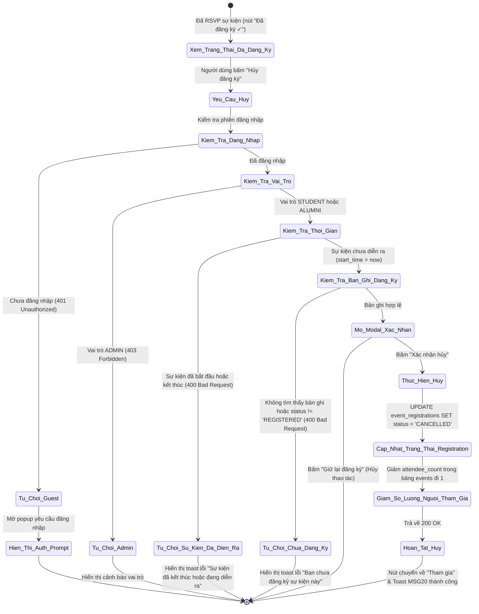
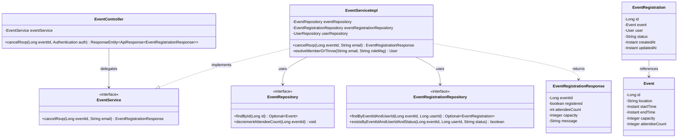

# ĐẶC TẢ YÊU CẦU & THIẾT KẾ CHI TIẾT: UC26 - CANCEL EVENT ATTENDANCE

## PHẦN 1: ĐẶC TẢ NGHIỆP VỤ (REPORT 3)

### 2.2.3 Business Workflow (Luồng nghiệp vụ)



#### Mô tả chi tiết luồng xử lý bằng chữ (Business Step Description):
* **Bước 1 - Khởi đầu**: Sinh viên hoặc cựu sinh viên xem sự kiện đã đăng ký trước đó trên trang Sự kiện (`/app/events`), Bảng tin (`/app/feed`) hoặc Chi tiết bài viết (`/app/posts/:id`), thấy nút hành động hiển thị "Đã đăng ký ✓" (khi hover chuyển thành "Hủy đăng ký").
* **Bước 2 - Kích hoạt và cảnh báo người dùng**:
  * Người dùng bấm vào nút "Hủy đăng ký".
  * Hệ thống mở modal xác nhận `CancelRsvpModal` cảnh báo: nếu sự kiện đã giới hạn sức chứa, việc hủy đăng ký có thể làm mất vị trí tham dự nếu muốn đăng ký lại sau này.
  * Nếu người dùng bấm "Giữ lại đăng ký", modal đóng lại và không có thay đổi nào.
* **Bước 3 - Kiểm tra điều kiện nghiệp vụ phía máy chủ (Server Validation & RBAC)**:
  * Kiểm tra danh tính: Yêu cầu JWT hợp lệ của vai trò `STUDENT` hoặc `ALUMNI`. Khách vãng lai (Guest) nhận mã `401 Unauthorized`. Tài khoản Quản trị viên (`ADMIN`) nhận mã `403 Forbidden`.
  * Kiểm tra thời gian sự kiện (`start_time`): Nếu sự kiện đã bắt đầu hoặc đã kết thúc (`start_time <= now`), máy chủ từ chối với mã lỗi `400 Bad Request` ("Sự kiện đã kết thúc hoặc đang diễn ra, không thể hủy đăng ký.").
  * Kiểm tra sự tồn tại của lượt đăng ký: Tìm bản ghi trong bảng `event_registrations` theo `event_id` và `user_id`. Nếu không tồn tại hoặc trạng thái hiện tại không phải là `REGISTERED`, từ chối với mã lỗi `400 Bad Request` ("Bạn chưa đăng ký tham gia sự kiện này.").
* **Bước 4 - Cập nhật dữ liệu & phản hồi**:
  * Cập nhật trạng thái bản ghi `event_registrations` sang `CANCELLED`.
  * Giảm nguyên tử (atomic decrement) trường `attendee_count` trong bảng `events` đi 1 đơn vị (`GREATEST(0, attendee_count - 1)`).
  * Trả về kết quả thành công với mã `200 OK` kèm thông điệp `MSG20` ("Hủy đăng ký tham gia sự kiện thành công!").
  * Giao diện người dùng: Modal đóng, kích hoạt thông báo Toast thành công góc phải trên màn hình, nút bấm chuyển về trạng thái ban đầu "Tham gia", số lượng người tham gia giảm 1.

---

### 3.2 Module 3 - Social: Feed, Posts, Events, Packages & Messaging

#### 3.2.2 Hủy đăng ký tham gia sự kiện (Cancel Event Attendance) - UC26

**Function trigger**:
*   **Navigation path**: 
    * `/app/events` -> Thẻ sự kiện đã đăng ký -> Nút "Hủy đăng ký"
    * `/app/posts/:id` -> Khung sự kiện -> Nút "Hủy đăng ký"
    * `/app/feed` -> Sidebar "Sự kiện sắp diễn ra" -> Nút "Hủy đăng ký"
*   **Timing Frequency**: On demand (bất cứ khi nào sinh viên/cựu sinh viên muốn rút khỏi danh sách tham dự sự kiện trước giờ diễn ra).

**Function description**:
*   **Actors/Roles**: Student, Alumni.
*   **Purpose**: Cho phép người tham gia chủ động hủy lượt đăng ký khi không thể sắp xếp tham gia sự kiện, giúp ban tổ chức cập nhật số lượng thực tế chính xác và nhường chỗ cho các thành viên khác có nhu cầu.
*   **Interface**:
    *   **Nút RSVP trên Event Card**: Khi đã đăng ký, nút có nền xanh ngọc (`border-emerald-200 bg-emerald-50 text-emerald-700`), khi hover chuyển sang đỏ nhạt (`border-rose-200 bg-rose-50 text-rose-600`) với nhãn "Hủy đăng ký".
    *   **Modal xác nhận hủy (`CancelRsvpModal`)**: Hộp thoại cảnh báo với icon lịch hủy, ghi rõ tên sự kiện, cảnh báo mất chỗ và 2 nút hành động ("Giữ lại đăng ký" / "Xác nhận hủy").
    *   **Hệ thống thông báo (Unified Toast)**: Toast thông báo góc phải trên màn hình (`toast.success` hoặc `toast.error`).

**Input data**:
*   `eventId` (Path parameter, kiểu số nguyên dương Long, bắt buộc): Định danh duy nhất của sự kiện.
*   JWT Token trong Authorization header để xác định danh tính `user_id` và quyền hạn.

**Output data**:
*   `ApiResponse<EventRegistrationResponse>`:
    *   `error` (int): 0 (thành công) hoặc mã lỗi.
    *   `message` (String): Thông điệp phản hồi người dùng.
    *   `data` (Object):
        *   `eventId` (Long): ID sự kiện.
        *   `registered` (boolean): `false`.
        *   `attendeeCount` (int): Số lượng người tham gia sau khi giảm.
        *   `capacity` (Integer | null): Sức chứa tối đa của sự kiện.

**Business Logic / Rules**:
*   **BR-01 (RBAC)**: Chỉ người dùng đăng nhập với vai trò `STUDENT` hoặc `ALUMNI` mới được quyền hủy đăng ký tham gia sự kiện.
*   **BR-02 (Ownership)**: Người dùng chỉ được hủy lượt đăng ký của chính tài khoản mình đang đăng nhập.
*   **BR-03 (Registration Status)**: Người dùng phải đang ở trạng thái `REGISTERED` trong bảng `event_registrations`. Nếu chưa từng đăng ký hoặc đã hủy trước đó, hệ thống chặn lại và báo lỗi.
*   **BR-04 (Event Time Condition)**: Chỉ được phép hủy đăng ký **trước thời điểm sự kiện bắt đầu** (`event.start_time > now`). Khi sự kiện đã bắt đầu hoặc đã kết thúc, hệ thống không cho phép hủy nhằm bảo đảm danh sách điểm danh của ban tổ chức.
*   **BR-05 (Data Consistency)**: Cập nhật trạng thái `status = 'CANCELLED'`, giữ lại lịch sử đăng ký phục vụ báo cáo và kiểm kê.
*   **BR-06 (Atomic Decrement)**: Giảm trường `attendee_count` trong bảng `events` an toàn chống xung đột đa luồng: `SET attendee_count = GREATEST(0, attendee_count - 1)`.
*   **BR-07 (Re-registerable)**: Sau khi hủy, người dùng vẫn có thể đăng ký lại sự kiện đó (nếu sự kiện vẫn còn chỗ và chưa diễn ra) theo quy trình UC25.

**Error & Notification Messages**:
*   `MSG20_SUCCESS`: "Hủy đăng ký tham gia sự kiện thành công!" (HTTP 200)
*   `MSG20_ERR_PAST`: "Sự kiện đã kết thúc hoặc đang diễn ra, không thể hủy đăng ký." (HTTP 400)
*   `MSG20_ERR_NOT_REGISTERED`: "Bạn chưa đăng ký tham gia sự kiện này." (HTTP 400)
*   `MSG20_ERR_NOT_FOUND`: "Không tìm thấy sự kiện" (HTTP 404)
*   `MSG20_ERR_FORBIDDEN`: "Chỉ sinh viên và cựu sinh viên mới được hủy đăng ký tham gia sự kiện" (HTTP 403)
*   `MSG20_ERR_UNAUTHORIZED`: "Vui lòng đăng nhập để thực hiện thao tác này." (HTTP 401)

---

## PHẦN 2: THIẾT KẾ CHI TIẾT (REPORT 4)

### 2.1 Class Diagram (Thiết kế lớp đối tượng)



---

### 2.2 Sequence Diagram (Sơ đồ tuần tự)

```mermaid
sequenceDiagram
    autonumber
    actor User as Student / Alumni
    participant UI as EventRsvpButton & CancelRsvpModal
    participant EC as EventController
    participant ES as EventServiceImpl
    participant ER as EventRepository
    participant ERR as EventRegistrationRepository
    participant DB as PostgreSQL Database

    User->>UI: Rê chuột vào "Đã đăng ký ✓" -> Bấm "Hủy đăng ký"
    UI->>User: Mở CancelRsvpModal cảnh báo mất suất tham dự
    User->>UI: Bấm "Xác nhận hủy"
    UI->>UI: Optimistic update (registered = false, attendeeCount - 1)
    UI->>EC: DELETE /api/v1/events/{eventId}/rsvp (JWT Bearer)
    
    EC->>ES: cancelRsvp(eventId, email)
    ES->>ES: resolveMemberOrThrow(email) -> Kiểm tra Student/Alumni
    
    ES->>ER: findById(eventId)
    ER->>DB: SELECT * FROM events WHERE id = ?
    DB-->>ER: Trả về Event
    
    alt Event không tồn tại
        ES-->>EC: Ném ResourceNotFoundException (404)
        EC-->>UI: 404 Not Found
        UI->>UI: Rollback state & toast.error
    else Sự kiện đã kết thúc hoặc đang diễn ra (startTime <= now)
        ES-->>EC: Ném BadRequestException (400)
        EC-->>UI: 400 Bad Request
        UI->>UI: Rollback state & toast.warning
    end

    ES->>ERR: findByEventIdAndUserId(eventId, userId)
    ERR->>DB: SELECT * FROM event_registrations WHERE event_id = ? AND user_id = ?
    DB-->>ERR: Trả về EventRegistration
    
    alt Chưa đăng ký hoặc status != 'REGISTERED'
        ES-->>EC: Ném BadRequestException (400)
        EC-->>UI: 400 Bad Request
        UI->>UI: Rollback state & toast.warning
    end

    ES->>ERR: reg.setStatus("CANCELLED"); save(reg)
    ERR->>DB: UPDATE event_registrations SET status = 'CANCELLED'
    
    ES->>ER: decrementAttendeeCount(eventId)
    ER->>DB: UPDATE events SET attendee_count = GREATEST(0, attendee_count - 1) WHERE id = ?
    
    ES-->>EC: Trả về EventRegistrationResponse (registered = false, updatedCount)
    EC-->>UI: 200 OK (ApiResponse.success)
    UI->>User: Toast "Hủy đăng ký tham gia sự kiện thành công!" & Đổi nút sang "Tham gia"
```

---

### 2.3 Database Mapping (Cấu trúc bảng dữ liệu)

Bảng dữ liệu `event_registrations` (Flyway migration `V12__create_event_registrations_table.sql`):

| Tên cột | Kiểu dữ liệu | Ràng buộc | Mô tả |
| :--- | :--- | :--- | :--- |
| `id` | BIGSERIAL | PRIMARY KEY | Định danh bản ghi đăng ký |
| `event_id` | BIGINT | NOT NULL, FK -> events(id) ON DELETE CASCADE | ID sự kiện |
| `user_id` | BIGINT | NOT NULL, FK -> users(id) ON DELETE CASCADE | ID người dùng tham gia |
| `status` | VARCHAR(20) | NOT NULL, DEFAULT 'REGISTERED', CHECK(status IN ('REGISTERED', 'CANCELLED')) | Trạng thái đăng ký |
| `created_at` | TIMESTAMPTZ | NOT NULL, DEFAULT CURRENT_TIMESTAMP | Thời điểm đăng ký |
| `updated_at` | TIMESTAMPTZ | NOT NULL, DEFAULT CURRENT_TIMESTAMP | Thời điểm cập nhật cuối (hủy) |

*Ràng buộc toàn vẹn:* `UNIQUE(event_id, user_id)` bảo đảm một người dùng chỉ có 1 bản ghi với một sự kiện.
