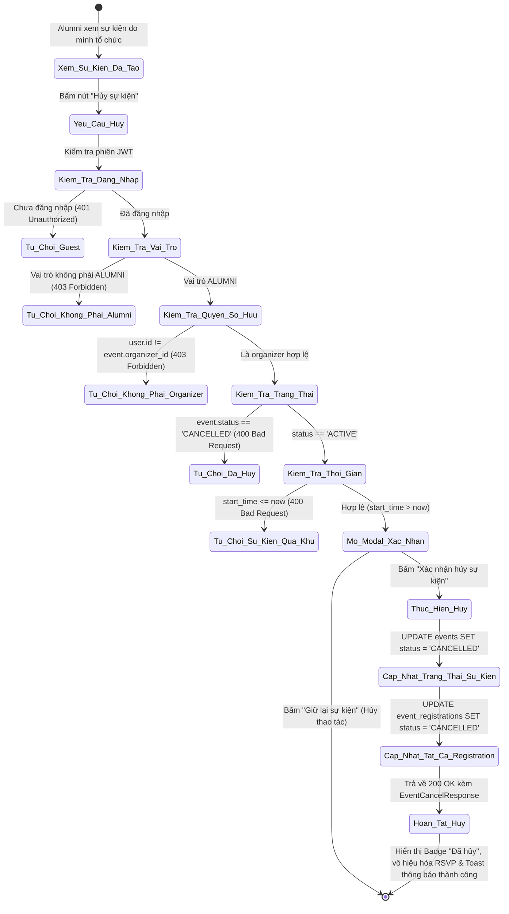

# ĐẶC TẢ YÊU CẦU & THIẾT KẾ CHI TIẾT: UC27 - CANCEL AN EVENT

## PHẦN 1: ĐẶC TẢ NGHIỆP VỤ (REPORT 3)

### 2.2.3 Business Workflow (Luồng nghiệp vụ)



#### Mô tả chi tiết luồng xử lý bằng chữ:
* **Bước 1 - Khởi đầu**: Cựu sinh viên (Alumni) đã tạo sự kiện truy cập trang Sự kiện (`/app/events`), Bảng tin (`/app/feed`) hoặc Chi tiết bài viết (`/app/posts/:id`). Trên sự kiện do mình tổ chức, xuất hiện nút "Hủy sự kiện".
* **Bước 2 - Kích hoạt và cảnh báo**:
  * Người tổ chức bấm "Hủy sự kiện".
  * Hệ thống mở modal `CancelEventModal` hiển thị cảnh báo: hành động này sẽ hủy bỏ sự kiện, toàn bộ người đã đăng ký sẽ bị hủy tham gia và sự kiện không thể mở lại.
  * Nếu bấm "Giữ lại sự kiện", modal đóng lại mà không có thay đổi.
* **Bước 3 - Kiểm tra điều kiện nghiệp vụ phía máy chủ (Server Validation & RBAC)**:
  * **Xác thực & Phân quyền**: Yêu cầu JWT hợp lệ của vai trò `ALUMNI`. Nếu không phải Alumni (ví dụ `STUDENT`, `ADMIN`), từ chối với `403 Forbidden`.
  * **Kiểm tra quyền sở hữu (Ownership)**: Kiểm tra `event.organizer.id == current_user.id`. Nếu không trùng khớp, từ chối với `403 Forbidden` ("Bạn không có quyền hủy sự kiện này vì không phải là người tổ chức.").
  * **Kiểm tra trạng thái sự kiện**: Nếu sự kiện đã có `status == 'CANCELLED'`, từ chối với `400 Bad Request` ("Sự kiện này đã bị hủy trước đó.").
  * **Kiểm tra thời gian**: Nếu sự kiện đã bắt đầu hoặc kết thúc (`start_time <= now`), từ chối với `400 Bad Request` ("Sự kiện đã kết thúc hoặc đang diễn ra, không thể hủy.").
* **Bước 4 - Cập nhật dữ liệu & phản hồi**:
  * Cập nhật `events.status = 'CANCELLED'`.
  * Cập nhật toàn bộ các bản ghi `event_registrations` đang `REGISTERED` thành `CANCELLED`.
  * Trả về kết quả thành công HTTP `200 OK` kèm `EventCancelResponse`.
  * Giao diện cập nhật: Badge sự kiện chuyển sang "Đã hủy" màu đỏ, nút RSVP bị vô hiệu hóa, thông báo toast thành công xuất hiện.

---

### 3.2 Module 3 - Social: Feed, Posts, Events, Packages & Messaging

#### 3.2.3 Hủy tổ chức sự kiện (Cancel an Event) - UC27

##### A. Bảng đặc tả Use Case chi tiết

| Mục | Nội dung |
| :--- | :--- |
| **Use Case ID** | UC27 |
| **Use Case Name** | Hủy sự kiện (Cancel an Event) |
| **Module** | Module 3 - Social: Feed, Posts, Events, Packages & Messaging |
| **Actor** | Alumni (người tổ chức / organizer) |
| **Priority** | P0 (MoSCoW: Must Have) |
| **Trigger** | Người tổ chức bấm vào nút "Hủy sự kiện" trên card sự kiện hoặc trang chi tiết |
| **Preconditions** | 1. Người dùng đã đăng nhập với vai trò `ALUMNI`.<br>2. Người dùng là người tạo (organizer) của sự kiện.<br>3. Sự kiện đang ở trạng thái `ACTIVE` và chưa bắt đầu (`start_time > now`). |
| **Postconditions** | 1. `events.status` đổi thành `CANCELLED`.<br>2. Toàn bộ `event_registrations.status` chuyển thành `CANCELLED`.<br>3. Thẻ sự kiện trên UI hiển thị badge "Đã hủy", không cho phép RSVP. |

##### B. Business Rules (Quy tắc nghiệp vụ)

* **BR-01 (Role Restriction)**: Chỉ tài khoản có vai trò `ALUMNI` mới có quyền tổ chức và hủy sự kiện.
* **BR-02 (Organizer Ownership)**: Chỉ chính cựu sinh viên đã tạo sự kiện (`organizer_id == user.id`) mới được phép hủy sự kiện đó.
* **BR-03 (Time Constraint)**: Không được phép hủy sự kiện đã bắt đầu hoặc đã kết thúc (`start_time <= now()`).
* **BR-04 (Irreversible Cancellation)**: Sự kiện sau khi đã hủy (`CANCELLED`) không thể hủy lại và không thể phục hồi về `ACTIVE`.
* **BR-05 (Cascade Registrations Cancellation)**: Khi sự kiện bị hủy, toàn bộ các lượt đăng ký tham gia (`REGISTERED`) tự động chuyển sang `CANCELLED`.
* **BR-06 (Disable RSVP)**: Các sự kiện có trạng thái `CANCELLED` sẽ khóa hoàn toàn chức năng đăng ký tham gia (RSVP).

---

## PHẦN 2: THIẾT KẾ KỸ THUẬT (REPORT 4)

### 1. Database Design

Migration V14: `V14__add_event_status.sql`
```sql
ALTER TABLE events
    ADD COLUMN IF NOT EXISTS status VARCHAR(20) NOT NULL DEFAULT 'ACTIVE';

DO $$
BEGIN
    IF NOT EXISTS (
        SELECT 1 FROM pg_constraint WHERE conname = 'ck_events_status'
    ) THEN
        ALTER TABLE events
            ADD CONSTRAINT ck_events_status CHECK (status IN ('ACTIVE', 'CANCELLED'));
    END IF;
END $$;

CREATE INDEX IF NOT EXISTS idx_events_status ON events(status);
```

### 2. REST API Specification

* **Endpoint**: `DELETE /api/v1/events/{eventId}` (và alias `DELETE /api/v1/events/{eventId}/cancel`)
* **Security**: Bearer JWT (Role: `ALUMNI`)
* **Responses**:
  * `200 OK`:
    ```json
    {
      "code": 200,
      "message": "Hủy sự kiện thành công!",
      "data": {
        "eventId": 100,
        "status": "CANCELLED",
        "message": "Hủy sự kiện thành công!"
      }
    }
    ```
  * `400 Bad Request`: "Sự kiện này đã bị hủy trước đó." hoặc "Sự kiện đã kết thúc hoặc đang diễn ra, không thể hủy."
  * `403 Forbidden`: "Chỉ cựu sinh viên (người tổ chức) mới có quyền hủy sự kiện." hoặc "Bạn không có quyền hủy sự kiện này vì không phải là người tổ chức."
  * `404 Not Found`: "Không tìm thấy sự kiện"
