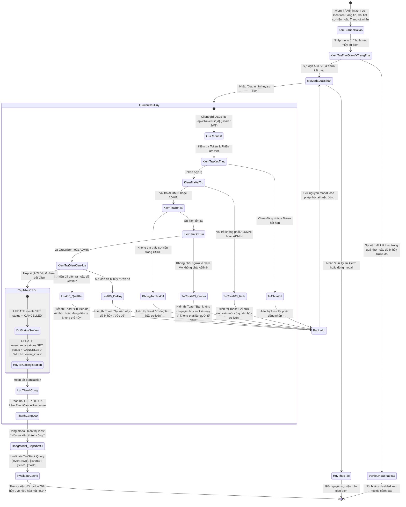
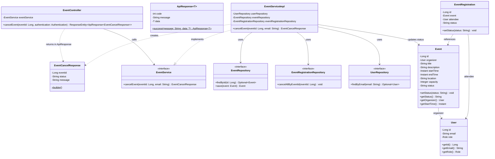
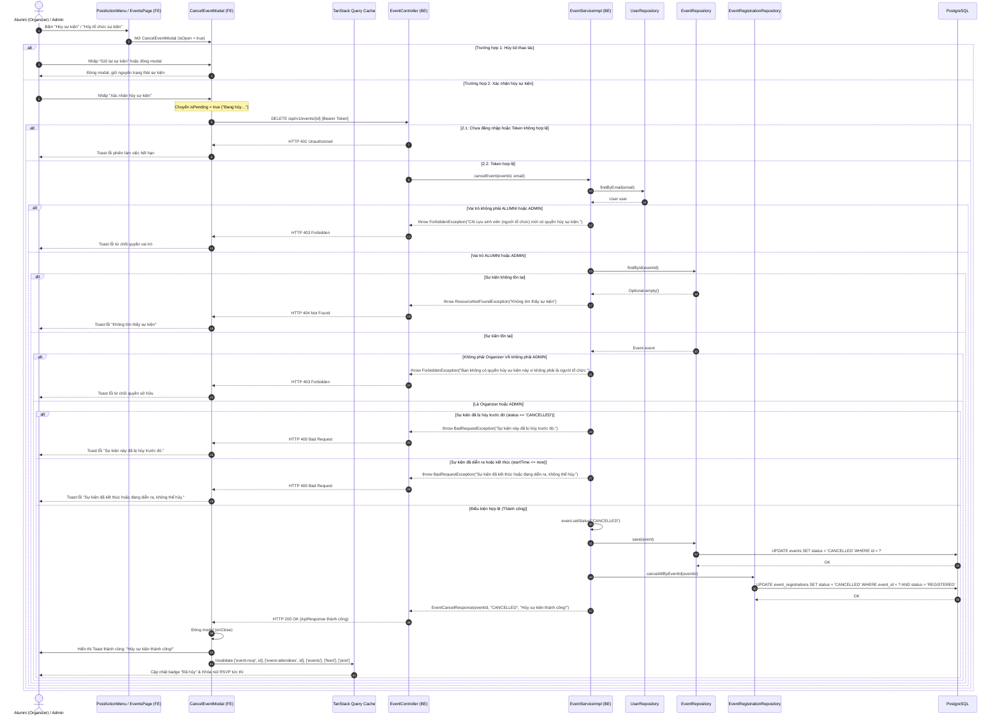

# ĐẶC TẢ YÊU CẦU & THIẾT KẾ CHI TIẾT: UC27 - Hủy tổ chức sự kiện (Cancel an event)

## PHẦN 1: ĐẶC TẢ NGHIỆP VỤ (REPORT 3)

### 2.2.3 Business Workflow (Luồng nghiệp vụ)

```mermaid
stateDiagram-v2
    [*] --> XemSuKienDaTao : Alumni / Admin xem sự kiện trên Bảng tin, Chi tiết sự kiện hoặc Trang cá nhân
    XemSuKienDaTao --> KiemTraThoiGianVaTrangThai : Nhấp menu "..." hoặc nút "Hủy sự kiện"

    KiemTraThoiGianVaTrangThai --> VoHieuHoaThaoTac : Sự kiện đã kết thúc trong quá khứ hoặc đã bị hủy trước đó
    VoHieuHoaThaoTac --> [*] : Nút bị ẩn / disabled kèm tooltip cảnh báo

    KiemTraThoiGianVaTrangThai --> MoModalXacNhan : Sự kiện ACTIVE & chưa kết thúc
    
    MoModalXacNhan --> HuyThaoTac : Nhấp "Giữ lại sự kiện" hoặc đóng modal
    HuyThaoTac --> [*] : Giữ nguyên sự kiện trên giao diện

    MoModalXacNhan --> GuiYeuCauHuy : Nhấp "Xác nhận hủy sự kiện"
    
    state GuiYeuCauHuy {
        [*] --> GuiRequest : Client gửi DELETE /api/v1/events/{id} (Bearer JWT)
        GuiRequest --> KiemTraXacThuc : Kiểm tra Token & Phiên làm việc
        
        KiemTraXacThuc --> TuChoi401 : Chưa đăng nhập / Token hết hạn
        KiemTraXacThuc --> KiemTraVaiTro : Token hợp lệ
        
        KiemTraVaiTro --> TuChoi403_Role : Vai trò không phải ALUMNI hoặc ADMIN
        KiemTraVaiTro --> KiemTraTonTai : Vai trò ALUMNI hoặc ADMIN
        
        KiemTraTonTai --> KhongTonTai404 : Không tìm thấy sự kiện trong CSDL
        KiemTraTonTai --> KiemTraSoHuu : Sự kiện tồn tại
        
        KiemTraSoHuu --> TuChoi403_Owner : Không phải người tổ chức VÀ không phải ADMIN
        KiemTraSoHuu --> KiemTraDieuKienHuy : Là Organizer hoặc ADMIN
        
        KiemTraDieuKienHuy --> Loi400_DaHuy : Sự kiện đã bị hủy trước đó
        KiemTraDieuKienHuy --> Loi400_QuaKhu : Sự kiện đã diễn ra hoặc đã kết thúc
        KiemTraDieuKienHuy --> CapNhatCSDL : Hợp lệ (ACTIVE & chưa bắt đầu)
        
        state CapNhatCSDL {
            [*] --> DoiStatusSuKien : UPDATE events SET status = 'CANCELLED'
            DoiStatusSuKien --> HuyTatCaRegistration : UPDATE event_registrations SET status = 'CANCELLED' WHERE event_id = ?
            HuyTatCaRegistration --> LuuThanhCong : Hoàn tất Transaction
        }
        
        LuuThanhCong --> ThanhCong200 : Phản hồi HTTP 200 OK kèm EventCancelResponse
    }

    ThanhCong200 --> DongModal_CapNhatUI : Đóng modal, hiển thị Toast "Hủy sự kiện thành công!"
    DongModal_CapNhatUI --> InvalidateCache : Invalidate TanStack Query ['event-rsvp'], ['events'], ['feed'], ['post']...
    InvalidateCache --> [*] : Thẻ sự kiện đổi badge "Đã hủy", vô hiệu hóa nút RSVP
    
    TuChoi401 --> BaoLoiUI : Hiển thị Toast lỗi phiên đăng nhập
    TuChoi403_Role --> BaoLoiUI : Hiển thị Toast "Chỉ cựu sinh viên mới có quyền hủy sự kiện"
    TuChoi403_Owner --> BaoLoiUI : Hiển thị Toast "Bạn không có quyền hủy sự kiện này vì không phải là người tổ chức"
    KhongTonTai404 --> BaoLoiUI : Hiển thị Toast "Không tìm thấy sự kiện"
    Loi400_DaHuy --> BaoLoiUI : Hiển thị Toast "Sự kiện này đã bị hủy trước đó"
    Loi400_QuaKhu --> BaoLoiUI : Hiển thị Toast "Sự kiện đã kết thúc hoặc đang diễn ra, không thể hủy"
    BaoLoiUI --> MoModalXacNhan : Giữ nguyên modal, cho phép thử lại hoặc đóng
```

#### Mô tả chi tiết luồng xử lý bằng chữ (Business Step Description):
* **Bước 1 - Khởi đầu**: Cựu sinh viên (người tổ chức sự kiện - `isOrganizer = true`) hoặc Quản trị viên (`ADMIN`) xem sự kiện trên Trang sự kiện (`EventsPage` tại `/app/events`), Bảng tin (`FeedPage` tại `/app`), Trang chi tiết sự kiện/bài viết (`PostDetailPage` tại `/app/posts/{id}`), hoặc Trang hồ sơ cá nhân (`UserPostsView` tại `/app/profile`).
* **Bước 2 - Kích hoạt tùy chọn hủy sự kiện**:
  * Người tổ chức nhấp vào menu ba chấm (`PostActionMenu`) chọn mục "Hủy tổ chức sự kiện" (icon `Ban` màu hổ phách/đỏ) hoặc nhấp trực tiếp vào nút "Hủy sự kiện" trên thẻ sự kiện.
  * *Ngoại lệ*: Nếu sự kiện đã kết thúc (`endTime < now`) hoặc đã ở trạng thái `CANCELLED`, tùy chọn hủy sẽ bị ẩn hoặc vô hiệu hóa (`disabled`) kèm tooltip giải thích, ngăn người dùng thao tác thừa.
* **Bước 3 - Xác nhận hành động (Modal Confirmation)**:
  * Hệ thống hiển thị hộp thoại `CancelEventModal` với mức độ cảnh báo cao:
    * Tiêu đề: "Hủy tổ chức sự kiện" kèm icon `Ban` màu đỏ.
    * Banner cảnh báo: *"Lưu ý: Sự kiện và danh sách đăng ký sẽ bị hủy vĩnh viễn, không thể mở lại."*
    * Câu hỏi xác nhận: *"Bạn có chắc chắn muốn hủy sự kiện '{eventTitle}' không?"*.
    * Nút "Giữ lại sự kiện": Đóng modal, không có bất kỳ thay đổi nào.
    * Nút "Xác nhận hủy sự kiện": Nút bấm màu đỏ (`bg-rose-600`), kích hoạt quy trình hủy.
* **Bước 4 - Gửi yêu cầu lên máy chủ**: Khi người dùng xác nhận, nút chuyển sang trạng thái pending (`isPending = true`, hiển thị spinner `Loader2` "Đang hủy…", khóa nút "Giữ lại sự kiện"). Client gửi yêu cầu HTTP `DELETE /api/v1/events/{id}` kèm Bearer JWT Token.
* **Bước 5 - Xác thực & Kiểm tra nghiệp vụ tại Backend**:
  * **Xác thực JWT**: Kiểm tra token người dùng qua Spring Security. Nếu chưa đăng nhập hoặc token không hợp lệ -> trả về **HTTP 401 Unauthorized**.
  * **Kiểm tra vai trò (Role Check)**: Tìm tài khoản qua email. Người dùng phải có vai trò `ALUMNI` hoặc `ADMIN`. Nếu là `STUDENT` hoặc vai trò khác -> ném `ForbiddenException` ("Chỉ cựu sinh viên (người tổ chức) mới có quyền hủy sự kiện.", **HTTP 403 Forbidden**).
  * **Kiểm tra tồn tại**: Truy vấn sự kiện qua `eventRepository.findById(eventId)`. Nếu không tồn tại -> ném `ResourceNotFoundException` ("Không tìm thấy sự kiện", **HTTP 404 Not Found**).
  * **Kiểm tra quyền sở hữu (Ownership Check)**: So sánh `event.getOrganizer().getId().equals(user.getId())`. Nếu người yêu cầu không phải là người tạo sự kiện và đồng thời không phải là `ADMIN` -> ném `ForbiddenException` ("Bạn không có quyền hủy sự kiện này vì không phải là người tổ chức.", **HTTP 403 Forbidden**).
  * **Kiểm tra trạng thái sự kiện**: Nếu sự kiện đã có trạng thái `CANCELLED` -> ném `BadRequestException` ("Sự kiện này đã bị hủy trước đó.", **HTTP 400 Bad Request**).
  * **Kiểm tra mốc thời gian**: Nếu sự kiện đã diễn ra hoặc kết thúc (`startTime.isBefore(Instant.now())`) -> ném `BadRequestException` ("Sự kiện đã kết thúc hoặc đang diễn ra, không thể hủy.", **HTTP 400 Bad Request**).
* **Bước 6 - Cập nhật cơ sở dữ liệu (Transaction)**:
  * Cập nhật trạng thái sự kiện: `event.setStatus("CANCELLED")` và lưu vào PostgreSQL qua `eventRepository.save(event)`.
  * Hủy toàn bộ danh sách đăng ký: Gọi `eventRegistrationRepository.cancelAllByEventId(eventId)` để chuyển toàn bộ bản ghi `event_registrations` đang `REGISTERED` sang `CANCELLED`.
  * Ghi log hệ thống và trả về đối tượng `EventCancelResponse` kèm mã **HTTP 200 OK**.
* **Bước 7 - Phản hồi & Đồng bộ giao diện phía Client**:
  * Frontend nhận HTTP 200 OK, tự động đóng `CancelEventModal` và hiển thị Toast thông báo: *"Hủy sự kiện thành công!"*.
  * Invalidate toàn bộ cache liên quan trong TanStack Query (`['event-rsvp', id]`, `['event-attendees', id]`, `['feed']`, `['posts']`, `['post']`, `['event-history']`).
  * Giao diện cập nhật tức thì: Thẻ sự kiện hiển thị badge trạng thái "Đã hủy" màu đỏ, nút đăng ký tham gia (RSVP) bị vô hiệu hóa hoàn toàn, số người đăng ký được đóng băng.

---

### 3.2 Module 3 - Social: Feed, Posts, Events, Packages & Messaging

#### 3.2.4 Hủy tổ chức sự kiện (Cancel an event)

**Function trigger**:
* **Navigation path**:
  * Menu ba chấm (`PostActionMenu`) -> "Hủy tổ chức sự kiện" trên bài viết loại Sự kiện tại `FeedPage` (`/app`), `PostDetailPage` (`/app/posts/{id}`), hoặc `UserPostsView` (`/app/profile`).
  * Nút "Hủy sự kiện" trên thẻ sự kiện tại Trang sự kiện `EventsPage` (`/app/events`).
* **Timing Frequency**: On demand — khi cựu sinh viên tổ chức sự kiện không thể tiếp tục triển khai hoặc Quản trị viên can thiệp xử lý vi phạm.

**Function description**:
* **Actors/Roles**:
  * `ALUMNI`: Cựu sinh viên là người khởi tạo và chủ trì tổ chức sự kiện (chủ sở hữu sự kiện).
  * `ADMIN`: Quản trị viên hệ thống có thẩm quyền quản lý và can thiệp hủy sự kiện.
  * Khách vãng lai (Guest) / Sinh viên (`STUDENT`) / Cựu sinh viên khác: Không có quyền thực hiện hành động này.
* **Purpose**: Cho phép người tổ chức sự kiện chủ động hủy bỏ sự kiện đã lên lịch khi có phát sinh đột xuất, tự động hủy bỏ toàn bộ vé/lượt đăng ký tham gia đã ghi nhận trước đó, thông báo trạng thái tới cộng đồng và ngăn chặn mọi lượt đăng ký mới.
* **Interface**:
  * Tùy chọn menu `PostActionMenu`: Nút "Hủy tổ chức sự kiện" kèm icon `Ban` màu vàng cam / hổ phách (`text-amber-600`), chỉ hiển thị khi sự kiện chưa kết thúc và chưa bị hủy.
  * Hộp thoại xác nhận `CancelEventModal`:
    * Tiêu đề: "Hủy tổ chức sự kiện" kèm icon `Ban` màu đỏ.
    * Banner cảnh báo: Khung viền đỏ nhạt cảnh báo hành động hủy là vĩnh viễn và không thể hoàn tác.
    * Nội dung: Hiển thị tên sự kiện cần hủy: *"Bạn có chắc chắn muốn hủy sự kiện '{eventTitle}' không?"*.
    * Nút "Giữ lại sự kiện": Secondary button, hủy bỏ thao tác và đóng hộp thoại.
    * Nút "Xác nhận hủy sự kiện": Primary button màu đỏ (`bg-rose-600`), hiển thị trạng thái xoay spinner `Loader2` "Đang hủy…" trong khi chờ server xử lý.
  * Trạng thái thẻ sự kiện sau khi hủy:
    * Badge trạng thái: Hiển thị nhãn "Đã hủy" màu đỏ thay vì nhãn ngày/thời gian.
    * Nút RSVP: Bị vô hiệu hóa hoàn toàn với nhãn "Sự kiện đã bị hủy".

**Data processing**:
* **Client-side**:
  * Gọi mutation `useCancelEvent().mutate({ eventId })`.
  * Gửi HTTP `DELETE /api/v1/events/{eventId}` kèm Authorization Bearer Token.
  * Khi thành công: Làm mới cache TanStack Query các khóa `event-rsvp`, `event-attendees`, `feed`, `posts`, `post`, `event-history`.
* **Server-side**:
  * Tiếp nhận yêu cầu tại `EventController.cancelEvent()`.
  * Trích xuất email người dùng từ SecurityContext, nạp `User` từ database.
  * Kiểm tra vai trò: Phải là `ALUMNI` hoặc `ADMIN`.
  * Nạp `Event` theo `eventId`, kiểm tra sự tồn tại.
  * Kiểm tra quyền sở hữu: `event.getOrganizer().getId().equals(user.getId())` hoặc vai trò là `ADMIN`.
  * Kiểm tra điều kiện nghiệp vụ: Trạng thái hiện tại không phải `CANCELLED`, thời gian `startTime` phải sau thời điểm hiện tại `Instant.now()`.
  * Thực thi Transaction:
    * Đặt `event.setStatus("CANCELLED")` và lưu CSDL.
    * Gọi `eventRegistrationRepository.cancelAllByEventId(eventId)` cập nhật toàn bộ đăng ký sang `CANCELLED`.
  * Trả về `EventCancelResponse` với mã HTTP 200 OK.

**Screen layout**:
* Hộp thoại `CancelEventModal` hiển thị dạng cửa sổ pop-up nổi bật ở giữa màn hình, có lớp phủ mờ (backdrop), khóa thao tác nhấp ra ngoài khi request đang xử lý (`isPending = true`).
* Giao diện thích ứng trên cả màn hình rộng (Desktop) và màn hình điện thoại (Mobile) với nút bấm to rõ, dễ thao tác.

**Function details**:
* **Data**:
  * Input parameter: `eventId` (Long / PathVariable) — Mã định danh duy nhất của sự kiện.
  * Header: `Authorization: Bearer <accessToken>`.
  * Output DTO: `EventCancelResponse` gồm:
    * `eventId` (Long): Mã sự kiện.
    * `status` (String): "CANCELLED".
    * `message` (String): "Hủy sự kiện thành công!".
* **Validation**:
  * `eventId` phải là số nguyên dương hợp lệ.
  * Token JWT phải còn hạn và chứa thông tin người dùng hợp lệ.
* **Business rules**:
  * Áp dụng quy tắc `BR-EV-CANCEL-01` đến `BR-EV-CANCEL-06` (chi tiết tại mục 5.1).
* **Error Handling**:
  * `401 Unauthorized`: Chưa đăng nhập hoặc token hết hạn.
  * `403 Forbidden`: Người dùng không phải Alumni/Admin hoặc không phải người tổ chức sự kiện.
  * `404 Not Found`: Không tìm thấy sự kiện với ID tương ứng.
  * `400 Bad Request`: Sự kiện đã bị hủy từ trước hoặc sự kiện đã diễn ra / kết thúc trong quá khứ.
* **Normal case**:
  * Cựu sinh viên xác nhận hủy sự kiện của mình trước giờ khai mạc -> Sự kiện đổi trạng thái sang `CANCELLED`, toàn bộ lượt đăng ký chuyển sang `CANCELLED` -> Trả về 200 OK -> UI hiển thị badge "Đã hủy", vô hiệu hóa nút RSVP.
* **Abnormal case**:
  * Cố gắng hủy sự kiện khi thời gian bắt đầu đã trôi qua -> Backend từ chối 400 Bad Request "Sự kiện đã kết thúc hoặc đang diễn ra, không thể hủy." -> Toast báo lỗi xuất hiện, sự kiện giữ nguyên trạng thái.

---

### 5. Requirement Appendix (Phụ lục Yêu cầu)

#### 5.1 Business Rules (Quy tắc Nghiệp vụ)

| ID | Định nghĩa Quy tắc (Rule Definition) |
| :--- | :--- |
| BR-EV-CANCEL-01 | Chỉ tài khoản có vai trò `ALUMNI` (người tổ chức) hoặc `ADMIN` (quản trị viên hệ thống) mới được phép kích hoạt API hủy tổ chức sự kiện. |
| BR-EV-CANCEL-02 | Cựu sinh viên chỉ được phép hủy các sự kiện do chính mình khởi tạo và làm chủ tọa. Quản trị viên (`ADMIN`) có quyền can thiệp hủy sự kiện của thành viên nhằm mục đích quản trị. |
| BR-EV-CANCEL-03 | Tuyệt đối không được phép hủy các sự kiện đã bắt đầu hoặc đã kết thúc trong quá khứ. |
| BR-EV-CANCEL-04 | Sự kiện sau khi đã chuyển sang trạng thái `CANCELLED` sẽ không thể khôi phục trở lại trạng thái hoạt động và không thể tiếp tục gửi yêu cầu hủy lặp lại. |
| BR-EV-CANCEL-05 | Khi sự kiện bị hủy, hệ thống bắt buộc phải tự động chuyển toàn bộ các bản ghi đăng ký tham gia sang trạng thái `CANCELLED` trong cùng một giao dịch. |
| BR-EV-CANCEL-06 | Tất cả sự kiện có trạng thái `CANCELLED` phải bị khóa hoàn toàn chức năng đăng ký tham gia (RSVP) trên giao diện người dùng. |

#### 5.2 Common Requirements (Yêu cầu Chung)
* **Bảo mật**: Mọi kết nối gọi API hủy sự kiện phải được truyền qua HTTPS với mã hóa TLS tiêu chuẩn.
* **Toàn vẹn Dữ liệu (Atomic Transaction)**: Quá trình cập nhật trạng thái sự kiện và hủy danh sách đăng ký tham gia phải được bọc trong một `@Transactional` duy nhất. Nếu xảy ra lỗi ở bất kỳ bước nào, toàn bộ giao dịch phải được rollback.
* **Thời gian phản hồi**: Thời gian phản hồi của API hủy sự kiện không vượt quá 1.0 giây.
* **Ngăn chặn Double-Submit**: Nút xác nhận hủy trên giao diện người dùng phải tự động khóa tương tác (`disabled = true`) ngay khi người dùng nhấn click lần đầu tiên để tránh gửi yêu cầu trùng lặp.

#### 5.3 Application Messages List (Danh sách Thông điệp Ứng dụng)

| # | Mã thông điệp (Message code) | Loại thông điệp (Message Type) | Ngữ cảnh (Context) | Nội dung hiển thị (Content) |
| :--- | :--- | :--- | :--- | :--- |
| 1 | MSG-EV-CANCEL-01 | Toast (Success) | Hủy tổ chức sự kiện thành công | Hủy sự kiện thành công! |
| 2 | MSG-EV-CANCEL-02 | Modal Title / Header | Tiêu đề hộp thoại xác nhận | Hủy tổ chức sự kiện |
| 3 | MSG-EV-CANCEL-03 | Modal Banner Warning | Cảnh báo tính chất vĩnh viễn | Lưu ý: Sự kiện và danh sách đăng ký sẽ bị hủy vĩnh viễn, không thể mở lại. |
| 4 | MSG-EV-CANCEL-04 | Modal Confirmation Text | Câu hỏi xác nhận người dùng | Bạn có chắc chắn muốn hủy sự kiện "{eventTitle}" không? |
| 5 | MSG-EV-CANCEL-05 | Button Pending State | Khi đang xử lý hủy sự kiện | Đang hủy… |
| 6 | MSG-EV-CANCEL-06 | Toast (Error) / API Error | Sự kiện đã bị hủy trước đó | Sự kiện này đã bị hủy trước đó. |
| 7 | MSG-EV-CANCEL-07 | Toast (Error) / API Error | Sự kiện đã diễn ra hoặc kết thúc | Sự kiện đã kết thúc hoặc đang diễn ra, không thể hủy. |
| 8 | MSG-EV-CANCEL-08 | Toast (Error) / API Error | Không phải người tổ chức sự kiện | Bạn không có quyền hủy sự kiện này vì không phải là người tổ chức. |
| 9 | MSG-EV-CANCEL-09 | Toast (Error) / API Error | Vai trò không được phép | Chỉ cựu sinh viên (người tổ chức) mới có quyền hủy sự kiện. |
| 10 | MSG-EV-CANCEL-10 | Toast (Error) / API Error | Không tìm thấy sự kiện | Không tìm thấy sự kiện |

#### 5.4 Other Requirements (Yêu cầu Khác)
* **Khả năng tương thích thiết bị**: Giao diện Modal xác nhận hiển thị tương thích, không bị vỡ layout trên cả màn hình máy tính để bàn (Desktop), máy tính bảng (Tablet) và điện thoại thông minh (Mobile).
* **Phím tắt hỗ trợ**: Hỗ trợ đóng modal bằng phím `Escape` khi đang ở trạng thái nhàn rỗi (chưa bấm xác nhận hủy).

---

## PHẦN 2: THIẾT KẾ CHI TIẾT (REPORT 4)

### 3. Detail Design (Thiết kế chi tiết)

#### 3.1 UC27 - Hủy tổ chức sự kiện (Cancel an event)

##### 3.1.1 Class Diagram (Sơ đồ Lớp)

```mermaid
classDiagram
    %% Controller Layer
    class EventController {
        -EventService eventService
        +cancelEvent(eventId: Long, authentication: Authentication) ResponseEntity~ApiResponse~EventCancelResponse~~
    }

    %% DTO Layer
    class EventCancelResponse {
        -Long eventId
        -String status
        -String message
        +builder()$
    }

    class ApiResponse~T~ {
        -int code
        -String message
        -T data
        +success(message: String, data: T)$ ApiResponse~T~
    }

    %% Service Layer
    class EventService {
        <<interface>>
        +cancelEvent(eventId: Long, email: String) EventCancelResponse
    }

    class EventServiceImpl {
        -UserRepository userRepository
        -EventRepository eventRepository
        -EventRegistrationRepository eventRegistrationRepository
        +cancelEvent(eventId: Long, email: String) EventCancelResponse
    }

    %% Repository Layer
    class EventRepository {
        <<interface>>
        +findById(id: Long) Optional~Event~
        +save(event: Event) Event
    }

    class EventRegistrationRepository {
        <<interface>>
        +cancelAllByEventId(eventId: Long) void
    }

    class UserRepository {
        <<interface>>
        +findByEmail(email: String) Optional~User~
    }

    %% Entity Layer
    class Event {
        -Long id
        -User organizer
        -String title
        -String description
        -Instant startTime
        -Instant endTime
        -String location
        -Integer capacity
        -String status
        +setStatus(status: String) void
        +getStatus() String
        +getOrganizer() User
        +getStartTime() Instant
    }

    class User {
        -Long id
        -String email
        -Role role
        +getId() Long
        +getEmail() String
        +getRole() Role
    }

    class EventRegistration {
        -Long id
        -Event event
        -User attendee
        -String status
        +setStatus(status: String) void
    }

    %% Relationships
    EventController --> EventService : calls
    EventController ..> EventCancelResponse : returns in ApiResponse
    EventServiceImpl ..|> EventService : implements
    EventServiceImpl --> UserRepository : uses
    EventServiceImpl --> EventRepository : uses
    EventServiceImpl --> EventRegistrationRepository : uses
    EventServiceImpl --> Event : updates status
    EventServiceImpl ..> EventCancelResponse : creates
    Event --> User : organizer
    EventRegistration --> Event : references
    EventRegistration --> User : attendee
```

###### Mô tả chi tiết cấu trúc các lớp (Class Design Description):
* **Lớp Controller (`EventController.java`)**: Cung cấp endpoint HTTP `DELETE /api/v1/events/{eventId}` (và alias `DELETE /api/v1/events/{eventId}/cancel`). Tiếp nhận yêu cầu, lấy email người dùng từ `Authentication` do Spring Security cung cấp và gọi `EventService.cancelEvent()`. Trả về `ApiResponse<EventCancelResponse>` với HTTP 200 OK.
* **Lớp DTO (`EventCancelResponse.java`)**: Chứa kết quả phản hồi nghiệp vụ sau khi hủy sự kiện thành công gồm `eventId`, `status` ("CANCELLED") và `message` ("Hủy sự kiện thành công!").
* **Lớp Service (`EventService.java` & `EventServiceImpl.java`)**: Hiện thực nghiệp vụ kiểm tra điều kiện hủy sự kiện:
  * Kiểm tra vai trò hợp lệ: `ALUMNI` hoặc `ADMIN`.
  * Kiểm tra quyền sở hữu người tổ chức: `event.getOrganizer().getId().equals(user.getId())` hoặc vai trò `ADMIN`.
  * Kiểm tra trạng thái sự kiện: Tránh hủy trùng lặp nếu đã `CANCELLED`.
  * Kiểm tra thời gian: Không cho phép hủy sự kiện đã qua thời điểm `startTime`.
  * Quản lý giao dịch `@Transactional`: Cập nhật `event.setStatus("CANCELLED")` và gọi `eventRegistrationRepository.cancelAllByEventId()` hủy danh sách đăng ký.
* **Lớp Repository (`EventRepository`, `EventRegistrationRepository`, `UserRepository`)**: Cung cấp các thao tác CRUD và các câu lệnh truy vấn CSDL PostgreSQL.
* **Lớp Entity (`Event`, `User`, `EventRegistration`)**: Ánh xạ tới các bảng CSDL tương ứng (`events`, `users`, `event_registrations`).

---

##### 3.1.2 Sequence Diagram (Sơ đồ Tuần tự)

```mermaid
sequenceDiagram
    autonumber
    actor Organizer as Alumni (Organizer) / Admin
    participant UI as PostActionMenu / EventsPage (FE)
    participant Modal as CancelEventModal (FE)
    participant Query as TanStack Query Cache
    participant Controller as EventController (BE)
    participant Service as EventServiceImpl (BE)
    participant UserRepo as UserRepository
    participant EventRepo as EventRepository
    participant RegRepo as EventRegistrationRepository
    participant DB as PostgreSQL

    Organizer->>UI: Bấm "Hủy sự kiện" / "Hủy tổ chức sự kiện"
    UI->>Modal: Mở CancelEventModal (isOpen = true)
    
    alt Trường hợp 1: Hủy bỏ thao tác
        Organizer->>Modal: Nhấp "Giữ lại sự kiện" hoặc đóng modal
        Modal-->>Organizer: Đóng modal, giữ nguyên trạng thái sự kiện
    else Trường hợp 2: Xác nhận hủy sự kiện
        Organizer->>Modal: Nhấp "Xác nhận hủy sự kiện"
        Note over Modal: Chuyển isPending = true ("Đang hủy…")
        Modal->>Controller: DELETE /api/v1/events/{id} [Bearer Token]
        
        alt 2.1: Chưa đăng nhập hoặc Token không hợp lệ
            Controller-->>Modal: HTTP 401 Unauthorized
            Modal-->>Organizer: Toast lỗi phiên làm việc hết hạn
        else 2.2: Token hợp lệ
            Controller->>Service: cancelEvent(eventId, email)
            
            Service->>UserRepo: findByEmail(email)
            UserRepo-->>Service: User user
            
            alt Vai trò không phải ALUMNI hoặc ADMIN
                Service-->>Controller: throw ForbiddenException("Chỉ cựu sinh viên (người tổ chức) mới có quyền hủy sự kiện.")
                Controller-->>Modal: HTTP 403 Forbidden
                Modal-->>Organizer: Toast lỗi từ chối quyền vai trò
            else Vai trò ALUMNI hoặc ADMIN
                Service->>EventRepo: findById(eventId)
                
                alt Sự kiện không tồn tại
                    EventRepo-->>Service: Optional.empty()
                    Service-->>Controller: throw ResourceNotFoundException("Không tìm thấy sự kiện")
                    Controller-->>Modal: HTTP 404 Not Found
                    Modal-->>Organizer: Toast lỗi "Không tìm thấy sự kiện"
                else Sự kiện tồn tại
                    EventRepo-->>Service: Event event
                    
                    alt Không phải Organizer VÀ không phải ADMIN
                        Service-->>Controller: throw ForbiddenException("Bạn không có quyền hủy sự kiện này vì không phải là người tổ chức.")
                        Controller-->>Modal: HTTP 403 Forbidden
                        Modal-->>Organizer: Toast lỗi từ chối quyền sở hữu
                    else Là Organizer hoặc ADMIN
                        alt Sự kiện đã bị hủy trước đó (status == 'CANCELLED')
                            Service-->>Controller: throw BadRequestException("Sự kiện này đã bị hủy trước đó.")
                            Controller-->>Modal: HTTP 400 Bad Request
                            Modal-->>Organizer: Toast lỗi "Sự kiện này đã bị hủy trước đó."
                        else Sự kiện đã diễn ra hoặc kết thúc (startTime <= now)
                            Service-->>Controller: throw BadRequestException("Sự kiện đã kết thúc hoặc đang diễn ra, không thể hủy.")
                            Controller-->>Modal: HTTP 400 Bad Request
                            Modal-->>Organizer: Toast lỗi "Sự kiện đã kết thúc hoặc đang diễn ra, không thể hủy."
                        else Điều kiện hợp lệ (Thành công)
                            Service->>Service: event.setStatus("CANCELLED")
                            Service->>EventRepo: save(event)
                            EventRepo->>DB: UPDATE events SET status = 'CANCELLED' WHERE id = ?
                            DB-->>EventRepo: OK
                            
                            Service->>RegRepo: cancelAllByEventId(eventId)
                            RegRepo->>DB: UPDATE event_registrations SET status = 'CANCELLED' WHERE event_id = ? AND status = 'REGISTERED'
                            DB-->>RegRepo: OK
                            
                            Service-->>Controller: EventCancelResponse(eventId, "CANCELLED", "Hủy sự kiện thành công!")
                            Controller-->>Modal: HTTP 200 OK (ApiResponse thành công)
                            
                            Modal->>Modal: Đóng modal (onClose)
                            Modal->>Organizer: Hiển thị Toast thành công: "Hủy sự kiện thành công!"
                            Modal->>Query: Invalidate ['event-rsvp', id], ['event-attendees', id], ['events'], ['feed'], ['post']
                            Query-->>Organizer: Cập nhật badge "Đã hủy" & Khóa nút RSVP tức thì
                        end
                    end
                end
            end
        end
    end
```

###### Mô tả chi tiết luồng xử lý bằng chữ (Sequence Flow Description):
1. **Luồng 1 - Thành công (Normal Case)**:
   * **Kích hoạt từ giao diện**: Người tổ chức (Alumni) hoặc Quản trị viên (Admin) nhấp tùy chọn "Hủy sự kiện" trên giao diện, hộp thoại `CancelEventModal` hiển thị cảnh báo chi tiết. Người dùng nhấn nút "Xác nhận hủy sự kiện".
   * **Gửi yêu cầu**: Client gọi `eventApi.cancelEvent(eventId)` qua HTTP `DELETE /api/v1/events/{id}` kèm JWT Token.
   * **Xử lý tại Backend**:
     * `EventController` tiếp nhận và gọi `EventServiceImpl.cancelEvent()`.
     * `EventServiceImpl` kiểm tra tài khoản người dùng, xác nhận vai trò là `ALUMNI` hoặc `ADMIN`.
     * Nạp sự kiện từ `EventRepository`, kiểm tra quyền sở hữu của người tổ chức (hoặc thẩm quyền của Quản trị viên).
     * Kiểm tra trạng thái hiện tại khác `CANCELLED` và thời gian bắt đầu chưa trôi qua (`startTime > now()`).
     * Trong cùng giao dịch CSDL, cập nhật `events.status = 'CANCELLED'` và chuyển toàn bộ đăng ký trong `event_registrations` sang `CANCELLED`.
     * Gửi phản hồi `EventCancelResponse` kèm mã HTTP 200 OK.
   * **Đồng bộ giao diện**: Frontend đóng modal, kích hoạt Toast thành công *"Hủy sự kiện thành công!"*, invalidate cache TanStack Query, chuyển badge trạng thái sự kiện sang "Đã hủy" và vô hiệu hóa nút đăng ký tham gia (RSVP).
2. **Luồng 2 - Ngoại lệ Xác thực (401 Unauthorized)**: Người dùng chưa đăng nhập hoặc token hết hạn bị Spring Security chặn ngay lập tức.
3. **Luồng 3 - Ngoại lệ Quyền hạn & Sở hữu (403 Forbidden)**: Người dùng không phải là `ALUMNI`/`ADMIN` hoặc cố tình hủy sự kiện của người khác mà không phải là Admin. Backend trả về 403 Forbidden kèm thông báo lỗi cụ thể.
4. **Luồng 4 - Ngoại lệ Trạng thái & Thời gian (400 Bad Request)**: Sự kiện đã bị hủy trước đó hoặc thời gian sự kiện đã bắt đầu / kết thúc. Backend từ chối hủy với mã 400 Bad Request.
5. **Luồng 5 - Ngoại lệ Không tìm thấy (404 Not Found)**: Mã sự kiện không tồn tại trong cơ sở dữ liệu. Backend trả về HTTP 404 Not Found.
