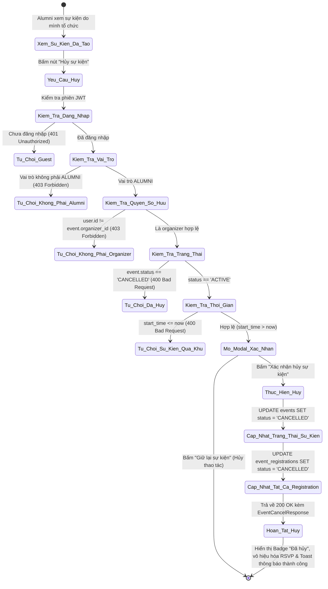
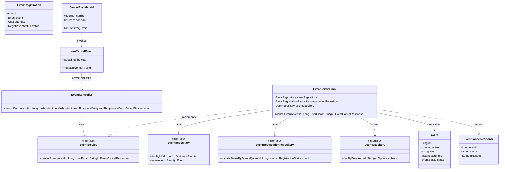
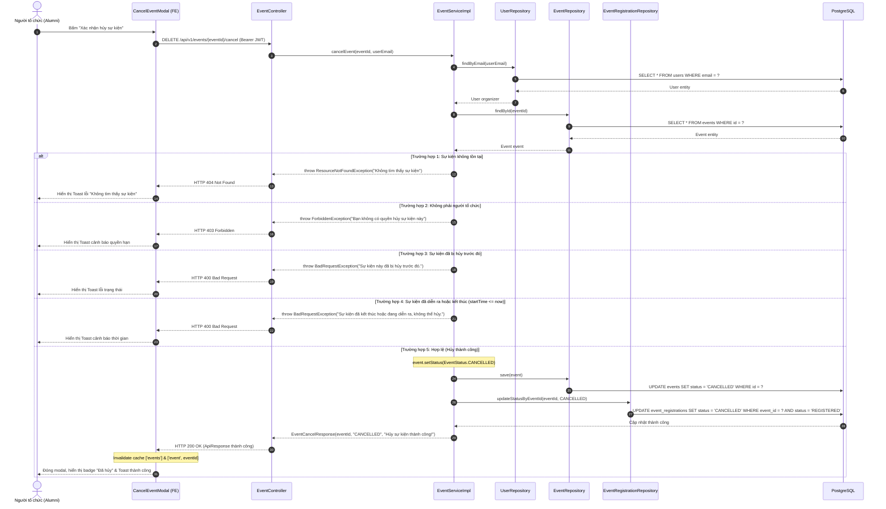

# ĐẶC TẢ YÊU CẦU & THIẾT KẾ CHI TIẾT: UC27 - CANCEL AN EVENT

## PHẦN 1: ĐẶC TẢ NGHIỆP VỤ (REPORT 3)

### 2.2.3 Business Workflow (Luồng nghiệp vụ)


```mermaid
stateDiagram-v2
    [*] --> Xem_Su_Kien_Da_Tao : Alumni xem sự kiện do mình tổ chức
    Xem_Su_Kien_Da_Tao --> Yeu_Cau_Huy : Bấm nút "Hủy sự kiện"
    
    Yeu_Cau_Huy --> Kiem_Tra_Dang_Nhap : Kiểm tra phiên JWT
    Kiem_Tra_Dang_Nhap --> Tu_Choi_Guest : Chưa đăng nhập (401 Unauthorized)
    
    Kiem_Tra_Dang_Nhap --> Kiem_Tra_Vai_Tro : Đã đăng nhập
    Kiem_Tra_Vai_Tro --> Tu_Choi_Khong_Phai_Alumni : Vai trò không phải ALUMNI (403 Forbidden)
    
    Kiem_Tra_Vai_Tro --> Kiem_Tra_Quyen_So_Huu : Vai trò ALUMNI
    Kiem_Tra_Quyen_So_Huu --> Tu_Choi_Khong_Phai_Organizer : user.id != event.organizer_id (403 Forbidden)
    
    Kiem_Tra_Quyen_So_Huu --> Kiem_Tra_Trang_Thai : Là organizer hợp lệ
    Kiem_Tra_Trang_Thai --> Tu_Choi_Da_Huy : event.status == 'CANCELLED' (400 Bad Request)
    
    Kiem_Tra_Trang_Thai --> Kiem_Tra_Thoi_Gian : status == 'ACTIVE'
    Kiem_Tra_Thoi_Gian --> Tu_Choi_Su_Kien_Qua_Khu : start_time <= now (400 Bad Request)
    
    Kiem_Tra_Thoi_Gian --> Mo_Modal_Xac_Nhan : Hợp lệ (start_time > now)
    Mo_Modal_Xac_Nhan --> [*] : Bấm "Giữ lại sự kiện" (Hủy thao tác)
    Mo_Modal_Xac_Nhan --> Thuc_Hien_Huy : Bấm "Xác nhận hủy sự kiện"
    
    Thuc_Hien_Huy --> Cap_Nhat_Trang_Thai_Su_Kien : UPDATE events SET status = 'CANCELLED'
    Cap_Nhat_Trang_Thai_Su_Kien --> Cap_Nhat_Tat_Ca_Registration : UPDATE event_registrations SET status = 'CANCELLED'
    Cap_Nhat_Tat_Ca_Registration --> Hoan_Tat_Huy : Trả về 200 OK kèm EventCancelResponse
    Hoan_Tat_Huy --> [*] : Hiển thị Badge "Đã hủy", vô hiệu hóa RSVP & Toast thông báo thành công
```

#### Mô tả chi tiết luồng xử lý bằng chữ:
* **Bước 1 - Khởi đầu**: Cựu sinh viên (Alumni) đã tạo sự kiện truy cập trang Sự kiện (`/app/events`), Bảng tin (`/app/feed`) hoặc Chi tiết bài viết (`/app/posts/:id`). Trên sự kiện do mình tổ chức, xuất hiện nút "Hủy sự kiện".
* **Bước 2 - Kích hoạt và cảnh báo**:
  * Người tổ chức bấm "Hủy sự kiện".
  * Hệ thống mở modal `CancelEventModal` hiển thị cảnh báo: hành động này sẽ hủy bỏ sự kiện, toàn bộ người đã đăng ký sẽ bị hủy tham gia và sự kiện không thể mở lại.
  * Nếu bấm "Giữ lại sự kiện", modal đóng lại mà không có thay đổi.
* **Bước 3 - Kiểm tra điều kiện nghiệp vụ phía máy chủ (Server Validation & RBAC)**:
  * **Xác thực & Phân quyền**: Yêu cầu JWT hợp lệ của vai trò `ALUMNI`. Nếu không phải Alumni (ví dụ `STUDENT`, `ADMIN`), từ chối với `403 Forbidden`.
  * **Kiểm tra quyền sở hữu (Ownership)**: Kiểm tra `event.organizer.id == current_user.id`. Nếu không trùng khớp, từ chối với `403 Forbidden` ("Bạn không có quyền hủy sự kiện này vì không phải là người tổ chức.").
  * **Kiểm tra trạng thái sự kiện**: Nếu sự kiện đã có `status == 'CANCELLED'`, từ chối với `400 Bad Request` ("Sự kiện này đã bị hủy trước đó.").
  * **Kiểm tra thời gian**: Nếu sự kiện đã bắt đầu hoặc kết thúc (`start_time <= now`), từ chối với `400 Bad Request` ("Sự kiện đã kết thúc hoặc đang diễn ra, không thể hủy.").
* **Bước 4 - Cập nhật dữ liệu & phản hồi**:
  * Cập nhật `events.status = 'CANCELLED'`.
  * Cập nhật toàn bộ các bản ghi `event_registrations` đang `REGISTERED` thành `CANCELLED`.
  * Trả về kết quả thành công HTTP `200 OK` kèm `EventCancelResponse`.
  * Giao diện cập nhật: Badge sự kiện chuyển sang "Đã hủy" màu đỏ, nút RSVP bị vô hiệu hóa, thông báo toast thành công xuất hiện.

---

### 3.2 Module 3 - Social: Feed, Posts, Events, Packages & Messaging

#### 3.2.3 Hủy tổ chức sự kiện (Cancel an Event) - UC27

##### A. Bảng đặc tả Use Case chi tiết

| Mục | Nội dung |
| :--- | :--- |
| **Use Case ID** | UC27 |
| **Use Case Name** | Hủy sự kiện (Cancel an Event) |
| **Module** | Module 3 - Social: Feed, Posts, Events, Packages & Messaging |
| **Actor** | Alumni (người tổ chức / organizer) |
| **Priority** | P0 (MoSCoW: Must Have) |
| **Trigger** | Người tổ chức bấm vào nút "Hủy sự kiện" trên card sự kiện hoặc trang chi tiết |
| **Preconditions** | 1. Người dùng đã đăng nhập với vai trò `ALUMNI`.<br>2. Người dùng là người tạo (organizer) của sự kiện.<br>3. Sự kiện đang ở trạng thái `ACTIVE` và chưa bắt đầu (`start_time > now`). |
| **Postconditions** | 1. `events.status` đổi thành `CANCELLED`.<br>2. Toàn bộ `event_registrations.status` chuyển thành `CANCELLED`.<br>3. Thẻ sự kiện trên UI hiển thị badge "Đã hủy", không cho phép RSVP. |

##### B. Business Rules (Quy tắc nghiệp vụ)

* **BR-01 (Role Restriction)**: Chỉ tài khoản có vai trò `ALUMNI` mới có quyền tổ chức và hủy sự kiện.
* **BR-02 (Organizer Ownership)**: Chỉ chính cựu sinh viên đã tạo sự kiện (`organizer_id == user.id`) mới được phép hủy sự kiện đó.
* **BR-03 (Time Constraint)**: Không được phép hủy sự kiện đã bắt đầu hoặc đã kết thúc (`start_time <= now()`).
* **BR-04 (Irreversible Cancellation)**: Sự kiện sau khi đã hủy (`CANCELLED`) không thể hủy lại và không thể phục hồi về `ACTIVE`.
* **BR-05 (Cascade Registrations Cancellation)**: Khi sự kiện bị hủy, toàn bộ các lượt đăng ký tham gia (`REGISTERED`) tự động chuyển sang `CANCELLED`.
* **BR-06 (Disable RSVP)**: Các sự kiện có trạng thái `CANCELLED` sẽ khóa hoàn toàn chức năng đăng ký tham gia (RSVP).

---

#### 5.3 Application Messages List (Danh sách Thông điệp Ứng dụng)

| # | Mã thông điệp (Message code) | Loại thông điệp (Message Type) | Ngữ cảnh (Context) | Nội dung hiển thị (Content) |
| :--- | :--- | :--- | :--- | :--- |
| 1 | MSG-EV-CANCEL-01 | Toast message | Hủy tổ chức sự kiện thành công | Hủy sự kiện thành công! |
| 2 | MSG-EV-CANCEL-02 | Modal confirmation | Xác nhận trước khi hủy sự kiện | Bạn có chắc chắn muốn hủy sự kiện này? Hành động này không thể hoàn tác. |
| 3 | MSG-EV-CANCEL-03 | Toast Error | Sự kiện đã bị hủy trước đó | Sự kiện này đã bị hủy trước đó. |
| 4 | MSG-EV-CANCEL-04 | Toast Error | Sự kiện đã diễn ra hoặc kết thúc | Sự kiện đã kết thúc hoặc đang diễn ra, không thể hủy. |
| 5 | MSG-EV-CANCEL-05 | Toast Error | Không phải người tổ chức sự kiện | Bạn không có quyền hủy sự kiện này vì không phải là người tổ chức. |
| 6 | MSG-EV-CANCEL-06 | Toast Error | Sự kiện không tồn tại | Không tìm thấy sự kiện. |
| 7 | MSG-EV-CANCEL-07 | In line | Người dùng chưa đăng nhập gọi API | Người dùng chưa đăng nhập hoặc phiên làm việc đã hết hạn. |

---

## PHẦN 2: THIẾT KẾ CHI TIẾT (REPORT 4)

### 3. Detail Design (Thiết kế chi tiết)

#### 3.1 UC27 Hủy sự kiện (Cancel an Event)

##### 3.1.1 Class Diagram (Sơ đồ Lớp)


```mermaid
classDiagram
    %% Controller Layer
    class EventController {
        +cancelEvent(eventId: Long, authentication: Authentication) ResponseEntity~ApiResponse~EventCancelResponse~~
    }

    %% DTO Layer
    class EventCancelResponse {
        -Long eventId
        -String status
        -String message
    }

    %% Service Layer
    class EventService {
        <<interface>>
        +cancelEvent(eventId: Long, userEmail: String) EventCancelResponse
    }

    class EventServiceImpl {
        -EventRepository eventRepository
        -EventRegistrationRepository registrationRepository
        -UserRepository userRepository
        +cancelEvent(eventId: Long, userEmail: String) EventCancelResponse
    }

    %% Repository Layer
    class EventRepository {
        <<interface>>
        +findById(id: Long) Optional~Event~
        +save(event: Event) Event
    }

    class EventRegistrationRepository {
        <<interface>>
        +updateStatusByEventId(eventId: Long, status: RegistrationStatus) void
    }

    class UserRepository {
        <<interface>>
        +findByEmail(email: String) Optional~User~
    }

    %% Entities
    class Event {
        -Long id
        -User organizer
        -String title
        -Instant startTime
        -EventStatus status
    }

    class EventRegistration {
        -Long id
        -Event event
        -User attendee
        -RegistrationStatus status
    }

    %% Frontend Components & Hooks
    class CancelEventModal {
        +eventId: number
        +isOpen: boolean
        +onConfirm() void
    }

    class useCancelEvent {
        +mutate(eventId) void
        +isLoading: boolean
    }

    EventController ..> EventService : calls
    EventServiceImpl ..|> EventService : implements
    EventServiceImpl --> EventRepository : uses
    EventServiceImpl --> EventRegistrationRepository : uses
    EventServiceImpl --> UserRepository : uses
    EventServiceImpl --> Event : modifies
    EventServiceImpl ..> EventCancelResponse : returns
    CancelEventModal ..> useCancelEvent : invokes
    useCancelEvent ..> EventController : HTTP DELETE
```

###### Mô tả chi tiết cấu trúc các lớp (Class Design Description):
* **Lớp Controller (`EventController.java`)**: Cung cấp API `DELETE /api/v1/events/{eventId}` và alias `DELETE /api/v1/events/{eventId}/cancel`, tiếp nhận yêu cầu từ Client và trích xuất email từ SecurityContext.
* **Lớp DTO (`EventCancelResponse.java`)**: Định dạng dữ liệu phản hồi trả về gồm mã sự kiện, trạng thái mới (`CANCELLED`) và thông điệp xác nhận.
* **Lớp Service (`EventService.java`, `EventServiceImpl.java`)**: Đảm bảo tính toàn vẹn giao dịch với `@Transactional`, kiểm tra điều kiện quyền tổ chức, thời gian bắt đầu, trạng thái hiện tại và cập nhật đồng thời trạng thái sự kiện cùng toàn bộ danh sách đăng ký.
* **Lớp Repository & Entity (`EventRepository.java`, `EventRegistrationRepository.java`, `Event.java`)**: Quản lý dữ liệu quan hệ, cập nhật cột `status = 'CANCELLED'` và kích hoạt ràng buộc kiểm tra.
* **Lớp Frontend (`CancelEventModal.tsx`, `useCancelEvent.ts`)**: Hộp thoại cảnh báo mức độ rủi ro cao trước khi hủy, kích hoạt mutation React Query và cập nhật lại giao diện sự kiện.

##### 3.1.2 Sequence Diagram (Sơ đồ Tuần tự)


```mermaid
sequenceDiagram
    autonumber
    actor Organizer as Người tổ chức (Alumni)
    participant UI as CancelEventModal (FE)
    participant Controller as EventController
    participant Service as EventServiceImpl
    participant UserRepo as UserRepository
    participant EventRepo as EventRepository
    participant RegRepo as EventRegistrationRepository
    participant DB as PostgreSQL

    Organizer->>UI: Bấm "Xác nhận hủy sự kiện"
    UI->>Controller: DELETE /api/v1/events/{eventId}/cancel (Bearer JWT)
    
    Controller->>Service: cancelEvent(eventId, userEmail)
    Service->>UserRepo: findByEmail(userEmail)
    UserRepo->>DB: SELECT * FROM users WHERE email = ?
    DB-->>UserRepo: User entity
    UserRepo-->>Service: User organizer
    
    Service->>EventRepo: findById(eventId)
    EventRepo->>DB: SELECT * FROM events WHERE id = ?
    DB-->>EventRepo: Event entity
    EventRepo-->>Service: Event event
    
    alt Trường hợp 1: Sự kiện không tồn tại
        Service-->>Controller: throw ResourceNotFoundException("Không tìm thấy sự kiện")
        Controller-->>UI: HTTP 404 Not Found
        UI-->>Organizer: Hiển thị Toast lỗi "Không tìm thấy sự kiện"
        
    else Trường hợp 2: Không phải người tổ chức
        Service-->>Controller: throw ForbiddenException("Bạn không có quyền hủy sự kiện này")
        Controller-->>UI: HTTP 403 Forbidden
        UI-->>Organizer: Hiển thị Toast cảnh báo quyền hạn
        
    else Trường hợp 3: Sự kiện đã bị hủy trước đó
        Service-->>Controller: throw BadRequestException("Sự kiện này đã bị hủy trước đó.")
        Controller-->>UI: HTTP 400 Bad Request
        UI-->>Organizer: Hiển thị Toast lỗi trạng thái
        
    else Trường hợp 4: Sự kiện đã diễn ra hoặc kết thúc (startTime <= now)
        Service-->>Controller: throw BadRequestException("Sự kiện đã kết thúc hoặc đang diễn ra, không thể hủy.")
        Controller-->>UI: HTTP 400 Bad Request
        UI-->>Organizer: Hiển thị Toast cảnh báo thời gian
        
    else Trường hợp 5: Hợp lệ (Hủy thành công)
        Note over Service: event.setStatus(EventStatus.CANCELLED)
        Service->>EventRepo: save(event)
        EventRepo->>DB: UPDATE events SET status = 'CANCELLED' WHERE id = ?
        
        Service->>RegRepo: updateStatusByEventId(eventId, CANCELLED)
        RegRepo->>DB: UPDATE event_registrations SET status = 'CANCELLED' WHERE event_id = ? AND status = 'REGISTERED'
        DB-->>Service: Cập nhật thành công
        
        Service-->>Controller: EventCancelResponse(eventId, "CANCELLED", "Hủy sự kiện thành công!")
        Controller-->>UI: HTTP 200 OK (ApiResponse thành công)
        Note over UI: Invalidate cache ['events'] & ['event', eventId]
        UI-->>Organizer: Đóng modal, hiển thị badge "Đã hủy" & Toast thành công
    end
```

###### Mô tả chi tiết luồng xử lý bằng chữ (Sequence Flow Description):
1. **Luồng 1 - Thành công (Normal Case)**: Người tổ chức (Alumni) xác nhận hủy sự kiện hợp lệ (sự kiện chưa diễn ra, chưa bị hủy). Service cập nhật trạng thái sự kiện sang `CANCELLED`, đồng thời chuyển toàn bộ các đăng ký tham gia sang `CANCELLED`. Trả về `200 OK` kèm `EventCancelResponse`. Frontend làm mới cache dữ liệu, khóa nút RSVP và hiển thị badge "Đã hủy".
2. **Luồng 2 - Ngoại lệ Quyền sở hữu (Ownership Violation Case)**: Người dùng khác cố tình gửi request hủy sự kiện không do mình tạo. Service từ chối với `HTTP 403 Forbidden`.
3. **Luồng 3 - Ngoại lệ Thời gian (Time Constraint Violation Case)**: Sự kiện đang diễn ra hoặc đã kết thúc (`start_time <= now`). Hệ thống từ chối hủy với `HTTP 400 Bad Request`.
4. **Luồng 4 - Ngoại lệ Trạng thái (Status Conflict Case)**: Sự kiện đã ở trạng thái `CANCELLED`. Hệ thống phản hồi `HTTP 400 Bad Request`.
5. **Luồng 5 - Ngoại lệ Không tồn tại (Not Found Case)**: `eventId` không tồn tại trong CSDL. Hệ thống phản hồi `HTTP 404 Not Found`.


### 1. Database Design

Migration V14: `V14__add_event_status.sql`
```sql
ALTER TABLE events
    ADD COLUMN IF NOT EXISTS status VARCHAR(20) NOT NULL DEFAULT 'ACTIVE';

DO $$
BEGIN
    IF NOT EXISTS (
        SELECT 1 FROM pg_constraint WHERE conname = 'ck_events_status'
    ) THEN
        ALTER TABLE events
            ADD CONSTRAINT ck_events_status CHECK (status IN ('ACTIVE', 'CANCELLED'));
    END IF;
END $$;

CREATE INDEX IF NOT EXISTS idx_events_status ON events(status);
```

### 2. REST API Specification

* **Endpoint**: `DELETE /api/v1/events/{eventId}` (và alias `DELETE /api/v1/events/{eventId}/cancel`)
* **Security**: Bearer JWT (Role: `ALUMNI`)
* **Responses**:
  * `200 OK`:
    ```json
    {
      "code": 200,
      "message": "Hủy sự kiện thành công!",
      "data": {
        "eventId": 100,
        "status": "CANCELLED",
        "message": "Hủy sự kiện thành công!"
      }
    }
    ```
  * `400 Bad Request`: "Sự kiện này đã bị hủy trước đó." hoặc "Sự kiện đã kết thúc hoặc đang diễn ra, không thể hủy."
  * `403 Forbidden`: "Chỉ cựu sinh viên (người tổ chức) mới có quyền hủy sự kiện." hoặc "Bạn không có quyền hủy sự kiện này vì không phải là người tổ chức."
  * `404 Not Found`: "Không tìm thấy sự kiện"
