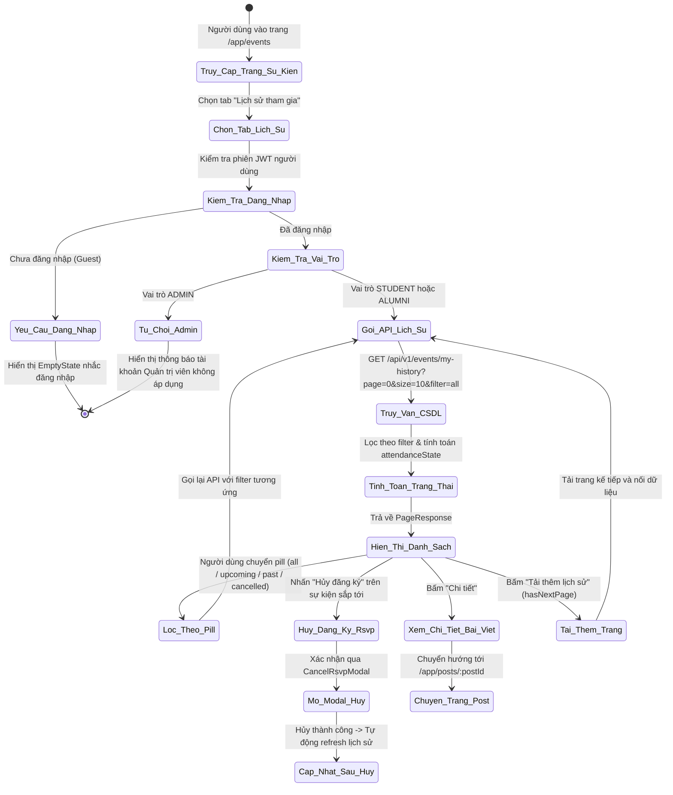

# ĐẶC TẢ YÊU CẦU & THIẾT KẾ CHI TIẾT: UC28 - VIEW ATTENDED-EVENT HISTORY

## PHẦN 1: ĐẶC TẢ NGHIỆP VỤ (REPORT 3)

### 2.2.3 Business Workflow (Luồng nghiệp vụ)



#### Mô tả chi tiết luồng xử lý:
* **Bước 1 - Truy cập giao diện**: Người dùng truy cập trang Sự kiện & Họp mặt (`/app/events`) và bấm chọn tab **"Lịch sử tham gia"**.
* **Bước 2 - Kiểm tra xác thực & vai trò (RBAC Check)**:
  * Nếu là khách vãng lai (chưa đăng nhập), giao diện hiển thị trạng thái yêu cầu đăng nhập kèm nút kích hoạt modal đăng nhập.
  * Nếu là quản trị viên (`ADMIN`), hệ thống giải thích vai trò Quản trị viên không tham gia vào hoạt động sự kiện cộng đồng.
  * Nếu là sinh viên (`STUDENT`) hoặc cựu sinh viên (`ALUMNI`), tiếp tục luồng dữ liệu.
* **Bước 3 - Truy vấn dữ liệu & tính toán trạng thái**:
  * Frontend gửi request `GET /api/v1/events/my-history?page=0&size=9&filter={filter}` kèm Bearer JWT.
  * Backend kiểm tra danh tính qua email trích xuất từ JWT, truy vấn bảng `event_registrations` kết hợp `events` theo `userId` và bộ lọc:
    * `all`: Lấy toàn bộ lịch sử đăng ký tham gia của người dùng.
    * `upcoming`: Lấy các sự kiện người dùng đang đăng ký (`REGISTERED`) và chưa diễn ra (`start_time > now`).
    * `past`: Lấy các sự kiện người dùng đã tham gia (`REGISTERED`) và đã diễn ra hoặc kết thúc (`start_time <= now`).
    * `cancelled`: Lấy các lượt đăng ký người dùng đã hủy (`reg.status = CANCELLED`) hoặc các sự kiện đã bị ban tổ chức hủy (`event.status = CANCELLED`).
  * Backend chuẩn hóa trạng thái trực quan `attendanceState`:
    * `UPCOMING`: Sự kiện sắp diễn ra và người dùng đang giữ chỗ hợp lệ.
    * `ONGOING`: Sự kiện đang trong thời gian diễn ra.
    * `PAST`: Sự kiện đã kết thúc và người dùng đã tham gia.
    * `REGISTRATION_CANCELLED`: Người dùng chủ động hủy tham gia.
    * `EVENT_CANCELLED`: Ban tổ chức hủy bỏ sự kiện.
  * Dữ liệu trả về phân trang qua cấu trúc chuẩn `PageResponse<EventHistoryResponse>`.
* **Bước 4 - Tương tác trực tiếp trên lịch sử**:
  * Người dùng có thể lọc nhanh theo 4 tab con: *Tất cả*, *Sắp diễn ra*, *Đã tham gia*, *Đã hủy*.
  * Với các sự kiện sắp diễn ra, người dùng có thể thực hiện thao tác hủy đăng ký (Cancel RSVP) trực tiếp ngay tại thẻ sự kiện thông qua modal xác nhận. Khi hoàn tất, danh sách lịch sử tự động đồng bộ lại tức thì mà không cần tải lại toàn bộ trang web.
  * Nhấn vào "Chi tiết" để điều hướng sang bài viết gốc giới thiệu sự kiện.
  * Nhấn vào thông tin người tổ chức để xem hồ sơ cá nhân của cựu sinh viên phụ trách.

---

### 3.2 Module 3 - Social: Feed, Posts, Events, Packages & Messaging

#### 3.2.4 Xem lịch sử tham gia sự kiện (View Attended-Event History) - UC28

##### A. Bảng đặc tả Use Case chi tiết

| Mục | Nội dung |
| :--- | :--- |
| **Use Case ID** | UC28 |
| **Use Case Name** | Xem lịch sử tham gia sự kiện (View Attended-Event History) |
| **Module** | Module 3 - Social: Feed, Posts, Events, Packages & Messaging |
| **Actor** | Sinh viên (`STUDENT`), Cựu sinh viên (`ALUMNI`) |
| **Priority** | P2 (MoSCoW: Could Have) |
| **Trigger** | Người dùng chọn tab "Lịch sử tham gia" trên trang Sự kiện (`/app/events`) |
| **Preconditions** | 1. Người dùng đã đăng nhập hệ thống với vai trò `STUDENT` hoặc `ALUMNI`.<br>2. Token xác thực JWT còn hiệu lực. |
| **Postconditions** | Danh sách các sự kiện người dùng đã đăng ký được hiển thị đầy đủ, trực quan kèm thông tin trạng thái tham gia, thời gian, địa điểm, ban tổ chức và các thao tác liên quan. |

##### B. Business Rules (Quy tắc nghiệp vụ)

* **BR-01 (Role Restriction)**: Chỉ tài khoản có vai trò `STUDENT` và `ALUMNI` mới có quyền xem lịch sử tham gia sự kiện. Tài khoản `ADMIN` bị từ chối với mã lỗi `403 Forbidden`. Khách vãng lai (`GUEST`) bị từ chối với mã lỗi `401 Unauthorized`.
* **BR-02 (Data Isolation)**: Người dùng chỉ có thể xem lịch sử các sự kiện do chính tài khoản của mình thực hiện đăng ký (`event_registrations.user_id == current_user.id`), tuyệt đối không được xem lịch sử của người dùng khác.
* **BR-03 (Filter Criteria)**:
  * Bộ lọc `all`: Hiển thị tất cả bản ghi đăng ký tham gia sự kiện của người dùng, sắp xếp theo thời gian đăng ký mới nhất giảm dần.
  * Bộ lọc `upcoming`: Chỉ hiển thị các bản ghi có trạng thái đăng ký là `REGISTERED` và sự kiện chưa diễn ra (`start_time > now()`), sắp xếp theo thời gian bắt đầu sự kiện tăng dần.
  * Bộ lọc `past`: Chỉ hiển thị các bản ghi có trạng thái đăng ký là `REGISTERED` và sự kiện đã diễn ra hoặc đã kết thúc (`start_time <= now()`), sắp xếp theo thời gian bắt đầu sự kiện giảm dần.
  * Bộ lọc `cancelled`: Hiển thị các bản ghi mà người dùng đã hủy đăng ký (`reg.status = 'CANCELLED'`) hoặc sự kiện bị ban tổ chức hủy (`events.status = 'CANCELLED'`).
* **BR-04 (Attendance State Normalization)**:
  * Hệ thống tính toán trường `attendanceState` linh hoạt phục vụ hiển thị nhãn trạng thái (Badge) với màu sắc rõ ràng (Aqua, Gold, Green, Coral, Gray).
* **BR-05 (Action Interoperability)**:
  * Người dùng có thể hủy tham gia sự kiện sắp diễn ra thông qua nút hủy tích hợp sẵn trên thẻ sự kiện.
  * Mỗi thẻ sự kiện liên kết trực tiếp tới bài viết chi tiết và hồ sơ của người tổ chức.

---

## PHẦN 2: THIẾT KẾ KỸ THUẬT (REPORT 4)

### 1. Database Schema

UC28 tận dụng toàn bộ các bảng cơ sở dữ liệu sẵn có của hệ thống, không yêu cầu tạo mới bảng hay chạy migration bổ sung:
* Bảng `events`: Lưu trữ thông tin sự kiện (tiêu đề, địa điểm, thời gian bắt đầu/kết thúc, trạng thái, người tổ chức).
* Bảng `event_registrations`: Lưu vết lịch sử đăng ký tham gia (`user_id`, `event_id`, `status`, `registered_at`).
* Bảng `posts`: Lưu trữ bài viết liên kết, ảnh bìa sự kiện (`post_media`).
* Bảng `users` & `user_profiles`: Cung cấp thông tin tên và ảnh đại diện ban tổ chức.

### 2. REST API Specification

#### Endpoint: Xem lịch sử tham gia sự kiện của người dùng hiện tại
* **Method & Path**: `GET /api/v1/events/my-history` (hỗ trợ alias: `GET /api/v1/events/history`)
* **Security**: Bearer JWT (Role: `STUDENT`, `ALUMNI`)
* **Request Parameters**:
  * `page` (integer, optional, default: 0): Chỉ số trang (0-indexed).
  * `size` (integer, optional, default: 10): Số phần tử trên mỗi trang.
  * `filter` (string, optional, default: 'all'): Bộ lọc trạng thái (`all`, `upcoming`, `past`, `cancelled`).
* **Responses**:
  * `200 OK`:
    ```json
    {
      "code": 200,
      "message": "Lấy lịch sử tham gia sự kiện thành công!",
      "data": {
        "content": [
          {
            "registrationId": 12,
            "registrationStatus": "REGISTERED",
            "registeredAt": "2026-09-08T03:00:00Z",
            "eventId": 100,
            "title": "Hội thảo Công nghệ AI & Xu hướng 2026",
            "location": "Hội trường A, Đại học FPT TP.HCM",
            "startTime": "2026-09-20T08:30:00Z",
            "endTime": "2026-09-20T11:30:00Z",
            "capacity": 150,
            "attendeeCount": 45,
            "eventStatus": "ACTIVE",
            "postId": 55,
            "coverUrl": "https://storage.alumnect.edu.vn/media/events/ai-tech-2026.jpg",
            "organizerId": 10,
            "organizerName": "Nguyễn Văn A",
            "organizerAvatar": "https://storage.alumnect.edu.vn/avatars/user-10.png",
            "attendanceState": "UPCOMING"
          }
        ],
        "pageNumber": 0,
        "pageSize": 10,
        "totalElements": 1,
        "totalPages": 1,
        "last": true
      }
    }
    ```
  * `401 Unauthorized`: Người dùng chưa đăng nhập hoặc token đã hết hạn.
  * `403 Forbidden`: Người dùng không có quyền truy cập (vai trò `ADMIN`).
