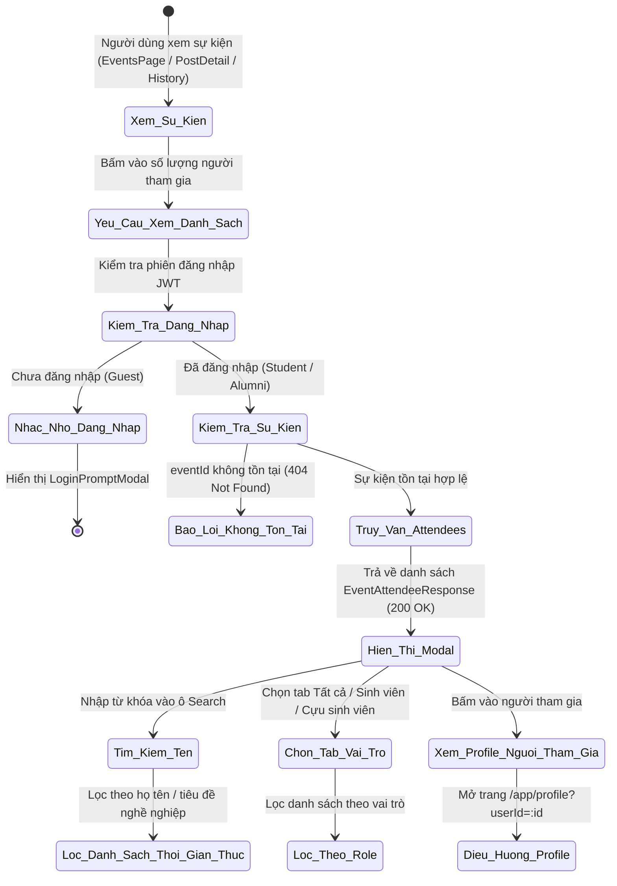

# ĐẶC TẢ YÊU CẦU & THIẾT KẾ CHI TIẾT: UC29 - VIEW EVENT ATTENDEE LIST

## PHẦN 1: ĐẶC TẢ NGHIỆP VỤ (REPORT 3)

### 2.2.3 Business Workflow (Luồng nghiệp vụ)



#### Mô tả chi tiết luồng xử lý:
* **Bước 1 - Kích hoạt thao tác**: Người dùng xem sự kiện tại bất kỳ đâu trên hệ thống: Trang sự kiện (`/app/events`), Trang chi tiết bài viết (`/app/posts/:id`), hoặc Trang lịch sử tham gia sự kiện (`/app/events` tab Lịch sử). Người dùng bấm vào nút hiển thị số lượng người tham gia (ví dụ: *"12 / 50 người tham gia"*).
* **Bước 2 - Kiểm tra phiên đăng nhập & vai trò**:
  * Nếu người dùng chưa đăng nhập (khách vãng lai), hệ thống hiển thị modal nhắc nhở đăng nhập nhằm bảo vệ quyền riêng tư thông tin sinh viên và cựu sinh viên.
  * Nếu người dùng đã đăng nhập với vai trò Sinh viên (`STUDENT`) hoặc Cựu sinh viên (`ALUMNI`), modal danh sách người tham gia được mở ra.
* **Bước 3 - Truy vấn dữ liệu từ máy chủ**:
  * Frontend gọi API `GET /api/v1/events/{eventId}/attendees`.
  * Backend kiểm tra sự kiện có tồn tại trong hệ thống hay không:
    * Nếu không tồn tại: trả về mã lỗi HTTP `404 Not Found` kèm thông điệp *"Không tìm thấy sự kiện"*.
    * Nếu tồn tại: truy vấn các bản ghi đăng ký tham gia có trạng thái `status = 'REGISTERED'` từ bảng `event_registrations`, nối với bảng `users` và `user_profiles` để lấy thông tin họ tên, avatar, tiêu đề nghề nghiệp và vai trò, sắp xếp theo thời gian đăng ký sớm nhất (`created_at ASC`).
* **Bước 4 - Tương tác và tìm kiếm trên giao diện Modal**:
  * Người dùng có thể nhập từ khóa tìm kiếm theo họ tên hoặc chức danh vào ô Search bar để tìm nhanh bạn bè, cựu sinh viên cùng tham gia.
  * Người dùng có thể chuyển đổi giữa các tab lọc vai trò: *Tất cả*, *Sinh viên*, *Cựu sinh viên* (hiển thị kèm số lượng cụ thể).
  * Khi bấm vào bất kỳ người tham gia nào, hệ thống tự động điều hướng sang trang Hồ sơ cá nhân (`/app/profile?userId=...`) của người đó để kết nối và giao lưu.

---

### 3.2 Module 3 - Social: Feed, Posts, Events, Packages & Messaging

#### 3.2.5 Xem danh sách người tham gia sự kiện (View Event Attendee List) - UC29

##### A. Bảng đặc tả Use Case chi tiết

| Mục | Nội dung |
| :--- | :--- |
| **Use Case ID** | UC29 |
| **Use Case Name** | Xem danh sách người tham gia sự kiện (View Event Attendee List) |
| **Module** | Module 3 - Social: Feed, Posts, Events, Packages & Messaging |
| **Actor** | Sinh viên (`STUDENT`), Cựu sinh viên (`ALUMNI`) |
| **Priority** | P1 (MoSCoW: Should Have) |
| **Trigger** | Người dùng bấm vào nút số lượng người tham gia trên thẻ sự kiện hoặc bài viết |
| **Preconditions** | 1. Người dùng đã đăng nhập vào hệ thống với vai trò `STUDENT` hoặc `ALUMNI`.<br>2. Sự kiện tồn tại trong cơ sở dữ liệu. |
| **Postconditions** | Modal hiển thị danh sách người tham gia với đầy đủ thông tin đại diện, chức danh, vai trò, thời gian đăng ký, kèm công cụ tìm kiếm và lọc linh hoạt. |

##### B. Business Rules (Quy tắc nghiệp vụ)

* **BR-01 (Actor Access)**: Sinh viên (`STUDENT`) và Cựu sinh viên (`ALUMNI`) có toàn quyền xem danh sách người tham gia của bất kỳ sự kiện nào trong cộng đồng.
* **BR-02 (Privacy & Guest Protection)**: Khách vãng lai (`GUEST`) chưa đăng nhập sẽ được yêu cầu đăng nhập trước khi xem danh sách nhằm bảo vệ danh tính và thông tin cá nhân của các thành viên.
* **BR-03 (Registered Only Status)**: Danh sách chỉ lấy các bản ghi có trạng thái `status = 'REGISTERED'`. Các lượt đăng ký đã hủy (`status = 'CANCELLED'`) bị loại trừ hoàn toàn khỏi danh sách hiển thị.
* **BR-04 (Chronological Ordering)**: Danh sách mặc định được sắp xếp tăng dần theo thời gian đăng ký (`created_at ASC`), ghi nhận những người đăng ký giữ chỗ sớm nhất.
* **BR-05 (Search & Role Filtering)**:
  * Hỗ trợ tìm kiếm theo họ tên hoặc chức danh nghề nghiệp (headline/ngành học) không phân biệt chữ hoa, chữ thường.
  * Hỗ trợ lọc theo 3 phân loại vai trò: *Tất cả*, *Sinh viên*, *Cựu sinh viên*.
* **BR-06 (Cancelled Event Handling)**: Nếu sự kiện đã bị ban tổ chức hủy (`status = 'CANCELLED'`), hệ thống hiển thị nhãn cảnh báo rõ ràng trên đầu danh sách, nhưng vẫn cho phép các thành viên xem lại danh sách những người đã từng đăng ký trước khi sự kiện bị hủy.
* **BR-07 (Direct Profile Navigation)**: Bấm vào thẻ người tham gia sẽ đóng modal và mở hồ sơ cá nhân của thành viên đó (`/app/profile?userId=...`).

---

## PHẦN 2: THIẾT KẾ KỸ THUẬT (REPORT 4)

### 1. Database Schema

UC29 sử dụng 100% cấu trúc cơ sở dữ liệu hiện hành, không tạo mới bảng hay chạy migration bổ sung:
* Bảng `events`: Kiểm tra sự kiện tồn tại, lấy tiêu đề, sức chứa (`capacity`), số lượng tham gia (`attendee_count`), trạng thái (`status`).
* Bảng `event_registrations`: Lọc các bản ghi `event_id = :eventId AND status = 'REGISTERED'`.
* Bảng `users` & `roles`: Lấy vai trò (`STUDENT`, `ALUMNI`), email dự phòng.
* Bảng `user_profiles`: Lấy họ tên hiển thị (`full_name`), ảnh đại diện (`avatar_url`), tiêu đề nghề nghiệp (`headline`), ngành học (`major_id`).

### 2. REST API Specification

#### Endpoint: Lấy danh sách người tham gia sự kiện
* **Method & Path**: `GET /api/v1/events/{eventId}/attendees`
* **Request Parameters**:
  * `eventId` (Path variable, Long, bắt buộc): ID của sự kiện cần xem.
  * `search` (Query param, String, tùy chọn): Từ khóa tìm kiếm họ tên hoặc tiêu đề nghề nghiệp.
  * `role` (Query param, String, tùy chọn): Bộ lọc vai trò (`ALL`, `STUDENT`, `ALUMNI`).
* **Responses**:
  * `200 OK`:
    ```json
    {
      "code": 200,
      "message": "Lấy danh sách người tham gia thành công",
      "data": [
        {
          "userId": 10,
          "fullName": "Nguyễn Văn A",
          "avatarUrl": "https://storage.alumnect.edu.vn/avatars/user-10.png",
          "headline": "Software Engineer tại FPT Software",
          "role": "ALUMNI",
          "registeredAt": "2026-09-08T03:00:00Z"
        },
        {
          "userId": 25,
          "fullName": "Trần Thị B",
          "avatarUrl": "https://storage.alumnect.edu.vn/avatars/user-25.png",
          "headline": "Kỹ thuật phần mềm - K18",
          "role": "STUDENT",
          "registeredAt": "2026-09-08T04:15:00Z"
        }
      ]
    }
    ```
  * `404 Not Found`: Khi không tìm thấy sự kiện theo `eventId`.
    ```json
    {
      "code": 404,
      "message": "Không tìm thấy sự kiện"
    }
    ```
