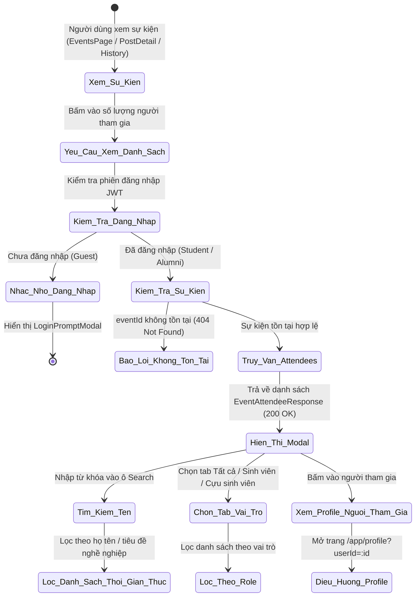
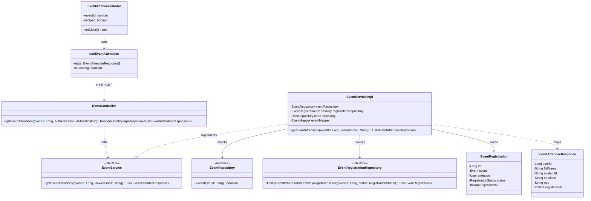
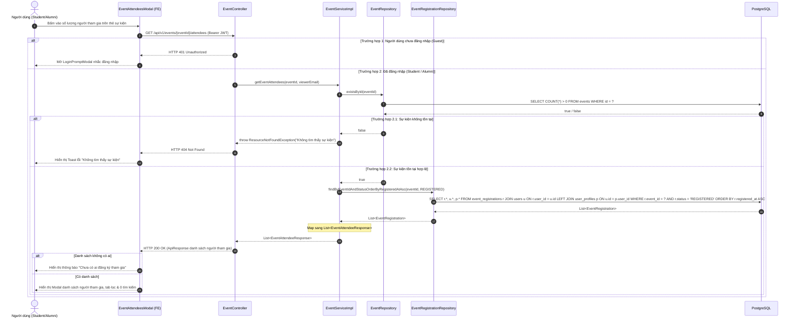

# ĐẶC TẢ YÊU CẦU & THIẾT KẾ CHI TIẾT: UC29 - VIEW EVENT ATTENDEE LIST

## PHẦN 1: ĐẶC TẢ NGHIỆP VỤ (REPORT 3)

### 2.2.3 Business Workflow (Luồng nghiệp vụ)


```mermaid
stateDiagram-v2
    [*] --> Xem_Su_Kien : Người dùng xem sự kiện (EventsPage / PostDetail / History)
    Xem_Su_Kien --> Yeu_Cau_Xem_Danh_Sach : Bấm vào số lượng người tham gia
    
    Yeu_Cau_Xem_Danh_Sach --> Kiem_Tra_Dang_Nhap : Kiểm tra phiên đăng nhập JWT
    Kiem_Tra_Dang_Nhap --> Nhac_Nho_Dang_Nhap : Chưa đăng nhập (Guest)
    Nhac_Nho_Dang_Nhap --> [*] : Hiển thị LoginPromptModal
    
    Kiem_Tra_Dang_Nhap --> Kiem_Tra_Su_Kien : Đã đăng nhập (Student / Alumni)
    Kiem_Tra_Su_Kien --> Bao_Loi_Khong_Ton_Tai : eventId không tồn tại (404 Not Found)
    
    Kiem_Tra_Su_Kien --> Truy_Van_Attendees : Sự kiện tồn tại hợp lệ
    Truy_Van_Attendees --> Hien_Thi_Modal : Trả về danh sách EventAttendeeResponse (200 OK)
    
    Hien_Thi_Modal --> Tim_Kiem_Ten : Nhập từ khóa vào ô Search
    Tim_Kiem_Ten --> Loc_Danh_Sach_Thoi_Gian_Thuc : Lọc theo họ tên / tiêu đề nghề nghiệp
    
    Hien_Thi_Modal --> Chon_Tab_Vai_Tro : Chọn tab Tất cả / Sinh viên / Cựu sinh viên
    Chon_Tab_Vai_Tro --> Loc_Theo_Role : Lọc danh sách theo vai trò
    
    Hien_Thi_Modal --> Xem_Profile_Nguoi_Tham_Gia : Bấm vào người tham gia
    Xem_Profile_Nguoi_Tham_Gia --> Dieu_Huong_Profile : Mở trang /app/profile?userId=:id
```

#### Mô tả chi tiết luồng xử lý:
* **Bước 1 - Kích hoạt thao tác**: Người dùng xem sự kiện tại bất kỳ đâu trên hệ thống: Trang sự kiện (`/app/events`), Trang chi tiết bài viết (`/app/posts/:id`), hoặc Trang lịch sử tham gia sự kiện (`/app/events` tab Lịch sử). Người dùng bấm vào nút hiển thị số lượng người tham gia (ví dụ: *"12 / 50 người tham gia"*).
* **Bước 2 - Kiểm tra phiên đăng nhập & vai trò**:
  * Nếu người dùng chưa đăng nhập (khách vãng lai), hệ thống hiển thị modal nhắc nhở đăng nhập nhằm bảo vệ quyền riêng tư thông tin sinh viên và cựu sinh viên.
  * Nếu người dùng đã đăng nhập với vai trò Sinh viên (`STUDENT`) hoặc Cựu sinh viên (`ALUMNI`), modal danh sách người tham gia được mở ra.
* **Bước 3 - Truy vấn dữ liệu từ máy chủ**:
  * Frontend gọi API `GET /api/v1/events/{eventId}/attendees`.
  * Backend kiểm tra sự kiện có tồn tại trong hệ thống hay không:
    * Nếu không tồn tại: trả về mã lỗi HTTP `404 Not Found` kèm thông điệp *"Không tìm thấy sự kiện"*.
    * Nếu tồn tại: truy vấn các bản ghi đăng ký tham gia có trạng thái `status = 'REGISTERED'` từ bảng `event_registrations`, nối với bảng `users` và `user_profiles` để lấy thông tin họ tên, avatar, tiêu đề nghề nghiệp và vai trò, sắp xếp theo thời gian đăng ký sớm nhất (`created_at ASC`).
* **Bước 4 - Tương tác và tìm kiếm trên giao diện Modal**:
  * Người dùng có thể nhập từ khóa tìm kiếm theo họ tên hoặc chức danh vào ô Search bar để tìm nhanh bạn bè, cựu sinh viên cùng tham gia.
  * Người dùng có thể chuyển đổi giữa các tab lọc vai trò: *Tất cả*, *Sinh viên*, *Cựu sinh viên* (hiển thị kèm số lượng cụ thể).
  * Khi bấm vào bất kỳ người tham gia nào, hệ thống tự động điều hướng sang trang Hồ sơ cá nhân (`/app/profile?userId=...`) của người đó để kết nối và giao lưu.

---

### 3.2 Module 3 - Social: Feed, Posts, Events, Packages & Messaging

#### 3.2.5 Xem danh sách người tham gia sự kiện (View Event Attendee List) - UC29

##### A. Bảng đặc tả Use Case chi tiết

| Mục | Nội dung |
| :--- | :--- |
| **Use Case ID** | UC29 |
| **Use Case Name** | Xem danh sách người tham gia sự kiện (View Event Attendee List) |
| **Module** | Module 3 - Social: Feed, Posts, Events, Packages & Messaging |
| **Actor** | Sinh viên (`STUDENT`), Cựu sinh viên (`ALUMNI`) |
| **Priority** | P1 (MoSCoW: Should Have) |
| **Trigger** | Người dùng bấm vào nút số lượng người tham gia trên thẻ sự kiện hoặc bài viết |
| **Preconditions** | 1. Người dùng đã đăng nhập vào hệ thống với vai trò `STUDENT` hoặc `ALUMNI`.<br>2. Sự kiện tồn tại trong cơ sở dữ liệu. |
| **Postconditions** | Modal hiển thị danh sách người tham gia với đầy đủ thông tin đại diện, chức danh, vai trò, thời gian đăng ký, kèm công cụ tìm kiếm và lọc linh hoạt. |

##### B. Business Rules (Quy tắc nghiệp vụ)

* **BR-01 (Actor Access)**: Sinh viên (`STUDENT`) và Cựu sinh viên (`ALUMNI`) có toàn quyền xem danh sách người tham gia của bất kỳ sự kiện nào trong cộng đồng.
* **BR-02 (Privacy & Guest Protection)**: Khách vãng lai (`GUEST`) chưa đăng nhập sẽ được yêu cầu đăng nhập trước khi xem danh sách nhằm bảo vệ danh tính và thông tin cá nhân của các thành viên.
* **BR-03 (Registered Only Status)**: Danh sách chỉ lấy các bản ghi có trạng thái `status = 'REGISTERED'`. Các lượt đăng ký đã hủy (`status = 'CANCELLED'`) bị loại trừ hoàn toàn khỏi danh sách hiển thị.
* **BR-04 (Chronological Ordering)**: Danh sách mặc định được sắp xếp tăng dần theo thời gian đăng ký (`created_at ASC`), ghi nhận những người đăng ký giữ chỗ sớm nhất.
* **BR-05 (Search & Role Filtering)**:
  * Hỗ trợ tìm kiếm theo họ tên hoặc chức danh nghề nghiệp (headline/ngành học) không phân biệt chữ hoa, chữ thường.
  * Hỗ trợ lọc theo 3 phân loại vai trò: *Tất cả*, *Sinh viên*, *Cựu sinh viên*.
* **BR-06 (Cancelled Event Handling)**: Nếu sự kiện đã bị ban tổ chức hủy (`status = 'CANCELLED'`), hệ thống hiển thị nhãn cảnh báo rõ ràng trên đầu danh sách, nhưng vẫn cho phép các thành viên xem lại danh sách những người đã từng đăng ký trước khi sự kiện bị hủy.
* **BR-07 (Direct Profile Navigation)**: Bấm vào thẻ người tham gia sẽ đóng modal và mở hồ sơ cá nhân của thành viên đó (`/app/profile?userId=...`).

---

#### 5.3 Application Messages List (Danh sách Thông điệp Ứng dụng)

| # | Mã thông điệp (Message code) | Loại thông điệp (Message Type) | Ngữ cảnh (Context) | Nội dung hiển thị (Content) |
| :--- | :--- | :--- | :--- | :--- |
| 1 | MSG-EV-ATT-01 | Toast message | Lấy danh sách người tham gia thành công | Lấy danh sách người tham gia sự kiện thành công! |
| 2 | MSG-EV-ATT-02 | EmptyState | Sự kiện chưa có người đăng ký tham gia | Chưa có ai đăng ký tham gia sự kiện này. Hãy là người đầu tiên! |
| 3 | MSG-EV-ATT-03 | EmptyState | Tìm kiếm tên không có kết quả | Không tìm thấy người tham gia nào phù hợp với từ khóa. |
| 4 | MSG-EV-ATT-04 | Alert Modal | Khách chưa đăng nhập bấm xem danh sách | Vui lòng đăng nhập để xem danh sách thành viên tham gia sự kiện. |
| 5 | MSG-EV-ATT-05 | Toast Error | Sự kiện không tồn tại | Không tìm thấy sự kiện. |

---

## PHẦN 2: THIẾT KẾ CHI TIẾT (REPORT 4)

### 3. Detail Design (Thiết kế chi tiết)

#### 3.1 UC29 Xem danh sách người tham gia sự kiện (View Event Attendee List)

##### 3.1.1 Class Diagram (Sơ đồ Lớp)


```mermaid
classDiagram
    %% Controller Layer
    class EventController {
        +getEventAttendees(eventId: Long, authentication: Authentication) ResponseEntity~ApiResponse~List~EventAttendeeResponse~~~
    }

    %% DTO Layer
    class EventAttendeeResponse {
        -Long userId
        -String fullName
        -String avatarUrl
        -String headline
        -String role
        -Instant registeredAt
    }

    %% Service Layer
    class EventService {
        <<interface>>
        +getEventAttendees(eventId: Long, viewerEmail: String) List~EventAttendeeResponse~
    }

    class EventServiceImpl {
        -EventRepository eventRepository
        -EventRegistrationRepository registrationRepository
        -UserRepository userRepository
        -EventMapper eventMapper
        +getEventAttendees(eventId: Long, viewerEmail: String) List~EventAttendeeResponse~
    }

    %% Repository Layer
    class EventRepository {
        <<interface>>
        +existsById(id: Long) boolean
    }

    class EventRegistrationRepository {
        <<interface>>
        +findByEventIdAndStatusOrderByRegisteredAtAsc(eventId: Long, status: RegistrationStatus) List~EventRegistration~
    }

    class EventRegistration {
        -Long id
        -Event event
        -User attendee
        -RegistrationStatus status
        -Instant registeredAt
    }

    %% Frontend Components & Hooks
    class EventAttendeesModal {
        +eventId: number
        +isOpen: boolean
        +onClose() void
    }

    class useEventAttendees {
        +data: EventAttendeeResponse[]
        +isLoading: boolean
    }

    EventController ..> EventService : calls
    EventServiceImpl ..|> EventService : implements
    EventServiceImpl --> EventRepository : checks
    EventServiceImpl --> EventRegistrationRepository : queries
    EventServiceImpl --> EventRegistration : reads
    EventServiceImpl ..> EventAttendeeResponse : maps
    EventAttendeesModal ..> useEventAttendees : uses
    useEventAttendees ..> EventController : HTTP GET
```

###### Mô tả chi tiết cấu trúc các lớp (Class Design Description):
* **Lớp Controller (`EventController.java`)**: Cung cấp API công khai/bảo mật `GET /api/v1/events/{eventId}/attendees` tiếp nhận yêu cầu, trích xuất danh tính người xem và chuyển tiếp xử lý cho `EventService`.
* **Lớp DTO (`EventAttendeeResponse.java`)**: Chứa thông tin hồ sơ rút gọn của thành viên tham gia sự kiện (mã người dùng, họ tên, avatar, chức danh nghề nghiệp, vai trò, thời gian đăng ký).
* **Lớp Service (`EventService.java`, `EventServiceImpl.java`)**: Xác minh sự tồn tại của sự kiện, truy vấn các lượt đăng ký có trạng thái `REGISTERED` và chuyển đổi sang danh sách `EventAttendeeResponse`.
* **Lớp Repository & Entity (`EventRepository.java`, `EventRegistrationRepository.java`, `EventRegistration.java`)**: Thực hiện các câu truy vấn cơ sở dữ liệu đã tạo index tối ưu theo `event_id` và `status`.
* **Lớp Frontend (`EventAttendeesModal.tsx`, `useEventAttendees.ts`)**: Component modal dạng popup hiển thị danh sách người tham gia, tích hợp ô tìm kiếm real-time và các tab phân loại Sinh viên/Cựu sinh viên.

##### 3.1.2 Sequence Diagram (Sơ đồ Tuần tự)


```mermaid
sequenceDiagram
    autonumber
    actor User as Người dùng (Student/Alumni)
    participant UI as EventAttendeesModal (FE)
    participant Controller as EventController
    participant Service as EventServiceImpl
    participant EventRepo as EventRepository
    participant RegRepo as EventRegistrationRepository
    participant DB as PostgreSQL

    User->>UI: Bấm vào số lượng người tham gia trên thẻ sự kiện
    UI->>Controller: GET /api/v1/events/{eventId}/attendees (Bearer JWT)
    
    alt Trường hợp 1: Người dùng chưa đăng nhập (Guest)
        Controller-->>UI: HTTP 401 Unauthorized
        UI-->>User: Mở LoginPromptModal nhắc đăng nhập
        
    else Trường hợp 2: Đã đăng nhập (Student / Alumni)
        Controller->>Service: getEventAttendees(eventId, viewerEmail)
        Service->>EventRepo: existsById(eventId)
        EventRepo->>DB: SELECT COUNT(*) > 0 FROM events WHERE id = ?
        DB-->>EventRepo: true / false
        
        alt Trường hợp 2.1: Sự kiện không tồn tại
            EventRepo-->>Service: false
            Service-->>Controller: throw ResourceNotFoundException("Không tìm thấy sự kiện")
            Controller-->>UI: HTTP 404 Not Found
            UI-->>User: Hiển thị Toast lỗi "Không tìm thấy sự kiện"
            
        else Trường hợp 2.2: Sự kiện tồn tại hợp lệ
            EventRepo-->>Service: true
            Service->>RegRepo: findByEventIdAndStatusOrderByRegisteredAtAsc(eventId, REGISTERED)
            RegRepo->>DB: SELECT r.*, u.*, p.* FROM event_registrations r JOIN users u ON r.user_id = u.id LEFT JOIN user_profiles p ON u.id = p.user_id WHERE r.event_id = ? AND r.status = 'REGISTERED' ORDER BY r.registered_at ASC
            DB-->>RegRepo: List<EventRegistration>
            RegRepo-->>Service: List<EventRegistration>
            
            Note over Service: Map sang List<EventAttendeeResponse>
            Service-->>Controller: List<EventAttendeeResponse>
            Controller-->>UI: HTTP 200 OK (ApiResponse danh sách người tham gia)
            
            alt Danh sách không có ai
                UI-->>User: Hiển thị thông báo "Chưa có ai đăng ký tham gia"
            else Có danh sách
                UI-->>User: Hiển thị Modal danh sách người tham gia, tab lọc & ô tìm kiếm
            end
        end
    end
```

###### Mô tả chi tiết luồng xử lý bằng chữ (Sequence Flow Description):
1. **Luồng 1 - Thành công (Normal Case)**: Thành viên đã đăng nhập bấm xem danh sách người tham gia. Backend kiểm tra `eventId` tồn tại, truy vấn danh sách `REGISTERED` từ CSDL PostgreSQL, ghép nối thông tin hồ sơ `UserProfile` và trả về `200 OK` kèm mảng `List<EventAttendeeResponse>`. Frontend kết xuất Modal trực quan, hỗ trợ lọc theo vai trò và tìm kiếm trực tiếp.
2. **Luồng 2 - Ngoại lệ Chưa đăng nhập (Unauthorized Case)**: Khách vãng lai bấm xem danh sách. Backend trả về `401 Unauthorized`. Frontend bắt lỗi và hiển thị popup mời đăng nhập.
3. **Luồng 3 - Ngoại lệ Sự kiện không tồn tại (Not Found Case)**: `eventId` không có trong hệ thống. Service ném `ResourceNotFoundException` và trả về mã lỗi `HTTP 404 Not Found`.


### 1. Database Schema

UC29 sử dụng 100% cấu trúc cơ sở dữ liệu hiện hành, không tạo mới bảng hay chạy migration bổ sung:
* Bảng `events`: Kiểm tra sự kiện tồn tại, lấy tiêu đề, sức chứa (`capacity`), số lượng tham gia (`attendee_count`), trạng thái (`status`).
* Bảng `event_registrations`: Lọc các bản ghi `event_id = :eventId AND status = 'REGISTERED'`.
* Bảng `users` & `roles`: Lấy vai trò (`STUDENT`, `ALUMNI`), email dự phòng.
* Bảng `user_profiles`: Lấy họ tên hiển thị (`full_name`), ảnh đại diện (`avatar_url`), tiêu đề nghề nghiệp (`headline`), ngành học (`major_id`).

### 2. REST API Specification

#### Endpoint: Lấy danh sách người tham gia sự kiện
* **Method & Path**: `GET /api/v1/events/{eventId}/attendees`
* **Request Parameters**:
  * `eventId` (Path variable, Long, bắt buộc): ID của sự kiện cần xem.
  * `search` (Query param, String, tùy chọn): Từ khóa tìm kiếm họ tên hoặc tiêu đề nghề nghiệp.
  * `role` (Query param, String, tùy chọn): Bộ lọc vai trò (`ALL`, `STUDENT`, `ALUMNI`).
* **Responses**:
  * `200 OK`:
    ```json
    {
      "code": 200,
      "message": "Lấy danh sách người tham gia thành công",
      "data": [
        {
          "userId": 10,
          "fullName": "Nguyễn Văn A",
          "avatarUrl": "https://storage.alumnect.edu.vn/avatars/user-10.png",
          "headline": "Software Engineer tại FPT Software",
          "role": "ALUMNI",
          "registeredAt": "2026-09-08T03:00:00Z"
        },
        {
          "userId": 25,
          "fullName": "Trần Thị B",
          "avatarUrl": "https://storage.alumnect.edu.vn/avatars/user-25.png",
          "headline": "Kỹ thuật phần mềm - K18",
          "role": "STUDENT",
          "registeredAt": "2026-09-08T04:15:00Z"
        }
      ]
    }
    ```
  * `404 Not Found`: Khi không tìm thấy sự kiện theo `eventId`.
    ```json
    {
      "code": 404,
      "message": "Không tìm thấy sự kiện"
    }
    ```
