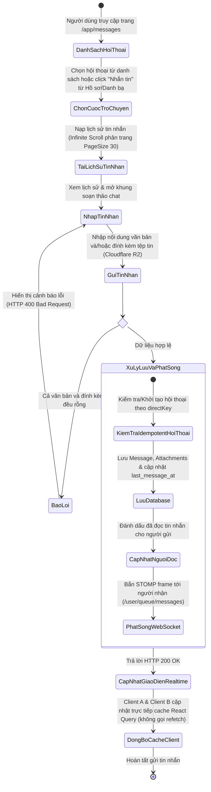
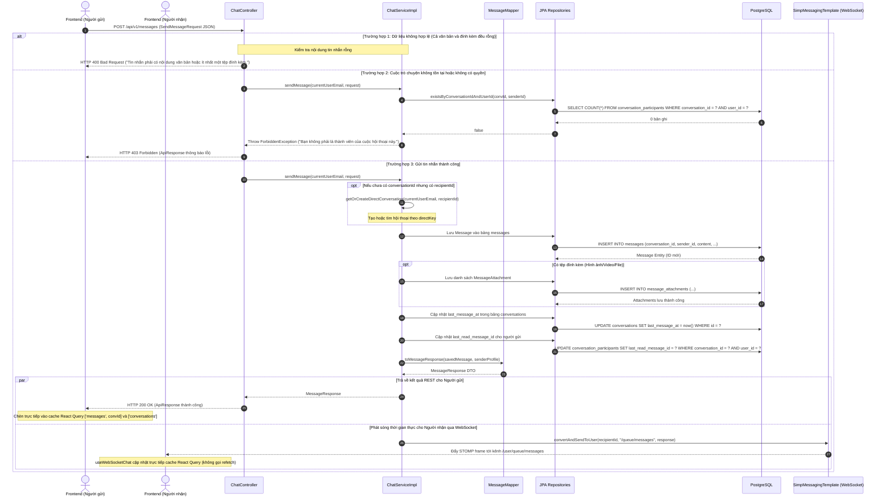
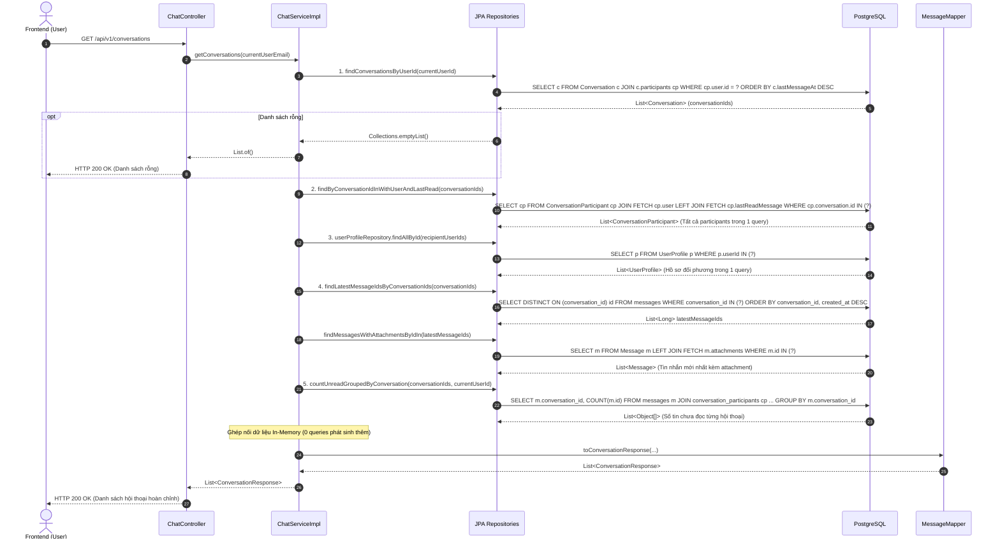
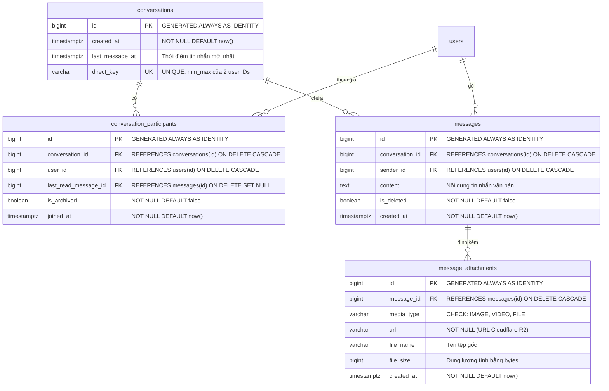

# ĐẶC TẢ YÊU CẦU & THIẾT KẾ CHI TIẾT: UC33 - NHẮN TIN TRỰC TIẾP 1-1 (DIRECT MESSAGING & WEBSOCKET)

## PHẦN 1: ĐẶC TẢ NGHIỆP VỤ (REPORT 3)

### 2.2.3 Business Workflow (Luồng nghiệp vụ)

#### Mô tả chi tiết luồng xử lý bằng chữ (Business Step Description):
* **Bước 1 - Khởi đầu**:
  * Người dùng đã đăng nhập hệ thống (vai trò `STUDENT` hoặc `ALUMNI` ở trạng thái tài khoản `ACTIVE`) truy cập vào mục "Tin nhắn" (`/app/messages`) hoặc bấm nút "Nhắn tin" từ Thẻ hồ sơ thành viên / Danh bạ cựu sinh viên (`/app/messages?userId={targetUserId}`).
  * Hệ thống tự động khởi tạo kết nối WebSocket STOMP tới endpoint `/ws`. Bộ lọc bảo mật `WebSocketAuthChannelInterceptor` chặn frame STOMP `CONNECT`, trích xuất JWT Bearer token từ header `Authorization`, xác thực thông tin tài khoản và thiết lập đối tượng xác thực với danh tính `Principal = user.getId().toString()`. Nếu token không hợp lệ hoặc hết hạn, kết nối bị từ chối bằng `MessageDeliveryException`.
* **Bước 2 - Các bước chuyển tiếp**:
  * **Nạp danh sách cuộc trò chuyện**: Hệ thống gọi `GET /api/v1/conversations`. Để giải quyết triệt để vấn đề hiệu năng N+1 queries, backend thực hiện 5 câu truy vấn gom nhóm (Batch Queries) đồng thời:
    1. Lấy danh sách cuộc trò chuyện người dùng tham gia (`findConversationsByUserId`).
    2. Nạp toàn bộ thành viên (`ConversationParticipant`) kèm thông tin `User` và `lastReadMessage` trong 1 truy vấn `JOIN FETCH`.
    3. Nạp hồ sơ (`UserProfile`) của toàn bộ đối phương (recipients) trong 1 truy vấn `findAllById`.
    4. Nạp tin nhắn mới nhất của toàn bộ cuộc trò chuyện bằng truy vấn tối ưu PostgreSQL `DISTINCT ON (conversation_id)`.
    5. Đếm số lượng tin nhắn chưa đọc của từng cuộc trò chuyện bằng truy vấn gom nhóm native SQL `GROUP BY conversation_id`.
    Toàn bộ dữ liệu được ghép nối (in-memory mapping) trong bộ nhớ và trả về tức thì cho Client.
  * **Mở / Khởi tạo cuộc hội thoại 1-1 an toàn (Idempotent)**:
    * Nếu mở cuộc trò chuyện từ danh bạ/hồ sơ (`targetUserId`), hệ thống gọi `POST /api/v1/conversations/direct/{targetUserId}`.
    * Hệ thống tính toán khóa duy nhất `directKey = Math.min(u1, u2) + "_" + Math.max(u1, u2)` và kiểm tra trong bảng `conversations`. Khóa `direct_key` được bảo vệ bởi ràng buộc `UNIQUE (direct_key)` trong cơ sở dữ liệu PostgreSQL. Nếu phát sinh tranh chấp đồng thời (race condition khi cả 2 cùng bấm nhắn tin), ngoại lệ duplicate key được xử lý tự động và trả về đúng bản ghi cuộc hội thoại đã được tạo trước đó.
  * **Tải lịch sử tin nhắn (Infinite Scroll)**:
    * Client nạp tin nhắn qua hook `useMessages` gọi `GET /api/v1/conversations/{conversationId}/messages?page={page}&size=30`.
    * Hệ thống kiểm tra quyền thành viên (`existsByConversationIdAndUserId`).
    * Dữ liệu tin nhắn được sắp xếp giảm dần theo thời gian tạo (`createdAt DESC`). Khi người dùng cuộn lên trên đỉnh khung chat, hệ thống tự động tải thêm trang tiếp theo và neo giữ vị trí cuộn mượt mà (scroll anchoring) không gây giật màn hình.
  * **Soạn thảo và Gửi tin nhắn**:
    * Người dùng nhập nội dung văn bản (tối đa 5000 ký tự) và/hoặc tải tệp tin đa phương tiện (ảnh, video, tài liệu) lên Cloudflare R2 qua Presigned URL rồi bấm "Gửi".
    * Hệ thống kiểm tra: Nếu cả văn bản và danh sách đính kèm đều rỗng, từ chối yêu cầu và trả về lỗi HTTP 400 Bad Request (`MSG-CHAT-04`).
* **Bước 3 - Kết thúc**:
  * Hệ thống lưu bản ghi `Message` và các bản ghi `MessageAttachment` vào cơ sở dữ liệu PostgreSQL trong cùng một Transaction an toàn.
  * Cập nhật thời điểm `last_message_at` của cuộc hội thoại để tự động đưa hội thoại lên đầu danh sách.
  * Bản ghi `ConversationParticipant` của người gửi tự động cập nhật `last_read_message_id = savedMessage.id`.
  * Trả về HTTP 200 OK kèm `MessageResponse` cho người gửi. Hook `useSendMessage` lập tức chèn tin nhắn vào trang đầu của cache React Query `['messages', conversationId]` và cập nhật `lastMessage` của `['conversations']`.
  * Đồng thời, backend gọi `SimpMessagingTemplate.convertAndSendToUser` đẩy tin nhắn theo thời gian thực tới kênh cá nhân `/user/queue/messages` của người nhận.
  * Client của người nhận nhận được frame STOMP, hook `useWebSocketChat` tự động cập nhật trực tiếp cache React Query `['messages', conversationId]` và tăng `unreadCount` trong danh sách `['conversations']` **mà không cần gọi lại HTTP REST API**, đảm bảo độ trễ gần như bằng 0 và không tốn băng thông máy chủ.
  * Nếu người nhận đang mở cửa sổ chat của cuộc trò chuyện đó, hook `useMarkAsRead` tự động gọi `POST /api/v1/conversations/{id}/read` để cập nhật trạng thái đã đọc.

---

### 3.2 Module Tin Nhắn & Tương Tác (3.2 Messaging Module)
Module Tin nhắn cung cấp khả năng kết nối, giao lưu và trao đổi thông tin trực tiếp giữa các thế hệ sinh viên và cựu sinh viên FPT University.

#### 3.2.1 Nhắn tin trực tiếp 1-1 (Direct Messaging)

**Function trigger**:
* **Navigation path**: Thanh điều hướng chính -> icon "Tin nhắn" (`/app/messages`), hoặc từ Hồ sơ cá nhân / Danh bạ cựu sinh viên click nút "Nhắn tin" (`/app/messages?userId={targetUserId}`).
* **Timing Frequency**: On demand (bất cứ khi nào người dùng muốn trò chuyện hoặc có tin nhắn mới đẩy về qua socket).

**Function description**:
* **Actors/Roles**: `STUDENT`, `ALUMNI` (đã đăng nhập và tài khoản ở trạng thái `ACTIVE`).
* **Purpose**: Cho phép thành viên trao đổi tin nhắn văn bản, gửi ảnh, video, tài liệu công việc/học tập theo thời gian thực (realtime) với độ trễ dưới 50ms.
* **Interface**:
  * **Cột trái (ConversationList)**: Ô tìm kiếm cuộc trò chuyện, danh sách đối phương kèm Avatar, tên, chuyên ngành, tin nhắn mới nhất, thời gian và huy hiệu số tin chưa đọc (Unread badge).
  * **Cột phải (ChatWindow)**: Header đối phương kèm chấm trạng thái hoạt động, khung cuộn lịch sử tin nhắn hỗ trợ Infinite Scroll (tin nhắn người gửi màu tím lavender `#7f86ee` bên phải, tin nhắn đối phương màu trắng bên trái), thanh soạn thảo kèm nút đính kèm tệp tin và nút Gửi.

**Data processing**:
* Trích xuất email người dùng từ JWT SecurityContext.
* Tìm kiếm hoặc khởi tạo `conversation` 1-1 dựa trên `directKey` (bảo vệ bằng Unique Constraint).
* Lưu `Message` và danh sách `MessageAttachment` vào PostgreSQL trong một transaction duy nhất.
* Cập nhật `last_message_at` của cuộc hội thoại và `last_read_message_id` cho người gửi.
* Đẩy tin nhắn qua Spring `SimpMessagingTemplate.convertAndSendToUser(recipientId, WebSocketDestinations.USER_QUEUE_MESSAGES, response)`.
* Client nhận STOMP frame và cập nhật trực tiếp cache React Query in-memory.

**Screen layout**:
* `Figure 33.1`: Giao diện hộp thư tin nhắn AlumNect trên nền canvas kem ấm (`#faf4ec`), khung thẻ kính mờ Pastel Premium (`bg-white/70 backdrop-blur-xl`).

**Function details**:
* **Data**: `conversationId`, `recipientId`, `content`, `attachments` (`mediaType`, `url`, `fileName`, `fileSize`).
* **Validation**:
  * Nội dung tin nhắn không được vượt quá 5000 ký tự.
  * Không cho phép gửi tin nhắn rỗng (bắt buộc có văn bản hoặc ít nhất 1 tệp đính kèm).
  * Không cho phép tự tạo cuộc trò chuyện với chính mình (`targetUserId != currentUserId`).
  * Người gửi phải là thành viên hợp lệ của cuộc trò chuyện.
  * Kích thước phân trang lịch sử tin nhắn tối đa 50 tin nhắn mỗi trang (`MAX_PAGE_SIZE = 50`).
* **Business rules**:
  * BR-33.1: Chỉ tài khoản đã xác thực và kích hoạt mới được phép sử dụng tính năng nhắn tin.
  * BR-33.2: Cuộc trò chuyện trực tiếp 1-1 giữa 2 thành viên là duy nhất và chống trùng lặp ở tầng CSDL thông qua cột `direct_key` và ràng buộc `uq_conversations_direct_key`.
  * BR-33.3: Tin nhắn gửi đi phải chứa ít nhất nội dung văn bản (không rỗng) hoặc ít nhất 1 tệp đính kèm hợp lệ.
  * BR-33.4: Khi gửi tin nhắn mới, thời gian `last_message_at` của cuộc hội thoại được cập nhật để đưa hội thoại lên đầu danh sách.
  * BR-33.5: Người gửi tự động được đánh dấu đã đọc tin nhắn vừa gửi; người nhận tự động đánh dấu đã đọc khi xem cửa sổ chat.
  * BR-33.6: Mọi kết nối WebSocket phải mang theo token JWT hợp lệ trong header STOMP CONNECT.
* **Error Handling**:
  * 400 Bad Request: Nội dung rỗng, tự chat với chính mình, thiếu thông tin hội thoại hoặc người nhận.
  * 403 Forbidden: Truy cập hoặc gửi tin nhắn vào cuộc hội thoại không thuộc quyền sở hữu của mình.
  * 404 Not Found: Không tìm thấy người dùng hoặc cuộc hội thoại tương ứng.
* **Normal case**: Tin nhắn được lưu thành công vào CSDL, trả về HTTP 200 OK cho người gửi, người nhận nhận được frame STOMP qua WebSocket thời gian thực < 50ms.
* **Abnormal case**: Kết nối mạng gián đoạn, token JWT hết hạn (hệ thống ngắt kết nối socket và thông báo lỗi).

---

### 5. Requirement Appendix (Phụ lục Yêu cầu)

#### 5.1 Business Rules (Quy tắc Nghiệp vụ)

| ID | Định nghĩa Quy tắc (Rule Definition) |
| :--- | :--- |
| BR-33.1 | Chỉ tài khoản có vai trò `STUDENT` hoặc `ALUMNI` đã xác thực email và ở trạng thái `ACTIVE` mới được phép truy cập và gửi tin nhắn. |
| BR-33.2 | Mỗi cặp 2 người dùng chỉ tồn tại duy nhất 1 cuộc trò chuyện trực tiếp 1-1. Khóa `direct_key` dạng `min(u1,u2)_max(u1,u2)` cùng ràng buộc UNIQUE trong PostgreSQL đảm bảo tính Idempotent và chống race condition. |
| BR-33.3 | Tin nhắn gửi đi phải chứa ít nhất nội dung văn bản (không rỗng, tối đa 5000 ký tự) hoặc ít nhất 1 tệp đính kèm hợp lệ. |
| BR-33.4 | Người dùng chỉ có quyền xem lịch sử tin nhắn của những cuộc hội thoại mà mình là thành viên (`conversation_participants`). |
| BR-33.5 | Toàn bộ tệp tin đa phương tiện được lưu trữ an toàn trên Cloudflare R2 thông qua presigned upload URL trước khi gửi tin nhắn. |
| BR-33.6 | Danh sách cuộc trò chuyện phải được nạp bằng cơ chế Batch Queries gom nhóm để loại bỏ hoàn toàn vấn đề hiệu năng N+1 queries. |
| BR-33.7 | Lịch sử tin nhắn được tải phân trang dạng Infinite Scroll (kích thước mặc định phía client là 30 tin, server tối đa 50 tin mỗi lần tải). |
| BR-33.8 | Mọi kết nối WebSocket tới `/ws` bắt buộc phải truyền JWT token qua header STOMP `Authorization` hoặc `token` để xác thực Principal. |

#### 5.2 Common Requirements (Yêu cầu Chung)
* Hỗ trợ định dạng hình ảnh (PNG, JPG, JPEG, WEBP), định dạng video (MP4, WEBM) và các tài liệu tệp tin văn phòng (PDF, DOCX, XLSX).
* Giao diện chat hỗ trợ Infinite Scroll cuộn ngược mượt mà kèm neo giữ vị trí cuộn (Scroll Anchoring).
* Đồng bộ cache React Query trực tiếp phía Client khi nhận gói tin WebSocket STOMP mà không cần gọi lại HTTP REST API.
* Kết nối WebSocket được mã hóa an toàn qua WSS/TLS và bảo vệ bằng token JWT trong khung `CONNECT`.

#### 5.3 Application Messages List (Danh sách Thông điệp Ứng dụng)

| # | Mã thông điệp | Loại thông điệp | Ngữ cảnh | Nội dung hiển thị |
| :--- | :--- | :--- | :--- | :--- |
| 1 | MSG-CHAT-01 | Inline / Alert | Không tìm thấy cuộc hội thoại | "Không tìm thấy cuộc hội thoại với mã: {conversationId}" |
| 2 | MSG-CHAT-02 | Inline / Alert | Không tìm thấy người dùng đối phương | "Không tìm thấy người dùng với mã: {targetUserId}" |
| 3 | MSG-CHAT-03 | Inline / Alert | Tự gửi tin nhắn cho chính mình | "Bạn không thể tạo cuộc trò chuyện với chính mình." |
| 4 | MSG-CHAT-04 | Inline / Alert | Gửi tin nhắn rỗng | "Tin nhắn phải có nội dung văn bản hoặc ít nhất một tệp đính kèm." |
| 5 | MSG-CHAT-05 | Inline / Alert | Không có quyền truy cập hội thoại | "Bạn không có quyền xem tin nhắn trong cuộc hội thoại này." |
| 6 | MSG-CHAT-06 | Inline / Alert | Không phải thành viên gửi tin | "Bạn không phải là thành viên của cuộc hội thoại này." |
| 7 | MSG-CHAT-07 | Inline / Alert | Thiếu thông tin cuộc trò chuyện | "Vui lòng cung cấp mã cuộc hội thoại hoặc mã người nhận." |
| 8 | MSG-CHAT-08 | Toast / Status | Gửi tin nhắn thành công | "Gửi tin nhắn thành công." |
| 9 | MSG-CHAT-09 | Toast / Status | Mở cuộc hội thoại thành công | "Mở cuộc hội thoại thành công." |
| 10 | MSG-CHAT-10 | Toast / Status | Lấy danh sách hội thoại thành công | "Lấy danh sách hội thoại thành công." |
| 11 | MSG-CHAT-11 | Toast / Status | Lấy lịch sử tin nhắn thành công | "Lấy lịch sử tin nhắn thành công." |
| 12 | MSG-CHAT-12 | Toast / Status | Đánh dấu đã đọc thành công | "Đã đánh dấu đã đọc." |
| 13 | MSG-CHAT-13 | Socket / Error | Thiếu header JWT khi bắt tay socket | "Yêu cầu mã xác thực JWT trong kết nối WebSocket" |
| 14 | MSG-CHAT-14 | Socket / Error | Token JWT socket không hợp lệ hoặc hết hạn | "Mã xác thực JWT không hợp lệ hoặc đã hết hạn" |

---

## PHẦN 2: THIẾT KẾ CHI TIẾT (REPORT 4)

### 3. Detail Design (Thiết kế chi tiết)

#### 3.1 Nhắn tin trực tiếp 1-1 (Direct Messaging)

##### 3.1.1 Class Diagram (Sơ đồ Lớp)

```mermaid
classDiagram
    %% Controller
    class ChatController {
        -ChatService chatService
        -int MAX_PAGE_SIZE = 50
        +getConversations() ResponseEntity~ApiResponse~List~ConversationResponse~~~
        +getOrCreateDirectConversation(Long targetUserId) ResponseEntity~ApiResponse~ConversationResponse~~
        +getMessages(Long conversationId, int page, int size) ResponseEntity~ApiResponse~PageResponse~MessageResponse~~~
        +sendMessage(SendMessageRequest request) ResponseEntity~ApiResponse~MessageResponse~~
        +markAsRead(Long conversationId) ResponseEntity~ApiResponse~Void~~
    }

    %% Service
    class ChatService {
        <<interface>>
        +getConversations(String currentUserEmail) List~ConversationResponse~
        +getOrCreateDirectConversation(String currentUserEmail, Long targetUserId) ConversationResponse
        +getMessages(String currentUserEmail, Long conversationId, Pageable pageable) PageResponse~MessageResponse~
        +sendMessage(String currentUserEmail, SendMessageRequest request) MessageResponse
        +markAsRead(String currentUserEmail, Long conversationId) void
    }

    class ChatServiceImpl {
        -ConversationRepository conversationRepository
        -ConversationParticipantRepository conversationParticipantRepository
        -MessageRepository messageRepository
        -MessageAttachmentRepository messageAttachmentRepository
        -UserRepository userRepository
        -UserProfileRepository userProfileRepository
        -MessageMapper messageMapper
        -SimpMessagingTemplate messagingTemplate
        +getConversations(String currentUserEmail) List~ConversationResponse~
        +getOrCreateDirectConversation(String currentUserEmail, Long targetUserId) ConversationResponse
        +getMessages(String currentUserEmail, Long conversationId, Pageable pageable) PageResponse~MessageResponse~
        +sendMessage(String currentUserEmail, SendMessageRequest request) MessageResponse
        +markAsRead(String currentUserEmail, Long conversationId) void
    }

    %% Mapper
    class MessageMapper {
        +toAttachmentResponse(MessageAttachment attachment) MessageAttachmentResponse
        +toMessageResponse(Message message, UserProfile senderProfile) MessageResponse
        +toConversationResponse(Conversation conversation, User recipient, UserProfile recipientProfile, String lastMessageSnippet, long unreadCount) ConversationResponse
    }

    %% Repositories
    class ConversationRepository {
        <<interface>>
        +findByDirectKey(String directKey) Optional~Conversation~
        +findDirectConversationBetween(Long user1Id, Long user2Id) Optional~Conversation~
        +findConversationsByUserId(Long userId) List~Conversation~
    }
    class ConversationParticipantRepository {
        <<interface>>
        +findByConversationIdAndUserId(Long conversationId, Long userId) Optional~ConversationParticipant~
        +findByConversationId(Long conversationId) List~ConversationParticipant~
        +findByConversationIdInWithUserAndLastRead(List~Long~ conversationIds) List~ConversationParticipant~
        +existsByConversationIdAndUserId(Long conversationId, Long userId) boolean
    }
    class MessageRepository {
        <<interface>>
        +findByConversationIdOrderByCreatedAtDesc(Long conversationId, Pageable pageable) Page~Message~
        +findTopByConversationIdOrderByCreatedAtDesc(Long conversationId) Optional~Message~
        +findLatestMessageIdsByConversationIds(List~Long~ conversationIds) List~Long~
        +findMessagesWithAttachmentsByIdIn(List~Long~ messageIds) List~Message~
        +countUnreadGroupedByConversation(List~Long~ conversationIds, Long currentUserId) List~Object[]~
    }
    class MessageAttachmentRepository {
        <<interface>>
        +findByMessageId(Long messageId) List~MessageAttachment~
    }

    %% Entities
    class Conversation {
        -Long id
        -Instant createdAt
        -Instant lastMessageAt
        -String directKey
        -List~ConversationParticipant~ participants
    }
    class ConversationParticipant {
        -Long id
        -Conversation conversation
        -User user
        -Message lastReadMessage
        -boolean isArchived
        -Instant joinedAt
    }
    class Message {
        -Long id
        -Conversation conversation
        -User sender
        -String content
        -boolean isDeleted
        -Instant createdAt
        -List~MessageAttachment~ attachments
    }
    class MessageAttachment {
        -Long id
        -Message message
        -MediaType mediaType
        -String url
        -String fileName
        -Long fileSize
        -Instant createdAt
    }

    %% DTOs
    class SendMessageRequest {
        -Long conversationId
        -Long recipientId
        -String content
        -List~AttachmentRequest~ attachments
    }
    class AttachmentRequest {
        -MediaType mediaType
        -String url
        -String fileName
        -Long fileSize
    }
    class MessageResponse {
        -Long id
        -Long conversationId
        -Long senderId
        -String senderName
        -String senderAvatar
        -String content
        -boolean isDeleted
        -Instant createdAt
        -List~MessageAttachmentResponse~ attachments
    }
    class MessageAttachmentResponse {
        -Long id
        -MediaType mediaType
        -String url
        -String fileName
        -Long fileSize
        -Instant createdAt
    }
    class ConversationResponse {
        -Long id
        -Instant createdAt
        -Instant lastMessageAt
        -Long recipientId
        -String recipientName
        -String recipientAvatar
        -String recipientMajor
        -String lastMessage
        -long unreadCount
    }

    %% WebSocket Configuration & Constants
    class WebSocketDestinations {
        <<utility>>
        +String WS_ENDPOINT = "/ws"
        +String APP_PREFIX = "/app"
        +String USER_PREFIX = "/user"
        +String QUEUE_PREFIX = "/queue"
        +String USER_QUEUE_MESSAGES = "/queue/messages"
    }
    class WebSocketAuthChannelInterceptor {
        -JwtService jwtService
        -UserDetailServiceImpl userDetailsService
        -UserRepository userRepository
        +preSend(Message message, MessageChannel channel) Message
    }

    %% Relationships
    ChatController ..> SendMessageRequest : receives
    ChatController ..> ChatService : calls
    ChatServiceImpl ..|> ChatService : implements
    ChatServiceImpl --> ConversationRepository : uses
    ChatServiceImpl --> ConversationParticipantRepository : uses
    ChatServiceImpl --> MessageRepository : uses
    ChatServiceImpl --> MessageAttachmentRepository : uses
    ChatServiceImpl --> MessageMapper : uses
    ChatServiceImpl --> WebSocketDestinations : references
    Conversation "1" *-- "*" ConversationParticipant : has
    Conversation "1" *-- "*" Message : contains
    Message "1" *-- "*" MessageAttachment : has
    ConversationParticipant --> Message : references lastReadMessage
```

###### Mô tả chi tiết cấu trúc các lớp (Class Design Description):
* **Lớp `ChatController`**: Tiếp nhận các yêu cầu HTTP REST từ phía Client, thực hiện kiểm tra quyền truy cập thông qua JWT token, kiểm soát giới hạn phân trang `MAX_PAGE_SIZE = 50`, gọi `ChatService` và trả về đối tượng `ResponseEntity<ApiResponse<T>>`.
* **Các lớp DTO**: 
  * `SendMessageRequest`: Chứa dữ liệu gửi tin nhắn gồm `conversationId` hoặc `recipientId`, `content` (tối đa 5000 ký tự) và danh sách `AttachmentRequest`.
  * `MessageResponse`: Chứa thông tin chi tiết một tin nhắn phẳng kèm thông tin hiển thị người gửi (`senderName`, `senderAvatar`) và danh sách `MessageAttachmentResponse`.
  * `ConversationResponse`: Chứa thông tin tóm tắt cuộc hội thoại kèm thông tin đối phương (`recipientName`, `recipientAvatar`, `recipientMajor`), tin nhắn mới nhất (`lastMessage`) và số tin chưa đọc (`unreadCount`).
* **Lớp `ChatService` & `ChatServiceImpl`**: 
  * Thực thi toàn bộ nghiệp vụ kiểm tra logic hội thoại 1-1, kiểm tra quyền thành viên.
  * Tối ưu hóa truy vấn batch fetching 5 queries cho `getConversations` loại bỏ hoàn toàn N+1 queries.
  * Quản lý tạo hội thoại an toàn theo `directKey` chống race condition.
  * Sử dụng `SimpMessagingTemplate` để đẩy tin nhắn qua WebSocket STOMP tới kênh `/user/queue/messages`.
* **Lớp `MessageMapper`**: Chuyển đổi dữ liệu Entity sang DTO kèm thông tin hiển thị của người dùng từ `UserProfile`.
* **Các Repository**:
  * `ConversationRepository`: Hỗ trợ truy vấn theo `directKey` và tìm kiếm hội thoại 2 thành viên chính xác.
  * `ConversationParticipantRepository`: Hỗ trợ truy vấn batch `findByConversationIdInWithUserAndLastRead` với `JOIN FETCH`.
  * `MessageRepository`: Tối ưu hóa bằng PostgreSQL `DISTINCT ON` lấy tin nhắn mới nhất (`findLatestMessageIdsByConversationIds`) và `GROUP BY` đếm số tin chưa đọc (`countUnreadGroupedByConversation`).
* **Hạ tầng WebSocket**:
  * `WebSocketDestinations`: Lưu trữ tập trung các định danh kênh `/ws`, `/user`, `/queue/messages`.
  * `WebSocketAuthChannelInterceptor`: Đánh chặn frame STOMP `CONNECT`, xác thực JWT token và gán User ID làm Principal.

---

##### 3.1.2 Sequence Diagram (Sơ đồ Tuần tự Hợp nhất)

###### Sơ đồ 1: Luồng Gửi tin nhắn và Phát sóng Realtime qua WebSocket STOMP (SendMessage Flow)

###### Sơ đồ 2: Luồng Nạp danh sách cuộc hội thoại tối ưu Batch Queries (GetConversations Flow)

###### Mô tả chi tiết luồng xử lý bằng chữ (Sequence Flow Description):
1. **Luồng Gửi tin nhắn thành công (Normal Case)**:
   * Client A gửi request `POST /api/v1/messages` kèm token JWT và body `SendMessageRequest`.
   * Controller tiếp nhận, xác thực token và chuyển tiếp tới `ChatServiceImpl`.
   * Nếu gửi theo `recipientId`, Service gọi `getOrCreateDirectConversation` để tìm hoặc tạo mới hội thoại dựa trên `directKey` (bảo vệ chống trùng lặp bằng unique constraint).
   * Service lưu `Message` và các `MessageAttachment` vào CSDL trong một Transaction duy nhất.
   * Cập nhật thời điểm `last_message_at` của cuộc hội thoại và cập nhật `last_read_message_id` cho người gửi.
   * `MessageMapper` chuyển đổi kết quả thành `MessageResponse`.
   * Trả về HTTP 200 OK cho Client A. Client A lập tức cập nhật trực tiếp cache React Query `['messages', convId]` và `['conversations']` để hiển thị bong bóng chat bên phải.
   * Đồng thời, backend gọi `SimpMessagingTemplate.convertAndSendToUser` đẩy tin nhắn tới kênh `/user/queue/messages` của Client B. Trình duyệt Client B nhận STOMP frame và cập nhật trực tiếp cache React Query mà không cần tải lại trang hay gọi lại HTTP GET.
2. **Luồng Ngoại lệ Dữ liệu không hợp lệ (Validation Error Case)**:
   * Nếu Client gửi tin nhắn rỗng cả nội dung văn bản và đính kèm, hệ thống ném `BadRequestException`. `GlobalExceptionHandler` bắt và trả về HTTP 400 Bad Request kèm thông báo lỗi `MSG-CHAT-04`.
3. **Luồng Ngoại lệ Không có quyền (Forbidden Case)**:
   * Nếu người gửi truyền `conversationId` của cuộc trò chuyện mà mình không phải là thành viên, hệ thống phát hiện qua `existsByConversationIdAndUserId` và ném `ForbiddenException`. Client nhận mã HTTP 403 Forbidden.
4. **Luồng Nạp danh sách hội thoại tối ưu (Performance Batch Case)**:
   * Thay vì thực hiện hàng trăm truy vấn N+1 khi duyệt từng cuộc hội thoại, hệ thống thực thi chính xác 5 câu truy vấn gom nhóm: lấy hội thoại -> lấy participants -> lấy profiles -> lấy tin nhắn mới nhất (`DISTINCT ON`) -> đếm tin chưa đọc (`GROUP BY`). Sau đó thực hiện map in-memory, giảm tải tối đa cho CSDL PostgreSQL.

---

##### 3.1.3 Thiết kế Cơ sở Dữ liệu & Ràng buộc (Database Schema Design)

Cơ sở dữ liệu hỗ trợ tính năng Nhắn tin trực tiếp 1-1 gồm 4 bảng trong PostgreSQL, tuân thủ các migration `V8__create_chat_and_messaging_tables.sql` và `V9__add_direct_key_to_conversations.sql`:

###### Chi tiết các bảng và ràng buộc:
1. **Bảng `conversations`**:
   * `id`: Khóa chính (BIGINT, tự tăng).
   * `created_at`: Thời điểm khởi tạo cuộc hội thoại (`TIMESTAMPTZ`, mặc định `now()`).
   * `last_message_at`: Thời điểm phát sinh tin nhắn mới nhất (`TIMESTAMPTZ`), phục vụ sắp xếp danh sách hội thoại.
   * `direct_key`: Khóa chuỗi định danh duy nhất hội thoại 1-1 (VARCHAR(100), dạng `{minUserId}_{maxUserId}`).
   * Ràng buộc: `uq_conversations_direct_key UNIQUE (direct_key)`.
   * Chỉ mục: `idx_conversations_direct_key ON conversations (direct_key)`.
2. **Bảng `conversation_participants`**:
   * `id`: Khóa chính (BIGINT, tự tăng).
   * `conversation_id`: Khóa ngoại liên kết tới `conversations(id)` (`ON DELETE CASCADE`).
   * `user_id`: Khóa ngoại liên kết tới `users(id)` (`ON DELETE CASCADE`).
   * `last_read_message_id`: Khóa ngoại liên kết tới `messages(id)` (`ON DELETE SET NULL`), lưu vết tin nhắn cuối cùng người dùng đã đọc.
   * `is_archived`: Cờ lưu trữ (BOOLEAN, mặc định `false`).
   * `joined_at`: Thời điểm tham gia (`TIMESTAMPTZ`, mặc định `now()`).
   * Ràng buộc: `uq_conversation_participants_conv_user UNIQUE (conversation_id, user_id)`.
   * Chỉ mục: `idx_conversation_participants_user_id`, `idx_conversation_participants_conv_id`.
3. **Bảng `messages`**:
   * `id`: Khóa chính (BIGINT, tự tăng).
   * `conversation_id`: Khóa ngoại liên kết tới `conversations(id)` (`ON DELETE CASCADE`).
   * `sender_id`: Khóa ngoại liên kết tới `users(id)` (`ON DELETE CASCADE`).
   * `content`: Nội dung văn bản (TEXT, cho phép null nếu có tệp đính kèm).
   * `is_deleted`: Cờ xóa mềm (BOOLEAN, mặc định `false`).
   * `created_at`: Thời điểm gửi tin nhắn (`TIMESTAMPTZ`, mặc định `now()`).
   * Chỉ mục: `idx_messages_conversation_created ON messages (conversation_id, created_at DESC)`, `idx_messages_sender_id ON messages (sender_id)`.
4. **Bảng `message_attachments`**:
   * `id`: Khóa chính (BIGINT, tự tăng).
   * `message_id`: Khóa ngoại liên kết tới `messages(id)` (`ON DELETE CASCADE`).
   * `media_type`: Loại tệp (VARCHAR(10)), bắt buộc thuộc tập giá trị `('IMAGE', 'VIDEO', 'FILE')` thông qua ràng buộc kiểm tra `ck_message_attachments_media_type`.
   * `url`: Đường dẫn công khai tới tệp lưu trữ trên Cloudflare R2 (VARCHAR(500), NOT NULL).
   * `file_name`: Tên gốc tệp tin (VARCHAR(255)).
   * `file_size`: Kích thước tệp tin tính theo bytes (BIGINT).
   * `created_at`: Thời điểm tải lên (`TIMESTAMPTZ`, mặc định `now()`).
   * Chỉ mục: `idx_message_attachments_message_id ON message_attachments (message_id)`.
