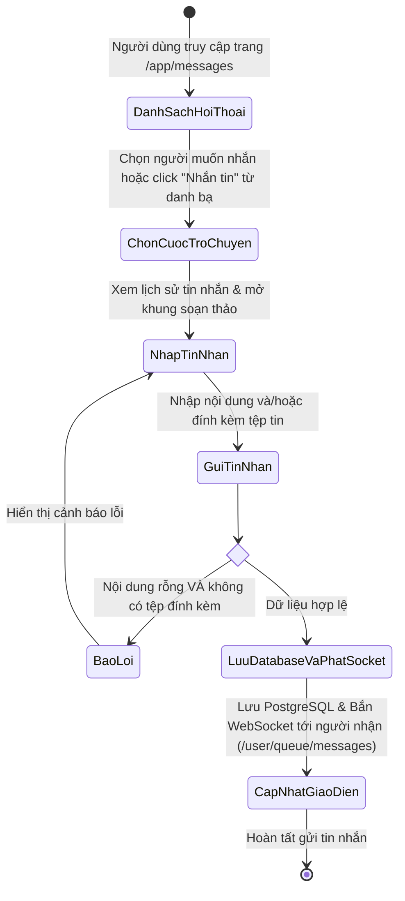
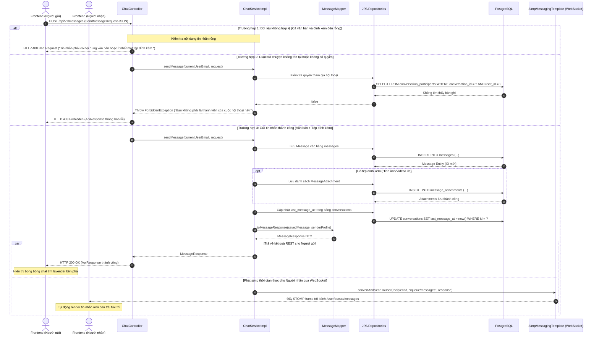

# ĐẶC TẢ YÊU CẦU & THIẾT KẾ CHI TIẾT: UC33 - NHẮN TIN TRỰC TIẾP 1-1 (DIRECT MESSAGING & WEBSOCKET)

## PHẦN 1: ĐẶC TẢ NGHIỆP VỤ (REPORT 3)

### 2.2.3 Business Workflow (Luồng nghiệp vụ)

#### Mô tả chi tiết luồng xử lý bằng chữ (Business Step Description):
* **Bước 1 - Khởi đầu**: Người dùng đã đăng nhập (vai trò `STUDENT` hoặc `ALUMNI`) truy cập vào mục "Tin nhắn" (`/app/messages`) hoặc bấm nút "Nhắn tin" từ Thẻ hồ sơ thành viên / Danh bạ cựu sinh viên (`/app/messages?userId={targetUserId}`). Hệ thống tự động thiết lập kết nối WebSocket tới endpoint `/ws` kèm JWT Bearer token để xác thực phiên.
* **Bước 2 - Các bước chuyển tiếp**:
  * Nếu chọn từ danh bạ: Hệ thống kiểm tra xem giữa hai người đã từng có cuộc hội thoại trực tiếp nào chưa. Nếu chưa có, hệ thống tạo bản ghi mới trong bảng `conversations` và thêm 2 bản ghi `conversation_participants`.
  * Hệ thống tải lịch sử tin nhắn của cuộc trò chuyện kèm các tệp đính kèm (ảnh, video, tài liệu) phân trang.
  * Người dùng nhập tin nhắn văn bản hoặc bấm nút đính kèm để tải file lên Cloudflare R2 qua Presigned URL rồi bấm "Gửi".
  * Hệ thống kiểm tra tính hợp lệ: Nếu cả văn bản và tệp đính kèm đều rỗng, từ chối và báo lỗi HTTP 400 Bad Request.
* **Bước 3 - Kết thúc**: Tin nhắn được lưu vào cơ sở dữ liệu `messages`, cập nhật `last_message_at` của hội thoại, và đồng thời được phát sóng tức thì tới người nhận qua kênh WebSocket cá nhân `/user/queue/messages`. Người nhận thấy tin nhắn hiển thị ngay trên màn hình mà không cần làm mới trang.

---

### 3.2 Module Tin Nhắn & Tương Tác (3.2 Messaging Module)
Module Tin nhắn cung cấp khả năng kết nối, giao lưu và trao đổi thông tin trực tiếp giữa các thế hệ sinh viên và cựu sinh viên FPT University.

#### 3.2.1 Nhắn tin trực tiếp 1-1 (Direct Messaging)

**Function trigger**:
* **Navigation path**: Thanh điều hướng chính -> icon "Tin nhắn" (`/app/messages`), hoặc từ Profile/Directory click nút "Nhắn tin" (`/app/messages?userId={id}`).
* **Timing Frequency**: On demand (bất cứ khi nào người dùng muốn trò chuyện hoặc có tin nhắn mới đẩy về qua socket).

**Function description**:
* **Actors/Roles**: `STUDENT`, `ALUMNI` (đã đăng nhập và tài khoản ở trạng thái `ACTIVE`).
* **Purpose**: Cho phép thành viên trao đổi tin nhắn văn bản, gửi ảnh, video, tài liệu công việc/học tập theo thời gian thực (realtime) mà không có độ trễ.
* **Interface**:
  * **Cột trái (ConversationList)**: Ô tìm kiếm cuộc trò chuyện, danh sách đối phương kèm Avatar, tên, chuyên ngành, tin nhắn mới nhất, huy hiệu số tin chưa đọc.
  * **Cột phải (ChatWindow)**: Header đối phương kèm chấm trạng thái hoạt động, khung cuộn lịch sử tin nhắn (tin nhắn người gửi màu tím lavender `#7f86ee`, tin nhắn đối phương màu trắng), ô nhập tin nhắn kèm nút đính kèm file và nút Gửi.

**Data processing**:
* Trích xuất email người dùng từ JWT SecurityContext.
* Tạo mới hoặc tìm lại `conversation_id` giữa 2 người dùng.
* Lưu `Message` và danh sách `MessageAttachment` vào PostgreSQL trong một transaction duy nhất.
* Đẩy tin nhắn qua Spring `SimpMessagingTemplate.convertAndSendToUser(recipientId, "/queue/messages", messageResponse)`.

**Screen layout**:
* `Figure 33.1`: Giao diện hộp thư tin nhắn AlumNect trên nền canvas kem ấm (`#faf4ec`), khung thẻ kính mờ Pastel Premium (`bg-white/70 backdrop-blur-xl`).

**Function details**:
* **Data**: `conversationId`, `recipientId`, `content`, `attachments` (`mediaType`, `url`, `fileName`, `fileSize`).
* **Validation**:
  * Nội dung tin nhắn không được vượt quá 5000 ký tự.
  * Không cho phép gửi tin nhắn rỗng (bắt buộc có văn bản hoặc ít nhất 1 tệp đính kèm).
  * Không cho phép tự tạo cuộc trò chuyện với chính mình (`targetUserId != currentUserId`).
  * Người gửi phải là thành viên hợp lệ của cuộc trò chuyện.
* **Business rules**:
  * BR-33.1: Chỉ tài khoản đã xác thực và kích hoạt mới được phép sử dụng tính năng nhắn tin.
  * BR-33.2: Cuộc trò chuyện trực tiếp 1-1 giữa 2 thành viên là duy nhất (không tạo trùng lặp nhiều hội thoại giữa cùng 2 người).
  * BR-33.3: Khi gửi tin nhắn mới, thời gian `last_message_at` của cuộc hội thoại được cập nhật để đưa hội thoại lên đầu danh sách.
* **Error Handling**:
  * 400 Bad Request: Nội dung rỗng, tự chat với chính mình, định dạng không hợp lệ.
  * 403 Forbidden: Truy cập hoặc gửi tin nhắn vào cuộc hội thoại không thuộc quyền sở hữu.
  * 404 Not Found: Không tìm thấy người dùng hoặc cuộc hội thoại tương ứng.
* **Normal case**: Tin nhắn được lưu thành công, trả về HTTP 200 OK, người nhận nhận được qua WebSocket < 50ms.
* **Abnormal case**: Lỗi mất kết nối mạng hoặc lỗi server được hiển thị qua thông báo cảnh báo inline/toast.

---

### 5. Requirement Appendix (Phụ lục Yêu cầu)

#### 5.1 Business Rules (Quy tắc Nghiệp vụ)

| ID | Định nghĩa Quy tắc (Rule Definition) |
| :--- | :--- |
| BR-33.1 | Chỉ tài khoản có vai trò `STUDENT` hoặc `ALUMNI` đã xác thực email và kích hoạt trạng thái `ACTIVE` mới được phép truy cập và gửi tin nhắn. |
| BR-33.2 | Mỗi cặp 2 người dùng chỉ tồn tại duy nhất 1 cuộc trò chuyện trực tiếp 1-1 (Idempotent Conversation Creation). |
| BR-33.3 | Tin nhắn gửi đi phải chứa ít nhất nội dung văn bản (không rỗng) hoặc ít nhất 1 tệp đính kèm hợp lệ. |
| BR-33.4 | Người dùng chỉ có quyền xem lịch sử tin nhắn của những cuộc hội thoại mà mình là thành viên (`conversation_participants`). |
| BR-33.5 | Toàn bộ tệp tin đa phương tiện được lưu trữ bảo mật trên Cloudflare R2 thông qua presigned upload URL trước khi gửi tin nhắn. |

#### 5.2 Common Requirements (Yêu cầu Chung)
* Hỗ trợ định dạng ảnh (PNG, JPG, JPEG, WEBP), định dạng video (MP4, WEBM) và các tài liệu tệp tin khác.
* Danh sách tin nhắn tải có phân trang (Page size mặc định 20, tối đa 50 tin nhắn mỗi lần tải).
* Kết nối WebSocket được mã hóa an toàn qua WSS/TLS và bảo vệ bằng token JWT trong khung `CONNECT`.

#### 5.3 Application Messages List (Danh sách Thông điệp Ứng dụng)

| # | Mã thông điệp | Loại thông điệp | Ngữ cảnh | Nội dung hiển thị |
| :--- | :--- | :--- | :--- | :--- |
| 1 | MSG-CHAT-01 | Inline / Alert | Không tìm thấy cuộc hội thoại | "Không tìm thấy cuộc hội thoại với mã đã cung cấp." |
| 2 | MSG-CHAT-02 | Inline / Alert | Không tìm thấy người dùng đối phương | "Không tìm thấy người dùng với mã chỉ định." |
| 3 | MSG-CHAT-03 | Inline / Alert | Tự gửi tin nhắn cho chính mình | "Bạn không thể tạo cuộc trò chuyện với chính mình." |
| 4 | MSG-CHAT-04 | Inline / Alert | Gửi tin nhắn rỗng | "Tin nhắn phải có nội dung văn bản hoặc ít nhất một tệp đính kèm." |
| 5 | MSG-CHAT-05 | Inline / Alert | Không có quyền truy cập hội thoại | "Bạn không có quyền xem tin nhắn trong cuộc hội thoại này." |
| 6 | MSG-CHAT-06 | Inline / Alert | Không phải thành viên gửi tin | "Bạn không phải là thành viên của cuộc hội thoại này." |
| 7 | MSG-CHAT-07 | Inline / Alert | Thiếu thông tin cuộc trò chuyện | "Vui lòng cung cấp mã cuộc hội thoại hoặc mã người nhận." |
| 8 | MSG-CHAT-08 | Toast / Status | Gửi tin nhắn thành công | "Gửi tin nhắn thành công." |
| 9 | MSG-CHAT-09 | Toast / Status | Mở cuộc hội thoại thành công | "Mở cuộc hội thoại thành công." |
| 10 | MSG-CHAT-10 | Toast / Status | Lấy danh sách hội thoại thành công | "Lấy danh sách hội thoại thành công." |
| 11 | MSG-CHAT-11 | Toast / Status | Đánh dấu đã đọc thành công | "Đã đánh dấu đã đọc." |
| 12 | MSG-CHAT-12 | Toast / Error | Lỗi tải tệp đính kèm lên đám mây | "Tải tệp lên thất bại. Vui lòng thử lại." |

---

## PHẦN 2: THIẾT KẾ CHI TIẾT (REPORT 4)

### 3. Detail Design (Thiết kế chi tiết)

#### 3.1 Nhắn tin trực tiếp 1-1 (Direct Messaging)

##### 3.1.1 Class Diagram (Sơ đồ Lớp)

```mermaid
classDiagram
    %% Controller
    class ChatController {
        -ChatService chatService
        +getConversations() ResponseEntity~ApiResponse~List~ConversationResponse~~~
        +getOrCreateDirectConversation(Long targetUserId) ResponseEntity~ApiResponse~ConversationResponse~~
        +getMessages(Long conversationId, int page, int size) ResponseEntity~ApiResponse~PageResponse~MessageResponse~~~
        +sendMessage(SendMessageRequest request) ResponseEntity~ApiResponse~MessageResponse~~
        +markAsRead(Long conversationId) ResponseEntity~ApiResponse~Void~~
    }

    %% DTOs
    class SendMessageRequest {
        -Long conversationId
        -Long recipientId
        -String content
        -List~AttachmentRequest~ attachments
    }
    class AttachmentRequest {
        -MediaType mediaType
        -String url
        -String fileName
        -Long fileSize
    }
    class MessageResponse {
        -Long id
        -Long conversationId
        -Long senderId
        -String senderName
        -String senderAvatar
        -String content
        -boolean isDeleted
        -Instant createdAt
        -List~MessageAttachmentResponse~ attachments
    }
    class MessageAttachmentResponse {
        -Long id
        -MediaType mediaType
        -String url
        -String fileName
        -Long fileSize
        -Instant createdAt
    }
    class ConversationResponse {
        -Long id
        -Instant createdAt
        -Instant lastMessageAt
        -Long recipientId
        -String recipientName
        -String recipientAvatar
        -String recipientMajor
        -String lastMessage
        -long unreadCount
    }

    %% Service
    class ChatService {
        <<interface>>
        +getConversations(String currentUserEmail) List~ConversationResponse~
        +getOrCreateDirectConversation(String currentUserEmail, Long targetUserId) ConversationResponse
        +getMessages(String currentUserEmail, Long conversationId, Pageable pageable) PageResponse~MessageResponse~
        +sendMessage(String currentUserEmail, SendMessageRequest request) MessageResponse
        +markAsRead(String currentUserEmail, Long conversationId) void
    }

    class ChatServiceImpl {
        -ConversationRepository conversationRepository
        -ConversationParticipantRepository conversationParticipantRepository
        -MessageRepository messageRepository
        -MessageAttachmentRepository messageAttachmentRepository
        -UserRepository userRepository
        -UserProfileRepository userProfileRepository
        -MessageMapper messageMapper
        -SimpMessagingTemplate messagingTemplate
    }

    %% Mapper
    class MessageMapper {
        +toAttachmentResponse(MessageAttachment attachment) MessageAttachmentResponse
        +toMessageResponse(Message message, UserProfile senderProfile) MessageResponse
        +toConversationResponse(Conversation conv, User recipient, UserProfile profile, String lastSnippet, long unread) ConversationResponse
    }

    %% Repositories
    class ConversationRepository {
        <<interface>>
        +findDirectConversationBetween(Long user1Id, Long user2Id) Optional~Conversation~
        +findConversationsByUserId(Long userId) List~Conversation~
    }
    class ConversationParticipantRepository {
        <<interface>>
        +findByConversationIdAndUserId(Long conversationId, Long userId) Optional~ConversationParticipant~
        +findByConversationId(Long conversationId) List~ConversationParticipant~
        +existsByConversationIdAndUserId(Long conversationId, Long userId) boolean
    }
    class MessageRepository {
        <<interface>>
        +findByConversationIdOrderByCreatedAtDesc(Long conversationId, Pageable pageable) Page~Message~
        +findTopByConversationIdOrderByCreatedAtDesc(Long conversationId) Optional~Message~
        +countByConversationIdAndIdGreaterThanAndSenderIdNot(Long convId, Long lastReadId, Long senderId) long
        +countByConversationIdAndSenderIdNot(Long convId, Long senderId) long
    }
    class MessageAttachmentRepository {
        <<interface>>
        +findByMessageId(Long messageId) List~MessageAttachment~
    }

    %% Entities
    class Conversation {
        -Long id
        -Instant createdAt
        -Instant lastMessageAt
        -List~ConversationParticipant~ participants
    }
    class ConversationParticipant {
        -Long id
        -Conversation conversation
        -User user
        -Message lastReadMessage
        -boolean isArchived
        -Instant joinedAt
    }
    class Message {
        -Long id
        -Conversation conversation
        -User sender
        -String content
        -boolean isDeleted
        -Instant createdAt
        -List~MessageAttachment~ attachments
    }
    class MessageAttachment {
        -Long id
        -Message message
        -MediaType mediaType
        -String url
        -String fileName
        -Long fileSize
        -Instant createdAt
    }

    %% Relationships
    ChatController ..> SendMessageRequest : receives
    ChatController ..> ChatService : calls
    ChatServiceImpl ..|> ChatService : implements
    ChatServiceImpl --> ConversationRepository : uses
    ChatServiceImpl --> ConversationParticipantRepository : uses
    ChatServiceImpl --> MessageRepository : uses
    ChatServiceImpl --> MessageAttachmentRepository : uses
    ChatServiceImpl --> MessageMapper : uses
    Conversation "1" *-- "*" ConversationParticipant : has
    Conversation "1" *-- "*" Message : contains
    Message "1" *-- "*" MessageAttachment : has
```

###### Mô tả chi tiết cấu trúc các lớp (Class Design Description):
* **Lớp `ChatController`**: Tiếp nhận các yêu cầu HTTP REST từ phía Client, thực hiện kiểm tra quyền truy cập thông qua JWT token, gọi `ChatService` và trả về đối tượng `ResponseEntity<ApiResponse<T>>`.
* **Các lớp DTO**: `SendMessageRequest` chứa thông tin gửi tin nhắn (nội dung, mã người nhận/hội thoại, tệp đính kèm); `MessageResponse` và `ConversationResponse` đóng gói dữ liệu phẳng, tối ưu hiển thị cho Client.
* **Lớp `ChatService` & `ChatServiceImpl`**: Thực thi toàn bộ nghiệp vụ kiểm tra logic hội thoại 1-1, lưu dữ liệu an toàn và sử dụng `SimpMessagingTemplate` để đẩy tin nhắn qua WebSocket STOMP tới đúng người nhận.
* **Lớp `MessageMapper`**: Chuyển đổi dữ liệu Entity sang DTO kèm thông tin hiển thị của người dùng (tên, avatar, chuyên ngành).
* **Các Repository & Entity**: `Conversation`, `ConversationParticipant`, `Message`, `MessageAttachment` tương tác trực tiếp với 4 bảng dữ liệu trong PostgreSQL.

---

##### 3.1.2 Sequence Diagram (Sơ đồ Tuần tự Hợp nhất)

###### Mô tả chi tiết luồng xử lý bằng chữ (Sequence Flow Description):
1. **Luồng Thành công (Normal Case)**:
   * Client A gửi request `POST /api/v1/messages` kèm token JWT và body `SendMessageRequest`.
   * Controller tiếp nhận, kiểm tra xác thực và chuyển tiếp tới `ChatServiceImpl`.
   * Service kiểm tra quyền, lưu `Message` và các `MessageAttachment` vào cơ sở dữ liệu PostgreSQL thông qua Repository trong cùng một Transaction.
   * Cập nhật thời điểm `last_message_at` của cuộc hội thoại và cập nhật trạng thái đã đọc cho người gửi.
   * `MessageMapper` chuyển đổi kết quả thành `MessageResponse`.
   * Đồng thời: Trả về HTTP 200 OK cho Client A để hiển thị bong bóng chat bên phải, và gọi `SimpMessagingTemplate` phát tin nhắn tới kênh `/user/queue/messages` của Client B. Trình duyệt của Client B nhận tin nhắn và hiển thị ngay lập tức mà không cần tải lại trang.
2. **Luồng Ngoại lệ Validation (Validation Error Case)**:
   * Nếu Client gửi request không có cả nội dung text lẫn attachments, hệ thống ném `BadRequestException`. `GlobalExceptionHandler` chặn và trả về HTTP 400 Bad Request kèm thông báo lỗi bằng Tiếng Việt.
3. **Luồng Ngoại lệ Không có quyền (Forbidden Case)**:
   * Nếu người gửi cố tình truyền `conversationId` của cuộc trò chuyện mà mình không tham gia, hệ thống phát hiện và ném `ForbiddenException`. Client nhận mã HTTP 403 Forbidden.
