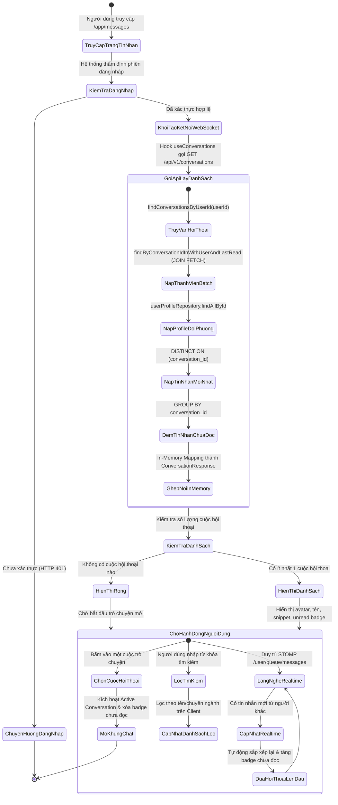
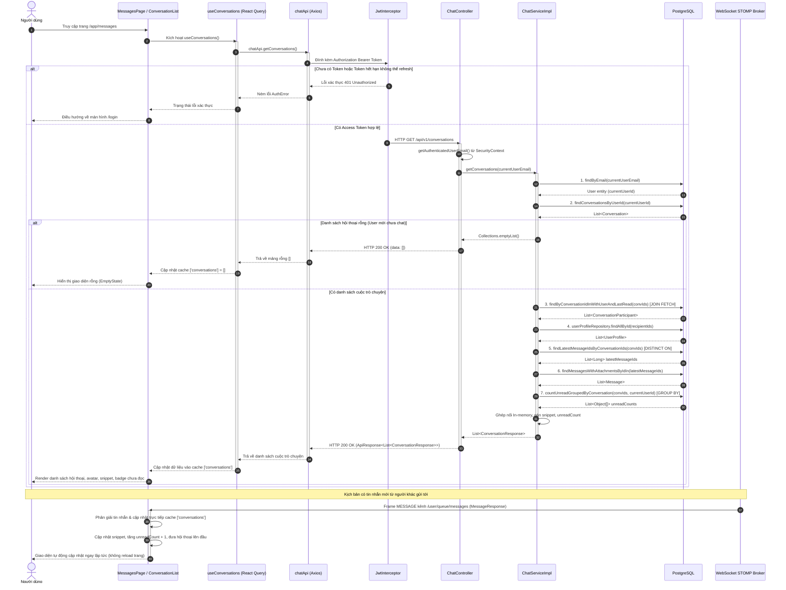

# ĐẶC TẢ YÊU CẦU & THIẾT KẾ CHI TIẾT: UC34 - XEM DANH SÁCH CUỘC TRÒ CHUYỆN (INBOX)

## PHẦN 1: ĐẶC TẢ NGHIỆP VỤ (REPORT 3)

### 2.2.3 Business Workflow (Luồng nghiệp vụ)



#### Mô tả chi tiết luồng xử lý bằng chữ (Business Step Description):
* **Bước 1 - Khởi đầu**:
  * Người dùng (đã đăng nhập với vai trò `STUDENT` hoặc `ALUMNI`, trạng thái tài khoản `ACTIVE`) điều hướng tới trang Hộp thư / Tin nhắn (`/app/messages`) từ thanh điều hướng chính (AppShell Navigation Bar).
  * Ứng dụng tự động kích hoạt kết nối WebSocket STOMP bảo mật tới máy chủ thông qua endpoint `/ws`. Bộ lọc `WebSocketAuthChannelInterceptor` thẩm định mã xác thực JWT trong frame `CONNECT`, gắn danh tính người dùng vào phiên kết nối cá nhân.
* **Bước 2 - Các bước chuyển tiếp**:
  * **Nạp dữ liệu danh sách hộp thư (Inbox Fetching)**:
    * Hook `useConversations` kích hoạt truy vấn `GET /api/v1/conversations`.
    * Backend Spring Boot tiếp nhận request, trích xuất email người dùng từ `SecurityContextHolder`, nạp thực thể `User`.
    * Thực thi chuỗi 5 truy vấn gom nhóm tối ưu hóa (Batch Queries) nhằm loại bỏ triệt để vấn đề N+1 query:
      1. Nạp danh sách các cuộc hội thoại người dùng đang tham gia, sắp xếp giảm dần theo thời điểm có tin nhắn gần nhất (`last_message_at DESC NULLS LAST`).
      2. Nạp toàn bộ danh sách thành viên tham gia (`ConversationParticipant`) của các cuộc hội thoại trên trong một câu truy vấn duy nhất có nạp trước thông tin tài khoản và tin nhắn đã đọc gần nhất (`JOIN FETCH cp.user`, `LEFT JOIN FETCH cp.lastReadMessage`).
      3. Xác định danh sách ID của đối phương (recipients) và nạp toàn bộ hồ sơ cá nhân (`UserProfile`) bao gồm họ tên, ảnh đại diện, chuyên ngành trong 1 truy vấn `findAllById`.
      4. Nạp ID và thông tin chi tiết tin nhắn mới nhất của từng cuộc hội thoại bằng kỹ thuật truy vấn tối ưu PostgreSQL `SELECT DISTINCT ON (conversation_id)`.
      5. Đếm số lượng tin nhắn chưa đọc của từng cuộc hội thoại thông qua truy vấn gom nhóm native SQL `GROUP BY m.conversation_id` so sánh với `last_read_message_id`.
    * Toàn bộ dữ liệu được ghép nối hoàn toàn trong bộ nhớ (In-memory mapping) và trả về cho Client với mã trạng thái HTTP 200 OK.
  * **Xử lý hiển thị giao diện Client**:
    * Nếu danh sách trả về rỗng: Hiển thị giao diện rỗng (`<EmptyState>`) thông báo người dùng chưa có cuộc trò chuyện nào, gợi ý khám phá trang Danh bạ cựu sinh viên.
    * Nếu có dữ liệu: Hiển thị danh sách cuộn mượt mà. Mỗi thẻ hội thoại hiển thị đầy đủ avatar, tên đối phương, nhãn chuyên ngành, trích dẫn tin nhắn mới nhất, thời gian tương đối và huy hiệu số tin chưa đọc (Unread Badge) màu tím nổi bật nếu số tin chưa đọc > 0.
  * **Tìm kiếm & Lọc nhanh (Instant Client Filtering)**:
    * Người dùng có thể nhập từ khóa vào ô tìm kiếm ở đầu danh sách. Giao diện lọc tức thì theo tên người nhận hoặc chuyên ngành mà không cần gọi thêm request lên máy chủ.
  * **Đồng bộ hóa thời gian thực (WebSocket Real-time Sync)**:
    * Khi có bất kỳ tin nhắn mới nào được gửi tới người dùng qua kênh `/user/queue/messages`, hook `useWebSocketChat` tự động phân giải dữ liệu STOMP, cập nhật đoạn trích tin nhắn cuối, thời gian mới nhất và tăng huy hiệu chưa đọc thêm 1 đơn vị trực tiếp trên bộ nhớ đệm React Query mà không cần tải lại toàn bộ trang. Cuộc trò chuyện đó ngay lập tức được tự động đẩy lên vị trí đầu danh sách.
* **Bước 3 - Kết thúc**:
  * Khi người dùng nhấp chọn một cuộc hội thoại cụ thể, cuộc trò chuyện đó chuyển sang trạng thái kích hoạt (Active), khung chat bên phải nạp lịch sử tin nhắn chi tiết (UC33) và hệ thống tự động gửi yêu cầu đánh dấu đã đọc (`POST /conversations/{id}/read`), đặt huy hiệu chưa đọc của cuộc trò chuyện đó về 0.

---

### 3.2 Module Tin Nhắn & Trò Chuyện Trực Tiếp (Direct Messaging & Chat)
Module cung cấp giải pháp liên lạc thời gian thực giữa các thành viên cộng đồng AlumNect (sinh viên và cựu sinh viên FPT University), hỗ trợ kết nối trao đổi học thuật, cố vấn nghề nghiệp và mở rộng quan hệ đối tác.

#### 3.2.1 Xem danh sách cuộc trò chuyện (UC34 - View Conversation List / Inbox)

**Function trigger**:
* **Navigation path**: Người dùng nhấp vào biểu tượng "Tin nhắn" trên thanh điều hướng chính (`/app/messages`) hoặc được tự động điều hướng từ trang hồ sơ thành viên / danh bạ.
* **Timing Frequency**: On screen mount (tự động nạp khi vào trang) và tự động đồng bộ theo sự kiện thời gian thực (On real-time STOMP event).

**Function description**:
* **Actors/Roles**: Tất cả người dùng đã đăng nhập và được kích hoạt tài khoản (`STUDENT`, `ALUMNI`).
* **Purpose**: Cho phép người dùng theo dõi toàn bộ danh sách các cuộc hội thoại đã và đang diễn ra, nhận biết đối phương trò chuyện, nắm bắt nhanh nội dung tin nhắn mới nhất và phát hiện các tin nhắn chưa đọc cần phản hồi.
* **Interface**:
  * **Thanh tìm kiếm (Search Bar)**: Ô nhập liệu có biểu tượng kính lúp, hỗ trợ tìm kiếm nhanh theo họ và tên đối phương (lọc trực tiếp theo `recipientName` trên client).
  * **Danh sách thẻ hội thoại (Conversation Item List)**:
    * Ảnh đại diện hình tròn (Avatar 44px) kèm huy hiệu tích xanh xác thực.
    * Họ và tên đối phương (font đậm, màu mận chín `text-plum-900`).
    * Nhãn chuyên ngành (tag nhỏ gọn, màu tím nhạt).
    * Đoạn trích tin nhắn cuối cùng (Snippet) hiển thị tối đa 1 dòng, nếu có ảnh/video thì hiển thị `[Hình ảnh]`, `[Video]`.
    * Thời gian gửi tin nhắn gần nhất (định dạng linh hoạt: giờ:phút nếu trong ngày, ngày/tháng nếu khác ngày).
    * Huy hiệu đếm số tin chưa đọc (Unread Count Badge) nền tím `bg-brand-500` chữ trắng nổi bật.
  * **Trạng thái giao diện**:
    * Skeleton Loading: 5 thẻ giả lập hiệu ứng sóng chuyển động trong khi nạp dữ liệu.
    * Empty State: Hình minh họa thân thiện và thông điệp hướng dẫn kết nối khi hộp thư trống.

**Data processing**:
* Trích xuất thông tin người dùng từ JWT Access Token.
* Kiểm tra trạng thái tài khoản: nếu `LOCKED` hoặc `PENDING`, từ chối quyền truy cập.
* Thực thi batch queries kết hợp in-memory projection để tạo mảng `ConversationResponse`.
* Sắp xếp danh sách giảm dần theo `last_message_at`.

**Screen layout**:
* Màn hình Desktop: Khung danh sách hội thoại chiếm cột bên trái (chiều rộng cố định 320px) trong bố cục lưới 2 cột của trang Messages.
* Màn hình Mobile: Danh sách hội thoại chiếm toàn bộ chiều rộng màn hình; khi người dùng chọn một cuộc trò chuyện, giao diện chuyển mượt mà sang khung chat với nút quay lại danh sách hộp thư.

**Function details**:
* **Data**:
  * Input: Không yêu cầu tham số bắt buộc; tùy chọn từ khóa tìm kiếm (`searchQuery`) cục bộ trên giao diện.
  * Output: Danh sách đối tượng `ConversationResponse` gồm: `id`, `recipientId`, `recipientName`, `recipientAvatar`, `recipientMajor`, `lastMessage`, `lastMessageAt`, `unreadCount`.
* **Validation**:
  * Yêu cầu bắt buộc phải có Access Token hợp lệ trong Header Authorization.
* **Business rules**:
  * `BR-34-01`: Chỉ hiển thị các cuộc hội thoại mà người dùng hiện tại là thành viên tham gia (`conversation_participants`).
  * `BR-34-02`: Trong một cuộc hội thoại 1-1, đối phương (`recipient`) luôn là thành viên còn lại (khác với `currentUserId`).
  * `BR-34-03`: Cuộc hội thoại có tin nhắn mới nhất luôn được ưu tiên hiển thị ở vị trí đầu tiên của danh sách.
  * `BR-34-04`: Số lượng tin nhắn chưa đọc (`unreadCount`) chỉ tính các tin nhắn do đối phương gửi (`sender_id != currentUserId`) và có thời điểm phát sinh sau mốc tin nhắn đã đọc gần nhất (`last_read_message_id`).
  * `BR-34-05`: Tin nhắn do chính người dùng gửi không bao giờ được tính vào số lượng tin chưa đọc của chính mình.
* **Error Handling**:
  * `401 Unauthorized`: Token không hợp lệ hoặc đã hết hạn $\rightarrow$ Tự động làm mới qua Refresh Token hoặc điều hướng về trang đăng nhập.
  * `500 Internal Server Error`: Lỗi kết nối cơ sở dữ liệu $\rightarrow$ Hiển thị Toast thông báo lỗi hệ thống và cho phép bấm "Thử lại".
* **Normal case**: Người dùng mở trang tin nhắn, danh sách hội thoại hiển thị đầy đủ trong vòng dưới 200ms, huy hiệu số tin chưa đọc hiển thị chuẩn xác.
* **Abnormal case**: Mất kết nối Internet hoặc mất kết nối WebSocket $\rightarrow$ Client hiển thị trạng thái offline nhẹ nhàng và tự động thử kết nối lại sau mỗi 5 giây (`reconnectDelay: 5000`).

---

### 5. Requirement Appendix (Phụ lục Yêu cầu)

#### 5.1 Business Rules (Quy tắc Nghiệp vụ)

| ID | Định nghĩa Quy tắc (Rule Definition) |
| :--- | :--- |
| **BR-34-01** | Chỉ người dùng có trạng thái tài khoản `ACTIVE` mới được phép truy cập hộp thư và danh sách trò chuyện. |
| **BR-34-02** | Mỗi cuộc trò chuyện 1-1 giữa 2 người dùng là duy nhất, được đảm bảo bằng khóa định danh `direct_key = min(id1, id2) + "_" + max(id1, id2)` trên CSDL. |
| **BR-34-03** | Danh sách hội thoại phải luôn được sắp xếp theo thời gian tin nhắn mới nhất giảm dần (`last_message_at DESC NULLS LAST`). |
| **BR-34-04** | Khi có tin nhắn mới đến qua WebSocket, cuộc trò chuyện tương ứng phải tự động nhảy lên vị trí đầu danh sách ngay lập tức mà không cần reload trang. |
| **BR-34-05** | Số lượng tin nhắn chưa đọc phải tự động reset về 0 ngay khi người dùng bấm mở xem cuộc hội thoại đó. |
| **BR-34-06** | Đoạn trích tin nhắn cuối cùng nếu là tệp đính kèm không có văn bản phải hiển thị nhãn quy ước: `[Hình ảnh]`, `[Video]` hoặc `[Tệp đính kèm]`. |

#### 5.2 Common Requirements (Yêu cầu Chung)
* Giao diện tuân thủ phong cách Pastel Premium: mặt kính mờ mờ ảo `backdrop-blur-xl`, bảng màu kem ấm `#faf4ec` và mực mận `#322c3f`.
* Tốc độ phản hồi API danh sách cuộc trò chuyện phải đạt dưới 100ms với quy mô hàng ngàn bản ghi nhờ kỹ thuật Batching Queries.
* Hệ thống bảo mật toàn bộ dữ liệu truyền tải thông qua HTTPS và WSS (WebSocket Secure).

#### 5.3 Application Messages List (Danh sách Thông điệp Ứng dụng)

| # | Mã thông điệp | Loại thông điệp | Ngữ cảnh | Nội dung hiển thị |
| :--- | :--- | :--- | :--- | :--- |
| 1 | `MSG-INBOX-01` | In line | Nạp danh sách hội thoại thành công | Lấy danh sách hội thoại thành công. |
| 2 | `MSG-INBOX-02` | In line | Hộp thư chưa có cuộc hội thoại nào | Bạn chưa có cuộc trò chuyện nào. Hãy kết nối với các cựu sinh viên và bạn bè! |
| 3 | `MSG-INBOX-03` | In line | Tìm kiếm không có kết quả phù hợp | Không tìm thấy cuộc trò chuyện phù hợp. |
| 4 | `MSG-INBOX-04` | Toast message | Đánh dấu đã đọc thành công | Đã đánh dấu đã đọc. |
| 5 | `MSG-INBOX-05` | Toast message | Lỗi mất kết nối mạng | Mất kết nối mạng. Đang tự động kết nối lại... |
| 6 | `MSG-INBOX-06` | Toast message | Lỗi phiên đăng nhập hết hạn | Phiên làm việc đã hết hạn. Vui lòng đăng nhập lại. |

---

## PHẦN 2: THIẾT KẾ CHI TIẾT (REPORT 4)

### 3. Detail Design (Thiết kế chi tiết)

#### 3.1 Xem danh sách cuộc trò chuyện (UC34 - View Conversation List / Inbox)

##### 3.1.1 Class Diagram (Sơ đồ Lớp)

```mermaid
classDiagram
    %% Tầng Controller
    class ChatController {
        -ChatService chatService
        +getConversations() ResponseEntity~ApiResponse~List~ConversationResponse~~~~
        -getAuthenticatedUserEmail() String
    }

    %% Tầng DTO & Response
    class ApiResponse~T~ {
        +Integer error
        +String message
        +T data
    }

    class ConversationResponse {
        +Long id
        +Instant createdAt
        +Instant lastMessageAt
        +Long recipientId
        +String recipientName
        +String recipientAvatar
        +String recipientMajor
        +String lastMessage
        +long unreadCount
    }

    %% Tầng Service
    class ChatService {
        <<interface>>
        +getConversations(currentUserEmail: String) List~ConversationResponse~
    }

    class ChatServiceImpl {
        -ConversationRepository conversationRepository
        -ConversationParticipantRepository conversationParticipantRepository
        -MessageRepository messageRepository
        -MessageAttachmentRepository messageAttachmentRepository
        -UserRepository userRepository
        -UserProfileRepository userProfileRepository
        -MessageMapper messageMapper
        -SimpMessagingTemplate messagingTemplate
        +getConversations(currentUserEmail: String) List~ConversationResponse~
    }

    %% Tầng Mapper
    class MessageMapper {
        +toConversationResponse(conversation: Conversation, recipient: User, recipientProfile: UserProfile, lastMessageSnippet: String, unreadCount: long) ConversationResponse
    }

    %% Tầng Repository
    class ConversationRepository {
        <<interface>>
        +findConversationsByUserId(userId: Long) List~Conversation~
        +findByDirectKey(directKey: String) Optional~Conversation~
        +findDirectConversationBetween(user1Id: Long, user2Id: Long) Optional~Conversation~
    }

    class ConversationParticipantRepository {
        <<interface>>
        +findByConversationIdInWithUserAndLastRead(conversationIds: List~Long~) List~ConversationParticipant~
        +findByConversationId(conversationId: Long) List~ConversationParticipant~
        +findByConversationIdAndUserId(conversationId: Long, userId: Long) Optional~ConversationParticipant~
        +existsByConversationIdAndUserId(conversationId: Long, userId: Long) boolean
    }

    class MessageRepository {
        <<interface>>
        +findLatestMessageIdsByConversationIds(conversationIds: List~Long~) List~Long~
        +findMessagesWithAttachmentsByIdIn(messageIds: List~Long~) List~Message~
        +countUnreadGroupedByConversation(conversationIds: List~Long~, currentUserId: Long) List~Object[]~
        +findTopByConversationIdOrderByCreatedAtDesc(conversationId: Long) Optional~Message~
        +findByConversationIdOrderByCreatedAtDesc(conversationId: Long, pageable: Pageable) Page~Message~
    }

    %% Tầng Entity CSDL
    class Conversation {
        +Long id
        +Instant createdAt
        +Instant lastMessageAt
        +String directKey
        +List~ConversationParticipant~ participants
    }

    class ConversationParticipant {
        +Long id
        +Conversation conversation
        +User user
        +Message lastReadMessage
        +boolean isArchived
        +Instant joinedAt
    }

    class Message {
        +Long id
        +Conversation conversation
        +User sender
        +String content
        +boolean isDeleted
        +Instant createdAt
        +List~MessageAttachment~ attachments
    }

    %% Tầng Frontend
    class ConversationList {
        +conversations: Conversation[]
        +activeId: number
        +isLoading: boolean
        +onSelect(conv: Conversation): void
    }

    class useConversations {
        +queryKey: string[]
        +data: Conversation[]
        +isLoading: boolean
    }

    class chatApi {
        +getConversations(): Promise~ApiResponse~Conversation[]~~
    }

    %% Mối quan hệ giữa các lớp
    ChatController --> ChatService : ủy quyền xử lý
    ChatServiceImpl ..|> ChatService : hiện thực hóa
    ChatServiceImpl --> ConversationRepository : truy vấn hội thoại
    ChatServiceImpl --> ConversationParticipantRepository : nạp thành viên
    ChatServiceImpl --> MessageRepository : nạp tin nhắn & đếm unread
    ChatServiceImpl --> MessageMapper : chuyển đổi DTO
    MessageMapper --> ConversationResponse : đóng gói
    ChatController ..> ApiResponse : trả về
    Conversation "1" *-- "many" ConversationParticipant : chứa
    ConversationParticipant --> Conversation : thuộc về
    ConversationParticipant --> Message : lastReadMessage
    Conversation "1" *-- "many" Message : chứa

    ConversationList --> useConversations : sử dụng dữ liệu
    useConversations --> chatApi : gọi API
    chatApi ..> ChatController : HTTP GET /api/v1/conversations
```



##### 3.1.2 Sequence Diagram (Sơ đồ Tuần tự Gộp)



##### 3.1.3 Thiết kế Cơ sở Dữ liệu (Database Design)

1. **Bảng `conversations`**:
   * `id` (`BIGINT`, PK, Identity): Mã định danh duy nhất của cuộc hội thoại.
   * `created_at` (`TIMESTAMPTZ`, NOT NULL): Thời điểm khởi tạo cuộc trò chuyện.
   * `last_message_at` (`TIMESTAMPTZ`): Thời điểm phát sinh tin nhắn mới nhất (dùng để sắp xếp danh sách).
   * `direct_key` (`VARCHAR(100)`, UNIQUE): Khóa định danh chống trùng lặp giữa 2 người dùng.
   * **Chỉ mục**: `idx_conversations_last_message_at (last_message_at DESC NULLS LAST)`.

2. **Bảng `conversation_participants`**:
   * `id` (`BIGINT`, PK, Identity): Khóa chính.
   * `conversation_id` (`BIGINT`, FK $\rightarrow$ `conversations.id`, ON DELETE CASCADE): Mã cuộc trò chuyện.
   * `user_id` (`BIGINT`, FK $\rightarrow$ `users.id`, ON DELETE CASCADE): Mã người dùng tham gia.
   * `last_read_message_id` (`BIGINT`, FK $\rightarrow$ `messages.id`, ON DELETE SET NULL): Tin nhắn gần nhất đã đọc.
   * `is_archived` (`BOOLEAN`, DEFAULT false): Đánh dấu đã lưu trữ hay chưa.
   * `joined_at` (`TIMESTAMPTZ`, DEFAULT now()): Thời điểm tham gia.
   * **Ràng buộc duy nhất**: `UNIQUE (conversation_id, user_id)`.
   * **Chỉ mục**: `idx_conversation_participants_user_id`, `idx_conversation_participants_conversation_id`.

3. **Bảng `messages`**:
   * `id` (`BIGINT`, PK, Identity): Khóa chính.
   * `conversation_id` (`BIGINT`, FK $\rightarrow$ `conversations.id`, ON DELETE CASCADE): Thuộc cuộc trò chuyện.
   * `sender_id` (`BIGINT`, FK $\rightarrow$ `users.id`, ON DELETE CASCADE): Người gửi tin nhắn.
   * `content` (`TEXT`): Nội dung tin nhắn văn bản.
   * `is_deleted` (`BOOLEAN`, DEFAULT false): Cờ đánh dấu đã xóa.
   * `created_at` (`TIMESTAMPTZ`, DEFAULT now()): Thời điểm gửi tin.
   * **Chỉ mục**: `idx_messages_conversation_id_created_at (conversation_id, created_at DESC)`.

##### 3.1.4 Đặc tả API Endpoint (API Specification)

* **URL**: `GET /api/v1/conversations`
* **Tiêu đề Request**:
  * `Authorization`: `Bearer <jwt_access_token>` (Bắt buộc)
* **Phản hồi thành công (HTTP 200 OK)**:
  ```json
  {
    "error": 0,
    "message": "Lấy danh sách hội thoại thành công.",
    "data": [
      {
        "id": 1,
        "createdAt": "2026-09-05T08:30:00Z",
        "lastMessageAt": "2026-09-06T13:20:00Z",
        "recipientId": 2,
        "recipientName": "Trần Thị B",
        "recipientAvatar": "https://pub.alumnect.edu.vn/avatar/user_2.jpg",
        "recipientMajor": "Kỹ thuật phần mềm",
        "lastMessage": "Xin chào bạn, mình kết nối trao đổi công việc nhé!",
        "unreadCount": 3
      }
    ]
  }
  ```
* **Phản hồi lỗi xác thực (HTTP 401 Unauthorized)**:
  ```json
  {
    "error": -1,
    "message": "Yêu cầu đăng nhập để truy cập tài nguyên.",
    "data": null
  }
  ```
