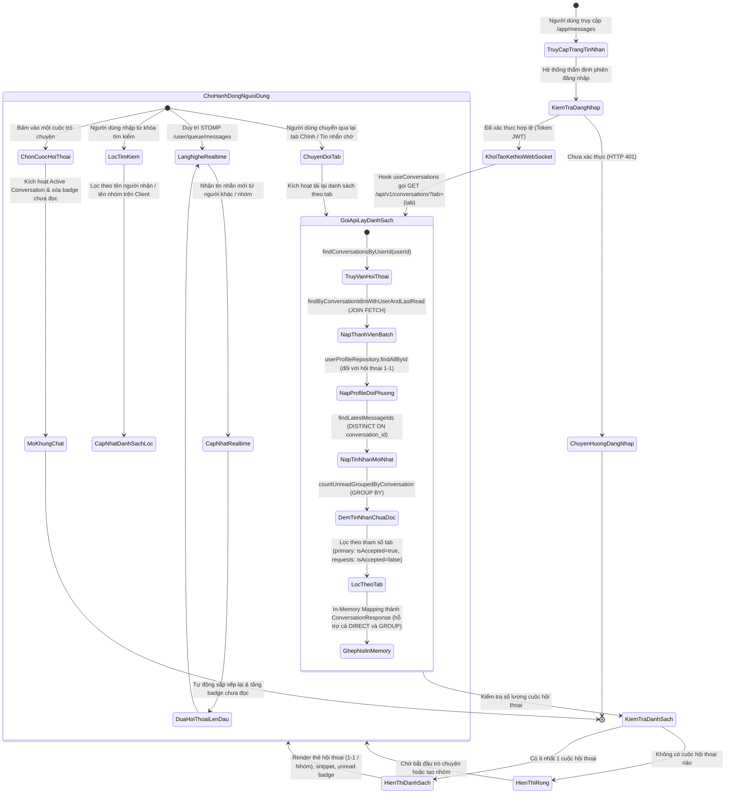
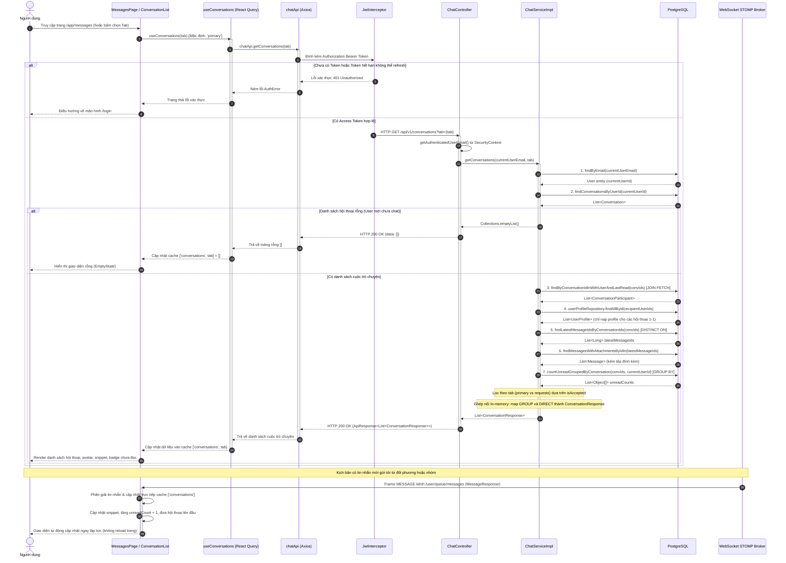
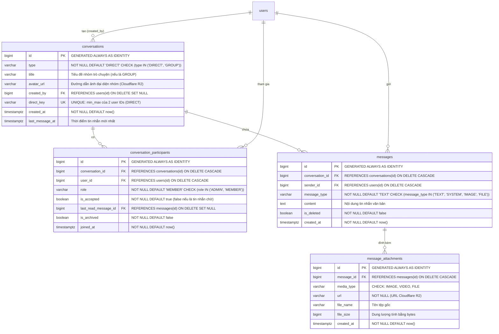

# ĐẶC TẢ YÊU CẦU & THIẾT KẾ CHI TIẾT: UC34 - XEM DANH SÁCH CUỘC TRÒ CHUYỆN (INBOX)

## PHẦN 1: ĐẶC TẢ NGHIỆP VỤ (REPORT 3)

### 2.2.3 Business Workflow (Luồng nghiệp vụ)


```mermaid
stateDiagram-v2
    [*] --> TruyCapTrangTinNhan: Người dùng truy cập /app/messages
    TruyCapTrangTinNhan --> KiemTraDangNhap: Hệ thống thẩm định phiên đăng nhập
    
    state KiemTraDangNhap <<choice>>
    KiemTraDangNhap --> ChuyenHuongDangNhap: Chưa xác thực (HTTP 401)
    ChuyenHuongDangNhap --> [*]
    
    KiemTraDangNhap --> KhoiTaoKetNoiWebSocket: Đã xác thực hợp lệ (Token JWT)
    KhoiTaoKetNoiWebSocket --> GoiApiLayDanhSach: Hook useConversations gọi GET /api/v1/conversations?tab={tab}
    
    state GoiApiLayDanhSach {
        [*] --> TruyVanHoiThoai: findConversationsByUserId(userId)
        TruyVanHoiThoai --> NapThanhVienBatch: findByConversationIdInWithUserAndLastRead (JOIN FETCH)
        NapThanhVienBatch --> NapProfileDoiPhuong: userProfileRepository.findAllById (đối với hội thoại 1-1)
        NapProfileDoiPhuong --> NapTinNhanMoiNhat: findLatestMessageIds (DISTINCT ON conversation_id)
        NapTinNhanMoiNhat --> DemTinNhanChuaDoc: countUnreadGroupedByConversation (GROUP BY)
        DemTinNhanChuaDoc --> LocTheoTab: Lọc theo tham số tab (primary: isAccepted=true, requests: isAccepted=false)
        LocTheoTab --> GhepNoiInMemory: In-Memory Mapping thành ConversationResponse (hỗ trợ cả DIRECT và GROUP)
    }
    
    GoiApiLayDanhSach --> KiemTraDanhSach: Kiểm tra số lượng cuộc hội thoại
    
    state KiemTraDanhSach <<choice>>
    KiemTraDanhSach --> HienThiRong: Không có cuộc hội thoại nào
    HienThiRong --> ChoHanhDongNguoiDung: Chờ bắt đầu trò chuyện hoặc tạo nhóm
    
    KiemTraDanhSach --> HienThiDanhSach: Có ít nhất 1 cuộc hội thoại
    HienThiDanhSach --> ChoHanhDongNguoiDung: Render thẻ hội thoại (1-1 / Nhóm), snippet, unread badge
    
    state ChoHanhDongNguoiDung {
        [*] --> ChuyenDoiTab: Người dùng chuyển qua lại tab Chính / Tin nhắn chờ
        ChuyenDoiTab --> GoiApiLayDanhSach: Kích hoạt tải lại danh sách theo tab
        
        [*] --> LangNgheRealtime: Duy trì STOMP /user/queue/messages
        LangNgheRealtime --> CapNhatRealtime: Nhận tin nhắn mới từ người khác / nhóm
        CapNhatRealtime --> DuaHoiThoaiLenDau: Tự động sắp xếp lại & tăng badge chưa đọc
        DuaHoiThoaiLenDau --> LangNgheRealtime
        
        [*] --> LocTimKiem: Người dùng nhập từ khóa tìm kiếm
        LocTimKiem --> CapNhatDanhSachLoc: Lọc theo tên người nhận / tên nhóm trên Client
        
        [*] --> ChonCuocHoiThoai: Bấm vào một cuộc trò chuyện
        ChonCuocHoiThoai --> MoKhungChat: Kích hoạt Active Conversation & xóa badge chưa đọc
    }
    
    MoKhungChat --> [*]
```

#### Mô tả chi tiết luồng xử lý bằng chữ (Business Step Description):
* **Bước 1 - Khởi đầu**:
  * Người dùng (đã đăng nhập với vai trò `STUDENT` hoặc `ALUMNI`, trạng thái tài khoản `ACTIVE`) điều hướng tới trang Hộp thư / Tin nhắn (`/app/messages`) từ thanh điều hướng chính (AppShell Navigation Bar).
  * Ứng dụng tự động kích hoạt kết nối WebSocket STOMP bảo mật tới máy chủ thông qua endpoint `/ws`. Bộ lọc `WebSocketAuthChannelInterceptor` thẩm định mã xác thực JWT trong frame `CONNECT`, gắn danh tính người dùng vào phiên kết nối cá nhân.
* **Bước 2 - Các bước chuyển tiếp**:
  * **Nạp dữ liệu danh sách hộp thư theo Tab (Inbox Fetching by Tab)**:
    * Mặc định khi vào màn hình, hook `useConversations` kích hoạt truy vấn `GET /api/v1/conversations?tab=primary`.
    * Backend Spring Boot tiếp nhận request, trích xuất email người dùng từ `SecurityContextHolder`, nạp thực thể `User`.
    * Thực thi chuỗi 5 truy vấn gom nhóm tối ưu hóa (Batch Queries) nhằm loại bỏ triệt để vấn đề N+1 query:
      1. Nạp danh sách các cuộc hội thoại người dùng đang tham gia, sắp xếp giảm dần theo thời điểm có tin nhắn gần nhất (`last_message_at DESC NULLS LAST`).
      2. Nạp toàn bộ danh sách thành viên tham gia (`ConversationParticipant`) của các cuộc hội thoại trên trong một câu truy vấn duy nhất có nạp trước thông tin tài khoản và tin nhắn đã đọc gần nhất (`JOIN FETCH cp.user`, `LEFT JOIN FETCH cp.lastReadMessage`).
      3. Xác định danh sách ID của đối phương (recipients đối với hội thoại DIRECT) và nạp toàn bộ hồ sơ cá nhân (`UserProfile`) bao gồm họ tên, ảnh đại diện, chuyên ngành trong 1 truy vấn `findAllById`.
      4. Nạp ID và thông tin chi tiết tin nhắn mới nhất của từng cuộc hội thoại bằng kỹ thuật truy vấn tối ưu PostgreSQL `SELECT DISTINCT ON (conversation_id)`.
      5. Đếm số lượng tin nhắn chưa đọc của từng cuộc hội thoại thông qua truy vấn gom nhóm native SQL `GROUP BY m.conversation_id` so sánh với `last_read_message_id`.
    * **Lọc theo tab**:
      * Nếu `tab = "primary"`: Hệ thống chỉ giữ lại các cuộc hội thoại mà `myParticipant.isAccepted = true` (bao gồm các cuộc trò chuyện trực tiếp với bạn bè/người theo dõi và toàn bộ nhóm trò chuyện tham gia hợp lệ).
      * Nếu `tab = "requests"`: Hệ thống chỉ giữ lại các cuộc hội thoại mà `myParticipant.isAccepted = false` (tin nhắn chờ do người lạ gửi đến lần đầu).
    * Phân loại ánh xạ dữ liệu:
      * Nếu cuộc trò chuyện là `GROUP`: Gán `isGroup = true`, tiêu đề `title`, ảnh đại diện nhóm `avatarUrl`, số thành viên `memberCount = parts.size()`, quyền admin `adminId`.
      * Nếu cuộc trò chuyện là `DIRECT`: Gán `isGroup = false`, tiêu đề là họ tên đối phương, ảnh đại diện đối phương và chuyên ngành.
    * Toàn bộ dữ liệu được ghép nối hoàn toàn trong bộ nhớ (In-memory mapping) và trả về cho Client với mã trạng thái HTTP 200 OK.
  * **Xử lý hiển thị giao diện Client**:
    * Nếu danh sách trả về rỗng: Hiển thị giao diện rỗng (`<EmptyState>`) thông báo người dùng chưa có cuộc trò chuyện nào trong tab này.
    * Nếu có dữ liệu: Hiển thị danh sách cuộn mượt mà. Mỗi thẻ hội thoại hiển thị đầy đủ avatar, tên đối phương hoặc tên nhóm, trích dẫn tin nhắn mới nhất, thời gian tương đối và huy hiệu số tin chưa đọc (Unread Badge) màu tím nổi bật nếu số tin chưa đọc > 0.
  * **Chuyển đổi Tab (Primary / Requests)**:
    * Người dùng có thể nhấn vào tab "Tin nhắn chờ" (Requests) để xem danh sách tin nhắn từ người lạ. Hook kích hoạt gọi lại API với tham số `tab=requests`.
  * **Tìm kiếm & Lọc nhanh (Instant Client Filtering)**:
    * Người dùng có thể nhập từ khóa vào ô tìm kiếm ở đầu danh sách. Giao diện lọc tức thì theo tên người nhận hoặc tên nhóm mà không cần gọi thêm request lên máy chủ.
  * **Đồng bộ hóa thời gian thực (WebSocket Real-time Sync)**:
    * Khi có bất kỳ tin nhắn mới nào được gửi tới người dùng qua kênh `/user/queue/messages`, hook `useWebSocketChat` tự động phân giải dữ liệu STOMP, cập nhật đoạn trích tin nhắn cuối, thời gian mới nhất và tăng huy hiệu chưa đọc thêm 1 đơn vị trực tiếp trên bộ nhớ đệm React Query mà không cần tải lại toàn bộ trang. Cuộc trò chuyện đó ngay lập tức được tự động đẩy lên vị trí đầu danh sách.
* **Bước 3 - Kết thúc**:
  * Khi người dùng nhấp chọn một cuộc hội thoại cụ thể, cuộc trò chuyện đó chuyển sang trạng thái kích hoạt (Active), khung chat bên phải nạp lịch sử tin nhắn chi tiết (UC33) và hệ thống tự động gửi yêu cầu đánh dấu đã đọc (`POST /conversations/{id}/read`), đặt huy hiệu chưa đọc của cuộc trò chuyện đó về 0.

---

### 3.2 Module Tin Nhắn & Trò Chuyện Trực Tiếp (Direct Messaging & Chat)
Module cung cấp giải pháp liên lạc thời gian thực giữa các thành viên cộng đồng AlumNect (sinh viên và cựu sinh viên FPT University), hỗ trợ kết nối trao đổi học thuật, cố vấn nghề nghiệp, làm việc nhóm và mở rộng quan hệ đối tác.

#### 3.2.1 Xem danh sách cuộc trò chuyện (UC34 - View Conversation List / Inbox)

**Function trigger**:
* **Navigation path**: Người dùng nhấp vào biểu tượng "Tin nhắn" trên thanh điều hướng chính (`/app/messages`) hoặc được tự động điều hướng từ trang hồ sơ thành viên / danh bạ.
* **Timing Frequency**: On screen mount (tự động nạp khi vào trang), khi đổi tab và tự động đồng bộ theo sự kiện thời gian thực (On real-time STOMP event).

**Function description**:
* **Actors/Roles**: Tất cả người dùng đã đăng nhập và được kích hoạt tài khoản (`STUDENT`, `ALUMNI`).
* **Purpose**: Cho phép người dùng theo dõi toàn bộ danh sách các cuộc hội thoại đã và đang diễn ra (bao gồm trò chuyện trực tiếp 1-1 và nhóm trò chuyện), phân biệt hộp thư chính và tin nhắn chờ từ người lạ, nhận biết đối phương trò chuyện, nắm bắt nhanh nội dung tin nhắn mới nhất và phát hiện các tin nhắn chưa đọc cần phản hồi.
* **Interface**:
  * **Bộ chuyển Tab (Primary / Requests Tabs)**: Gồm 2 tab:
    * "Hộp thư chính" (Primary): Hiển thị tất cả các cuộc trò chuyện đã chấp nhận và nhóm chat.
    * "Tin nhắn chờ" (Requests): Hiển thị các cuộc trò chuyện từ người lạ chưa được chấp nhận.
  * **Nút Tạo nhóm mới (Create Group Button)**: Nút có biểu tượng dấu cộng `+` bên cạnh tiêu đề Tin nhắn, mở modal tạo nhóm trò chuyện (UC36).
  * **Thanh tìm kiếm (Search Bar)**: Ô nhập liệu có biểu tượng kính lúp, hỗ trợ tìm kiếm nhanh theo họ và tên đối phương hoặc tên nhóm (lọc trực tiếp trên client).
  * **Danh sách thẻ hội thoại (Conversation Item List)**:
    * Thẻ hội thoại trực tiếp (1-1): Avatar tròn của người nhận, họ tên đối phương, nhãn chuyên ngành, trích dẫn tin nhắn mới nhất, thời gian tương đối và huy hiệu tin chưa đọc.
    * Thẻ hội thoại nhóm (Group): Avatar nhóm (hoặc avatar mặc định có icon nhóm nhiều người `Users`), tên nhóm trò chuyện, nhãn đếm thành viên (`X thành viên`), đoạn trích tin nhắn cuối cùng kèm tên người gửi (nếu có), thời gian và huy hiệu tin chưa đọc.
  * **Trạng thái giao diện**:
    * Skeleton Loading: 5 thẻ giả lập hiệu ứng sóng chuyển động trong khi nạp dữ liệu.
    * Empty State: Hình minh họa thân thiện và thông điệp hướng dẫn khi danh sách trống.

**Data processing**:
* Trích xuất thông tin người dùng từ JWT Access Token.
* Kiểm tra trạng thái tài khoản: nếu `LOCKED` hoặc `PENDING`, từ chối quyền truy cập.
* Tiếp nhận tham số `tab` (mặc định là `primary`).
* Thực thi batch queries kết hợp in-memory projection để tạo mảng `ConversationResponse`.
* Lọc theo điều kiện `isAccepted` tương ứng với tab.
* Sắp xếp danh sách giảm dần theo `last_message_at`.

**Screen layout**:
* Màn hình Desktop: Khung danh sách hội thoại chiếm cột bên trái (chiều rộng cố định 340px) trong bố cục lưới 2 cột của trang Messages.
* Màn hình Mobile: Danh sách hội thoại chiếm toàn bộ chiều rộng màn hình; khi người dùng chọn một cuộc trò chuyện, giao diện chuyển mượt mà sang khung chat với nút quay lại danh sách hộp thư.

**Function details**:
* **Data**:
  * Input: Query parameter `tab` (`primary` hoặc `requests`, mặc định `primary`); tùy chọn từ khóa tìm kiếm (`searchQuery`) cục bộ trên giao diện.
  * Output: Danh sách đối tượng `ConversationResponse` gồm: `id`, `type`, `isGroup`, `title`, `avatarUrl`, `createdAt`, `lastMessageAt`, `recipientId`, `recipientName`, `recipientAvatar`, `recipientMajor`, `memberCount`, `isAccepted`, `adminId`, `lastMessage`, `unreadCount`.
* **Validation**:
  * Yêu cầu bắt buộc phải có Access Token hợp lệ trong Header Authorization.
  * Tham số `tab` nếu không truyền thì mặc định là `primary`.
* **Business rules**:
  * `BR-34-01`: Chỉ hiển thị các cuộc hội thoại mà người dùng hiện tại là thành viên tham gia (`conversation_participants`).
  * `BR-34-02`: Trong cuộc hội thoại 1-1, đối phương (`recipient`) luôn là thành viên còn lại (khác với `currentUserId`).
  * `BR-34-03`: Cuộc hội thoại có tin nhắn mới nhất luôn được ưu tiên hiển thị ở vị trí đầu tiên của danh sách.
  * `BR-34-04`: Cuộc hội thoại ở tab `primary` chỉ hiển thị khi `myParticipant.isAccepted = true`. Cuộc hội thoại ở tab `requests` chỉ hiển thị khi `myParticipant.isAccepted = false`.
  * `BR-34-05`: Chỉ hiển thị các cuộc hội thoại đã có ít nhất một tin nhắn (`latestMsg != null`). Các cuộc hội thoại draft mới khởi tạo chưa có tin nhắn không hiển thị trong danh sách.
  * `BR-34-06`: Số lượng tin nhắn chưa đọc (`unreadCount`) chỉ tính các tin nhắn không do chính người dùng gửi (`sender_id != currentUserId`) và có thời điểm phát sinh sau mốc tin nhắn đã đọc gần nhất (`last_read_message_id`).
* **Error Handling**:
  * `401 Unauthorized`: Token không hợp lệ hoặc đã hết hạn $\rightarrow$ Tự động làm mới qua Refresh Token hoặc điều hướng về trang đăng nhập.
  * `500 Internal Server Error`: Lỗi kết nối cơ sở dữ liệu $\rightarrow$ Hiển thị Toast thông báo lỗi hệ thống và cho phép bấm "Thử lại".
* **Normal case**: Người dùng mở trang tin nhắn, danh sách hội thoại hiển thị đầy đủ trong vòng dưới 200ms, huy hiệu số tin chưa đọc hiển thị chuẩn xác.
* **Abnormal case**: Mất kết nối Internet hoặc mất kết nối WebSocket $\rightarrow$ Client hiển thị trạng thái offline nhẹ nhàng và tự động thử kết nối lại sau mỗi 5 giây (`reconnectDelay: 5000`).

---

### 5. Requirement Appendix (Phụ lục Yêu cầu)

#### 5.1 Business Rules (Quy tắc Nghiệp vụ)

| ID | Định nghĩa Quy tắc (Rule Definition) |
| :--- | :--- |
| **BR-34-01** | Chỉ người dùng có trạng thái tài khoản `ACTIVE` mới được phép truy cập hộp thư và danh sách trò chuyện. |
| **BR-34-02** | Mỗi cuộc trò chuyện 1-1 giữa 2 người dùng là duy nhất, được đảm bảo bằng khóa định danh `direct_key = min(id1, id2) + "_" + max(id1, id2)` trên CSDL. Cuộc trò chuyện nhóm có `type = GROUP` và `direct_key = NULL`. |
| **BR-34-03** | Danh sách hội thoại phải luôn được sắp xếp theo thời gian tin nhắn mới nhất giảm dần (`last_message_at DESC NULLS LAST`). |
| **BR-34-04** | Khi có tin nhắn mới đến qua WebSocket, cuộc trò chuyện tương ứng phải tự động nhảy lên vị trí đầu danh sách ngay lập tức mà không cần reload trang. |
| **BR-34-05** | Số lượng tin nhắn chưa đọc phải tự động reset về 0 ngay khi người dùng bấm mở xem cuộc hội thoại đó. |
| **BR-34-06** | Đoạn trích tin nhắn cuối cùng nếu là tệp đính kèm không có văn bản phải hiển thị nhãn quy ước: `[Hình ảnh]`, `[Video]` hoặc `[Tệp đính kèm]`. Nếu là tin nhắn hệ thống (`message_type = SYSTEM`), hiển thị trực tiếp nội dung thông báo hệ thống. |
| **BR-34-07** | Tin nhắn chờ từ người lạ chỉ hiển thị ở tab "Tin nhắn chờ" (Requests) cho đến khi người dùng nhấn nút Chấp nhận (Accept) thì mới chuyển sang tab Hộp thư chính (Primary). |

#### 5.2 Common Requirements (Yêu cầu Chung)
* Giao diện tuân thủ phong cách Pastel Premium: mặt kính mờ `backdrop-blur-xl`, bảng màu kem ấm `#faf4ec` và mực mận `#322c3f`.
* Tốc độ phản hồi API danh sách cuộc trò chuyện phải đạt dưới 100ms với quy mô hàng ngàn bản ghi nhờ kỹ thuật Batching Queries.
* Hệ thống bảo mật toàn bộ dữ liệu truyền tải thông qua HTTPS và WSS (WebSocket Secure).

#### 5.3 Application Messages List (Danh sách Thông điệp Ứng dụng)

| # | Mã thông điệp | Loại thông điệp | Ngữ cảnh | Nội dung hiển thị |
| :--- | :--- | :--- | :--- | :--- |
| 1 | `MSG-INBOX-01` | In line | Nạp danh sách hội thoại thành công | Lấy danh sách hội thoại thành công. |
| 2 | `MSG-INBOX-02` | In line | Hộp thư chưa có cuộc hội thoại nào | Bạn chưa có cuộc trò chuyện nào. Hãy kết nối với các cựu sinh viên và bạn bè! |
| 3 | `MSG-INBOX-03` | In line | Tab tin nhắn chờ không có yêu cầu nào | Không có tin nhắn chờ nào. |
| 4 | `MSG-INBOX-04` | In line | Tìm kiếm không có kết quả phù hợp | Không tìm thấy cuộc trò chuyện phù hợp. |
| 5 | `MSG-INBOX-05` | Toast message | Đánh dấu đã đọc thành công | Đã đánh dấu đã đọc. |
| 6 | `MSG-INBOX-06` | Toast message | Lỗi mất kết nối mạng | Mất kết nối mạng. Đang tự động kết nối lại... |
| 7 | `MSG-INBOX-07` | Toast message | Lỗi phiên đăng nhập hết hạn | Phiên làm việc đã hết hạn. Vui lòng đăng nhập lại. |

---

## PHẦN 2: THIẾT KẾ CHI TIẾT (REPORT 4)

### 3. Detail Design (Thiết kế chi tiết)

#### 3.1 Xem danh sách cuộc trò chuyện (UC34 - View Conversation List / Inbox)

##### 3.1.1 Class Diagram (Sơ đồ Lớp)


```mermaid
classDiagram
    %% Tầng Controller
    class ChatController {
        -ChatService chatService
        +getConversations(tab: String) ResponseEntity~ApiResponse~List~ConversationResponse~~~~
        -getAuthenticatedUserEmail() String
    }

    %% Tầng DTO & Response
    class ApiResponse~T~ {
        +Integer error
        +String message
        +T data
    }

    class ConversationResponse {
        +Long id
        +ConversationType type
        +boolean isGroup
        +String title
        +String avatarUrl
        +Instant createdAt
        +Instant lastMessageAt
        +Long recipientId
        +String recipientName
        +String recipientAvatar
        +String recipientMajor
        +int memberCount
        +boolean isAccepted
        +Long adminId
        +String lastMessage
        +long unreadCount
    }

    %% Tầng Service
    class ChatService {
        <<interface>>
        +getConversations(currentUserEmail: String, tab: String) List~ConversationResponse~
    }

    class ChatServiceImpl {
        -ConversationRepository conversationRepository
        -ConversationParticipantRepository conversationParticipantRepository
        -MessageRepository messageRepository
        -MessageAttachmentRepository messageAttachmentRepository
        -UserRepository userRepository
        -UserProfileRepository userProfileRepository
        -MessageMapper messageMapper
        -SimpMessagingTemplate messagingTemplate
        +getConversations(currentUserEmail: String, tab: String) List~ConversationResponse~
    }

    %% Tầng Mapper
    class MessageMapper {
        +toConversationResponse(conversation: Conversation, recipient: User, recipientProfile: UserProfile, lastMessageSnippet: String, unreadCount: long, isAccepted: boolean) ConversationResponse
    }

    %% Tầng Repository
    class ConversationRepository {
        <<interface>>
        +findConversationsByUserId(userId: Long) List~Conversation~
        +findByDirectKey(directKey: String) Optional~Conversation~
        +findDirectConversationBetween(user1Id: Long, user2Id: Long) Optional~Conversation~
    }

    class ConversationParticipantRepository {
        <<interface>>
        +findByConversationIdInWithUserAndLastRead(conversationIds: List~Long~) List~ConversationParticipant~
        +findByConversationId(conversationId: Long) List~ConversationParticipant~
        +findByConversationIdAndUserId(conversationId: Long, userId: Long) Optional~ConversationParticipant~
        +existsByConversationIdAndUserId(conversationId: Long, userId: Long) boolean
    }

    class MessageRepository {
        <<interface>>
        +findLatestMessageIdsByConversationIds(conversationIds: List~Long~) List~Long~
        +findMessagesWithAttachmentsByIdIn(messageIds: List~Long~) List~Message~
        +countUnreadGroupedByConversation(conversationIds: List~Long~, currentUserId: Long) List~Object[]~
        +findTopByConversationIdOrderByCreatedAtDesc(conversationId: Long) Optional~Message~
        +findByConversationIdOrderByCreatedAtDesc(conversationId: Long, pageable: Pageable) Page~Message~
    }

    %% Tầng Entity CSDL
    class Conversation {
        +Long id
        +ConversationType type
        +String title
        +String avatarUrl
        +User createdBy
        +Instant createdAt
        +Instant lastMessageAt
        +String directKey
        +List~ConversationParticipant~ participants
    }

    class ConversationParticipant {
        +Long id
        +Conversation conversation
        +User user
        +ParticipantRole role
        +boolean isAccepted
        +Message lastReadMessage
        +boolean isArchived
        +Instant joinedAt
    }

    class Message {
        +Long id
        +Conversation conversation
        +User sender
        +MessageType messageType
        +String content
        +boolean isDeleted
        +Instant createdAt
        +List~MessageAttachment~ attachments
    }

    %% Tầng Frontend
    class ConversationList {
        +conversations: Conversation[]
        +activeTab: string
        +activeId: number
        +isLoading: boolean
        +onSelect(conv: Conversation): void
        +onTabChange(tab: string): void
    }

    class useConversations {
        +queryKey: (string | undefined)[]
        +data: Conversation[]
        +isLoading: boolean
    }

    class chatApi {
        +getConversations(tab?: string): Promise~ApiResponse~Conversation[]~~
    }

    %% Mối quan hệ giữa các lớp
    ChatController --> ChatService : ủy quyền xử lý
    ChatServiceImpl ..|> ChatService : hiện thực hóa
    ChatServiceImpl --> ConversationRepository : truy vấn hội thoại
    ChatServiceImpl --> ConversationParticipantRepository : nạp thành viên
    ChatServiceImpl --> MessageRepository : nạp tin nhắn & đếm unread
    ChatServiceImpl --> MessageMapper : chuyển đổi DTO
    MessageMapper --> ConversationResponse : đóng gói
    ChatController ..> ApiResponse : trả về
    Conversation "1" *-- "many" ConversationParticipant : chứa
    ConversationParticipant --> Conversation : thuộc về
    ConversationParticipant --> Message : lastReadMessage
    Conversation "1" *-- "many" Message : chứa

    ConversationList --> useConversations : sử dụng dữ liệu
    useConversations --> chatApi : gọi API
    chatApi ..> ChatController : HTTP GET /api/v1/conversations?tab={tab}
```

##### 3.1.2 Sequence Diagram (Sơ đồ Tuần tự Gộp)


```mermaid
sequenceDiagram
    autonumber
    actor User as Người dùng
    participant UI as MessagesPage / ConversationList
    participant Hook as useConversations (React Query)
    participant Api as chatApi (Axios)
    participant Interceptor as JwtInterceptor
    participant Controller as ChatController
    participant Service as ChatServiceImpl
    participant DB as PostgreSQL
    participant STOMP as WebSocket STOMP Broker

    User ->> UI: Truy cập trang /app/messages (hoặc bấm chọn Tab)
    activate UI
    UI ->> Hook: useConversations(tab) [Mặc định: 'primary']
    activate Hook
    Hook ->> Api: chatApi.getConversations(tab)
    activate Api
    Api ->> Interceptor: Đính kèm Authorization Bearer Token
    activate Interceptor
    
    alt Chưa có Token hoặc Token hết hạn không thể refresh
        Interceptor -->> Api: Lỗi xác thực 401 Unauthorized
        Api -->> Hook: Ném lỗi AuthError
        Hook -->> UI: Trạng thái lỗi xác thực
        UI -->> User: Điều hướng về màn hình /login
    else Có Access Token hợp lệ
        Interceptor ->> Controller: HTTP GET /api/v1/conversations?tab={tab}
        activate Controller
        Controller ->> Controller: getAuthenticatedUserEmail() từ SecurityContext
        Controller ->> Service: getConversations(currentUserEmail, tab)
        activate Service
        
        Service ->> DB: 1. findByEmail(currentUserEmail)
        DB -->> Service: User entity (currentUserId)
        
        Service ->> DB: 2. findConversationsByUserId(currentUserId)
        DB -->> Service: List<Conversation>
        
        alt Danh sách hội thoại rỗng (User mới chưa chat)
            Service -->> Controller: Collections.emptyList()
            Controller -->> Api: HTTP 200 OK (data: [])
            Api -->> Hook: Trả về mảng rỗng []
            Hook -->> UI: Cập nhật cache ['conversations', tab] = []
            UI -->> User: Hiển thị giao diện rỗng (EmptyState)
        else Có danh sách cuộc trò chuyện
            %% Batch Queries
            Service ->> DB: 3. findByConversationIdInWithUserAndLastRead(convIds) [JOIN FETCH]
            DB -->> Service: List<ConversationParticipant>
            
            Service ->> DB: 4. userProfileRepository.findAllById(recipientUserIds)
            DB -->> Service: List<UserProfile> (chỉ nạp profile cho các hội thoại 1-1)
            
            Service ->> DB: 5. findLatestMessageIdsByConversationIds(convIds) [DISTINCT ON]
            DB -->> Service: List<Long> latestMessageIds
            Service ->> DB: 6. findMessagesWithAttachmentsByIdIn(latestMessageIds)
            DB -->> Service: List<Message> (kèm tệp đính kèm)
            
            Service ->> DB: 7. countUnreadGroupedByConversation(convIds, currentUserId) [GROUP BY]
            DB -->> Service: List<Object[]> unreadCounts
            
            Note over Service: Lọc theo tab (primary vs requests) dựa trên isAccepted
            Note over Service: Ghép nối In-memory: map GROUP và DIRECT thành ConversationResponse
            Service -->> Controller: List<ConversationResponse>
            deactivate Service
            
            Controller -->> Api: HTTP 200 OK (ApiResponse<List<ConversationResponse>>)
            deactivate Controller
            Api -->> Hook: Trả về danh sách cuộc trò chuyện
            deactivate Api
            Hook -->> UI: Cập nhật dữ liệu vào cache ['conversations', tab]
            deactivate Hook
            UI -->> User: Render danh sách hội thoại, avatar, snippet, badge chưa đọc
        end
    end

    %% Nhánh đồng bộ Realtime qua WebSocket STOMP
    Note over User, STOMP: Kịch bản có tin nhắn mới gửi tới từ đối phương hoặc nhóm
    STOMP ->> UI: Frame MESSAGE kênh /user/queue/messages (MessageResponse)
    activate UI
    UI ->> UI: Phân giải tin nhắn & cập nhật trực tiếp cache ['conversations']
    UI ->> UI: Cập nhật snippet, tăng unreadCount + 1, đưa hội thoại lên đầu
    UI -->> User: Giao diện tự động cập nhật ngay lập tức (không reload trang)
    deactivate UI
```

##### 3.1.3 Thiết kế Cơ sở Dữ liệu & Ràng buộc (Database Schema Design)

Cơ sở dữ liệu hỗ trợ phân hệ Nhắn tin gồm 4 bảng trong PostgreSQL, tuân thủ các migration `V1__init_database_schema.sql`, `V3__add_group_chat_and_stranger_features.sql` và `V7__add_message_type_column.sql`:


```mermaid
erDiagram
    conversations ||--o{ conversation_participants : "có"
    conversations ||--o{ messages : "chứa"
    messages ||--o{ message_attachments : "đính kèm"
    users ||--o{ conversation_participants : "tham gia"
    users ||--o{ messages : "gửi"
    users ||--o{ conversations : "tạo (created_by)"

    conversations {
        bigint id PK "GENERATED ALWAYS AS IDENTITY"
        varchar type "NOT NULL DEFAULT 'DIRECT' CHECK (type IN ('DIRECT', 'GROUP'))"
        varchar title "Tiêu đề nhóm trò chuyện (nếu là GROUP)"
        varchar avatar_url "Đường dẫn ảnh đại diện nhóm (Cloudflare R2)"
        bigint created_by FK "REFERENCES users(id) ON DELETE SET NULL"
        varchar direct_key UK "UNIQUE: min_max của 2 user IDs (DIRECT)"
        timestamptz created_at "NOT NULL DEFAULT now()"
        timestamptz last_message_at "Thời điểm tin nhắn mới nhất"
    }

    conversation_participants {
        bigint id PK "GENERATED ALWAYS AS IDENTITY"
        bigint conversation_id FK "REFERENCES conversations(id) ON DELETE CASCADE"
        bigint user_id FK "REFERENCES users(id) ON DELETE CASCADE"
        varchar role "NOT NULL DEFAULT 'MEMBER' CHECK (role IN ('ADMIN', 'MEMBER'))"
        boolean is_accepted "NOT NULL DEFAULT true (false nếu là tin nhắn chờ)"
        bigint last_read_message_id FK "REFERENCES messages(id) ON DELETE SET NULL"
        boolean is_archived "NOT NULL DEFAULT false"
        timestamptz joined_at "NOT NULL DEFAULT now()"
    }

    messages {
        bigint id PK "GENERATED ALWAYS AS IDENTITY"
        bigint conversation_id FK "REFERENCES conversations(id) ON DELETE CASCADE"
        bigint sender_id FK "REFERENCES users(id) ON DELETE CASCADE"
        varchar message_type "NOT NULL DEFAULT 'TEXT' CHECK (message_type IN ('TEXT', 'SYSTEM', 'IMAGE', 'FILE'))"
        text content "Nội dung tin nhắn văn bản"
        boolean is_deleted "NOT NULL DEFAULT false"
        timestamptz created_at "NOT NULL DEFAULT now()"
    }

    message_attachments {
        bigint id PK "GENERATED ALWAYS AS IDENTITY"
        bigint message_id FK "REFERENCES messages(id) ON DELETE CASCADE"
        varchar media_type "CHECK: IMAGE, VIDEO, FILE"
        varchar url "NOT NULL (URL Cloudflare R2)"
        varchar file_name "Tên tệp gốc"
        bigint file_size "Dung lượng tính bằng bytes"
        timestamptz created_at "NOT NULL DEFAULT now()"
    }
```

###### Chi tiết các bảng và ràng buộc:
1. **Bảng `conversations`**:
   * `id`: Khóa chính (BIGINT, tự tăng).
   * `type`: Phân loại hội thoại (`DIRECT` hoặc `GROUP`), có ràng buộc `ck_conversations_type CHECK (type IN ('DIRECT', 'GROUP'))`.
   * `title`: Tên nhóm trò chuyện (VARCHAR(255), áp dụng cho nhóm).
   * `avatar_url`: Ảnh đại diện nhóm trò chuyện (VARCHAR(500)).
   * `created_by`: Khóa ngoại người khởi tạo nhóm liên kết `users(id) ON DELETE SET NULL`.
   * `direct_key`: Khóa chuỗi định danh duy nhất hội thoại 1-1 (VARCHAR(100), dạng `{minUserId}_{maxUserId}`). Với nhóm chat `type = GROUP`, `direct_key` mang giá trị NULL.
   * `created_at`: Thời điểm khởi tạo cuộc hội thoại (`TIMESTAMPTZ`, mặc định `now()`).
   * `last_message_at`: Thời điểm phát sinh tin nhắn mới nhất (`TIMESTAMPTZ`), phục vụ sắp xếp danh sách hội thoại.
   * Ràng buộc: `uq_conversations_direct_key UNIQUE (direct_key)`.
   * Chỉ mục: `idx_conversations_direct_key ON conversations (direct_key)`, `idx_conversations_type ON conversations (type)`.
2. **Bảng `conversation_participants`**:
   * `id`: Khóa chính (BIGINT, tự tăng).
   * `conversation_id`: Khóa ngoại liên kết tới `conversations(id)` (`ON DELETE CASCADE`).
   * `user_id`: Khóa ngoại liên kết tới `users(id)` (`ON DELETE CASCADE`).
   * `role`: Vai trò trong hội thoại (`ADMIN` hoặc `MEMBER`), ràng buộc `ck_conversation_participants_role`.
   * `is_accepted`: Trạng thái chấp nhận cuộc trò chuyện (BOOLEAN, mặc định `true`, bằng `false` khi là tin nhắn chờ từ người lạ).
   * `last_read_message_id`: Khóa ngoại liên kết tới `messages(id)` (`ON DELETE SET NULL`), lưu vết tin nhắn cuối cùng người dùng đã đọc.
   * `is_archived`: Cờ lưu trữ (BOOLEAN, mặc định `false`).
   * `joined_at`: Thời điểm tham gia (`TIMESTAMPTZ`, mặc định `now()`).
   * Ràng buộc: `uq_conversation_participants_conv_user UNIQUE (conversation_id, user_id)`.
   * Chỉ mục: `idx_conversation_participants_user_id`, `idx_conversation_participants_conv_id`, `idx_conversation_participants_accepted`.
3. **Bảng `messages`**:
   * `id`: Khóa chính (BIGINT, tự tăng).
   * `conversation_id`: Khóa ngoại liên kết tới `conversations(id)` (`ON DELETE CASCADE`).
   * `sender_id`: Khóa ngoại liên kết tới `users(id)` (`ON DELETE CASCADE`).
   * `message_type`: Phân loại tin nhắn (`TEXT`, `SYSTEM`, `IMAGE`, `FILE`), có ràng buộc `ck_messages_message_type`.
   * `content`: Nội dung tin nhắn văn bản (TEXT).
   * `is_deleted`: Đánh dấu tin nhắn đã bị thu hồi/xóa (BOOLEAN, mặc định `false`).
   * `created_at`: Thời điểm phát sinh tin nhắn (`TIMESTAMPTZ`, mặc định `now()`).
   * Chỉ mục: `idx_messages_conversation_id_created_at ON messages (conversation_id, created_at DESC)`.
4. **Bảng `message_attachments`**:
   * `id`: Khóa chính (BIGINT, tự tăng).
   * `message_id`: Khóa ngoại liên kết tới `messages(id)` (`ON DELETE CASCADE`).
   * `media_type`: Phân loại tệp đính kèm (`IMAGE`, `VIDEO`, `FILE`).
   * `url`: Đường dẫn lưu trữ đám mây Cloudflare R2 (VARCHAR(500)).
   * `file_name`: Tên tệp gốc đính kèm (VARCHAR(255)).
   * `file_size`: Kích thước tệp tính bằng byte (BIGINT).
   * `created_at`: Thời điểm tải tệp lên (`TIMESTAMPTZ`, mặc định `now()`).

##### 3.1.4 Đặc tả API Endpoint (API Specification)

* **URL**: `GET /api/v1/conversations?tab={tab}`
* **Query Parameters**:
  * `tab` (tùy chọn, mặc định `primary`):
    * `primary`: Lấy danh sách cuộc trò chuyện đã chấp nhận và nhóm chat.
    * `requests`: Lấy danh sách tin nhắn chờ từ người lạ chưa chấp nhận.
* **Tiêu đề Request**:
  * `Authorization`: `Bearer <jwt_access_token>` (Bắt buộc)
* **Phản hồi thành công (HTTP 200 OK)**:
  ```json
  {
    "error": 0,
    "message": "Lấy danh sách hội thoại thành công.",
    "data": [
      {
        "id": 10,
        "type": "DIRECT",
        "isGroup": false,
        "title": null,
        "avatarUrl": null,
        "createdAt": "2026-09-05T08:30:00Z",
        "lastMessageAt": "2026-09-06T13:20:00Z",
        "recipientId": 2,
        "recipientName": "Trần Thị B",
        "recipientAvatar": "https://pub.alumnect.edu.vn/avatar/user_2.jpg",
        "recipientMajor": "Kỹ thuật phần mềm",
        "memberCount": 2,
        "isAccepted": true,
        "adminId": null,
        "lastMessage": "Xin chào bạn, mình kết nối trao đổi công việc nhé!",
        "unreadCount": 3
      },
      {
        "id": 12,
        "type": "GROUP",
        "isGroup": true,
        "title": "Nhóm Cựu Sinh Viên K15 SE",
        "avatarUrl": "https://pub.alumnect.edu.vn/group/k15se.jpg",
        "createdAt": "2026-09-10T09:00:00Z",
        "lastMessageAt": "2026-09-28T14:15:00Z",
        "recipientId": null,
        "recipientName": "Nhóm Cựu Sinh Viên K15 SE",
        "recipientAvatar": "https://pub.alumnect.edu.vn/group/k15se.jpg",
        "recipientMajor": null,
        "memberCount": 5,
        "isAccepted": true,
        "adminId": 1,
        "lastMessage": "Nguyen Thanh An đã tạo nhóm",
        "unreadCount": 0
      }
    ]
  }
  ```
* **Phản hồi lỗi xác thực (HTTP 401 Unauthorized)**:
  ```json
  {
    "error": -1,
    "message": "Yêu cầu đăng nhập để truy cập tài nguyên.",
    "data": null
  }
  ```
