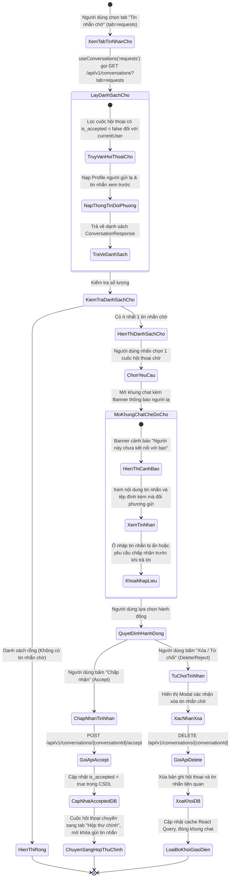
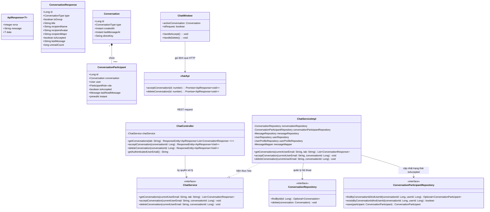
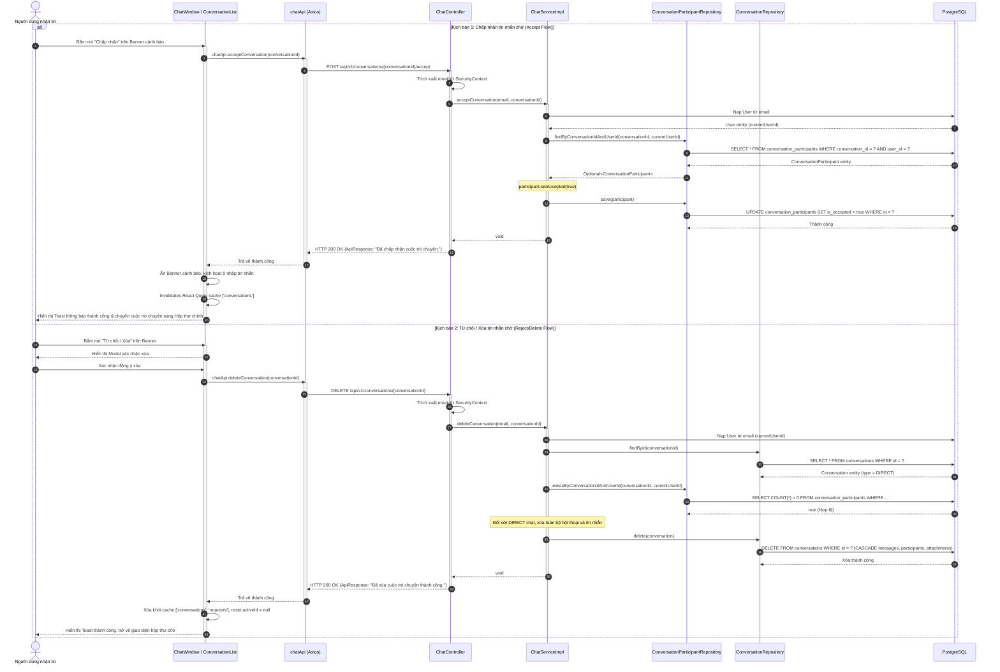

# ĐẶC TẢ YÊU CẦU & THIẾT KẾ CHI TIẾT: UC35 - QUẢN LÝ TIN NHẮN CHỜ TỪ NGƯỜI LẠ (MESSAGE REQUESTS)

## PHẦN 1: ĐẶC TẢ NGHIỆP VỤ (REPORT 3)

### 2.2.3 Business Workflow (Luồng nghiệp vụ)



#### Mô tả chi tiết luồng xử lý bằng chữ (Business Step Description):
* **Bước 1 - Khởi đầu**:
  * Khi người dùng truy cập màn hình Tin nhắn (`/app/messages`), nhấp chọn tab "Tin nhắn chờ" (Requests) trên thanh phân loại hội thoại.
  * Giao diện kích hoạt hook `useConversations('requests')` thực hiện gọi API `GET /api/v1/conversations?tab=requests`.
* **Bước 2 - Các bước chuyển tiếp**:
  * **Nạp danh sách tin nhắn chờ**:
    * Máy chủ truy vấn các cuộc hội thoại mà người dùng hiện tại tham gia có cờ `conversation_participants.is_accepted = false`.
    * Đây là các cuộc trò chuyện trực tiếp được khởi tạo khi một người dùng lạ (người mà người nhận chưa theo dõi/chưa kết nối) gửi tin nhắn đến lần đầu tiên (`isFollowedByRecipient = false`).
    * Nếu danh sách rỗng: Giao diện hiển thị thông báo "Không có tin nhắn chờ nào."
    * Nếu có dữ liệu: Hiển thị danh sách người lạ kèm ảnh đại diện, họ tên, chuyên ngành và trích dẫn tin nhắn họ đã gửi.
  * **Xem nội dung tin nhắn chờ**:
    * Khi người dùng nhấp chọn một thẻ yêu cầu từ danh sách, khung chat bên phải nạp lịch sử tin nhắn của cuộc hội thoại đó.
    * Phía trên khung chat (hoặc ngay dưới thanh tiêu đề) hiển thị một **Banner thông báo an toàn**: *"Người dùng này không nằm trong danh bạ hoặc người theo dõi của bạn. Họ sẽ không biết bạn đã xem tin nhắn cho đến khi bạn chấp nhận yêu cầu."*
    * Hai nút thao tác nhanh được hiển thị nổi bật trên banner hoặc thanh tác vụ:
      1. **Chấp nhận (Accept)**: Nút màu tím thương hiệu (`bg-brand-500` hover `bg-brand-600`), có biểu tượng dấu tích xanh `Check`.
      2. **Từ chối / Xóa (Delete/Reject)**: Nút màu đỏ nhạt (`text-rose-600` hover `bg-rose-50`), có biểu tượng thùng rác `Trash2`.
  * **Xử lý Chấp nhận (Accept)**:
    * Người dùng bấm nút "Chấp nhận".
    * Frontend gọi API `POST /api/v1/conversations/{conversationId}/accept`.
    * Backend nạp `ConversationParticipant` của người dùng đối với cuộc trò chuyện này, cập nhật `is_accepted = true` và lưu vào CSDL.
    * Phản hồi HTTP 200 OK thành công.
    * Frontend hiển thị Toast thông báo *"Đã chấp nhận cuộc trò chuyện."*, ẩn banner cảnh báo người lạ, mở khóa khung nhập tin nhắn đầy đủ và tự động chuyển cuộc trò chuyện sang tab "Hộp thư chính".
  * **Xử lý Từ chối / Xóa (Delete/Reject)**:
    * Người dùng bấm nút "Từ chối / Xóa".
    * Hiển thị Modal xác nhận cảnh báo: *"Bạn có chắc chắn muốn xóa tin nhắn chờ này? Cuộc trò chuyện và các tin nhắn sẽ bị xóa vĩnh viễn."*
    * Khi người dùng xác nhận, Frontend gọi API `DELETE /api/v1/conversations/{conversationId}`.
    * Backend kiểm tra quyền tham gia, tiến hành xóa cuộc hội thoại trực tiếp (`conversationRepository.delete(conversation)`) cùng toàn bộ tin nhắn liên quan theo cơ chế `ON DELETE CASCADE`.
    * Phản hồi HTTP 200 OK thành công.
    * Frontend loại bỏ cuộc hội thoại khỏi cache React Query `['conversations', 'requests']`, xóa trạng thái đang chọn và đưa khung chat về màn hình chờ rỗng.
* **Bước 3 - Kết thúc**:
  * Cuộc hội thoại hoặc đã trở thành hội thoại chính thức hai chiều (chấp nhận), hoặc đã bị dọn dẹp sạch sẽ khỏi hệ thống (từ chối), bảo vệ quyền riêng tư và tránh bị làm phiền bởi tin nhắn rác (spam).

---

### 3.2 Module Tin Nhắn & Trò Chuyện Trực Tiếp (Direct Messaging & Chat)

#### 3.2.1 Quản lý tin nhắn chờ từ người lạ (UC35 - Manage Message Requests)

**Function trigger**:
* **Navigation path**: `/app/messages` -> Nhấp chọn Tab "Tin nhắn chờ" (Requests).
* **Timing Frequency**: Khi người dùng chuyển sang tab Tin nhắn chờ hoặc khi nhận được thông báo có tin nhắn từ người chưa theo dõi.

**Function description**:
* **Actors/Roles**: Tất cả người dùng đã đăng nhập (`STUDENT`, `ALUMNI`).
* **Purpose**: Bảo vệ sự riêng tư của người dùng, phân tách các cuộc hội thoại từ bạn bè/người quen với tin nhắn từ người lạ, cho phép người dùng chủ động xem trước tin nhắn mà không để lộ trạng thái đã đọc, và quyết định tiếp nhận hoặc xóa bỏ cuộc hội thoại.
* **Interface**:
  * **Tab chuyển đổi "Tin nhắn chờ"**: Hiển thị số lượng tin nhắn chờ chưa xử lý dạng badge nếu có.
  * **Danh sách thẻ tin nhắn chờ**: Thể hiện avatar người gửi, họ tên, trích dẫn lời nhắn chào hỏi và thời gian gửi.
  * **Banner cảnh báo người lạ trong Chat Window**: Hộp thông báo màu vàng cam nhạt (`bg-amber-50 border-amber-200`) giải thích đây là tin nhắn chờ từ người lạ kèm 2 nút hành động:
    * Nút "Chấp nhận" (Accept): Kích hoạt chuyển vào Hộp thư chính.
    * Nút "Xóa / Từ chối" (Delete): Kích hoạt xóa vĩnh viễn tin nhắn chờ.
  * **Modal xác nhận xóa**: Cảnh báo thao tác hủy không thể phục hồi.

**Data processing**:
* Nạp danh sách hội thoại theo `isAccepted = false` tương ứng với tài khoản hiện tại.
* Khi Chấp nhận: Cập nhật trường `is_accepted = true` trong bảng `conversation_participants`.
* Khi Từ chối/Xóa: Thực hiện xóa bản ghi trong bảng `conversations` (kèm xóa cascade trong `conversation_participants`, `messages`, `message_attachments`).

**Screen layout**:
* Cột danh sách bên trái hiển thị danh sách các yêu cầu tin nhắn chờ.
* Khung nội dung bên phải hiển thị toàn bộ tin nhắn đã nhận, phía trên cùng hoặc dưới cùng là thanh công cụ hành động Chấp nhận / Xóa.

**Function details**:
* **Data**:
  * Tham số URL: `conversationId` (Long, bắt buộc, số nguyên dương).
* **Validation**:
  * Người dùng phải là thành viên hợp lệ của cuộc hội thoại đang thao tác.
  * `conversationId` phải tồn tại trong hệ thống.
* **Business rules**:
  * `BR-35-01`: Khi một người dùng gửi tin nhắn trực tiếp cho người khác mà đối phương chưa theo dõi (follow) mình, hệ thống tự động gán `conversation_participants.is_accepted = false` cho phía người nhận.
  * `BR-35-02`: Trong trạng thái tin nhắn chờ (`is_accepted = false`), tin nhắn chỉ hiển thị ở tab "Tin nhắn chờ" của người nhận và không làm phiền ở "Hộp thư chính".
  * `BR-35-03`: Người nhận có thể đọc tin nhắn trong tab Tin nhắn chờ mà không kích hoạt cập nhật trạng thái "Đã đọc" (Read receipt) về phía người gửi cho tới khi bấm Chấp nhận.
  * `BR-35-04`: Khi bấm Chấp nhận, cuộc hội thoại được đánh dấu `is_accepted = true` và chuyển sang tab "Hộp thư chính", cho phép hai bên trò chuyện hai chiều bình thường.
  * `BR-35-05`: Khi bấm Từ chối / Xóa, cuộc trò chuyện trực tiếp và toàn bộ tin nhắn bên trong bị xóa triệt để khỏi hệ thống.
* **Error Handling**:
  * `403 Forbidden`: Người dùng không phải là thành viên của cuộc hội thoại $\rightarrow$ Hiển thị Toast lỗi *"Bạn không có quyền thực hiện thao tác này."*
  * `404 Not Found`: Cuộc hội thoại không tồn tại $\rightarrow$ Hiển thị Toast lỗi *"Không tìm thấy cuộc hội thoại."*
* **Normal case**: Người dùng bấm Chấp nhận, cuộc trò chuyện chuyển sang Hộp thư chính ngay lập tức, Toast thông báo thành công.
* **Abnormal case**: Đang trong quá trình xem thì đối phương đã xóa tin nhắn hoặc tài khoản bị khóa $\rightarrow$ Hệ thống bắt ngoại lệ và thông báo cuộc hội thoại không còn khả dụng.

---

### 5. Requirement Appendix (Phụ lục Yêu cầu)

#### 5.1 Business Rules (Quy tắc Nghiệp vụ)

| ID | Định nghĩa Quy tắc (Rule Definition) |
| :--- | :--- |
| **BR-35-01** | Khi người gửi A nhắn tin cho người nhận B lần đầu tiên, nếu B chưa nhấn Follow A trên hệ thống, cuộc hội thoại được xếp vào danh mục Tin nhắn chờ của B (`participant.is_accepted = false`). |
| **BR-35-02** | Phía người gửi A luôn có `is_accepted = true`, cuộc trò chuyện xuất hiện bình thường trong danh sách của A. |
| **BR-35-03** | Chỉ người nhận (người có `is_accepted = false`) mới có quyền thực hiện hành động Chấp nhận (`POST /api/v1/conversations/{conversationId}/accept`). |
| **BR-35-04** | Khi chấp nhận thành công, cờ `is_accepted` chuyển thành `true` vĩnh viễn cho cuộc hội thoại này; những tin nhắn trao đổi sau này sẽ đi thẳng vào Hộp thư chính. |
| **BR-35-05** | Thao tác Xóa cuộc trò chuyện trực tiếp từ người lạ sẽ xóa sạch bản ghi hội thoại và toàn bộ tin nhắn liên quan khỏi CSDL. |

#### 5.2 Common Requirements (Yêu cầu Chung)
* Giao diện bảo đảm tính trực quan, nút Chấp nhận và Từ chối có độ tương phản cao, thao tác một chạm dễ dàng.
* Mọi hành động phá hủy dữ liệu (Xóa tin nhắn chờ) bắt buộc phải có bước xác nhận qua hộp thoại cảnh báo (Confirmation Modal).
* Thời gian phản hồi của API Accept/Delete phải dưới 100ms.

#### 5.3 Application Messages List (Danh sách Thông điệp Ứng dụng)

| # | Mã thông điệp | Loại thông điệp | Ngữ cảnh | Nội dung hiển thị |
| :--- | :--- | :--- | :--- | :--- |
| 1 | `MSG-REQ-01` | Toast message | Chấp nhận tin nhắn chờ thành công | Đã chấp nhận cuộc trò chuyện. |
| 2 | `MSG-REQ-02` | Toast message | Xóa/từ chối tin nhắn chờ thành công | Đã xóa cuộc trò chuyện thành công. |
| 3 | `MSG-REQ-03` | Modal confirm | Xác nhận từ chối/xóa tin nhắn chờ | Bạn có chắc chắn muốn xóa tin nhắn chờ này? Cuộc trò chuyện sẽ bị xóa vĩnh viễn. |
| 4 | `MSG-REQ-04` | Banner text | Cảnh báo trong khung chat tin nhắn chờ | Người này không nằm trong danh sách bạn bè / người theo dõi của bạn. |
| 5 | `MSG-REQ-05` | Inline message | Tab tin nhắn chờ rỗng | Không có tin nhắn chờ nào. |
| 6 | `MSG-REQ-06` | Toast message | Không có quyền thao tác | Bạn không có quyền thao tác trên cuộc hội thoại này. |

---

## PHẦN 2: THIẾT KẾ CHI TIẾT (REPORT 4)

### 3. Detail Design (Thiết kế chi tiết)

#### 3.1 Quản lý tin nhắn chờ từ người lạ (UC35 - Manage Message Requests)

##### 3.1.1 Class Diagram (Sơ đồ Lớp)



##### 3.1.2 Sequence Diagram (Sơ đồ Tuần tự Gộp)



##### 3.1.3 Thiết kế Cơ sở Dữ liệu & Ràng buộc (Database Schema Design)

Phân hệ tin nhắn chờ được hiện thực dựa trên trường `is_accepted` thuộc bảng `conversation_participants` (được bổ sung từ migration `V3__add_group_chat_and_stranger_features.sql`):

```sql
-- Trích đoạn migration V3 liên quan đến tính năng Tin nhắn chờ:
ALTER TABLE conversation_participants 
ADD COLUMN IF NOT EXISTS is_accepted BOOLEAN NOT NULL DEFAULT true;

CREATE INDEX IF NOT EXISTS idx_conversation_participants_accepted 
ON conversation_participants (is_accepted);
```

* **Ý nghĩa nghiệp vụ**:
  * Khi người dùng A gửi tin nhắn cho người dùng B:
    * Bản ghi của A: `is_accepted = true` (Người gửi luôn chủ động chấp nhận cuộc trò chuyện).
    * Bản ghi của B: Nếu B đã Follow A thì `is_accepted = true`; nếu B chưa Follow A (người lạ) thì `is_accepted = false`.
  * Khi B xem tab Tin nhắn chờ (`tab=requests`), câu truy vấn lọc theo điều kiện:
    ```sql
    SELECT c.* FROM conversations c
    JOIN conversation_participants cp ON c.id = cp.conversation_id
    WHERE cp.user_id = :currentUserId AND cp.is_accepted = false;
    ```
  * Khi B bấm Chấp nhận:
    ```sql
    UPDATE conversation_participants 
    SET is_accepted = true 
    WHERE conversation_id = :conversationId AND user_id = :currentUserId;
    ```

##### 3.1.4 Đặc tả API Endpoint (API Specification)

###### 1. Chấp nhận cuộc trò chuyện từ người lạ:
* **URL**: `POST /api/v1/conversations/{conversationId}/accept`
* **Path Variables**:
  * `conversationId` (Long, bắt buộc): Mã cuộc hội thoại cần chấp nhận.
* **Tiêu đề Request**:
  * `Authorization`: `Bearer <jwt_access_token>`
* **Phản hồi thành công (HTTP 200 OK)**:
  ```json
  {
    "error": 0,
    "message": "Đã chấp nhận cuộc trò chuyện.",
    "data": null
  }
  ```
* **Phản hồi lỗi (HTTP 404 Not Found)**:
  ```json
  {
    "error": -1,
    "message": "Bạn không phải là thành viên của cuộc hội thoại này.",
    "data": null
  }
  ```

###### 2. Xóa / Từ chối cuộc trò chuyện:
* **URL**: `DELETE /api/v1/conversations/{conversationId}`
* **Path Variables**:
  * `conversationId` (Long, bắt buộc): Mã cuộc hội thoại cần xóa.
* **Tiêu đề Request**:
  * `Authorization`: `Bearer <jwt_access_token>`
* **Phản hồi thành công (HTTP 200 OK)**:
  ```json
  {
    "error": 0,
    "message": "Đã xóa cuộc trò chuyện thành công.",
    "data": null
  }
  ```
* **Phản hồi lỗi quyền hạn (HTTP 403 Forbidden)**:
  ```json
  {
    "error": -1,
    "message": "Bạn không có quyền xóa cuộc hội thoại này.",
    "data": null
  }
  ```
