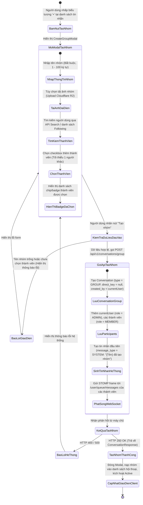
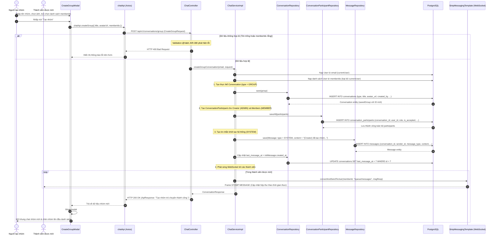

# ĐẶC TẢ YÊU CẦU & THIẾT KẾ CHI TIẾT: UC36 - KHỞI TẠO NHÓM TRÒ CHUYỆN (CREATE GROUP CHAT)

## PHẦN 1: ĐẶC TẢ NGHIỆP VỤ (REPORT 3)

> [!NOTE]
> **Phân biệt phạm vi:** Use Case này (UC36) đặc tả việc người dùng tự do khởi tạo nhóm trò chuyện bạn bè/học tập thông thường từ mục Tin nhắn (`/app/messages`). Đối với nhóm trò chuyện trực thuộc **Hội nhóm sinh viên (Community Group Chat)** gắn liền với vòng đời hội nhóm, quy trình khởi tạo được đặc tả chi tiết tại tài liệu riêng [SRS_UC_CommunityGroupChat.md](file:///d:/Alumnect/docs/update_SRS/SRS_UC_CommunityGroupChat.md).

### 2.2.3 Business Workflow (Luồng nghiệp vụ)



#### Mô tả chi tiết luồng xử lý bằng chữ (Business Step Description):
* **Bước 1 - Khởi đầu**:
  * Người dùng (đã đăng nhập, trạng thái `ACTIVE`) truy cập màn hình Tin nhắn (`/app/messages`).
  * Người dùng nhấp vào biểu tượng dấu cộng `+` bên cạnh tiêu đề hộp thư "Tin nhắn" để mở cửa sổ tạo nhóm (`CreateGroupModal`).
* **Bước 2 - Các bước chuyển tiếp**:
  * **Nhập liệu thông tin nhóm**:
    * Người dùng nhập "Tên nhóm trò chuyện" (bắt buộc, độ dài từ 1 đến 100 ký tự).
    * Tùy chọn tải lên ảnh đại diện nhóm thông qua nút chọn ảnh; ảnh được tải lên đám mây Cloudflare R2 và lấy URL trả về gán vào `avatarUrl`.
  * **Chọn thành viên tham gia**:
    * Hệ thống hiển thị thanh tìm kiếm thành viên kèm danh sách gợi ý bạn bè / người đang theo dõi (Following).
    * Người dùng tìm kiếm bằng tên hoặc email (tự động loại bỏ chính mình khỏi kết quả tìm kiếm).
    * Khi nhấp chọn thành viên, thành viên đó xuất hiện dưới dạng Chip/Badge phía trên danh sách có kèm ảnh đại diện nhỏ và nút `x` để gỡ bỏ nhanh.
    * Quy tắc: Bắt buộc chọn ít nhất 1 thành viên khác ngoài người tạo nhóm.
  * **Gửi yêu cầu tạo nhóm**:
    * Người dùng nhấn nút "Tạo nhóm" (`bg-brand-500`).
    * Hệ thống kiểm tra dữ liệu đầu vào phía Client:
      * Nếu tên nhóm bị bỏ trống, hệ thống hiển thị thông báo lỗi: *"Vui lòng nhập tên nhóm trò chuyện."*.
      * Nếu chưa chọn thành viên nào, hệ thống hiển thị thông báo lỗi: *"Vui lòng chọn ít nhất 1 thành viên khác vào nhóm."*.
    * Khi dữ liệu hợp lệ, nút chuyển sang trạng thái đang tải (Loading Spinner).
    * Hệ thống đóng gói dữ liệu yêu cầu theo mẫu `CreateGroupRequest` (`{ title, avatarUrl, memberIds }`) và gửi yêu cầu tạo nhóm qua API `POST /api/v1/conversations/group`.
  * **Xử lý nghiệp vụ tại Backend**:
    * Spring Boot thẩm định dữ liệu `@Valid CreateGroupRequest` (`@NotBlank`, `@Size(min = 1, max = 100)`).
    * Lọc danh sách `memberIds`: loại bỏ ID của người tạo (nếu vô tình gửi kèm) và loại bỏ các ID trùng lặp.
    * Tạo bản ghi mới trong bảng `conversations`: `type = 'GROUP'`, `title = request.getTitle()`, `avatar_url = request.getAvatarUrl()`, `created_by = currentUser`, `direct_key = NULL`.
    * Thêm các bản ghi thành viên vào bảng `conversation_participants`:
      * Bản ghi người tạo: `role = 'ADMIN'`, `is_accepted = true`.
      * Các bản ghi thành viên được mời: `role = 'MEMBER'`, `is_accepted = true`.
    * Tự động sinh tin nhắn hệ thống khởi tạo trong bảng `messages`:
      * `message_type = 'SYSTEM'`.
      * `sender_id = currentUser.getId()`.
      * `content = creatorFullName + " đã tạo nhóm \"" + groupTitle + "\""`.
    * Cập nhật `last_message_at` của cuộc hội thoại bằng thời điểm tin nhắn hệ thống vừa tạo.
    * Sử dụng `SimpMessagingTemplate` phát sóng thời gian thực thông điệp khởi tạo tới kênh riêng `/user/queue/messages` của từng thành viên được mời.
* **Bước 3 - Kết thúc**:
  * API trả về HTTP 200 OK kèm đối tượng `ConversationResponse` đầy đủ thông tin nhóm.
  * Frontend hiển thị thông báo Toast thành công: *"Tạo nhóm trò chuyện thành công!"*, đóng modal tạo nhóm, tự động cập nhật cache React Query `['conversations', 'primary']`, đưa nhóm mới lên đầu danh sách hội thoại và chuyển ngay khung chat bên phải sang cuộc trò chuyện nhóm vừa tạo.

---

### 3.2 Module Tin Nhắn & Trò Chuyện Trực Tiếp (Direct Messaging & Chat)

#### 3.2.1 Khởi tạo nhóm trò chuyện mới (UC36 - Create Group Chat)

**Function trigger**:
* **Navigation path**: `/app/messages` -> Nhấp nút "+" tại thanh tiêu đề danh sách hội thoại.
* **Timing Frequency**: Theo nhu cầu người dùng (On demand).

**Function description**:
* **Actors/Roles**: Tất cả người dùng đã đăng nhập và được kích hoạt (`STUDENT`, `ALUMNI`).
* **Purpose**: Cho phép các thành viên tạo không gian trao đổi chung cho nhóm học tập, câu lạc bộ, dự án nghiên cứu hoặc cựu sinh viên cùng lớp/khóa.
* **Interface**:
  * **Cửa sổ Modal "Tạo nhóm trò chuyện" (CreateGroupModal)**:
    * Khung tải ảnh đại diện nhóm: Vùng tròn cho phép nhấp để upload ảnh đại diện (kích thước tối đa 5MB).
    * Trường nhập tên nhóm: Ô văn bản kèm placeholder *"Nhập tên nhóm trò chuyện..."*, có bộ đếm ký tự (1 - 100 ký tự).
    * Vùng hiển thị thành viên đã chọn: Các chip tag hiển thị tên + nút xóa nhỏ.
    * Ô tìm kiếm thành viên: Nhập tên/email để lọc danh sách người dùng.
    * Danh sách kết quả tìm kiếm/gợi ý bạn bè: Thẻ người dùng có checkbox hoặc nút "Chọn".
    * Nút "Hủy": Đóng modal mà không lưu.
    * Nút "Tạo nhóm": Nút chính màu tím nổi bật, bị vô hiệu hóa (disabled) nếu đang trong quá trình gửi yêu cầu.

**Data processing**:
* Tiếp nhận `CreateGroupRequest` gồm `title`, `avatarUrl`, `memberIds`.
* Thẩm định: `title` không rỗng (1 - 100 ký tự), `memberIds` không rỗng sau khi loại bỏ người tạo.
* Gán người tạo quyền `ADMIN` trong nhóm.
* Tự động sinh tin nhắn hệ thống chào mừng dạng `SYSTEM` để hiển thị trong khung chat và danh sách hộp thư.
* Phát sóng WebSocket thông báo cho các thành viên.

**Screen layout**:
* Modal kích thước chuẩn (max-w-md hoặc max-w-lg) căn giữa màn hình với nền mờ backdrop-blur-md, hiệu ứng xuất hiện mượt mà.

**Function details**:
* **Data**:
  * Input: `title` (String, bắt buộc), `avatarUrl` (String, tùy chọn), `memberIds` (List<Long>, bắt buộc).
  * Output: `ConversationResponse` của nhóm vừa tạo.
* **Validation**:
  * `title`: Không được rỗng, tối thiểu 2 ký tự, tối đa 100 ký tự.
  * `memberIds`: Phải chứa ít nhất 1 mã người dùng hợp lệ khác người tạo.
* **Business rules**:
  * `BR-36-01`: Người tạo nhóm tự động trở thành Quản trị viên nhóm (`role = ADMIN`).
  * `BR-36-02`: Các thành viên được mời có vai trò ban đầu là Thành viên thường (`role = MEMBER`).
  * `BR-36-03`: Cuộc hội thoại nhóm có `type = GROUP` và không có `direct_key` (`direct_key = NULL`).
  * `BR-36-04`: Toàn bộ thành viên trong nhóm ban đầu đều có trạng thái `is_accepted = true`, nhóm xuất hiện ngay trong tab "Hộp thư chính" của tất cả các thành viên.
  * `BR-36-05`: Tin nhắn khởi tạo đầu tiên của nhóm bắt buộc là tin nhắn hệ thống có `message_type = SYSTEM` ghi nhận sự kiện người tạo lập nhóm.
* **Error Handling**:
  * `400 Bad Request`: Tên nhóm không hợp lệ hoặc không có thành viên được chọn $\rightarrow$ Trả về mã lỗi kèm nội dung nhắc nhở.
  * `404 Not Found`: Không tìm thấy các người dùng được chọn trong CSDL $\rightarrow$ Thông báo người dùng không tồn tại.
* **Normal case**: Tạo nhóm thành công trong dưới 300ms, modal đóng, nhóm mở ra ngay trên giao diện chat.
* **Abnormal case**: Lỗi upload ảnh đại diện $\rightarrow$ Modal hiển thị cảnh báo lỗi tải ảnh, người dùng có thể thử lại hoặc tạo nhóm không ảnh đại diện.

---

### 5. Requirement Appendix (Phụ lục Yêu cầu)

#### 5.1 Business Rules (Quy tắc Nghiệp vụ)

| ID | Định nghĩa Quy tắc (Rule Definition) |
| :--- | :--- |
| **BR-36-01** | Bất kỳ người dùng có tài khoản `ACTIVE` đều có quyền tạo nhóm trò chuyện mới. |
| **BR-36-02** | Số lượng thành viên tối thiểu của nhóm là 2 người (bao gồm người tạo và ít nhất 1 thành viên khác). |
| **BR-36-03** | Người tạo nhóm ban đầu là người duy nhất sở hữu vai trò Trưởng nhóm (`ADMIN`) và được lưu vết tại trường `created_by` của bảng `conversations`. |
| **BR-36-04** | Khi tạo nhóm, hệ thống phát sóng sự kiện qua WebSocket để toàn bộ thành viên nhận được nhóm mới theo thời gian thực mà không cần tải lại trang. |

#### 5.2 Common Requirements (Yêu cầu Chung)
* Giao diện chọn thành viên mượt mà, hỗ trợ tìm kiếm không dấu (UC39) để tìm nhanh bạn bè.
* Modal hiển thị sắc nét trên cả giao diện di động lẫn máy tính để bàn.
* Ảnh nhóm tải lên phải được tự động tối ưu hóa và lưu trữ an toàn trên CDN Cloudflare R2.

#### 5.3 Application Messages List (Danh sách Thông điệp Ứng dụng)

| # | Mã thông điệp | Loại thông điệp | Ngữ cảnh | Nội dung hiển thị |
| :--- | :--- | :--- | :--- | :--- |
| 1 | `MSG-GRP-01` | Toast message | Tạo nhóm thành công | Tạo nhóm trò chuyện thành công! |
| 2 | `MSG-GRP-02` | Toast error | Tên nhóm rỗng khi bấm Tạo nhóm | Vui lòng nhập tên nhóm trò chuyện. |
| 3 | `MSG-GRP-03` | Backend error | Tên nhóm < 1 ký tự hoặc > 100 ký tự | Tên nhóm phải từ 1 đến 100 ký tự |
| 4 | `MSG-GRP-04` | Toast error | Chưa chọn thành viên nào | Vui lòng chọn ít nhất 1 thành viên khác vào nhóm. |
| 5 | `MSG-GRP-05` | System Message | Tin nhắn khởi tạo nhóm | {Tên người tạo} đã tạo nhóm "{Tên nhóm}". |

---

## PHẦN 2: THIẾT KẾ CHI TIẾT (REPORT 4)

### 3. Detail Design (Thiết kế chi tiết)

#### 3.1 Khởi tạo nhóm trò chuyện mới (UC36 - Create Group Chat)

##### 3.1.1 Class Diagram (Sơ đồ Lớp)

```mermaid
classDiagram
    %% Tầng Controller
    class ChatController {
        -ChatService chatService
        +createGroup(request: CreateGroupRequest) ResponseEntity~ApiResponse~ConversationResponse~~~~
        -getAuthenticatedUserEmail() String
    }

    %% Tầng DTO
    class CreateGroupRequest {
        +String title
        +String avatarUrl
        +List~Long~ memberIds
    }

    class ConversationResponse {
        +Long id
        +ConversationType type
        +boolean isGroup
        +String title
        +String avatarUrl
        +int memberCount
        +Long adminId
        +String lastMessage
    }

    %% Tầng Service
    class ChatService {
        <<interface>>
        +createGroupConversation(currentUserEmail: String, request: CreateGroupRequest) ConversationResponse
    }

    class ChatServiceImpl {
        -ConversationRepository conversationRepository
        -ConversationParticipantRepository conversationParticipantRepository
        -MessageRepository messageRepository
        -UserRepository userRepository
        -UserProfileRepository userProfileRepository
        -MessageMapper messageMapper
        -SimpMessagingTemplate messagingTemplate
        +createGroupConversation(currentUserEmail: String, request: CreateGroupRequest) ConversationResponse
    }

    %% Tầng Entity CSDL
    class Conversation {
        +Long id
        +ConversationType type
        +String title
        +String avatarUrl
        +User createdBy
        +Instant createdAt
        +Instant lastMessageAt
        +String directKey
    }

    class ConversationParticipant {
        +Long id
        +Conversation conversation
        +User user
        +ParticipantRole role
        +boolean isAccepted
        +Instant joinedAt
    }

    class Message {
        +Long id
        +Conversation conversation
        +User sender
        +MessageType type
        +String content
        +Instant createdAt
    }

    %% Tầng Frontend
    class CreateGroupModal {
        +isOpen: boolean
        +onClose(): void
        +onSuccess(group: Conversation): void
        +handleSubmit(): void
    }

    class useCreateGroup {
        +mutate(params: { payload: CreateGroupRequest }): void
        +isLoading: boolean
    }

    class chatApi {
        +createGroup(req: CreateGroupRequest): Promise~ApiResponse~Conversation~~~~
    }

    ChatController ..> CreateGroupRequest : tiếp nhận & kiểm thực
    ChatController --> ChatService : ủy quyền xử lý
    ChatServiceImpl ..|> ChatService : hiện thực hóa
    ChatServiceImpl --> ConversationRepository : lưu Conversation
    ChatServiceImpl --> ConversationParticipantRepository : lưu thành viên
    ChatServiceImpl --> MessageRepository : lưu tin nhắn hệ thống
    Conversation "1" *-- "many" ConversationParticipant : chứa
    CreateGroupModal --> useCreateGroup : kích hoạt mutation
    useCreateGroup --> chatApi : gọi POST /conversations/group
```

##### 3.1.2 Sequence Diagram (Sơ đồ Tuần tự Gộp)



##### 3.1.3 Thiết kế Cơ sở Dữ liệu & Ràng buộc (Database Schema Design)

Tính năng Nhóm trò chuyện sử dụng cấu trúc bảng `conversations` và `conversation_participants` được mở rộng theo migration `V3__add_group_chat_and_stranger_features.sql`:

```sql
-- Cột mở rộng trên bảng conversations:
ALTER TABLE conversations 
ADD COLUMN IF NOT EXISTS type VARCHAR(20) NOT NULL DEFAULT 'DIRECT' 
    CHECK (type IN ('DIRECT', 'GROUP')),
ADD COLUMN IF NOT EXISTS title VARCHAR(255),
ADD COLUMN IF NOT EXISTS avatar_url VARCHAR(500),
ADD COLUMN IF NOT EXISTS created_by BIGINT REFERENCES users(id) ON DELETE SET NULL;

-- Cột vai trò trên bảng conversation_participants:
ALTER TABLE conversation_participants 
ADD COLUMN IF NOT EXISTS role VARCHAR(20) NOT NULL DEFAULT 'MEMBER' 
    CHECK (role IN ('ADMIN', 'MEMBER'));
```

##### 3.1.4 Đặc tả API Endpoint (API Specification)

* **URL**: `POST /api/v1/conversations/group`
* **Tiêu đề Request**:
  * `Authorization`: `Bearer <jwt_access_token>`
  * `Content-Type`: `application/json`
* **Body Request**:
  ```json
  {
    "title": "Nhóm Đồ Án Tốt Nghiệp K16",
    "avatarUrl": "https://pub.alumnect.edu.vn/groups/group_doan.png",
    "memberIds": [2, 5, 8]
  }
  ```
* **Phản hồi thành công (HTTP 200 OK)**:
  ```json
  {
    "error": 0,
    "message": "Tạo nhóm trò chuyện thành công.",
    "data": {
      "id": 15,
      "type": "GROUP",
      "isGroup": true,
      "title": "Nhóm Đồ Án Tốt Nghiệp K16",
      "avatarUrl": "https://pub.alumnect.edu.vn/groups/group_doan.png",
      "createdAt": "2026-09-29T10:00:00Z",
      "lastMessageAt": "2026-09-29T10:00:00Z",
      "recipientId": null,
      "recipientName": "Nhóm Đồ Án Tốt Nghiệp K16",
      "recipientAvatar": "https://pub.alumnect.edu.vn/groups/group_doan.png",
      "recipientMajor": null,
      "memberCount": 4,
      "isAccepted": true,
      "adminId": 1,
      "lastMessage": "Nguyen Thanh An đã tạo nhóm \"Nhóm Đồ Án Tốt Nghiệp K16\"",
      "unreadCount": 0
    }
  }
  ```
* **Phản hồi lỗi tham số (HTTP 400 Bad Request)**:
  ```json
  {
    "error": -1,
    "message": "Tên nhóm không được để trống",
    "data": null
  }
  ```
