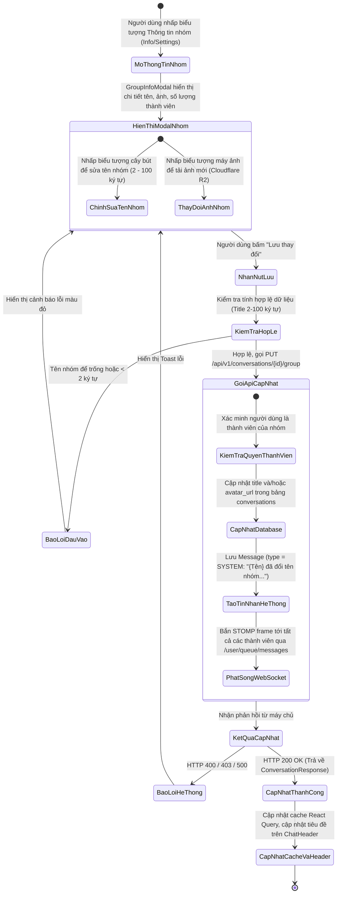
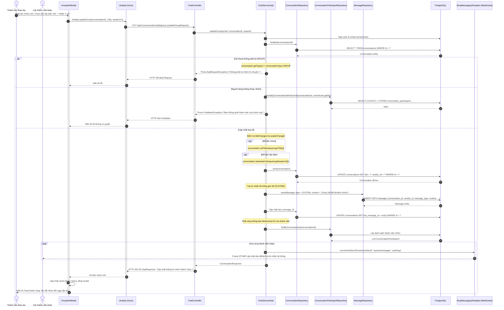

# ĐẶC TẢ YÊU CẦU & THIẾT KẾ CHI TIẾT: UC37 - CẬP NHẬT THÔNG TIN NHÓM TRÒ CHUYỆN (UPDATE GROUP PROFILE)

## PHẦN 1: ĐẶC TẢ NGHIỆP VỤ (REPORT 3)

### 2.2.3 Business Workflow (Luồng nghiệp vụ)



#### Mô tả chi tiết luồng xử lý bằng chữ (Business Step Description):
* **Bước 1 - Khởi đầu**:
  * Người dùng đang mở một cuộc trò chuyện nhóm (`type = GROUP`) trong màn hình Tin nhắn (`/app/messages`).
  * Người dùng nhấp vào tiêu đề nhóm hoặc nút biểu tượng "Thông tin nhóm" (Information / Settings) trên thanh công cụ trên cùng của khung chat (`ChatWindow Header`).
  * Hệ thống mở hộp thoại thông tin nhóm (`GroupInfoModal`).
* **Bước 2 - Các bước chuyển tiếp**:
  * **Chỉnh sửa tên và ảnh đại diện nhóm**:
    * Người dùng có thể nhấn vào ảnh đại diện nhóm để chọn tệp hình ảnh mới từ máy tính/điện thoại. File ảnh được tải trực tiếp lên Cloudflare R2 qua API Upload và trả về đường dẫn công khai `avatarUrl`.
    * Người dùng có thể nhấn nút "Chỉnh sửa" bên cạnh tên nhóm để chuyển sang chế độ chỉnh sửa trực tiếp (Inline Editing), nhập tên mới (độ dài từ 2 đến 100 ký tự).
  * **Gửi yêu cầu cập nhật**:
    * Người dùng nhấn nút "Lưu thay đổi" (Save).
    * Frontend đóng gói payload JSON theo mẫu `UpdateGroupRequest` (`{ title, avatarUrl }`) và gọi API `PUT /api/v1/conversations/{conversationId}/group`.
  * **Xử lý nghiệp vụ tại Backend**:
    * Kiểm tra định dạng tham số `conversationId` và dữ liệu request.
    * Kiểm tra tồn tại của cuộc hội thoại và đảm bảo cuộc hội thoại có `type = GROUP`.
    * Thẩm định quyền: Kiểm tra người gửi request có phải là thành viên hợp lệ của nhóm thông qua `conversationParticipantRepository.existsByConversationIdAndUserId`.
    * So sánh sự thay đổi:
      * Nếu tên nhóm thay đổi (`titleChanged = true`): Cập nhật `conversation.title`.
      * Nếu ảnh đại diện nhóm thay đổi (`avatarChanged = true`): Cập nhật `conversation.avatarUrl`.
    * Lưu thay đổi vào CSDL thông qua `conversationRepository.save(conversation)`.
    * **Tạo tin nhắn hệ thống ghi vết**:
      * Nếu đổi tên nhóm: Sinh tin nhắn hệ thống có `message_type = SYSTEM`, nội dung: `"{Họ tên} đã đổi tên nhóm thành \"{Tên nhóm mới}\""`.
      * Nếu đổi ảnh đại diện: Sinh tin nhắn hệ thống có `message_type = SYSTEM`, nội dung: `"{Họ tên} đã cập nhật ảnh đại diện nhóm"`.
      * Cập nhật thời điểm `last_message_at` của cuộc hội thoại bằng thời điểm tin nhắn hệ thống phát sinh.
    * **Đồng bộ hóa thời gian thực qua WebSocket**:
      * Gửi thông điệp STOMP chứa nội dung tin nhắn hệ thống tới kênh `/user/queue/messages` của toàn bộ các thành viên khác trong nhóm.
* **Bước 3 - Kết thúc**:
  * API trả về HTTP 200 OK kèm đối tượng `ConversationResponse` đã cập nhật.
  * Frontend hiển thị Toast thông báo *"Cập nhật thông tin nhóm thành công."*, cập nhật lại tên và ảnh đại diện trên thanh tiêu đề `ChatHeader` cũng như trong danh sách hội thoại bên trái.
  * Tất cả các thành viên khác đang online lập tức nhìn thấy tên/ảnh nhóm mới cùng dòng tin nhắn thông báo hệ thống màu xám mờ xuất hiện ở giữa dòng thời gian chat.

---

### 3.2 Module Tin Nhắn & Trò Chuyện Trực Tiếp (Direct Messaging & Chat)

#### 3.2.1 Cập nhật thông tin nhóm trò chuyện (UC37 - Update Group Profile)

**Function trigger**:
* **Navigation path**: `/app/messages` -> Chọn nhóm trò chuyện -> Bấm nút Info trên Chat Header -> Modal Thông tin nhóm.
* **Timing Frequency**: Theo nhu cầu người dùng (On demand).

**Function description**:
* **Actors/Roles**: Tất cả thành viên tham gia nhóm trò chuyện (`STUDENT`, `ALUMNI`).
* **Purpose**: Cho phép các thành viên cập nhật tên đại diện và hình ảnh của nhóm để phù hợp với tiến độ dự án, chủ đề trao đổi hoặc làm mới diện mạo nhóm.
* **Interface**:
  * **Khung ảnh đại diện nhóm (Group Avatar)**: Kèm biểu tượng máy ảnh nhỏ (Camera icon) để tải ảnh mới lên.
  * **Trường tên nhóm (Group Title)**: Có nút cây bút "Chỉnh sửa", khi bấm sẽ hiển thị ô text input kèm 2 nút "Lưu" (dấu tích xanh) và "Hủy" (dấu x đỏ).
  * **Thanh trạng thái lưu**: Spinner hiển thị khi đang trong quá trình upload ảnh hoặc gọi API cập nhật.

**Data processing**:
* Tiếp nhận `UpdateGroupRequest` gồm `title` và/hoặc `avatarUrl`.
* Xác thực quyền thành viên của người gọi API.
* Cập nhật thuộc tính `title` và `avatar_url` của bản ghi trong bảng `conversations`.
* Sinh tin nhắn sự kiện `message_type = SYSTEM` và gửi broadcast WebSocket STOMP.

**Screen layout**:
* Modal kích thước trung bình hiển thị giữa màn hình với bố cục: Header nhóm (Avatar lớn, tên nhóm, số thành viên) -> Thao tác cập nhật -> Danh sách thành viên nhóm.

**Function details**:
* **Data**:
  * Tham số URL: `conversationId` (Long, bắt buộc).
  * Request Body: `title` (String, tùy chọn, 2-100 ký tự), `avatarUrl` (String, tùy chọn).
  * Response: `ConversationResponse`.
* **Validation**:
  * `conversationId` phải thuộc về cuộc trò chuyện dạng `GROUP`.
  * `title`: Nếu cung cấp thì độ dài phải từ 2 đến 100 ký tự.
* **Business rules**:
  * `BR-37-01`: Bất kỳ thành viên nào đang tham gia trong nhóm đều có quyền cập nhật tên nhóm và ảnh đại diện nhóm.
  * `BR-37-02`: Hành động thay đổi tên nhóm hoặc ảnh nhóm đều được ghi lại thành một tin nhắn hệ thống (`message_type = SYSTEM`) trong cuộc trò chuyện để đảm bảo tính minh bạch.
  * `BR-37-03`: Thời điểm phát sinh tin nhắn hệ thống cập nhật thông tin nhóm sẽ cập nhật lại thuộc tính `last_message_at`, đưa nhóm lên đầu danh sách hội thoại.
* **Error Handling**:
  * `400 Bad Request`: Cuộc trò chuyện không phải là nhóm hoặc dữ liệu tên nhóm vi phạm validation $\rightarrow$ Báo lỗi cụ thể.
  * `403 Forbidden`: Người dùng không phải là thành viên của nhóm $\rightarrow$ Báo lỗi không có quyền.
  * `404 Not Found`: Không tìm thấy mã cuộc hội thoại $\rightarrow$ Báo lỗi tài nguyên không tồn tại.
* **Normal case**: Cập nhật tên/ảnh thành công, phản hồi dưới 150ms, giao diện cập nhật ngay lập tức.
* **Abnormal case**: Đang cập nhật thì bị Admin xóa khỏi nhóm $\rightarrow$ Hệ thống trả về lỗi 403 Forbidden, giao diện đóng modal và thông báo người dùng không còn trong nhóm.

---

### 5. Requirement Appendix (Phụ lục Yêu cầu)

#### 5.1 Business Rules (Quy tắc Nghiệp vụ)

| ID | Định nghĩa Quy tắc (Rule Definition) |
| :--- | :--- |
| **BR-37-01** | Chỉ áp dụng cho cuộc trò chuyện có `type = GROUP`. Không thể cập nhật thông tin nhóm cho cuộc trò chuyện trực tiếp 1-1 (`type = DIRECT`). |
| **BR-37-02** | Tất cả các thành viên hiện tại của nhóm đều có quyền đổi tên nhóm và đổi ảnh nhóm. |
| **BR-37-03** | Mọi sự kiện cập nhật đều tự động sinh ra tin nhắn hệ thống mang nhãn `SYSTEM` để thông báo cho toàn bộ thành viên. |
| **BR-37-04** | Toàn bộ thành viên khác đang online sẽ nhận được thông báo thời gian thực qua WebSocket và giao diện tự động cập nhật tên/ảnh mới mà không cần F5. |

#### 5.2 Common Requirements (Yêu cầu Chung)
* Định dạng ảnh đại diện hỗ trợ: PNG, JPG, JPEG, WebP với dung lượng không quá 5MB.
* Các ký tự khoảng trắng thừa ở đầu và cuối tên nhóm phải được tự động cắt gọt (trim).
* Thông điệp hệ thống hiển thị trang nhã, căn giữa khung chat, màu xám nhạt trung tính.

#### 5.3 Application Messages List (Danh sách Thông điệp Ứng dụng)

| # | Mã thông điệp | Loại thông điệp | Ngữ cảnh | Nội dung hiển thị |
| :--- | :--- | :--- | :--- | :--- |
| 1 | `MSG-GRP-EDIT-01` | Toast message | Cập nhật thông tin nhóm thành công | Cập nhật thông tin nhóm thành công. |
| 2 | `MSG-GRP-EDIT-02` | In red, dưới ô nhập | Tên nhóm < 2 ký tự hoặc > 100 ký tự | Tên nhóm phải từ 2 đến 100 ký tự. |
| 3 | `MSG-GRP-EDIT-03` | Toast message | Người dùng không phải thành viên | Bạn không phải thành viên của nhóm này. |
| 4 | `MSG-GRP-EDIT-04` | System message | Đổi tên nhóm | {Tên người dùng} đã đổi tên nhóm thành "{Tên mới}". |
| 5 | `MSG-GRP-EDIT-05` | System message | Đổi ảnh đại diện nhóm | {Tên người dùng} đã cập nhật ảnh đại diện nhóm. |

---

## PHẦN 2: THIẾT KẾ CHI TIẾT (REPORT 4)

### 3. Detail Design (Thiết kế chi tiết)

#### 3.1 Cập nhật thông tin nhóm trò chuyện (UC37 - Update Group Profile)

##### 3.1.1 Class Diagram (Sơ đồ Lớp)

```mermaid
classDiagram
    %% Tầng Controller
    class ChatController {
        -ChatService chatService
        +updateGroup(conversationId: Long, request: UpdateGroupRequest) ResponseEntity~ApiResponse~ConversationResponse~~~~
        -getAuthenticatedUserEmail() String
    }

    %% Tầng DTO
    class UpdateGroupRequest {
        +String title
        +String avatarUrl
    }

    class ConversationResponse {
        +Long id
        +ConversationType type
        +boolean isGroup
        +String title
        +String avatarUrl
        +Instant lastMessageAt
        +int memberCount
        +String lastMessage
    }

    %% Tầng Service
    class ChatService {
        <<interface>>
        +updateGroup(currentUserEmail: String, conversationId: Long, request: UpdateGroupRequest) ConversationResponse
    }

    class ChatServiceImpl {
        -ConversationRepository conversationRepository
        -ConversationParticipantRepository conversationParticipantRepository
        -MessageRepository messageRepository
        -UserRepository userRepository
        -UserProfileRepository userProfileRepository
        -MessageMapper messageMapper
        -SimpMessagingTemplate messagingTemplate
        +updateGroup(currentUserEmail: String, conversationId: Long, request: UpdateGroupRequest) ConversationResponse
    }

    %% Tầng Entity CSDL
    class Conversation {
        +Long id
        +ConversationType type
        +String title
        +String avatarUrl
        +Instant lastMessageAt
    }

    class Message {
        +Long id
        +Conversation conversation
        +User sender
        +MessageType type
        +String content
        +Instant createdAt
    }

    %% Tầng Frontend
    class GroupInfoModal {
        +isOpen: boolean
        +group: Conversation
        +onClose(): void
        +handleUpdateProfile(title: string, avatarUrl: string): void
    }

    class chatApi {
        +updateGroup(id: number, req: UpdateGroupRequest): Promise~ApiResponse~Conversation~~~~
    }

    ChatController ..> UpdateGroupRequest : tiếp nhận & validate
    ChatController --> ChatService : ủy quyền xử lý
    ChatServiceImpl ..|> ChatService : hiện thực hóa
    ChatServiceImpl --> ConversationRepository : cập nhật bảng conversations
    ChatServiceImpl --> MessageRepository : lưu tin nhắn SYSTEM
    ChatServiceImpl --> SimpMessagingTemplate : phát sóng WebSocket
    GroupInfoModal --> chatApi : gọi PUT /conversations/{id}/group
```



##### 3.1.2 Sequence Diagram (Sơ đồ Tuần tự Gộp)



##### 3.1.3 Thiết kế Cơ sở Dữ liệu & Ràng buộc (Database Schema Design)

Tính năng cập nhật thông tin nhóm tương tác trực tiếp với các trường trong bảng `conversations` và bổ sung bản ghi vào bảng `messages` (với `message_type = 'SYSTEM'`):

* **Bảng `conversations`**:
  ```sql
  UPDATE conversations 
  SET title = :title, 
      avatar_url = :avatarUrl, 
      last_message_at = :now 
  WHERE id = :conversationId;
  ```
* **Bảng `messages`**:
  ```sql
  INSERT INTO messages (conversation_id, sender_id, message_type, content, is_deleted, created_at)
  VALUES (:conversationId, :currentUserId, 'SYSTEM', :content, false, :now);
  ```

##### 3.1.4 Đặc tả API Endpoint (API Specification)

* **URL**: `PUT /api/v1/conversations/{conversationId}/group`
* **Path Variables**:
  * `conversationId` (Long, bắt buộc): Mã cuộc hội thoại nhóm cần cập nhật.
* **Tiêu đề Request**:
  * `Authorization`: `Bearer <jwt_access_token>`
  * `Content-Type`: `application/json`
* **Body Request**:
  ```json
  {
    "title": "Nhóm Nghiên Cứu AI & Big Data K15",
    "avatarUrl": "https://pub.alumnect.edu.vn/groups/ai_bigdata.png"
  }
  ```
* **Phản hồi thành công (HTTP 200 OK)**:
  ```json
  {
    "error": 0,
    "message": "Cập nhật thông tin nhóm thành công.",
    "data": {
      "id": 15,
      "type": "GROUP",
      "isGroup": true,
      "title": "Nhóm Nghiên Cứu AI & Big Data K15",
      "avatarUrl": "https://pub.alumnect.edu.vn/groups/ai_bigdata.png",
      "createdAt": "2026-09-29T10:00:00Z",
      "lastMessageAt": "2026-09-29T10:30:00Z",
      "recipientId": null,
      "recipientName": "Nhóm Nghiên Cứu AI & Big Data K15",
      "recipientAvatar": "https://pub.alumnect.edu.vn/groups/ai_bigdata.png",
      "recipientMajor": null,
      "memberCount": 4,
      "isAccepted": true,
      "adminId": 1,
      "lastMessage": "Nguyen Thanh An đã đổi tên nhóm thành \"Nhóm Nghiên Cứu AI & Big Data K15\"",
      "unreadCount": 0
    }
  }
  ```
* **Phản hồi lỗi không có quyền (HTTP 403 Forbidden)**:
  ```json
  {
    "error": -1,
    "message": "Bạn không phải thành viên của nhóm này.",
    "data": null
  }
  ```
